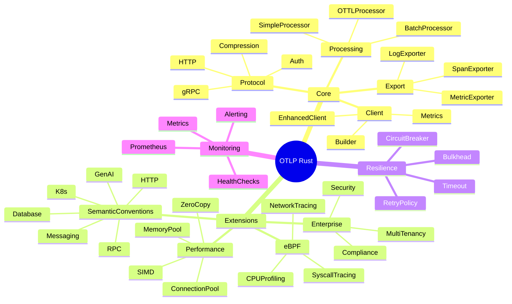
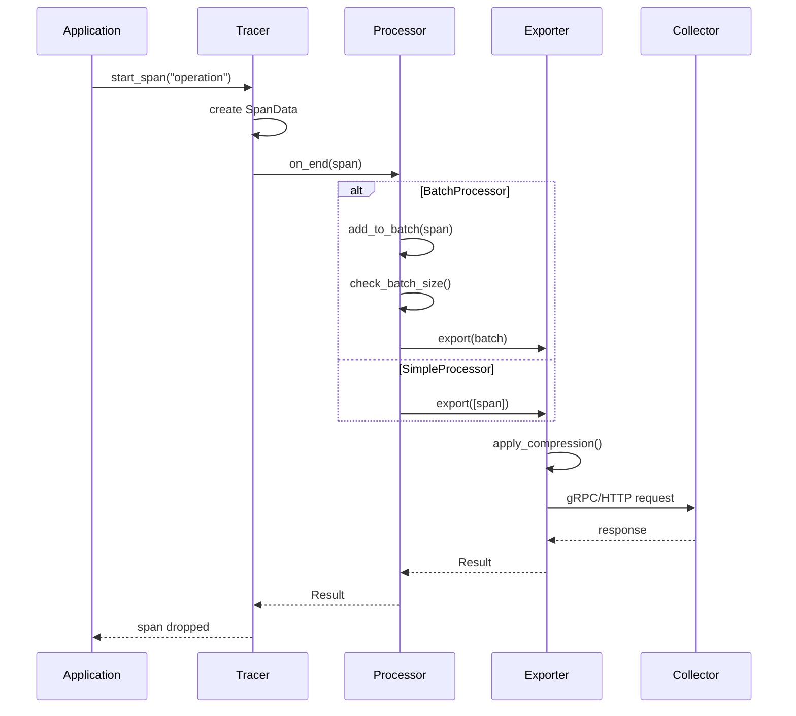
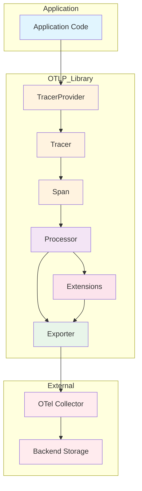
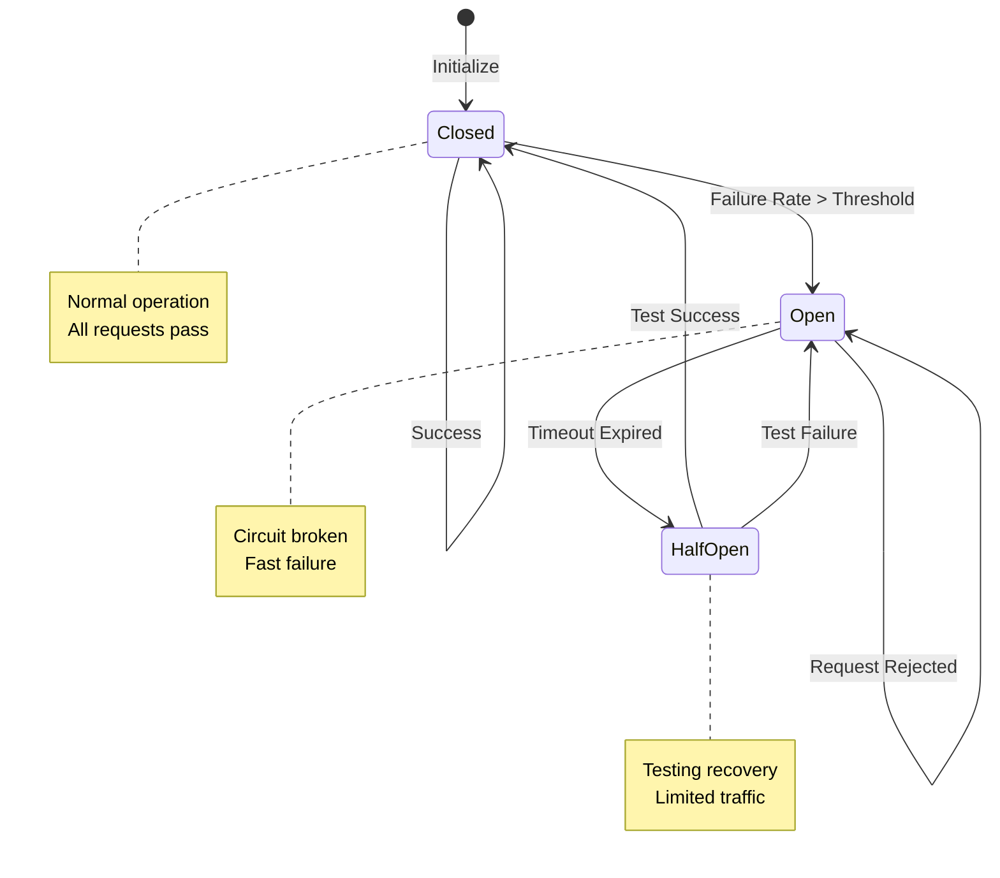
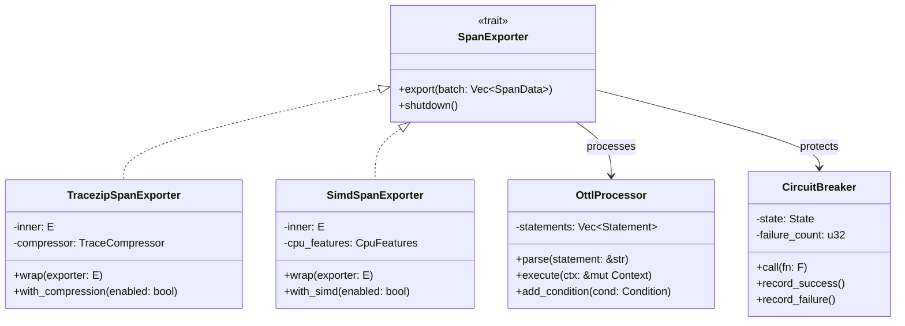
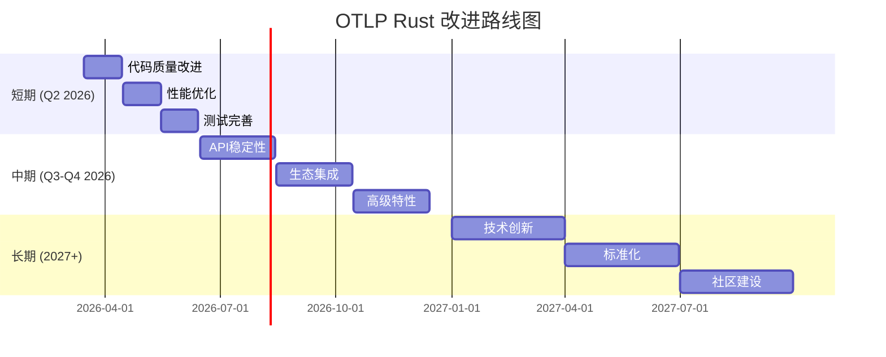
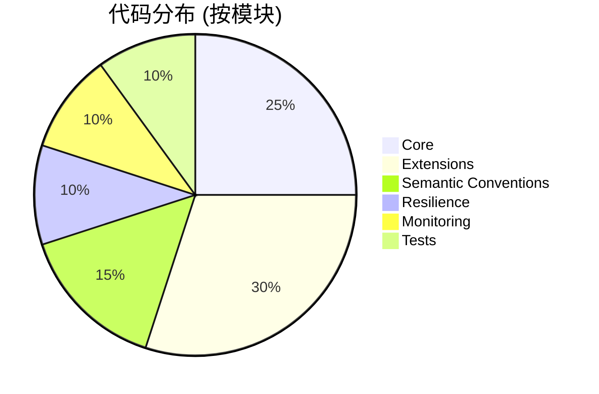
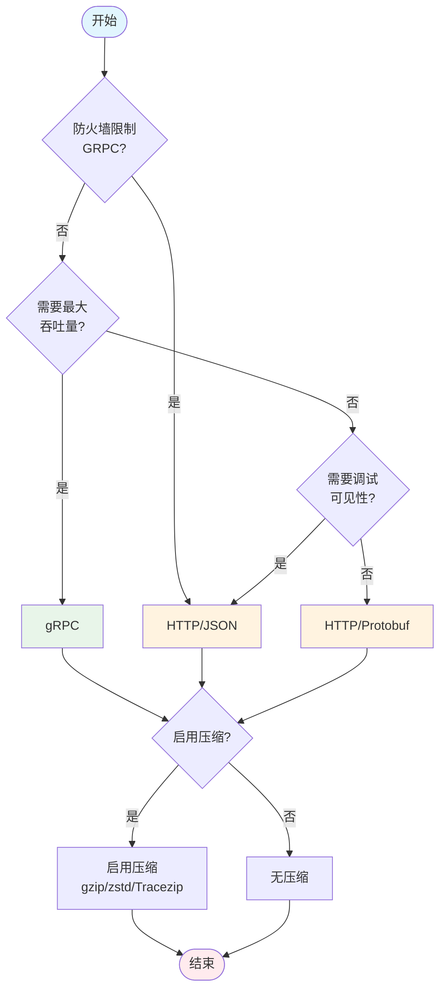

# OTLP Rust 项目 - 可视化图表集

> 本文件包含项目中使用的所有可视化图表的Mermaid代码和ASCII艺术表示

---

## 1. 系统架构思维导图 (Mermaid)



---

## 2. 数据流时序图 (Mermaid)



---

## 3. 组件依赖图 (Mermaid)



---

## 4. 状态转换图 - 断路器 (Mermaid)



---

## 5. 类图 - 核心组件 (Mermaid)



---

## 6. 甘特图 - 改进计划 (Mermaid)



---

## 7. 饼图 - 代码分布 (Mermaid)



---

## 8. 雷达图 - 质量评估 (ASCII)

```
                            类型安全
                               10
                                |
                                |
                                |
            性能  8 ------------+------------ 10  模块化
                 |              |              |
                 |              |              |
                 |              |              |
       可测试性  6 ------------+------------ 9  可扩展性
                 |              |              |
                 |              |              |
                 |              |              |
            文档  7 ------------+------------ 8  向后兼容
                                |
                                |
                               5
                            生态集成

    各维度评分 (1-10):
    • 类型安全: 10/10 - Rust编译器保证
    • 模块化: 9/10 - 清晰的架构分层
    • 可扩展性: 8/10 - 扩展点设计良好
    • 向后兼容: 8/10 - API稳定性待验证
    • 生态集成: 5/10 - 需要更多集成
    • 文档: 7/10 - API文档完整但教程不足
    • 可测试性: 6/10 - 单元测试良好但集成测试不足
    • 性能: 8/10 - 多层优化但SIMD未完全实现
```

---

## 9. 热力图 - 代码复杂度 (ASCII)

```
模块复杂度热力图 (圈复杂度)

                    低(1-5)  中(6-10)  高(11-20)  极高(>20)
                    ────────────────────────────────────────
client/mod.rs       ░░░░░░░░ ░░░░░░░░ ░░░░░░░░  ████████
ottl/processor.rs   ░░░░░░░░ ░░░░░░░░ ████████  ░░░░░░░░
simd/aggregation.rs ░░░░░░░░ ████████ ░░░░░░░░  ░░░░░░░░
compression/        ░░░░░░░░ ████████ ░░░░░░░░  ░░░░░░░░
ebpf/loader.rs      ░░░░░░░░ ████████ ░░░░░░░░  ░░░░░░░░
network/            ░░░░░░░░ ████████ ████████  ░░░░░░░░
resilience/         ░░░░░░░░ ████████ ░░░░░░░░  ░░░░░░░░
semantic_conv/      ████████ ░░░░░░░░ ░░░░░░░░  ░░░░░░░░

图例: ░░ = 无代码  ██ = 有代码

建议重点关注: client/mod.rs (极高复杂度需要重构)
```

---

## 10. 流程图 - 导出器选择决策 (Mermaid)



---

## 11. 网络拓扑图 - 部署架构 (ASCII)

```
┌─────────────────────────────────────────────────────────────────────────┐
│                         生产环境部署拓扑                                 │
├─────────────────────────────────────────────────────────────────────────┤
│                                                                         │
│   ┌──────────────┐                                                      │
│   │   负载均衡器   │                                                      │
│   │  (Ingress)   │                                                      │
│   └──────┬───────┘                                                      │
│          │                                                              │
│          ▼                                                              │
│   ┌──────────────────────────────────────────────────────────┐         │
│   │                 Kubernetes Cluster                        │         │
│   │  ┌─────────┐  ┌─────────┐  ┌─────────┐                  │         │
│   │  │ App Pod │  │ App Pod │  │ App Pod │     OTLP Library │         │
│   │  │ +Sidecar│  │ +Sidecar│  │ +Sidecar│     (自动注入)    │         │
│   │  └───┬─────┘  └────┬────┘  └────┬────┘                  │         │
│   │      │             │            │                        │         │
│   │      └─────────────┼────────────┘                        │         │
│   │                    ▼                                     │         │
│   │           ┌─────────────────┐                            │         │
│   │           │  Service Mesh   │                            │         │
│   │           │  (Istio/Linkerd)│                            │         │
│   │           └────────┬────────┘                            │         │
│   └────────────────────┼────────────────────────────────────┘         │
│                        │                                               │
│                        ▼                                               │
│   ┌──────────────────────────────────────────────────────────┐         │
│   │              OpenTelemetry Collector                      │         │
│   │  ┌─────────────┐  ┌─────────────┐  ┌─────────────┐       │         │
│   │  │   Receiver  │  │  Processor  │  │   Exporter  │       │         │
│   │  │  OTLP/gRPC  │→ │   Batch     │→ │  OTLP/HTTP  │────┐  │         │
│   │  │  OTLP/HTTP  │  │   Memory    │  │   Kafka     │    │  │         │
│   │  └─────────────┘  └─────────────┘  └─────────────┘    │  │         │
│   └────────────────────────────────────────────────────────┼──┘         │
│                                                            │            │
│                                                            ▼            │
│   ┌──────────────┐  ┌──────────────┐  ┌──────────────┐                   │
│   │   Jaeger     │  │   Prometheus │  │    Tempo     │                   │
│   │  (Tracing)   │  │  (Metrics)   │  │   (Traces)   │                   │
│   └──────────────┘  └──────────────┘  └──────────────┘                   │
│                                                                          │
└─────────────────────────────────────────────────────────────────────────┘
```

---

## 12. 表格对比 - 竞品分析

| 特性 | OTLP Rust | opentelemetry-rust | jaeger-client | zipkin-rs |
|------|-----------|-------------------|---------------|-----------|
| 语言 | Rust | Rust | Rust | Rust |
| 协议 | OTLP | OTLP | Jaeger Thrift | Zipkin HTTP |
| 信号 | Trace/Metric/Log | Trace/Metric/Log | Trace only | Trace only |
| SIMD优化 | ✅ | ❌ | ❌ | ❌ |
| eBPF支持 | ✅ | ❌ | ❌ | ❌ |
| OTTL转换 | ✅ | ❌ | ❌ | ❌ |
| Tracezip | ✅ | ❌ | ❌ | ❌ |
| 企业特性 | ✅ | ❌ | ❌ | ❌ |
| 成熟度 | Beta | Stable | Stable | Stable |

---

**图表生成**: 2026-03-15
**工具**: Mermaid + ASCII Art
**用途**: 文档、演示、架构评审
