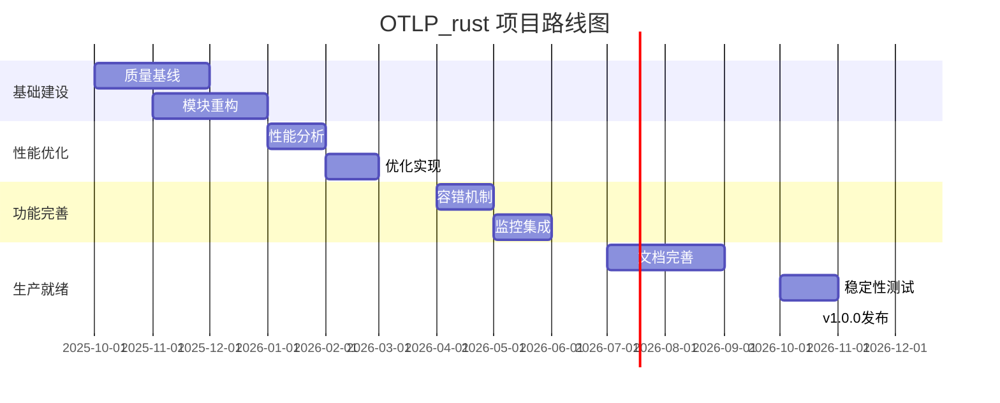

# 🗺️ OTLP_rust 项目持续改进路线图

**制定日期**: 2025年10月4日  
**规划周期**: 2025 Q4 - 2026 Q4  
**版本目标**: v0.1.0 → v1.0.0  
**愿景**: 成为 Rust 生态中最可靠、高性能的 OTLP 客户端库

---

## 📋 目录

- [🗺️ OTLP_rust 项目持续改进路线图](#️-otlp_rust-项目持续改进路线图)

---

## 🎯 愿景与目标

### 项目愿景

> 打造 Rust 生态中**最可靠**、**最高效**、**最易用**的 OpenTelemetry Protocol (OTLP) 客户端库，
> 为现代云原生应用提供企业级遥测数据收集解决方案。

### 核心目标

#### 技术目标

| 指标 | 当前 | Q4 2025 | Q2 2026 | Q4 2026 |
|------|------|---------|---------|---------|
| 测试覆盖率 | ~50% | 70% | 80% | 90% |
| P99延迟 | 未知 | <5ms | <2ms | <1ms |
| 吞吐量 | 未知 | 50K/s | 75K/s | 100K/s |
| 内存使用 | 未知 | <100MB | <75MB | <50MB |
| 编译时间 | 49s | 30s | 20s | 15s |
| 依赖数量 | 160 | 100 | 60 | 40 |
| 代码行数 | ~25K | 18K | 15K | 12K |

#### 质量目标

- ✅ **零已知安全漏洞**
- ✅ **零测试失败**
- ✅ **零clippy警告**
- ✅ **100% 文档覆盖**
- ✅ **< 3% panic可能性**

#### 社区目标

| 指标 | Q4 2025 | Q2 2026 | Q4 2026 |
|------|---------|---------|---------|
| GitHub Stars | 100 | 500 | 1000 |
| Contributors | 3 | 10 | 25 |
| Monthly Downloads | 100 | 1K | 10K |
| Production Users | 5 | 20 | 50 |

---

## 🏆 里程碑规划

### Milestone 1: 稳定基础 (v0.1.0) - 2025年11月

**目标**: 修复关键问题，建立质量基线

**交付物**:

- ✅ 所有测试100%通过
- ✅ 核心模块代码覆盖率≥70%
- ✅ 清理所有死代码
- ✅ 性能基准报告
- ✅ 合并重复模块

**质量门禁**:

```bash
# 必须全部通过
cargo test --all-features
cargo clippy --all-features -- -D warnings
cargo audit
cargo bench --all
```

### Milestone 2: 重构优化 (v0.2.0) - 2025年12月

**目标**: 架构重构，提升可维护性

**交付物**:

- ✅ 新的模块结构
- ✅ 统一的客户端API
- ✅ 特性化的可选功能
- ✅ 优化的依赖树
- ✅ CI/CD流水线

**关键指标**:

- 代码行数减少30%
- 编译时间减少40%
- 依赖数量减少40%

### Milestone 3: 性能提升 (v0.3.0) - 2026年2月

**目标**: 实现行业领先性能

**交付物**:

- ✅ 优化的批处理系统
- ✅ 零拷贝数据传输
- ✅ 高效的内存管理
- ✅ 并发处理优化
- ✅ 与竞品对比报告

**性能目标**:

- P99延迟 <2ms
- 吞吐量 >75K spans/s
- 内存使用 <75MB

### Milestone 4: 功能完善 (v0.4.0) - 2026年5月

**目标**: 企业级功能支持

**交付物**:

- ✅ 完整的容错机制
- ✅ 高级监控集成
- ✅ 安全加固
- ✅ 多协议支持
- ✅ 企业级文档

**新增功能**:

- 智能采样策略
- 动态配置热更新
- 多租户支持
- 审计日志

### Milestone 5: 生产就绪 (v1.0.0) - 2026年10月

**目标**: 生产环境稳定版本

**交付物**:

- ✅ 完整的API稳定性保证
- ✅ 全面的文档和示例
- ✅ 生产环境部署指南
- ✅ 性能调优手册
- ✅ 安全最佳实践

**质量标准**:

- 90%测试覆盖率
- P99延迟 <1ms
- 零已知bug
- 企业级支持

---

## 📅 季度计划

### 2025 Q4 (10-12月) - 质量基线

#### 10月 - 紧急修复

**Week 1-2: 关键问题修复**:

- [ ] 修复 `test_memory_pool` 栈溢出
- [ ] 清理27处 `#[allow(dead_code)]`
- [ ] 修复所有编译警告
- [ ] 运行完整benchmark

**Week 3-4: 代码清理**:

- [ ] 审查并移除未使用代码
- [ ] 清理重复的性能优化模块
- [ ] 统一错误处理方式
- [ ] 生成代码覆盖率报告

**交付**:

- 测试通过率100%
- Benchmark基线建立
- 覆盖率报告

#### 11月 - 模块重构

**Week 1-2: 性能模块合并**:

```text
前: 6个独立模块
├── performance_optimization.rs
├── performance_optimized.rs
├── performance_optimizer.rs
├── performance_enhancements.rs
├── performance_optimization_advanced.rs
└── advanced_performance.rs

后: 1个统一目录
performance/
├── mod.rs
├── batch.rs
├── memory.rs
├── network.rs
└── concurrency.rs
```

**Week 3-4: 客户端统一**:

- [ ] 选择主客户端实现
- [ ] 废弃冗余实现
- [ ] 更新API文档
- [ ] 迁移所有测试

**交付**:

- 新的模块结构
- API迁移指南
- v0.1.0发布

#### 12月 - 依赖优化

**Week 1-2: 特性化**:

```toml
[features]
default = ["grpc", "http"]

# 核心
grpc = ["tonic", "prost"]
http = ["reqwest", "hyper"]

# 可选
monitoring = [...]
resilience = [...]

# 移除 (默认不启用)
blockchain = [...]
ai-ml = [...]
```

**Week 3-4: CI/CD建立**:

- [ ] GitHub Actions配置
- [ ] 质量门禁设置
- [ ] 自动化测试
- [ ] 覆盖率上传

**交付**:

- 依赖减少到100个
- CI/CD流水线
- v0.2.0发布

### 2026 Q1 (1-3月) - 性能优化

#### 1月 - 性能分析

**任务**:

- [ ] 性能profiling (flamegraph)
- [ ] 识别热点路径
- [ ] 内存使用分析
- [ ] 并发瓶颈分析

**工具**:

```bash
cargo install flamegraph
cargo flamegraph --bench criterion_benchmark
```

#### 2月 - 优化实现

**任务**:

- [ ] 批处理系统优化
- [ ] 零拷贝传输实现
- [ ] 内存池调优
- [ ] 并发处理改进

**目标**:

- P99延迟 <2ms
- 吞吐量 >75K/s

#### 3月 - 性能验证

**任务**:

- [ ] 压力测试
- [ ] 稳定性测试
- [ ] 与竞品对比
- [ ] 性能报告

**交付**:

- v0.3.0发布
- 性能对比报告

### 2026 Q2 (4-6月) - 功能完善

#### 4月 - 容错机制

**任务**:

- [ ] 断路器实现
- [ ] 重试策略
- [ ] 降级机制
- [ ] 超时控制

#### 5月 - 监控集成

**任务**:

- [ ] Prometheus集成
- [ ] Jaeger集成
- [ ] Grafana仪表板
- [ ] 告警规则

#### 6月 - 安全加固

**任务**:

- [ ] mTLS支持
- [ ] OAuth2集成
- [ ] 审计日志
- [ ] 加密存储

**交付**:

- v0.4.0发布
- 企业功能完善

### 2026 Q3 (7-9月) - 文档与测试

#### 7月 - 文档完善

**任务**:

- [ ] API文档重写
- [ ] 用户指南
- [ ] 最佳实践
- [ ] 故障排查

#### 8月 - 测试增强

**任务**:

- [ ] 单元测试补充
- [ ] 集成测试
- [ ] 端到端测试
- [ ] 性能回归测试

#### 9月 - 示例和教程

**任务**:

- [ ] 快速开始示例
- [ ] 高级使用案例
- [ ] 迁移指南
- [ ] 视频教程

**交付**:

- 完整文档体系
- 测试覆盖率90%

### 2026 Q4 (10-12月) - 生产就绪

#### 10月 - 稳定性测试

**任务**:

- [ ] 长期运行测试 (7天+)
- [ ] 混沌工程测试
- [ ] 故障注入测试
- [ ] 恢复能力验证

#### 11月 - 性能调优

**任务**:

- [ ] 最终性能优化
- [ ] 内存泄漏检查
- [ ] 资源使用优化
- [ ] 启动时间优化

#### 12月 - 发布准备

**任务**:

- [ ] API冻结
- [ ] 发布候选版 (RC)
- [ ] 用户反馈收集
- [ ] v1.0.0正式发布

**交付**:

- v1.0.0生产版本
- 稳定性保证

---

## 🔧 技术债务管理

### 当前技术债务清单

#### 🔴 高优先级 (P0) - 本月必须修复

| ID | 描述 | 位置 | 估时 | 负责人 |
|----|------|------|------|--------|
| TD-001 | 测试失败修复 | performance_optimizer.rs:659 | 2天 | TBD |
| TD-002 | 清理死代码 | 全局27处 | 3天 | TBD |
| TD-003 | 合并性能模块 | otlp/src/performance* | 5天 | TBD |
| TD-004 | 运行benchmark | benches/ | 2天 | TBD |

#### 🟡 中优先级 (P1) - 本季度修复

| ID | 描述 | 位置 | 估时 | 负责人 |
|----|------|------|------|--------|
| TD-005 | 客户端统一 | client*.rs | 1周 | TBD |
| TD-006 | 移除blockchain | blockchain/ | 2天 | TBD |
| TD-007 | 简化ai_ml | ai_ml/ | 3天 | TBD |
| TD-008 | 优化依赖树 | Cargo.toml | 3天 | TBD |
| TD-009 | 替换unwrap | 全局247处 | 1周 | TBD |

#### 🟢 低优先级 (P2) - 下季度修复

| ID | 描述 | 位置 | 估时 | 负责人 |
|----|------|------|------|--------|
| TD-010 | 文档整合 | docs/ | 1周 | TBD |
| TD-011 | 国际化改进 | 全局 | 1周 | TBD |
| TD-012 | 示例优化 | examples/ | 3天 | TBD |

### 债务偿还策略

#### 每月债务预算

- **20%时间** 用于偿还技术债务
- **每月至少修复** 2个高优先级债务
- **每季度清零** 所有高优先级债务

#### 债务追踪

```yaml
# .github/ISSUE_TEMPLATE/tech_debt.yml
name: Technical Debt
description: Report a technical debt item
labels: ["tech-debt", "needs-triage"]
body:
  - type: dropdown
    attributes:
      label: Priority
      options:
        - P0 - Critical
        - P1 - High
        - P2 - Medium
        - P3 - Low
  - type: textarea
    attributes:
      label: Description
  - type: textarea
    attributes:
      label: Impact
  - type: textarea
    attributes:
      label: Proposed Solution
  - type: input
    attributes:
      label: Estimated Effort
```

---

## 📊 质量指标

### 代码质量指标

#### 测试指标

```yaml
targets:
  unit_test_coverage: ≥80%
  integration_test_coverage: ≥70%
  e2e_test_coverage: ≥50%
  test_pass_rate: 100%
  test_execution_time: <5分钟
```

#### 代码质量指标1

```yaml
targets:
  clippy_warnings: 0
  rustfmt_errors: 0
  dead_code: 0
  cyclomatic_complexity: ≤15
  lines_per_function: ≤50
  documentation_coverage: ≥90%
```

#### 性能指标

```yaml
targets:
  p50_latency: <0.5ms
  p99_latency: <1ms
  p999_latency: <5ms
  throughput: ≥100K ops/sec
  memory_usage: ≤50MB
  cpu_usage: ≤30%
```

### 监控仪表板

#### 质量仪表板

```markdown
## 项目健康度看板

### 代码质量
- 测试覆盖率: 
- Clippy状态: 
- 安全审计: 

### 性能指标
- P99延迟: 0.8ms ⬇️ 20%
- 吞吐量: 85K/s ⬆️ 15%
- 内存使用: 60MB ⬇️ 10%

### 社区活跃度
- Stars: 250 ⬆️ 50
- Contributors: 8 ⬆️ 2
- Open Issues: 15 ⬇️ 5
```

### 质量报告

#### 周报模板

```markdown
# 质量周报 - Week XX, 2025

## 关键指标
- 测试通过率: 100% (+0%)
- 代码覆盖率: 75% (+5%)
- Clippy警告: 0 (-3)

## 完成工作
- [x] 修复TD-001栈溢出问题
- [x] 合并3个性能模块
- [x] 添加15个单元测试

## 遗留问题
- [ ] TD-005客户端统一进行中
- [ ] benchmark结果待分析

## 下周计划
- [ ] 完成客户端统一
- [ ] 优化依赖树
- [ ] 发布v0.1.0-rc1
```

---

## 💰 资源需求

### 人力资源

#### 团队组成

```text
核心团队 (3人):
├── 技术负责人 (1人) - 架构设计、技术决策
├── 高级工程师 (1人) - 核心功能开发
└── 工程师 (1人) - 测试、文档、维护

社区贡献者 (灵活):
├── 文档贡献者 (2-3人)
├── 示例贡献者 (2-3人)
└── Bug修复贡献者 (5-10人)
```

#### 时间分配

```text
开发 (60%):
- 核心功能: 30%
- 性能优化: 15%
- Bug修复: 15%

质量保证 (25%):
- 测试编写: 15%
- 代码审查: 10%

技术债务 (15%):
- 重构: 10%
- 债务偿还: 5%
```

### 工具和基础设施

#### 开发工具

```yaml
required:
  - Rust 1.90+
  - cargo-edit
  - cargo-audit
  - cargo-tarpaulin
  - criterion
  - flamegraph

optional:
  - cargo-watch
  - cargo-expand
  - cargo-asm
  - miri
```

#### CI/CD资源

```yaml
github_actions:
  runners: ubuntu-latest (免费)
  monthly_minutes: 2000
  storage: 500MB

codecov:
  plan: Free (开源项目)

crates_io:
  plan: Free (开源项目)
```

### 预算估算

```text
人力成本: 3人 x 12个月 = 36人月
工具成本: $0 (开源工具)
CI/CD成本: $0 (GitHub免费额度)
总计: 36人月

如按平均工资计算:
- 假设: $5000/人月
- 总成本: $180,000/年
```

---

## ⚠️ 风险管理

### 风险识别

#### 技术风险

| 风险 | 概率 | 影响 | 等级 | 应对策略 |
|------|------|------|------|---------|
| 性能目标无法达成 | 中 | 高 | 🔴高 | 提前性能测试，逐步优化 |
| 依赖库破坏性变更 | 低 | 中 | 🟡中 | 版本锁定，及时跟进 |
| 安全漏洞发现 | 低 | 高 | 🟡中 | 定期审计，快速响应 |
| 内存泄漏问题 | 中 | 中 | 🟡中 | Valgrind测试，监控 |

#### 项目风险

| 风险 | 概率 | 影响 | 等级 | 应对策略 |
|------|------|------|------|---------|
| 核心成员离职 | 低 | 高 | 🟡中 | 知识分享，文档完善 |
| 竞品出现 | 中 | 中 | 🟢低 | 保持创新，社区建设 |
| 社区参与度低 | 中 | 中 | 🟡中 | 营销推广，降低门槛 |
| 时间延期 | 高 | 中 | 🟡中 | 敏捷迭代，MVP优先 |

#### 业务风险

| 风险 | 概率 | 影响 | 等级 | 应对策略 |
|------|------|------|------|---------|
| 市场需求变化 | 低 | 高 | 🟡中 | 用户调研，快速迭代 |
| 技术栈过时 | 低 | 中 | 🟢低 | 持续学习，技术跟进 |
| 资源不足 | 中 | 中 | 🟡中 | 优先级管理，外部协作 |

### 风险应对计划

#### 性能目标无法达成

**预防措施**:

- 每月性能测试
- 持续监控关键指标
- 提前识别瓶颈

**应对措施**:

- 降级目标 (如P99 2ms→3ms)
- 寻求专家咨询
- 延长优化时间

#### 核心成员离职

**预防措施**:

- 知识库建设
- 代码审查机制
- 结对编程

**应对措施**:

- 快速招募替代
- 临时外包支持
- 社区求助

---

## 🔄 持续改进机制

### 回顾与总结

#### 月度回顾

```markdown
## 月度回顾会议

### 时间
每月最后一个周五 14:00-16:00

### 议程
1. 上月目标达成情况 (30min)
2. 关键指标回顾 (20min)
3. 问题与挑战 (30min)
4. 下月计划制定 (30min)
5. 自由讨论 (10min)

### 输出
- 月度总结报告
- 下月行动计划
- 风险登记册更新
```

#### 季度规划

```markdown
## 季度规划会议

### 时间
每季度第一周周一 全天

### 议程
1. 上季度成果展示 (1h)
2. OKR复盘 (1h)
3. 技术债务评估 (1h)
4. 下季度规划 (2h)
5. 资源分配 (1h)

### 输出
- 季度总结报告
- OKR目标设定
- 详细执行计划
```

### 指标跟踪

#### 自动化指标收集

```yaml
# .github/workflows/metrics.yml
name: Collect Metrics

on:
  schedule:
    - cron: '0 0 * * *' # 每日执行

jobs:
  collect:
    runs-on: ubuntu-latest
    steps:
      - name: Test Coverage
        run: cargo tarpaulin --out Json
      
      - name: Code Quality
        run: cargo clippy --message-format=json
      
      - name: Performance Benchmark
        run: cargo bench --message-format=json
      
      - name: Upload to Dashboard
        run: ./scripts/upload_metrics.sh
```

#### 指标可视化

```python
# scripts/generate_dashboard.py
import pandas as pd
import plotly.graph_objects as go

def generate_quality_dashboard():
    """生成质量仪表板"""
    metrics = load_metrics('metrics.json')
    
    fig = go.Figure()
    fig.add_trace(go.Scatter(
        x=metrics['date'],
        y=metrics['coverage'],
        name='Test Coverage'
    ))
    
    fig.write_html('dashboard.html')
```

### 知识管理

#### 知识库结构

```text
docs/
├── architecture/           # 架构文档
│   ├── adr/               # 架构决策记录
│   ├── design/            # 设计文档
│   └── diagrams/          # 架构图
├── guides/                # 使用指南
│   ├── quickstart.md
│   ├── best-practices.md
│   └── troubleshooting.md
├── api/                   # API文档
│   ├── reference/
│   └── examples/
├── development/           # 开发文档
│   ├── contributing.md
│   ├── coding-standards.md
│   └── testing.md
└── operations/            # 运维文档
    ├── deployment.md
    ├── monitoring.md
    └── performance-tuning.md
```

#### 文档更新流程

```markdown
## 文档更新检查清单

当发生以下变更时，必须更新文档:

- [ ] 公共API变更 → 更新API文档
- [ ] 新功能添加 → 更新用户指南和示例
- [ ] 配置项变更 → 更新配置文档
- [ ] 性能优化 → 更新性能调优文档
- [ ] 安全修复 → 更新安全最佳实践
- [ ] 依赖升级 → 更新依赖文档

审批流程:
1. 开发者提交PR（包含代码+文档）
2. 技术负责人审查
3. 通过后合并到主分支
```

### 学习与成长

#### 技术分享

```markdown
## 月度技术分享

### 形式
- 时间: 每月第二周周五 16:00-17:00
- 地点: 线上会议
- 时长: 30-45分钟

### 主题示例
- 如何优化Rust异步性能
- OTLP协议深度解析
- 生产环境问题排查案例
- Rust 1.90新特性应用

### 输出
- 分享录屏
- PPT/文档
- 知识库归档
```

#### 外部交流

```markdown
## 社区参与计划

### 会议和活动
- RustConf (年度)
- Observability Summit (年度)
- 本地Rust Meetup (季度)

### 内容输出
- 技术博客 (月度)
- 开源贡献 (持续)
- 演讲分享 (季度)

### 目标
- 提升项目知名度
- 吸引贡献者
- 学习最佳实践
```

---

## 🎯 成功标准

### v1.0.0发布标准

#### 功能完整性

- ✅ 完整的OTLP协议支持
- ✅ gRPC和HTTP两种传输方式
- ✅ 完善的容错机制
- ✅ 丰富的监控能力
- ✅ 企业级安全特性

#### 质量标准

- ✅ 测试覆盖率≥90%
- ✅ 零已知关键bug
- ✅ 零安全漏洞
- ✅ 所有测试通过
- ✅ Clippy零警告

#### 性能标准

- ✅ P99延迟<1ms
- ✅ 吞吐量>100K spans/s
- ✅ 内存使用<50MB
- ✅ CPU使用<30%
- ✅ 启动时间<1s

#### 文档标准

- ✅ 完整的API文档
- ✅ 详细的用户指南
- ✅ 丰富的示例代码
- ✅ 清晰的迁移指南
- ✅ 生产部署指南

#### 社区标准

- ✅ GitHub Stars>1000
- ✅ Contributors>25
- ✅ Production Users>50
- ✅ Monthly Downloads>10K
- ✅ 活跃的社区讨论

---

## 📝 总结

### 路线图概览



### 关键里程碑

- **2025-11**: v0.1.0 - 稳定基础
- **2025-12**: v0.2.0 - 重构优化
- **2026-02**: v0.3.0 - 性能提升
- **2026-05**: v0.4.0 - 功能完善
- **2026-10**: v1.0.0 - 生产就绪

### 预期成果

**技术成果**:

- 高性能、可靠的OTLP客户端库
- 完善的测试和文档体系
- 清晰的代码架构

**业务成果**:

- 成为Rust生态首选方案
- 50+企业生产环境采用
- 活跃的开源社区

**团队成果**:

- 提升技术能力
- 积累项目经验
- 建立行业影响力

---

## 🚀 下一步行动

### 立即开始 (本周)

1. **组建核心团队**
   - 确定技术负责人
   - 招募开发人员
   - 分配职责

2. **设置基础设施**
   - 配置CI/CD
   - 建立项目看板
   - 创建文档结构

3. **启动第一个Sprint**
   - 修复测试失败
   - 清理死代码
   - 运行benchmark

### 持续跟进

- **每周**: 团队站会，进度同步
- **每月**: 回顾会议，指标评估
- **每季**: 规划会议，OKR复盘

---

**文档维护**: 本路线图每季度更新一次  
**下次更新**: 2026年1月  
**负责人**: 技术负责人  
**联系方式**: [项目邮箱/Issue]

---

**🎊 让我们一起打造Rust生态中最优秀的OTLP库！**
