# 控制平面与数据平面分析

## 📋 目录

- [控制平面与数据平面分析](#控制平面与数据平面分析)
  - [📋 目录](#-目录)
  - [概述](#概述)
  - [架构设计原理](#架构设计原理)
    - [1. 平面分离架构](#1-平面分离架构)
    - [2. 平面职责划分](#2-平面职责划分)
      - [2.1 控制平面职责](#21-控制平面职责)
      - [2.2 数据平面职责](#22-数据平面职责)
  - [控制平面实现](#控制平面实现)
    - [1. 配置管理系统](#1-配置管理系统)
    - [2. 策略管理系统](#2-策略管理系统)
    - [3. 状态管理系统](#3-状态管理系统)
  - [数据平面实现](#数据平面实现)
    - [1. 数据收集引擎](#1-数据收集引擎)
    - [2. 数据处理管道](#2-数据处理管道)
    - [3. 数据传输优化](#3-数据传输优化)
  - [平面间通信协议](#平面间通信协议)
    - [1. 控制平面到数据平面](#1-控制平面到数据平面)
    - [2. 数据平面到控制平面](#2-数据平面到控制平面)
  - [性能优化策略](#性能优化策略)
    - [1. 控制平面优化](#1-控制平面优化)
    - [2. 数据平面优化](#2-数据平面优化)
  - [监控与可观测性](#监控与可观测性)
    - [1. 控制平面监控](#1-控制平面监控)
    - [2. 数据平面监控](#2-数据平面监控)
  - [实际应用案例](#实际应用案例)
    - [1. 微服务架构中的平面分离](#1-微服务架构中的平面分离)
    - [2. 云原生环境中的平面分离](#2-云原生环境中的平面分离)
  - [未来发展方向](#未来发展方向)
    - [1. 智能化控制平面](#1-智能化控制平面)
    - [2. 高性能数据平面](#2-高性能数据平面)
    - [3. 统一平面管理](#3-统一平面管理)
  - [总结](#总结)

## 概述

控制平面与数据平面的分离是现代分布式系统架构的核心设计原则。
本文档深入分析OTLP在控制平面和数据平面中的实现，包括架构设计、协议实现、性能优化等关键技术。

## 架构设计原理

### 1. 平面分离架构

```mermaid
graph TB
    subgraph "控制平面 (Control Plane)"
        CP[控制平面]
        CM[配置管理]
        PM[策略管理]
        SM[状态管理]
        RM[资源管理]
    end

    subgraph "数据平面 (Data Plane)"
        DP[数据平面]
        DC[数据收集]
        DP2[数据处理]
        DT[数据传输]
        DS[数据存储]
    end

    subgraph "管理接口"
        API[REST API]
        CLI[CLI工具]
        UI[Web UI]
        SDK[SDK接口]
    end

    subgraph "数据接口"
        OTLP[OTLP协议]
        GRPC[gRPC接口]
        HTTP[HTTP接口]
        MQTT[MQTT接口]
    end

    CP --> DP
    API --> CP
    CLI --> CP
    UI --> CP
    SDK --> CP

    OTLP --> DP
    GRPC --> DP
    HTTP --> DP
    MQTT --> DP
```



### 2. 平面职责划分

#### 2.1 控制平面职责

- **配置管理**: 系统配置的集中管理和分发
- **策略管理**: 业务策略的定义和执行
- **状态管理**: 系统状态的监控和维护
- **资源管理**: 计算资源的分配和调度
- **服务发现**: 服务注册和发现机制

#### 2.2 数据平面职责

- **数据收集**: 遥测数据的采集和预处理
- **数据处理**: 数据的转换、过滤和聚合
- **数据传输**: 数据的高效传输和路由
- **数据存储**: 数据的持久化存储和管理
- **协议处理**: 各种协议的解析和处理

## 控制平面实现

### 1. 配置管理系统

```rust
// 控制平面配置管理
pub struct ControlPlaneConfigManager {
    pub config_store: ConfigStore,
    pub version_manager: VersionManager,
    pub distribution_engine: DistributionEngine,
    pub validation_engine: ValidationEngine,
}

pub struct ConfigStore {
    pub database: Database,
    pub cache: Cache,
    pub encryption: EncryptionEngine,
}

impl ControlPlaneConfigManager {
    pub async fn create_config(
        &mut self,
        config: &Config
    ) -> Result<ConfigId, ConfigError> {
        // 验证配置
        self.validation_engine.validate_config(config).await?;

        // 生成配置ID
        let config_id = ConfigId::new();

        // 存储配置
        self.config_store.store_config(&config_id, config).await?;

        // 创建版本
        let version = self.version_manager.create_version(&config_id, config).await?;

        // 分发配置
        self.distribution_engine.distribute_config(&config_id, &version).await?;

        Ok(config_id)
    }

    pub async fn update_config(
        &mut self,
        config_id: &ConfigId,
        updates: &ConfigUpdates
    ) -> Result<ConfigVersion, ConfigError> {
        // 获取当前配置
        let current_config = self.config_store.get_config(config_id).await?;

        // 应用更新
        let updated_config = self.apply_updates(&current_config, updates)?;

        // 验证更新后的配置
        self.validation_engine.validate_config(&updated_config).await?;

        // 创建新版本
        let new_version = self.version_manager.create_version(config_id, &updated_config).await?;

        // 分发更新
        self.distribution_engine.distribute_config(config_id, &new_version).await?;

        Ok(new_version)
    }

    pub async fn rollback_config(
        &mut self,
        config_id: &ConfigId,
        target_version: &ConfigVersion
    ) -> Result<(), ConfigError> {
        // 获取目标版本配置
        let target_config = self.version_manager.get_version(config_id, target_version).await?;

        // 验证回滚配置
        self.validation_engine.validate_config(&target_config).await?;

        // 创建回滚版本
        let rollback_version = self.version_manager.create_version(config_id, &target_config).await?;

        // 分发回滚配置
        self.distribution_engine.distribute_config(config_id, &rollback_version).await?;

        Ok(())
    }
}
```

### 2. 策略管理系统

```rust
// 控制平面策略管理
pub struct PolicyManager {
    pub policy_store: PolicyStore,
    pub policy_engine: PolicyEngine,
    pub conflict_resolver: ConflictResolver,
    pub audit_logger: AuditLogger,
}

pub struct Policy {
    pub policy_id: PolicyId,
    pub name: String,
    pub description: String,
    pub rules: Vec<PolicyRule>,
    pub scope: PolicyScope,
    pub priority: u8,
    pub effective_time: DateTime<Utc>,
    pub expiration_time: Option<DateTime<Utc>>,
}

pub struct PolicyRule {
    pub rule_id: RuleId,
    pub condition: RuleCondition,
    pub action: RuleAction,
    pub parameters: HashMap<String, Value>,
}

impl PolicyManager {
    pub async fn create_policy(
        &mut self,
        policy: &Policy
    ) -> Result<PolicyId, PolicyError> {
        // 检查策略冲突
        let conflicts = self.detect_policy_conflicts(policy).await?;
        if !conflicts.is_empty() {
            return Err(PolicyError::ConflictsDetected(conflicts));
        }

        // 存储策略
        let policy_id = self.policy_store.store_policy(policy).await?;

        // 编译策略规则
        self.policy_engine.compile_policy(policy).await?;

        // 记录审计日志
        self.audit_logger.log_policy_creation(&policy_id, policy).await?;

        Ok(policy_id)
    }

    pub async fn evaluate_policy(
        &self,
        context: &PolicyContext
    ) -> Result<PolicyDecision, PolicyError> {
        // 获取适用的策略
        let applicable_policies = self.get_applicable_policies(context).await?;

        // 按优先级排序
        let sorted_policies = self.sort_policies_by_priority(applicable_policies);

        // 评估策略
        let mut decisions = Vec::new();
        for policy in sorted_policies {
            let decision = self.policy_engine.evaluate_policy(policy, context).await?;
            decisions.push(decision);

            // 如果策略明确拒绝，停止评估
            if decision.action == PolicyAction::Deny {
                break;
            }
        }

        // 合并决策
        let final_decision = self.merge_decisions(decisions)?;

        // 记录决策日志
        self.audit_logger.log_policy_decision(context, &final_decision).await?;

        Ok(final_decision)
    }

    async fn detect_policy_conflicts(
        &self,
        policy: &Policy
    ) -> Result<Vec<PolicyConflict>, PolicyError> {
        let existing_policies = self.policy_store.get_policies_by_scope(&policy.scope).await?;
        let mut conflicts = Vec::new();

        for existing_policy in existing_policies {
            for rule in &policy.rules {
                for existing_rule in &existing_policy.rules {
                    if self.rules_conflict(rule, existing_rule) {
                        conflicts.push(PolicyConflict {
                            new_rule: rule.clone(),
                            existing_rule: existing_rule.clone(),
                            conflict_type: self.determine_conflict_type(rule, existing_rule),
                        });
                    }
                }
            }
        }

        Ok(conflicts)
    }
}
```

### 3. 状态管理系统

```rust
// 控制平面状态管理
pub struct StateManager {
    pub state_store: StateStore,
    pub state_synchronizer: StateSynchronizer,
    pub consistency_checker: ConsistencyChecker,
    pub state_notifier: StateNotifier,
}

pub struct SystemState {
    pub state_id: StateId,
    pub components: HashMap<ComponentId, ComponentState>,
    pub global_state: GlobalState,
    pub timestamp: DateTime<Utc>,
    pub version: StateVersion,
}

pub struct ComponentState {
    pub component_id: ComponentId,
    pub status: ComponentStatus,
    pub metrics: ComponentMetrics,
    pub configuration: ComponentConfiguration,
    pub last_heartbeat: DateTime<Utc>,
}

impl StateManager {
    pub async fn update_component_state(
        &mut self,
        component_id: &ComponentId,
        state: &ComponentState
    ) -> Result<(), StateError> {
        // 验证状态
        self.validate_component_state(state)?;

        // 更新状态存储
        self.state_store.update_component_state(component_id, state).await?;

        // 检查一致性
        let consistency_result = self.consistency_checker.check_consistency().await?;
        if !consistency_result.is_consistent {
            self.handle_consistency_violation(&consistency_result).await?;
        }

        // 同步状态
        self.state_synchronizer.synchronize_state().await?;

        // 通知状态变化
        self.state_notifier.notify_state_change(component_id, state).await?;

        Ok(())
    }

    pub async fn get_system_state(&self) -> Result<SystemState, StateError> {
        let components = self.state_store.get_all_component_states().await?;
        let global_state = self.compute_global_state(&components).await?;

        Ok(SystemState {
            state_id: StateId::new(),
            components,
            global_state,
            timestamp: Utc::now(),
            version: self.state_store.get_current_version().await?,
        })
    }

    async fn compute_global_state(
        &self,
        components: &HashMap<ComponentId, ComponentState>
    ) -> Result<GlobalState, StateError> {
        let mut healthy_components = 0;
        let mut total_components = components.len();
        let mut total_cpu_usage = 0.0;
        let mut total_memory_usage = 0.0;

        for (_, component) in components {
            if component.status == ComponentStatus::Healthy {
                healthy_components += 1;
            }
            total_cpu_usage += component.metrics.cpu_usage;
            total_memory_usage += component.metrics.memory_usage;
        }

        let health_ratio = if total_components > 0 {
            healthy_components as f64 / total_components as f64
        } else {
            0.0
        };

        Ok(GlobalState {
            health_ratio,
            average_cpu_usage: total_cpu_usage / total_components as f64,
            average_memory_usage: total_memory_usage / total_components as f64,
            total_components,
            healthy_components,
        })
    }
}
```

## 数据平面实现

### 1. 数据收集引擎

```rust
// 数据平面数据收集
pub struct DataCollectionEngine {
    pub collectors: HashMap<CollectorType, Box<dyn DataCollector>>,
    pub buffer_manager: BufferManager,
    pub filter_engine: FilterEngine,
    pub compression_engine: CompressionEngine,
}

pub trait DataCollector {
    async fn collect_data(&mut self) -> Result<Vec<TelemetryData>, CollectionError>;
    async fn configure(&mut self, config: &CollectorConfig) -> Result<(), ConfigError>;
    async fn get_status(&self) -> Result<CollectorStatus, StatusError>;
}

pub struct MetricsCollector {
    pub metric_sources: Vec<MetricSource>,
    pub collection_interval: Duration,
    pub buffer_size: usize,
}

impl DataCollector for MetricsCollector {
    async fn collect_data(&mut self) -> Result<Vec<TelemetryData>, CollectionError> {
        let mut collected_data = Vec::new();

        for source in &self.metric_sources {
            let metrics = source.collect_metrics().await?;
            for metric in metrics {
                collected_data.push(TelemetryData::Metric(metric));
            }
        }

        Ok(collected_data)
    }

    async fn configure(&mut self, config: &CollectorConfig) -> Result<(), ConfigError> {
        if let Some(interval) = config.collection_interval {
            self.collection_interval = interval;
        }
        if let Some(buffer_size) = config.buffer_size {
            self.buffer_size = buffer_size;
        }
        Ok(())
    }

    async fn get_status(&self) -> Result<CollectorStatus, StatusError> {
        Ok(CollectorStatus {
            is_running: true,
            last_collection: Some(Utc::now()),
            collected_count: 0, // 实际实现中需要维护计数
            error_count: 0,
        })
    }
}

impl DataCollectionEngine {
    pub async fn start_collection(&mut self) -> Result<(), CollectionError> {
        for (collector_type, collector) in &mut self.collectors {
            collector.configure(&self.get_collector_config(collector_type)).await?;
        }

        // 启动收集任务
        let collection_tasks: Vec<_> = self.collectors.iter_mut().map(|(_, collector)| {
            self.spawn_collection_task(collector)
        }).collect();

        // 等待所有收集任务
        futures::future::join_all(collection_tasks).await;

        Ok(())
    }

    async fn spawn_collection_task(
        &self,
        collector: &mut Box<dyn DataCollector>
    ) -> Result<(), CollectionError> {
        loop {
            match collector.collect_data().await {
                Ok(data) => {
                    // 处理收集到的数据
                    self.process_collected_data(data).await?;
                },
                Err(e) => {
                    // 处理收集错误
                    self.handle_collection_error(e).await?;
                }
            }

            // 等待下次收集
            tokio::time::sleep(Duration::from_secs(1)).await;
        }
    }

    async fn process_collected_data(
        &self,
        data: Vec<TelemetryData>
    ) -> Result<(), ProcessingError> {
        // 过滤数据
        let filtered_data = self.filter_engine.filter_data(data).await?;

        // 压缩数据
        let compressed_data = self.compression_engine.compress_data(&filtered_data).await?;

        // 缓冲数据
        self.buffer_manager.add_data(compressed_data).await?;

        Ok(())
    }
}
```

### 2. 数据处理管道

```rust
// 数据平面数据处理
pub struct DataProcessingPipeline {
    pub processors: Vec<Box<dyn DataProcessor>>,
    pub pipeline_config: PipelineConfig,
    pub error_handler: ErrorHandler,
    pub metrics_collector: PipelineMetricsCollector,
}

pub trait DataProcessor {
    async fn process(&mut self, data: &mut TelemetryData) -> Result<(), ProcessingError>;
    async fn configure(&mut self, config: &ProcessorConfig) -> Result<(), ConfigError>;
    async fn get_metrics(&self) -> Result<ProcessorMetrics, MetricsError>;
}

pub struct TransformationProcessor {
    pub transformation_rules: Vec<TransformationRule>,
    pub cache: TransformationCache,
}

impl DataProcessor for TransformationProcessor {
    async fn process(&mut self, data: &mut TelemetryData) -> Result<(), ProcessingError> {
        for rule in &self.transformation_rules {
            if rule.matches(data) {
                rule.apply(data)?;
            }
        }
        Ok(())
    }

    async fn configure(&mut self, config: &ProcessorConfig) -> Result<(), ConfigError> {
        if let Some(rules) = &config.transformation_rules {
            self.transformation_rules = rules.clone();
        }
        Ok(())
    }

    async fn get_metrics(&self) -> Result<ProcessorMetrics, MetricsError> {
        Ok(ProcessorMetrics {
            processed_count: 0, // 实际实现中需要维护计数
            error_count: 0,
            average_processing_time: Duration::from_millis(1),
        })
    }
}

impl DataProcessingPipeline {
    pub async fn process_data(
        &mut self,
        mut data: TelemetryData
    ) -> Result<TelemetryData, ProcessingError> {
        let start_time = Instant::now();

        for (i, processor) in self.processors.iter_mut().enumerate() {
            match processor.process(&mut data).await {
                Ok(()) => {
                    // 记录成功处理
                    self.metrics_collector.record_success(i, start_time.elapsed()).await?;
                },
                Err(e) => {
                    // 处理错误
                    self.error_handler.handle_error(i, &e, &data).await?;

                    // 根据错误处理策略决定是否继续
                    if self.pipeline_config.error_strategy == ErrorStrategy::StopOnError {
                        return Err(e);
                    }
                }
            }
        }

        Ok(data)
    }

    pub async fn add_processor(
        &mut self,
        processor: Box<dyn DataProcessor>
    ) -> Result<(), PipelineError> {
        self.processors.push(processor);
        Ok(())
    }

    pub async fn remove_processor(
        &mut self,
        index: usize
    ) -> Result<(), PipelineError> {
        if index < self.processors.len() {
            self.processors.remove(index);
            Ok(())
        } else {
            Err(PipelineError::InvalidIndex(index))
        }
    }
}
```

### 3. 数据传输优化

```rust
// 数据平面传输优化
pub struct DataTransmissionOptimizer {
    pub connection_pool: ConnectionPool,
    pub load_balancer: LoadBalancer,
    pub compression_engine: CompressionEngine,
    pub batching_engine: BatchingEngine,
    pub retry_engine: RetryEngine,
}

impl DataTransmissionOptimizer {
    pub async fn transmit_data(
        &mut self,
        data: &[TelemetryData],
        destination: &Endpoint
    ) -> Result<TransmissionResult, TransmissionError> {
        // 选择传输策略
        let strategy = self.select_transmission_strategy(data, destination).await?;

        match strategy {
            TransmissionStrategy::Direct => {
                self.direct_transmission(data, destination).await
            },
            TransmissionStrategy::Batched => {
                self.batched_transmission(data, destination).await
            },
            TransmissionStrategy::Compressed => {
                self.compressed_transmission(data, destination).await
            },
            TransmissionStrategy::LoadBalanced => {
                self.load_balanced_transmission(data, destination).await
            },
        }
    }

    async fn select_transmission_strategy(
        &self,
        data: &[TelemetryData],
        destination: &Endpoint
    ) -> Result<TransmissionStrategy, TransmissionError> {
        let data_size = self.calculate_data_size(data);
        let network_metrics = self.get_network_metrics(destination).await?;

        if data_size < 1024 { // 小于1KB
            Ok(TransmissionStrategy::Direct)
        } else if network_metrics.latency > 100 { // 高延迟
            Ok(TransmissionStrategy::Compressed)
        } else if data.len() > 100 { // 大量数据
            Ok(TransmissionStrategy::Batched)
        } else if network_metrics.bandwidth < 10_000_000 { // 低带宽
            Ok(TransmissionStrategy::LoadBalanced)
        } else {
            Ok(TransmissionStrategy::Direct)
        }
    }

    async fn batched_transmission(
        &self,
        data: &[TelemetryData],
        destination: &Endpoint
    ) -> Result<TransmissionResult, TransmissionError> {
        // 创建批次
        let batches = self.batching_engine.create_batches(data, 1000).await?;

        let mut total_sent = 0;
        let mut total_errors = 0;

        for batch in batches {
            match self.transmit_batch(&batch, destination).await {
                Ok(result) => {
                    total_sent += result.sent_count;
                },
                Err(e) => {
                    total_errors += 1;
                    // 记录错误但不停止传输
                    self.retry_engine.schedule_retry(&batch, destination, &e).await?;
                }
            }
        }

        Ok(TransmissionResult {
            sent_count: total_sent,
            error_count: total_errors,
            transmission_time: Duration::from_millis(0), // 实际实现中需要测量
        })
    }
}
```

## 平面间通信协议

### 1. 控制平面到数据平面

```rust
// 控制平面到数据平面通信
pub struct ControlToDataPlaneProtocol {
    pub message_router: MessageRouter,
    pub command_processor: CommandProcessor,
    pub response_handler: ResponseHandler,
    pub heartbeat_manager: HeartbeatManager,
}

pub enum ControlPlaneCommand {
    UpdateConfig(ConfigUpdate),
    UpdatePolicy(PolicyUpdate),
    UpdateState(StateUpdate),
    StartComponent(ComponentId),
    StopComponent(ComponentId),
    RestartComponent(ComponentId),
    GetStatus(ComponentId),
    GetMetrics(ComponentId),
}

pub enum DataPlaneResponse {
    ConfigUpdated(ConfigId),
    PolicyUpdated(PolicyId),
    StateUpdated(StateId),
    ComponentStarted(ComponentId),
    ComponentStopped(ComponentId),
    ComponentRestarted(ComponentId),
    Status(ComponentStatus),
    Metrics(ComponentMetrics),
    Error(CommandError),
}

impl ControlToDataPlaneProtocol {
    pub async fn send_command(
        &mut self,
        command: ControlPlaneCommand,
        target: &ComponentId
    ) -> Result<DataPlaneResponse, ProtocolError> {
        // 路由消息
        let endpoint = self.message_router.route_to_component(target).await?;

        // 发送命令
        let response = self.send_command_to_endpoint(&command, &endpoint).await?;

        // 处理响应
        self.response_handler.handle_response(&response).await?;

        Ok(response)
    }

    async fn send_command_to_endpoint(
        &self,
        command: &ControlPlaneCommand,
        endpoint: &Endpoint
    ) -> Result<DataPlaneResponse, ProtocolError> {
        let message = self.serialize_command(command)?;

        // 使用gRPC发送命令
        let client = self.create_grpc_client(endpoint).await?;
        let response = client.execute_command(message).await?;

        self.deserialize_response(&response)
    }
}
```

### 2. 数据平面到控制平面

```rust
// 数据平面到控制平面通信
pub struct DataToControlPlaneProtocol {
    pub event_publisher: EventPublisher,
    pub metrics_reporter: MetricsReporter,
    pub status_reporter: StatusReporter,
    pub error_reporter: ErrorReporter,
}

pub enum DataPlaneEvent {
    DataCollected(CollectionEvent),
    DataProcessed(ProcessingEvent),
    DataTransmitted(TransmissionEvent),
    ErrorOccurred(ErrorEvent),
    ComponentStatusChanged(StatusChangeEvent),
}

impl DataToControlPlaneProtocol {
    pub async fn report_event(
        &mut self,
        event: DataPlaneEvent
    ) -> Result<(), ProtocolError> {
        match event {
            DataPlaneEvent::DataCollected(collection_event) => {
                self.event_publisher.publish_collection_event(&collection_event).await?;
            },
            DataPlaneEvent::DataProcessed(processing_event) => {
                self.event_publisher.publish_processing_event(&processing_event).await?;
            },
            DataPlaneEvent::DataTransmitted(transmission_event) => {
                self.event_publisher.publish_transmission_event(&transmission_event).await?;
            },
            DataPlaneEvent::ErrorOccurred(error_event) => {
                self.error_reporter.report_error(&error_event).await?;
            },
            DataPlaneEvent::ComponentStatusChanged(status_event) => {
                self.status_reporter.report_status_change(&status_event).await?;
            },
        }

        Ok(())
    }

    pub async fn report_metrics(
        &mut self,
        metrics: &ComponentMetrics
    ) -> Result<(), ProtocolError> {
        self.metrics_reporter.report_metrics(metrics).await?;
        Ok(())
    }
}
```

## 性能优化策略

### 1. 控制平面优化

```rust
// 控制平面性能优化
pub struct ControlPlaneOptimizer {
    pub cache_optimizer: CacheOptimizer,
    pub query_optimizer: QueryOptimizer,
    pub load_balancer: LoadBalancer,
    pub resource_optimizer: ResourceOptimizer,
}

impl ControlPlaneOptimizer {
    pub async fn optimize_control_plane(
        &mut self,
        workload: &ControlPlaneWorkload
    ) -> Result<OptimizationResult, OptimizationError> {
        // 优化缓存策略
        let cache_optimization = self.cache_optimizer.optimize_cache_strategy(workload).await?;

        // 优化查询性能
        let query_optimization = self.query_optimizer.optimize_queries(workload).await?;

        // 优化负载均衡
        let load_balancing_optimization = self.load_balancer.optimize_distribution(workload).await?;

        // 优化资源使用
        let resource_optimization = self.resource_optimizer.optimize_resources(workload).await?;

        Ok(OptimizationResult {
            cache_optimization,
            query_optimization,
            load_balancing_optimization,
            resource_optimization,
            expected_improvement: self.calculate_improvement(&[
                &cache_optimization,
                &query_optimization,
                &load_balancing_optimization,
                &resource_optimization,
            ]),
        })
    }
}
```

### 2. 数据平面优化

```rust
// 数据平面性能优化
pub struct DataPlaneOptimizer {
    pub throughput_optimizer: ThroughputOptimizer,
    pub latency_optimizer: LatencyOptimizer,
    pub memory_optimizer: MemoryOptimizer,
    pub cpu_optimizer: CPUOptimizer,
}

impl DataPlaneOptimizer {
    pub async fn optimize_data_plane(
        &mut self,
        performance_requirements: &PerformanceRequirements
    ) -> Result<DataPlaneOptimization, OptimizationError> {
        // 优化吞吐量
        let throughput_optimization = self.throughput_optimizer
            .optimize_throughput(performance_requirements).await?;

        // 优化延迟
        let latency_optimization = self.latency_optimizer
            .optimize_latency(performance_requirements).await?;

        // 优化内存使用
        let memory_optimization = self.memory_optimizer
            .optimize_memory_usage(performance_requirements).await?;

        // 优化CPU使用
        let cpu_optimization = self.cpu_optimizer
            .optimize_cpu_usage(performance_requirements).await?;

        Ok(DataPlaneOptimization {
            throughput_optimization,
            latency_optimization,
            memory_optimization,
            cpu_optimization,
            overall_improvement: self.calculate_overall_improvement(&[
                &throughput_optimization,
                &latency_optimization,
                &memory_optimization,
                &cpu_optimization,
            ]),
        })
    }
}
```

## 监控与可观测性

### 1. 控制平面监控

```rust
// 控制平面监控
pub struct ControlPlaneMonitor {
    pub performance_monitor: PerformanceMonitor,
    pub health_monitor: HealthMonitor,
    pub alert_manager: AlertManager,
    pub dashboard_generator: DashboardGenerator,
}

impl ControlPlaneMonitor {
    pub async fn monitor_control_plane(&mut self) -> Result<(), MonitorError> {
        // 监控性能指标
        let performance_metrics = self.performance_monitor.collect_metrics().await?;

        // 监控健康状态
        let health_status = self.health_monitor.check_health().await?;

        // 检查告警条件
        let alerts = self.alert_manager.check_alerts(&performance_metrics, &health_status).await?;

        // 处理告警
        for alert in alerts {
            self.alert_manager.handle_alert(&alert).await?;
        }

        // 更新仪表板
        self.dashboard_generator.update_dashboard(&performance_metrics, &health_status).await?;

        Ok(())
    }
}
```

### 2. 数据平面监控

```rust
// 数据平面监控
pub struct DataPlaneMonitor {
    pub throughput_monitor: ThroughputMonitor,
    pub latency_monitor: LatencyMonitor,
    pub error_monitor: ErrorMonitor,
    pub resource_monitor: ResourceMonitor,
}

impl DataPlaneMonitor {
    pub async fn monitor_data_plane(&mut self) -> Result<(), MonitorError> {
        // 监控吞吐量
        let throughput_metrics = self.throughput_monitor.collect_metrics().await?;

        // 监控延迟
        let latency_metrics = self.latency_monitor.collect_metrics().await?;

        // 监控错误率
        let error_metrics = self.error_monitor.collect_metrics().await?;

        // 监控资源使用
        let resource_metrics = self.resource_monitor.collect_metrics().await?;

        // 分析性能趋势
        self.analyze_performance_trends(&throughput_metrics, &latency_metrics, &error_metrics).await?;

        Ok(())
    }
}
```

## 实际应用案例

### 1. 微服务架构中的平面分离

```rust
// 微服务架构中的控制数据平面分离
pub struct MicroserviceArchitecture {
    pub service_mesh: ServiceMesh,
    pub control_plane: ServiceMeshControlPlane,
    pub data_plane: ServiceMeshDataPlane,
    pub observability_plane: ObservabilityPlane,
}

impl MicroserviceArchitecture {
    pub async fn deploy_service(
        &mut self,
        service: &ServiceDefinition
    ) -> Result<ServiceId, DeploymentError> {
        // 控制平面：配置服务
        let service_config = self.control_plane.configure_service(service).await?;

        // 数据平面：部署服务实例
        let service_instances = self.data_plane.deploy_service_instances(&service_config).await?;

        // 可观测性平面：配置监控
        self.observability_plane.configure_service_monitoring(service, &service_instances).await?;

        Ok(service_config.service_id)
    }

    pub async fn update_service_traffic_policy(
        &mut self,
        service_id: &ServiceId,
        policy: &TrafficPolicy
    ) -> Result<(), PolicyError> {
        // 控制平面：更新流量策略
        self.control_plane.update_traffic_policy(service_id, policy).await?;

        // 数据平面：应用策略到代理
        self.data_plane.apply_traffic_policy(service_id, policy).await?;

        // 可观测性平面：监控策略效果
        self.observability_plane.monitor_policy_effectiveness(service_id, policy).await?;

        Ok(())
    }
}
```

### 2. 云原生环境中的平面分离

```rust
// 云原生环境中的控制数据平面分离
pub struct CloudNativeArchitecture {
    pub kubernetes_control_plane: KubernetesControlPlane,
    pub kubernetes_data_plane: KubernetesDataPlane,
    pub observability_control_plane: ObservabilityControlPlane,
    pub observability_data_plane: ObservabilityDataPlane,
}

impl CloudNativeArchitecture {
    pub async fn deploy_observability_stack(
        &mut self,
        stack_config: &ObservabilityStackConfig
    ) -> Result<(), DeploymentError> {
        // 控制平面：配置可观测性组件
        let observability_config = self.observability_control_plane
            .configure_observability_stack(stack_config).await?;

        // 数据平面：部署可观测性组件
        let deployed_components = self.observability_data_plane
            .deploy_observability_components(&observability_config).await?;

        // 配置数据收集
        self.observability_data_plane
            .configure_data_collection(&deployed_components).await?;

        // 配置数据处理
        self.observability_data_plane
            .configure_data_processing(&deployed_components).await?;

        Ok(())
    }
}
```

## 未来发展方向

### 1. 智能化控制平面

- **AI驱动决策**: 基于机器学习的自动化决策
- **预测性配置**: 预测性配置管理和优化
- **自适应策略**: 自适应策略调整和优化

### 2. 高性能数据平面

- **硬件加速**: FPGA和GPU加速的数据处理
- **零拷贝传输**: 零拷贝数据传输技术
- **边缘计算集成**: 边缘计算环境下的数据平面优化

### 3. 统一平面管理

- **平面融合**: 控制平面和数据平面的智能融合
- **跨平面优化**: 跨平面的整体性能优化
- **动态平面调整**: 动态平面分离和合并

## 总结

控制平面与数据平面的分离为OTLP系统提供了清晰的架构边界和职责划分。通过合理的平面设计、高效的通信协议和智能的优化策略，可以实现高性能、高可用的分布式OTLP系统。

未来的发展将更加注重智能化、自动化和跨平面优化，为现代分布式系统提供更加完善和高效的可观测性解决方案。
