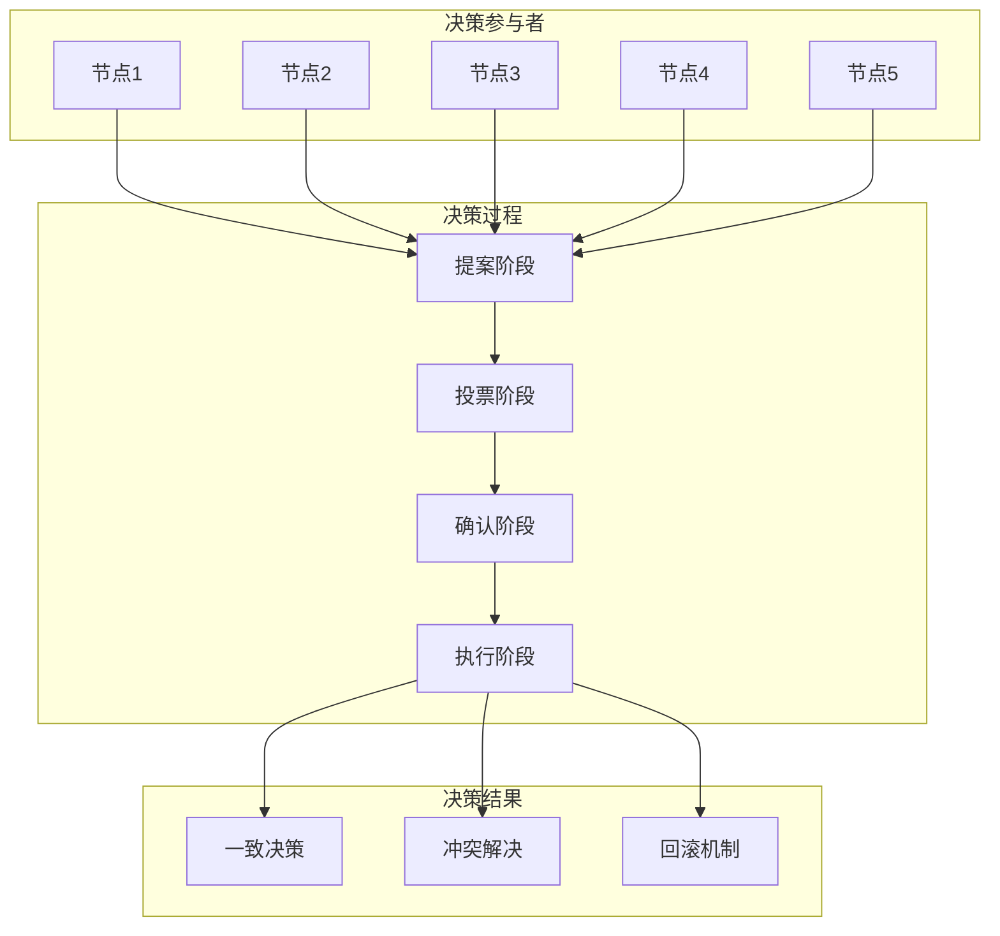

# 分布式决策机制分析

## 概述

分布式决策机制是现代分布式系统的核心组件，它能够在多个节点之间协调决策过程，确保系统的一致性和可靠性。
本文档深入分析OTLP在分布式决策机制中的实现，包括共识算法、决策协议、一致性保证等关键技术。

## 分布式决策理论基础

### 1. 决策模型



### 2. 决策特性

#### 2.1 一致性特性

- **强一致性**: 所有节点看到相同的决策结果
- **最终一致性**: 系统最终会达到一致状态
- **因果一致性**: 保持因果关系的决策顺序

#### 2.2 可用性特性

- **容错性**: 在部分节点故障时仍能工作
- **分区容错**: 在网络分区时保持可用性
- **自愈性**: 故障恢复后自动重新加入决策

#### 2.3 性能特性

- **低延迟**: 快速决策响应时间
- **高吞吐**: 支持大量并发决策
- **可扩展性**: 支持大规模节点集群

## 共识算法实现

### 1. Raft算法实现

```rust
// Raft共识算法实现
pub struct RaftNode {
    pub node_id: NodeId,
    pub state: RaftState,
    pub log: RaftLog,
    pub state_machine: StateMachine,
    pub network: NetworkInterface,
    pub timer: ElectionTimer,
}

pub enum RaftState {
    Follower,
    Candidate,
    Leader,
}

pub struct RaftLog {
    pub entries: Vec<LogEntry>,
    pub commit_index: u64,
    pub last_applied: u64,
}

impl RaftNode {
    pub async fn start_election(&mut self) -> Result<(), RaftError> {
        // 转换为候选者状态
        self.state = RaftState::Candidate;
        self.current_term += 1;
        self.voted_for = Some(self.node_id.clone());
        
        // 重置选举计时器
        self.timer.reset_election_timer();
        
        // 发送投票请求
        let vote_request = VoteRequest {
            term: self.current_term,
            candidate_id: self.node_id.clone(),
            last_log_index: self.log.get_last_index(),
            last_log_term: self.log.get_last_term(),
        };
        
        let mut votes_received = 1; // 自己的一票
        let mut vote_responses = Vec::new();
        
        // 向所有其他节点发送投票请求
        for peer in &self.peers {
            let response = self.network.send_vote_request(peer, &vote_request).await?;
            vote_responses.push(response);
        }
        
        // 统计投票结果
        for response in vote_responses {
            if response.vote_granted {
                votes_received += 1;
            }
            
            // 检查是否获得多数票
            if votes_received > self.peers.len() / 2 {
                self.become_leader().await?;
                return Ok(());
            }
        }
        
        // 如果没有获得多数票，回到跟随者状态
        self.state = RaftState::Follower;
        Ok(())
    }
    
    pub async fn become_leader(&mut self) -> Result<(), RaftError> {
        self.state = RaftState::Leader;
        
        // 初始化领导者的状态
        for peer in &self.peers {
            self.next_index.insert(peer.clone(), self.log.get_last_index() + 1);
            self.match_index.insert(peer.clone(), 0);
        }
        
        // 发送心跳消息
        self.send_heartbeat().await?;
        
        // 启动日志复制
        self.start_log_replication().await?;
        
        Ok(())
    }
    
    pub async fn append_entries(
        &mut self, 
        request: &AppendEntriesRequest
    ) -> Result<AppendEntriesResponse, RaftError> {
        // 检查任期
        if request.term < self.current_term {
            return Ok(AppendEntriesResponse {
                term: self.current_term,
                success: false,
            });
        }
        
        // 更新任期和领导者
        if request.term > self.current_term {
            self.current_term = request.term;
            self.voted_for = None;
            self.state = RaftState::Follower;
        }
        
        // 重置选举计时器
        self.timer.reset_election_timer();
        
        // 检查日志一致性
        if !self.log.is_consistent_with(request.prev_log_index, request.prev_log_term) {
            return Ok(AppendEntriesResponse {
                term: self.current_term,
                success: false,
            });
        }
        
        // 追加日志条目
        for entry in &request.entries {
            self.log.append_entry(entry.clone())?;
        }
        
        // 更新提交索引
        if request.leader_commit > self.log.commit_index {
            self.log.commit_index = std::cmp::min(
                request.leader_commit,
                self.log.get_last_index()
            );
        }
        
        // 应用已提交的日志条目
        self.apply_committed_entries().await?;
        
        Ok(AppendEntriesResponse {
            term: self.current_term,
            success: true,
        })
    }
    
    async fn apply_committed_entries(&mut self) -> Result<(), RaftError> {
        while self.log.last_applied < self.log.commit_index {
            self.log.last_applied += 1;
            let entry = self.log.get_entry(self.log.last_applied)?;
            
            // 应用到状态机
            self.state_machine.apply_command(&entry.command).await?;
        }
        
        Ok(())
    }
}
```

### 2. PBFT算法实现

```rust
// PBFT共识算法实现
pub struct PBFTNode {
    pub node_id: NodeId,
    pub view: u64,
    pub sequence_number: u64,
    pub checkpoint_interval: u64,
    pub message_log: MessageLog,
    pub state: PBFTState,
}

pub struct PBFTState {
    pub current_view: u64,
    pub last_stable_checkpoint: u64,
    pub prepared_messages: HashMap<u64, PreparedMessage>,
    pub committed_messages: HashMap<u64, CommittedMessage>,
}

impl PBFTNode {
    pub async fn propose_request(
        &mut self, 
        request: &ClientRequest
    ) -> Result<(), PBFTError> {
        // 创建预准备消息
        let preprepare = PrePrepareMessage {
            view: self.view,
            sequence_number: self.sequence_number,
            request_digest: self.hash_request(request),
            request: request.clone(),
        };
        
        // 广播预准备消息
        self.broadcast_preprepare(&preprepare).await?;
        
        // 处理自己的预准备消息
        self.handle_preprepare(&preprepare).await?;
        
        Ok(())
    }
    
    pub async fn handle_preprepare(
        &mut self, 
        message: &PrePrepareMessage
    ) -> Result<(), PBFTError> {
        // 验证消息
        if !self.validate_preprepare(message) {
            return Err(PBFTError::InvalidPrePrepare);
        }
        
        // 检查是否已经处理过
        if self.message_log.contains_preprepare(message) {
            return Ok(());
        }
        
        // 记录预准备消息
        self.message_log.record_preprepare(message);
        
        // 创建准备消息
        let prepare = PrepareMessage {
            view: message.view,
            sequence_number: message.sequence_number,
            request_digest: message.request_digest.clone(),
            node_id: self.node_id.clone(),
        };
        
        // 广播准备消息
        self.broadcast_prepare(&prepare).await?;
        
        // 处理自己的准备消息
        self.handle_prepare(&prepare).await?;
        
        Ok(())
    }
    
    pub async fn handle_prepare(
        &mut self, 
        message: &PrepareMessage
    ) -> Result<(), PBFTError> {
        // 验证消息
        if !self.validate_prepare(message) {
            return Err(PBFTError::InvalidPrepare);
        }
        
        // 记录准备消息
        self.message_log.record_prepare(message);
        
        // 检查是否收集到足够的准备消息
        let prepare_count = self.message_log.count_prepares(
            message.view, 
            message.sequence_number
        );
        
        if prepare_count >= 2 * self.faulty_nodes_count() + 1 {
            // 创建提交消息
            let commit = CommitMessage {
                view: message.view,
                sequence_number: message.sequence_number,
                request_digest: message.request_digest.clone(),
                node_id: self.node_id.clone(),
            };
            
            // 广播提交消息
            self.broadcast_commit(&commit).await?;
            
            // 处理自己的提交消息
            self.handle_commit(&commit).await?;
        }
        
        Ok(())
    }
    
    pub async fn handle_commit(
        &mut self, 
        message: &CommitMessage
    ) -> Result<(), PBFTError> {
        // 验证消息
        if !self.validate_commit(message) {
            return Err(PBFTError::InvalidCommit);
        }
        
        // 记录提交消息
        self.message_log.record_commit(message);
        
        // 检查是否收集到足够的提交消息
        let commit_count = self.message_log.count_commits(
            message.view, 
            message.sequence_number
        );
        
        if commit_count >= 2 * self.faulty_nodes_count() + 1 {
            // 执行请求
            self.execute_request(message.sequence_number).await?;
        }
        
        Ok(())
    }
    
    fn faulty_nodes_count(&self) -> usize {
        // 计算容错节点数量 (n-1)/3
        (self.total_nodes_count() - 1) / 3
    }
}
```

### 3. 两阶段提交协议

```rust
// 两阶段提交协议实现
pub struct TwoPhaseCommit {
    pub coordinator: Coordinator,
    pub participants: Vec<Participant>,
    pub transaction_id: TransactionId,
    pub state: TransactionState,
}

pub enum TransactionState {
    Initial,
    Prepared,
    Committed,
    Aborted,
}

impl TwoPhaseCommit {
    pub async fn execute_transaction(
        &mut self, 
        operations: Vec<TransactionOperation>
    ) -> Result<(), TransactionError> {
        // 第一阶段：准备阶段
        let prepare_results = self.prepare_phase(&operations).await?;
        
        // 检查所有参与者是否准备就绪
        if prepare_results.iter().all(|result| result.is_prepared) {
            // 第二阶段：提交阶段
            self.commit_phase().await?;
        } else {
            // 中止事务
            self.abort_phase().await?;
        }
        
        Ok(())
    }
    
    async fn prepare_phase(
        &mut self, 
        operations: &[TransactionOperation]
    ) -> Result<Vec<PrepareResult>, TransactionError> {
        let mut prepare_results = Vec::new();
        
        // 向所有参与者发送准备请求
        for participant in &self.participants {
            let prepare_request = PrepareRequest {
                transaction_id: self.transaction_id.clone(),
                operations: operations.to_vec(),
            };
            
            let result = participant.prepare(&prepare_request).await?;
            prepare_results.push(result);
        }
        
        Ok(prepare_results)
    }
    
    async fn commit_phase(&mut self) -> Result<(), TransactionError> {
        self.state = TransactionState::Committed;
        
        // 向所有参与者发送提交请求
        for participant in &self.participants {
            let commit_request = CommitRequest {
                transaction_id: self.transaction_id.clone(),
            };
            
            participant.commit(&commit_request).await?;
        }
        
        Ok(())
    }
    
    async fn abort_phase(&mut self) -> Result<(), TransactionError> {
        self.state = TransactionState::Aborted;
        
        // 向所有参与者发送中止请求
        for participant in &self.participants {
            let abort_request = AbortRequest {
                transaction_id: self.transaction_id.clone(),
            };
            
            participant.abort(&abort_request).await?;
        }
        
        Ok(())
    }
}
```

## 分布式决策协议

### 1. 决策协议框架

```rust
// 分布式决策协议框架
pub struct DistributedDecisionProtocol {
    pub decision_engine: DecisionEngine,
    pub consensus_algorithm: Box<dyn ConsensusAlgorithm>,
    pub conflict_resolver: ConflictResolver,
    pub decision_log: DecisionLog,
}

pub trait ConsensusAlgorithm {
    async fn propose_decision(&mut self, proposal: &DecisionProposal) -> Result<(), ConsensusError>;
    async fn vote_on_decision(&mut self, vote: &DecisionVote) -> Result<(), ConsensusError>;
    async fn finalize_decision(&mut self, decision: &Decision) -> Result<(), ConsensusError>;
}

pub struct DecisionProposal {
    pub proposal_id: ProposalId,
    pub proposer: NodeId,
    pub decision_type: DecisionType,
    pub parameters: HashMap<String, Value>,
    pub timestamp: DateTime<Utc>,
}

pub struct DecisionVote {
    pub proposal_id: ProposalId,
    pub voter: NodeId,
    pub vote: VoteType,
    pub justification: Option<String>,
    pub timestamp: DateTime<Utc>,
}

pub enum VoteType {
    Approve,
    Reject,
    Abstain,
}

impl DistributedDecisionProtocol {
    pub async fn make_decision(
        &mut self, 
        proposal: DecisionProposal
    ) -> Result<Decision, DecisionError> {
        // 验证提案
        self.validate_proposal(&proposal)?;
        
        // 记录提案
        self.decision_log.record_proposal(&proposal);
        
        // 使用共识算法处理提案
        self.consensus_algorithm.propose_decision(&proposal).await?;
        
        // 收集投票
        let votes = self.collect_votes(&proposal.proposal_id).await?;
        
        // 统计投票结果
        let vote_result = self.count_votes(&votes);
        
        // 解决冲突
        let final_decision = self.resolve_decision_conflicts(&proposal, &vote_result).await?;
        
        // 记录最终决策
        self.decision_log.record_decision(&final_decision);
        
        // 通知所有节点
        self.notify_decision(&final_decision).await?;
        
        Ok(final_decision)
    }
    
    async fn collect_votes(
        &self, 
        proposal_id: &ProposalId
    ) -> Result<Vec<DecisionVote>, DecisionError> {
        let mut votes = Vec::new();
        let timeout = Duration::from_secs(30);
        
        // 等待投票或超时
        let start_time = Instant::now();
        while start_time.elapsed() < timeout {
            let new_votes = self.decision_log.get_votes_for_proposal(proposal_id).await?;
            votes.extend(new_votes);
            
            // 检查是否收集到足够的投票
            if votes.len() >= self.get_required_vote_count() {
                break;
            }
            
            tokio::time::sleep(Duration::from_millis(100)).await;
        }
        
        Ok(votes)
    }
    
    fn count_votes(&self, votes: &[DecisionVote]) -> VoteResult {
        let mut approve_count = 0;
        let mut reject_count = 0;
        let mut abstain_count = 0;
        
        for vote in votes {
            match vote.vote {
                VoteType::Approve => approve_count += 1,
                VoteType::Reject => reject_count += 1,
                VoteType::Abstain => abstain_count += 1,
            }
        }
        
        VoteResult {
            approve_count,
            reject_count,
            abstain_count,
            total_count: votes.len(),
        }
    }
}
```

### 2. 冲突解决机制

```rust
// 冲突解决机制
pub struct ConflictResolver {
    pub resolution_strategies: Vec<Box<dyn ResolutionStrategy>>,
    pub conflict_detector: ConflictDetector,
    pub resolution_log: ResolutionLog,
}

pub trait ResolutionStrategy {
    async fn can_resolve(&self, conflict: &DecisionConflict) -> bool;
    async fn resolve(&self, conflict: &DecisionConflict) -> Result<Resolution, ResolutionError>;
}

pub struct DecisionConflict {
    pub conflict_id: ConflictId,
    pub conflicting_decisions: Vec<Decision>,
    pub conflict_type: ConflictType,
    pub severity: ConflictSeverity,
}

pub enum ConflictType {
    Temporal,      // 时间冲突
    Resource,      // 资源冲突
    Policy,        // 策略冲突
    Dependency,    // 依赖冲突
}

impl ConflictResolver {
    pub async fn resolve_conflict(
        &mut self, 
        conflict: DecisionConflict
    ) -> Result<Resolution, ResolutionError> {
        // 记录冲突
        self.resolution_log.record_conflict(&conflict);
        
        // 选择解决策略
        let strategy = self.select_resolution_strategy(&conflict).await?;
        
        // 执行解决策略
        let resolution = strategy.resolve(&conflict).await?;
        
        // 记录解决方案
        self.resolution_log.record_resolution(&conflict.conflict_id, &resolution);
        
        // 验证解决方案
        self.validate_resolution(&conflict, &resolution).await?;
        
        Ok(resolution)
    }
    
    async fn select_resolution_strategy(
        &self, 
        conflict: &DecisionConflict
    ) -> Result<&dyn ResolutionStrategy, ResolutionError> {
        for strategy in &self.resolution_strategies {
            if strategy.can_resolve(conflict).await {
                return Ok(strategy.as_ref());
            }
        }
        
        Err(ResolutionError::NoSuitableStrategy)
    }
    
    async fn validate_resolution(
        &self, 
        conflict: &DecisionConflict, 
        resolution: &Resolution
    ) -> Result<(), ResolutionError> {
        // 检查解决方案是否解决了所有冲突
        if !self.conflict_detector.is_resolved(conflict, resolution).await? {
            return Err(ResolutionError::IncompleteResolution);
        }
        
        // 检查解决方案是否引入了新的冲突
        let new_conflicts = self.conflict_detector.detect_new_conflicts(resolution).await?;
        if !new_conflicts.is_empty() {
            return Err(ResolutionError::NewConflictsIntroduced(new_conflicts));
        }
        
        Ok(())
    }
}
```

## 一致性保证机制

### 1. 强一致性实现

```rust
// 强一致性保证机制
pub struct StrongConsistencyManager {
    pub consensus_engine: ConsensusEngine,
    pub state_synchronizer: StateSynchronizer,
    pub consistency_checker: ConsistencyChecker,
    pub recovery_manager: RecoveryManager,
}

impl StrongConsistencyManager {
    pub async fn ensure_strong_consistency(
        &mut self, 
        operation: &ConsistencyOperation
    ) -> Result<(), ConsistencyError> {
        // 获取全局锁
        let lock = self.acquire_global_lock().await?;
        
        // 执行操作
        let result = self.execute_operation_with_consistency(operation).await?;
        
        // 同步状态到所有节点
        self.synchronize_state_to_all_nodes(&result).await?;
        
        // 验证一致性
        self.verify_consistency_across_nodes().await?;
        
        // 释放全局锁
        self.release_global_lock(lock).await?;
        
        Ok(())
    }
    
    async fn execute_operation_with_consistency(
        &self, 
        operation: &ConsistencyOperation
    ) -> Result<ConsistencyResult, ConsistencyError> {
        // 使用共识算法执行操作
        let consensus_result = self.consensus_engine.execute_operation(operation).await?;
        
        // 等待所有节点确认
        self.wait_for_all_nodes_confirmation(&consensus_result).await?;
        
        Ok(ConsistencyResult {
            operation_id: operation.operation_id.clone(),
            result: consensus_result,
            consistency_level: ConsistencyLevel::Strong,
        })
    }
    
    async fn synchronize_state_to_all_nodes(
        &self, 
        result: &ConsistencyResult
    ) -> Result<(), ConsistencyError> {
        let mut sync_tasks = Vec::new();
        
        for node in &self.all_nodes {
            let sync_task = self.state_synchronizer.synchronize_to_node(node, result);
            sync_tasks.push(sync_task);
        }
        
        // 等待所有同步任务完成
        let sync_results = futures::future::join_all(sync_tasks).await;
        
        // 检查同步结果
        for sync_result in sync_results {
            sync_result?;
        }
        
        Ok(())
    }
}
```

### 2. 最终一致性实现

```rust
// 最终一致性保证机制
pub struct EventualConsistencyManager {
    pub conflict_resolver: ConflictResolver,
    pub vector_clock: VectorClock,
    pub anti_entropy: AntiEntropyEngine,
    pub gossip_protocol: GossipProtocol,
}

impl EventualConsistencyManager {
    pub async fn ensure_eventual_consistency(
        &mut self, 
        operation: &ConsistencyOperation
    ) -> Result<(), ConsistencyError> {
        // 执行操作
        let result = self.execute_operation(operation).await?;
        
        // 更新向量时钟
        self.vector_clock.increment(&self.node_id);
        
        // 通过gossip协议传播更新
        self.gossip_protocol.propagate_update(&result).await?;
        
        // 启动反熵过程
        self.anti_entropy.start_anti_entropy_process().await?;
        
        Ok(())
    }
    
    pub async fn handle_conflict(
        &mut self, 
        conflict: &ConsistencyConflict
    ) -> Result<(), ConsistencyError> {
        // 使用向量时钟解决冲突
        let resolution = self.resolve_conflict_with_vector_clock(conflict).await?;
        
        // 应用解决方案
        self.apply_conflict_resolution(&resolution).await?;
        
        // 传播解决方案
        self.gossip_protocol.propagate_resolution(&resolution).await?;
        
        Ok(())
    }
    
    async fn resolve_conflict_with_vector_clock(
        &self, 
        conflict: &ConsistencyConflict
    ) -> Result<ConflictResolution, ConsistencyError> {
        let mut resolutions = Vec::new();
        
        for conflicting_value in &conflict.conflicting_values {
            let vector_clock = &conflicting_value.vector_clock;
            let resolution = ConflictResolution {
                value: conflicting_value.value.clone(),
                vector_clock: vector_clock.clone(),
                resolution_strategy: self.select_resolution_strategy(vector_clock),
            };
            resolutions.push(resolution);
        }
        
        // 选择最佳解决方案
        let best_resolution = self.select_best_resolution(&resolutions)?;
        
        Ok(best_resolution)
    }
}
```

## 性能优化策略

### 1. 决策性能优化

```rust
// 决策性能优化
pub struct DecisionPerformanceOptimizer {
    pub parallel_processor: ParallelProcessor,
    pub cache_optimizer: CacheOptimizer,
    pub network_optimizer: NetworkOptimizer,
    pub load_balancer: LoadBalancer,
}

impl DecisionPerformanceOptimizer {
    pub async fn optimize_decision_performance(
        &mut self, 
        decision_workload: &DecisionWorkload
    ) -> Result<PerformanceOptimization, OptimizationError> {
        // 并行处理优化
        let parallel_optimization = self.parallel_processor
            .optimize_parallel_processing(decision_workload).await?;
        
        // 缓存优化
        let cache_optimization = self.cache_optimizer
            .optimize_decision_cache(decision_workload).await?;
        
        // 网络优化
        let network_optimization = self.network_optimizer
            .optimize_decision_network(decision_workload).await?;
        
        // 负载均衡优化
        let load_balancing_optimization = self.load_balancer
            .optimize_decision_load_balancing(decision_workload).await?;
        
        Ok(PerformanceOptimization {
            parallel_optimization,
            cache_optimization,
            network_optimization,
            load_balancing_optimization,
            overall_improvement: self.calculate_overall_improvement(&[
                &parallel_optimization,
                &cache_optimization,
                &network_optimization,
                &load_balancing_optimization,
            ]),
        })
    }
}
```

### 2. 网络优化

```rust
// 网络优化
pub struct NetworkOptimizer {
    pub connection_pool: ConnectionPool,
    pub message_compression: MessageCompression,
    pub batch_processor: BatchProcessor,
    pub adaptive_routing: AdaptiveRouting,
}

impl NetworkOptimizer {
    pub async fn optimize_network_communication(
        &mut self, 
        messages: &[DecisionMessage]
    ) -> Result<OptimizedCommunication, NetworkError> {
        // 消息压缩
        let compressed_messages = self.message_compression
            .compress_messages(messages).await?;
        
        // 批量处理
        let batches = self.batch_processor
            .create_optimal_batches(&compressed_messages).await?;
        
        // 自适应路由
        let routing_plan = self.adaptive_routing
            .create_routing_plan(&batches).await?;
        
        // 执行优化后的通信
        let communication_result = self.execute_optimized_communication(&routing_plan).await?;
        
        Ok(OptimizedCommunication {
            original_message_count: messages.len(),
            compressed_message_count: compressed_messages.len(),
            batch_count: batches.len(),
            total_communication_time: communication_result.total_time,
            bandwidth_saved: communication_result.bandwidth_saved,
        })
    }
}
```

## 实际应用案例

### 1. 微服务配置管理

```rust
// 微服务配置管理的分布式决策
pub struct MicroserviceConfigManager {
    pub config_decision_engine: ConfigDecisionEngine,
    pub consensus_algorithm: Box<dyn ConsensusAlgorithm>,
    pub config_validator: ConfigValidator,
    pub rollback_manager: RollbackManager,
}

impl MicroserviceConfigManager {
    pub async fn update_global_config(
        &mut self, 
        config_update: &ConfigUpdate
    ) -> Result<ConfigUpdateResult, ConfigError> {
        // 验证配置更新
        self.config_validator.validate_config_update(config_update).await?;
        
        // 创建配置更新提案
        let proposal = ConfigUpdateProposal {
            proposal_id: ProposalId::new(),
            proposer: self.node_id.clone(),
            config_update: config_update.clone(),
            timestamp: Utc::now(),
        };
        
        // 使用分布式决策机制决定是否应用配置
        let decision = self.config_decision_engine
            .make_config_decision(proposal).await?;
        
        match decision {
            ConfigDecision::Approve => {
                // 应用配置更新
                let result = self.apply_config_update(config_update).await?;
                
                // 设置回滚点
                self.rollback_manager.create_rollback_point(&result).await?;
                
                Ok(ConfigUpdateResult::Success(result))
            },
            ConfigDecision::Reject => {
                Ok(ConfigUpdateResult::Rejected(decision.reason))
            },
        }
    }
}
```

### 2. 资源分配决策

```rust
// 资源分配的分布式决策
pub struct ResourceAllocationManager {
    pub allocation_decision_engine: AllocationDecisionEngine,
    pub resource_monitor: ResourceMonitor,
    pub allocation_optimizer: AllocationOptimizer,
    pub conflict_resolver: ResourceConflictResolver,
}

impl ResourceAllocationManager {
    pub async fn allocate_resources(
        &mut self, 
        allocation_request: &ResourceAllocationRequest
    ) -> Result<ResourceAllocationResult, AllocationError> {
        // 监控当前资源状态
        let current_resources = self.resource_monitor.get_current_resources().await?;
        
        // 检查资源冲突
        let conflicts = self.detect_resource_conflicts(allocation_request, &current_resources).await?;
        
        if !conflicts.is_empty() {
            // 解决资源冲突
            let resolution = self.conflict_resolver.resolve_conflicts(&conflicts).await?;
            return self.allocate_resources_with_resolution(allocation_request, &resolution).await;
        }
        
        // 优化资源分配
        let optimized_allocation = self.allocation_optimizer
            .optimize_allocation(allocation_request, &current_resources).await?;
        
        // 创建分配提案
        let proposal = ResourceAllocationProposal {
            proposal_id: ProposalId::new(),
            proposer: self.node_id.clone(),
            allocation: optimized_allocation,
            timestamp: Utc::now(),
        };
        
        // 使用分布式决策机制决定资源分配
        let decision = self.allocation_decision_engine
            .make_allocation_decision(proposal).await?;
        
        match decision {
            AllocationDecision::Approve => {
                let result = self.execute_allocation(&optimized_allocation).await?;
                Ok(ResourceAllocationResult::Success(result))
            },
            AllocationDecision::Reject => {
                Ok(ResourceAllocationResult::Rejected(decision.reason))
            },
        }
    }
}
```

## 监控与调试

### 1. 决策监控

```rust
// 决策监控系统
pub struct DecisionMonitor {
    pub metrics_collector: DecisionMetricsCollector,
    pub performance_analyzer: PerformanceAnalyzer,
    pub alert_manager: AlertManager,
    pub dashboard_generator: DashboardGenerator,
}

impl DecisionMonitor {
    pub async fn monitor_decision_performance(&mut self) -> Result<(), MonitorError> {
        // 收集决策指标
        let metrics = self.metrics_collector.collect_metrics().await?;
        
        // 分析性能
        let performance_analysis = self.performance_analyzer
            .analyze_performance(&metrics).await?;
        
        // 检查告警条件
        let alerts = self.alert_manager.check_alerts(&performance_analysis).await?;
        
        // 处理告警
        for alert in alerts {
            self.alert_manager.handle_alert(&alert).await?;
        }
        
        // 更新仪表板
        self.dashboard_generator.update_dashboard(&metrics, &performance_analysis).await?;
        
        Ok(())
    }
}
```

### 2. 调试工具

```rust
// 决策调试工具
pub struct DecisionDebugger {
    pub trace_collector: TraceCollector,
    pub state_inspector: StateInspector,
    pub conflict_analyzer: ConflictAnalyzer,
    pub performance_profiler: PerformanceProfiler,
}

impl DecisionDebugger {
    pub async fn debug_decision_issue(
        &mut self, 
        issue: &DecisionIssue
    ) -> Result<DebugReport, DebugError> {
        // 收集相关跟踪信息
        let traces = self.trace_collector.collect_traces_for_issue(issue).await?;
        
        // 检查系统状态
        let system_state = self.state_inspector.inspect_system_state().await?;
        
        // 分析冲突
        let conflict_analysis = self.conflict_analyzer.analyze_conflicts(&traces).await?;
        
        // 性能分析
        let performance_analysis = self.performance_profiler
            .profile_decision_performance(&traces).await?;
        
        Ok(DebugReport {
            issue: issue.clone(),
            traces,
            system_state,
            conflict_analysis,
            performance_analysis,
            recommendations: self.generate_recommendations(&conflict_analysis, &performance_analysis),
        })
    }
}
```

## 未来发展方向

### 1. 智能化决策

- **AI驱动决策**: 基于机器学习的智能决策算法
- **预测性决策**: 预测性决策和预防性措施
- **自适应决策**: 自适应决策策略调整

### 2. 量子共识算法

- **量子共识**: 基于量子计算的共识算法
- **量子通信**: 量子通信在分布式决策中的应用
- **量子纠错**: 量子纠错在决策一致性中的应用

### 3. 边缘决策

- **边缘共识**: 边缘计算环境下的共识算法
- **本地决策**: 本地决策与全局决策的协调
- **延迟优化**: 边缘决策的延迟优化

## 总结

分布式决策机制为OTLP系统提供了可靠、一致、高效的决策能力。
通过合理的共识算法、完善的冲突解决机制和智能的性能优化策略，可以实现高性能、高可用的分布式决策系统。

未来的发展将更加注重智能化、量子化和边缘化，为现代分布式系统提供更加先进和高效的决策解决方案。
