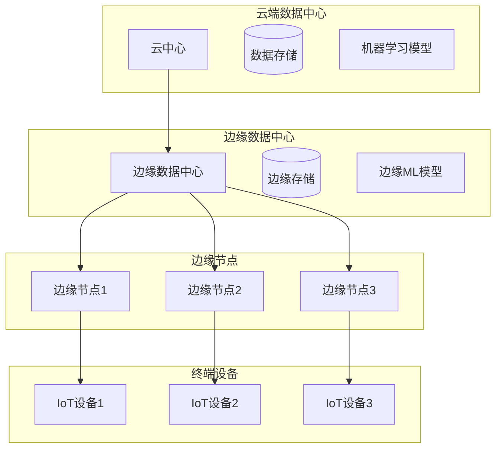

# 边缘计算与OTLP集成分析

## 📋 目录

- [边缘计算与OTLP集成分析](#边缘计算与otlp集成分析)
  - [📋 目录](#-目录)
  - [概述](#概述)
  - [边缘计算架构](#边缘计算架构)
    - [1. 边缘节点层次结构](#1-边缘节点层次结构)
    - [2. 边缘计算特性](#2-边缘计算特性)
      - [2.1 低延迟要求](#21-低延迟要求)
      - [2.2 资源约束](#22-资源约束)
      - [2.3 分布式特性](#23-分布式特性)
  - [OTLP边缘实现架构](#otlp边缘实现架构)
    - [1. 分层架构设计](#1-分层架构设计)
    - [2. 数据流处理](#2-数据流处理)
      - [2.1 实时数据流](#21-实时数据流)
      - [2.2 数据压缩与优化](#22-数据压缩与优化)
  - [边缘智能与本地决策](#边缘智能与本地决策)
    - [1. 边缘AI模型](#1-边缘ai模型)
    - [2. 本地决策引擎](#2-本地决策引擎)
  - [边缘与云端数据同步](#边缘与云端数据同步)
    - [1. 数据同步策略](#1-数据同步策略)
    - [2. 网络优化](#2-网络优化)
  - [边缘资源管理](#边缘资源管理)
    - [1. 资源监控](#1-资源监控)
    - [2. 资源优化](#2-资源优化)
  - [边缘安全与隐私](#边缘安全与隐私)
    - [1. 数据加密](#1-数据加密)
    - [2. 隐私保护](#2-隐私保护)
  - [性能优化策略](#性能优化策略)
    - [1. 缓存优化](#1-缓存优化)
    - [2. 计算优化](#2-计算优化)
  - [实际应用案例](#实际应用案例)
    - [1. 智能交通系统](#1-智能交通系统)
    - [2. 工业物联网](#2-工业物联网)
  - [未来发展方向](#未来发展方向)
    - [1. 5G/6G集成](#1-5g6g集成)
    - [2. 边缘AI演进](#2-边缘ai演进)
    - [3. 量子边缘计算](#3-量子边缘计算)
  - [总结](#总结)

## 概述

边缘计算作为分布式系统的重要分支，为OTLP提供了新的应用场景和挑战。
本文档深入分析边缘计算环境下的OTLP实现，包括架构设计、数据处理、网络优化等关键技术。

## 边缘计算架构

### 1. 边缘节点层次结构



### 2. 边缘计算特性

#### 2.1 低延迟要求

- **目标延迟**: < 10ms 本地响应
- **网络延迟**: 边缘到云端 50-200ms
- **处理延迟**: 实时数据处理 < 5ms

#### 2.2 资源约束

- **计算资源**: 有限CPU和内存
- **存储资源**: 本地存储容量限制
- **网络带宽**: 不稳定的网络连接

#### 2.3 分布式特性

- **地理分布**: 全球分布的边缘节点
- **自治性**: 边缘节点独立运行能力
- **协调性**: 边缘与云端协调机制

## OTLP边缘实现架构

### 1. 分层架构设计

```rust
// 边缘OTLP架构核心组件
pub struct EdgeOTLPArchitecture {
    // 数据收集层
    collectors: Vec<DataCollector>,
    // 本地处理层
    processors: Vec<LocalProcessor>,
    // 存储层
    storage: EdgeStorage,
    // 传输层
    transporters: Vec<DataTransporter>,
    // 协调层
    coordinator: EdgeCoordinator,
}

pub struct DataCollector {
    pub collector_type: CollectorType,
    pub config: CollectorConfig,
    pub buffer: CircularBuffer<TelemetryData>,
}

pub enum CollectorType {
    Metrics(MetricsCollector),
    Traces(TracesCollector),
    Logs(LogsCollector),
    Profiles(ProfilesCollector),
}

pub struct LocalProcessor {
    pub processor_id: String,
    pub processing_rules: Vec<ProcessingRule>,
    pub cache: LRUCache<String, ProcessedData>,
}

pub struct EdgeStorage {
    pub local_db: LocalDatabase,
    pub cache: RedisCache,
    pub compression: CompressionEngine,
}
```

### 2. 数据流处理

#### 2.1 实时数据流

```rust
// 边缘实时数据流处理
pub struct EdgeStreamProcessor {
    pub input_stream: Stream<TelemetryData>,
    pub processing_pipeline: ProcessingPipeline,
    pub output_stream: Stream<ProcessedData>,
}

impl EdgeStreamProcessor {
    pub async fn process_stream(&mut self) -> Result<(), ProcessingError> {
        let mut stream = self.input_stream.take(1000); // 批量处理
        
        while let Some(batch) = stream.next().await {
            // 并行处理批次数据
            let processed_batch = self.parallel_process_batch(batch).await?;
            
            // 本地缓存重要数据
            self.cache_important_data(&processed_batch).await?;
            
            // 发送到云端
            self.send_to_cloud(&processed_batch).await?;
        }
        
        Ok(())
    }
    
    async fn parallel_process_batch(
        &self, 
        batch: Vec<TelemetryData>
    ) -> Result<Vec<ProcessedData>, ProcessingError> {
        let chunks = batch.chunks(10); // 分块并行处理
        let futures: Vec<_> = chunks.map(|chunk| {
            self.process_chunk(chunk.to_vec())
        }).collect();
        
        let results = futures::future::join_all(futures).await;
        let mut processed_data = Vec::new();
        
        for result in results {
            processed_data.extend(result?);
        }
        
        Ok(processed_data)
    }
}
```

#### 2.2 数据压缩与优化

```rust
// 边缘数据压缩策略
pub struct EdgeCompressionEngine {
    pub algorithms: Vec<CompressionAlgorithm>,
    pub adaptive_strategy: AdaptiveCompression,
}

pub enum CompressionAlgorithm {
    LZ4,      // 快速压缩，适合实时数据
    Zstd,     // 平衡压缩率和速度
    Brotli,   // 高压缩率，适合批量数据
    Custom(Box<dyn CustomCompressor>),
}

impl EdgeCompressionEngine {
    pub fn compress_data(
        &self, 
        data: &[u8], 
        context: CompressionContext
    ) -> Result<CompressedData, CompressionError> {
        let algorithm = self.select_algorithm(&context);
        
        match algorithm {
            CompressionAlgorithm::LZ4 => {
                let compressed = lz4::compress(data)?;
                Ok(CompressedData::new(compressed, CompressionType::LZ4))
            },
            CompressionAlgorithm::Zstd => {
                let compressed = zstd::encode_all(data, 3)?;
                Ok(CompressedData::new(compressed, CompressionType::Zstd))
            },
            _ => self.custom_compress(data, algorithm),
        }
    }
    
    fn select_algorithm(&self, context: &CompressionContext) -> CompressionAlgorithm {
        match context {
            CompressionContext::RealTime => CompressionAlgorithm::LZ4,
            CompressionContext::Batch => CompressionAlgorithm::Zstd,
            CompressionContext::Archive => CompressionAlgorithm::Brotli,
        }
    }
}
```

## 边缘智能与本地决策

### 1. 边缘AI模型

```rust
// 边缘AI模型管理
pub struct EdgeAIModel {
    pub model_id: String,
    pub model_type: ModelType,
    pub inference_engine: InferenceEngine,
    pub model_cache: ModelCache,
}

pub enum ModelType {
    AnomalyDetection(AnomalyDetectionModel),
    PredictiveMaintenance(PredictiveMaintenanceModel),
    ResourceOptimization(ResourceOptimizationModel),
    Custom(Box<dyn CustomModel>),
}

impl EdgeAIModel {
    pub async fn predict(&mut self, input: &ModelInput) -> Result<ModelOutput, ModelError> {
        // 检查模型是否需要更新
        if self.should_update_model().await? {
            self.update_model().await?;
        }
        
        // 执行推理
        let output = self.inference_engine.infer(input).await?;
        
        // 缓存结果
        self.cache_result(input, &output).await?;
        
        Ok(output)
    }
    
    async fn should_update_model(&self) -> Result<bool, ModelError> {
        let last_update = self.model_cache.get_last_update_time()?;
        let current_time = SystemTime::now();
        let duration = current_time.duration_since(last_update)?;
        
        // 模型更新策略：每小时检查一次
        Ok(duration.as_secs() > 3600)
    }
}
```

### 2. 本地决策引擎

```rust
// 边缘本地决策引擎
pub struct EdgeDecisionEngine {
    pub decision_rules: Vec<DecisionRule>,
    pub context_manager: ContextManager,
    pub action_executor: ActionExecutor,
}

pub struct DecisionRule {
    pub rule_id: String,
    pub condition: RuleCondition,
    pub action: RuleAction,
    pub priority: u8,
    pub cooldown: Duration,
}

impl EdgeDecisionEngine {
    pub async fn make_decision(
        &mut self, 
        context: &DecisionContext
    ) -> Result<Option<Decision>, DecisionError> {
        // 评估所有规则
        let applicable_rules = self.evaluate_rules(context).await?;
        
        if applicable_rules.is_empty() {
            return Ok(None);
        }
        
        // 选择最高优先级规则
        let selected_rule = self.select_rule(applicable_rules)?;
        
        // 检查冷却时间
        if self.is_rule_in_cooldown(&selected_rule).await? {
            return Ok(None);
        }
        
        // 执行决策
        let decision = Decision {
            rule_id: selected_rule.rule_id.clone(),
            action: selected_rule.action.clone(),
            confidence: self.calculate_confidence(&selected_rule, context),
            timestamp: SystemTime::now(),
        };
        
        // 记录决策历史
        self.record_decision(&decision).await?;
        
        Ok(Some(decision))
    }
    
    async fn evaluate_rules(
        &self, 
        context: &DecisionContext
    ) -> Result<Vec<&DecisionRule>, DecisionError> {
        let mut applicable_rules = Vec::new();
        
        for rule in &self.decision_rules {
            if self.evaluate_condition(&rule.condition, context).await? {
                applicable_rules.push(rule);
            }
        }
        
        // 按优先级排序
        applicable_rules.sort_by(|a, b| b.priority.cmp(&a.priority));
        
        Ok(applicable_rules)
    }
}
```

## 边缘与云端数据同步

### 1. 数据同步策略

```rust
// 边缘云端数据同步
pub struct EdgeCloudSync {
    pub sync_strategy: SyncStrategy,
    pub conflict_resolver: ConflictResolver,
    pub sync_scheduler: SyncScheduler,
}

pub enum SyncStrategy {
    Push,           // 边缘推送到云端
    Pull,           // 边缘从云端拉取
    Bidirectional,  // 双向同步
    EventDriven,    // 事件驱动同步
}

impl EdgeCloudSync {
    pub async fn sync_data(&mut self) -> Result<SyncResult, SyncError> {
        match self.sync_strategy {
            SyncStrategy::Push => self.push_to_cloud().await,
            SyncStrategy::Pull => self.pull_from_cloud().await,
            SyncStrategy::Bidirectional => self.bidirectional_sync().await,
            SyncStrategy::EventDriven => self.event_driven_sync().await,
        }
    }
    
    async fn bidirectional_sync(&mut self) -> Result<SyncResult, SyncError> {
        // 并行执行推送和拉取
        let (push_result, pull_result) = futures::join!(
            self.push_to_cloud(),
            self.pull_from_cloud()
        );
        
        let push_result = push_result?;
        let pull_result = pull_result?;
        
        // 处理冲突
        let conflicts = self.detect_conflicts(&push_result, &pull_result)?;
        let resolved_conflicts = self.resolve_conflicts(conflicts).await?;
        
        Ok(SyncResult {
            pushed_items: push_result.items,
            pulled_items: pull_result.items,
            conflicts_resolved: resolved_conflicts.len(),
            sync_timestamp: SystemTime::now(),
        })
    }
}
```

### 2. 网络优化

```rust
// 边缘网络优化
pub struct EdgeNetworkOptimizer {
    pub connection_pool: ConnectionPool,
    pub bandwidth_monitor: BandwidthMonitor,
    pub adaptive_compression: AdaptiveCompression,
}

impl EdgeNetworkOptimizer {
    pub async fn optimize_transmission(
        &mut self, 
        data: &[u8]
    ) -> Result<OptimizedTransmission, NetworkError> {
        // 监控网络状况
        let network_metrics = self.bandwidth_monitor.get_current_metrics().await?;
        
        // 选择传输策略
        let strategy = self.select_transmission_strategy(&network_metrics);
        
        match strategy {
            TransmissionStrategy::Direct => {
                self.direct_transmission(data).await
            },
            TransmissionStrategy::Compressed => {
                self.compressed_transmission(data).await
            },
            TransmissionStrategy::Batched => {
                self.batched_transmission(data).await
            },
            TransmissionStrategy::Cached => {
                self.cached_transmission(data).await
            },
        }
    }
    
    fn select_transmission_strategy(
        &self, 
        metrics: &NetworkMetrics
    ) -> TransmissionStrategy {
        if metrics.bandwidth > 100_000_000 { // 100Mbps
            TransmissionStrategy::Direct
        } else if metrics.latency > 100 { // 100ms
            TransmissionStrategy::Compressed
        } else if metrics.packet_loss > 0.01 { // 1%
            TransmissionStrategy::Batched
        } else {
            TransmissionStrategy::Cached
        }
    }
}
```

## 边缘资源管理

### 1. 资源监控

```rust
// 边缘资源监控
pub struct EdgeResourceMonitor {
    pub cpu_monitor: CPUMonitor,
    pub memory_monitor: MemoryMonitor,
    pub storage_monitor: StorageMonitor,
    pub network_monitor: NetworkMonitor,
}

impl EdgeResourceMonitor {
    pub async fn get_resource_status(&self) -> Result<ResourceStatus, MonitorError> {
        let cpu_usage = self.cpu_monitor.get_usage().await?;
        let memory_usage = self.memory_monitor.get_usage().await?;
        let storage_usage = self.storage_monitor.get_usage().await?;
        let network_usage = self.network_monitor.get_usage().await?;
        
        Ok(ResourceStatus {
            cpu: cpu_usage,
            memory: memory_usage,
            storage: storage_usage,
            network: network_usage,
            timestamp: SystemTime::now(),
        })
    }
    
    pub async fn check_resource_constraints(
        &self, 
        operation: &ResourceOperation
    ) -> Result<bool, MonitorError> {
        let current_status = self.get_resource_status().await?;
        
        // 检查CPU约束
        if current_status.cpu.usage + operation.cpu_requirement > 0.8 {
            return Ok(false);
        }
        
        // 检查内存约束
        if current_status.memory.usage + operation.memory_requirement > 0.9 {
            return Ok(false);
        }
        
        // 检查存储约束
        if current_status.storage.usage + operation.storage_requirement > 0.95 {
            return Ok(false);
        }
        
        Ok(true)
    }
}
```

### 2. 资源优化

```rust
// 边缘资源优化
pub struct EdgeResourceOptimizer {
    pub optimization_strategies: Vec<OptimizationStrategy>,
    pub resource_allocator: ResourceAllocator,
    pub performance_predictor: PerformancePredictor,
}

impl EdgeResourceOptimizer {
    pub async fn optimize_resources(
        &mut self, 
        workload: &Workload
    ) -> Result<OptimizationPlan, OptimizationError> {
        // 预测性能需求
        let performance_requirements = self.performance_predictor
            .predict_requirements(workload).await?;
        
        // 生成优化策略
        let strategies = self.generate_optimization_strategies(
            &performance_requirements
        ).await?;
        
        // 评估策略效果
        let evaluated_strategies = self.evaluate_strategies(strategies).await?;
        
        // 选择最优策略
        let optimal_strategy = self.select_optimal_strategy(evaluated_strategies)?;
        
        // 生成执行计划
        let plan = self.generate_execution_plan(optimal_strategy).await?;
        
        Ok(plan)
    }
    
    async fn generate_optimization_strategies(
        &self, 
        requirements: &PerformanceRequirements
    ) -> Result<Vec<OptimizationStrategy>, OptimizationError> {
        let mut strategies = Vec::new();
        
        // CPU优化策略
        if requirements.cpu_intensive {
            strategies.push(OptimizationStrategy::CPUOptimization {
                cpu_cores: requirements.cpu_cores,
                cpu_frequency: requirements.cpu_frequency,
            });
        }
        
        // 内存优化策略
        if requirements.memory_intensive {
            strategies.push(OptimizationStrategy::MemoryOptimization {
                memory_allocation: requirements.memory_allocation,
                cache_size: requirements.cache_size,
            });
        }
        
        // 存储优化策略
        if requirements.storage_intensive {
            strategies.push(OptimizationStrategy::StorageOptimization {
                storage_type: requirements.storage_type,
                compression: requirements.compression_enabled,
            });
        }
        
        Ok(strategies)
    }
}
```

## 边缘安全与隐私

### 1. 数据加密

```rust
// 边缘数据加密
pub struct EdgeDataEncryption {
    pub encryption_engine: EncryptionEngine,
    pub key_manager: KeyManager,
    pub secure_storage: SecureStorage,
}

impl EdgeDataEncryption {
    pub async fn encrypt_sensitive_data(
        &self, 
        data: &[u8], 
        context: &EncryptionContext
    ) -> Result<EncryptedData, EncryptionError> {
        // 选择加密算法
        let algorithm = self.select_encryption_algorithm(context);
        
        // 获取加密密钥
        let key = self.key_manager.get_key(&algorithm).await?;
        
        // 执行加密
        let encrypted = self.encryption_engine.encrypt(data, &key, &algorithm)?;
        
        // 存储加密元数据
        let metadata = EncryptionMetadata {
            algorithm: algorithm.clone(),
            key_id: key.id.clone(),
            timestamp: SystemTime::now(),
            context: context.clone(),
        };
        
        Ok(EncryptedData {
            data: encrypted,
            metadata,
        })
    }
    
    fn select_encryption_algorithm(
        &self, 
        context: &EncryptionContext
    ) -> EncryptionAlgorithm {
        match context.sensitivity_level {
            SensitivityLevel::Low => EncryptionAlgorithm::AES128,
            SensitivityLevel::Medium => EncryptionAlgorithm::AES256,
            SensitivityLevel::High => EncryptionAlgorithm::ChaCha20Poly1305,
            SensitivityLevel::Critical => EncryptionAlgorithm::AES256GCM,
        }
    }
}
```

### 2. 隐私保护

```rust
// 边缘隐私保护
pub struct EdgePrivacyProtection {
    pub anonymizer: DataAnonymizer,
    pub differential_privacy: DifferentialPrivacyEngine,
    pub consent_manager: ConsentManager,
}

impl EdgePrivacyProtection {
    pub async fn protect_privacy(
        &self, 
        data: &PersonalData, 
        privacy_level: PrivacyLevel
    ) -> Result<ProtectedData, PrivacyError> {
        match privacy_level {
            PrivacyLevel::Basic => {
                self.basic_anonymization(data).await
            },
            PrivacyLevel::Enhanced => {
                self.enhanced_anonymization(data).await
            },
            PrivacyLevel::Differential => {
                self.differential_privacy_protection(data).await
            },
            PrivacyLevel::ZeroKnowledge => {
                self.zero_knowledge_protection(data).await
            },
        }
    }
    
    async fn differential_privacy_protection(
        &self, 
        data: &PersonalData
    ) -> Result<ProtectedData, PrivacyError> {
        // 应用差分隐私算法
        let epsilon = 1.0; // 隐私预算
        let protected_data = self.differential_privacy
            .add_noise(data, epsilon).await?;
        
        // 验证隐私保护效果
        let privacy_guarantee = self.differential_privacy
            .verify_privacy_guarantee(&protected_data, epsilon).await?;
        
        Ok(ProtectedData {
            data: protected_data,
            privacy_guarantee,
            protection_method: ProtectionMethod::DifferentialPrivacy,
        })
    }
}
```

## 性能优化策略

### 1. 缓存优化

```rust
// 边缘缓存优化
pub struct EdgeCacheOptimizer {
    pub cache_layers: Vec<CacheLayer>,
    pub eviction_policies: Vec<EvictionPolicy>,
    pub prefetch_strategies: Vec<PrefetchStrategy>,
}

impl EdgeCacheOptimizer {
    pub async fn optimize_cache_performance(
        &mut self, 
        access_pattern: &AccessPattern
    ) -> Result<CacheOptimization, CacheError> {
        // 分析访问模式
        let pattern_analysis = self.analyze_access_pattern(access_pattern).await?;
        
        // 优化缓存层次
        let layer_optimization = self.optimize_cache_layers(&pattern_analysis).await?;
        
        // 优化淘汰策略
        let eviction_optimization = self.optimize_eviction_policies(&pattern_analysis).await?;
        
        // 优化预取策略
        let prefetch_optimization = self.optimize_prefetch_strategies(&pattern_analysis).await?;
        
        Ok(CacheOptimization {
            layer_optimization,
            eviction_optimization,
            prefetch_optimization,
            expected_improvement: self.calculate_improvement(&pattern_analysis),
        })
    }
}
```

### 2. 计算优化

```rust
// 边缘计算优化
pub struct EdgeComputeOptimizer {
    pub parallel_processor: ParallelProcessor,
    pub vector_processor: VectorProcessor,
    pub gpu_accelerator: GPUAccelerator,
}

impl EdgeComputeOptimizer {
    pub async fn optimize_computation(
        &mut self, 
        computation_task: &ComputationTask
    ) -> Result<OptimizedComputation, ComputeError> {
        // 分析计算特征
        let compute_characteristics = self.analyze_compute_characteristics(computation_task)?;
        
        // 选择优化策略
        let optimization_strategy = self.select_optimization_strategy(&compute_characteristics);
        
        match optimization_strategy {
            OptimizationStrategy::Parallel => {
                self.parallel_optimization(computation_task).await
            },
            OptimizationStrategy::Vectorized => {
                self.vectorized_optimization(computation_task).await
            },
            OptimizationStrategy::GPUAccelerated => {
                self.gpu_accelerated_optimization(computation_task).await
            },
            OptimizationStrategy::Hybrid => {
                self.hybrid_optimization(computation_task).await
            },
        }
    }
}
```

## 实际应用案例

### 1. 智能交通系统

```rust
// 智能交通边缘OTLP实现
pub struct IntelligentTrafficSystem {
    pub traffic_monitor: TrafficMonitor,
    pub signal_controller: SignalController,
    pub route_optimizer: RouteOptimizer,
    pub incident_detector: IncidentDetector,
}

impl IntelligentTrafficSystem {
    pub async fn process_traffic_data(
        &mut self, 
        traffic_data: &TrafficData
    ) -> Result<TrafficResponse, TrafficError> {
        // 实时交通监控
        let traffic_metrics = self.traffic_monitor.analyze_traffic(traffic_data).await?;
        
        // 检测交通事件
        let incidents = self.incident_detector.detect_incidents(&traffic_metrics).await?;
        
        // 优化信号控制
        let signal_adjustments = self.signal_controller
            .optimize_signals(&traffic_metrics, &incidents).await?;
        
        // 优化路线规划
        let route_recommendations = self.route_optimizer
            .optimize_routes(&traffic_metrics, &incidents).await?;
        
        Ok(TrafficResponse {
            signal_adjustments,
            route_recommendations,
            incident_alerts: incidents,
            traffic_summary: traffic_metrics,
        })
    }
}
```

### 2. 工业物联网

```rust
// 工业物联网边缘OTLP实现
pub struct IndustrialIoTSystem {
    pub equipment_monitor: EquipmentMonitor,
    pub predictive_maintenance: PredictiveMaintenance,
    pub quality_controller: QualityController,
    pub energy_optimizer: EnergyOptimizer,
}

impl IndustrialIoTSystem {
    pub async fn process_industrial_data(
        &mut self, 
        sensor_data: &SensorData
    ) -> Result<IndustrialResponse, IndustrialError> {
        // 设备状态监控
        let equipment_status = self.equipment_monitor
            .monitor_equipment(sensor_data).await?;
        
        // 预测性维护
        let maintenance_predictions = self.predictive_maintenance
            .predict_maintenance_needs(&equipment_status).await?;
        
        // 质量控制
        let quality_metrics = self.quality_controller
            .control_quality(sensor_data).await?;
        
        // 能源优化
        let energy_optimization = self.energy_optimizer
            .optimize_energy_usage(sensor_data).await?;
        
        Ok(IndustrialResponse {
            equipment_status,
            maintenance_predictions,
            quality_metrics,
            energy_optimization,
        })
    }
}
```

## 未来发展方向

### 1. 5G/6G集成

- **超低延迟**: 1ms以下延迟要求
- **高带宽**: 10Gbps以上带宽支持
- **网络切片**: 专用网络切片支持

### 2. 边缘AI演进

- **联邦学习**: 分布式模型训练
- **边缘推理**: 实时AI推理能力
- **自适应学习**: 动态模型调整

### 3. 量子边缘计算

- **量子算法**: 优化问题求解
- **量子通信**: 安全通信保障
- **量子传感**: 高精度传感能力

## 总结

边缘计算与OTLP的集成为分布式可观测性提供了新的机遇和挑战。通过合理的架构设计、智能的本地决策、高效的数据同步和严格的资源管理，可以实现高性能、低延迟的边缘OTLP系统。

未来的发展将更加注重AI集成、网络优化和隐私保护，为边缘计算环境下的可观测性提供更加完善和智能的解决方案。
