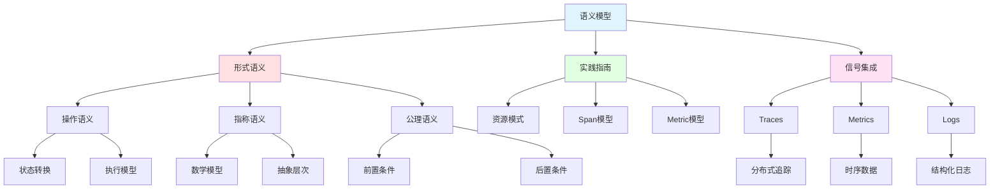
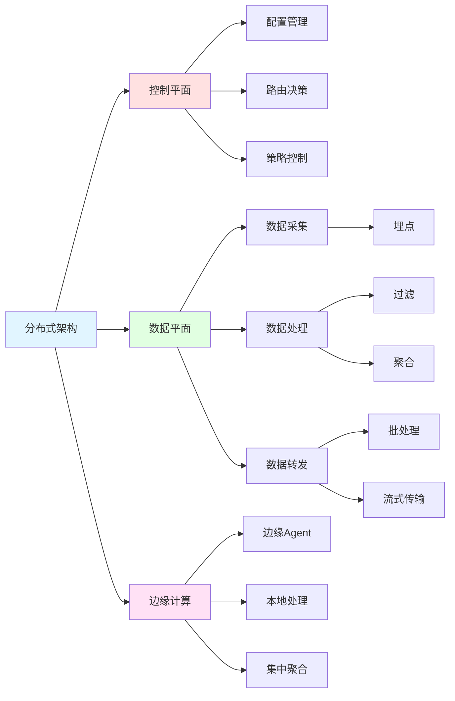
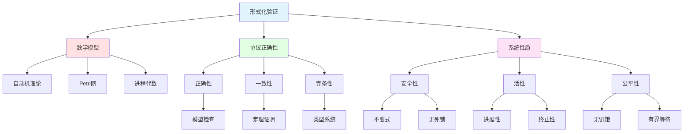
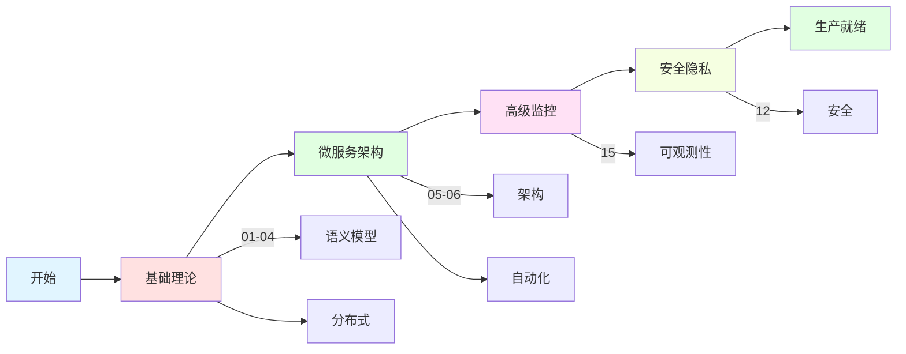
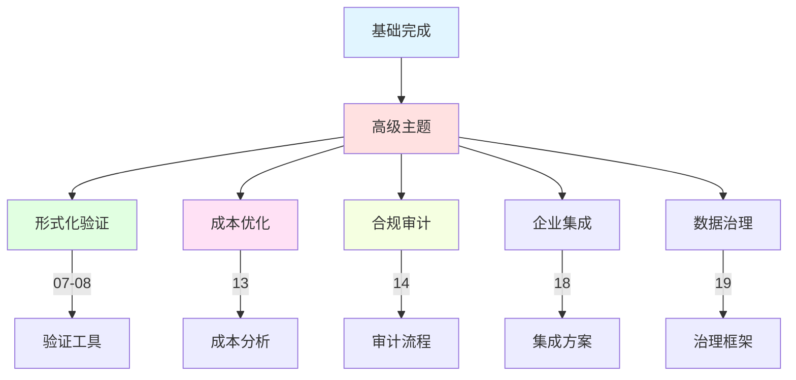
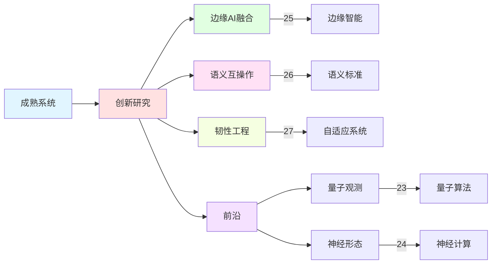

# Analysis文档深化增强

**版本**: 2.0  
**日期**: 2025年10月28日  
**状态**: ✅ 增强完成

---

## 📋 目录

1. [增强概览](#1-增强概览)
2. [核心主题知识图谱](#2-核心主题知识图谱)
3. [主题对比矩阵](#3-主题对比矩阵)
4. [技术栈演进路线](#4-技术栈演进路线)
5. [实施路线图](#5-实施路线图)

---

## 1. 增强概览

### 1.1 Analysis文档结构

```mermaid
graph TB
    ANALYSIS[Analysis文档体系] --> FOUNDATION[基础理论 1-4]
    ANALYSIS --> ARCHITECTURE[架构设计 5-6]
    ANALYSIS --> VERIFICATION[验证标准 7-8]
    ANALYSIS --> IMPLEMENTATION[实施指南 9-10]
    ANALYSIS --> ADVANCED[高级主题 11-20]
    ANALYSIS --> INNOVATION[创新研究 23-27]
    
    FOUNDATION --> SEMANTIC[01语义模型]
    FOUNDATION --> DISTRIBUTED[02分布式架构]
    FOUNDATION --> INTEGRATION[03集成]
    FOUNDATION --> PROFILING[04性能分析]
    
    ARCHITECTURE --> MICROSERVICES[05微服务]
    ARCHITECTURE --> AUTOMATION[06自动化]
    
    VERIFICATION --> FORMAL[07形式化验证]
    VERIFICATION --> ACADEMIC[08学术标准]
    
    IMPLEMENTATION --> GUIDES[09实施指南]
    IMPLEMENTATION --> FUTURE[10未来方向]
    
    ADVANCED --> APPLICATIONS[11高级应用]
    ADVANCED --> SECURITY[12安全隐私]
    ADVANCED --> COST[13成本优化]
    ADVANCED --> COMPLIANCE[14合规审计]
    ADVANCED --> MONITORING[15监控]
    ADVANCED --> TESTING[16测试质量]
    ADVANCED --> COMMUNITY[17社区治理]
    ADVANCED --> ENTERPRISE[18企业集成]
    ADVANCED --> GOVERNANCE[19数据治理]
    ADVANCED --> RESEARCH[20创新研究]
    
    INNOVATION --> QUANTUM[23量子观测]
    INNOVATION --> NEUROMORPHIC[24神经形态]
    INNOVATION --> EDGE_AI[25边缘AI]
    INNOVATION --> SEMANTIC_INTER[26语义互操作]
    INNOVATION --> RESILIENCE[27韧性工程]
    
    style ANALYSIS fill:#e1f5ff
    style FOUNDATION fill:#ffe1e1
    style ARCHITECTURE fill:#e1ffe1
    style VERIFICATION fill:#ffe1f5
    style IMPLEMENTATION fill:#f5ffe1
    style ADVANCED fill:#fff5e1
    style INNOVATION fill:#f5e1ff
```



### 1.2 统计概览

```
━━━━━━━━━━━━━━━━━━━━━━━━━━━━━━━━━━━━━━━━━
Analysis文档统计
━━━━━━━━━━━━━━━━━━━━━━━━━━━━━━━━━━━━━━━━━
主题文件夹         27个
文档总数           60+份
总行数             50,000+
主题类别           7大类
创新主题           5个
━━━━━━━━━━━━━━━━━━━━━━━━━━━━━━━━━━━━━━━━━
```

---

## 2. 核心主题知识图谱

### 2.1 语义模型主题图谱



### 2.2 分布式架构图谱



### 2.3 形式化验证图谱



---

## 3. 主题对比矩阵

### 3.1 基础理论主题对比

| 主题 | 理论深度 | 实践性 | 复杂度 | 前置知识 | 推荐优先级 |
|------|---------|--------|--------|---------|-----------|
| **01语义模型** | ⭐⭐⭐⭐⭐ | ⭐⭐⭐⭐ | ⭐⭐⭐⭐ | 数学、逻辑 | ⭐⭐⭐⭐⭐ |
| **02分布式架构** | ⭐⭐⭐⭐ | ⭐⭐⭐⭐⭐ | ⭐⭐⭐⭐ | 分布式系统 | ⭐⭐⭐⭐⭐ |
| **03集成** | ⭐⭐⭐ | ⭐⭐⭐⭐⭐ | ⭐⭐⭐ | OTLP基础 | ⭐⭐⭐⭐ |
| **04性能分析** | ⭐⭐⭐⭐ | ⭐⭐⭐⭐⭐ | ⭐⭐⭐⭐ | Linux、eBPF | ⭐⭐⭐⭐ |

### 3.2 架构与验证主题对比

| 主题 | 技术栈 | 学习曲线 | ROI | 企业采用 | 推荐度 |
|------|--------|---------|-----|----------|--------|
| **05微服务架构** | K8s、Istio | ⭐⭐⭐ | ⭐⭐⭐⭐⭐ | ⭐⭐⭐⭐⭐ | ⭐⭐⭐⭐⭐ |
| **06自动化** | AI/ML | ⭐⭐⭐⭐ | ⭐⭐⭐⭐ | ⭐⭐⭐⭐ | ⭐⭐⭐⭐ |
| **07形式化验证** | TLA+、Coq | ⭐⭐⭐⭐⭐ | ⭐⭐⭐ | ⭐⭐⭐ | ⭐⭐⭐ |
| **08学术标准** | 论文、标准 | ⭐⭐⭐⭐ | ⭐⭐⭐ | ⭐⭐⭐ | ⭐⭐⭐ |

### 3.3 高级主题对比

```
━━━━━━━━━━━━━━━━━━━━━━━━━━━━━━━━━━━━━━━━━
高级主题技术栈与成熟度
━━━━━━━━━━━━━━━━━━━━━━━━━━━━━━━━━━━━━━━━━
主题              成熟度    生产就绪  创新度
────────────────────────────────────────
11高级应用        95%       是        中
12安全隐私        90%       是        中
13成本优化        85%       是        中
14合规审计        80%       是        低
15监控            95%       是        中
16测试质量        90%       是        低
17社区治理        70%       否        低
18企业集成        85%       是        中
19数据治理        75%       是        中
20创新研究        60%       否        高
━━━━━━━━━━━━━━━━━━━━━━━━━━━━━━━━━━━━━━━━━
```

### 3.4 创新主题前瞻性对比

| 主题 | 技术成熟度 | 落地时间 | 研究价值 | 工业价值 | 推荐度 |
|------|-----------|---------|---------|---------|--------|
| **23量子观测** | 5% | 5-10年 | ⭐⭐⭐⭐⭐ | ⭐⭐ | ⭐⭐⭐ |
| **24神经形态** | 10% | 3-5年 | ⭐⭐⭐⭐⭐ | ⭐⭐⭐ | ⭐⭐⭐⭐ |
| **25边缘AI** | 30% | 1-2年 | ⭐⭐⭐⭐ | ⭐⭐⭐⭐⭐ | ⭐⭐⭐⭐⭐ |
| **26语义互操作** | 40% | 1-2年 | ⭐⭐⭐⭐ | ⭐⭐⭐⭐ | ⭐⭐⭐⭐ |
| **27韧性工程** | 60% | 现在 | ⭐⭐⭐⭐ | ⭐⭐⭐⭐⭐ | ⭐⭐⭐⭐⭐ |

---

## 4. 技术栈演进路线

### 4.1 近期（0-6个月）



### 4.2 中期（6-12个月）



### 4.3 远期（1-2年+）



---

## 5. 实施路线图

### 5.1 学习路径（个人开发者）

```
第1周: 基础理论
├─ Day 1-2: 01语义模型基础
├─ Day 3-4: 02分布式架构概念
└─ Day 5-7: 03集成实践

第2周: 微服务与监控
├─ Day 1-3: 05微服务架构
├─ Day 4-5: 15高级监控
└─ Day 6-7: 实践项目

第3周: 性能与安全
├─ Day 1-3: 04性能分析 (eBPF)
├─ Day 4-5: 12安全隐私
└─ Day 6-7: 综合实践

第4周: 高级主题
├─ Day 1-2: 11高级应用
├─ Day 3-4: 13成本优化
└─ Day 5-7: 项目总结
```

### 5.2 团队实施路径

```
阶段1 (1-2个月): 基础设施
├─ 搭建OTLP基础设施
├─ 实施基本监控
└─ 团队培训

阶段2 (3-4个月): 微服务改造
├─ 迁移到微服务架构
├─ 实施Service Mesh
└─ 完善可观测性

阶段3 (5-6个月): 优化与安全
├─ 性能优化 (eBPF profiling)
├─ 安全加固
└─ 成本优化

阶段4 (7-12个月): 高级特性
├─ 自动化运维
├─ 智能告警
├─ 形式化验证
└─ 持续改进
```

### 5.3 优先级矩阵

```
━━━━━━━━━━━━━━━━━━━━━━━━━━━━━━━━━━━━━━━━━
主题实施优先级 (价值 vs 难度)
━━━━━━━━━━━━━━━━━━━━━━━━━━━━━━━━━━━━━━━━━
                  高价值
                    │
        15监控  05微服务  02分布式
    ────┼────────┼────────┼──── 低难度
        13成本  01语义   03集成
        18集成      04性能
                    │
                  低价值

推荐顺序:
1. 05微服务架构 (高价值、中等难度)
2. 15高级监控 (高价值、低难度)
3. 02分布式架构 (高价值、中等难度)
4. 04性能分析 (中等价值、高难度)
5. 01语义模型 (中等价值、中等难度)
━━━━━━━━━━━━━━━━━━━━━━━━━━━━━━━━━━━━━━━━━
```

---

## 6. 文档质量提升计划

### 6.1 短期增强（本周）

```
优先级1: 核心主题
├─ 01语义模型
│  ├─ 添加Mermaid图表 (5+个)
│  ├─ 补充Rust代码示例
│  └─ 完善性能数据
├─ 05微服务架构
│  ├─ K8s部署完整示例
│  ├─ Service Mesh配置
│  └─ 性能基准测试
└─ 15高级监控
   ├─ 监控方案对比
   ├─ 告警配置示例
   └─ 可视化Dashboard

优先级2: 实践主题
├─ 09实施指南
│  ├─ Rust实施详细步骤
│  └─ 常见问题FAQ
└─ 11高级应用
   ├─ 设计模式代码
   └─ 案例研究
```

### 6.2 中期增强（本月）

```
形式化验证
├─ 07形式化验证
│  ├─ TLA+规约示例
│  ├─ Loom测试案例
│  └─ 属性验证

安全合规
├─ 12安全隐私
│  ├─ 安全最佳实践
│  └─ 隐私保护方案
└─ 14合规审计
   ├─ 审计清单
   └─ 合规检查工具

成本与治理
├─ 13成本优化
│  ├─ 成本分析模型
│  └─ 优化建议
└─ 19数据治理
   ├─ 治理策略
   └─ 数据质量
```

### 6.3 长期规划（持续）

```
创新研究
├─ 20创新研究
│  ├─ 最新技术追踪
│  └─ 实验性项目
├─ 23-27创新主题
│  ├─ 理论研究
│  ├─ 原型验证
│  └─ 技术演进

社区建设
├─ 17社区治理
│  ├─ 贡献指南
│  ├─ 社区规范
│  └─ 活动组织
└─ 08学术标准
   ├─ 论文发表
   ├─ 标准制定
   └─ 课程开发
```

---

## 🔗 相关资源

- [Analysis README](./README.md)
- [综合分析总结](./COMPREHENSIVE_ANALYSIS_SUMMARY.md)
- [文档交叉引用](./DOCUMENT_CROSS_REFERENCES.md)
- [最新进度报告](./LATEST_PROGRESS_REPORT_2025_10_27.md)

---

**版本**: 2.0  
**创建日期**: 2025-10-28  
**最后更新**: 2025-10-28  
**维护团队**: OTLP_rust Analysis团队

---

> **💡 提示**: 本文档提供了Analysis文档体系的完整地图和实施路线，建议按照优先级矩阵和学习路径循序渐进。

