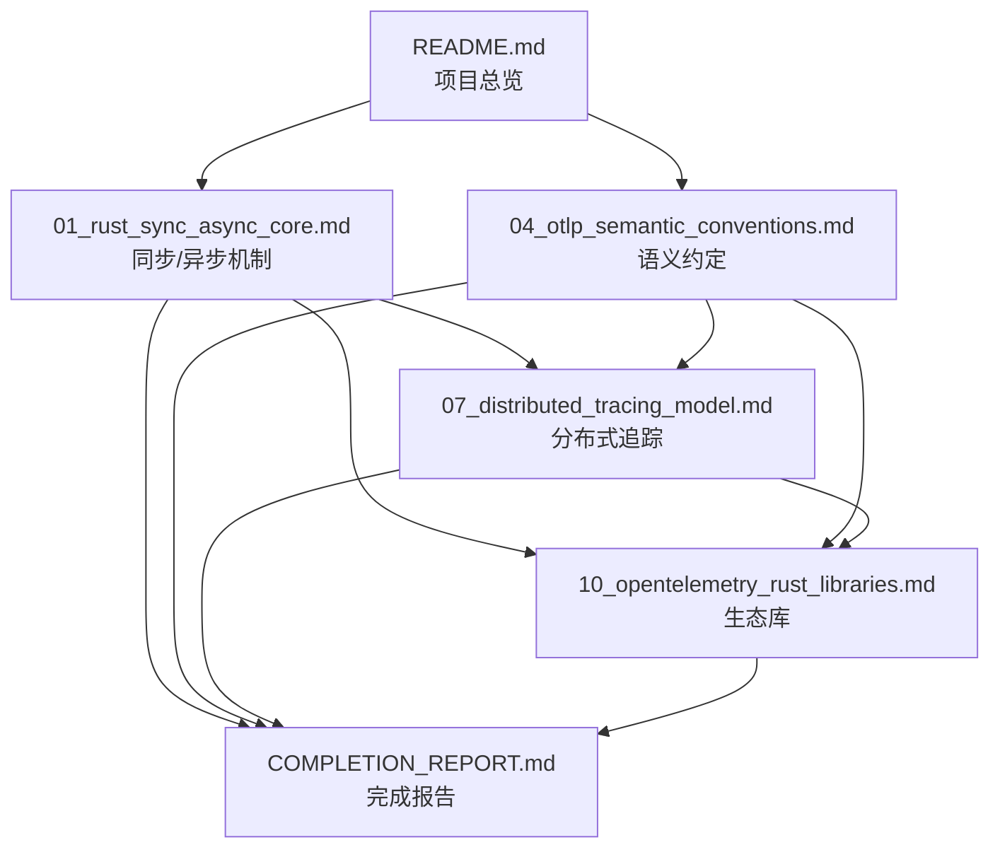

# 文档交叉引用索引

> **目的**: 建立文档间的关联关系，便于主题导航  
> **日期**: 2025年10月2日

---

## 📋 目录

- [文档交叉引用索引](#文档交叉引用索引)
  - [📋 目录](#-目录)
  - [📚 核心概念关联图](#-核心概念关联图)
  - [🔗 主题索引](#-主题索引)
    - [同步/异步编程](#同步异步编程)
    - [OTLP 语义模型](#otlp-语义模型)
    - [分布式追踪](#分布式追踪)
    - [实现库](#实现库)
  - [🎯 学习路径](#-学习路径)
    - [初学者路径](#初学者路径)
    - [进阶路径](#进阶路径)
    - [专家路径](#专家路径)
  - [🔍 关键术语索引](#-关键术语索引)
    - [A-C](#a-c)
    - [D-F](#d-f)
    - [G-M](#g-m)
    - [O-R](#o-r)
    - [S-T](#s-t)
    - [U-Z](#u-z)
  - [📊 文档依赖关系](#-文档依赖关系)
  - [🎓 按场景导航](#-按场景导航)
    - [场景 1: 新项目如何集成 OTLP](#场景-1-新项目如何集成-otlp)
    - [场景 2: 理解异步追踪原理](#场景-2-理解异步追踪原理)
    - [场景 3: 优化追踪性能](#场景-3-优化追踪性能)
    - [场景 4: 微服务追踪设计](#场景-4-微服务追踪设计)
  - [📝 更新日志](#-更新日志)

## 📚 核心概念关联图

```text
┌─────────────────────────────────────────────────────────┐
│                  Rust 语言特性层                         │
│  01_rust_sync_async_core.md ───────────────────┐        │
│  - 所有权系统                                    │        │
│  - Future Trait                                 │        │
│  - async/await                                  │        │
└──────────────────────────┬──────────────────────┘        │
                           │                               │
                           ▼                               │
┌─────────────────────────────────────────────────────────┐
│                  OTLP 语义模型层                         │
│  04_otlp_semantic_conventions.md                        │
│  - Resource Schema                                      │
│  - Semantic Conventions                                 │
│  - 自解释数据模型                                        │
└──────────────────────────┬──────────────────────────────┘
                           │
                           ▼
┌─────────────────────────────────────────────────────────┐
│                  分布式架构层                            │
│  07_distributed_tracing_model.md                        │
│  - 因果链建模                                            │
│  - 上下文传播                                            │
│  - W3C Trace Context                                    │
└──────────────────────────┬──────────────────────────────┘
                           │
                           ▼
┌─────────────────────────────────────────────────────────┐
│                  实现技术层                              │
│  10_opentelemetry_rust_libraries.md                     │
│  - opentelemetry-rust                                   │
│  - tracing 集成                                          │
│  - 传输层实现                                            │
└─────────────────────────────────────────────────────────┘
```

---

## 🔗 主题索引

### 同步/异步编程

| 主题 | 相关文档 | 章节 |
|------|----------|------|
| Rust 线程模型 | [01_rust_sync_async_core.md](01_rust_sync_async_core.md) | §1.1 |
| Future Trait | [01_rust_sync_async_core.md](01_rust_sync_async_core.md) | §3.1-3.2 |
| Tokio 运行时 | [01_rust_sync_async_core.md](01_rust_sync_async_core.md) | §4.1-4.3 |
| 异步追踪 | [07_distributed_tracing_model.md](07_distributed_tracing_model.md) | §4.1-4.3 |
| tracing 集成 | [10_opentelemetry_rust_libraries.md](10_opentelemetry_rust_libraries.md) | §4.1 |

### OTLP 语义模型

| 主题 | 相关文档 | 章节 |
|------|----------|------|
| Resource 模型 | [04_otlp_semantic_conventions.md](04_otlp_semantic_conventions.md) | §2.1-2.3 |
| Semantic Conventions | [04_otlp_semantic_conventions.md](04_otlp_semantic_conventions.md) | §3.1-3.4 |
| Trace 语义 | [04_otlp_semantic_conventions.md](04_otlp_semantic_conventions.md) | §4.1-4.3 |
| Metric 语义 | [04_otlp_semantic_conventions.md](04_otlp_semantic_conventions.md) | §5.1-5.2 |
| Log 语义 | [04_otlp_semantic_conventions.md](04_otlp_semantic_conventions.md) | §6.1-6.2 |
| 自解释数据 | [04_otlp_semantic_conventions.md](04_otlp_semantic_conventions.md) | §8.1-8.3 |

### 分布式追踪

| 主题 | 相关文档 | 章节 |
|------|----------|------|
| 因果链模型 | [07_distributed_tracing_model.md](07_distributed_tracing_model.md) | §1.1-1.2 |
| Span 结构 | [07_distributed_tracing_model.md](07_distributed_tracing_model.md) | §2.1-2.3 |
| 上下文传播 | [07_distributed_tracing_model.md](07_distributed_tracing_model.md) | §3.1-3.3 |
| 采样策略 | [07_distributed_tracing_model.md](07_distributed_tracing_model.md) | §6.1-6.2 |
| 微服务追踪 | [07_distributed_tracing_model.md](07_distributed_tracing_model.md) | §5.1-5.2 |

### 实现库

| 主题 | 相关文档 | 章节 |
|------|----------|------|
| 核心 API | [10_opentelemetry_rust_libraries.md](10_opentelemetry_rust_libraries.md) | §2.1 |
| SDK 实现 | [10_opentelemetry_rust_libraries.md](10_opentelemetry_rust_libraries.md) | §2.2 |
| OTLP 传输 | [10_opentelemetry_rust_libraries.md](10_opentelemetry_rust_libraries.md) | §3.1-3.2 |
| 集成库 | [10_opentelemetry_rust_libraries.md](10_opentelemetry_rust_libraries.md) | §4.1-4.4 |
| 性能对比 | [10_opentelemetry_rust_libraries.md](10_opentelemetry_rust_libraries.md) | §6.1-6.2 |
| 最佳实践 | [10_opentelemetry_rust_libraries.md](10_opentelemetry_rust_libraries.md) | §7.1-7.3 |

---

## 🎯 学习路径

### 初学者路径

1. **理解基础概念**
   - 阅读 [README.md](README.md) - 项目总览
   - 阅读 [01_rust_sync_async_core.md](01_rust_sync_async_core.md) §1-2 - 同步/异步基础

2. **学习 OTLP 语义**
   - 阅读 [04_otlp_semantic_conventions.md](04_otlp_semantic_conventions.md) §1-2 - 语义层架构
   - 阅读 [04_otlp_semantic_conventions.md](04_otlp_semantic_conventions.md) §4 - Trace 模型

3. **实践代码**
   - 阅读 [10_opentelemetry_rust_libraries.md](10_opentelemetry_rust_libraries.md) §2 - 核心 API
   - 阅读 [10_opentelemetry_rust_libraries.md](10_opentelemetry_rust_libraries.md) §5 - 完整示例

### 进阶路径

1. **深入异步机制**
   - 阅读 [01_rust_sync_async_core.md](01_rust_sync_async_core.md) §3 - Future Trait 深度分析
   - 阅读 [01_rust_sync_async_core.md](01_rust_sync_async_core.md) §4 - Tokio 运行时

2. **分布式追踪设计**
   - 阅读 [07_distributed_tracing_model.md](07_distributed_tracing_model.md) §1 - 理论基础
   - 阅读 [07_distributed_tracing_model.md](07_distributed_tracing_model.md) §3 - 上下文传播

3. **性能优化**
   - 阅读 [01_rust_sync_async_core.md](01_rust_sync_async_core.md) §7 - 性能分析
   - 阅读 [10_opentelemetry_rust_libraries.md](10_opentelemetry_rust_libraries.md) §6 - 性能对比

### 专家路径

1. **形式化验证**
   - 阅读 [01_rust_sync_async_core.md](01_rust_sync_async_core.md) §8 - 形式化证明
   - 阅读 [07_distributed_tracing_model.md](07_distributed_tracing_model.md) §8 - 形式化建模

2. **语义模型深度**
   - 阅读 [04_otlp_semantic_conventions.md](04_otlp_semantic_conventions.md) §8 - 语义自省
   - 阅读 [04_otlp_semantic_conventions.md](04_otlp_semantic_conventions.md) §9 - Rust 实现映射

3. **生产部署**
   - 阅读 [COMPLETION_REPORT.md](COMPLETION_REPORT.md) - 项目完成报告
   - 阅读 [10_opentelemetry_rust_libraries.md](10_opentelemetry_rust_libraries.md) §7 - 最佳实践

---

## 🔍 关键术语索引

### A-C

| 术语 | 相关文档 | 说明 |
|------|----------|------|
| async/await | [01_rust_sync_async_core.md](01_rust_sync_async_core.md) §2.1 | Rust 异步语法 |
| Attribute | [04_otlp_semantic_conventions.md](04_otlp_semantic_conventions.md) §2.1 | OTLP 属性模型 |
| BatchProcessor | [10_opentelemetry_rust_libraries.md](10_opentelemetry_rust_libraries.md) §2.2 | 批处理导出器 |
| Context | [07_distributed_tracing_model.md](07_distributed_tracing_model.md) §3.1 | 上下文传播 |

### D-F

| 术语 | 相关文档 | 说明 |
|------|----------|------|
| Future Trait | [01_rust_sync_async_core.md](01_rust_sync_async_core.md) §3.1 | 异步计算抽象 |

### G-M

| 术语 | 相关文档 | 说明 |
|------|----------|------|
| gRPC | [10_opentelemetry_rust_libraries.md](10_opentelemetry_rust_libraries.md) §3.1 | 远程调用协议 |
| Metric | [04_otlp_semantic_conventions.md](04_otlp_semantic_conventions.md) §5 | 指标模型 |

### O-R

| 术语 | 相关文档 | 说明 |
|------|----------|------|
| OTLP | [04_otlp_semantic_conventions.md](04_otlp_semantic_conventions.md) §1.1 | OpenTelemetry 协议 |
| Pin | [01_rust_sync_async_core.md](01_rust_sync_async_core.md) §2.3 | 内存固定机制 |
| Propagator | [07_distributed_tracing_model.md](07_distributed_tracing_model.md) §3.2 | 上下文传播器 |
| Resource | [04_otlp_semantic_conventions.md](04_otlp_semantic_conventions.md) §2 | 资源模型 |

### S-T

| 术语 | 相关文档 | 说明 |
|------|----------|------|
| Sampler | [07_distributed_tracing_model.md](07_distributed_tracing_model.md) §6 | 采样器 |
| Semantic Conventions | [04_otlp_semantic_conventions.md](04_otlp_semantic_conventions.md) §3 | 语义约定 |
| Span | [07_distributed_tracing_model.md](07_distributed_tracing_model.md) §2.1 | 追踪单元 |
| Tokio | [01_rust_sync_async_core.md](01_rust_sync_async_core.md) §4 | 异步运行时 |
| Tracer | [10_opentelemetry_rust_libraries.md](10_opentelemetry_rust_libraries.md) §2.1 | 追踪器 |
| tracing | [10_opentelemetry_rust_libraries.md](10_opentelemetry_rust_libraries.md) §4.1 | Rust 日志库 |

### U-Z

| 术语 | 相关文档 | 说明 |
|------|----------|------|
| W3C Trace Context | [07_distributed_tracing_model.md](07_distributed_tracing_model.md) §1.2 | W3C 追踪标准 |

---

## 📊 文档依赖关系



---

## 🎓 按场景导航

### 场景 1: 新项目如何集成 OTLP

**推荐阅读顺序**:

1. [10_opentelemetry_rust_libraries.md](10_opentelemetry_rust_libraries.md) §5 - 完整示例
2. [04_otlp_semantic_conventions.md](04_otlp_semantic_conventions.md) §2 - Resource 配置
3. [10_opentelemetry_rust_libraries.md](10_opentelemetry_rust_libraries.md) §7 - 最佳实践

### 场景 2: 理解异步追踪原理

**推荐阅读顺序**:

1. [01_rust_sync_async_core.md](01_rust_sync_async_core.md) §2 - 异步机制
2. [01_rust_sync_async_core.md](01_rust_sync_async_core.md) §5 - 同步/异步互操作
3. [07_distributed_tracing_model.md](07_distributed_tracing_model.md) §4 - Rust 异步追踪
4. [10_opentelemetry_rust_libraries.md](10_opentelemetry_rust_libraries.md) §4.1 - tracing 集成

### 场景 3: 优化追踪性能

**推荐阅读顺序**:

1. [01_rust_sync_async_core.md](01_rust_sync_async_core.md) §7 - 性能分析
2. [07_distributed_tracing_model.md](07_distributed_tracing_model.md) §7 - 性能优化
3. [10_opentelemetry_rust_libraries.md](10_opentelemetry_rust_libraries.md) §6 - 性能对比
4. [10_opentelemetry_rust_libraries.md](10_opentelemetry_rust_libraries.md) §7.3 - 批处理配置

### 场景 4: 微服务追踪设计

**推荐阅读顺序**:

1. [07_distributed_tracing_model.md](07_distributed_tracing_model.md) §5 - 微服务场景
2. [07_distributed_tracing_model.md](07_distributed_tracing_model.md) §3 - 上下文传播
3. [10_opentelemetry_rust_libraries.md](10_opentelemetry_rust_libraries.md) §4.2-4.3 - 框架集成
4. [04_otlp_semantic_conventions.md](04_otlp_semantic_conventions.md) §3 - 语义约定

---

## 📝 更新日志

| 日期 | 变更内容 |
|------|----------|
| 2025-10-02 | 初始版本，建立核心文档关联 |

---

**维护者**: OTLP Rust 项目组  
**最后更新**: 2025年10月2日
