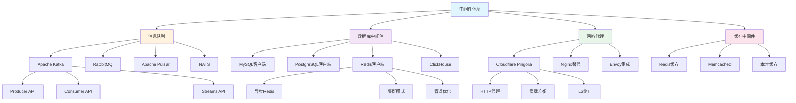
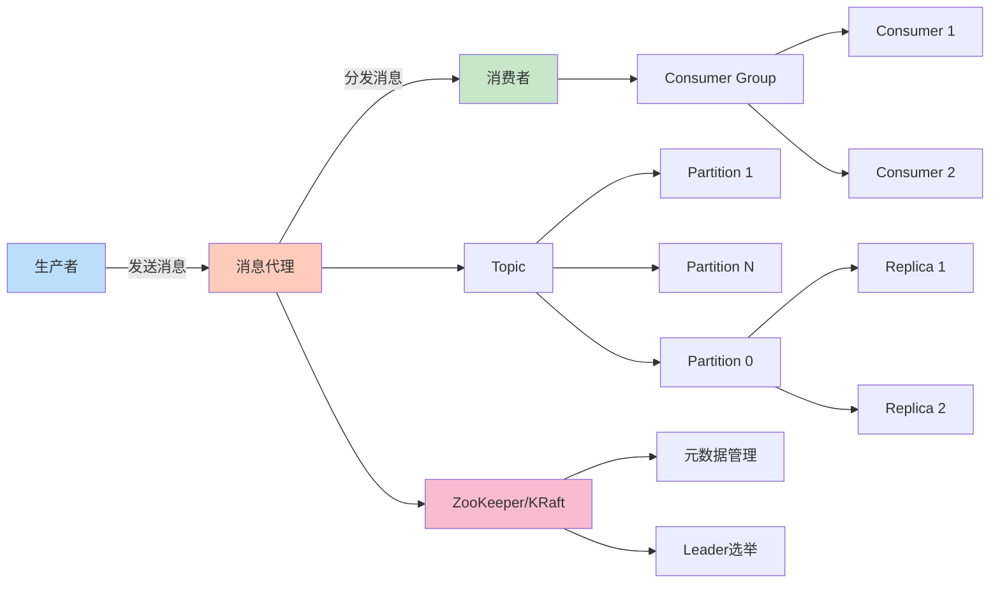
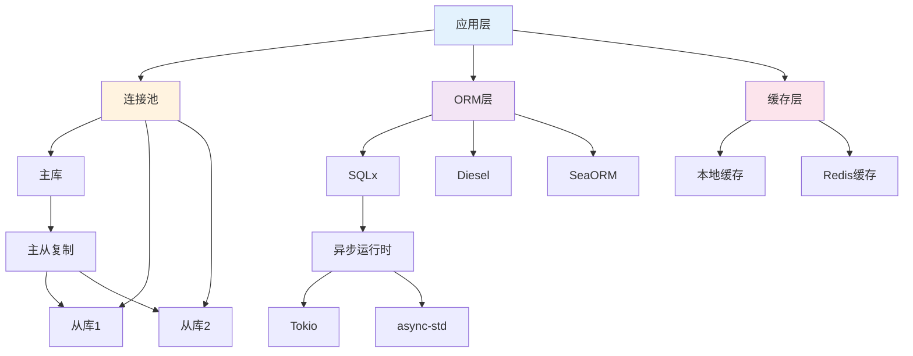
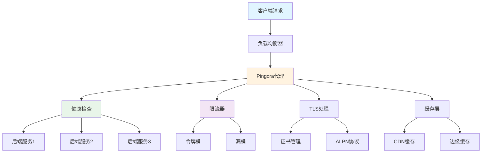
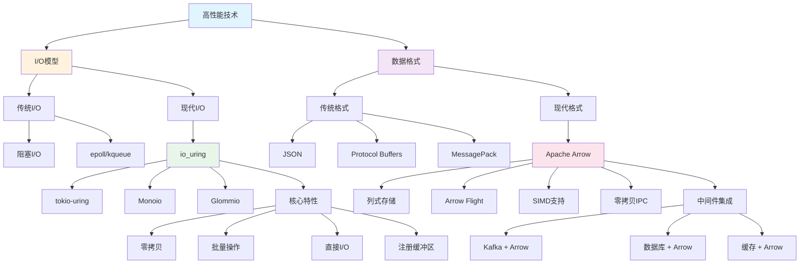
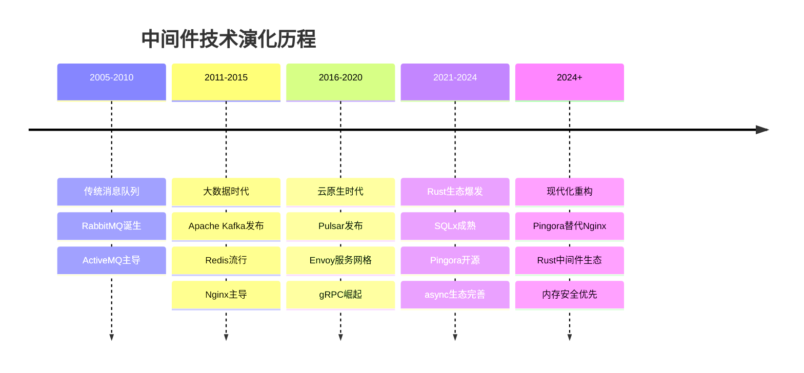
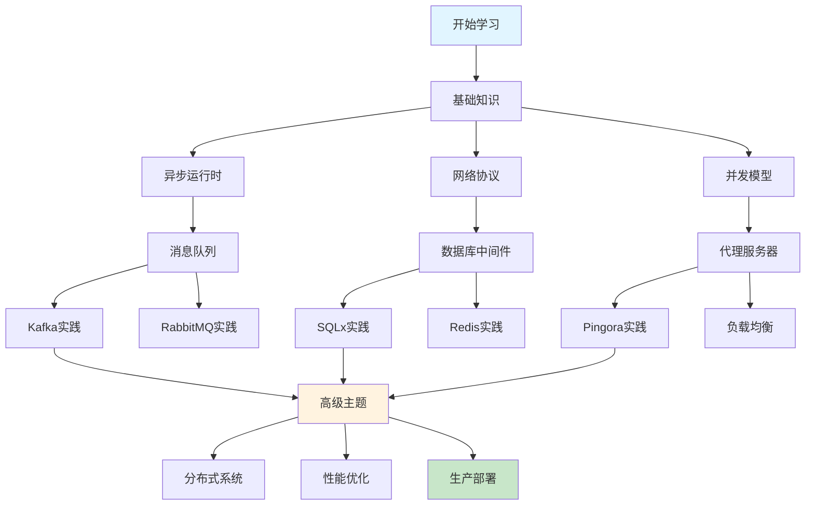

# C11 Middlewares 知识图谱与概念关系（增强版）

> **文档定位**: Rust 1.90 中间件技术的完整知识体系  
> **创建日期**: 2025-10-20  
> **适用版本**: Rust 1.90+ | Edition 2024  
> **文档类型**: 理论知识图谱 + 概念关系 + 可视化

---

## 📋 目录
- [C11 Middlewares 知识图谱与概念关系（增强版）](#c11-middlewares-知识图谱与概念关系增强版)
  - [📊 目录](#-目录)
  - [1. 核心概念知识图谱](#1-核心概念知识图谱)
    - [中间件体系总览](#中间件体系总览)
    - [消息队列生态](#消息队列生态)
    - [数据库中间件](#数据库中间件)
    - [网络代理中间件](#网络代理中间件)
    - [高性能 I/O 与数据技术](#高性能-io-与数据技术)
  - [2. 概念属性矩阵](#2-概念属性矩阵)
    - [消息队列对比](#消息队列对比)
    - [数据库中间件对比](#数据库中间件对比)
    - [代理服务器对比](#代理服务器对比)
  - [3. 技术演化与学习路径](#3-技术演化与学习路径)
    - [中间件技术演化](#中间件技术演化)
    - [学习路径](#学习路径)
  - [4. 总结与索引](#4-总结与索引)
    - [快速查找](#快速查找)
    - [相关文档](#相关文档)
  - [返回导航](#返回导航)

---

## 📖 核心概念知识图谱

### 中间件体系总览

### 消息队列生态

### 数据库中间件

### 网络代理中间件

### 高性能 I/O 与数据技术

---

## 📝 概念属性矩阵

### 消息队列对比

| 特性 | Kafka | RabbitMQ | Pulsar | NATS |
|------|-------|----------|--------|------|
| **吞吐量** | 极高 (MB/s) | 中等 | 极高 | 高 |
| **延迟** | 低 (ms) | 低 (ms) | 低 (ms) | 极低 (μs) |
| **持久化** | ✅ 强 | ✅ 可选 | ✅ 多层 | ⚠️ 可选 |
| **顺序保证** | ✅ 分区内 | ✅ 队列内 | ✅ 分区内 | ⚠️ 受限 |
| **消息回溯** | ✅ 完整 | ❌ 不支持 | ✅ 完整 | ⚠️ 有限 |
| **多租户** | ⚠️ 弱 | ⚠️ 中等 | ✅ 强 | ⚠️ 弱 |
| **操作复杂度** | 高 | 中 | 高 | 低 |
| **Rust客户端** | ✅ rdkafka | ✅ lapin | ✅ pulsar-rs | ✅ nats.rs |
| **生态成熟度** | ⭐⭐⭐⭐⭐ | ⭐⭐⭐⭐ | ⭐⭐⭐⭐ | ⭐⭐⭐ |

**适用场景**:

- **Kafka**: 大数据流处理、事件溯源、日志聚合
- **RabbitMQ**: 任务队列、RPC、微服务通信
- **Pulsar**: 多租户消息系统、统一消息平台
- **NATS**: IoT、边缘计算、实时通信

### 数据库中间件对比

| 特性 | SQLx | Diesel | SeaORM | sqlparser |
|------|------|--------|--------|-----------|
| **类型安全** | ✅ 编译时 | ✅ 强类型 | ✅ 完整 | ❌ 解析器 |
| **异步支持** | ✅ 原生 | ⚠️ 实验性 | ✅ 完整 | N/A |
| **查询构建** | SQL宏 | DSL | DSL | AST |
| **数据库支持** | 4+ | 3+ | 4+ | 解析通用SQL |
| **迁移工具** | ✅ | ✅ | ✅ | ❌ |
| **性能** | 极高 | 高 | 高 | N/A |
| **学习曲线** | 低 | 中 | 低 | 低 |
| **连接池** | ✅ 内置 | ✅ r2d2 | ✅ 内置 | N/A |
| **生态成熟度** | ⭐⭐⭐⭐⭐ | ⭐⭐⭐⭐⭐ | ⭐⭐⭐⭐ | ⭐⭐⭐ |

**适用场景**:

- **SQLx**: 微服务、高性能应用、需要灵活SQL
- **Diesel**: 传统应用、类型安全优先、复杂查询
- **SeaORM**: 快速开发、易学易用、全异步
- **sqlparser**: SQL分析、查询优化、数据库工具

### 代理服务器对比

| 特性 | Pingora | Nginx | Envoy | HAProxy |
|------|---------|-------|-------|---------|
| **语言** | Rust | C | C++ | C |
| **内存安全** | ✅ | ❌ | ❌ | ❌ |
| **性能** | 极高 | 极高 | 高 | 极高 |
| **并发模型** | async/await | 事件驱动 | 事件驱动 | 事件驱动 |
| **热重载** | ✅ 零停机 | ✅ | ✅ | ✅ |
| **可扩展性** | ✅ Rust生态 | Lua模块 | C++扩展 | 有限 |
| **HTTP/3** | ✅ | ⚠️ 实验 | ✅ | ❌ |
| **TLS性能** | ✅ BoringSSL | ✅ OpenSSL | ✅ | ✅ |
| **可观测性** | ✅ 内置 | ⚠️ 插件 | ✅ 强大 | ✅ |
| **配置复杂度** | 低 (代码) | 中 (配置) | 高 (YAML) | 中 |

**适用场景**:

- **Pingora**: CDN、边缘计算、高性能代理
- **Nginx**: 通用Web服务、反向代理、负载均衡
- **Envoy**: 服务网格、微服务代理、API网关
- **HAProxy**: TCP/HTTP负载均衡、高可用

---

## 🔍 技术演化与学习路径

### 中间件技术演化

### 学习路径

**推荐学习顺序**:

1. **第1-2周**: 异步基础
   - Tokio运行时
   - async/await语法
   - Future trait

2. **第3-4周**: 消息队列
   - Kafka生产者/消费者
   - RabbitMQ基础
   - 消息可靠性

3. **第5-6周**: 数据库中间件
   - SQLx查询
   - 连接池管理
   - Redis缓存

4. **第7-8周**: 代理服务器
   - Pingora架构
   - HTTP代理
   - 负载均衡

5. **第9-12周**: 高级实践
   - 分布式追踪
   - 性能调优
   - 生产部署

---

## 🔧 总结与索引

### 快速查找

**按中间件类型**:

- 消息队列 → [Kafka](../guides/kafka_pingora.md) | [RabbitMQ](../guides/mq.md)
- 数据库 → [SQL](../guides/sql.md) | [Redis](../guides/redis.md)
- 代理 → [Pingora](../guides/pingora.md)

**按技术栈**:

- Rust 1.90特性 → [Rust 190指南](../references/RUST_190_FEATURES_GUIDE.md)
- 异步编程 → [Tokio文档](../tutorials/)
- 性能优化 → [性能分析](../analysis/rust190_ecosystem/03_performance_benchmarks/)

**按场景**:

- 高吞吐量 → Kafka + SQLx + Pingora
- 低延迟 → NATS + Redis + 本地缓存
- 易用性 → RabbitMQ + SeaORM + Nginx
- 企业级 → Pulsar + Diesel + Envoy

### 相关文档

- [多维矩阵对比](./MULTI_DIMENSIONAL_COMPARISON_MATRIX.md)
- [思维导图](./MINDMAP_VISUALIZATION.md)
- [FAQ](../FAQ.md)
- [术语表](../Glossary.md)

---

**文档版本**: v1.0  
**最后更新**: 2025-10-20  
**维护者**: Rust-lang项目组  
**反馈**: 欢迎通过Issue提供建议

---

## 返回导航

- [返回主索引](../00_MASTER_INDEX.md)
- [返回README](../README.md)
- [查看分析报告](../reports/)
