# C11 Middlewares 思维导图与可视化

> **文档定位**: Rust 1.90 中间件技术可视化学习  
> **创建日期**: 2025-10-20  
> **适用版本**: Rust 1.90+ | Edition 2024  
> **文档类型**: 思维导图 + 流程图 + 架构图

---

## 📊 目录

- [C11 Middlewares 思维导图与可视化](#c11-middlewares-思维导图与可视化)
  - [📊 目录](#-目录)
  - [1. 中间件全景思维导图](#1-中间件全景思维导图)
    - [技术栈总览](#技术栈总览)
  - [2. 消息队列架构图](#2-消息队列架构图)
    - [Kafka架构](#kafka架构)
    - [消息流转流程](#消息流转流程)
  - [3. 数据库中间件架构](#3-数据库中间件架构)
    - [连接池架构](#连接池架构)
    - [查询执行流程](#查询执行流程)
  - [4. 代理服务器架构](#4-代理服务器架构)
    - [Pingora请求处理](#pingora请求处理)
    - [负载均衡决策流程](#负载均衡决策流程)
  - [5. 缓存架构图](#5-缓存架构图)
    - [多级缓存架构](#多级缓存架构)
    - [缓存更新策略](#缓存更新策略)
  - [6. 监控与可观测性](#6-监控与可观测性)
    - [全链路追踪](#全链路追踪)
  - [7. 部署架构](#7-部署架构)
    - [微服务部署](#微服务部署)
  - [相关文档](#相关文档)
  - [返回导航](#返回导航)

---

## 📖 中间件全景思维导图

### 技术栈总览

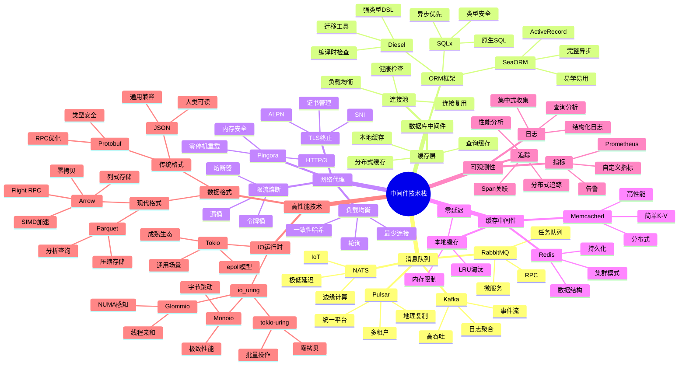

---

## 📝 消息队列架构图

### Kafka架构

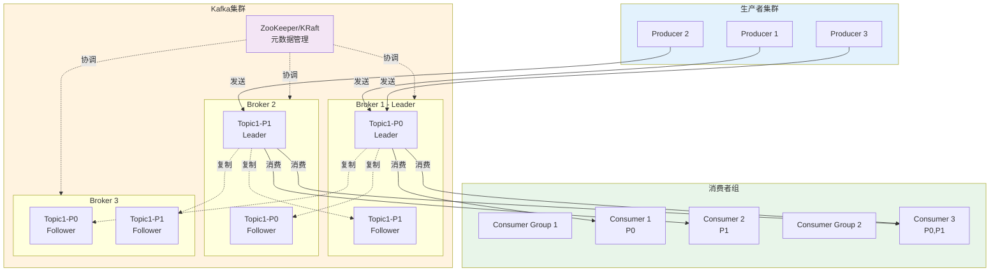

### 消息流转流程

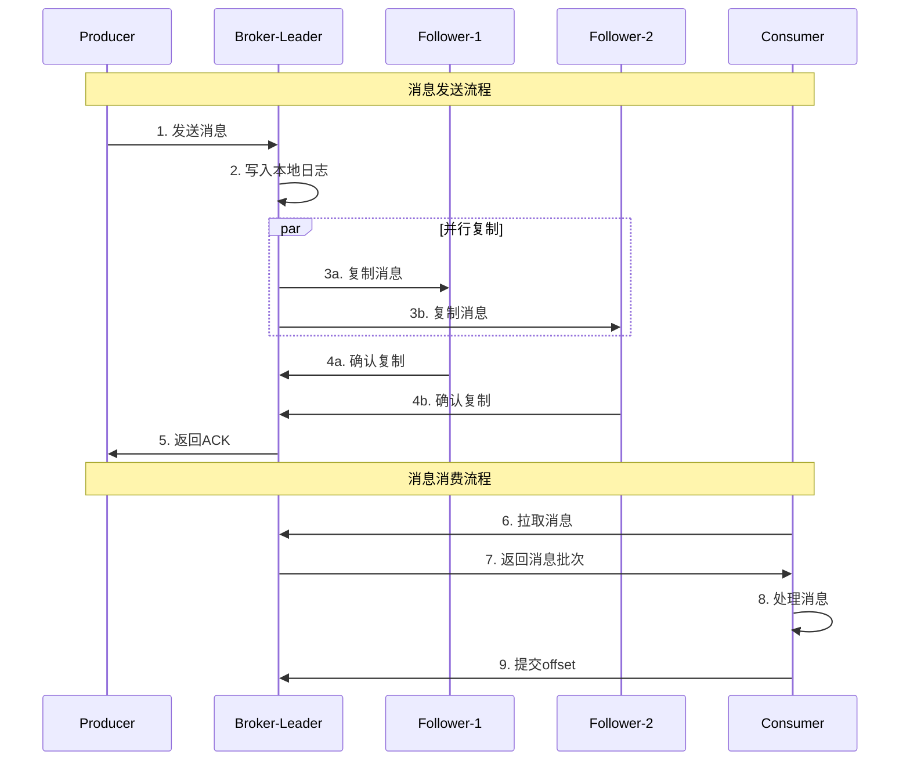

---

## 🔍 数据库中间件架构

### 连接池架构

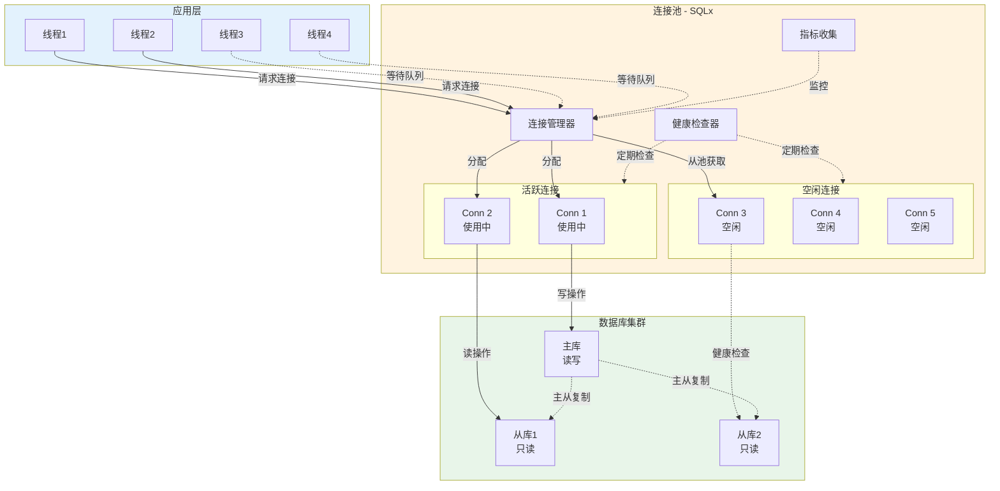

### 查询执行流程

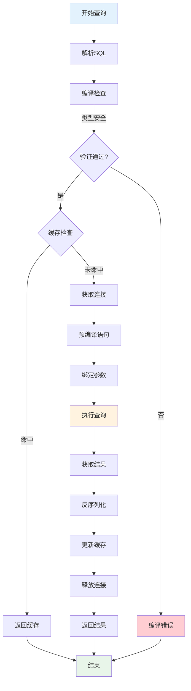

---

## 🔧 代理服务器架构

### Pingora请求处理

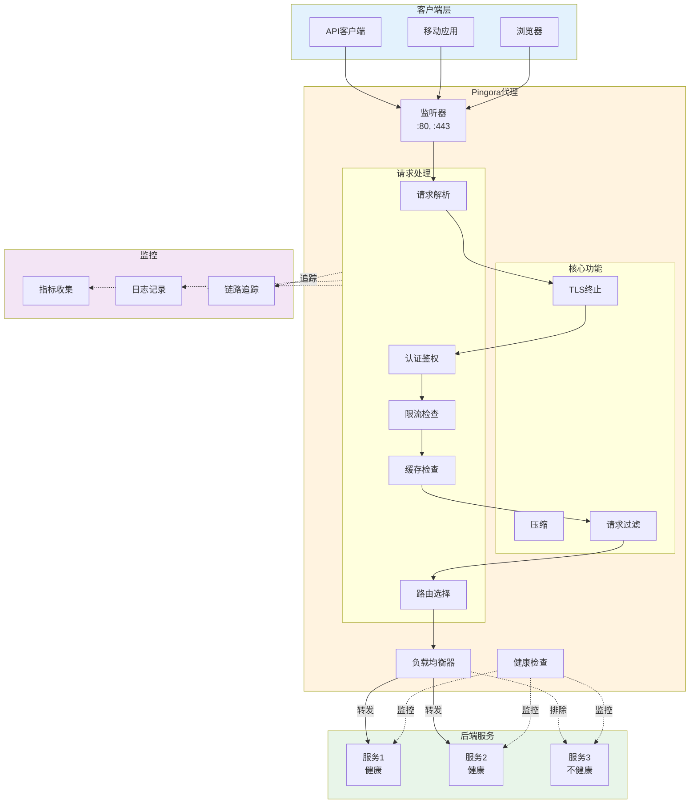

### 负载均衡决策流程

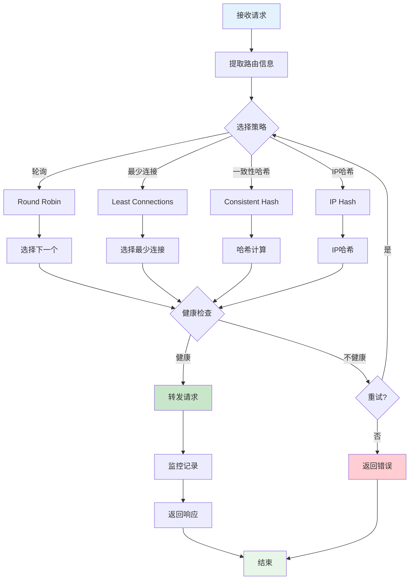

---

## 📊 缓存架构图

### 多级缓存架构

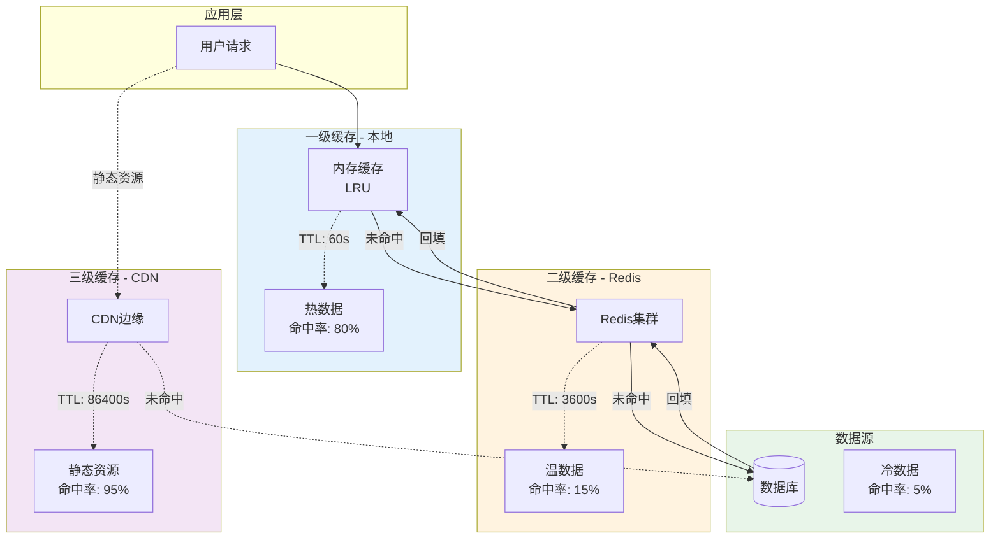

### 缓存更新策略

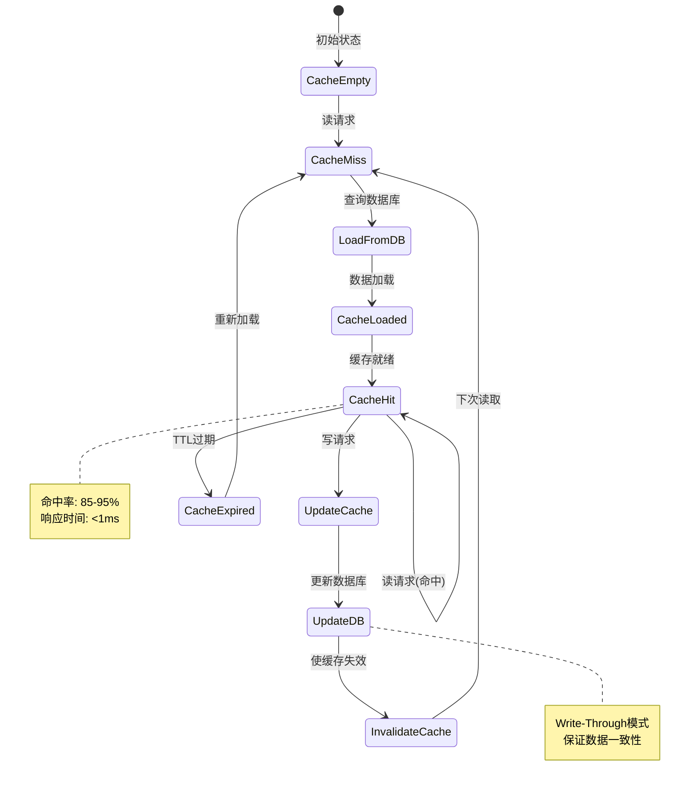

---

## 📊 监控与可观测性

### 全链路追踪

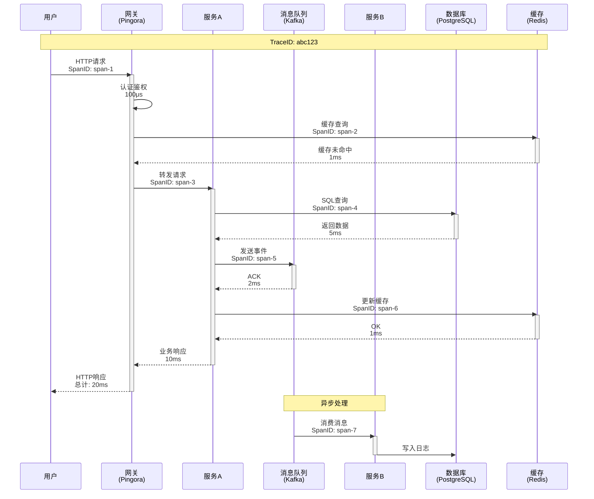

---

## 🔬 部署架构

### 微服务部署

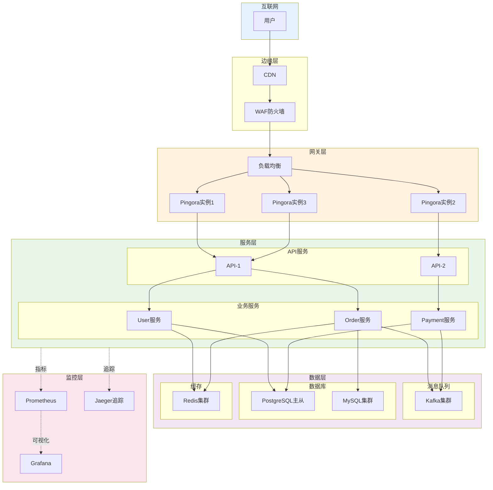

---

## 相关文档

- [知识图谱](./KNOWLEDGE_GRAPH_AND_CONCEPT_RELATIONS.md)
- [多维矩阵](./MULTI_DIMENSIONAL_COMPARISON_MATRIX.md)
- [性能分析](../analysis/rust190_ecosystem/03_performance_benchmarks/)
- [FAQ](../FAQ.md)

---

**文档版本**: v1.0  
**最后更新**: 2025-10-20  
**维护者**: Rust-lang项目组

---

## 返回导航

- [返回主索引](../00_MASTER_INDEX.md)
- [返回README](../README.md)
- [查看教程](../tutorials/)
