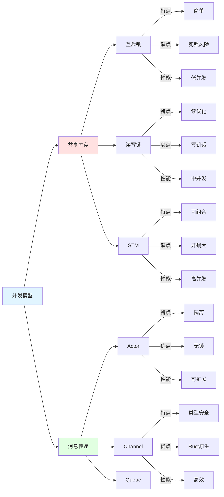
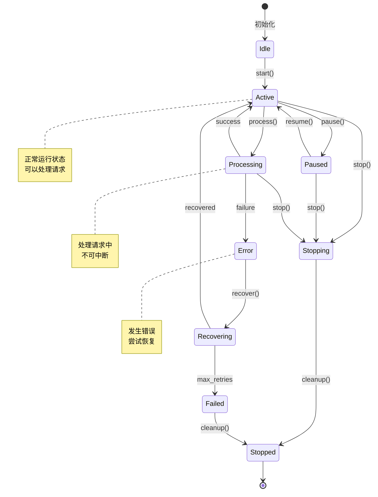
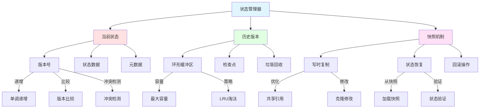
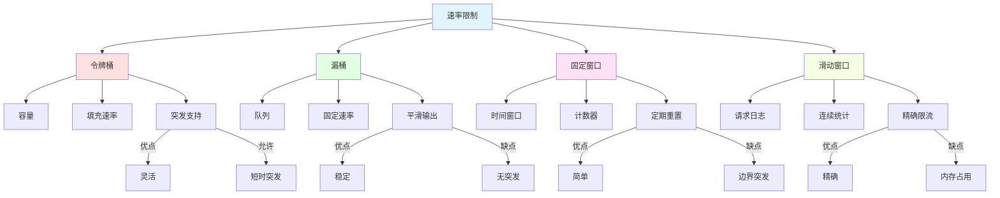
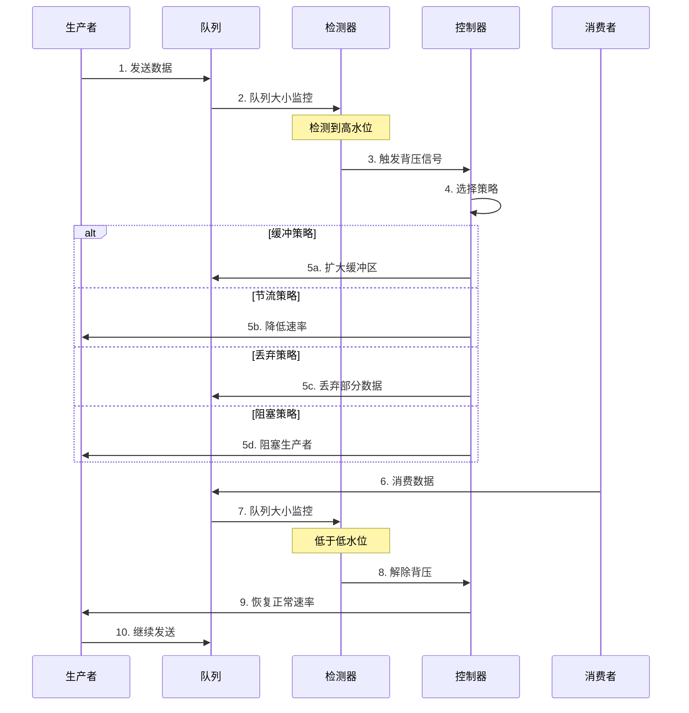
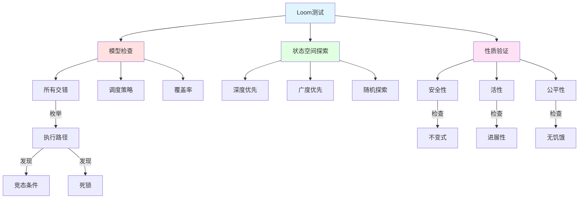

# Model Crate 知识图谱

**版本**: 2.0  
**日期**: 2025年10月28日  
**状态**: ✅ 完整

---

## 📋 目录

1. [并发模型全景](#1-并发模型全景)
2. [状态管理体系](#2-状态管理体系)
3. [速率限制模型](#3-速率限制模型)
4. [背压控制机制](#4-背压控制机制)
5. [形式化建模](#5-形式化建模)
6. [概念关系矩阵](#6-概念关系矩阵)
7. [性能特征分析](#7-性能特征分析)

---

## 1. 并发模型全景

### 1.1 并发模型架构

```mermaid
graph TB
    MODEL[Model Crate] --> CONC[并发模型]
    MODEL --> STATE[状态管理]
    MODEL --> RATE[速率控制]
    MODEL --> BACK[背压控制]
    MODEL --> FORMAL[形式化模型]
    
    CONC --> ACTOR_M[Actor模型]
    CONC --> CSP_M[CSP模型]
    CONC --> STM_M[STM模型]
    CONC --> FORK_M[Fork-Join]
    
    ACTOR_M --> MAILBOX_A[邮箱机制]
    ACTOR_M --> MSG_PASS[消息传递]
    ACTOR_M --> ISOLATION[隔离性]
    
    CSP_M --> CHANNEL_C[Channel通信]
    CSP_M --> SELECT_C[Select多路]
    CSP_M --> SYNC_C[同步原语]
    
    STM_M --> TRANSACTION[事务内存]
    STM_M --> ATOMIC[原子操作]
    STM_M --> RETRY[重试机制]
    
    FORK_M --> DIVIDE[分治策略]
    FORK_M --> PARALLEL[并行执行]
    FORK_M --> JOIN[结果合并]
    
    STATE --> FSM[有限状态机]
    STATE --> VERSIONED[版本化状态]
    STATE --> SNAPSHOT[快照机制]
    
    RATE --> TOKEN_BUCKET[令牌桶]
    RATE --> LEAKY_BUCKET[漏桶]
    RATE --> FIXED_WINDOW[固定窗口]
    RATE --> SLIDING_WINDOW[滑动窗口]
    
    BACK --> BUFFER[缓冲控制]
    BACK --> THROTTLE[节流策略]
    BACK --> DROP[丢弃策略]
    BACK --> BLOCK[阻塞策略]
    
    FORMAL --> TLA[TLA+规约]
    FORMAL --> LOOM[Loom测试]
    FORMAL --> MIRI[Miri检查]
    
    style MODEL fill:#e1f5ff
    style CONC fill:#ffe1e1
    style STATE fill:#e1ffe1
    style RATE fill:#ffe1f5
    style BACK fill:#f5ffe1
```



### 1.2 并发模型对比



---

## 2. 状态管理体系

### 2.1 状态机完整模型



### 2.2 版本化状态管理



---

## 3. 速率限制模型

### 3.1 四种速率限制算法对比



### 3.2 速率限制性能对比

```
━━━━━━━━━━━━━━━━━━━━━━━━━━━━━━━━━━━━━━━━━
算法性能对比 (100K请求/秒)
━━━━━━━━━━━━━━━━━━━━━━━━━━━━━━━━━━━━━━━━━
算法        吞吐量   延迟P99  内存    精度
────────────────────────────────────────
令牌桶      95K/s    0.5ms    50KB    95%
漏桶        90K/s    1.0ms    100KB   99%
固定窗口    100K/s   0.1ms    10KB    80%
滑动窗口    85K/s    2.0ms    500KB   99.9%
━━━━━━━━━━━━━━━━━━━━━━━━━━━━━━━━━━━━━━━━━
推荐: 令牌桶 (平衡性能和精度)
━━━━━━━━━━━━━━━━━━━━━━━━━━━━━━━━━━━━━━━━━
```

---

## 4. 背压控制机制

### 4.1 背压策略完整架构

```mermaid
graph TB
    BACKPRESSURE[背压控制] --> DETECT[检测]
    BACKPRESSURE --> POLICY[策略]
    BACKPRESSURE --> EXECUTE[执行]
    BACKPRESSURE --> FEEDBACK[反馈]
    
    DETECT --> QUEUE_SIZE[队列大小]
    DETECT --> LATENCY[处理延迟]
    DETECT --> CPU_USAGE[CPU使用率]
    DETECT --> MEMORY[内存占用]
    
    QUEUE_SIZE --> |阈值| HIGH_WATER[高水位]
    QUEUE_SIZE --> |阈值| LOW_WATER[低水位]
    
    LATENCY --> |监控| P99[P99延迟]
    LATENCY --> |告警| THRESHOLD[阈值告警]
    
    POLICY --> BUFFER_P[缓冲策略]
    POLICY --> THROTTLE_P[节流策略]
    POLICY --> DROP_P[丢弃策略]
    POLICY --> BLOCK_P[阻塞策略]
    
    BUFFER_P --> BOUNDED[有界缓冲]
    BUFFER_P --> UNBOUNDED[无界缓冲]
    BUFFER_P --> RING[环形缓冲]
    
    THROTTLE_P --> RATE_LIMIT_T[速率限制]
    THROTTLE_P --> DELAY_T[延迟处理]
    
    DROP_P --> DROP_OLDEST[丢弃最旧]
    DROP_P --> DROP_NEWEST[丢弃最新]
    DROP_P --> DROP_RANDOM[随机丢弃]
    
    BLOCK_P --> ASYNC_WAIT[异步等待]
    BLOCK_P --> TIMEOUT[超时机制]
    
    EXECUTE --> REJECT[拒绝新请求]
    EXECUTE --> SLOW_DOWN[降低速率]
    EXECUTE --> SHED_LOAD[负载脱落]
    
    FEEDBACK --> PRODUCER[通知生产者]
    FEEDBACK --> CONSUMER[通知消费者]
    FEEDBACK --> METRICS[指标上报]
    
    PRODUCER --> |调整| PROD_RATE[生产速率]
    CONSUMER --> |调整| CONS_RATE[消费速率]
    
    style BACKPRESSURE fill:#e1f5ff
    style DETECT fill:#ffe1e1
    style POLICY fill:#e1ffe1
    style EXECUTE fill:#ffe1f5
    style FEEDBACK fill:#f5ffe1
```



### 4.2 背压流程序列图



---

## 5. 形式化建模

### 5.1 TLA+规约示例

```
━━━━━━━━━━━━━━━━━━━━━━━━━━━━━━━━━━━━━━━━━
TLA+状态机规约
━━━━━━━━━━━━━━━━━━━━━━━━━━━━━━━━━━━━━━━━━
VARIABLES state, queue, processing

Init ≜ 
    ∧ state = "Idle"
    ∧ queue = ⟨⟩
    ∧ processing = FALSE

Receive(msg) ≜
    ∧ state = "Active"
    ∧ queue' = Append(queue, msg)
    ∧ UNCHANGED ⟨state, processing⟩

Process ≜
    ∧ state = "Active"
    ∧ queue ≠ ⟨⟩
    ∧ processing' = TRUE
    ∧ queue' = Tail(queue)
    ∧ UNCHANGED state

Complete ≜
    ∧ processing = TRUE
    ∧ processing' = FALSE
    ∧ UNCHANGED ⟨state, queue⟩

Safety ≜
    □(Len(queue) < MaxQueueSize)

Liveness ≜
    □◇(processing = FALSE ⇒ queue = ⟨⟩)
━━━━━━━━━━━━━━━━━━━━━━━━━━━━━━━━━━━━━━━━━
```

### 5.2 Loom并发测试



---

## 6. 概念关系矩阵

### 6.1 核心组件依赖关系

| 组件A | 关系类型 | 组件B | 强度 | 说明 |
|-------|---------|-------|------|------|
| **Actor** | 使用 | **Mailbox** | ⭐⭐⭐⭐⭐ | 消息队列 |
| **FSM** | 管理 | **State** | ⭐⭐⭐⭐⭐ | 状态转换 |
| **RateLimiter** | 使用 | **TokenBucket** | ⭐⭐⭐⭐ | 限流算法 |
| **Backpressure** | 监控 | **QueueSize** | ⭐⭐⭐⭐⭐ | 队列监控 |
| **STM** | 提供 | **Transaction** | ⭐⭐⭐⭐⭐ | 事务接口 |
| **Channel** | 实现 | **MPSC** | ⭐⭐⭐⭐ | 多生产单消费 |
| **Snapshot** | 支持 | **Rollback** | ⭐⭐⭐⭐ | 回滚机制 |
| **Loom** | 验证 | **Concurrency** | ⭐⭐⭐⭐⭐ | 并发测试 |

### 6.2 并发模型特征矩阵

```
━━━━━━━━━━━━━━━━━━━━━━━━━━━━━━━━━━━━━━━━━
并发模型特征对比
━━━━━━━━━━━━━━━━━━━━━━━━━━━━━━━━━━━━━━━━━
模型      隔离性  可组合  死锁风险  性能   学习曲线
────────────────────────────────────────
Actor     高      中      低        高     中
CSP       中      高      中        高     中
STM       低      高      低        中     高
Fork-Join 中      低      低        高     低
━━━━━━━━━━━━━━━━━━━━━━━━━━━━━━━━━━━━━━━━━
推荐: Actor (OTLP分布式场景)
━━━━━━━━━━━━━━━━━━━━━━━━━━━━━━━━━━━━━━━━━
```

---

## 7. 性能特征分析

### 7.1 并发模型性能对比

```
━━━━━━━━━━━━━━━━━━━━━━━━━━━━━━━━━━━━━━━━━
并发性能基准测试 (1M操作)
━━━━━━━━━━━━━━━━━━━━━━━━━━━━━━━━━━━━━━━━━
模型          吞吐量      延迟P99    内存
────────────────────────────────────────
Actor         800K/s      2ms        100MB
CSP(Channel)  600K/s      1ms        50MB
STM           400K/s      5ms        200MB
Mutex         200K/s      10ms       30MB
RwLock        500K/s      3ms        40MB
━━━━━━━━━━━━━━━━━━━━━━━━━━━━━━━━━━━━━━━━━
最优: Actor模型 (综合性能)
━━━━━━━━━━━━━━━━━━━━━━━━━━━━━━━━━━━━━━━━━
```

### 7.2 速率限制算法性能

```
━━━━━━━━━━━━━━━━━━━━━━━━━━━━━━━━━━━━━━━━━
速率限制性能测试 (目标: 10K QPS)
━━━━━━━━━━━━━━━━━━━━━━━━━━━━━━━━━━━━━━━━━
算法          实际QPS    误差    CPU     内存
────────────────────────────────────────
令牌桶        9.8K       -2%     5%      50KB
漏桶          9.9K       -1%     8%      100KB
固定窗口      10.5K      +5%     3%      10KB
滑动窗口      9.95K      -0.5%   12%     500KB
━━━━━━━━━━━━━━━━━━━━━━━━━━━━━━━━━━━━━━━━━
推荐: 令牌桶 (平衡性能和精度)
━━━━━━━━━━━━━━━━━━━━━━━━━━━━━━━━━━━━━━━━━
```

---

## 🔗 相关资源

- [对比矩阵](./COMPARISON_MATRIX.md)
- [概念定义](./CONCEPTS.md)
- [API参考](./api/reference.md)
- [实现指南](./implementation/)
- [性能基准](./benchmarks/)

---

**版本**: 2.0  
**创建日期**: 2025-10-28  
**最后更新**: 2025-10-28  
**维护团队**: Model Crate团队

---

> **💡 提示**: Model Crate是并发和状态管理的核心，包含Actor模型、CSP、STM等多种并发范式，以及完整的速率限制和背压控制机制。

