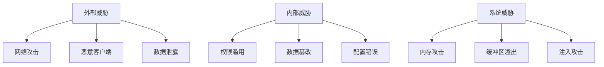

# OTLP Rust 安全配置和最佳实践指南

## 📋 目录

1. [安全概述](#安全概述)
2. [身份认证](#身份认证)
3. [授权控制](#授权控制)
4. [传输安全](#传输安全)
5. [数据安全](#数据安全)
6. [网络安全](#网络安全)
7. [运行时安全](#运行时安全)
8. [安全监控](#安全监控)
9. [安全最佳实践](#安全最佳实践)

## 安全概述

### 安全威胁模型



### 安全目标

- **机密性**: 保护数据不被未授权访问
- **完整性**: 确保数据不被篡改
- **可用性**: 保证服务持续可用
- **可审计性**: 记录所有安全相关操作

## 身份认证

### 1. JWT认证

```rust
use jsonwebtoken::{decode, encode, Algorithm, DecodingKey, EncodingKey, Header, Validation};
use serde::{Deserialize, Serialize};
use std::time::{Duration, SystemTime, UNIX_EPOCH};

#[derive(Debug, Serialize, Deserialize)]
struct Claims {
    sub: String,        // 主题
    exp: usize,         // 过期时间
    iat: usize,         // 签发时间
    iss: String,        // 签发者
    aud: String,        // 受众
    roles: Vec<String>, // 角色
}

pub struct JwtAuthProvider {
    encoding_key: EncodingKey,
    decoding_key: DecodingKey,
    validation: Validation,
}

impl JwtAuthProvider {
    pub fn new(secret: &str) -> Self {
        let encoding_key = EncodingKey::from_secret(secret.as_ref());
        let decoding_key = DecodingKey::from_secret(secret.as_ref());

        let mut validation = Validation::new(Algorithm::HS256);
        validation.leeway = 30; // 30秒容差
        validation.validate_exp = true;
        validation.validate_iat = true;

        Self {
            encoding_key,
            decoding_key,
            validation,
        }
    }

    pub fn generate_token(&self, user_id: &str, roles: Vec<String>) -> Result<String, AuthError> {
        let now = SystemTime::now()
            .duration_since(UNIX_EPOCH)
            .unwrap()
            .as_secs() as usize;

        let claims = Claims {
            sub: user_id.to_string(),
            exp: now + 3600, // 1小时过期
            iat: now,
            iss: "otlp-rust".to_string(),
            aud: "otlp-clients".to_string(),
            roles,
        };

        encode(&Header::default(), &claims, &self.encoding_key)
            .map_err(|_| AuthError::TokenGenerationFailed)
    }

    pub fn validate_token(&self, token: &str) -> Result<Claims, AuthError> {
        let token_data = decode::<Claims>(token, &self.decoding_key, &self.validation)
            .map_err(|_| AuthError::InvalidToken)?;

        Ok(token_data.claims)
    }
}
```

### 2. OAuth2认证

```rust
use oauth2::{Client, ClientId, ClientSecret, TokenResponse};
use oauth2::basic::BasicClient;
use oauth2::reqwest::async_http_client;
use oauth2::url::Url;

pub struct OAuth2AuthProvider {
    client: BasicClient,
}

impl OAuth2AuthProvider {
    pub fn new(
        client_id: String,
        client_secret: String,
        auth_url: String,
        token_url: String,
    ) -> Result<Self, AuthError> {
        let client = BasicClient::new(
            ClientId::new(client_id),
            Some(ClientSecret::new(client_secret)),
            Url::parse(&auth_url)?,
            Some(Url::parse(&token_url)?),
        );

        Ok(Self { client })
    }

    pub async fn authenticate(&self, code: &str) -> Result<TokenResponse, AuthError> {
        let token_result = self.client
            .exchange_code(oauth2::AuthorizationCode::new(code.to_string()))
            .request_async(async_http_client)
            .await
            .map_err(|_| AuthError::AuthenticationFailed)?;

        Ok(token_result)
    }
}
```

### 3. mTLS认证

```rust
use rustls::{Certificate, PrivateKey, ServerConfig, ClientConfig};
use rustls_pemfile::{certs, pkcs8_private_keys};
use std::fs::File;
use std::io::BufReader;

pub struct MtlsAuthProvider {
    server_config: ServerConfig,
    client_config: ClientConfig,
}

impl MtlsAuthProvider {
    pub fn new(
        server_cert_path: &str,
        server_key_path: &str,
        ca_cert_path: &str,
    ) -> Result<Self, AuthError> {
        // 加载服务器证书和私钥
        let cert_file = File::open(server_cert_path)?;
        let mut cert_reader = BufReader::new(cert_file);
        let cert_chain = certs(&mut cert_reader)?
            .into_iter()
            .map(Certificate)
            .collect();

        let key_file = File::open(server_key_path)?;
        let mut key_reader = BufReader::new(key_file);
        let mut keys = pkcs8_private_keys(&mut key_reader)?;

        if keys.is_empty() {
            return Err(AuthError::NoPrivateKey);
        }

        let private_key = PrivateKey(keys.remove(0));

        // 配置服务器
        let server_config = ServerConfig::builder()
            .with_safe_defaults()
            .with_client_cert_verifier(rustls::server::AllowAnyAuthenticatedClient::new(
                load_ca_certificates(ca_cert_path)?
            ))
            .with_single_cert(cert_chain, private_key)
            .map_err(|_| AuthError::ServerConfigFailed)?;

        // 配置客户端
        let client_config = ClientConfig::builder()
            .with_safe_defaults()
            .with_root_certificates(load_ca_certificates(ca_cert_path)?)
            .with_client_auth_cert(cert_chain, private_key)
            .map_err(|_| AuthError::ClientConfigFailed)?;

        Ok(Self {
            server_config,
            client_config,
        })
    }
}

fn load_ca_certificates(path: &str) -> Result<rustls::RootCertStore, AuthError> {
    let mut root_store = rustls::RootCertStore::empty();
    let cert_file = File::open(path)?;
    let mut cert_reader = BufReader::new(cert_file);
    let certs = certs(&mut cert_reader)?;

    for cert in certs {
        root_store.add(&Certificate(cert))?;
    }

    Ok(root_store)
}
```

## 授权控制

### 1. 基于角色的访问控制 (RBAC)

```rust
use std::collections::HashMap;
use serde::{Deserialize, Serialize};

#[derive(Debug, Clone, Serialize, Deserialize)]
pub enum Permission {
    ReadTraces,
    WriteTraces,
    ReadMetrics,
    WriteMetrics,
    ReadLogs,
    WriteLogs,
    AdminConfig,
    ManageUsers,
}

#[derive(Debug, Clone, Serialize, Deserialize)]
pub struct Role {
    pub name: String,
    pub permissions: Vec<Permission>,
}

#[derive(Debug, Clone, Serialize, Deserialize)]
pub struct User {
    pub id: String,
    pub username: String,
    pub roles: Vec<String>,
    pub is_active: bool,
}

pub struct RbacProvider {
    roles: HashMap<String, Role>,
    users: HashMap<String, User>,
}

impl RbacProvider {
    pub fn new() -> Self {
        let mut roles = HashMap::new();

        // 定义角色
        roles.insert("admin".to_string(), Role {
            name: "admin".to_string(),
            permissions: vec![
                Permission::ReadTraces,
                Permission::WriteTraces,
                Permission::ReadMetrics,
                Permission::WriteMetrics,
                Permission::ReadLogs,
                Permission::WriteLogs,
                Permission::AdminConfig,
                Permission::ManageUsers,
            ],
        });

        roles.insert("operator".to_string(), Role {
            name: "operator".to_string(),
            permissions: vec![
                Permission::ReadTraces,
                Permission::ReadMetrics,
                Permission::ReadLogs,
            ],
        });

        roles.insert("writer".to_string(), Role {
            name: "writer".to_string(),
            permissions: vec![
                Permission::WriteTraces,
                Permission::WriteMetrics,
                Permission::WriteLogs,
            ],
        });

        Self {
            roles,
            users: HashMap::new(),
        }
    }

    pub fn check_permission(&self, user_id: &str, permission: &Permission) -> bool {
        if let Some(user) = self.users.get(user_id) {
            if !user.is_active {
                return false;
            }

            for role_name in &user.roles {
                if let Some(role) = self.roles.get(role_name) {
                    if role.permissions.contains(permission) {
                        return true;
                    }
                }
            }
        }

        false
    }

    pub fn add_user(&mut self, user: User) {
        self.users.insert(user.id.clone(), user);
    }

    pub fn add_role(&mut self, role: Role) {
        self.roles.insert(role.name.clone(), role);
    }
}
```

### 2. 基于属性的访问控制 (ABAC)

```rust
use std::collections::HashMap;
use serde::{Deserialize, Serialize};

#[derive(Debug, Clone, Serialize, Deserialize)]
pub struct Attribute {
    pub name: String,
    pub value: serde_json::Value,
}

#[derive(Debug, Clone, Serialize, Deserialize)]
pub struct Policy {
    pub id: String,
    pub effect: PolicyEffect,
    pub conditions: Vec<PolicyCondition>,
}

#[derive(Debug, Clone, Serialize, Deserialize)]
pub enum PolicyEffect {
    Allow,
    Deny,
}

#[derive(Debug, Clone, Serialize, Deserialize)]
pub struct PolicyCondition {
    pub attribute: String,
    pub operator: ConditionOperator,
    pub value: serde_json::Value,
}

#[derive(Debug, Clone, Serialize, Deserialize)]
pub enum ConditionOperator {
    Equals,
    NotEquals,
    In,
    NotIn,
    GreaterThan,
    LessThan,
    StartsWith,
    EndsWith,
}

pub struct AbacProvider {
    policies: Vec<Policy>,
}

impl AbacProvider {
    pub fn new() -> Self {
        Self {
            policies: Vec::new(),
        }
    }

    pub fn add_policy(&mut self, policy: Policy) {
        self.policies.push(policy);
    }

    pub fn evaluate(&self, user_attrs: &[Attribute], resource_attrs: &[Attribute]) -> bool {
        let mut allow_result = false;

        for policy in &self.policies {
            if self.matches_policy(policy, user_attrs, resource_attrs) {
                match policy.effect {
                    PolicyEffect::Allow => allow_result = true,
                    PolicyEffect::Deny => return false,
                }
            }
        }

        allow_result
    }

    fn matches_policy(&self, policy: &Policy, user_attrs: &[Attribute], resource_attrs: &[Attribute]) -> bool {
        for condition in &policy.conditions {
            let attr_value = self.get_attribute_value(&condition.attribute, user_attrs, resource_attrs);

            if !self.evaluate_condition(attr_value, &condition.operator, &condition.value) {
                return false;
            }
        }

        true
    }

    fn get_attribute_value(&self, attr_name: &str, user_attrs: &[Attribute], resource_attrs: &[Attribute]) -> Option<&serde_json::Value> {
        // 首先在用户属性中查找
        for attr in user_attrs {
            if attr.name == attr_name {
                return Some(&attr.value);
            }
        }

        // 然后在资源属性中查找
        for attr in resource_attrs {
            if attr.name == attr_name {
                return Some(&attr.value);
            }
        }

        None
    }

    fn evaluate_condition(&self, attr_value: Option<&serde_json::Value>, operator: &ConditionOperator, condition_value: &serde_json::Value) -> bool {
        let attr_value = match attr_value {
            Some(v) => v,
            None => return false,
        };

        match operator {
            ConditionOperator::Equals => attr_value == condition_value,
            ConditionOperator::NotEquals => attr_value != condition_value,
            ConditionOperator::In => {
                if let Some(arr) = condition_value.as_array() {
                    arr.contains(attr_value)
                } else {
                    false
                }
            },
            ConditionOperator::NotIn => {
                if let Some(arr) = condition_value.as_array() {
                    !arr.contains(attr_value)
                } else {
                    true
                }
            },
            ConditionOperator::GreaterThan => {
                if let (Some(a), Some(b)) = (attr_value.as_f64(), condition_value.as_f64()) {
                    a > b
                } else {
                    false
                }
            },
            ConditionOperator::LessThan => {
                if let (Some(a), Some(b)) = (attr_value.as_f64(), condition_value.as_f64()) {
                    a < b
                } else {
                    false
                }
            },
            ConditionOperator::StartsWith => {
                if let (Some(a), Some(b)) = (attr_value.as_str(), condition_value.as_str()) {
                    a.starts_with(b)
                } else {
                    false
                }
            },
            ConditionOperator::EndsWith => {
                if let (Some(a), Some(b)) = (attr_value.as_str(), condition_value.as_str()) {
                    a.ends_with(b)
                } else {
                    false
                }
            },
        }
    }
}
```

## 传输安全

### 1. TLS配置

```rust
use rustls::{ServerConfig, ClientConfig, Certificate, PrivateKey};
use rustls_pemfile::{certs, pkcs8_private_keys};
use std::fs::File;
use std::io::BufReader;

pub struct TlsConfig {
    pub server_config: ServerConfig,
    pub client_config: ClientConfig,
}

impl TlsConfig {
    pub fn new(
        cert_path: &str,
        key_path: &str,
        ca_path: Option<&str>,
    ) -> Result<Self, SecurityError> {
        // 加载证书链
        let cert_chain = load_certificate_chain(cert_path)?;

        // 加载私钥
        let private_key = load_private_key(key_path)?;

        // 配置服务器
        let server_config = if let Some(ca_path) = ca_path {
            // 客户端证书验证
            let root_store = load_ca_certificates(ca_path)?;
            ServerConfig::builder()
                .with_safe_defaults()
                .with_client_cert_verifier(rustls::server::AllowAnyAuthenticatedClient::new(root_store))
                .with_single_cert(cert_chain.clone(), private_key.clone())
                .map_err(|_| SecurityError::ServerConfigFailed)?
        } else {
            // 仅服务器证书
            ServerConfig::builder()
                .with_safe_defaults()
                .with_no_client_auth()
                .with_single_cert(cert_chain.clone(), private_key.clone())
                .map_err(|_| SecurityError::ServerConfigFailed)?
        };

        // 配置客户端
        let client_config = if let Some(ca_path) = ca_path {
            let root_store = load_ca_certificates(ca_path)?;
            ClientConfig::builder()
                .with_safe_defaults()
                .with_root_certificates(root_store)
                .with_client_auth_cert(cert_chain, private_key)
                .map_err(|_| SecurityError::ClientConfigFailed)?
        } else {
            ClientConfig::builder()
                .with_safe_defaults()
                .with_root_certificates(load_ca_certificates(ca_path.unwrap_or("ca.pem"))?)
                .with_no_client_auth()
        };

        Ok(Self {
            server_config,
            client_config,
        })
    }
}

fn load_certificate_chain(path: &str) -> Result<Vec<Certificate>, SecurityError> {
    let cert_file = File::open(path)?;
    let mut cert_reader = BufReader::new(cert_file);
    let certs = certs(&mut cert_reader)?;

    Ok(certs.into_iter().map(Certificate).collect())
}

fn load_private_key(path: &str) -> Result<PrivateKey, SecurityError> {
    let key_file = File::open(path)?;
    let mut key_reader = BufReader::new(key_file);
    let mut keys = pkcs8_private_keys(&mut key_reader)?;

    if keys.is_empty() {
        return Err(SecurityError::NoPrivateKey);
    }

    Ok(PrivateKey(keys.remove(0)))
}
```

### 2. 加密传输

```rust
use aes_gcm::{Aes256Gcm, Key, Nonce};
use aes_gcm::aead::{Aead, NewAead};
use rand::{RngCore, thread_rng};

pub struct EncryptionProvider {
    cipher: Aes256Gcm,
}

impl EncryptionProvider {
    pub fn new(key: &[u8]) -> Result<Self, SecurityError> {
        if key.len() != 32 {
            return Err(SecurityError::InvalidKeyLength);
        }

        let key = Key::from_slice(key);
        let cipher = Aes256Gcm::new(key);

        Ok(Self { cipher })
    }

    pub fn encrypt(&self, plaintext: &[u8]) -> Result<Vec<u8>, SecurityError> {
        let mut nonce_bytes = [0u8; 12];
        thread_rng().fill_bytes(&mut nonce_bytes);
        let nonce = Nonce::from_slice(&nonce_bytes);

        let ciphertext = self.cipher
            .encrypt(nonce, plaintext)
            .map_err(|_| SecurityError::EncryptionFailed)?;

        // 将nonce和密文组合
        let mut result = Vec::new();
        result.extend_from_slice(&nonce_bytes);
        result.extend_from_slice(&ciphertext);

        Ok(result)
    }

    pub fn decrypt(&self, ciphertext: &[u8]) -> Result<Vec<u8>, SecurityError> {
        if ciphertext.len() < 12 {
            return Err(SecurityError::InvalidCiphertext);
        }

        let (nonce_bytes, encrypted_data) = ciphertext.split_at(12);
        let nonce = Nonce::from_slice(nonce_bytes);

        let plaintext = self.cipher
            .decrypt(nonce, encrypted_data)
            .map_err(|_| SecurityError::DecryptionFailed)?;

        Ok(plaintext)
    }
}
```

## 数据安全

### 1. 数据脱敏

```rust
use regex::Regex;
use std::collections::HashSet;

pub struct DataMasker {
    sensitive_patterns: Vec<Regex>,
    sensitive_fields: HashSet<String>,
}

impl DataMasker {
    pub fn new() -> Self {
        let mut patterns = Vec::new();

        // 信用卡号
        patterns.push(Regex::new(r"\b\d{4}[-\s]?\d{4}[-\s]?\d{4}[-\s]?\d{4}\b").unwrap());

        // 邮箱
        patterns.push(Regex::new(r"\b[A-Za-z0-9._%+-]+@[A-Za-z0-9.-]+\.[A-Z|a-z]{2,}\b").unwrap());

        // 手机号
        patterns.push(Regex::new(r"\b1[3-9]\d{9}\b").unwrap());

        // 身份证号
        patterns.push(Regex::new(r"\b\d{17}[\dXx]\b").unwrap());

        let mut sensitive_fields = HashSet::new();
        sensitive_fields.insert("password".to_string());
        sensitive_fields.insert("token".to_string());
        sensitive_fields.insert("secret".to_string());
        sensitive_fields.insert("key".to_string());

        Self {
            sensitive_patterns: patterns,
            sensitive_fields,
        }
    }

    pub fn mask_trace(&self, trace: &mut TraceData) {
        for span in &mut trace.spans {
            self.mask_span(span);
        }
    }

    pub fn mask_span(&self, span: &mut SpanData) {
        let mut masked_attributes = Vec::new();

        for (key, value) in span.attributes() {
            if self.is_sensitive_field(key) {
                masked_attributes.push((key.clone(), self.mask_value(value)));
            } else if let Some(masked_value) = self.mask_patterns(value) {
                masked_attributes.push((key.clone(), masked_value));
            } else {
                masked_attributes.push((key.clone(), value.clone()));
            }
        }

        span.set_attributes(masked_attributes);
    }

    fn is_sensitive_field(&self, field_name: &str) -> bool {
        self.sensitive_fields.contains(field_name.to_lowercase().as_str())
    }

    fn mask_value(&self, value: &str) -> String {
        if value.len() <= 4 {
            "*".repeat(value.len())
        } else {
            format!("{}***{}", &value[..2], &value[value.len()-2..])
        }
    }

    fn mask_patterns(&self, value: &str) -> Option<String> {
        let mut masked_value = value.to_string();
        let mut found_sensitive = false;

        for pattern in &self.sensitive_patterns {
            if pattern.is_match(value) {
                masked_value = pattern.replace_all(&masked_value, "***MASKED***").to_string();
                found_sensitive = true;
            }
        }

        if found_sensitive {
            Some(masked_value)
        } else {
            None
        }
    }
}
```

### 2. 数据加密存储

```rust
use serde::{Serialize, Deserialize};
use std::collections::HashMap;

#[derive(Serialize, Deserialize)]
pub struct EncryptedData {
    pub encrypted_content: Vec<u8>,
    pub encryption_key_id: String,
    pub algorithm: String,
}

pub struct DataEncryption {
    encryption_provider: EncryptionProvider,
    key_manager: KeyManager,
}

impl DataEncryption {
    pub fn new() -> Result<Self, SecurityError> {
        let encryption_provider = EncryptionProvider::new(&generate_key())?;
        let key_manager = KeyManager::new()?;

        Ok(Self {
            encryption_provider,
            key_manager,
        })
    }

    pub fn encrypt_data<T: Serialize>(&self, data: &T) -> Result<EncryptedData, SecurityError> {
        let serialized = serde_json::to_vec(data)?;
        let encrypted_content = self.encryption_provider.encrypt(&serialized)?;

        Ok(EncryptedData {
            encrypted_content,
            encryption_key_id: "default".to_string(),
            algorithm: "AES-256-GCM".to_string(),
        })
    }

    pub fn decrypt_data<T: Deserialize>(&self, encrypted_data: &EncryptedData) -> Result<T, SecurityError> {
        let decrypted_content = self.encryption_provider.decrypt(&encrypted_data.encrypted_content)?;
        let deserialized: T = serde_json::from_slice(&decrypted_content)?;

        Ok(deserialized)
    }
}

fn generate_key() -> [u8; 32] {
    let mut key = [0u8; 32];
    thread_rng().fill_bytes(&mut key);
    key
}
```

## 网络安全

### 1. 防火墙配置

```rust
use std::net::{IpAddr, Ipv4Addr};
use std::collections::HashSet;

pub struct FirewallConfig {
    allowed_ips: HashSet<IpAddr>,
    blocked_ips: HashSet<IpAddr>,
    allowed_ports: HashSet<u16>,
    rate_limits: HashMap<IpAddr, RateLimit>,
}

#[derive(Debug, Clone)]
pub struct RateLimit {
    pub requests_per_minute: u32,
    pub burst_size: u32,
    pub window_start: std::time::Instant,
    pub request_count: u32,
}

impl FirewallConfig {
    pub fn new() -> Self {
        let mut allowed_ips = HashSet::new();
        allowed_ips.insert(IpAddr::V4(Ipv4Addr::new(127, 0, 0, 1)));

        let mut allowed_ports = HashSet::new();
        allowed_ports.insert(4317); // gRPC
        allowed_ports.insert(4318); // HTTP

        Self {
            allowed_ips,
            blocked_ips: HashSet::new(),
            allowed_ports,
            rate_limits: HashMap::new(),
        }
    }

    pub fn allow_ip(&mut self, ip: IpAddr) {
        self.allowed_ips.insert(ip);
        self.blocked_ips.remove(&ip);
    }

    pub fn block_ip(&mut self, ip: IpAddr) {
        self.blocked_ips.insert(ip);
        self.allowed_ips.remove(&ip);
    }

    pub fn is_allowed(&self, ip: IpAddr, port: u16) -> bool {
        if self.blocked_ips.contains(&ip) {
            return false;
        }

        if !self.allowed_ips.contains(&ip) {
            return false;
        }

        if !self.allowed_ports.contains(&port) {
            return false;
        }

        true
    }

    pub fn check_rate_limit(&mut self, ip: IpAddr) -> bool {
        let now = std::time::Instant::now();
        let rate_limit = self.rate_limits.entry(ip).or_insert(RateLimit {
            requests_per_minute: 1000,
            burst_size: 100,
            window_start: now,
            request_count: 0,
        });

        // 重置窗口
        if now.duration_since(rate_limit.window_start).as_secs() >= 60 {
            rate_limit.window_start = now;
            rate_limit.request_count = 0;
        }

        // 检查速率限制
        if rate_limit.request_count >= rate_limit.requests_per_minute {
            false
        } else {
            rate_limit.request_count += 1;
            true
        }
    }
}
```

### 2. DDoS防护

```rust
use std::collections::HashMap;
use std::time::{Duration, Instant};

pub struct DdosProtection {
    request_counts: HashMap<IpAddr, RequestCounter>,
    suspicious_ips: HashSet<IpAddr>,
}

#[derive(Debug, Clone)]
struct RequestCounter {
    count: u32,
    window_start: Instant,
    is_blocked: bool,
    block_until: Option<Instant>,
}

impl DdosProtection {
    pub fn new() -> Self {
        Self {
            request_counts: HashMap::new(),
            suspicious_ips: HashSet::new(),
        }
    }

    pub fn check_request(&mut self, ip: IpAddr) -> DdosAction {
        let now = Instant::now();
        let counter = self.request_counts.entry(ip).or_insert(RequestCounter {
            count: 0,
            window_start: now,
            is_blocked: false,
            block_until: None,
        });

        // 检查是否在阻塞期
        if let Some(block_until) = counter.block_until {
            if now < block_until {
                return DdosAction::Block;
            } else {
                // 解除阻塞
                counter.is_blocked = false;
                counter.block_until = None;
                counter.count = 0;
                counter.window_start = now;
            }
        }

        // 重置窗口
        if now.duration_since(counter.window_start).as_secs() >= 60 {
            counter.window_start = now;
            counter.count = 0;
        }

        counter.count += 1;

        // 检查阈值
        if counter.count > 1000 {
            // 标记为可疑IP
            self.suspicious_ips.insert(ip);

            // 阻塞5分钟
            counter.is_blocked = true;
            counter.block_until = Some(now + Duration::from_secs(300));

            DdosAction::Block
        } else if counter.count > 500 {
            // 限制速率
            DdosAction::RateLimit
        } else {
            DdosAction::Allow
        }
    }
}

#[derive(Debug, Clone)]
pub enum DdosAction {
    Allow,
    RateLimit,
    Block,
}
```

## 运行时安全

### 1. 内存保护

```rust
use std::sync::Arc;
use std::sync::atomic::{AtomicBool, Ordering};

pub struct MemoryProtection {
    is_enabled: Arc<AtomicBool>,
    max_memory_usage: usize,
    current_memory_usage: Arc<std::sync::atomic::AtomicUsize>,
}

impl MemoryProtection {
    pub fn new(max_memory_usage: usize) -> Self {
        Self {
            is_enabled: Arc::new(AtomicBool::new(true)),
            max_memory_usage,
            current_memory_usage: Arc::new(std::sync::atomic::AtomicUsize::new(0)),
        }
    }

    pub fn check_memory_usage(&self) -> Result<(), SecurityError> {
        if !self.is_enabled.load(Ordering::Relaxed) {
            return Ok(());
        }

        let current = self.current_memory_usage.load(Ordering::Relaxed);
        if current > self.max_memory_usage {
            return Err(SecurityError::MemoryLimitExceeded);
        }

        Ok(())
    }

    pub fn allocate_memory(&self, size: usize) -> Result<(), SecurityError> {
        self.check_memory_usage()?;

        let current = self.current_memory_usage.fetch_add(size, Ordering::Relaxed);
        if current + size > self.max_memory_usage {
            self.current_memory_usage.fetch_sub(size, Ordering::Relaxed);
            return Err(SecurityError::MemoryLimitExceeded);
        }

        Ok(())
    }

    pub fn deallocate_memory(&self, size: usize) {
        self.current_memory_usage.fetch_sub(size, Ordering::Relaxed);
    }
}
```

### 2. 输入验证

```rust
use std::collections::HashSet;
use regex::Regex;

pub struct InputValidator {
    max_string_length: usize,
    allowed_characters: HashSet<char>,
    dangerous_patterns: Vec<Regex>,
}

impl InputValidator {
    pub fn new() -> Self {
        let mut dangerous_patterns = Vec::new();

        // SQL注入模式
        dangerous_patterns.push(Regex::new(r"(?i)(union|select|insert|update|delete|drop|create|alter)").unwrap());

        // XSS模式
        dangerous_patterns.push(Regex::new(r"(?i)<script|javascript:|onload=|onerror=").unwrap());

        // 路径遍历模式
        dangerous_patterns.push(Regex::new(r"\.\./|\.\.\\|\.\.%2f|\.\.%5c").unwrap());

        Self {
            max_string_length: 10000,
            allowed_characters: HashSet::new(), // 空集合表示允许所有字符
            dangerous_patterns,
        }
    }

    pub fn validate_string(&self, input: &str) -> Result<(), SecurityError> {
        // 检查长度
        if input.len() > self.max_string_length {
            return Err(SecurityError::InputTooLong);
        }

        // 检查字符集
        if !self.allowed_characters.is_empty() {
            for ch in input.chars() {
                if !self.allowed_characters.contains(&ch) {
                    return Err(SecurityError::InvalidCharacter);
                }
            }
        }

        // 检查危险模式
        for pattern in &self.dangerous_patterns {
            if pattern.is_match(input) {
                return Err(SecurityError::DangerousPattern);
            }
        }

        Ok(())
    }

    pub fn sanitize_string(&self, input: &str) -> String {
        let mut sanitized = input.to_string();

        // 移除危险模式
        for pattern in &self.dangerous_patterns {
            sanitized = pattern.replace_all(&sanitized, "").to_string();
        }

        // 截断长度
        if sanitized.len() > self.max_string_length {
            sanitized.truncate(self.max_string_length);
        }

        sanitized
    }
}
```

## 安全监控

### 1. 安全事件记录

```rust
use serde::{Serialize, Deserialize};
use std::time::SystemTime;

#[derive(Debug, Clone, Serialize, Deserialize)]
pub struct SecurityEvent {
    pub timestamp: SystemTime,
    pub event_type: SecurityEventType,
    pub severity: SecuritySeverity,
    pub source_ip: Option<IpAddr>,
    pub user_id: Option<String>,
    pub details: serde_json::Value,
}

#[derive(Debug, Clone, Serialize, Deserialize)]
pub enum SecurityEventType {
    AuthenticationFailure,
    AuthorizationDenied,
    SuspiciousActivity,
    DataBreach,
    SystemIntrusion,
    ConfigurationChange,
}

#[derive(Debug, Clone, Serialize, Deserialize)]
pub enum SecuritySeverity {
    Low,
    Medium,
    High,
    Critical,
}

pub struct SecurityMonitor {
    events: Vec<SecurityEvent>,
    max_events: usize,
}

impl SecurityMonitor {
    pub fn new(max_events: usize) -> Self {
        Self {
            events: Vec::new(),
            max_events,
        }
    }

    pub fn record_event(&mut self, event: SecurityEvent) {
        self.events.push(event);

        // 限制事件数量
        if self.events.len() > self.max_events {
            self.events.remove(0);
        }

        // 检查是否需要告警
        self.check_alerts();
    }

    pub fn get_events(&self, filter: Option<SecurityEventFilter>) -> Vec<SecurityEvent> {
        if let Some(filter) = filter {
            self.events.iter()
                .filter(|event| filter.matches(event))
                .cloned()
                .collect()
        } else {
            self.events.clone()
        }
    }

    fn check_alerts(&self) {
        // 检查最近的高严重性事件
        let recent_critical_events: Vec<_> = self.events.iter()
            .filter(|event| {
                matches!(event.severity, SecuritySeverity::Critical) &&
                event.timestamp.elapsed().unwrap_or_default().as_secs() < 300 // 5分钟内
            })
            .collect();

        if recent_critical_events.len() > 5 {
            // 发送告警
            self.send_alert("Multiple critical security events detected");
        }
    }

    fn send_alert(&self, message: &str) {
        // 发送告警的实现
        println!("SECURITY ALERT: {}", message);
    }
}

#[derive(Debug, Clone)]
pub struct SecurityEventFilter {
    pub event_type: Option<SecurityEventType>,
    pub severity: Option<SecuritySeverity>,
    pub time_range: Option<(SystemTime, SystemTime)>,
}
```

## 安全最佳实践

### 1. 安全配置模板

```toml
# config/security.toml
[security]
# 认证配置
[security.authentication]
enabled = true
method = "jwt"  # jwt, oauth2, mtls
jwt_secret = "your-secret-key"
jwt_expiry = 3600
oauth2_client_id = "your-client-id"
oauth2_client_secret = "your-client-secret"

# 授权配置
[security.authorization]
enabled = true
method = "rbac"  # rbac, abac
default_role = "operator"

# TLS配置
[security.tls]
enabled = true
cert_path = "/etc/otlp-rust/tls/server.crt"
key_path = "/etc/otlp-rust/tls/server.key"
ca_path = "/etc/otlp-rust/tls/ca.crt"
min_version = "TLSv1.2"
max_version = "TLSv1.3"

# 防火墙配置
[security.firewall]
enabled = true
allowed_ips = ["127.0.0.1", "10.0.0.0/8"]
blocked_ips = []
rate_limit_per_minute = 1000

# 数据保护
[security.data_protection]
encryption_enabled = true
masking_enabled = true
sensitive_fields = ["password", "token", "secret"]

# 监控配置
[security.monitoring]
enabled = true
log_level = "info"
alert_threshold = 5
```

### 2. 安全检查清单

```markdown
# 安全部署检查清单

## 认证和授权
- [ ] 启用强身份认证
- [ ] 配置适当的角色和权限
- [ ] 定期轮换密钥和证书
- [ ] 实施最小权限原则

## 传输安全
- [ ] 启用TLS加密
- [ ] 使用强加密算法
- [ ] 验证证书链
- [ ] 禁用不安全的协议版本

## 网络安全
- [ ] 配置防火墙规则
- [ ] 启用DDoS防护
- [ ] 实施速率限制
- [ ] 监控网络流量

## 数据安全
- [ ] 启用数据加密
- [ ] 实施数据脱敏
- [ ] 配置数据备份
- [ ] 定期安全审计

## 运行时安全
- [ ] 启用内存保护
- [ ] 实施输入验证
- [ ] 配置资源限制
- [ ] 监控系统行为

## 监控和响应
- [ ] 启用安全事件记录
- [ ] 配置告警机制
- [ ] 建立响应流程
- [ ] 定期安全评估
```

## 总结

本文档提供了OTLP Rust项目的完整安全配置和最佳实践指南，包括：

1. **身份认证**: JWT、OAuth2、mTLS认证方案
2. **授权控制**: RBAC、ABAC访问控制模型
3. **传输安全**: TLS配置、加密传输
4. **数据安全**: 数据脱敏、加密存储
5. **网络安全**: 防火墙、DDoS防护
6. **运行时安全**: 内存保护、输入验证
7. **安全监控**: 事件记录、告警机制
8. **最佳实践**: 配置模板、检查清单

通过遵循这些安全指南和最佳实践，可以确保OTLP Rust项目在生产环境中的安全性，保护用户数据和系统资源免受各种安全威胁。
