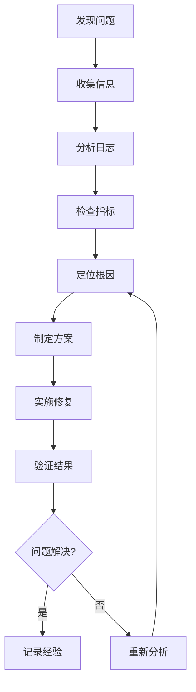

# OTLP Rust 故障排查和性能调优指南

## 📋 目录

1. [故障排查基础](#故障排查基础)
2. [常见问题诊断](#常见问题诊断)
3. [性能问题分析](#性能问题分析)
4. [监控和诊断工具](#监控和诊断工具)
5. [性能调优策略](#性能调优策略)
6. [最佳实践](#最佳实践)
7. [源码映射与可运行命令](#源码映射与可运行命令)

## 故障排查基础

### 1. 故障排查流程



### 2. 信息收集清单

```bash
#!/bin/bash
# collect-info.sh - 故障信息收集脚本

echo "=== OTLP Rust 故障信息收集 ==="
echo "时间: $(date)"
echo "主机: $(hostname)"

# 1. 系统信息
echo -e "\n=== 系统信息 ==="
uname -a
cat /etc/os-release
free -h
df -h
uptime

# 2. 服务状态
echo -e "\n=== 服务状态 ==="
systemctl status otlp-rust
ps aux | grep otlp

# 3. 网络状态
echo -e "\n=== 网络状态 ==="
netstat -tlnp | grep -E "(4317|4318|8080)"
ss -tlnp | grep -E "(4317|4318|8080)"

# 4. 日志信息
echo -e "\n=== 日志信息 ==="
journalctl -u otlp-rust --since "1 hour ago" --no-pager
tail -100 /var/log/otlp-rust/otlp.log

# 5. 配置文件
echo -e "\n=== 配置文件 ==="
cat /etc/otlp-rust/config.toml

# 6. 资源使用
echo -e "\n=== 资源使用 ==="
top -bn1 | head -20
iostat -x 1 1
```

### 3. 健康检查脚本

```rust
use otlp::health::{HealthChecker, HealthStatus};
use std::time::Duration;

async fn health_check_example() -> Result<(), Box<dyn std::error::Error>> {
    let health_checker = HealthChecker::new(HealthConfig {
        timeout: Duration::from_secs(5),
        retry_attempts: 3,
        ..Default::default()
    });

    // 检查服务健康状态
    let status = health_checker.check_all().await?;

    match status {
        HealthStatus::Healthy => {
            println!("✅ 所有服务健康");
        },
        HealthStatus::Degraded(issues) => {
            println!("⚠️ 服务降级: {:?}", issues);
        },
        HealthStatus::Unhealthy(issues) => {
            println!("❌ 服务不健康: {:?}", issues);
        }
    }

    Ok(())
}
```

## 常见问题诊断

### 1. 连接问题

#### 问题：无法连接到OTLP收集器

```bash
# 诊断步骤
echo "=== 连接诊断 ==="

# 1. 检查网络连通性
echo "1. 检查网络连通性"
ping collector.example.com
telnet collector.example.com 4317

# 2. 检查DNS解析
echo "2. 检查DNS解析"
nslookup collector.example.com
dig collector.example.com

# 3. 检查防火墙
echo "3. 检查防火墙"
iptables -L | grep 4317
ufw status | grep 4317

# 4. 检查TLS证书
echo "4. 检查TLS证书"
openssl s_client -connect collector.example.com:4317 -servername collector.example.com

# 5. 检查代理设置
echo "5. 检查代理设置"
env | grep -i proxy
```

#### 解决方案

```rust
use otlp::diagnostics::{ConnectionDiagnostics, DiagnosticResult};

async fn diagnose_connection_issues() -> Result<(), Box<dyn std::error::Error>> {
    let diagnostics = ConnectionDiagnostics::new();

    // 执行连接诊断
    let results = diagnostics.run_full_diagnosis("http://collector:4317").await?;

    for result in results {
        match result {
            DiagnosticResult::Success(message) => {
                println!("✅ {}", message);
            },
            DiagnosticResult::Warning(message) => {
                println!("⚠️ {}", message);
            },
            DiagnosticResult::Error(message) => {
                println!("❌ {}", message);
            }
        }
    }

    Ok(())
}
```

### 2. 性能问题

#### 问题：高延迟

```bash
# 性能诊断脚本
#!/bin/bash
# performance-diagnosis.sh

echo "=== 性能诊断 ==="

# 1. 系统负载
echo "1. 系统负载"
uptime
sar -u 1 5
sar -r 1 5

# 2. 网络延迟
echo "2. 网络延迟"
ping -c 10 collector.example.com
mtr --report --report-cycles 10 collector.example.com

# 3. 进程状态
echo "3. 进程状态"
ps aux | grep otlp
top -p $(pgrep otlp)

# 4. 文件描述符
echo "4. 文件描述符"
lsof -p $(pgrep otlp) | wc -l
cat /proc/$(pgrep otlp)/limits | grep "open files"

# 5. 内存使用
echo "5. 内存使用"
cat /proc/$(pgrep otlp)/status | grep -E "(VmRSS|VmSize|VmPeak)"
```

#### 问题：内存泄漏

```rust
use otlp::diagnostics::{MemoryDiagnostics, MemoryLeakDetector};

async fn diagnose_memory_leaks() -> Result<(), Box<dyn std::error::Error>> {
    let memory_diagnostics = MemoryDiagnostics::new();

    // 检查内存使用趋势
    let memory_trend = memory_diagnostics.analyze_memory_trend().await?;

    if memory_trend.is_leaking() {
        println!("⚠️ 检测到内存泄漏");

        // 获取内存快照
        let snapshot = memory_diagnostics.take_snapshot().await?;

        // 分析内存分配
        let analysis = memory_diagnostics.analyze_allocation_patterns(&snapshot).await?;

        println!("内存分析结果: {:?}", analysis);
    }

    Ok(())
}
```

### 3. 数据问题

#### 问题：数据丢失

```bash
# 数据完整性检查
#!/bin/bash
# data-integrity-check.sh

echo "=== 数据完整性检查 ==="

# 1. 检查数据目录
echo "1. 检查数据目录"
ls -la /var/lib/otlp-rust/
du -sh /var/lib/otlp-rust/*

# 2. 检查日志文件
echo "2. 检查日志文件"
ls -la /var/log/otlp-rust/
tail -100 /var/log/otlp-rust/otlp.log | grep -i error

# 3. 检查数据库状态
echo "3. 检查数据库状态"
otlp-admin --config /etc/otlp-rust/config.toml db status

# 4. 检查备份状态
echo "4. 检查备份状态"
ls -la /var/backups/otlp-rust/
```

## 性能问题分析

### 1. 性能基准测试

```rust
use otlp::benchmark::{BenchmarkRunner, BenchmarkConfig, BenchmarkResult};

async fn performance_benchmark() -> Result<(), Box<dyn std::error::Error>> {
    let config = BenchmarkConfig {
        duration: Duration::from_secs(60),
        concurrency: 100,
        batch_size: 1000,
        ..Default::default()
    };

    let benchmark_runner = BenchmarkRunner::new(config);

    // 运行基准测试
    let results = benchmark_runner.run_benchmark().await?;

    // 分析结果
    println!("=== 性能基准测试结果 ===");
    println!("吞吐量: {:.2} ops/sec", results.throughput);
    println!("平均延迟: {:.2} ms", results.avg_latency.as_millis());
    println!("P95延迟: {:.2} ms", results.p95_latency.as_millis());
    println!("P99延迟: {:.2} ms", results.p99_latency.as_millis());
    println!("错误率: {:.2}%", results.error_rate * 100.0);

    Ok(())
}
```

### 2. 性能瓶颈分析

```rust
use otlp::profiling::{Profiler, ProfileResult};

async fn performance_profiling() -> Result<(), Box<dyn std::error::Error>> {
    let profiler = Profiler::new(ProfileConfig {
        duration: Duration::from_secs(30),
        sample_rate: 1000,
        ..Default::default()
    });

    // 开始性能分析
    profiler.start().await?;

    // 运行负载
    run_workload().await?;

    // 停止分析
    let profile_result = profiler.stop().await?;

    // 分析结果
    println!("=== 性能分析结果 ===");
    for (function, stats) in profile_result.function_stats {
        println!("函数: {}", function);
        println!("  调用次数: {}", stats.call_count);
        println!("  总时间: {:.2} ms", stats.total_time.as_millis());
        println!("  平均时间: {:.2} ms", stats.avg_time.as_millis());
        println!("  最大时间: {:.2} ms", stats.max_time.as_millis());
    }

    Ok(())
}
```

### 3. 资源使用分析

```rust
use otlp::monitoring::{ResourceMonitor, ResourceUsage};

async fn resource_analysis() -> Result<(), Box<dyn std::error::Error>> {
    let resource_monitor = ResourceMonitor::new(MonitorConfig {
        interval: Duration::from_secs(1),
        duration: Duration::from_secs(60),
        ..Default::default()
    });

    // 开始监控
    resource_monitor.start().await?;

    // 运行负载
    run_workload().await?;

    // 获取资源使用报告
    let usage_report = resource_monitor.get_report().await?;

    println!("=== 资源使用报告 ===");
    println!("CPU使用率: {:.2}%", usage_report.cpu_usage * 100.0);
    println!("内存使用: {:.2} MB", usage_report.memory_usage / 1024.0 / 1024.0);
    println!("网络I/O: {:.2} MB/s", usage_report.network_io / 1024.0 / 1024.0);
    println!("磁盘I/O: {:.2} MB/s", usage_report.disk_io / 1024.0 / 1024.0);

    Ok(())
}
```

## 监控和诊断工具

### 1. 内置监控工具

```rust
use otlp::monitoring::{MetricsCollector, AlertManager, Dashboard};

async fn setup_monitoring() -> Result<(), Box<dyn std::error::Error>> {
    // 配置指标收集
    let metrics_collector = MetricsCollector::new(MetricsConfig {
        endpoint: "http://prometheus:9090".to_string(),
        interval: Duration::from_secs(15),
        metrics: vec![
            "otlp_requests_total".to_string(),
            "otlp_errors_total".to_string(),
            "otlp_latency_seconds".to_string(),
            "otlp_active_connections".to_string(),
        ],
    });

    // 配置告警管理
    let alert_manager = AlertManager::new(AlertConfig {
        webhook_url: "http://alertmanager:9093/api/v1/alerts".to_string(),
        rules: vec![
            AlertRule {
                name: "high_error_rate".to_string(),
                condition: "error_rate > 0.05".to_string(),
                severity: AlertSeverity::Critical,
                duration: Duration::from_secs(300),
            },
            AlertRule {
                name: "high_latency".to_string(),
                condition: "p99_latency > 5".to_string(),
                severity: AlertSeverity::Warning,
                duration: Duration::from_secs(600),
            },
        ],
    });

    // 启动监控
    metrics_collector.start().await?;
    alert_manager.start().await?;

    Ok(())
}
```

### 2. 外部监控集成

```yaml
# prometheus-config.yml
global:
  scrape_interval: 15s

scrape_configs:
  - job_name: 'otlp-rust'
    static_configs:
      - targets: ['otlp-collector:8080']
    metrics_path: '/metrics'
    scrape_interval: 5s

rule_files:
  - "otlp-rules.yml"

alerting:
  alertmanagers:
    - static_configs:
        - targets:
          - alertmanager:9093
```

### 3. 日志分析工具

```rust
use otlp::logging::{LogAnalyzer, LogPattern, LogAlert};

async fn setup_log_analysis() -> Result<(), Box<dyn std::error::Error>> {
    let log_analyzer = LogAnalyzer::new(LogConfig {
        log_path: "/var/log/otlp-rust/otlp.log".to_string(),
        patterns: vec![
            LogPattern {
                name: "error_pattern".to_string(),
                regex: r"ERROR.*".to_string(),
                severity: LogSeverity::Error,
            },
            LogPattern {
                name: "warning_pattern".to_string(),
                regex: r"WARN.*".to_string(),
                severity: LogSeverity::Warning,
            },
            LogPattern {
                name: "performance_pattern".to_string(),
                regex: r"LATENCY.*(\d+)ms".to_string(),
                severity: LogSeverity::Info,
            },
        ],
    });

    // 启动日志分析
    log_analyzer.start().await?;

    Ok(())
}
```

## 性能调优策略

### 1. 系统级调优

```bash
#!/bin/bash
# system-tuning.sh

echo "=== 系统级性能调优 ==="

# 1. 内核参数调优
echo "1. 内核参数调优"
cat >> /etc/sysctl.conf << EOF
# 网络性能优化
net.core.rmem_max = 16777216
net.core.wmem_max = 16777216
net.ipv4.tcp_rmem = 4096 87380 16777216
net.ipv4.tcp_wmem = 4096 65536 16777216
net.core.netdev_max_backlog = 5000
net.ipv4.tcp_window_scaling = 1
net.ipv4.tcp_timestamps = 1
net.ipv4.tcp_sack = 1

# 文件描述符限制
fs.file-max = 2097152
fs.nr_open = 2097152

# 内存管理
vm.swappiness = 10
vm.dirty_ratio = 15
vm.dirty_background_ratio = 5
EOF

sysctl -p

# 2. 文件描述符限制
echo "2. 文件描述符限制"
cat >> /etc/security/limits.conf << EOF
otlp-rust soft nofile 65536
otlp-rust hard nofile 65536
otlp-rust soft nproc 32768
otlp-rust hard nproc 32768
EOF

# 3. CPU亲和性设置
echo "3. CPU亲和性设置"
taskset -c 0,1,2,3 otlp-server --config /etc/otlp-rust/config.toml
```

### 2. 应用级调优

```toml
# config/performance.toml
[otlp]
environment = "production"
log_level = "warn"  # 减少日志输出

[otlp.transport]
protocol = "grpc"
compression = "gzip"
batch_size = 1000
flush_interval = 100  # ms

[otlp.processing]
worker_threads = 8
queue_size = 10000
batch_processing = true
parallel_processing = true

[otlp.memory]
object_pool_size = 1000
cache_size = 100MB
gc_threshold = 80%

[otlp.network]
tcp_nodelay = true
tcp_keepalive = true
so_reuseport = true
```

### 3. 数据库调优

```rust
use otlp::database::{DatabaseOptimizer, QueryOptimizer};

async fn database_optimization() -> Result<(), Box<dyn std::error::Error>> {
    let db_optimizer = DatabaseOptimizer::new(DatabaseConfig {
        connection_pool_size: 20,
        max_connections: 100,
        connection_timeout: Duration::from_secs(30),
        idle_timeout: Duration::from_secs(300),
        ..Default::default()
    });

    // 优化查询
    let query_optimizer = QueryOptimizer::new();

    // 添加索引
    query_optimizer.add_index("traces", "timestamp").await?;
    query_optimizer.add_index("traces", "service_name").await?;
    query_optimizer.add_index("traces", "trace_id").await?;

    // 分析查询性能
    let slow_queries = query_optimizer.analyze_slow_queries().await?;
    for query in slow_queries {
        println!("慢查询: {} - 平均时间: {:?}", query.sql, query.avg_time);
    }

    Ok(())
}
```

### 4. 网络调优

```rust
use otlp::network::{NetworkOptimizer, ConnectionPool};

async fn network_optimization() -> Result<(), Box<dyn std::error::Error>> {
    let network_optimizer = NetworkOptimizer::new(NetworkConfig {
        tcp_nodelay: true,
        tcp_keepalive: true,
        so_reuseport: true,
        tcp_congestion_control: "bbr".to_string(),
        ..Default::default()
    });

    // 优化连接池
    let connection_pool = ConnectionPool::new(PoolConfig {
        max_connections: 100,
        min_connections: 10,
        connection_timeout: Duration::from_secs(5),
        idle_timeout: Duration::from_secs(300),
        max_lifetime: Duration::from_secs(3600),
    });

    // 预热连接池
    connection_pool.warmup().await?;

    Ok(())
}
```

## 最佳实践

### 1. 监控最佳实践

```rust
use otlp::monitoring::{MonitoringBestPractices, HealthCheck};

async fn monitoring_best_practices() -> Result<(), Box<dyn std::error::Error>> {
    let best_practices = MonitoringBestPractices::new();

    // 设置关键指标
    best_practices.setup_critical_metrics(vec![
        "otlp_requests_total".to_string(),
        "otlp_errors_total".to_string(),
        "otlp_latency_seconds".to_string(),
        "otlp_active_connections".to_string(),
        "otlp_memory_usage_bytes".to_string(),
        "otlp_cpu_usage_percent".to_string(),
    ]).await?;

    // 设置健康检查
    let health_check = HealthCheck::new(HealthConfig {
        endpoint: "/health".to_string(),
        timeout: Duration::from_secs(5),
        interval: Duration::from_secs(30),
        ..Default::default()
    });

    // 设置告警规则
    best_practices.setup_alert_rules(vec![
        AlertRule {
            name: "service_down".to_string(),
            condition: "up == 0".to_string(),
            severity: AlertSeverity::Critical,
            duration: Duration::from_secs(60),
        },
        AlertRule {
            name: "high_error_rate".to_string(),
            condition: "error_rate > 0.05".to_string(),
            severity: AlertSeverity::Warning,
            duration: Duration::from_secs(300),
        },
        AlertRule {
            name: "high_latency".to_string(),
            condition: "p99_latency > 5".to_string(),
            severity: AlertSeverity::Warning,
            duration: Duration::from_secs(600),
        },
    ]).await?;

    Ok(())
}
```

### 2. 故障处理最佳实践

```rust
use otlp::incident::{IncidentManager, IncidentResponse};

async fn incident_management() -> Result<(), Box<dyn std::error::Error>> {
    let incident_manager = IncidentManager::new(IncidentConfig {
        escalation_timeout: Duration::from_secs(300),
        notification_channels: vec![
            "slack".to_string(),
            "email".to_string(),
            "pagerduty".to_string(),
        ],
        ..Default::default()
    });

    // 定义故障响应流程
    let response_plan = IncidentResponse::new(ResponsePlan {
        steps: vec![
            ResponseStep {
                name: "acknowledge".to_string(),
                timeout: Duration::from_secs(60),
                actions: vec!["acknowledge_incident".to_string()],
            },
            ResponseStep {
                name: "investigate".to_string(),
                timeout: Duration::from_secs(300),
                actions: vec!["collect_logs".to_string(), "analyze_metrics".to_string()],
            },
            ResponseStep {
                name: "resolve".to_string(),
                timeout: Duration::from_secs(1800),
                actions: vec!["implement_fix".to_string(), "verify_resolution".to_string()],
            },
        ],
    });

    incident_manager.set_response_plan(response_plan).await?;

    Ok(())
}
```

### 3. 性能优化最佳实践

```rust
use otlp::performance::{PerformanceOptimizer, OptimizationStrategy};

async fn performance_best_practices() -> Result<(), Box<dyn std::error::Error>> {
    let performance_optimizer = PerformanceOptimizer::new();

    // 应用优化策略
    let strategies = vec![
        OptimizationStrategy::ConnectionPooling {
            max_connections: 100,
            min_connections: 10,
        },
        OptimizationStrategy::BatchProcessing {
            batch_size: 1000,
            flush_interval: Duration::from_millis(100),
        },
        OptimizationStrategy::Caching {
            cache_size: 100 * 1024 * 1024, // 100MB
            ttl: Duration::from_secs(300),
        },
        OptimizationStrategy::Compression {
            algorithm: "gzip".to_string(),
            level: 6,
        },
        OptimizationStrategy::AsyncProcessing {
            worker_threads: 8,
            queue_size: 10000,
        },
    ];

    for strategy in strategies {
        performance_optimizer.apply_strategy(strategy).await?;
    }

    Ok(())
}
```

### 4. 安全最佳实践

```rust
use otlp::security::{SecurityManager, SecurityPolicy};

async fn security_best_practices() -> Result<(), Box<dyn std::error::Error>> {
    let security_manager = SecurityManager::new(SecurityConfig {
        tls_enabled: true,
        authentication_required: true,
        authorization_enabled: true,
        audit_logging: true,
        ..Default::default()
    });

    // 设置安全策略
    let security_policy = SecurityPolicy {
        password_policy: PasswordPolicy {
            min_length: 12,
            require_uppercase: true,
            require_lowercase: true,
            require_numbers: true,
            require_symbols: true,
        },
        session_policy: SessionPolicy {
            timeout: Duration::from_secs(3600),
            max_concurrent_sessions: 5,
        },
        rate_limiting: RateLimitPolicy {
            requests_per_minute: 1000,
            burst_size: 100,
        },
    };

    security_manager.set_policy(security_policy).await?;

    Ok(())
}
```

## 总结

本文档提供了OTLP Rust项目的完整故障排查和性能调优指南，包括：

1. **故障排查基础**：排查流程、信息收集、健康检查
2. **常见问题诊断**：连接问题、性能问题、数据问题
3. **性能问题分析**：基准测试、瓶颈分析、资源使用
4. **监控和诊断工具**：内置工具、外部集成、日志分析
5. **性能调优策略**：系统级、应用级、数据库、网络调优
6. **最佳实践**：监控、故障处理、性能优化、安全实践

这些指南将帮助您快速诊断和解决OTLP Rust项目中的各种问题，确保系统的高性能和稳定性。通过遵循这些最佳实践，您可以建立一个健壮、高效的可观测性系统。

## 源码映射与可运行命令

### 源码映射（排障与性能相关）

- 客户端与构建器：`otlp/src/client.rs`
- 配置体系：`otlp/src/config.rs`
- 数据模型：`otlp/src/data.rs`
- 传输实现：`otlp/src/transport.rs`, `otlp/src/protobuf.rs`
- 导出与批处理：`otlp/src/exporter.rs`
- 处理器流水线：`otlp/src/processor.rs`
- 性能工具/Profiling：`otlp/src/performance_*`、`otlp/src/profiling/*`
- 监控与自监控：`otlp/src/monitoring/*`
- 校验与验证：`otlp/src/validation/*`

更多矩阵请参考：`docs/OTLP_2025_COMPREHENSIVE_DOCUMENTATION_INDEX.md` 中“规范-实现对齐矩阵”。

### 示例与基准（可直接运行）

- 入门：`cargo run -p otlp --example simple_usage`
- 综合：`cargo run -p otlp --example comprehensive_usage`
- 高级模式：`cargo run -p otlp --example advanced_patterns`
- 监控：`cargo run -p otlp --example monitoring_demo`
- 弹性：`cargo run -p otlp --example resilience_usage`
- 分布式：`cargo run -p otlp --example distributed_coordination_demo`
- 性能优化演示：`cargo run -p otlp --example performance_optimization_demo`
- 基准：`cargo bench -p otlp`
