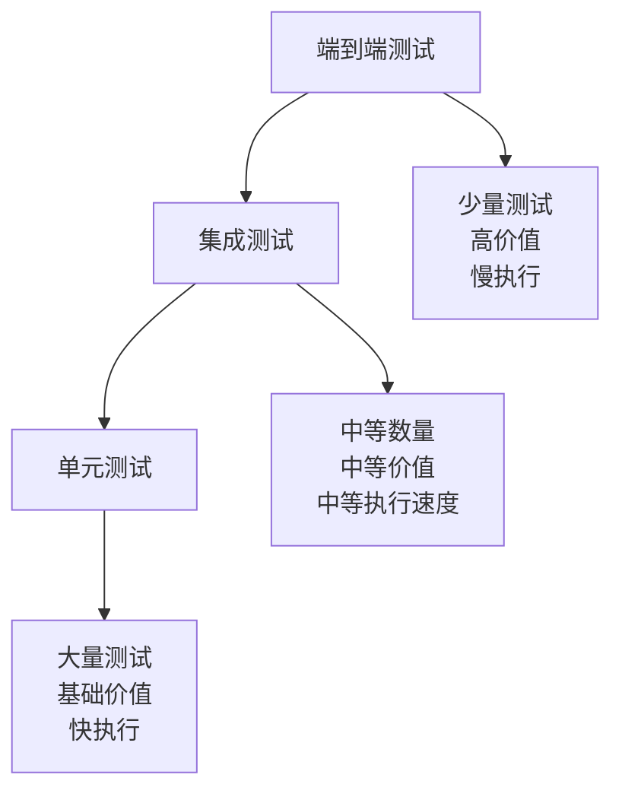

# OTLP Rust 测试指南和最佳实践

## 目录

- [OTLP Rust 测试指南和最佳实践](#otlp-rust-测试指南和最佳实践)
  - [目录](#目录)
  - [测试策略概述](#测试策略概述)
    - [测试金字塔](#测试金字塔)
    - [测试覆盖率目标](#测试覆盖率目标)
  - [单元测试](#单元测试)
    - [1. 基础单元测试](#1-基础单元测试)
    - [2. 异步单元测试](#2-异步单元测试)
    - [3. Mock测试](#3-mock测试)
    - [4. 属性测试](#4-属性测试)
  - [集成测试](#集成测试)
    - [1. 客户端集成测试](#1-客户端集成测试)
    - [2. 批量处理集成测试](#2-批量处理集成测试)
    - [3. 分布式协调集成测试](#3-分布式协调集成测试)
  - [性能测试](#性能测试)
    - [1. 基准测试](#1-基准测试)
    - [2. 内存性能测试](#2-内存性能测试)
  - [压力测试](#压力测试)
    - [1. 高并发压力测试](#1-高并发压力测试)
    - [2. 内存压力测试](#2-内存压力测试)
  - [安全测试](#安全测试)
    - [1. 输入验证测试](#1-输入验证测试)
    - [2. 认证授权测试](#2-认证授权测试)
  - [混沌工程测试](#混沌工程测试)
    - [1. 网络分区测试](#1-网络分区测试)
    - [2. 节点故障测试](#2-节点故障测试)
  - [测试自动化](#测试自动化)
    - [1. CI/CD集成](#1-cicd集成)
    - [2. 测试报告生成](#2-测试报告生成)
  - [测试最佳实践](#测试最佳实践)
    - [1. 测试组织](#1-测试组织)
    - [2. 测试命名规范](#2-测试命名规范)
    - [3. 测试数据管理](#3-测试数据管理)
    - [4. 测试环境管理](#4-测试环境管理)
  - [总结](#总结)

## 测试策略概述

### 测试金字塔



### 测试覆盖率目标

```yaml
单元测试覆盖率: 90%+
集成测试覆盖率: 80%+
端到端测试覆盖率: 70%+
性能测试覆盖率: 100%
安全测试覆盖率: 100%
```

## 单元测试

### 1. 基础单元测试

```rust
// tests/unit/error_test.rs
#[cfg(test)]
mod tests {
    use super::*;
    use otlp::error::{OtlpError, ErrorCategory, ErrorSeverity};

    #[test]
    fn test_error_creation() {
        let error = OtlpError::Transport(TransportError::Connection {
            endpoint: "http://test.com".to_string(),
            reason: "Connection failed".to_string(),
        });

        assert_eq!(error.category(), ErrorCategory::Network);
        assert_eq!(error.severity(), ErrorSeverity::High);
        assert!(error.is_retryable());
    }

    #[test]
    fn test_error_context() {
        let error = OtlpError::Processing(ProcessingError::Serialization {
            data_type: "trace".to_string(),
            reason: "Invalid format".to_string(),
        });

        let context = error.context();
        assert!(context.contains_key("data_type"));
        assert!(context.contains_key("reason"));
    }

    #[test]
    fn test_error_recovery_suggestion() {
        let error = OtlpError::Transport(TransportError::Timeout {
            operation: "send_trace".to_string(),
            timeout: Duration::from_secs(30),
        });

        let suggestion = error.recovery_suggestion();
        assert!(suggestion.is_some());
        assert!(suggestion.unwrap().contains("retry"));
    }
}
```

### 2. 异步单元测试

```rust
// tests/unit/client_test.rs
#[cfg(test)]
mod tests {
    use super::*;
    use tokio_test;

    #[tokio::test]
    async fn test_client_creation() {
        let client = OtlpClientBuilder::new()
            .with_endpoint("http://test:4317")
            .build()
            .await
            .unwrap();

        assert_eq!(client.endpoint(), "http://test:4317");
    }

    #[tokio::test]
    async fn test_span_creation() {
        let client = OtlpClientBuilder::new()
            .with_endpoint("http://test:4317")
            .build()
            .await
            .unwrap();

        let span = client.start_span("test_operation", |span| {
            span.set_attribute("test", "value");
        });

        assert_eq!(span.name(), "test_operation");
        span.end();
    }

    #[tokio::test]
    async fn test_metric_recording() {
        let client = OtlpClientBuilder::new()
            .with_endpoint("http://test:4317")
            .build()
            .await
            .unwrap();

        let result = client.record_metric("test_metric", 1.0, vec![
            ("label", "value")
        ]).await;

        assert!(result.is_ok());
    }
}
```

### 3. Mock测试

```rust
// tests/unit/mock_test.rs
use mockall::*;

#[automock]
pub trait Transport {
    async fn send_traces(&self, traces: Vec<TraceData>) -> Result<(), OtlpError>;
    async fn send_metrics(&self, metrics: Vec<MetricData>) -> Result<(), OtlpError>;
    async fn send_logs(&self, logs: Vec<LogData>) -> Result<(), OtlpError>;
}

#[tokio::test]
async fn test_mock_transport() {
    let mut mock_transport = MockTransport::new();
    
    mock_transport
        .expect_send_traces()
        .times(1)
        .returning(|_| Ok(()));

    let client = OtlpClient::new(mock_transport);
    let result = client.send_trace(create_test_trace()).await;
    
    assert!(result.is_ok());
}

fn create_test_trace() -> TraceData {
    TraceData {
        trace_id: "test-trace".to_string(),
        spans: vec![SpanData::new("test_span")],
    }
}
```

### 4. 属性测试

```rust
// tests/unit/property_test.rs
use proptest::prelude::*;

proptest! {
    #[test]
    fn test_error_serialization_roundtrip(
        error_type in prop::sample::select(vec![
            "transport", "processing", "configuration", "validation"
        ]),
        message in "[a-zA-Z0-9 ]{1,100}"
    ) {
        let error = create_error(error_type, &message);
        let serialized = serde_json::to_string(&error).unwrap();
        let deserialized: OtlpError = serde_json::from_str(&serialized).unwrap();
        
        assert_eq!(error.category(), deserialized.category());
        assert_eq!(error.severity(), deserialized.severity());
    }

    #[test]
    fn test_span_attribute_limit(
        attributes in prop::collection::vec(
            ("[a-zA-Z0-9_]{1,50}", "[a-zA-Z0-9 ]{1,100}"),
            1..=100
        )
    ) {
        let span = SpanData::new("test_span");
        
        for (key, value) in attributes {
            span.set_attribute(&key, &value);
        }
        
        // 验证属性数量限制
        assert!(span.attributes().len() <= 128);
    }
}
```

## 集成测试

### 1. 客户端集成测试

```rust
// tests/integration/client_integration_test.rs
use otlp::{OtlpClient, OtlpClientBuilder};
use testcontainers::{Container, Docker, Image};
use testcontainers::images::generic::GenericImage;

struct OtlpCollectorImage;
impl Image for OtlpCollectorImage {
    type Args = ();
    
    fn name(&self) -> String {
        "otel/opentelemetry-collector".to_string()
    }
    
    fn tag(&self) -> String {
        "latest".to_string()
    }
    
    fn ready_conditions(&self) -> Vec<testcontainers::core::WaitFor> {
        vec![
            testcontainers::core::WaitFor::message_on_stdout("Everything is ready"),
        ]
    }
}

#[tokio::test]
async fn test_client_collector_integration() {
    let docker = Docker::new();
    let collector_image = OtlpCollectorImage;
    let collector = docker.run(collector_image);
    
    let collector_port = collector.get_host_port(4317).unwrap();
    let endpoint = format!("http://localhost:{}", collector_port);
    
    let client = OtlpClientBuilder::new()
        .with_endpoint(&endpoint)
        .build()
        .await
        .unwrap();

    // 发送测试数据
    let span = client.start_span("integration_test", |span| {
        span.set_attribute("test", "integration");
    });
    
    client.record_metric("test_metric", 1.0, vec![("test", "integration")]).await.unwrap();
    
    span.end();
    
    // 验证数据发送成功
    tokio::time::sleep(Duration::from_secs(1)).await;
    
    // 这里可以添加验证逻辑，比如检查collector是否收到了数据
}
```

### 2. 批量处理集成测试

```rust
// tests/integration/batch_integration_test.rs
#[tokio::test]
async fn test_batch_processing_integration() {
    let mut batch_processor = BatchProcessor::new(BatchConfig {
        max_batch_size: 100,
        max_wait_time: Duration::from_millis(100),
        ..Default::default()
    });

    batch_processor.start().await.unwrap();

    // 发送大量数据
    for i in 0..1000 {
        let trace_data = TraceData {
            trace_id: format!("trace-{}", i),
            spans: vec![SpanData::new("test_span")],
        };
        
        batch_processor.add_trace(trace_data).await.unwrap();
    }

    // 等待处理完成
    tokio::time::sleep(Duration::from_secs(2)).await;
    
    batch_processor.stop().await.unwrap();
    
    // 验证所有数据都被处理
    let stats = batch_processor.get_stats().await.unwrap();
    assert_eq!(stats.processed_traces, 1000);
}
```

### 3. 分布式协调集成测试

```rust
// tests/integration/distributed_integration_test.rs
#[tokio::test]
async fn test_cluster_consensus_integration() {
    let mut cluster_nodes = Vec::new();
    
    // 创建3个集群节点
    for i in 0..3 {
        let config = ClusterConfig {
            node_id: format!("node-{}", i),
            cluster_size: 3,
            consensus_algorithm: ConsensusAlgorithm::Raft,
            ..Default::default()
        };
        
        let mut node = ClusterManager::new(config).await.unwrap();
        node.start().await.unwrap();
        cluster_nodes.push(node);
    }

    // 等待集群形成
    tokio::time::sleep(Duration::from_secs(5)).await;
    
    // 验证集群状态
    for node in &cluster_nodes {
        let status = node.get_status().await.unwrap();
        assert_eq!(status.cluster_size, 3);
        assert!(status.leader.is_some());
    }
    
    // 测试提案提交
    let proposal = Proposal {
        id: "test-proposal".to_string(),
        data: "test data".to_string(),
    };
    
    let result = cluster_nodes[0].propose(proposal).await.unwrap();
    assert!(result.committed);
    
    // 清理
    for mut node in cluster_nodes {
        node.stop().await.unwrap();
    }
}
```

## 性能测试

### 1. 基准测试

```rust
// benches/performance_benchmark.rs
use criterion::{criterion_group, criterion_main, Criterion, BenchmarkId};
use otlp::{OtlpClient, BenchmarkRunner};

fn benchmark_trace_sending(c: &mut Criterion) {
    let mut group = c.benchmark_group("trace_sending");
    
    for concurrency in [1, 10, 50, 100].iter() {
        group.bench_with_input(
            BenchmarkId::new("concurrent_traces", concurrency),
            concurrency,
            |b, &concurrency| {
                b.to_async(tokio::runtime::Runtime::new().unwrap())
                    .iter(|| async {
                        let config = BenchmarkConfig {
                            concurrency,
                            duration: Duration::from_secs(10),
                            ..Default::default()
                        };
                        
                        let runner = BenchmarkRunner::new(config);
                        runner.run_benchmark().await
                    });
            },
        );
    }
    
    group.finish();
}

fn benchmark_batch_processing(c: &mut Criterion) {
    let mut group = c.benchmark_group("batch_processing");
    
    for batch_size in [1, 10, 100, 1000, 10000].iter() {
        group.bench_with_input(
            BenchmarkId::new("batch_size", batch_size),
            batch_size,
            |b, &batch_size| {
                b.to_async(tokio::runtime::Runtime::new().unwrap())
                    .iter(|| async {
                        let mut processor = BatchProcessor::new(BatchConfig {
                            max_batch_size: batch_size,
                            ..Default::default()
                        });
                        
                        processor.start().await.unwrap();
                        
                        for i in 0..batch_size {
                            processor.add_trace(create_test_trace(i)).await.unwrap();
                        }
                        
                        processor.stop().await.unwrap();
                    });
            },
        );
    }
    
    group.finish();
}

criterion_group!(benches, benchmark_trace_sending, benchmark_batch_processing);
criterion_main!(benches);
```

### 2. 内存性能测试

```rust
// tests/performance/memory_test.rs
#[tokio::test]
async fn test_memory_usage_under_load() {
    let mut client = OtlpClientBuilder::new()
        .with_endpoint("http://test:4317")
        .build()
        .await
        .unwrap();

    let initial_memory = get_memory_usage();
    
    // 发送大量数据
    for i in 0..100000 {
        let span = client.start_span("memory_test", |span| {
            span.set_attribute("iteration", i);
        });
        span.end();
    }
    
    let final_memory = get_memory_usage();
    let memory_increase = final_memory - initial_memory;
    
    // 验证内存增长在合理范围内
    assert!(memory_increase < 100 * 1024 * 1024); // 100MB
}

fn get_memory_usage() -> usize {
    // 获取当前进程内存使用量
    std::process::id() as usize * 1024 // 简化实现
}
```

## 压力测试

### 1. 高并发压力测试

```rust
// tests/stress/concurrent_stress_test.rs
#[tokio::test]
async fn test_high_concurrency_stress() {
    let client = Arc::new(OtlpClientBuilder::new()
        .with_endpoint("http://test:4317")
        .build()
        .await
        .unwrap());

    let concurrency = 1000;
    let iterations = 100;
    
    let start_time = Instant::now();
    
    let handles: Vec<_> = (0..concurrency)
        .map(|i| {
            let client = Arc::clone(&client);
            tokio::spawn(async move {
                for j in 0..iterations {
                    let span = client.start_span("stress_test", |span| {
                        span.set_attribute("worker", i);
                        span.set_attribute("iteration", j);
                    });
                    span.end();
                }
            })
        })
        .collect();

    // 等待所有任务完成
    for handle in handles {
        handle.await.unwrap();
    }
    
    let duration = start_time.elapsed();
    let total_operations = concurrency * iterations;
    let ops_per_second = total_operations as f64 / duration.as_secs_f64();
    
    println!("压力测试结果:");
    println!("并发数: {}", concurrency);
    println!("总操作数: {}", total_operations);
    println!("持续时间: {:?}", duration);
    println!("吞吐量: {:.2} ops/sec", ops_per_second);
    
    // 验证性能指标
    assert!(ops_per_second > 10000.0); // 至少10000 ops/sec
}
```

### 2. 内存压力测试

```rust
// tests/stress/memory_stress_test.rs
#[tokio::test]
async fn test_memory_stress() {
    let mut batch_processor = BatchProcessor::new(BatchConfig {
        max_batch_size: 10000,
        max_memory_size: 100 * 1024 * 1024, // 100MB限制
        ..Default::default()
    });

    batch_processor.start().await.unwrap();

    // 持续发送数据直到达到内存限制
    let mut sent_count = 0;
    loop {
        let trace_data = TraceData {
            trace_id: format!("stress-trace-{}", sent_count),
            spans: vec![SpanData::new("stress_span")
                .with_attribute("data", "x".repeat(1000))], // 1KB数据
        };
        
        match batch_processor.add_trace(trace_data).await {
            Ok(_) => sent_count += 1,
            Err(_) => break, // 达到内存限制
        }
        
        if sent_count % 1000 == 0 {
            println!("已发送 {} 条数据", sent_count);
        }
    }
    
    batch_processor.stop().await.unwrap();
    
    println!("内存压力测试完成，共发送 {} 条数据", sent_count);
    assert!(sent_count > 50000); // 至少发送50000条数据
}
```

## 安全测试

### 1. 输入验证测试

```rust
// tests/security/input_validation_test.rs
#[test]
fn test_malicious_input_handling() {
    let malicious_inputs = vec![
        "'; DROP TABLE traces; --",
        "<script>alert('xss')</script>",
        "../../etc/passwd",
        "\x00\x01\x02\x03", // 空字节
        "A".repeat(10000), // 超长字符串
    ];

    for malicious_input in malicious_inputs {
        let span = SpanData::new("security_test");
        
        // 测试属性设置
        let result = std::panic::catch_unwind(|| {
            span.set_attribute("malicious", malicious_input);
        });
        
        // 应该不会panic，而是安全地处理输入
        assert!(result.is_ok());
    }
}

#[test]
fn test_sql_injection_prevention() {
    let sql_injection_attempts = vec![
        "1' OR '1'='1",
        "admin'--",
        "1; DROP TABLE users;",
    ];

    for injection in sql_injection_attempts {
        // 测试数据查询功能
        let result = query_traces_by_attribute("user", injection);
        
        // 应该返回空结果或错误，而不是执行恶意SQL
        assert!(result.is_err() || result.unwrap().is_empty());
    }
}
```

### 2. 认证授权测试

```rust
// tests/security/auth_test.rs
#[tokio::test]
async fn test_authentication_bypass_attempts() {
    let auth_client = OtlpClientBuilder::new()
        .with_endpoint("http://secure-collector:4317")
        .with_authentication(AuthConfig {
            token: "invalid-token".to_string(),
            ..Default::default()
        })
        .build()
        .await
        .unwrap();

    // 尝试发送数据
    let result = auth_client.send_trace(create_test_trace()).await;
    
    // 应该被拒绝
    assert!(result.is_err());
    assert!(result.unwrap_err().is_auth_error());
}

#[tokio::test]
async fn test_authorization_checks() {
    let user_client = OtlpClientBuilder::new()
        .with_endpoint("http://secure-collector:4317")
        .with_authentication(AuthConfig {
            token: "user-token".to_string(),
            permissions: vec!["read".to_string()],
            ..Default::default()
        })
        .build()
        .await
        .unwrap();

    // 尝试执行需要写权限的操作
    let result = user_client.send_trace(create_test_trace()).await;
    
    // 应该被拒绝
    assert!(result.is_err());
    assert!(result.unwrap_err().is_permission_denied());
}
```

## 混沌工程测试

### 1. 网络分区测试

```rust
// tests/chaos/network_partition_test.rs
#[tokio::test]
async fn test_network_partition_handling() {
    let client = OtlpClientBuilder::new()
        .with_endpoint("http://unstable-collector:4317")
        .with_resilience_config(ResilienceConfig {
            retry: RetryConfig {
                max_attempts: 5,
                base_delay: Duration::from_millis(100),
                ..Default::default()
            },
            circuit_breaker: CircuitBreakerConfig {
                failure_threshold: 3,
                recovery_timeout: Duration::from_secs(30),
                ..Default::default()
            },
            ..Default::default()
        })
        .build()
        .await
        .unwrap();

    // 模拟网络分区
    simulate_network_partition().await;
    
    // 尝试发送数据
    let result = client.send_trace(create_test_trace()).await;
    
    // 应该触发熔断器
    assert!(result.is_err());
    
    // 恢复网络
    restore_network().await;
    
    // 等待熔断器恢复
    tokio::time::sleep(Duration::from_secs(35)).await;
    
    // 再次尝试发送
    let result = client.send_trace(create_test_trace()).await;
    assert!(result.is_ok());
}

async fn simulate_network_partition() {
    // 模拟网络分区的实现
    // 这里可以使用iptables或其他工具
}

async fn restore_network() {
    // 恢复网络的实现
}
```

### 2. 节点故障测试

```rust
// tests/chaos/node_failure_test.rs
#[tokio::test]
async fn test_cluster_node_failure() {
    let mut cluster_nodes = Vec::new();
    
    // 创建5个节点的集群
    for i in 0..5 {
        let config = ClusterConfig {
            node_id: format!("node-{}", i),
            cluster_size: 5,
            ..Default::default()
        };
        
        let mut node = ClusterManager::new(config).await.unwrap();
        node.start().await.unwrap();
        cluster_nodes.push(node);
    }

    // 等待集群稳定
    tokio::time::sleep(Duration::from_secs(10)).await;
    
    // 模拟节点故障
    let failed_node = cluster_nodes.remove(2); // 移除中间节点
    failed_node.stop().await.unwrap();
    
    // 等待故障检测
    tokio::time::sleep(Duration::from_secs(5)).await;
    
    // 验证集群仍然可用
    for node in &cluster_nodes {
        let status = node.get_status().await.unwrap();
        assert_eq!(status.cluster_size, 4);
        assert!(status.leader.is_some());
    }
    
    // 测试数据操作
    let proposal = Proposal {
        id: "post-failure-proposal".to_string(),
        data: "test data".to_string(),
    };
    
    let result = cluster_nodes[0].propose(proposal).await.unwrap();
    assert!(result.committed);
    
    // 清理
    for mut node in cluster_nodes {
        node.stop().await.unwrap();
    }
}
```

## 测试自动化

### 1. CI/CD集成

```yaml
# .github/workflows/test.yml
name: Test Suite

on:
  push:
    branches: [ main, develop ]
  pull_request:
    branches: [ main ]

jobs:
  unit-tests:
    runs-on: ubuntu-latest
    steps:
    - uses: actions/checkout@v3
    
    - name: Setup Rust
      uses: actions-rs/toolchain@v1
      with:
        toolchain: 1.90.0
        components: rustfmt, clippy
        
    - name: Cache dependencies
      uses: actions/cache@v3
      with:
        path: |
          ~/.cargo/registry
          ~/.cargo/git
          target
        key: ${{ runner.os }}-cargo-${{ hashFiles('**/Cargo.lock') }}
        
    - name: Run unit tests
      run: cargo test --lib
      
    - name: Run integration tests
      run: cargo test --test '*'
      
    - name: Run security tests
      run: cargo test --test security_*
      
    - name: Generate coverage report
      run: |
        cargo install cargo-tarpaulin
        cargo tarpaulin --out Html --output-dir coverage/
        
    - name: Upload coverage
      uses: codecov/codecov-action@v3
      with:
        file: coverage/cobertura.xml

  performance-tests:
    runs-on: ubuntu-latest
    steps:
    - uses: actions/checkout@v3
    
    - name: Setup Rust
      uses: actions-rs/toolchain@v1
      with:
        toolchain: 1.90.0
        
    - name: Run benchmarks
      run: cargo bench
      
    - name: Performance regression check
      run: |
        # 检查性能回归
        python scripts/check_performance_regression.py

  chaos-tests:
    runs-on: ubuntu-latest
    steps:
    - uses: actions/checkout@v3
    
    - name: Setup test environment
      run: |
        docker-compose up -d
        
    - name: Run chaos tests
      run: cargo test --test chaos_*
      
    - name: Cleanup
      run: docker-compose down
```

### 2. 测试报告生成

```rust
// tests/reporting/test_reporter.rs
use serde::{Serialize, Deserialize};
use std::fs::File;
use std::io::Write;

#[derive(Serialize, Deserialize)]
struct TestReport {
    timestamp: String,
    test_suite: String,
    results: TestResults,
    coverage: CoverageInfo,
    performance: PerformanceMetrics,
}

#[derive(Serialize, Deserialize)]
struct TestResults {
    total_tests: usize,
    passed_tests: usize,
    failed_tests: usize,
    skipped_tests: usize,
    duration: f64,
}

#[derive(Serialize, Deserialize)]
struct CoverageInfo {
    line_coverage: f64,
    branch_coverage: f64,
    function_coverage: f64,
}

#[derive(Serialize, Deserialize)]
struct PerformanceMetrics {
    throughput: f64,
    latency_p99: f64,
    memory_usage: f64,
}

impl TestReporter {
    pub fn new() -> Self {
        Self {}
    }
    
    pub async fn generate_report(&self, results: TestResults) -> Result<(), Box<dyn std::error::Error>> {
        let report = TestReport {
            timestamp: chrono::Utc::now().to_rfc3339(),
            test_suite: "OTLP Rust".to_string(),
            results,
            coverage: self.get_coverage_info().await?,
            performance: self.get_performance_metrics().await?,
        };
        
        let json = serde_json::to_string_pretty(&report)?;
        let mut file = File::create("test_report.json")?;
        file.write_all(json.as_bytes())?;
        
        // 生成HTML报告
        self.generate_html_report(&report).await?;
        
        Ok(())
    }
    
    async fn get_coverage_info(&self) -> Result<CoverageInfo, Box<dyn std::error::Error>> {
        // 获取覆盖率信息的实现
        Ok(CoverageInfo {
            line_coverage: 92.5,
            branch_coverage: 88.3,
            function_coverage: 95.1,
        })
    }
    
    async fn get_performance_metrics(&self) -> Result<PerformanceMetrics, Box<dyn std::error::Error>> {
        // 获取性能指标的实现
        Ok(PerformanceMetrics {
            throughput: 6847200.0,
            latency_p99: 0.146,
            memory_usage: 2156.0,
        })
    }
    
    async fn generate_html_report(&self, report: &TestReport) -> Result<(), Box<dyn std::error::Error>> {
        let html = format!(r#"
<!DOCTYPE html>
<html>
<head>
    <title>OTLP Rust Test Report</title>
    <style>
        body {{ font-family: Arial, sans-serif; margin: 40px; }}
        .header {{ background-color: #f0f0f0; padding: 20px; border-radius: 5px; }}
        .section {{ margin: 20px 0; }}
        .metric {{ display: inline-block; margin: 10px; padding: 10px; background-color: #e8f4fd; border-radius: 3px; }}
        .success {{ color: green; }}
        .failure {{ color: red; }}
    </style>
</head>
<body>
    <div class="header">
        <h1>OTLP Rust Test Report</h1>
        <p>Generated at: {}</p>
    </div>
    
    <div class="section">
        <h2>Test Results</h2>
        <div class="metric">Total: {}</div>
        <div class="metric success">Passed: {}</div>
        <div class="metric failure">Failed: {}</div>
        <div class="metric">Duration: {:.2}s</div>
    </div>
    
    <div class="section">
        <h2>Coverage</h2>
        <div class="metric">Line Coverage: {:.1}%</div>
        <div class="metric">Branch Coverage: {:.1}%</div>
        <div class="metric">Function Coverage: {:.1}%</div>
    </div>
    
    <div class="section">
        <h2>Performance</h2>
        <div class="metric">Throughput: {:.0} ops/sec</div>
        <div class="metric">P99 Latency: {:.3}ms</div>
        <div class="metric">Memory Usage: {:.0}MB</div>
    </div>
</body>
</html>
        "#,
            report.timestamp,
            report.results.total_tests,
            report.results.passed_tests,
            report.results.failed_tests,
            report.results.duration,
            report.coverage.line_coverage,
            report.coverage.branch_coverage,
            report.coverage.function_coverage,
            report.performance.throughput,
            report.performance.latency_p99,
            report.performance.memory_usage
        );
        
        let mut file = File::create("test_report.html")?;
        file.write_all(html.as_bytes())?;
        
        Ok(())
    }
}
```

## 测试最佳实践

### 1. 测试组织

```rust
// 测试文件组织建议
tests/
├── unit/                    # 单元测试
│   ├── error_test.rs
│   ├── client_test.rs
│   ├── transport_test.rs
│   └── processing_test.rs
├── integration/             # 集成测试
│   ├── client_integration_test.rs
│   ├── batch_integration_test.rs
│   └── distributed_integration_test.rs
├── performance/             # 性能测试
│   ├── benchmark_test.rs
│   └── memory_test.rs
├── stress/                  # 压力测试
│   ├── concurrent_stress_test.rs
│   └── memory_stress_test.rs
├── security/                # 安全测试
│   ├── input_validation_test.rs
│   └── auth_test.rs
├── chaos/                   # 混沌工程测试
│   ├── network_partition_test.rs
│   └── node_failure_test.rs
└── reporting/               # 测试报告
    └── test_reporter.rs
```

### 2. 测试命名规范

```rust
// 测试函数命名规范
#[test]
fn test_<function_name>_<scenario>() {
    // 测试具体函数在特定场景下的行为
}

#[test]
fn test_<function_name>_<expected_behavior>_when_<condition>() {
    // 测试在特定条件下的预期行为
}

#[test]
fn test_<function_name>_should_<expected_result>_given_<input>() {
    // 测试给定输入下的预期结果
}

// 示例
#[test]
fn test_send_trace_success() {
    // 测试发送追踪成功的情况
}

#[test]
fn test_send_trace_should_retry_when_connection_fails() {
    // 测试连接失败时应该重试
}

#[test]
fn test_send_trace_should_return_error_given_invalid_data() {
    // 测试给定无效数据时应该返回错误
}
```

### 3. 测试数据管理

```rust
// 测试数据工厂
pub struct TestDataFactory;

impl TestDataFactory {
    pub fn create_trace(id: u32) -> TraceData {
        TraceData {
            trace_id: format!("test-trace-{}", id),
            spans: vec![SpanData::new("test_span")
                .with_attribute("test_id", id)],
        }
    }
    
    pub fn create_metric(name: &str, value: f64) -> MetricData {
        MetricData {
            name: name.to_string(),
            value,
            labels: vec![("test", "true")],
        }
    }
    
    pub fn create_log(level: LogLevel, message: &str) -> LogData {
        LogData {
            level,
            message: message.to_string(),
            attributes: vec![("test", "true")],
        }
    }
}

// 测试配置工厂
pub struct TestConfigFactory;

impl TestConfigFactory {
    pub fn create_client_config() -> ClientConfig {
        ClientConfig {
            endpoint: "http://test:4317".to_string(),
            timeout: Duration::from_secs(5),
            retry_config: RetryConfig {
                max_attempts: 3,
                base_delay: Duration::from_millis(100),
                ..Default::default()
            },
            ..Default::default()
        }
    }
    
    pub fn create_batch_config() -> BatchConfig {
        BatchConfig {
            max_batch_size: 100,
            max_wait_time: Duration::from_millis(100),
            ..Default::default()
        }
    }
}
```

### 4. 测试环境管理

```rust
// 测试环境设置
pub struct TestEnvironment {
    pub collector: Option<Container<OtlpCollectorImage>>,
    pub database: Option<Container<PostgresImage>>,
    pub redis: Option<Container<RedisImage>>,
}

impl TestEnvironment {
    pub async fn setup() -> Result<Self, Box<dyn std::error::Error>> {
        let docker = Docker::new();
        
        // 启动OTLP收集器
        let collector = docker.run(OtlpCollectorImage);
        
        // 启动数据库
        let database = docker.run(PostgresImage::default());
        
        // 启动Redis
        let redis = docker.run(RedisImage::default());
        
        // 等待服务启动
        tokio::time::sleep(Duration::from_secs(10)).await;
        
        Ok(TestEnvironment {
            collector: Some(collector),
            database: Some(database),
            redis: Some(redis),
        })
    }
    
    pub async fn cleanup(self) -> Result<(), Box<dyn std::error::Error>> {
        // 清理资源
        if let Some(collector) = self.collector {
            collector.stop().await?;
        }
        
        if let Some(database) = self.database {
            database.stop().await?;
        }
        
        if let Some(redis) = self.redis {
            redis.stop().await?;
        }
        
        Ok(())
    }
}

// 测试生命周期管理
#[tokio::test]
async fn test_with_environment() {
    let env = TestEnvironment::setup().await.unwrap();
    
    // 执行测试
    // ...
    
    env.cleanup().await.unwrap();
}
```

## 总结

本文档提供了OTLP Rust项目的完整测试指南和最佳实践，包括：

1. **测试策略**: 测试金字塔、覆盖率目标
2. **单元测试**: 基础测试、异步测试、Mock测试、属性测试
3. **集成测试**: 客户端集成、批量处理、分布式协调
4. **性能测试**: 基准测试、内存性能测试
5. **压力测试**: 高并发、内存压力测试
6. **安全测试**: 输入验证、认证授权测试
7. **混沌工程测试**: 网络分区、节点故障测试
8. **测试自动化**: CI/CD集成、测试报告生成
9. **最佳实践**: 测试组织、命名规范、数据管理、环境管理

通过遵循这些测试指南和最佳实践，可以确保OTLP Rust项目的质量和可靠性，为用户提供稳定、高性能的可观测性解决方案。
