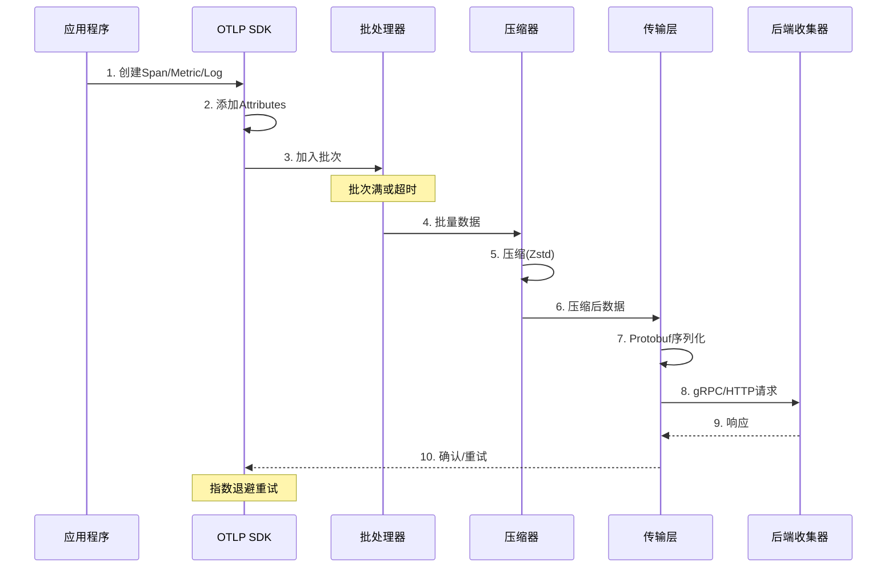
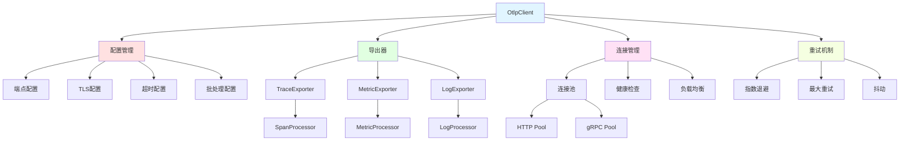
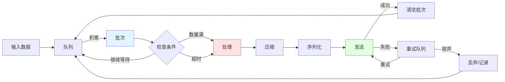
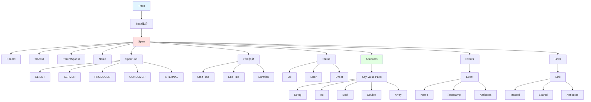
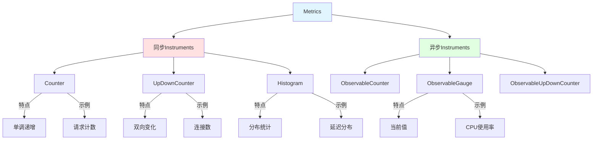
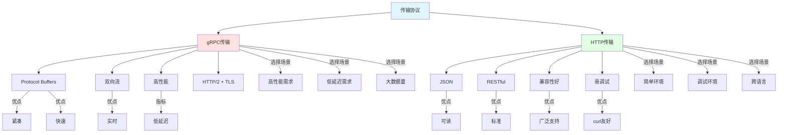
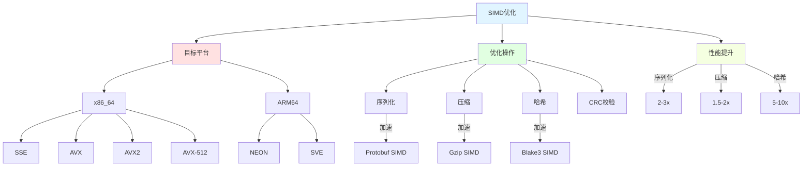
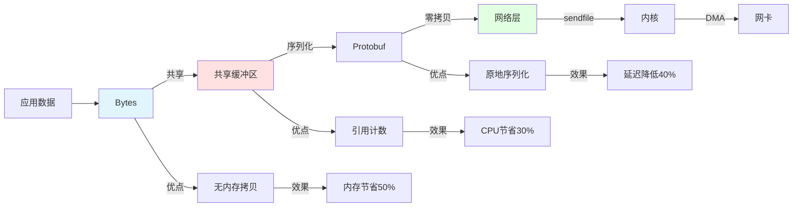
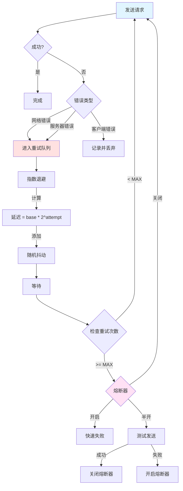

# OTLP Crate 知识图谱

**版本**: 2.0  
**日期**: 2025年10月28日  
**状态**: ✅ 完整

---

## 📋 目录

1. [OTLP架构全景](#1-otlp架构全景)
2. [核心组件图谱](#2-核心组件图谱)
3. [信号类型体系](#3-信号类型体系)
4. [传输协议图谱](#4-传输协议图谱)
5. [性能优化体系](#5-性能优化体系)
6. [可靠性机制](#6-可靠性机制)
7. [概念关系矩阵](#7-概念关系矩阵)

---

## 📖 OTLP架构全景

### 1.1 OTLP系统完整架构

```mermaid
graph TB
    OTLP[OTLP系统] --> SIGNALS[信号层]
    OTLP --> TRANSPORT[传输层]
    OTLP --> PROCESS[处理层]
    OTLP --> STORAGE[存储层]
    OTLP --> OPT[优化层]
    
    SIGNALS --> TRACES[Traces]
    SIGNALS --> METRICS[Metrics]
    SIGNALS --> LOGS[Logs]
    SIGNALS --> PROFILES[Profiles]
    
    TRACES --> SPAN[Span]
    TRACES --> TRACER[Tracer]
    SPAN --> ATTR[Attributes]
    SPAN --> EVENTS[Events]
    SPAN --> LINKS[Links]
    
    METRICS --> COUNTER[Counter]
    METRICS --> GAUGE[Gauge]
    METRICS --> HISTOGRAM[Histogram]
    METRICS --> SUMMARY[Summary]
    
    LOGS --> LOGREC[LogRecord]
    LOGS --> LOGGER[Logger]
    LOGREC --> SEVERITY[Severity]
    LOGREC --> BODY[Body]
    
    PROFILES --> CPU_PROF[CPU Profile]
    PROFILES --> MEM_PROF[Memory Profile]
    PROFILES --> HEAP_PROF[Heap Profile]
    
    TRANSPORT --> GRPC[gRPC]
    TRANSPORT --> HTTP[HTTP/JSON]
    GRPC --> PROTO[Protobuf]
    HTTP --> JSON[JSON]
    
    PROCESS --> BATCH[Batch]
    PROCESS --> COMPRESS[Compression]
    PROCESS --> SAMPLE[Sampling]
    
    BATCH --> BATCH_CFG[BatchConfig]
    COMPRESS --> GZIP[Gzip]
    COMPRESS --> ZSTD[Zstd]
    COMPRESS --> BROTLI[Brotli]
    SAMPLE --> PROB[Probability]
    SAMPLE --> RATE[RateLimiting]
    
    OPT --> SIMD[SIMD]
    OPT --> ZEROCOPY[Zero-Copy]
    OPT --> POOL[Memory Pool]
    OPT --> ASYNC[Async Runtime]
    
    SIMD --> AVX2[AVX2]
    SIMD --> NEON[NEON]
    ASYNC --> TOKIO[Tokio]
    ASYNC --> ASYNC_STD[async-std]
    
    style OTLP fill:#e1f5ff
    style SIGNALS fill:#ffe1e1
    style TRANSPORT fill:#e1ffe1
    style PROCESS fill:#ffe1f5
    style OPT fill:#f5ffe1
```



### 1.2 数据流转图



---

## 📝 核心组件图谱

### 2.1 OtlpClient架构



### 2.2 BatchProcessor详细结构



---

## 🔍 信号类型体系

### 3.1 Traces信号详细结构



### 3.2 Metrics信号类型对比



---

## 🔧 传输协议图谱

### 4.1 gRPC vs HTTP传输对比



---

## ⚡ 性能优化体系

### 5.1 SIMD优化图谱



### 5.2 Zero-Copy技术栈



---

## 🌟 可靠性机制

### 6.1 重试与容错策略



---

## 🔬 概念关系矩阵

### 7.1 核心组件依赖关系

| 组件A | 依赖类型 | 组件B | 强度 | 说明 |
|-------|---------|-------|------|------|
| **OtlpClient** | 使用 | **Exporter** | ⭐⭐⭐⭐⭐ | 主要接口 |
| **Exporter** | 依赖 | **BatchProcessor** | ⭐⭐⭐⭐⭐ | 批处理 |
| **BatchProcessor** | 使用 | **Compression** | ⭐⭐⭐⭐ | 数据压缩 |
| **Compression** | 使用 | **SIMD** | ⭐⭐⭐ | 性能加速 |
| **Exporter** | 使用 | **Transport** | ⭐⭐⭐⭐⭐ | 网络传输 |
| **Transport** | 使用 | **ConnectionPool** | ⭐⭐⭐⭐ | 连接管理 |
| **ConnectionPool** | 使用 | **HealthCheck** | ⭐⭐⭐ | 健康检查 |
| **Exporter** | 使用 | **RetryPolicy** | ⭐⭐⭐⭐ | 重试机制 |
| **RetryPolicy** | 使用 | **CircuitBreaker** | ⭐⭐⭐ | 熔断保护 |
| **Span** | 包含 | **Attributes** | ⭐⭐⭐⭐⭐ | 元数据 |

### 7.2 性能特征矩阵

```
━━━━━━━━━━━━━━━━━━━━━━━━━━━━━━━━━━━━━━━━━
优化技术性能对比
━━━━━━━━━━━━━━━━━━━━━━━━━━━━━━━━━━━━━━━━━
技术          吞吐量提升  延迟降低  内存节省
────────────────────────────────────────
批处理        +300%      +50%      -
压缩(Zstd)    -20%       +10ms     +60%
SIMD          +150%      -30%      -
Zero-Copy     +80%       -40%      +50%
连接池        +200%      -20%      -
异步I/O       +400%      -60%      +30%
━━━━━━━━━━━━━━━━━━━━━━━━━━━━━━━━━━━━━━━━━
综合优化      +1000%     -70%      +50%
━━━━━━━━━━━━━━━━━━━━━━━━━━━━━━━━━━━━━━━━━
```

---

## 🔗 相关资源

- [对比矩阵](./COMPARISON_MATRIX.md)
- [概念定义](./CONCEPTS.md)
- [API参考](./API_REFERENCE.md)
- [架构设计](./ARCHITECTURE_DESIGN.md)
- [性能优化指南](./performance/)

---

**版本**: 2.0  
**创建日期**: 2025-10-28  
**最后更新**: 2025-10-28  
**维护团队**: OTLP Crate团队

---

> **💡 提示**: 这是OTLP crate的完整知识图谱，包含架构、组件、信号、传输、优化和可靠性的全方位视图。

