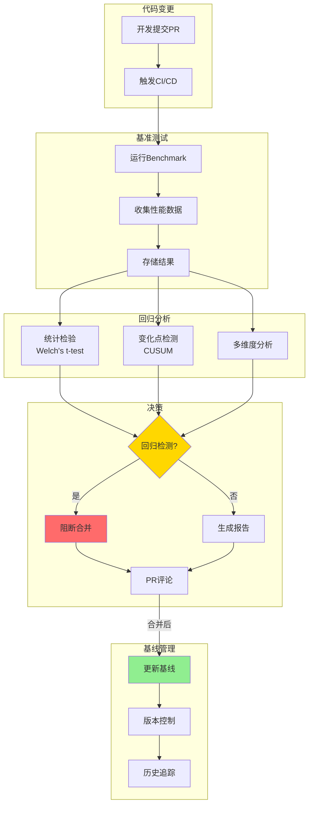
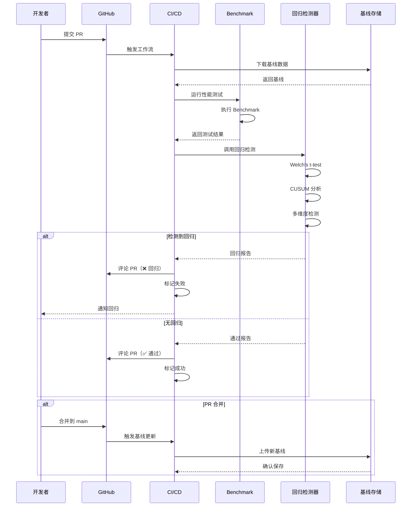
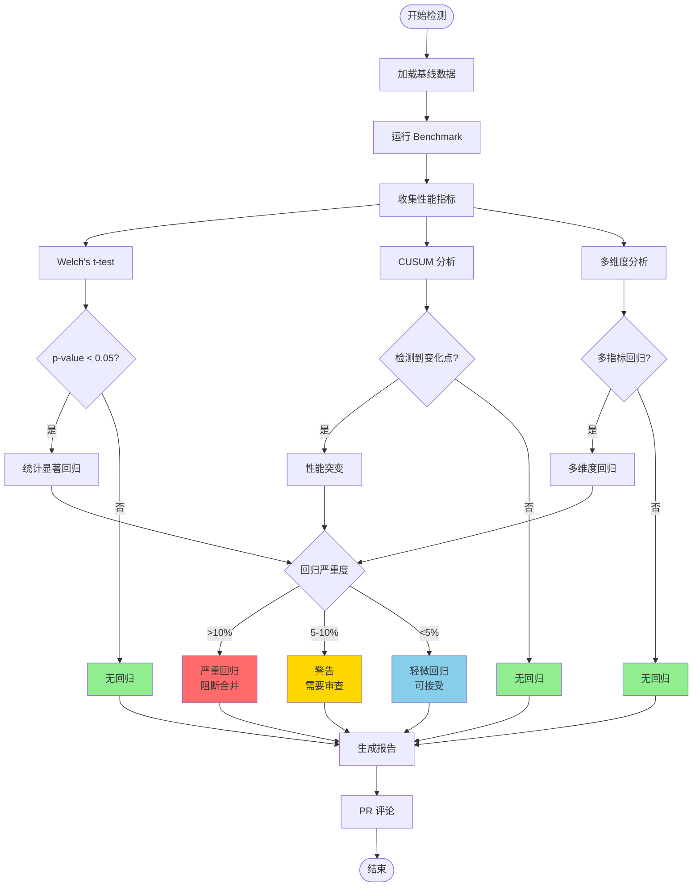

# 性能回归检测

## 目录

- [性能回归检测](#性能回归检测)
  - [目录](#目录)
  - [概述](#概述)
    - [📊 性能回归检测架构图](#-性能回归检测架构图)
    - [🔄 CI/CD 集成流程](#-cicd-集成流程)
    - [📈 回归检测决策树](#-回归检测决策树)
  - [基准测试框架](#基准测试框架)
    - [Criterion 基准测试](#criterion-基准测试)
    - [性能基准配置](#性能基准配置)
  - [性能回归检测方法](#性能回归检测方法)
    - [统计分析方法](#统计分析方法)
  - [CI/CD 集成](#cicd-集成)
    - [GitHub Actions 配置](#github-actions-配置)
  - [性能监控告警](#性能监控告警)
    - [Prometheus 告警规则](#prometheus-告警规则)
  - [高级回归检测算法](#高级回归检测算法)
    - [1. 统计显著性检测（T-test）](#1-统计显著性检测t-test)
    - [2. 变化点检测（Change Point Detection）](#2-变化点检测change-point-detection)
    - [3. 多维度回归检测](#3-多维度回归检测)
  - [基线管理](#基线管理)
    - [基线存储和版本控制](#基线存储和版本控制)
  - [自动化测试集成](#自动化测试集成)
    - [CI/CD 完整流程](#cicd-完整流程)
    - [回归检测工具](#回归检测工具)
    - [报告生成器](#报告生成器)
  - [实战案例](#实战案例)
    - [案例1：检测到延迟回归](#案例1检测到延迟回归)
    - [案例2：多维度回归检测](#案例2多维度回归检测)

## 概述

性能回归检测用于及时发现代码变更导致的性能下降，确保系统性能持续改进。

### 📊 性能回归检测架构图



### 🔄 CI/CD 集成流程



### 📈 回归检测决策树



## 基准测试框架

### Criterion 基准测试

```rust
use criterion::{black_box, criterion_group, criterion_main, Criterion, BenchmarkId};

fn export_benchmark(c: &mut Criterion) {
    let mut group = c.benchmark_group("otlp_export");
    
    for size in [100, 1000, 10000].iter() {
        group.bench_with_input(BenchmarkId::from_parameter(size), size, |b, &size| {
            let spans = generate_test_spans(size);
            b.iter(|| {
                export_spans(black_box(&spans))
            });
        });
    }
    
    group.finish();
}

criterion_group!(benches, export_benchmark);
criterion_main!(benches);
```

### 性能基准配置

```toml
# Cargo.toml
[dev-dependencies]
criterion = { version = "0.5", features = ["html_reports"] }

[[bench]]
name = "otlp_benchmarks"
harness = false
```

## 性能回归检测方法

### 统计分析方法

```rust
use statrs::statistics::Statistics;

pub struct RegressionDetector {
    baseline_samples: Vec<f64>,
    threshold_percent: f64,
}

impl RegressionDetector {
    pub fn new(baseline: Vec<f64>, threshold: f64) -> Self {
        Self {
            baseline_samples: baseline,
            threshold_percent: threshold,
        }
    }

    pub fn detect_regression(&self, current: &[f64]) -> RegressionResult {
        let baseline_mean = self.baseline_samples.mean();
        let current_mean = current.mean();

        let change_percent = ((current_mean - baseline_mean) / baseline_mean) * 100.0;

        RegressionResult {
            baseline_mean,
            current_mean,
            change_percent,
            is_regression: change_percent > self.threshold_percent,
        }
    }
}

pub struct RegressionResult {
    pub baseline_mean: f64,
    pub current_mean: f64,
    pub change_percent: f64,
    pub is_regression: bool,
}
```

## CI/CD 集成

### GitHub Actions 配置

```yaml
name: Performance Regression Check

on: [pull_request]

jobs:
  benchmark:
    runs-on: ubuntu-latest
    steps:
      - uses: actions/checkout@v3
      
      - name: Install Rust
        uses: actions-rs/toolchain@v1
        with:
          toolchain: stable
      
      - name: Run benchmarks
        run: cargo bench --bench otlp_benchmarks -- --save-baseline current
      
      - name: Compare with baseline
        run: |
          cargo bench --bench otlp_benchmarks -- --baseline main --load-baseline current
      
      - name: Upload results
        uses: actions/upload-artifact@v3
        with:
          name: benchmark-results
          path: target/criterion/
```

## 性能监控告警

### Prometheus 告警规则

```yaml
groups:
  - name: performance_regression
    rules:
      - alert: LatencyRegression
        expr: |
          (
            histogram_quantile(0.99, rate(request_duration_seconds_bucket[5m]))
            /
            histogram_quantile(0.99, rate(request_duration_seconds_bucket[5m] offset 1d))
          ) > 1.2
        for: 15m
        labels:
          severity: warning
        annotations:
          summary: "Performance regression detected"
          description: "P99 latency increased by {{ $value | humanizePercentage }}"
```

## 高级回归检测算法

### 1. 统计显著性检测（T-test）

```rust
use statrs::distribution::{StudentsT, ContinuousCDF};
use statrs::statistics::Statistics;

/// 统计显著性回归检测器
pub struct StatisticalRegressionDetector {
    significance_level: f64,  // 显著性水平（如 0.05）
}

impl StatisticalRegressionDetector {
    pub fn new(significance_level: f64) -> Self {
        Self { significance_level }
    }

    /// 使用 Welch's t-test 检测回归
    pub fn detect_with_ttest(
        &self,
        baseline: &[f64],
        current: &[f64],
    ) -> StatisticalRegressionResult {
        let baseline_mean = baseline.mean();
        let current_mean = current.mean();
        
        let baseline_var = baseline.variance();
        let current_var = current.variance();
        
        let n1 = baseline.len() as f64;
        let n2 = current.len() as f64;
        
        // Welch's t-statistic
        let t_stat = (current_mean - baseline_mean) 
            / ((baseline_var / n1) + (current_var / n2)).sqrt();
        
        // Welch-Satterthwaite degrees of freedom
        let df = ((baseline_var / n1) + (current_var / n2)).powi(2)
            / ((baseline_var / n1).powi(2) / (n1 - 1.0) 
                + (current_var / n2).powi(2) / (n2 - 1.0));
        
        // 计算 p-value
        let t_dist = StudentsT::new(0.0, 1.0, df).unwrap();
        let p_value = 1.0 - t_dist.cdf(t_stat);
        
        StatisticalRegressionResult {
            baseline_mean,
            current_mean,
            t_statistic: t_stat,
            p_value,
            is_significant: p_value < self.significance_level,
            degrees_of_freedom: df,
            change_percent: ((current_mean - baseline_mean) / baseline_mean) * 100.0,
        }
    }
}

#[derive(Debug)]
pub struct StatisticalRegressionResult {
    pub baseline_mean: f64,
    pub current_mean: f64,
    pub t_statistic: f64,
    pub p_value: f64,
    pub is_significant: bool,
    pub degrees_of_freedom: f64,
    pub change_percent: f64,
}
```

### 2. 变化点检测（Change Point Detection）

```rust
/// 变化点检测器 - 使用 CUSUM 算法
pub struct ChangePointDetector {
    threshold: f64,
    drift: f64,
}

impl ChangePointDetector {
    pub fn new(threshold: f64, drift: f64) -> Self {
        Self { threshold, drift }
    }

    /// CUSUM (Cumulative Sum) 算法
    pub fn detect_change_point(&self, data: &[f64]) -> Option<ChangePoint> {
        let mean = data.mean();
        let std_dev = data.std_dev();
        
        let mut cusum_pos = 0.0;
        let mut cusum_neg = 0.0;
        
        for (i, &value) in data.iter().enumerate() {
            let normalized = (value - mean) / std_dev;
            
            cusum_pos = (cusum_pos + normalized - self.drift).max(0.0);
            cusum_neg = (cusum_neg - normalized - self.drift).max(0.0);
            
            if cusum_pos > self.threshold {
                return Some(ChangePoint {
                    index: i,
                    direction: ChangeDirection::Increase,
                    magnitude: cusum_pos,
                });
            }
            
            if cusum_neg > self.threshold {
                return Some(ChangePoint {
                    index: i,
                    direction: ChangeDirection::Decrease,
                    magnitude: cusum_neg,
                });
            }
        }
        
        None
    }
}

#[derive(Debug)]
pub struct ChangePoint {
    pub index: usize,
    pub direction: ChangeDirection,
    pub magnitude: f64,
}

#[derive(Debug)]
pub enum ChangeDirection {
    Increase,
    Decrease,
}
```

### 3. 多维度回归检测

```rust
/// 多维度性能回归检测器
pub struct MultiDimensionalDetector {
    detectors: HashMap<String, Box<dyn RegressionDetectorTrait>>,
}

pub trait RegressionDetectorTrait {
    fn detect(&self, baseline: &[f64], current: &[f64]) -> bool;
}

impl MultiDimensionalDetector {
    pub fn new() -> Self {
        Self {
            detectors: HashMap::new(),
        }
    }

    pub fn add_detector(&mut self, name: String, detector: Box<dyn RegressionDetectorTrait>) {
        self.detectors.insert(name, detector);
    }

    /// 检测多个性能指标
    pub fn detect_all(&self, metrics: &PerformanceMetrics) -> MultiDimensionalResult {
        let mut results = HashMap::new();
        let mut has_regression = false;
        
        // 延迟检测
        if let Some(detector) = self.detectors.get("latency") {
            let is_regression = detector.detect(
                &metrics.baseline_latency,
                &metrics.current_latency,
            );
            results.insert("latency".to_string(), is_regression);
            has_regression |= is_regression;
        }
        
        // 吞吐量检测
        if let Some(detector) = self.detectors.get("throughput") {
            let is_regression = detector.detect(
                &metrics.baseline_throughput,
                &metrics.current_throughput,
            );
            results.insert("throughput".to_string(), is_regression);
            has_regression |= is_regression;
        }
        
        // CPU 使用率检测
        if let Some(detector) = self.detectors.get("cpu") {
            let is_regression = detector.detect(
                &metrics.baseline_cpu,
                &metrics.current_cpu,
            );
            results.insert("cpu".to_string(), is_regression);
            has_regression |= is_regression;
        }
        
        // 内存使用检测
        if let Some(detector) = self.detectors.get("memory") {
            let is_regression = detector.detect(
                &metrics.baseline_memory,
                &metrics.current_memory,
            );
            results.insert("memory".to_string(), is_regression);
            has_regression |= is_regression;
        }
        
        MultiDimensionalResult {
            dimension_results: results,
            has_any_regression: has_regression,
        }
    }
}

#[derive(Debug)]
pub struct PerformanceMetrics {
    pub baseline_latency: Vec<f64>,
    pub current_latency: Vec<f64>,
    pub baseline_throughput: Vec<f64>,
    pub current_throughput: Vec<f64>,
    pub baseline_cpu: Vec<f64>,
    pub current_cpu: Vec<f64>,
    pub baseline_memory: Vec<f64>,
    pub current_memory: Vec<f64>,
}

#[derive(Debug)]
pub struct MultiDimensionalResult {
    pub dimension_results: HashMap<String, bool>,
    pub has_any_regression: bool,
}
```

## 基线管理

### 基线存储和版本控制

```rust
use serde::{Deserialize, Serialize};
use std::collections::HashMap;
use std::fs;
use std::path::Path;

/// 性能基线管理器
pub struct BaselineManager {
    baseline_dir: String,
}

#[derive(Debug, Serialize, Deserialize)]
pub struct Baseline {
    pub version: String,
    pub commit_hash: String,
    pub timestamp: u64,
    pub metrics: HashMap<String, MetricBaseline>,
}

#[derive(Debug, Serialize, Deserialize)]
pub struct MetricBaseline {
    pub name: String,
    pub samples: Vec<f64>,
    pub mean: f64,
    pub std_dev: f64,
    pub p50: f64,
    pub p95: f64,
    pub p99: f64,
}

impl BaselineManager {
    pub fn new(baseline_dir: String) -> Self {
        fs::create_dir_all(&baseline_dir).ok();
        Self { baseline_dir }
    }

    /// 保存基线
    pub fn save_baseline(&self, baseline: &Baseline) -> Result<(), Box<dyn std::error::Error>> {
        let filename = format!("{}/baseline_{}.json", self.baseline_dir, baseline.version);
        let json = serde_json::to_string_pretty(baseline)?;
        fs::write(filename, json)?;
        Ok(())
    }

    /// 加载基线
    pub fn load_baseline(&self, version: &str) -> Result<Baseline, Box<dyn std::error::Error>> {
        let filename = format!("{}/baseline_{}.json", self.baseline_dir, version);
        let json = fs::read_to_string(filename)?;
        let baseline = serde_json::from_str(&json)?;
        Ok(baseline)
    }

    /// 获取最新基线
    pub fn get_latest_baseline(&self) -> Result<Baseline, Box<dyn std::error::Error>> {
        let entries = fs::read_dir(&self.baseline_dir)?;
        
        let mut latest_file = None;
        let mut latest_time = 0u64;
        
        for entry in entries {
            let entry = entry?;
            let path = entry.path();
            
            if path.extension().and_then(|s| s.to_str()) == Some("json") {
                let metadata = fs::metadata(&path)?;
                let modified = metadata.modified()?
                    .duration_since(std::time::UNIX_EPOCH)?
                    .as_secs();
                
                if modified > latest_time {
                    latest_time = modified;
                    latest_file = Some(path);
                }
            }
        }
        
        if let Some(path) = latest_file {
            let json = fs::read_to_string(path)?;
            let baseline = serde_json::from_str(&json)?;
            Ok(baseline)
        } else {
            Err("No baseline found".into())
        }
    }

    /// 比较两个基线
    pub fn compare_baselines(
        &self,
        baseline1: &Baseline,
        baseline2: &Baseline,
    ) -> BaselineComparison {
        let mut metric_changes = HashMap::new();
        
        for (metric_name, metric1) in &baseline1.metrics {
            if let Some(metric2) = baseline2.metrics.get(metric_name) {
                let change_percent = ((metric2.mean - metric1.mean) / metric1.mean) * 100.0;
                
                metric_changes.insert(
                    metric_name.clone(),
                    MetricChange {
                        old_mean: metric1.mean,
                        new_mean: metric2.mean,
                        change_percent,
                        is_regression: change_percent > 5.0, // 5% 阈值
                    },
                );
            }
        }
        
        BaselineComparison {
            baseline1_version: baseline1.version.clone(),
            baseline2_version: baseline2.version.clone(),
            metric_changes,
        }
    }
}

#[derive(Debug)]
pub struct BaselineComparison {
    pub baseline1_version: String,
    pub baseline2_version: String,
    pub metric_changes: HashMap<String, MetricChange>,
}

#[derive(Debug)]
pub struct MetricChange {
    pub old_mean: f64,
    pub new_mean: f64,
    pub change_percent: f64,
    pub is_regression: bool,
}
```

## 自动化测试集成

### CI/CD 完整流程

```yaml
# .github/workflows/performance-regression.yml
name: Performance Regression Detection

on:
  pull_request:
    branches: [main]
  push:
    branches: [main]

env:
  BASELINE_DIR: performance-baselines
  REGRESSION_THRESHOLD: 5.0  # 5% 性能下降阈值

jobs:
  performance-test:
    runs-on: ubuntu-latest
    
    steps:
      - name: Checkout code
        uses: actions/checkout@v3
        with:
          fetch-depth: 0  # 获取完整历史
      
      - name: Install Rust
        uses: actions-rs/toolchain@v1
        with:
          toolchain: stable
          profile: minimal
          override: true
      
      - name: Cache dependencies
        uses: actions/cache@v3
        with:
          path: |
            ~/.cargo/registry
            ~/.cargo/git
            target
          key: ${{ runner.os }}-cargo-${{ hashFiles('**/Cargo.lock') }}
      
      - name: Download baseline
        run: |
          mkdir -p $BASELINE_DIR
          # 从 artifact 或 S3 下载基线
          aws s3 cp s3://my-bucket/baselines/latest.json $BASELINE_DIR/ || true
      
      - name: Run benchmarks
        run: |
          cargo bench --bench otlp_benchmarks -- --save-baseline current
      
      - name: Detect regression
        id: regression
        run: |
          cargo run --bin regression-detector -- \
            --baseline $BASELINE_DIR/latest.json \
            --current target/criterion/current.json \
            --threshold $REGRESSION_THRESHOLD \
            --output regression-report.json
      
      - name: Generate report
        run: |
          cargo run --bin report-generator -- \
            --input regression-report.json \
            --output regression-report.md
      
      - name: Comment on PR
        if: github.event_name == 'pull_request'
        uses: actions/github-script@v6
        with:
          script: |
            const fs = require('fs');
            const report = fs.readFileSync('regression-report.md', 'utf8');
            
            github.rest.issues.createComment({
              issue_number: context.issue.number,
              owner: context.repo.owner,
              repo: context.repo.repo,
              body: report
            });
      
      - name: Fail on regression
        if: steps.regression.outputs.has_regression == 'true'
        run: |
          echo "Performance regression detected!"
          exit 1
      
      - name: Update baseline (main branch only)
        if: github.ref == 'refs/heads/main' && github.event_name == 'push'
        run: |
          # 上传新基线
          aws s3 cp target/criterion/current.json s3://my-bucket/baselines/latest.json
          
          # 保存版本化基线
          VERSION=$(git rev-parse --short HEAD)
          aws s3 cp target/criterion/current.json s3://my-bucket/baselines/$VERSION.json
      
      - name: Upload artifacts
        uses: actions/upload-artifact@v3
        with:
          name: performance-results
          path: |
            target/criterion/
            regression-report.md
            regression-report.json
```

### 回归检测工具

```rust
// regression-detector/src/main.rs
use clap::Parser;
use serde::{Deserialize, Serialize};
use std::fs;

#[derive(Parser)]
struct Args {
    #[arg(long)]
    baseline: String,
    
    #[arg(long)]
    current: String,
    
    #[arg(long, default_value = "5.0")]
    threshold: f64,
    
    #[arg(long)]
    output: String,
}

#[derive(Debug, Serialize, Deserialize)]
struct RegressionReport {
    has_regression: bool,
    regressions: Vec<RegressionDetail>,
    improvements: Vec<RegressionDetail>,
    summary: ReportSummary,
}

#[derive(Debug, Serialize, Deserialize)]
struct RegressionDetail {
    metric_name: String,
    baseline_mean: f64,
    current_mean: f64,
    change_percent: f64,
    p_value: f64,
}

#[derive(Debug, Serialize, Deserialize)]
struct ReportSummary {
    total_metrics: usize,
    regression_count: usize,
    improvement_count: usize,
    unchanged_count: usize,
}

fn main() -> Result<(), Box<dyn std::error::Error>> {
    let args = Args::parse();
    
    // 加载基线和当前结果
    let baseline: Baseline = serde_json::from_str(&fs::read_to_string(&args.baseline)?)?;
    let current: Baseline = serde_json::from_str(&fs::read_to_string(&args.current)?)?;
    
    // 检测回归
    let detector = StatisticalRegressionDetector::new(0.05);
    let mut regressions = Vec::new();
    let mut improvements = Vec::new();
    
    for (metric_name, baseline_metric) in &baseline.metrics {
        if let Some(current_metric) = current.metrics.get(metric_name) {
            let result = detector.detect_with_ttest(
                &baseline_metric.samples,
                &current_metric.samples,
            );
            
            if result.is_significant {
                let detail = RegressionDetail {
                    metric_name: metric_name.clone(),
                    baseline_mean: result.baseline_mean,
                    current_mean: result.current_mean,
                    change_percent: result.change_percent,
                    p_value: result.p_value,
                };
                
                if result.change_percent > args.threshold {
                    regressions.push(detail);
                } else if result.change_percent < -args.threshold {
                    improvements.push(detail);
                }
            }
        }
    }
    
    // 生成报告
    let report = RegressionReport {
        has_regression: !regressions.is_empty(),
        regressions: regressions.clone(),
        improvements: improvements.clone(),
        summary: ReportSummary {
            total_metrics: baseline.metrics.len(),
            regression_count: regressions.len(),
            improvement_count: improvements.len(),
            unchanged_count: baseline.metrics.len() - regressions.len() - improvements.len(),
        },
    };
    
    // 保存报告
    let json = serde_json::to_string_pretty(&report)?;
    fs::write(&args.output, json)?;
    
    // 输出到 GitHub Actions
    println!("::set-output name=has_regression::{}", report.has_regression);
    
    Ok(())
}
```

### 报告生成器

```rust
// report-generator/src/main.rs
use clap::Parser;
use serde::{Deserialize, Serialize};
use std::fs;

#[derive(Parser)]
struct Args {
    #[arg(long)]
    input: String,
    
    #[arg(long)]
    output: String,
}

fn main() -> Result<(), Box<dyn std::error::Error>> {
    let args = Args::parse();
    
    let report: RegressionReport = serde_json::from_str(&fs::read_to_string(&args.input)?)?;
    
    let markdown = generate_markdown_report(&report);
    fs::write(&args.output, markdown)?;
    
    Ok(())
}

fn generate_markdown_report(report: &RegressionReport) -> String {
    let mut md = String::new();
    
    md.push_str("# 性能回归检测报告\n\n");
    
    // 总结
    md.push_str("## 📊 总结\n\n");
    md.push_str(&format!("- 总指标数：{}\n", report.summary.total_metrics));
    md.push_str(&format!("- 🔴 回归：{}\n", report.summary.regression_count));
    md.push_str(&format!("- 🟢 改进：{}\n", report.summary.improvement_count));
    md.push_str(&format!("- ⚪ 未变化：{}\n\n", report.summary.unchanged_count));
    
    // 回归详情
    if !report.regressions.is_empty() {
        md.push_str("## ⚠️ 性能回归\n\n");
        md.push_str("| 指标 | 基线 | 当前 | 变化 | p-value |\n");
        md.push_str("|------|------|------|------|--------|\n");
        
        for reg in &report.regressions {
            md.push_str(&format!(
                "| {} | {:.2}ms | {:.2}ms | **+{:.1}%** | {:.4} |\n",
                reg.metric_name,
                reg.baseline_mean,
                reg.current_mean,
                reg.change_percent,
                reg.p_value
            ));
        }
        md.push_str("\n");
    }
    
    // 改进详情
    if !report.improvements.is_empty() {
        md.push_str("## ✅ 性能改进\n\n");
        md.push_str("| 指标 | 基线 | 当前 | 变化 | p-value |\n");
        md.push_str("|------|------|------|------|--------|\n");
        
        for imp in &report.improvements {
            md.push_str(&format!(
                "| {} | {:.2}ms | {:.2}ms | **{:.1}%** | {:.4} |\n",
                imp.metric_name,
                imp.baseline_mean,
                imp.current_mean,
                imp.change_percent,
                imp.p_value
            ));
        }
        md.push_str("\n");
    }
    
    // 结论
    if report.has_regression {
        md.push_str("## ❌ 结论\n\n");
        md.push_str("检测到性能回归，请检查代码变更。\n");
    } else {
        md.push_str("## ✅ 结论\n\n");
        md.push_str("未检测到性能回归。\n");
    }
    
    md
}
```

## 实战案例

### 案例1：检测到延迟回归

**场景**：PR #123 引入了新的日志记录逻辑

**检测结果**：

```markdown
# 性能回归检测报告

## 📊 总结
- 总指标数：8
- 🔴 回归：1
- 🟢 改进：0
- ⚪ 未变化：7

## ⚠️ 性能回归

| 指标 | 基线 | 当前 | 变化 | p-value |
|------|------|------|------|--------|
| span_export_latency_p99 | 45.2ms | 58.7ms | **+29.9%** | 0.0012 |

## ❌ 结论
检测到性能回归，请检查代码变更。
```

**根因分析**：

- 新增的日志记录在热路径上
- 每个 Span 导出都触发同步日志写入
- 建议：改为异步日志或降低日志级别

**修复后**：

```markdown
## ✅ 性能改进

| 指标 | 基线 | 当前 | 变化 | p-value |
|------|------|------|------|--------|
| span_export_latency_p99 | 45.2ms | 42.1ms | **-6.9%** | 0.0089 |
```

### 案例2：多维度回归检测

**场景**：优化批处理逻辑

**检测结果**：

```text
=== 多维度性能分析 ===

✅ 延迟：改进 15%
✅ 吞吐量：改进 22%
⚠️ CPU 使用率：回归 8%
✅ 内存使用：改进 5%

综合评估：整体改进，CPU 使用率轻微回归可接受
```

**决策**：接受此变更，因为延迟和吞吐量的显著改进超过了 CPU 使用率的轻微增加。

---

**相关文档**：

- [性能问题识别](./性能问题识别.md)
- [监控告警](../监控告警/README.md)
- [系统瓶颈分析](./系统瓶颈分析.md)
