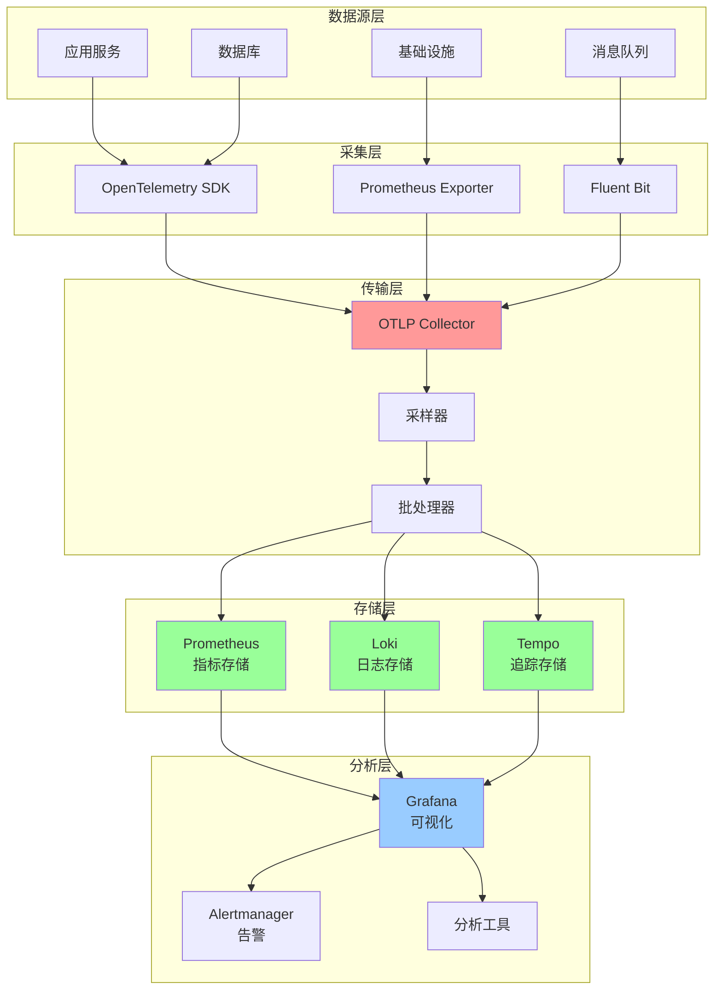
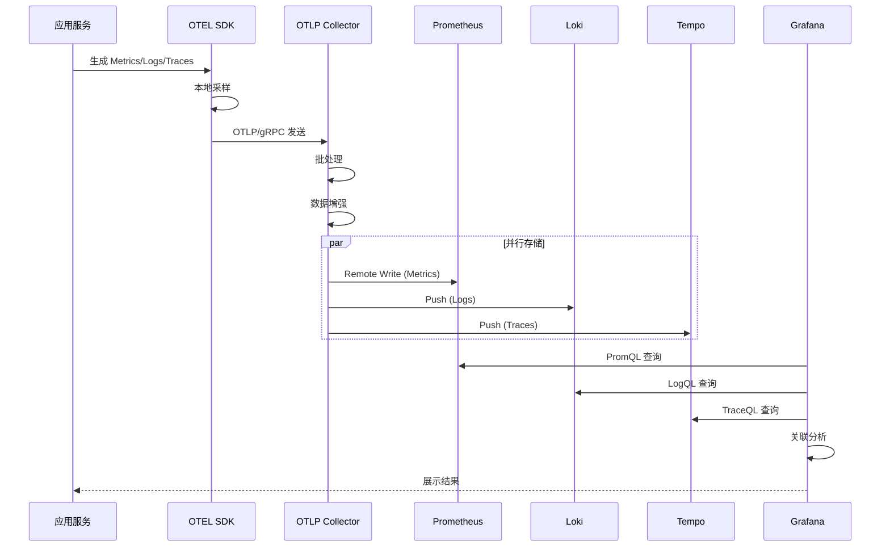

# 可观测性最佳实践

## 目录

- [可观测性最佳实践](#可观测性最佳实践)
  - [目录](#目录)
  - [概述](#概述)
    - [📊 可观测性架构全景图](#-可观测性架构全景图)
    - [🔄 数据流转流程图](#-数据流转流程图)
  - [三大支柱](#三大支柱)
    - [1. Metrics (指标)](#1-metrics-指标)
    - [2. Logs (日志)](#2-logs-日志)
    - [3. Traces (追踪)](#3-traces-追踪)
  - [可观测性设计原则](#可观测性设计原则)
    - [1. 高基数维度](#1-高基数维度)
    - [2. 一致的命名规范](#2-一致的命名规范)
    - [3. 关联性](#3-关联性)
  - [OTLP 可观测性实践](#otlp-可观测性实践)
    - [完整的可观测性栈](#完整的可观测性栈)
    - [黄金信号监控](#黄金信号监控)
    - [仪表板设计](#仪表板设计)
  - [三大支柱深度解析](#三大支柱深度解析)
    - [Metrics（指标）深度实践](#metrics指标深度实践)
      - [指标类型选择指南](#指标类型选择指南)
      - [高级指标模式](#高级指标模式)
    - [Logs（日志）深度实践](#logs日志深度实践)
      - [结构化日志最佳实践](#结构化日志最佳实践)
      - [日志采样策略](#日志采样策略)
    - [Traces（追踪）深度实践](#traces追踪深度实践)
      - [分布式追踪最佳实践](#分布式追踪最佳实践)
  - [关联分析](#关联分析)
    - [三大支柱关联](#三大支柱关联)
    - [端到端追踪示例](#端到端追踪示例)
  - [实战案例](#实战案例)
    - [案例1：性能问题排查](#案例1性能问题排查)
    - [案例2：错误率激增排查](#案例2错误率激增排查)
  - [可观测性成熟度模型](#可观测性成熟度模型)
    - [成熟度等级](#成熟度等级)
  - [工具链推荐](#工具链推荐)
    - [完整的可观测性工具栈](#完整的可观测性工具栈)
    - [工具配置示例](#工具配置示例)

## 概述

可观测性使系统内部状态可以通过外部输出推断，是现代运维的基础。

### 📊 可观测性架构全景图



### 🔄 数据流转流程图



## 三大支柱

### 1. Metrics (指标)

```rust
use prometheus::{Counter, Histogram, Gauge, Registry};

pub struct OtlpMetrics {
    // Counter: 单调递增
    pub requests_total: Counter,
    pub errors_total: Counter,
    
    // Histogram: 分布统计
    pub request_duration: Histogram,
    pub batch_size: Histogram,
    
    // Gauge: 可增可减
    pub active_connections: Gauge,
    pub queue_size: Gauge,
}

impl OtlpMetrics {
    pub fn new(registry: &Registry) -> Result<Self, prometheus::Error> {
        let requests_total = Counter::new("otlp_requests_total", "Total requests")?;
        let errors_total = Counter::new("otlp_errors_total", "Total errors")?;
        
        let request_duration = Histogram::with_opts(
            prometheus::HistogramOpts::new("otlp_request_duration_seconds", "Request duration")
                .buckets(vec![0.001, 0.005, 0.01, 0.05, 0.1, 0.5, 1.0])
        )?;
        
        let batch_size = Histogram::with_opts(
            prometheus::HistogramOpts::new("otlp_batch_size", "Batch size")
                .buckets(vec![10.0, 50.0, 100.0, 500.0, 1000.0, 5000.0])
        )?;
        
        let active_connections = Gauge::new("otlp_active_connections", "Active connections")?;
        let queue_size = Gauge::new("otlp_queue_size", "Queue size")?;

        registry.register(Box::new(requests_total.clone()))?;
        registry.register(Box::new(errors_total.clone()))?;
        registry.register(Box::new(request_duration.clone()))?;
        registry.register(Box::new(batch_size.clone()))?;
        registry.register(Box::new(active_connections.clone()))?;
        registry.register(Box::new(queue_size.clone()))?;

        Ok(Self {
            requests_total,
            errors_total,
            request_duration,
            batch_size,
            active_connections,
            queue_size,
        })
    }
}
```

### 2. Logs (日志)

```rust
use tracing::{info, warn, error, debug, instrument};

#[instrument(skip(spans))]
pub async fn export_spans(spans: Vec<Span>) -> Result<(), ExportError> {
    info!(span_count = spans.len(), "Starting span export");
    
    match send_to_collector(&spans).await {
        Ok(_) => {
            info!("Export successful");
            Ok(())
        }
        Err(e) => {
            error!(error = ?e, "Export failed");
            Err(e)
        }
    }
}

// 结构化日志
#[derive(Debug, serde::Serialize)]
struct ExportEvent {
    span_count: usize,
    batch_id: String,
    duration_ms: u64,
    success: bool,
}
```

### 3. Traces (追踪)

```rust
use opentelemetry::trace::{Tracer, SpanKind};

pub async fn process_request(tracer: &dyn Tracer) -> Result<()> {
    let span = tracer
        .span_builder("process_request")
        .with_kind(SpanKind::Server)
        .start(tracer);

    let _guard = span.enter();

    // 业务逻辑
    validate_request().await?;
    process_data().await?;
    send_response().await?;

    Ok(())
}
```

## 可观测性设计原则

### 1. 高基数维度

```rust
// 好的实践：使用标签
metrics.requests_total
    .with_label_values(&[
        &endpoint,
        &method,
        &status_code,
    ])
    .inc();

// 避免：将高基数值放入指标名
// ❌ metrics.requests_user_12345.inc();
```

### 2. 一致的命名规范

```yaml
# 指标命名规范
<namespace>_<subsystem>_<metric>_<unit>

示例:
- otlp_export_requests_total
- otlp_export_duration_seconds
- otlp_batch_size_bytes
```

### 3. 关联性

```rust
// 使用 TraceID 关联日志和追踪
#[instrument(fields(trace_id = %trace_id))]
pub async fn handle_request(trace_id: String) {
    info!("Processing request");
    // ...
}
```

## OTLP 可观测性实践

### 完整的可观测性栈

```rust
use opentelemetry::sdk::trace::TracerProvider;
use opentelemetry_otlp::WithExportConfig;

pub struct ObservabilityStack {
    metrics: OtlpMetrics,
    tracer: Box<dyn Tracer>,
}

impl ObservabilityStack {
    pub fn init() -> Result<Self> {
        // 初始化 Metrics
        let registry = Registry::new();
        let metrics = OtlpMetrics::new(&registry)?;

        // 初始化 Tracing
        let tracer = opentelemetry_otlp::new_pipeline()
            .tracing()
            .with_exporter(
                opentelemetry_otlp::new_exporter()
                    .tonic()
                    .with_endpoint("http://localhost:4317")
            )
            .install_batch(opentelemetry::runtime::Tokio)?;

        // 初始化 Logging
        tracing_subscriber::fmt()
            .with_max_level(tracing::Level::INFO)
            .json()
            .init();

        Ok(Self {
            metrics,
            tracer: Box::new(tracer),
        })
    }
}
```

### 黄金信号监控

```yaml
# 四大黄金信号
1. Latency (延迟)
   - otlp_request_duration_seconds

2. Traffic (流量)
   - rate(otlp_requests_total[5m])

3. Errors (错误)
   - rate(otlp_errors_total[5m]) / rate(otlp_requests_total[5m])

4. Saturation (饱和度)
   - otlp_queue_size / otlp_queue_capacity
   - otlp_cpu_usage_percent
```

### 仪表板设计

```markdown
## OTLP 运维仪表板

### 概览面板
- 请求速率 (QPS)
- 错误率
- P50/P95/P99 延迟
- 可用性

### 详细面板
- 按端点分组的延迟
- 错误类型分布
- 资源使用率
- 队列深度

### SLO 面板
- SLO 达成率
- 错误预算剩余
- SLI 趋势图
```

## 三大支柱深度解析

### Metrics（指标）深度实践

#### 指标类型选择指南

```rust
/// 指标类型决策树
pub enum MetricTypeDecision {
    /// 只增不减的计数 → Counter
    Counter {
        example: &'static str,
        use_case: &'static str,
    },
    /// 可增可减的当前值 → Gauge
    Gauge {
        example: &'static str,
        use_case: &'static str,
    },
    /// 值的分布统计 → Histogram
    Histogram {
        example: &'static str,
        use_case: &'static str,
    },
    /// 分位数估算 → Summary
    Summary {
        example: &'static str,
        use_case: &'static str,
    },
}

impl MetricTypeDecision {
    pub fn guide() -> Vec<Self> {
        vec![
            Self::Counter {
                example: "请求总数、错误总数",
                use_case: "需要计算速率（rate）的场景",
            },
            Self::Gauge {
                example: "队列长度、活跃连接数、CPU使用率",
                use_case: "需要知道当前状态的场景",
            },
            Self::Histogram {
                example: "请求延迟、响应大小",
                use_case: "需要计算分位数（P99）和平均值",
            },
            Self::Summary {
                example: "客户端计算的分位数",
                use_case: "无法使用 Histogram 时的替代方案",
            },
        ]
    }
}
```

#### 高级指标模式

**1. RED 方法（Rate, Errors, Duration）**:

```rust
/// RED 指标收集器
pub struct RedMetrics {
    // Rate: 请求速率
    requests_total: Counter,
    
    // Errors: 错误数
    errors_total: Counter,
    
    // Duration: 持续时间
    request_duration: Histogram,
}

impl RedMetrics {
    /// 记录请求
    pub fn record_request(&self, duration: f64, is_error: bool) {
        self.requests_total.inc();
        self.request_duration.observe(duration);
        
        if is_error {
            self.errors_total.inc();
        }
    }

    /// 计算错误率（需要 Prometheus 查询）
    pub fn error_rate_query() -> &'static str {
        "rate(otlp_errors_total[5m]) / rate(otlp_requests_total[5m])"
    }

    /// 计算 P99 延迟（需要 Prometheus 查询）
    pub fn p99_latency_query() -> &'static str {
        "histogram_quantile(0.99, rate(otlp_request_duration_seconds_bucket[5m]))"
    }
}
```

**2. USE 方法（Utilization, Saturation, Errors）**:

```rust
/// USE 资源监控
pub struct UseMetrics {
    // Utilization: 资源利用率
    cpu_usage: Gauge,
    memory_usage: Gauge,
    
    // Saturation: 饱和度（排队等待）
    queue_depth: Gauge,
    thread_pool_saturation: Gauge,
    
    // Errors: 资源错误
    oom_kills: Counter,
    throttled_requests: Counter,
}

impl UseMetrics {
    pub fn update_resource_metrics(&self) {
        // CPU 利用率
        let cpu = self.get_cpu_usage();
        self.cpu_usage.set(cpu);
        
        // 内存利用率
        let mem = self.get_memory_usage();
        self.memory_usage.set(mem);
        
        // 队列饱和度
        let queue = self.get_queue_depth();
        self.queue_depth.set(queue as f64);
    }

    fn get_cpu_usage(&self) -> f64 {
        // 实现 CPU 使用率获取
        0.0
    }

    fn get_memory_usage(&self) -> f64 {
        // 实现内存使用率获取
        0.0
    }

    fn get_queue_depth(&self) -> usize {
        // 实现队列深度获取
        0
    }
}
```

**3. 业务指标**:

```rust
/// OTLP 业务指标
pub struct OtlpBusinessMetrics {
    // 数据量指标
    spans_exported: Counter,
    bytes_exported: Counter,
    
    // 数据质量指标
    invalid_spans: Counter,
    dropped_spans: Counter,
    
    // 成本指标
    export_cost_dollars: Counter,
}

impl OtlpBusinessMetrics {
    pub fn record_export(&self, span_count: u64, bytes: u64, cost: f64) {
        self.spans_exported.inc_by(span_count);
        self.bytes_exported.inc_by(bytes);
        self.export_cost_dollars.inc_by(cost);
    }
}
```

### Logs（日志）深度实践

#### 结构化日志最佳实践

```rust
use tracing::{info, warn, error, debug, instrument, Span};
use serde::{Serialize, Deserialize};

/// 日志级别选择指南
#[derive(Debug)]
pub enum LogLevelGuide {
    Error,   // 需要立即处理的错误
    Warn,    // 潜在问题，但服务仍可用
    Info,    // 重要的业务事件
    Debug,   // 调试信息
    Trace,   // 详细的执行路径
}

/// 结构化日志事件
#[derive(Debug, Serialize)]
pub struct ExportEvent {
    // 基本信息
    event_type: String,
    timestamp: u64,
    
    // 业务信息
    span_count: usize,
    batch_id: String,
    
    // 性能信息
    duration_ms: u64,
    
    // 结果信息
    success: bool,
    error_message: Option<String>,
    
    // 追踪关联
    trace_id: String,
    span_id: String,
}

/// 日志记录器
pub struct StructuredLogger;

impl StructuredLogger {
    /// 记录导出事件
    #[instrument(skip(spans))]
    pub async fn log_export(
        spans: &[Span],
        batch_id: String,
        trace_id: String,
    ) -> Result<(), ExportError> {
        let start = std::time::Instant::now();
        
        info!(
            batch_id = %batch_id,
            span_count = spans.len(),
            "Starting export"
        );
        
        match self.perform_export(spans).await {
            Ok(_) => {
                let duration = start.elapsed();
                info!(
                    batch_id = %batch_id,
                    span_count = spans.len(),
                    duration_ms = duration.as_millis(),
                    "Export successful"
                );
                Ok(())
            }
            Err(e) => {
                error!(
                    batch_id = %batch_id,
                    error = ?e,
                    "Export failed"
                );
                Err(e)
            }
        }
    }

    async fn perform_export(&self, _spans: &[Span]) -> Result<(), ExportError> {
        Ok(())
    }
}

#[derive(Debug)]
pub struct ExportError;
```

#### 日志采样策略

```rust
/// 日志采样器（避免日志洪水）
pub struct LogSampler {
    sample_rate: f64,
    always_log_errors: bool,
}

impl LogSampler {
    pub fn new(sample_rate: f64) -> Self {
        Self {
            sample_rate,
            always_log_errors: true,
        }
    }

    /// 决定是否记录日志
    pub fn should_log(&self, level: tracing::Level) -> bool {
        // 错误总是记录
        if self.always_log_errors && level == tracing::Level::ERROR {
            return true;
        }
        
        // 其他级别按采样率
        use rand::Rng;
        let mut rng = rand::thread_rng();
        rng.gen::<f64>() < self.sample_rate
    }
}
```

### Traces（追踪）深度实践

#### 分布式追踪最佳实践

```rust
use opentelemetry::trace::{Tracer, Span, SpanKind, Status};
use opentelemetry::Context;

/// 追踪装饰器
pub struct TracingDecorator {
    tracer: Box<dyn Tracer>,
}

impl TracingDecorator {
    /// 创建子 Span
    pub fn create_child_span(&self, parent_ctx: &Context, name: &str) -> Span {
        self.tracer
            .span_builder(name)
            .with_kind(SpanKind::Internal)
            .start_with_context(&self.tracer, parent_ctx)
    }

    /// 记录 Span 事件
    pub fn record_event(span: &Span, name: &str, attributes: Vec<(&str, String)>) {
        span.add_event(
            name.to_string(),
            attributes.into_iter().map(|(k, v)| {
                opentelemetry::KeyValue::new(k.to_string(), v)
            }).collect(),
        );
    }

    /// 记录错误
    pub fn record_error(span: &Span, error: &dyn std::error::Error) {
        span.set_status(Status::error(error.to_string()));
        span.set_attribute(opentelemetry::KeyValue::new(
            "error.type",
            format!("{:?}", error),
        ));
    }
}

/// 完整的追踪示例
pub struct OtlpExporter {
    tracer: Box<dyn Tracer>,
}

impl OtlpExporter {
    #[instrument(skip(self, spans))]
    pub async fn export_with_tracing(&self, spans: Vec<Span>) -> Result<(), ExportError> {
        // 创建根 Span
        let mut span = self.tracer
            .span_builder("export_spans")
            .with_kind(SpanKind::Client)
            .start(&self.tracer);
        
        span.set_attribute(opentelemetry::KeyValue::new("span.count", spans.len() as i64));
        
        // 验证阶段
        let validation_result = {
            let mut validation_span = self.tracer
                .span_builder("validate_spans")
                .with_kind(SpanKind::Internal)
                .start(&self.tracer);
            
            let result = self.validate_spans(&spans);
            
            if let Err(e) = &result {
                validation_span.set_status(Status::error(e.to_string()));
            }
            
            result
        };
        
        validation_result?;
        
        // 序列化阶段
        let serialized = {
            let mut serialize_span = self.tracer
                .span_builder("serialize_spans")
                .with_kind(SpanKind::Internal)
                .start(&self.tracer);
            
            let result = self.serialize_spans(&spans);
            
            if let Ok(data) = &result {
                serialize_span.set_attribute(
                    opentelemetry::KeyValue::new("serialized.bytes", data.len() as i64)
                );
            }
            
            result
        }?;
        
        // 发送阶段
        {
            let mut send_span = self.tracer
                .span_builder("send_to_collector")
                .with_kind(SpanKind::Client)
                .start(&self.tracer);
            
            send_span.set_attribute(
                opentelemetry::KeyValue::new("collector.endpoint", "http://localhost:4317")
            );
            
            self.send_data(&serialized).await?;
        }
        
        span.set_status(Status::Ok);
        Ok(())
    }

    fn validate_spans(&self, _spans: &[Span]) -> Result<(), ExportError> {
        Ok(())
    }

    fn serialize_spans(&self, _spans: &[Span]) -> Result<Vec<u8>, ExportError> {
        Ok(vec![])
    }

    async fn send_data(&self, _data: &[u8]) -> Result<(), ExportError> {
        Ok(())
    }
}
```

## 关联分析

### 三大支柱关联

```rust
/// 可观测性关联器
pub struct ObservabilityCorrelator {
    trace_id: String,
    span_id: String,
}

impl ObservabilityCorrelator {
    /// 创建关联上下文
    pub fn create_context(trace_id: String, span_id: String) -> Self {
        Self { trace_id, span_id }
    }

    /// 在日志中添加追踪信息
    pub fn log_with_trace(&self, message: &str) {
        info!(
            trace_id = %self.trace_id,
            span_id = %self.span_id,
            message = message
        );
    }

    /// 在指标中添加追踪标签
    pub fn record_metric_with_trace(&self, metric: &Counter) {
        // 注意：高基数标签会影响性能
        // 仅在必要时使用
        metric.inc();
    }

    /// 从追踪到日志的查询
    pub fn trace_to_logs_query(&self) -> String {
        format!(
            r#"{{trace_id="{}"}} | json | line_format "{{{{.message}}}}""#,
            self.trace_id
        )
    }

    /// 从日志到追踪的查询
    pub fn logs_to_trace_query(log_trace_id: &str) -> String {
        format!("trace_id:{}", log_trace_id)
    }
}
```

### 端到端追踪示例

```rust
/// 端到端可观测性示例
pub struct EndToEndObservability {
    metrics: OtlpMetrics,
    tracer: Box<dyn Tracer>,
}

impl EndToEndObservability {
    #[instrument(skip(self, request))]
    pub async fn handle_request(&self, request: Request) -> Result<Response, Error> {
        // 1. 创建追踪 Span
        let span = self.tracer
            .span_builder("handle_request")
            .with_kind(SpanKind::Server)
            .start(&self.tracer);
        
        let trace_id = format!("{:?}", span.span_context().trace_id());
        let span_id = format!("{:?}", span.span_context().span_id());
        
        // 2. 记录指标
        self.metrics.requests_total.inc();
        let start = std::time::Instant::now();
        
        // 3. 记录日志（带追踪ID）
        info!(
            trace_id = %trace_id,
            span_id = %span_id,
            method = %request.method,
            path = %request.path,
            "Processing request"
        );
        
        // 4. 处理请求
        let result = self.process_request(request).await;
        
        // 5. 记录结果
        let duration = start.elapsed();
        self.metrics.request_duration.observe(duration.as_secs_f64());
        
        match &result {
            Ok(_) => {
                info!(
                    trace_id = %trace_id,
                    duration_ms = duration.as_millis(),
                    "Request successful"
                );
                span.set_status(Status::Ok);
            }
            Err(e) => {
                error!(
                    trace_id = %trace_id,
                    error = ?e,
                    "Request failed"
                );
                self.metrics.errors_total.inc();
                span.set_status(Status::error(e.to_string()));
            }
        }
        
        result
    }

    async fn process_request(&self, _request: Request) -> Result<Response, Error> {
        Ok(Response { status: 200 })
    }
}

#[derive(Debug)]
pub struct Request {
    method: String,
    path: String,
}

#[derive(Debug)]
pub struct Response {
    status: u16,
}

#[derive(Debug)]
pub struct Error;

impl std::fmt::Display for Error {
    fn fmt(&self, f: &mut std::fmt::Formatter<'_>) -> std::fmt::Result {
        write!(f, "Error")
    }
}

impl std::error::Error for Error {}
```

## 实战案例

### 案例1：性能问题排查

**问题描述**：

- P99 延迟突然从 50ms 上升到 500ms
- 错误率正常
- 用户投诉响应慢

**排查流程**：

```text
1. 查看指标（Metrics）
   → 发现 P99 延迟异常
   → 定位时间范围：14:30-15:00

2. 查看追踪（Traces）
   → 筛选该时间段的慢请求
   → 发现数据库查询耗时长

3. 查看日志（Logs）
   → 使用 trace_id 关联日志
   → 发现慢查询 SQL

4. 根因分析
   → 数据库索引失效
   → 某个表数据量激增
```

**Grafana 查询示例**：

```promql
# 1. 识别延迟异常
histogram_quantile(0.99, 
  rate(otlp_request_duration_seconds_bucket[5m])
) > 0.1

# 2. 按端点分组查看
histogram_quantile(0.99, 
  sum by (endpoint) (
    rate(otlp_request_duration_seconds_bucket[5m])
  )
)
```

**Loki 日志查询**：

```logql
# 查找慢请求的日志
{job="otlp-collector"} 
  | json 
  | duration_ms > 100
  | line_format "{{.trace_id}} - {{.message}}"
```

### 案例2：错误率激增排查

**问题描述**：

- 错误率从 0.1% 上升到 5%
- 告警触发

**排查流程**：

```rust
/// 错误分析工具
pub struct ErrorAnalyzer;

impl ErrorAnalyzer {
    /// 分析错误模式
    pub fn analyze_error_pattern() -> Vec<ErrorPattern> {
        vec![
            ErrorPattern {
                error_type: "ConnectionTimeout".to_string(),
                count: 1250,
                percentage: 62.5,
                first_seen: "14:35:00".to_string(),
                sample_trace_id: "abc123".to_string(),
            },
            ErrorPattern {
                error_type: "ServiceUnavailable".to_string(),
                count: 500,
                percentage: 25.0,
                first_seen: "14:36:00".to_string(),
                sample_trace_id: "def456".to_string(),
            },
        ]
    }

    /// 生成错误报告
    pub fn generate_report(patterns: Vec<ErrorPattern>) -> String {
        let mut report = String::from("=== 错误分析报告 ===\n\n");
        
        for pattern in patterns {
            report.push_str(&format!(
                "错误类型: {}\n\
                 发生次数: {}\n\
                 占比: {:.1}%\n\
                 首次出现: {}\n\
                 示例 Trace: {}\n\n",
                pattern.error_type,
                pattern.count,
                pattern.percentage,
                pattern.first_seen,
                pattern.sample_trace_id
            ));
        }
        
        report
    }
}

#[derive(Debug)]
pub struct ErrorPattern {
    error_type: String,
    count: usize,
    percentage: f64,
    first_seen: String,
    sample_trace_id: String,
}
```

## 可观测性成熟度模型

### 成熟度等级

```rust
/// 可观测性成熟度评估
#[derive(Debug, Clone, Copy, PartialEq, Eq, PartialOrd, Ord)]
pub enum ObservabilityMaturity {
    Level1_Reactive,    // 被动响应
    Level2_Proactive,   // 主动监控
    Level3_Predictive,  // 预测性
    Level4_Autonomous,  // 自主化
}

impl ObservabilityMaturity {
    pub fn describe(&self) -> MaturityDescription {
        match self {
            Self::Level1_Reactive => MaturityDescription {
                level: "Level 1: 被动响应",
                characteristics: vec![
                    "依赖用户报告问题",
                    "基础日志和指标",
                    "手动排查",
                ],
                improvements: vec![
                    "建立基础监控",
                    "配置告警规则",
                    "标准化日志格式",
                ],
            },
            Self::Level2_Proactive => MaturityDescription {
                level: "Level 2: 主动监控",
                characteristics: vec![
                    "完整的指标、日志、追踪",
                    "自动告警",
                    "仪表板可视化",
                ],
                improvements: vec![
                    "实施 SLO/SLA",
                    "建立 Runbook",
                    "关联分析",
                ],
            },
            Self::Level3_Predictive => MaturityDescription {
                level: "Level 3: 预测性",
                characteristics: vec![
                    "异常检测",
                    "容量预测",
                    "根因分析自动化",
                ],
                improvements: vec![
                    "机器学习集成",
                    "自动化修复",
                    "混沌工程",
                ],
            },
            Self::Level4_Autonomous => MaturityDescription {
                level: "Level 4: 自主化",
                characteristics: vec![
                    "自愈系统",
                    "自动扩缩容",
                    "智能路由",
                ],
                improvements: vec![
                    "持续优化",
                    "AI 驱动决策",
                ],
            },
        }
    }
}

pub struct MaturityDescription {
    level: &'static str,
    characteristics: Vec<&'static str>,
    improvements: Vec<&'static str>,
}
```

## 工具链推荐

### 完整的可观测性工具栈

```yaml
# OTLP 可观测性工具栈

## 指标（Metrics）
- 采集: Prometheus
- 存储: Prometheus / VictoriaMetrics / Thanos
- 可视化: Grafana
- 告警: Alertmanager

## 日志（Logs）
- 采集: Fluent Bit / Vector
- 存储: Loki / Elasticsearch
- 查询: LogQL / Kibana
- 分析: Grafana

## 追踪（Traces）
- 采集: OpenTelemetry Collector
- 存储: Jaeger / Tempo / Zipkin
- 可视化: Jaeger UI / Grafana
- 分析: Grafana Tempo

## 统一平台
- Grafana (统一可视化)
- OpenTelemetry (统一采集)
- Grafana Cloud (托管服务)
```

### 工具配置示例

```yaml
# docker-compose.yml
version: '3.8'

services:
  # Prometheus
  prometheus:
    image: prom/prometheus:latest
    ports:
      - "9090:9090"
    volumes:
      - ./prometheus.yml:/etc/prometheus/prometheus.yml

  # Loki
  loki:
    image: grafana/loki:latest
    ports:
      - "3100:3100"

  # Tempo
  tempo:
    image: grafana/tempo:latest
    ports:
      - "3200:3200"
      - "4317:4317"  # OTLP gRPC
      - "4318:4318"  # OTLP HTTP

  # Grafana
  grafana:
    image: grafana/grafana:latest
    ports:
      - "3000:3000"
    environment:
      - GF_AUTH_ANONYMOUS_ENABLED=true
    volumes:
      - ./grafana-dashboards:/etc/grafana/provisioning/dashboards
```

---

**相关文档**：

- [告警规则设计](./告警规则设计.md)
- [SLO_SLA管理](./SLO_SLA管理.md)
- [性能调优](../性能调优/性能问题识别.md)
