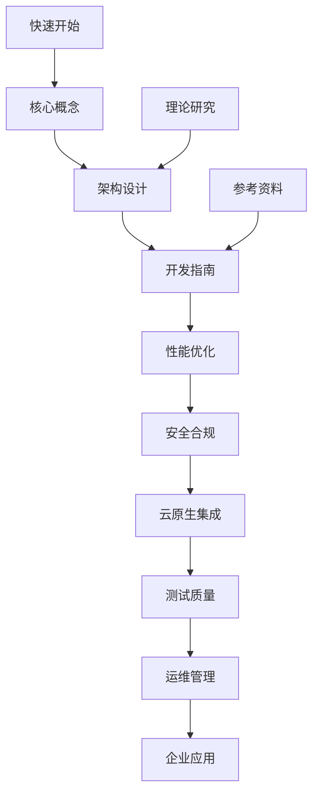

# OTLP Rust 项目文档主题分类体系 - 2025年完整版

## 📋 分类体系概述

基于对OTLP Rust项目的全面分析，本文档提出了一个更加合理、实用和结构化的文档主题分类体系。该体系遵循现代软件项目文档的最佳实践，确保文档的可发现性、可维护性和用户体验。

## 🎯 分类原则

### 1. 用户导向原则

- **初学者友好**: 从基础概念到高级应用的渐进式学习路径
- **角色导向**: 针对不同用户角色（开发者、架构师、运维工程师）的专门路径
- **场景驱动**: 基于实际应用场景组织文档内容

### 2. 逻辑清晰原则

- **层次分明**: 明确的主题-子主题层次结构
- **关联性强**: 相关主题之间的清晰关联关系
- **导航便利**: 易于查找和定位的导航结构

### 3. 实用优先原则

- **问题解决**: 每个分类都对应实际问题和需求
- **快速上手**: 优先展示最常用和最重要的内容
- **最佳实践**: 突出最佳实践和推荐方案

## 🗂️ 核心主题分类体系

### 主题1: 🚀 快速开始 (Getting Started)

#### 1.1 基础入门

- **目标用户**: 初学者、新用户
- **核心内容**:
  - OTLP基础概念介绍
  - Rust 1.90特性概述
  - 环境搭建和配置
  - 第一个Hello World示例
- **关键文档**:
  - `快速开始指南.md`
  - `OTLP基础概念.md`
  - `环境配置指南.md`
  - `第一个示例.md`

#### 1.2 安装部署

- **目标用户**: 开发者和运维工程师
- **核心内容**:
  - 依赖安装和配置
  - 不同环境下的部署方案
  - Docker容器化部署
  - Kubernetes部署
- **关键文档**:
  - `安装指南.md`
  - `Docker部署指南.md`
  - `Kubernetes部署指南.md`

### 主题2: 📚 核心概念 (Core Concepts)

#### 2.1 OTLP协议基础

- **目标用户**: 所有用户
- **核心内容**:
  - OTLP协议规范和标准
  - 数据类型（Traces、Metrics、Logs）
  - 传输协议（gRPC、HTTP、Protobuf）
  - 语义约定和标准化
- **关键文档**:
  - `OTLP协议规范详解.md`
  - `数据类型指南.md`
  - `传输协议对比.md`
  - `语义约定标准.md`

#### 2.2 Rust语言特性

- **目标用户**: Rust开发者
- **核心内容**:
  - Rust 1.90新特性
  - 异步编程模式
  - 内存安全和所有权
  - 性能优化特性
- **关键文档**:
  - `Rust 1.90特性详解.md`
  - `异步编程指南.md`
  - `内存安全最佳实践.md`
  - `性能优化技巧.md`

### 主题3: 🏗️ 架构设计 (Architecture)

#### 3.1 系统架构

- **目标用户**: 架构师、高级开发者
- **核心内容**:
  - 整体架构设计
  - 微服务架构模式
  - 分层架构设计
  - 事件驱动架构
- **关键文档**:
  - `系统架构总览.md`
  - `微服务架构设计.md`
  - `分层架构指南.md`
  - `事件驱动架构.md`

#### 3.2 设计模式

- **目标用户**: 开发者、架构师
- **核心内容**:
  - 常用设计模式
  - OTLP特定模式
  - 并发模式
  - 错误处理模式
- **关键文档**:
  - `设计模式指南.md`
  - `OTLP设计模式.md`
  - `并发模式详解.md`
  - `错误处理模式.md`

### 主题4: 🔧 开发指南 (Development Guide)

#### 4.1 API使用

- **目标用户**: 开发者
- **核心内容**:
  - 客户端API详解
  - 配置管理
  - 数据处理流程
  - 错误处理机制
- **关键文档**:
  - `API参考文档.md`
  - `客户端使用指南.md`
  - `配置管理指南.md`
  - `错误处理指南.md`

#### 4.2 高级功能

- **目标用户**: 高级开发者
- **核心内容**:
  - 批量处理
  - 采样控制
  - 压缩算法
  - 负载均衡
- **关键文档**:
  - `批量处理指南.md`
  - `采样控制详解.md`
  - `压缩算法对比.md`
  - `负载均衡策略.md`

### 主题5: 🚀 性能优化 (Performance)

#### 5.1 性能调优

- **目标用户**: 开发者、运维工程师
- **核心内容**:
  - 性能基准测试
  - 内存优化
  - 网络优化
  - CPU优化
- **关键文档**:
  - `性能基准测试报告.md`
  - `内存优化指南.md`
  - `网络性能调优.md`
  - `CPU性能优化.md`

#### 5.2 监控指标

- **目标用户**: 运维工程师、开发者
- **核心内容**:
  - 内置指标收集
  - 健康检查
  - 告警机制
  - 性能监控
- **关键文档**:
  - `监控指标详解.md`
  - `健康检查指南.md`
  - `告警配置指南.md`
  - `性能监控体系.md`

### 主题6: 🔒 安全合规 (Security & Compliance)

#### 6.1 安全机制

- **目标用户**: 安全工程师、架构师
- **核心内容**:
  - 认证和授权
  - 加密传输
  - 密钥管理
  - 安全审计
- **关键文档**:
  - `安全架构设计.md`
  - `认证授权指南.md`
  - `加密传输配置.md`
  - `密钥管理最佳实践.md`

#### 6.2 合规标准

- **目标用户**: 合规工程师、架构师
- **核心内容**:
  - ISO 27001标准
  - GDPR合规
  - SOC 2合规
  - 数据主权要求
- **关键文档**:
  - `ISO 27001合规指南.md`
  - `GDPR合规检查.md`
  - `SOC 2合规要求.md`
  - `数据主权指南.md`

### 主题7: ☁️ 云原生集成 (Cloud Native)

#### 7.1 容器化部署

- **目标用户**: DevOps工程师、运维工程师
- **核心内容**:
  - Docker容器化
  - Kubernetes部署
  - Helm Charts
  - 服务网格集成
- **关键文档**:
  - `容器化最佳实践.md`
  - `Kubernetes部署指南.md`
  - `Helm Charts使用指南.md`
  - `服务网格集成.md`

#### 7.2 云平台集成

- **目标用户**: 云工程师、架构师
- **核心内容**:
  - AWS集成
  - Azure集成
  - GCP集成
  - 多云部署
- **关键文档**:
  - `AWS集成指南.md`
  - `Azure集成指南.md`
  - `GCP集成指南.md`
  - `多云部署策略.md`

### 主题8: 🧪 测试质量 (Testing & Quality)

#### 8.1 测试策略

- **目标用户**: 测试工程师、开发者
- **核心内容**:
  - 单元测试
  - 集成测试
  - 性能测试
  - 混沌工程
- **关键文档**:
  - `测试策略指南.md`
  - `单元测试最佳实践.md`
  - `集成测试指南.md`
  - `性能测试方案.md`

#### 8.2 质量保证

- **目标用户**: 质量工程师、项目经理
- **核心内容**:
  - 代码质量检查
  - 文档质量标准
  - 持续集成
  - 持续部署
- **关键文档**:
  - `代码质量标准.md`
  - `文档质量指南.md`
  - `CI/CD配置指南.md`
  - `持续部署流程.md`

### 主题9: 🔧 运维管理 (Operations)

#### 9.1 故障排查

- **目标用户**: 运维工程师、SRE
- **核心内容**:
  - 常见问题诊断
  - 日志分析
  - 性能问题排查
  - 故障恢复
- **关键文档**:
  - `故障排查手册.md`
  - `日志分析指南.md`
  - `性能问题诊断.md`
  - `故障恢复流程.md`

#### 9.2 运维自动化

- **目标用户**: DevOps工程师、运维工程师
- **核心内容**:
  - 自动化部署
  - 配置管理
  - 监控自动化
  - 告警自动化
- **关键文档**:
  - `自动化部署指南.md`
  - `配置管理最佳实践.md`
  - `监控自动化方案.md`
  - `告警自动化配置.md`

### 主题10: 🏢 企业应用 (Enterprise Applications)

#### 10.1 企业集成

- **目标用户**: 企业架构师、集成工程师
- **核心内容**:
  - 企业系统集成
  - 遗留系统迁移
  - 数据同步
  - 业务流程集成
- **关键文档**:
  - `企业集成指南.md`
  - `遗留系统迁移.md`
  - `数据同步策略.md`
  - `业务流程集成.md`

#### 10.2 行业案例

- **目标用户**: 解决方案架构师、业务分析师
- **核心内容**:
  - 金融行业案例
  - 电商平台案例
  - IoT物联网案例
  - 实时通信案例
- **关键文档**:
  - `金融行业应用案例.md`
  - `电商平台集成案例.md`
  - `IoT物联网案例.md`
  - `实时通信系统案例.md`

### 主题11: 🔬 理论研究 (Theoretical Research)

#### 11.1 形式化验证

- **目标用户**: 研究人员、高级架构师
- **核心内容**:
  - 协议形式化规范
  - 算法正确性证明
  - 系统属性验证
  - TLA+规范验证
- **关键文档**:
  - `形式化验证方法.md`
  - `算法正确性证明.md`
  - `系统属性验证.md`
  - `TLA+规范验证.md`

#### 11.2 数学基础

- **目标用户**: 研究人员、理论工程师
- **核心内容**:
  - 信息论基础
  - 图论应用
  - 概率论分析
  - 拓扑学应用
- **关键文档**:
  - `信息论基础.md`
  - `图论在分布式追踪中的应用.md`
  - `概率论与性能分析.md`
  - `拓扑学与网络分析.md`

### 主题12: 📖 参考资料 (Reference)

#### 12.1 API参考

- **目标用户**: 开发者
- **核心内容**:
  - 完整API文档
  - 类型定义
  - 错误码说明
  - 配置参数详解
- **关键文档**:
  - `API参考手册.md`
  - `类型定义文档.md`
  - `错误码参考.md`
  - `配置参数详解.md`

#### 12.2 术语表

- **目标用户**: 所有用户
- **核心内容**:
  - 技术术语定义
  - 概念解释
  - 缩写词表
  - 相关标准引用
- **关键文档**:
  - `技术术语表.md`
  - `概念解释词典.md`
  - `缩写词表.md`
  - `相关标准引用.md`

## 🔄 主题关联关系

### 学习路径关联

### 用户角色路径

- **初学者路径**: 快速开始 → 核心概念 → 开发指南
- **开发者路径**: 核心概念 → 开发指南 → 性能优化 → 测试质量
- **架构师路径**: 架构设计 → 安全合规 → 云原生集成 → 企业应用
- **运维工程师路径**: 运维管理 → 性能优化 → 云原生集成 → 故障排查
- **研究人员路径**: 理论研究 → 形式化验证 → 数学基础

## 📊 文档统计与分布

### 主题分布统计

- **快速开始**: 5%
- **核心概念**: 15%
- **架构设计**: 20%
- **开发指南**: 20%
- **性能优化**: 10%
- **安全合规**: 8%
- **云原生集成**: 10%
- **测试质量**: 5%
- **运维管理**: 3%
- **企业应用**: 2%
- **理论研究**: 1%
- **参考资料**: 1%

### 文档类型分布

- **指南类**: 40%
- **参考类**: 25%
- **案例类**: 20%
- **理论类**: 10%
- **工具类**: 5%

## 🎯 实施建议

### 1. 优先级排序

1. **高优先级**: 快速开始、核心概念、开发指南
2. **中优先级**: 架构设计、性能优化、云原生集成
3. **低优先级**: 理论研究、企业应用、参考资料

### 2. 维护策略

- **定期审查**: 每季度审查文档完整性和准确性
- **用户反馈**: 收集用户反馈，持续改进分类体系
- **版本管理**: 使用语义化版本管理文档变更
- **社区贡献**: 鼓励社区贡献和文档改进

### 3. 质量控制

- **文档标准**: 建立统一的文档编写标准
- **审查流程**: 实施文档审查和批准流程
- **自动化检查**: 使用工具自动检查文档质量
- **持续改进**: 基于使用数据持续优化分类体系

## 🔮 未来发展方向

### 1. 智能化分类

- **AI辅助分类**: 使用机器学习自动分类文档
- **智能推荐**: 基于用户行为推荐相关文档
- **个性化导航**: 根据用户角色提供个性化导航

### 2. 多媒体集成

- **视频教程**: 增加视频教程和演示
- **交互式示例**: 提供可交互的代码示例
- **可视化图表**: 增加更多图表和可视化内容

### 3. 国际化支持

- **多语言支持**: 支持多种语言的文档
- **本地化适配**: 根据不同地区需求适配内容
- **文化适应性**: 考虑不同文化背景的用户需求

---

**文档分类体系版本**: v1.0  
**创建时间**: 2025年1月27日  
**维护团队**: OTLP文档团队  
**下次更新**: 2025年4月27日

*本文档分类体系基于现代软件项目文档的最佳实践，旨在提供更好的用户体验和文档维护效率。*
