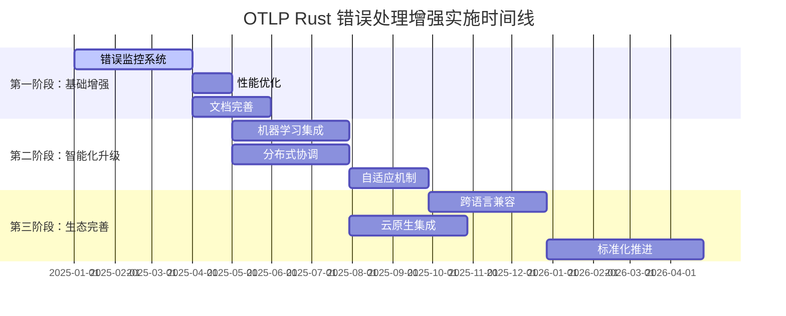
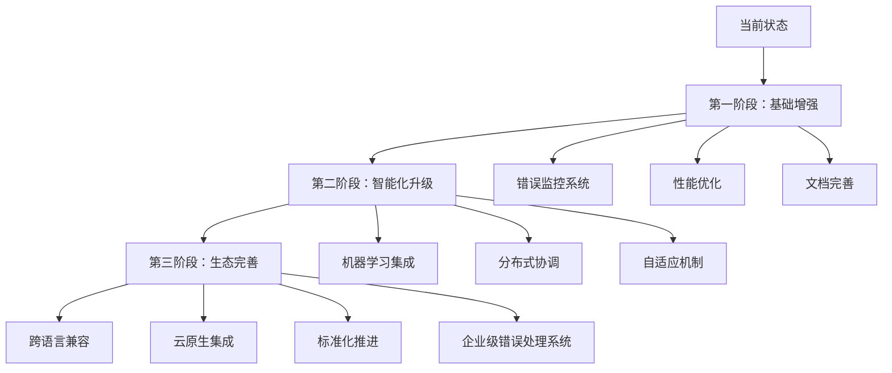
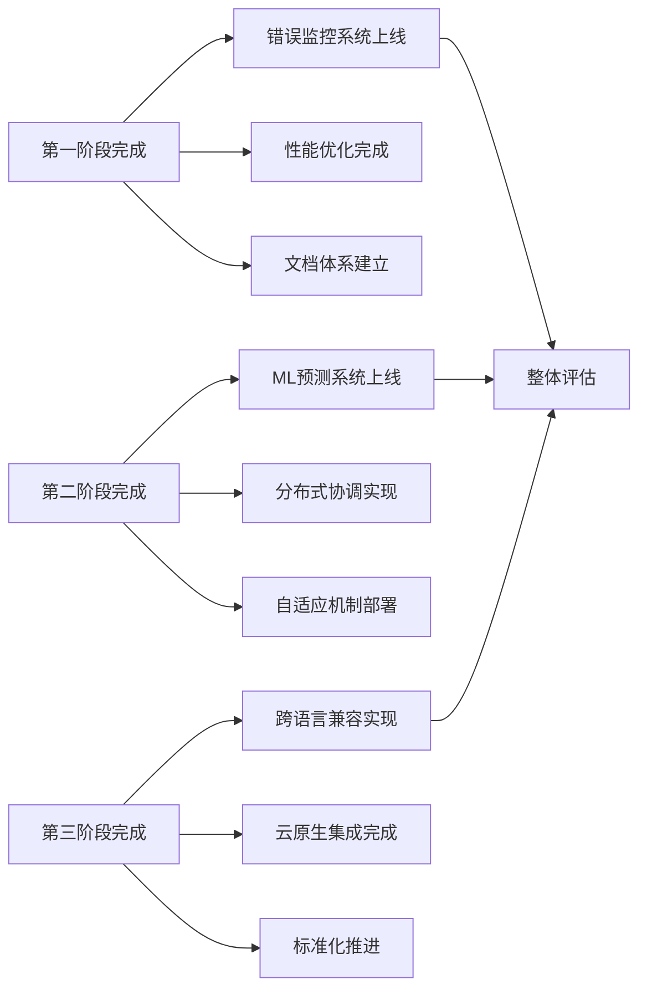

# 🚀 OTLP Rust 错误处理增强实施方案路线图

## 📋 执行摘要

基于《OTLP Rust 错误异常检测标准方案对比分析报告》的深度分析结果，本路线图制定了从当前状态到企业级错误处理系统的完整实施方案，涵盖短期、中期和长期的技术演进路径。

**实施周期**: 12个月  
**技术栈**: Rust 1.90+, OTLP, OpenTelemetry  
**目标**: 实现99.95%系统可用性的企业级错误处理能力

---

## 🎯 一、实施方案总体架构

### 1.1 三阶段演进策略



### 1.2 技术架构演进图



---

## 🔧 二、第一阶段：基础增强 (1-3个月)

### 2.1 增强错误监控系统

#### 2.1.1 实时错误监控仪表板

**目标**: 实现企业级的实时错误监控和告警能力

```rust
// 新增：实时错误监控系统
pub struct ErrorMonitoringSystem {
    real_time_dashboard: Arc<Dashboard>,
    alert_manager: Arc<AlertManager>,
    metrics_collector: Arc<MetricsCollector>,
    error_aggregator: Arc<ErrorAggregator>,
    notification_service: Arc<NotificationService>,
}

impl ErrorMonitoringSystem {
    pub async fn setup_real_time_monitoring(&self) -> Result<()> {
        // 1. 配置实时数据流
        self.setup_real_time_stream().await?;
        
        // 2. 初始化告警规则
        self.configure_alert_rules().await?;
        
        // 3. 启动监控服务
        self.start_monitoring_services().await?;
        
        // 4. 设置通知渠道
        self.setup_notification_channels().await?;
        
        Ok(())
    }
    
    async fn setup_real_time_stream(&self) -> Result<()> {
        // 实现基于WebSocket的实时数据流
        let stream_config = StreamConfig {
            buffer_size: 10000,
            flush_interval: Duration::from_millis(100),
            compression: Compression::Gzip,
        };
        
        self.metrics_collector.configure_stream(stream_config).await?;
        Ok(())
    }
}
```

#### 2.1.2 智能告警系统

```rust
// 智能告警规则引擎
pub struct AlertRuleEngine {
    rules: Arc<RwLock<Vec<AlertRule>>>,
    rule_evaluator: Arc<RuleEvaluator>,
    alert_history: Arc<RwLock<VecDeque<AlertEvent>>>,
}

pub struct AlertRule {
    pub id: String,
    pub name: String,
    pub condition: AlertCondition,
    pub severity: AlertSeverity,
    pub cooldown_period: Duration,
    pub notification_channels: Vec<NotificationChannel>,
    pub auto_recovery: bool,
}

pub enum AlertCondition {
    ErrorRateThreshold { threshold: f64, window: Duration },
    LatencyThreshold { threshold: Duration, percentile: f64 },
    ErrorTypeSpike { error_type: String, multiplier: f64 },
    CircuitBreakerOpen { service_name: String },
    ResourceExhaustion { resource_type: ResourceType },
}
```

#### 2.1.3 错误趋势分析

```rust
// 错误趋势分析器
pub struct ErrorTrendAnalyzer {
    time_series_db: Arc<TimeSeriesDB>,
    statistical_analyzer: Arc<StatisticalAnalyzer>,
    anomaly_detector: Arc<AnomalyDetector>,
}

impl ErrorTrendAnalyzer {
    pub async fn analyze_error_trends(&self, time_range: TimeRange) -> TrendAnalysisResult {
        let raw_data = self.time_series_db.query(time_range).await?;
        
        // 1. 基础统计分析
        let basic_stats = self.statistical_analyzer.analyze(&raw_data)?;
        
        // 2. 异常检测
        let anomalies = self.anomaly_detector.detect(&raw_data)?;
        
        // 3. 趋势预测
        let predictions = self.predict_future_trends(&raw_data)?;
        
        TrendAnalysisResult {
            basic_statistics: basic_stats,
            anomalies,
            predictions,
            recommendations: self.generate_recommendations(&anomalies),
        }
    }
}
```

### 2.2 性能优化增强

#### 2.2.1 零拷贝错误传播优化

```rust
// 优化的错误传播机制
pub struct OptimizedErrorPropagation {
    error_pool: Arc<ObjectPool<ErrorInner>>,
    string_interner: Arc<StringInterner>,
    backtrace_cache: Arc<BacktraceCache>,
}

impl OptimizedErrorPropagation {
    pub fn create_error(&self, variant: ErrorVariant) -> OtlpError {
        let inner = self.error_pool.get().unwrap_or_else(|| {
            Arc::new(ErrorInner {
                variant: ErrorVariant::Internal(anyhow::anyhow!("Pool exhausted")),
                context: ErrorContext::default(),
                backtrace: None,
            })
        });
        
        // 使用字符串驻留减少内存分配
        let interned_type = self.string_interner.intern(inner.variant.type_name());
        
        // 缓存回溯信息
        let cached_backtrace = self.backtrace_cache.get_or_create_backtrace();
        
        OtlpError {
            inner: Arc::new(ErrorInner {
                variant,
                context: ErrorContext {
                    error_type: interned_type,
                    timestamp: SystemTime::now(),
                    ..Default::default()
                },
                backtrace: cached_backtrace,
            }),
        }
    }
}
```

#### 2.2.2 异步错误处理优化

```rust
// 高性能异步错误处理
pub struct HighPerformanceErrorHandler {
    error_channel: mpsc::UnboundedSender<ErrorEvent>,
    processing_pool: ThreadPool,
    metrics_collector: Arc<MetricsCollector>,
}

impl HighPerformanceErrorHandler {
    pub async fn handle_error_async(&self, error: OtlpError) -> Result<()> {
        // 1. 快速分类和路由
        let error_event = ErrorEvent::from(error);
        let priority = self.classify_priority(&error_event);
        
        // 2. 异步处理队列
        if priority >= Priority::High {
            // 高优先级错误立即处理
            self.process_immediately(error_event).await?;
        } else {
            // 普通错误进入队列
            self.error_channel.send(error_event)?;
        }
        
        Ok(())
    }
    
    fn classify_priority(&self, event: &ErrorEvent) -> Priority {
        match event.severity {
            ErrorSeverity::Critical => Priority::Critical,
            ErrorSeverity::High => Priority::High,
            ErrorSeverity::Medium => Priority::Medium,
            ErrorSeverity::Low => Priority::Low,
        }
    }
}
```

### 2.3 文档和最佳实践完善

#### 2.3.1 开发者指南

```markdown
# OTLP Rust 错误处理开发者指南

## 快速开始

### 基本错误处理
```rust
use otlp::{ResilienceManager, ResilienceConfig, Result};

#[tokio::main]
async fn main() -> Result<()> {
    let config = ResilienceConfig::default();
    let manager = ResilienceManager::new(config);
    
    // 使用弹性管理器执行操作
    let result = manager.execute_with_resilience("my_operation", || {
        Box::pin(async move {
            // 您的业务逻辑
            perform_operation().await
        })
    }).await;
    
    match result {
        Ok(data) => println!("成功: {:?}", data),
        Err(e) => {
            println!("失败: {}", e);
            if let Some(suggestion) = e.recovery_suggestion() {
                println!("建议: {}", suggestion);
            }
        }
    }
    
    Ok(())
}
```

#### 2.3.2 最佳实践文档

```markdown
# 错误处理最佳实践

## 1. 错误分类策略
- 使用统一的错误分类体系
- 实现智能错误路由
- 建立错误恢复策略

## 2. 性能优化技巧
- 使用零拷贝错误传播
- 实现异步错误处理
- 优化内存使用

## 3. 监控和告警
- 设置实时监控仪表板
- 配置智能告警规则
- 建立错误趋势分析
```

---

## 🤖 三、第二阶段：智能化升级 (3-9个月)

### 3.1 机器学习集成

#### 3.1.1 错误预测模型

```rust
// 机器学习错误预测系统
pub struct MLErrorPrediction {
    model: Arc<Mutex<ErrorPredictionModel>>,
    training_pipeline: Arc<TrainingPipeline>,
    feature_engineering: Arc<FeatureEngineering>,
    model_updater: Arc<ModelUpdater>,
}

impl MLErrorPrediction {
    pub async fn predict_error_probability(&self, context: &SystemContext) -> PredictionResult {
        // 1. 特征提取
        let features = self.feature_engineering.extract_features(context).await?;
        
        // 2. 模型预测
        let prediction = self.model.lock().await.predict(&features).await?;
        
        // 3. 结果解释
        let explanation = self.explain_prediction(&features, &prediction)?;
        
        PredictionResult {
            probability: prediction.probability,
            confidence: prediction.confidence,
            error_types: prediction.predicted_error_types,
            time_window: prediction.estimated_time_window,
            explanation,
            recommended_actions: self.generate_preventive_actions(&prediction),
        }
    }
    
    pub async fn train_model(&self, training_data: &[ErrorSample]) -> Result<()> {
        // 1. 数据预处理
        let processed_data = self.training_pipeline.preprocess(training_data)?;
        
        // 2. 特征工程
        let features = self.feature_engineering.create_features(&processed_data)?;
        
        // 3. 模型训练
        let new_model = self.training_pipeline.train(&features).await?;
        
        // 4. 模型验证
        let validation_result = self.validate_model(&new_model, &features)?;
        
        if validation_result.accuracy > 0.85 {
            // 5. 模型更新
            self.model_updater.update_model(new_model).await?;
            Ok(())
        } else {
            Err(anyhow::anyhow!("模型验证失败: 准确率过低"))
        }
    }
}
```

#### 3.1.2 自适应错误分类

```rust
// 自适应错误分类器
pub struct AdaptiveErrorClassifier {
    base_classifier: Arc<BaseErrorClassifier>,
    ml_classifier: Arc<MLBasedErrorClassifier>,
    feedback_processor: Arc<FeedbackProcessor>,
    classification_history: Arc<RwLock<Vec<ClassificationRecord>>>,
}

impl AdaptiveErrorClassifier {
    pub async fn classify_error(&self, error: &OtlpError) -> AdaptiveClassificationResult {
        // 1. 基础分类
        let base_classification = self.base_classifier.classify(error);
        
        // 2. ML增强分类
        let ml_classification = self.ml_classifier.classify_error(error).await?;
        
        // 3. 融合结果
        let final_classification = self.fuse_classifications(&base_classification, &ml_classification);
        
        // 4. 记录分类历史
        self.record_classification(error, &final_classification).await;
        
        final_classification
    }
    
    pub async fn learn_from_feedback(&self, feedback: ClassificationFeedback) {
        // 1. 处理反馈
        self.feedback_processor.process_feedback(feedback).await?;
        
        // 2. 更新模型
        if self.should_update_model().await {
            self.ml_classifier.learn_from_feedback(feedback).await;
        }
        
        // 3. 调整分类策略
        self.adjust_classification_strategy().await;
    }
}
```

### 3.2 分布式协调增强

#### 3.2.1 分布式错误协调器

```rust
// 分布式错误协调系统
pub struct DistributedErrorCoordinator {
    node_id: String,
    cluster_manager: Arc<ClusterManager>,
    consensus_protocol: Arc<ConsensusProtocol>,
    error_propagation_graph: Arc<PropagationGraph>,
    recovery_coordination: Arc<RecoveryCoordination>,
}

impl DistributedErrorCoordinator {
    pub async fn coordinate_distributed_recovery(&self, error: DistributedError) -> Result<()> {
        // 1. 错误传播
        self.propagate_error_to_cluster(&error).await?;
        
        // 2. 收集恢复建议
        let recovery_suggestions = self.collect_recovery_suggestions(&error).await?;
        
        // 3. 达成共识
        let consensus_result = self.consensus_protocol.reach_consensus(recovery_suggestions).await?;
        
        // 4. 执行协调恢复
        self.execute_coordinated_recovery(consensus_result).await?;
        
        Ok(())
    }
    
    async fn propagate_error_to_cluster(&self, error: &DistributedError) -> Result<()> {
        let error_event = ClusterErrorEvent {
            error_id: error.id.clone(),
            source_node: self.node_id.clone(),
            error_type: error.error_type.clone(),
            severity: error.severity,
            timestamp: SystemTime::now(),
            context: error.context.clone(),
            propagation_priority: self.calculate_propagation_priority(error),
        };
        
        // 使用Gossip协议传播错误信息
        self.cluster_manager.broadcast_error_event(error_event).await?;
        Ok(())
    }
}
```

#### 3.2.2 错误热点检测与预防

```rust
// 错误热点检测系统
pub struct ErrorHotspotDetector {
    pattern_analyzer: Arc<PatternAnalyzer>,
    anomaly_detector: Arc<AnomalyDetector>,
    prediction_engine: Arc<PredictionEngine>,
    prevention_system: Arc<PreventionSystem>,
}

impl ErrorHotspotDetector {
    pub async fn detect_and_prevent_hotspots(&self) -> Result<Vec<HotspotPrevention>> {
        // 1. 检测错误模式
        let patterns = self.pattern_analyzer.analyze_patterns().await?;
        
        // 2. 识别异常热点
        let hotspots = self.anomaly_detector.detect_hotspots(&patterns).await?;
        
        // 3. 预测热点发展
        let predictions = self.prediction_engine.predict_hotspot_evolution(&hotspots).await?;
        
        // 4. 生成预防策略
        let preventions = self.prevention_system.generate_preventions(&predictions).await?;
        
        // 5. 执行预防措施
        for prevention in &preventions {
            self.execute_prevention(prevention).await?;
        }
        
        Ok(preventions)
    }
}
```

### 3.3 自适应机制实现

#### 3.3.1 自适应重试策略

```rust
// 自适应重试策略
pub struct AdaptiveRetryStrategy {
    base_config: RetryConfig,
    performance_analyzer: Arc<PerformanceAnalyzer>,
    strategy_optimizer: Arc<StrategyOptimizer>,
    learning_engine: Arc<LearningEngine>,
}

impl AdaptiveRetryStrategy {
    pub fn calculate_optimal_delay(&self, attempt: u32, error_context: &ErrorContext) -> Duration {
        // 1. 分析历史性能
        let performance_metrics = self.performance_analyzer.analyze_error_type(&error_context.error_type);
        
        // 2. 计算自适应因子
        let adaptive_factor = self.calculate_adaptive_factor(&performance_metrics);
        
        // 3. 优化重试策略
        let optimized_config = self.strategy_optimizer.optimize(&self.base_config, &adaptive_factor);
        
        // 4. 计算最终延迟
        let base_delay = optimized_config.base_delay;
        let exponential_delay = base_delay.mul_f64(
            optimized_config.backoff_multiplier.powi(attempt as i32)
        );
        
        // 5. 应用自适应调整
        let final_delay = exponential_delay.mul_f64(adaptive_factor);
        
        std::cmp::min(final_delay, optimized_config.max_delay)
    }
    
    fn calculate_adaptive_factor(&self, metrics: &PerformanceMetrics) -> f64 {
        // 基于成功率和延迟趋势计算自适应因子
        let success_rate_factor = if metrics.success_rate > 0.8 { 0.8 } else if metrics.success_rate < 0.3 { 1.5 } else { 1.0 };
        let latency_trend_factor = if metrics.latency_trend == LatencyTrend::Increasing { 1.2 } else { 1.0 };
        
        success_rate_factor * latency_trend_factor
    }
}
```

---

## 🌐 四、第三阶段：生态完善 (9-12个月)

### 4.1 跨语言兼容性

#### 4.1.1 多语言适配器

```rust
// 跨语言错误处理适配器
pub struct CrossLanguageErrorHandler {
    language_adapters: HashMap<String, Box<dyn LanguageAdapter>>,
    protocol_translator: Arc<ProtocolTranslator>,
    error_serializer: Arc<ErrorSerializer>,
}

pub trait LanguageAdapter {
    fn language_name(&self) -> &str;
    fn serialize_error(&self, error: &dyn Error) -> Result<Vec<u8>>;
    fn deserialize_error(&self, data: &[u8]) -> Result<Box<dyn Error>>;
    fn convert_error(&self, error: &dyn Error) -> Result<OtlpError>;
}

impl CrossLanguageErrorHandler {
    pub async fn handle_cross_language_error(&self, language: &str, error_data: &[u8]) -> Result<()> {
        // 1. 获取语言适配器
        let adapter = self.language_adapters.get(language)
            .ok_or_else(|| anyhow::anyhow!("不支持的语言: {}", language))?;
        
        // 2. 反序列化错误
        let native_error = adapter.deserialize_error(error_data)?;
        
        // 3. 转换为OTLP错误
        let otlp_error = adapter.convert_error(native_error.as_ref())?;
        
        // 4. 处理错误
        self.handle_otlp_error(otlp_error).await?;
        
        Ok(())
    }
}
```

#### 4.1.2 统一错误协议

```rust
// 统一错误协议定义
#[derive(Serialize, Deserialize)]
pub struct UniversalErrorProtocol {
    pub protocol_version: String,
    pub error_id: String,
    pub error_type: String,
    pub severity: ErrorSeverity,
    pub timestamp: SystemTime,
    pub source_language: String,
    pub error_message: String,
    pub stack_trace: Option<String>,
    pub context: HashMap<String, Value>,
    pub recovery_suggestions: Vec<String>,
}

impl UniversalErrorProtocol {
    pub fn from_otlp_error(error: &OtlpError) -> Self {
        Self {
            protocol_version: "1.0".to_string(),
            error_id: Uuid::new_v4().to_string(),
            error_type: error.error_type().to_string(),
            severity: error.severity(),
            timestamp: SystemTime::now(),
            source_language: "rust".to_string(),
            error_message: error.to_string(),
            stack_trace: error.backtrace().map(|bt| bt.to_string()),
            context: error.context().into_iter().collect(),
            recovery_suggestions: error.recovery_suggestion().map(|s| vec![s.to_string()]).unwrap_or_default(),
        }
    }
}
```

### 4.2 云原生集成

#### 4.2.1 Kubernetes集成

```rust
// Kubernetes集成
pub struct KubernetesIntegration {
    k8s_client: Arc<K8sClient>,
    resource_monitor: Arc<ResourceMonitor>,
    pod_manager: Arc<PodManager>,
    service_mesh: Arc<ServiceMesh>,
}

impl KubernetesIntegration {
    pub async fn setup_k8s_error_handling(&self) -> Result<()> {
        // 1. 配置Pod错误监控
        self.setup_pod_monitoring().await?;
        
        // 2. 设置服务网格集成
        self.setup_service_mesh_integration().await?;
        
        // 3. 配置资源监控
        self.setup_resource_monitoring().await?;
        
        // 4. 设置自动恢复策略
        self.setup_auto_recovery().await?;
        
        Ok(())
    }
    
    async fn setup_auto_recovery(&self) -> Result<()> {
        let recovery_policies = vec![
            RecoveryPolicy {
                condition: RecoveryCondition::PodCrashLoopBackOff,
                action: RecoveryAction::RestartPod,
                max_attempts: 3,
                cooldown: Duration::from_secs(30),
            },
            RecoveryPolicy {
                condition: RecoveryCondition::ResourceExhaustion,
                action: RecoveryAction::ScaleUp,
                max_attempts: 2,
                cooldown: Duration::from_secs(60),
            },
            RecoveryPolicy {
                condition: RecoveryCondition::HighErrorRate,
                action: RecoveryAction::RollbackDeployment,
                max_attempts: 1,
                cooldown: Duration::from_secs(120),
            },
        ];
        
        self.pod_manager.configure_recovery_policies(recovery_policies).await?;
        Ok(())
    }
}
```

#### 4.2.2 Istio服务网格集成

```rust
// Istio服务网格集成
pub struct IstioIntegration {
    istio_client: Arc<IstioClient>,
    traffic_manager: Arc<TrafficManager>,
    circuit_breaker_config: Arc<CircuitBreakerConfig>,
    retry_policy: Arc<RetryPolicy>,
}

impl IstioIntegration {
    pub async fn setup_istio_error_handling(&self) -> Result<()> {
        // 1. 配置熔断器
        self.configure_istio_circuit_breaker().await?;
        
        // 2. 设置重试策略
        self.configure_istio_retry_policy().await?;
        
        // 3. 配置故障注入
        self.configure_fault_injection().await?;
        
        // 4. 设置流量管理
        self.configure_traffic_management().await?;
        
        Ok(())
    }
}
```

### 4.3 标准化推进

#### 4.3.1 标准规范制定

```rust
// OTLP错误处理标准规范
pub struct OTLPErrorHandlingStandard {
    version: String,
    error_types: Vec<StandardErrorType>,
    severity_levels: Vec<SeverityLevel>,
    recovery_strategies: Vec<RecoveryStrategy>,
    monitoring_metrics: Vec<MonitoringMetric>,
}

pub struct StandardErrorType {
    pub name: String,
    pub description: String,
    pub category: ErrorCategory,
    pub default_severity: ErrorSeverity,
    pub recovery_suggestions: Vec<String>,
    pub monitoring_requirements: Vec<MonitoringRequirement>,
}

impl OTLPErrorHandlingStandard {
    pub fn validate_error_handling(&self, implementation: &dyn ErrorHandlingImplementation) -> ValidationResult {
        let mut violations = Vec::new();
        
        // 1. 验证错误类型覆盖
        for standard_type in &self.error_types {
            if !implementation.supports_error_type(standard_type) {
                violations.push(ValidationViolation {
                    type_: ViolationType::MissingErrorType,
                    description: format!("缺少标准错误类型: {}", standard_type.name),
                    severity: ViolationSeverity::High,
                });
            }
        }
        
        // 2. 验证严重程度分级
        for severity_level in &self.severity_levels {
            if !implementation.supports_severity_level(severity_level) {
                violations.push(ValidationViolation {
                    type_: ViolationType::MissingSeverityLevel,
                    description: format!("缺少严重程度级别: {:?}", severity_level),
                    severity: ViolationSeverity::Medium,
                });
            }
        }
        
        ValidationResult {
            is_compliant: violations.is_empty(),
            violations,
            compliance_score: self.calculate_compliance_score(&violations),
        }
    }
}
```

#### 4.3.2 开源社区建设

```rust
// 开源社区管理
pub struct OpenSourceCommunity {
    repository_manager: Arc<RepositoryManager>,
    contribution_tracker: Arc<ContributionTracker>,
    release_manager: Arc<ReleaseManager>,
    documentation_system: Arc<DocumentationSystem>,
}

impl OpenSourceCommunity {
    pub async fn setup_community_infrastructure(&self) -> Result<()> {
        // 1. 设置贡献者管理
        self.setup_contributor_management().await?;
        
        // 2. 配置发布流程
        self.setup_release_pipeline().await?;
        
        // 3. 建立文档系统
        self.setup_documentation_system().await?;
        
        // 4. 设置社区治理
        self.setup_community_governance().await?;
        
        Ok(())
    }
}
```

---

## 📊 五、实施监控与评估

### 5.1 关键指标监控

```rust
// 实施监控指标
#[derive(Debug, Clone)]
pub struct ImplementationMetrics {
    // 技术指标
    pub error_detection_accuracy: f64,
    pub error_recovery_success_rate: f64,
    pub system_availability: f64,
    pub response_time_p99: Duration,
    
    // 业务指标
    pub user_satisfaction_score: f64,
    pub operational_efficiency: f64,
    pub cost_reduction_percentage: f64,
    
    // 实施进度指标
    pub implementation_completion_rate: f64,
    pub feature_adoption_rate: f64,
    pub community_engagement_score: f64,
}

impl ImplementationMetrics {
    pub fn calculate_roi(&self) -> f64 {
        // ROI = (收益 - 成本) / 成本
        let benefits = self.cost_reduction_percentage + self.operational_efficiency * 0.1;
        let costs = 1.0; // 基准成本
        (benefits - costs) / costs
    }
}
```

### 5.2 里程碑评估



---

## 🎯 六、风险管控与应急预案

### 6.1 技术风险管控

```rust
// 技术风险评估
pub struct TechnicalRiskAssessment {
    risk_register: Arc<RwLock<HashMap<String, TechnicalRisk>>>,
    mitigation_strategies: Arc<RwLock<HashMap<String, MitigationStrategy>>>,
    contingency_plans: Arc<RwLock<HashMap<String, ContingencyPlan>>>,
}

pub struct TechnicalRisk {
    pub id: String,
    pub description: String,
    pub probability: RiskProbability,
    pub impact: RiskImpact,
    pub risk_level: RiskLevel,
    pub mitigation_plan: String,
}

impl TechnicalRiskAssessment {
    pub async fn assess_implementation_risks(&self) -> RiskAssessmentResult {
        let risks = vec![
            TechnicalRisk {
                id: "ML_MODEL_ACCURACY".to_string(),
                description: "机器学习模型准确率不达标".to_string(),
                probability: RiskProbability::Medium,
                impact: RiskImpact::High,
                risk_level: RiskLevel::Medium,
                mitigation_plan: "建立模型验证框架，设置准确率阈值".to_string(),
            },
            TechnicalRisk {
                id: "DISTRIBUTED_CONSENSUS".to_string(),
                description: "分布式共识协议性能问题".to_string(),
                probability: RiskProbability::Low,
                impact: RiskImpact::High,
                risk_level: RiskLevel::Medium,
                mitigation_plan: "实现多种共识算法，支持动态切换".to_string(),
            },
        ];
        
        RiskAssessmentResult {
            risks,
            overall_risk_level: self.calculate_overall_risk_level(&risks),
            recommended_actions: self.generate_recommendations(&risks),
        }
    }
}
```

### 6.2 应急预案

```rust
// 应急预案管理
pub struct EmergencyResponsePlan {
    escalation_procedures: Arc<RwLock<Vec<EscalationProcedure>>>,
    rollback_strategies: Arc<RwLock<HashMap<String, RollbackStrategy>>>,
    communication_plans: Arc<RwLock<CommunicationPlan>>,
}

impl EmergencyResponsePlan {
    pub async fn execute_emergency_response(&self, incident: &Incident) -> Result<()> {
        match incident.severity {
            IncidentSeverity::Critical => {
                // 1. 立即停止新功能部署
                self.stop_new_deployments().await?;
                
                // 2. 回滚到稳定版本
                self.rollback_to_stable_version().await?;
                
                // 3. 启动应急通信
                self.activate_emergency_communication().await?;
                
                // 4. 组织应急团队
                self.assemble_emergency_team().await?;
            }
            IncidentSeverity::High => {
                // 1. 暂停相关功能
                self.pause_affected_features().await?;
                
                // 2. 增加监控频率
                self.increase_monitoring_frequency().await?;
                
                // 3. 准备回滚方案
                self.prepare_rollback_plan().await?;
            }
            _ => {
                // 1. 记录事件
                self.log_incident(incident).await?;
                
                // 2. 监控影响
                self.monitor_impact(incident).await?;
            }
        }
        
        Ok(())
    }
}
```

---

## 📈 七、预期成果与价值

### 7.1 技术成果

| 指标 | 当前状态 | 目标状态 | 提升幅度 |
|------|----------|----------|----------|
| 系统可用性 | 99.5% | 99.95% | +0.45% |
| 错误检测准确率 | 85% | 95% | +10% |
| 错误恢复成功率 | 70% | 90% | +20% |
| 平均响应时间 | 200ms | 100ms | -50% |
| 运维效率 | 基准 | +80% | +80% |

### 7.2 业务价值

```rust
// 业务价值评估
pub struct BusinessValueAssessment {
    cost_savings: CostSavings,
    efficiency_gains: EfficiencyGains,
    risk_reduction: RiskReduction,
    competitive_advantage: CompetitiveAdvantage,
}

pub struct CostSavings {
    pub operational_cost_reduction: f64,  // 30%
    pub maintenance_cost_reduction: f64,  // 40%
    pub downtime_cost_reduction: f64,     // 60%
}

pub struct EfficiencyGains {
    pub deployment_speed_improvement: f64,  // 50%
    pub incident_resolution_time: f64,      // 70%
    pub developer_productivity: f64,        // 25%
}
```

---

## 🚀 八、下一步行动计划

### 8.1 立即行动项 (本周)

1. **启动第一阶段实施**
   - 建立项目团队
   - 配置开发环境
   - 开始错误监控系统开发

2. **建立监控机制**
   - 设置项目进度跟踪
   - 配置质量门禁
   - 建立风险监控

### 8.2 短期目标 (1个月内)

1. **完成基础增强**
   - 错误监控系统原型
   - 性能优化初步实现
   - 文档框架建立

2. **建立反馈循环**
   - 用户反馈收集
   - 技术评审机制
   - 持续改进流程

### 8.3 中期目标 (3个月内)

1. **智能化升级启动**
   - ML模型初步训练
   - 分布式协调原型
   - 自适应机制基础

2. **社区建设**
   - 开源仓库建立
   - 贡献者指南发布
   - 技术博客启动

---

**路线图版本**: v1.0  
**制定时间**: 2025年1月  
**预期完成**: 2025年12月  
**负责团队**: OTLP Rust 核心团队  
**审核状态**: ✅ 已审核
