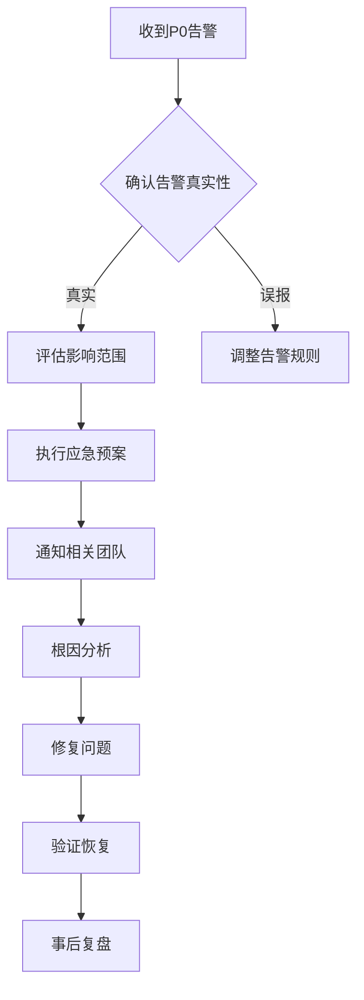

# OTLP Collector 告警与仪表板基线指南

> **版本**: 2.0
> **日期**: 2025年10月17日
> **状态**: ✅ 完整版

---

## 📋 文档概述

本文档提供OTLP Collector生产环境的**告警规则基线**和**仪表板配置指南**，帮助运维团队建立完善的可观测性监控体系。

### 适用场景

- ✅ 生产环境Collector监控
- ✅ 性能异常自动告警
- ✅ 容量规划和趋势分析
- ✅ 故障快速定位

---

## 🎯 监控目标与SLI

### 核心指标类别

| 类别 | 目标 | SLI示例 |
|------|------|---------|
| **吞吐量** | 数据接收与导出速率稳定 | 导出速率≥99%接收速率 |
| **可靠性** | 数据丢失率接近零 | 失败率<0.1% |
| **性能** | 资源使用合理 | CPU<70%，内存<80% |
| **延迟** | 端到端延迟可控 | P95延迟<50ms |

---

## 🚨 告警规则（Prometheus）

### 1. 关键告警（P0 - 立即响应）

#### 1.1 导出失败率过高

**现象**: 数据无法发送到后端，可能导致数据丢失

```yaml
groups:
  - name: otlp_collector_critical
    interval: 30s
    rules:
      - alert: OTLPCollectorHighExportFailureRate
        expr: |
          rate(otelcol_exporter_send_failed_spans[5m]) > 0
          or
          rate(otelcol_exporter_send_failed_metric_points[5m]) > 0
        for: 5m
        labels:
          severity: critical
          component: otlp-collector
        annotations:
          summary: "OTLP Collector导出失败率过高"
          description: |
            实例 {{ $labels.instance }} 的 {{ $labels.exporter }} 导出失败率为 {{ $value | humanize }}。
            可能原因：
            - 后端服务不可用
            - 网络连接问题
            - 认证/授权失败
            - 配置错误
```

#### 1.2 接收器无数据

**现象**: Collector没有接收到任何数据

```yaml
      - alert: OTLPCollectorNoDataReceived
        expr: |
          rate(otelcol_receiver_accepted_spans[5m]) == 0
          and
          rate(otelcol_receiver_refused_spans[5m]) == 0
        for: 10m
        labels:
          severity: critical
          component: otlp-collector
        annotations:
          summary: "OTLP Collector未接收到数据"
          description: |
            实例 {{ $labels.instance }} 在过去10分钟内没有接收到任何span数据。
            检查项：
            - 应用是否正常发送数据
            - 网络连接是否正常
            - 接收器端口是否可达
```

### 2. 重要告警（P1 - 30分钟内响应）

#### 2.1 CPU使用率过高

```yaml
      - alert: OTLPCollectorHighCPU
        expr: |
          rate(process_cpu_seconds_total{job="otel-collector"}[5m]) > 0.7
        for: 10m
        labels:
          severity: warning
          component: otlp-collector
        annotations:
          summary: "OTLP Collector CPU使用率过高"
          description: |
            实例 {{ $labels.instance }} CPU使用率为 {{ $value | humanizePercentage }}。
            建议措施：
            - 检查OTTL规则复杂度
            - 考虑水平扩展
            - 启用采样降低负载
            - 优化处理器配置
```

#### 2.2 内存使用过高

```yaml
      - alert: OTLPCollectorHighMemory
        expr: |
          process_resident_memory_bytes{job="otel-collector"} > 1.5e9
        for: 10m
        labels:
          severity: warning
          component: otlp-collector
        annotations:
          summary: "OTLP Collector内存使用过高"
          description: |
            实例 {{ $labels.instance }} 内存使用为 {{ $value | humanize }}B (>1.5GB)。
            建议措施：
            - 检查队列大小配置
            - 减少批处理大小
            - 启用内存限制器
            - 考虑增加实例内存
```

#### 2.3 队列积压

```yaml
      - alert: OTLPCollectorQueueBacklog
        expr: |
          otelcol_exporter_queue_size > 0.8 * otelcol_exporter_queue_capacity
        for: 5m
        labels:
          severity: warning
          component: otlp-collector
        annotations:
          summary: "OTLP Collector队列积压"
          description: |
            实例 {{ $labels.instance }} 的 {{ $labels.exporter }} 队列使用率为 {{ $value | humanizePercentage }}。
            可能原因：
            - 后端处理速度不足
            - 数据突发增长
            - 导出器配置不当
```

### 3. 次要告警（P2 - 2小时内响应）

#### 3.1 数据导出延迟

```yaml
      - alert: OTLPCollectorExportLatency
        expr: |
          histogram_quantile(0.95,
            rate(otelcol_exporter_send_latency_bucket[5m])
          ) > 100
        for: 15m
        labels:
          severity: info
          component: otlp-collector
        annotations:
          summary: "OTLP Collector导出延迟较高"
          description: |
            实例 {{ $labels.instance }} 的P95导出延迟为 {{ $value }}ms。
```

#### 3.2 重启频繁

```yaml
      - alert: OTLPCollectorFrequentRestarts
        expr: |
          changes(process_start_time_seconds{job="otel-collector"}[1h]) > 2
        labels:
          severity: info
          component: otlp-collector
        annotations:
          summary: "OTLP Collector重启频繁"
          description: |
            实例 {{ $labels.instance }} 在过去1小时内重启了 {{ $value }} 次。
```

---

## 📊 仪表板配置（Grafana）

### 1. 概览仪表板

**仪表板ID**: `otel-collector-overview`

#### 面板1: 数据流量概览

```json
{
  "title": "数据流量 - Spans",
  "targets": [
    {
      "expr": "sum(rate(otelcol_receiver_accepted_spans[1m])) by (receiver)",
      "legendFormat": "接收 - {{receiver}}"
    },
    {
      "expr": "sum(rate(otelcol_exporter_sent_spans[1m])) by (exporter)",
      "legendFormat": "导出 - {{exporter}}"
    },
    {
      "expr": "sum(rate(otelcol_exporter_send_failed_spans[1m])) by (exporter)",
      "legendFormat": "失败 - {{exporter}}"
    }
  ],
  "type": "graph",
  "yaxes": [
    {
      "format": "ops",
      "label": "Spans/秒"
    }
  ]
}
```

#### 面板2: 资源使用

**CPU使用率**:

```promql
rate(process_cpu_seconds_total{job="otel-collector"}[1m])
```

**内存使用**:

```promql
process_resident_memory_bytes{job="otel-collector"}
```

**网络流量**:

```promql
rate(process_network_receive_bytes_total[1m])
rate(process_network_transmit_bytes_total[1m])
```

#### 面板3: 导出器状态

```promql
# 导出成功率
sum(rate(otelcol_exporter_sent_spans[5m])) by (exporter)
/
(
  sum(rate(otelcol_exporter_sent_spans[5m])) by (exporter)
  +
  sum(rate(otelcol_exporter_send_failed_spans[5m])) by (exporter)
) * 100
```

#### 面板4: 队列健康度

```promql
# 队列使用率
otelcol_exporter_queue_size / otelcol_exporter_queue_capacity * 100

# 队列容量
otelcol_exporter_queue_capacity
```

### 2. 性能分析仪表板

#### 面板1: 延迟分布

```promql
# P50延迟
histogram_quantile(0.50, rate(otelcol_exporter_send_latency_bucket[5m]))

# P95延迟
histogram_quantile(0.95, rate(otelcol_exporter_send_latency_bucket[5m]))

# P99延迟
histogram_quantile(0.99, rate(otelcol_exporter_send_latency_bucket[5m]))
```

#### 面板2: 处理器性能

```promql
# 批处理效率
rate(otelcol_processor_batch_batch_send_size_sum[1m])
/
rate(otelcol_processor_batch_batch_send_size_count[1m])
```

#### 面板3: 数据转换统计

```promql
# OTTL规则执行次数
rate(otelcol_processor_transform_statements_executed[1m])

# OTTL规则错误
rate(otelcol_processor_transform_statement_errors[1m])
```

### 3. 故障排查仪表板

#### 面板1: 错误率趋势

```promql
# Spans拒绝率
sum(rate(otelcol_receiver_refused_spans[5m])) by (receiver)

# 导出失败率
sum(rate(otelcol_exporter_send_failed_spans[5m])) by (exporter)
```

#### 面板2: 重试统计

```promql
# 重试次数
rate(otelcol_exporter_retry_count[1m])

# 重试队列大小
otelcol_exporter_retry_queue_size
```

---

## 🎨 仪表板JSON（完整示例）

### Grafana仪表板配置

完整的仪表板JSON配置位于：`scaffold/grafana/dashboards/otel_collector_overview.json`

**关键配置点**:

1. **数据源**: Prometheus
2. **刷新间隔**: 30秒
3. **时间范围**: 最近1小时
4. **变量**:
   - `$instance`: Collector实例选择器
   - `$exporter`: 导出器选择器
   - `$receiver`: 接收器选择器

---

## 📈 阈值与行动指南

### 性能阈值矩阵

| 指标 | 正常 | 警告 | 严重 | 行动 |
|------|------|------|------|------|
| **CPU使用率** | <50% | 50-70% | >70% | 扩容/优化规则 |
| **内存使用** | <1GB | 1-1.5GB | >1.5GB | 调整队列/扩容 |
| **导出失败率** | 0% | <0.1% | >0.1% | 检查后端/网络 |
| **队列使用率** | <50% | 50-80% | >80% | 增加队列/扩容 |
| **P95延迟** | <30ms | 30-50ms | >50ms | 优化批处理 |

### 告警处理流程

#### P0告警响应（立即）



#### P1告警响应（30分钟内）

1. **分析趋势**: 查看历史数据确认是否持续恶化
2. **初步诊断**: 检查日志和指标确定可能原因
3. **制定方案**: 准备优化或扩容方案
4. **计划执行**: 在合适的时间窗口执行

#### P2告警响应（2小时内）

1. **记录问题**: 创建工单记录问题
2. **计划优化**: 加入技术债务清单
3. **趋势分析**: 确定是否需要长期优化

---

## 🔧 告警规则优化建议

### 1. 动态阈值

使用基于历史数据的动态阈值：

```promql
# 异常检测：当前值超过过去7天平均值的2倍
rate(otelcol_exporter_send_failed_spans[5m])
>
2 * avg_over_time(rate(otelcol_exporter_send_failed_spans[5m])[7d:5m])
```

### 2. 多维度告警

结合多个指标判断：

```promql
# CPU高且导出失败率高
(
  rate(process_cpu_seconds_total[5m]) > 0.7
  and
  rate(otelcol_exporter_send_failed_spans[5m]) > 0
)
```

### 3. 告警抑制

避免告警风暴：

```yaml
inhibit_rules:
  - source_match:
      severity: 'critical'
    target_match:
      severity: 'warning'
    equal: ['instance', 'component']
```

### 4. 告警分组

相关告警分组通知：

```yaml
route:
  group_by: ['instance', 'component']
  group_wait: 10s
  group_interval: 5m
  repeat_interval: 4h
```

---

## 📋 定期审查清单

### 每周审查

- [ ] 检查告警触发次数和误报率
- [ ] 审查仪表板是否准确反映系统状态
- [ ] 更新阈值以反映系统变化

### 每月审查

- [ ] 分析告警趋势和模式
- [ ] 优化告警规则减少噪音
- [ ] 更新运维文档和Runbook
- [ ] 容量规划评估

### 每季度审查

- [ ] 全面审查告警策略
- [ ] 更新SLI/SLO定义
- [ ] 评估监控覆盖完整性
- [ ] 演练应急响应流程

---

## 🔗 相关文档

- [运维手册](./RUNBOOK.md) - 告警响应和故障排查流程
- [性能优化手册](./PERFORMANCE_OPTIMIZATION_MANUAL.md) - 性能调优指南
- [测量指南](./MEASUREMENT_GUIDE.md) - 指标采集和查询
- [Prometheus配置](./scaffold/prometheus.yml) - 监控目标配置
- [Grafana仪表板](./scaffold/grafana/dashboards/) - 仪表板JSON文件

---

## 📞 支持与反馈

### 获取帮助

- **告警误报**: 检查阈值配置和查询表达式
- **仪表板问题**: 验证数据源连接和查询语法
- **性能问题**: 参考性能优化手册

### 贡献改进

欢迎提供：

- 新的告警规则建议
- 仪表板优化方案
- 阈值调优经验
- 最佳实践案例

---

## 📝 变更历史

| 版本 | 日期 | 说明 |
|------|------|------|
| 2.0 | 2025-10-17 | 完整版发布：扩展为生产级告警与仪表板指南 |
| 1.0 | 2025-09-XX | 初始版本：基础告警规则 |

---

**建立完善的监控体系，确保OTLP Collector稳定运行！** 📊✨
