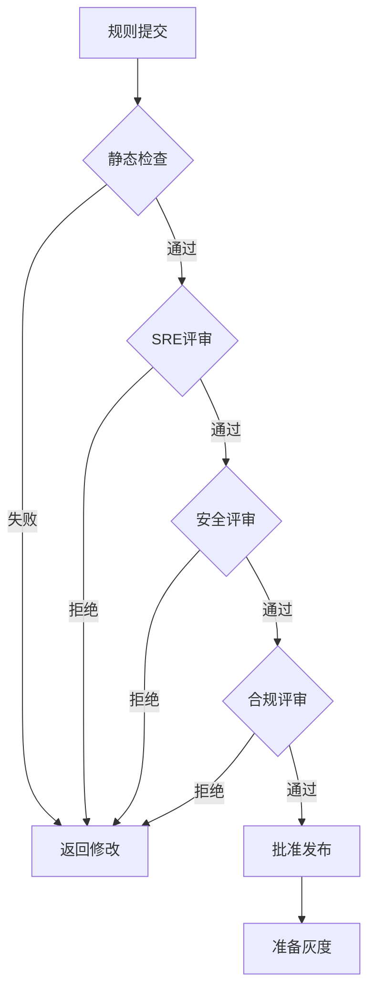

# OTTL规则治理完整指南

> **版本**: 2.0  
> **日期**: 2025年10月17日  
> **状态**: ✅ 完整版

---

## 📋 文档概述

本文档提供OTTL（OpenTelemetry Transformation Language）规则的**全生命周期治理框架**，确保规则的安全性、可维护性和可审计性。

### 治理目标

1. **安全可控**: 防止规则引入安全风险或数据泄漏
2. **可回滚**: 所有规则变更都可快速回滚
3. **可审计**: 完整的变更历史和审批记录
4. **成本优化**: 控制高基数和计算成本
5. **质量保证**: 避免规则冲突和性能问题

---

## 🎯 治理框架概览

### 规则生命周期

```text
草拟 → 静态检查 → 评审 → 灰度发布 → 监控验证 → 全量发布 → 存档
  ↓                                                               ↑
  └───────────────────────── 任何阶段可回滚 ────────────────────────┘
```

### 关键角色

| 角色 | 职责 | 权限 |
|------|------|------|
| **规则所有者** | 定义业务需求，编写规则草稿 | 提交、修改草稿 |
| **SRE审核人** | 性能和可靠性评审 | 批准/拒绝、要求修改 |
| **安全审核人** | 安全和合规性评审 | 批准/拒绝、要求修改 |
| **发布管理员** | 执行灰度发布和回滚 | 发布、回滚、监控 |

---

## 📝 第一阶段：规则草拟

### 1.1 规则模板

**基本结构**:

```yaml
# rule-template.yaml
metadata:
  id: rule-001
  name: "脱敏用户邮箱"
  owner: platform-team
  category: security
  priority: high
  created: 2025-10-17
  version: 1.0

description: |
  对Traces中的用户邮箱属性进行哈希脱敏，
  符合GDPR合规要求。

processors:
  transform/sanitize_email:
    error_mode: ignore
    trace_statements:
      - context: span
        statements:
          - set(attributes["user.email"], SHA256(attributes["user.email"])) 
            where attributes["user.email"] != nil

# 预期影响
impact:
  cardinality_change: none
  cpu_overhead: low  # <2%
  latency_overhead: low  # <5ms
  
# 测试用例
test_cases:
  - input:
      attributes:
        user.email: "user@example.com"
    expected:
      attributes:
        user.email: "hash_value_here"
```

### 1.2 命名规范

**规则ID命名**:

```text
<类型>-<序号>-<简短描述>

示例：
- sanitize-001-email-hash
- dimension-002-reduce-k8s
- route-003-tenant-split
- mark-004-timeout-flag
```

**处理器命名**:

```text
<类型>/<具体功能>

示例：
- transform/sanitize_pii
- transform/reduce_dimensions
- transform/mark_anomaly
```

### 1.3 规则分类

| 类别 | 用途 | 风险等级 | 审批流程 |
|------|------|---------|---------|
| **security** | 数据脱敏、访问控制 | 高 | SRE+安全+合规 |
| **performance** | 降维、采样、聚合 | 中 | SRE |
| **routing** | 多租户分流、后端路由 | 中 | SRE |
| **enrichment** | 数据增强、标记 | 低 | SRE |
| **debugging** | 临时调试标记 | 低 | 自助（有时限） |

---

## 🔍 第二阶段：静态检查

### 2.1 语法检查

**工具**: `otelcol validate`

```bash
# 验证配置语法
otelcol validate --config=rule-001.yaml

# 示例输出
✓ Configuration is valid
```

### 2.2 安全检查清单

#### 禁止函数黑名单

```yaml
# forbidden-functions.yaml
forbidden:
  - Exec        # 禁止执行外部命令
  - ReadFile    # 禁止读取文件系统
  - WriteFile   # 禁止写入文件
  - Env         # 禁止访问环境变量（除非特批）
```

#### 属性白名单

```yaml
# allowed-attributes.yaml
allowed_patterns:
  - "service.*"
  - "http.*"
  - "db.*"
  - "messaging.*"
  - "k8s.*"
  - "cloud.*"
  - "custom.*"  # 项目自定义命名空间

forbidden_patterns:
  - "*password*"
  - "*secret*"
  - "*token*"
  - "*api_key*"
```

### 2.3 高基数风险评估

**高基数键识别**:

```yaml
# high-cardinality-keys.yaml
high_risk:
  - user.id          # 风险：百万级用户
  - request.id       # 风险：每请求唯一
  - trace.id         # 风险：每trace唯一
  - session.id       # 风险：每会话唯一
  - ip.address       # 风险：IP地址空间大

medium_risk:
  - http.route       # 需要参数化
  - db.statement     # 需要脱敏/截断
  - error.message    # 可能包含变量

low_risk:
  - http.method
  - http.status_code
  - service.name
```

**基数预估工具**:

```bash
#!/bin/bash
# estimate-cardinality.sh

# 分析规则中使用的属性键
grep -oP 'attributes\["\K[^"]+' rule-001.yaml | while read key; do
  echo "Checking cardinality of: $key"
  
  # 从Prometheus查询历史基数
  curl -s "http://prometheus:9090/api/v1/query" \
    --data-urlencode "query=count(count by (__name__) ({__name__=~\".*${key}.*\"}))" | \
    jq '.data.result[0].value[1]'
done
```

### 2.4 性能影响预估

**复杂度评分**:

| 操作类型 | 复杂度 | CPU开销估算 |
|---------|--------|-------------|
| 简单赋值 (set) | O(1) | <1% |
| 字符串操作 (concat, replace) | O(n) | 1-3% |
| 哈希计算 (SHA256) | O(n) | 2-5% |
| 正则匹配 (matches) | O(n*m) | 5-10% |
| 复杂条件 (多层嵌套) | O(n) | 3-8% |

**规则复杂度计算**:

```python
# complexity-calculator.py
def calculate_complexity(rule):
    score = 0
    for statement in rule['statements']:
        if 'SHA256' in statement: score += 5
        if 'matches' in statement: score += 10
        if statement.count('where') > 2: score += 8
        if 'replace_pattern' in statement: score += 7
    
    if score < 20: return 'LOW'
    elif score < 50: return 'MEDIUM'
    else: return 'HIGH'
```

---

## ✅ 第三阶段：规则评审

### 3.1 评审清单

**技术评审（SRE）**:

- [ ] 语法正确，配置有效
- [ ] 不包含禁止函数
- [ ] 属性键在白名单内
- [ ] 高基数风险可控（<10个高基数键）
- [ ] 性能影响可接受（<5% CPU）
- [ ] 有明确的测试用例
- [ ] 有回滚方案

**安全评审（Security）**:

- [ ] 不泄露敏感数据
- [ ] 符合数据脱敏要求
- [ ] 符合数据保留策略
- [ ] 符合GDPR/CCPA等法规
- [ ] 访问控制适当

**合规评审（Compliance）**:

- [ ] 符合行业规范（如PCI-DSS、HIPAA）
- [ ] 数据分类正确
- [ ] 审计日志完整

### 3.2 评审流程



### 3.3 评审记录

```yaml
# review-record.yaml
rule_id: sanitize-001-email-hash
version: 1.0

reviews:
  - reviewer: sre-team@company.com
    role: SRE
    status: approved
    timestamp: 2025-10-17T10:00:00Z
    comments: "性能影响可接受，测试充分"
    
  - reviewer: security-team@company.com
    role: Security
    status: approved
    timestamp: 2025-10-17T10:30:00Z
    comments: "符合GDPR要求"
    
  - reviewer: compliance@company.com
    role: Compliance
    status: approved
    timestamp: 2025-10-17T11:00:00Z
    comments: "审计日志完备"

overall_status: approved
approved_by: release-manager@company.com
approved_at: 2025-10-17T11:30:00Z
```

---

## 🚀 第四阶段：灰度发布

### 4.1 灰度策略

**标签选择器**:

```yaml
# rollout-config.yaml
selector:
  env: production
  region: us-west
  tenant: canary-users
  version: collector-v2
```

**分阶段权重**:

```yaml
phases:
  - name: canary
    weight: 10%           # 10%流量
    duration: 15m         # 观察15分钟
    success_criteria:
      - failure_rate < 0.1%
      - cpu_increase < 5%
      - latency_p95 < 50ms
  
  - name: staged
    weight: 30%
    duration: 30m
    success_criteria:
      - failure_rate < 0.1%
      - cpu_increase < 5%
  
  - name: production
    weight: 100%
    duration: 60m
    success_criteria:
      - failure_rate < 0.1%
```

### 4.2 使用OpAMP灰度

参考[OPAMP_ROLLOUT_STRATEGY.md](./OPAMP_ROLLOUT_STRATEGY.md)

```yaml
# opamp-rollout.yaml
agent_config:
  config_hash: sha256-abc123...
  effective_config:
    processors:
      transform/new_rule:
        # 新规则配置
        
rollout:
  target_selector:
    labels:
      canary: "true"
  strategy: gradual
  phases: [10, 30, 100]
  observation_window: 15m
```

### 4.3 发布前检查

```bash
#!/bin/bash
# pre-release-check.sh

echo "=== 发布前检查 ==="

# 1. 配置语法
echo "[1/5] 验证配置语法..."
otelcol validate --config=new-config.yaml || exit 1

# 2. 基线指标
echo "[2/5] 获取基线指标..."
baseline_cpu=$(curl -s 'http://prometheus:9090/api/v1/query?query=avg(rate(process_cpu_seconds_total[5m]))' | jq -r '.data.result[0].value[1]')
echo "Baseline CPU: $baseline_cpu"

# 3. 后端健康
echo "[3/5] 检查后端健康..."
curl -f http://jaeger:14269/ || exit 1
curl -f http://prometheus:9090/-/healthy || exit 1

# 4. 回滚准备
echo "[4/5] 准备回滚配置..."
kubectl get configmap otel-collector-config -o yaml > rollback-$(date +%Y%m%d-%H%M%S).yaml

# 5. 通知
echo "[5/5] 发送发布通知..."
curl -X POST https://slack-webhook/... -d '{"text": "开始灰度发布: sanitize-001"}'

echo "✓ 所有检查通过，准备发布"
```

---

## 📊 第五阶段：监控验证

### 5.1 关键指标监控

**必须监控的指标**:

```yaml
# monitoring-metrics.yaml
metrics:
  reliability:
    - name: export_failure_rate
      query: rate(otelcol_exporter_send_failed_spans[5m])
      threshold: 0.001  # 0.1%
      
  performance:
    - name: cpu_usage
      query: rate(process_cpu_seconds_total[5m])
      threshold_increase: 0.05  # +5%
      
    - name: latency_p95
      query: histogram_quantile(0.95, rate(otelcol_exporter_send_latency_bucket[5m]))
      threshold: 50  # 50ms
      
  functional:
    - name: rule_execution_rate
      query: rate(otelcol_processor_transform_statements_executed[1m])
      expected: "> 0"
      
    - name: rule_error_rate
      query: rate(otelcol_processor_transform_statement_errors[1m])
      threshold: 0
```

### 5.2 自动验证脚本

```bash
#!/bin/bash
# validate-rollout.sh

PHASE=$1  # canary, staged, production
DURATION=${2:-15}  # 默认15分钟

echo "=== 验证灰度阶段: $PHASE (${DURATION}分钟) ==="

start_time=$(date +%s)
end_time=$((start_time + DURATION * 60))

while [ $(date +%s) -lt $end_time ]; do
  echo "$(date): 检查指标..."
  
  # 1. 失败率
  failure_rate=$(curl -s 'http://prometheus:9090/api/v1/query?query=rate(otelcol_exporter_send_failed_spans[5m])' | \
    jq -r '.data.result[0].value[1] // 0')
  
  if (( $(echo "$failure_rate > 0.001" | bc -l) )); then
    echo "✗ 失败率过高: $failure_rate"
    exit 1
  fi
  
  # 2. CPU增长
  current_cpu=$(curl -s 'http://prometheus:9090/api/v1/query?query=rate(process_cpu_seconds_total[5m])' | \
    jq -r '.data.result[0].value[1]')
  cpu_increase=$(echo "scale=2; ($current_cpu - $baseline_cpu) / $baseline_cpu" | bc)
  
  if (( $(echo "$cpu_increase > 0.05" | bc -l) )); then
    echo "✗ CPU增长过多: $cpu_increase"
    exit 1
  fi
  
  echo "✓ 指标正常 (失败率: $failure_rate, CPU增长: $cpu_increase)"
  
  sleep 60  # 每分钟检查一次
done

echo "✓ 阶段 $PHASE 验证通过"
```

### 5.3 告警配置

**灰度期间特殊告警**:

```yaml
# rollout-alerts.yaml
groups:
  - name: ottl_rule_rollout
    interval: 30s
    rules:
      - alert: OTTLRuleRolloutFailure
        expr: |
          rate(otelcol_exporter_send_failed_spans{rollout_phase="active"}[5m]) > 0.001
        for: 3m
        labels:
          severity: critical
          rollout: active
        annotations:
          summary: "OTTL规则灰度失败"
          action: "立即回滚"
```

---

## 🔙 第六阶段：回滚机制

### 6.1 自动回滚触发条件

```yaml
# auto-rollback-config.yaml
triggers:
  - condition: failure_rate
    threshold: "> 0.1%"
    window: 5m
    action: rollback
    
  - condition: cpu_increase
    threshold: "> 10%"
    window: 5m
    action: rollback
    
  - condition: error_spike
    threshold: "> 100 errors/min"
    window: 3m
    action: rollback
    
  - condition: latency_spike
    threshold: "p95 > 100ms"
    window: 5m
    action: rollback
```

### 6.2 手动回滚流程

```bash
#!/bin/bash
# rollback.sh

RULE_ID=$1
REASON=${2:-"manual rollback"}

echo "=== 回滚规则: $RULE_ID ==="

# 1. 获取上一个版本的ConfigHash
previous_hash=$(cat rollback-versions.txt | grep -B1 "current" | head -1)

# 2. 使用OpAMP回滚
curl -X POST http://opamp-server:8080/api/v1/rollback \
  -H "Content-Type: application/json" \
  -d "{
    \"config_hash\": \"$previous_hash\",
    \"reason\": \"$REASON\",
    \"requested_by\": \"$(whoami)\"
  }"

# 3. 或Kubernetes直接回滚
kubectl rollout undo deployment/otel-collector

# 4. 验证回滚成功
sleep 30
./validate-rollout.sh rollback 5

# 5. 记录回滚事件
echo "$(date): Rolled back $RULE_ID - $REASON" >> rollback-history.log

# 6. 通知团队
curl -X POST https://slack-webhook/... \
  -d "{\"text\": \"⚠️ 规则回滚: $RULE_ID - $REASON\"}"

echo "✓ 回滚完成"
```

### 6.3 回滚验证

```bash
# 验证回滚后系统恢复正常
./scripts/prom_query.sh

# 检查关键指标
curl -s 'http://prometheus:9090/api/v1/query?query=rate(otelcol_exporter_send_failed_spans[5m])' | \
  jq -r '.data.result[0].value[1] // 0'
```

---

## 📁 第七阶段：存档与审计

### 7.1 规则版本管理

**版本命名规则**:

```text
<rule-id>-v<major>.<minor>.<patch>

示例：
- sanitize-001-v1.0.0
- sanitize-001-v1.0.1 (bug修复)
- sanitize-001-v1.1.0 (功能增强)
- sanitize-001-v2.0.0 (重大变更)
```

**版本控制结构**:

```text
rules/
├── sanitize-001-email-hash/
│   ├── v1.0.0/
│   │   ├── rule.yaml
│   │   ├── tests.yaml
│   │   ├── review-record.yaml
│   │   ├── rollout-report.yaml
│   │   └── performance-baseline.json
│   ├── v1.0.1/
│   │   └── ...
│   └── current -> v1.0.1
└── dimension-002-reduce-k8s/
    └── ...
```

### 7.2 完整审计记录

```yaml
# audit-record.yaml
rule_id: sanitize-001-email-hash
version: 1.0.0

lifecycle:
  created: 2025-10-17T09:00:00Z
  created_by: developer@company.com
  
  reviewed: 2025-10-17T11:00:00Z
  reviewers:
    - sre-team@company.com
    - security-team@company.com
    
  deployed: 2025-10-17T14:00:00Z
  deployed_by: release-manager@company.com
  
  verified: 2025-10-17T15:00:00Z
  verification_status: passed

rollout_history:
  - phase: canary
    started: 2025-10-17T14:00:00Z
    completed: 2025-10-17T14:15:00Z
    status: success
    metrics:
      failure_rate: 0.0001
      cpu_increase: 0.02
      latency_p95: 35ms
      
  - phase: staged
    started: 2025-10-17T14:15:00Z
    completed: 2025-10-17T14:45:00Z
    status: success
    
  - phase: production
    started: 2025-10-17T14:45:00Z
    completed: 2025-10-17T15:45:00Z
    status: success

performance_impact:
  cpu_overhead: 2.3%
  memory_overhead: 1.1%
  latency_overhead: 3.2ms
  cardinality_change: 0

incidents: []
rollbacks: []

status: active
last_modified: 2025-10-17T15:45:00Z
```

### 7.3 定期审计

**每月审计清单**:

- [ ] 所有活跃规则有完整文档
- [ ] 所有规则有明确的所有者
- [ ] 所有规则通过最新的安全审查
- [ ] 所有规则的性能影响在可接受范围内
- [ ] 移除过期或不再使用的规则
- [ ] 更新规则测试用例

**审计报告模板**:

```yaml
# audit-report.yaml
date: 2025-10-17
auditor: sre-team

summary:
  total_rules: 45
  active_rules: 42
  deprecated_rules: 3
  new_this_month: 5
  
findings:
  high_priority:
    - rule_id: dimension-003
      issue: "性能影响超过预期"
      action: "优化或禁用"
      
  medium_priority:
    - rule_id: route-007
      issue: "文档过时"
      action: "更新文档"
      
  low_priority: []

recommendations:
  - "统一规则命名规范"
  - "加强灰度验证自动化"
  - "建立规则性能基准库"
```

---

## 🛠️ 第八阶段：工具化

### 8.1 规则Lint工具

```python
#!/usr/bin/env python3
# ottl-lint.py

import yaml
import sys
import re

def lint_rule(rule_file):
    """OTTL规则静态检查"""
    with open(rule_file) as f:
        config = yaml.safe_load(f)
    
    errors = []
    warnings = []
    
    # 检查禁止函数
    forbidden = ['Exec', 'ReadFile', 'WriteFile']
    content = str(config)
    for func in forbidden:
        if func in content:
            errors.append(f"禁止使用函数: {func}")
    
    # 检查高基数键
    high_cardinality = ['user.id', 'request.id', 'trace.id', 'ip.address']
    for key in high_cardinality:
        if key in content and 'set(' in content:
            warnings.append(f"警告: 设置高基数键 {key}")
    
    # 检查属性命名
    attrs = re.findall(r'attributes\["([^"]+)"\]', content)
    for attr in attrs:
        if not re.match(r'^[a-z][a-z0-9._]*$', attr):
            warnings.append(f"属性命名不规范: {attr}")
    
    # 检查错误处理
    if 'error_mode' not in content:
        warnings.append("缺少error_mode配置")
    
    return errors, warnings

if __name__ == '__main__':
    errors, warnings = lint_rule(sys.argv[1])
    
    if errors:
        print("❌ 错误:")
        for e in errors:
            print(f"  - {e}")
        sys.exit(1)
    
    if warnings:
        print("⚠️  警告:")
        for w in warnings:
            print(f"  - {w}")
    
    print("✓ 检查通过")
```

### 8.2 灰度编排工具

```bash
#!/bin/bash
# orchestrate-rollout.sh

RULE_FILE=$1
CONFIG_HASH=$(sha256sum $RULE_FILE | cut -d' ' -f1)

echo "=== OTTL规则灰度编排 ==="

# 1. 静态检查
echo "[1/6] 静态检查..."
./ottl-lint.py $RULE_FILE || exit 1

# 2. 评审确认
echo "[2/6] 等待评审..."
read -p "评审是否通过? (yes/no): " approval
if [ "$approval" != "yes" ]; then
    echo "✗ 评审未通过，终止发布"
    exit 1
fi

# 3. 发布前检查
echo "[3/6] 发布前检查..."
./pre-release-check.sh || exit 1

# 4. 灰度阶段
for phase in canary staged production; do
    echo "[4/6] 灰度阶段: $phase"
    
    # 应用配置
    kubectl apply -f $RULE_FILE
    
    # 验证
    ./validate-rollout.sh $phase 15 || {
        echo "✗ 验证失败，自动回滚"
        ./rollback.sh $RULE_FILE "validation failed in $phase"
        exit 1
    }
    
    echo "✓ $phase 阶段完成"
done

# 5. 存档
echo "[5/6] 存档..."
mkdir -p rules/$(basename $RULE_FILE .yaml)/
cp $RULE_FILE rules/$(basename $RULE_FILE .yaml)/v1.0.0/

# 6. 通知
echo "[6/6] 发送完成通知..."
curl -X POST https://slack-webhook/... \
  -d "{\"text\": \"✓ 规则发布成功: $(basename $RULE_FILE)\"}"

echo "✓ 灰度发布完成"
```

### 8.3 基准与报表工具

```bash
#!/bin/bash
# generate-baseline-report.sh

RULE_ID=$1
OUTPUT="baseline-report-$RULE_ID-$(date +%Y%m%d).json"

echo "=== 生成基准报告: $RULE_ID ==="

# 收集15分钟基准数据
jq -n \
  --arg rule_id "$RULE_ID" \
  --arg timestamp "$(date -Iseconds)" \
  --arg cpu "$(curl -s 'http://prometheus:9090/api/v1/query?query=avg(rate(process_cpu_seconds_total[15m]))' | jq -r '.data.result[0].value[1]')" \
  --arg memory "$(curl -s 'http://prometheus:9090/api/v1/query?query=avg(process_resident_memory_bytes[15m])' | jq -r '.data.result[0].value[1]')" \
  --arg throughput "$(curl -s 'http://prometheus:9090/api/v1/query?query=avg(rate(otelcol_exporter_sent_spans[15m]))' | jq -r '.data.result[0].value[1]')" \
  --arg failure_rate "$(curl -s 'http://prometheus:9090/api/v1/query?query=avg(rate(otelcol_exporter_send_failed_spans[15m]))' | jq -r '.data.result[0].value[1] // 0')" \
  '{
    rule_id: $rule_id,
    timestamp: $timestamp,
    metrics: {
      cpu: ($cpu | tonumber),
      memory: ($memory | tonumber),
      throughput: ($throughput | tonumber),
      failure_rate: ($failure_rate | tonumber)
    }
  }' > $OUTPUT

echo "✓ 报告已生成: $OUTPUT"
cat $OUTPUT | jq .
```

---

## 📚 相关文档

- [OTTL完整参考](./OTTL_COMPLETE_REFERENCE.md) - OTTL语法和函数
- [OTTL示例](./OTTL_EXAMPLES.md) - 实践示例集
- [OpAMP部署策略](./OPAMP_ROLLOUT_STRATEGY.md) - 灰度发布机制
- [运维手册](./RUNBOOK.md) - 日常运维流程
- [告警基线](./ALERTING_BASELINE.md) - 监控和告警

---

## 📞 支持与反馈

### 获取帮助

- **规则审查问题**: SRE团队
- **安全问题**: 安全团队
- **工具问题**: 平台团队

### 贡献改进

欢迎提供：

- 新的检查规则
- 自动化工具改进
- 最佳实践案例
- 治理流程优化建议

---

## 📝 变更历史

| 版本 | 日期 | 说明 |
|------|------|------|
| 2.0 | 2025-10-17 | 完整版发布：扩展为生产级规则治理指南 |
| 1.0 | 2025-09-XX | 初始版本：基础治理流程 |

---

**建立完善的规则治理体系，确保OTTL规则安全可控！** 🔒✨
