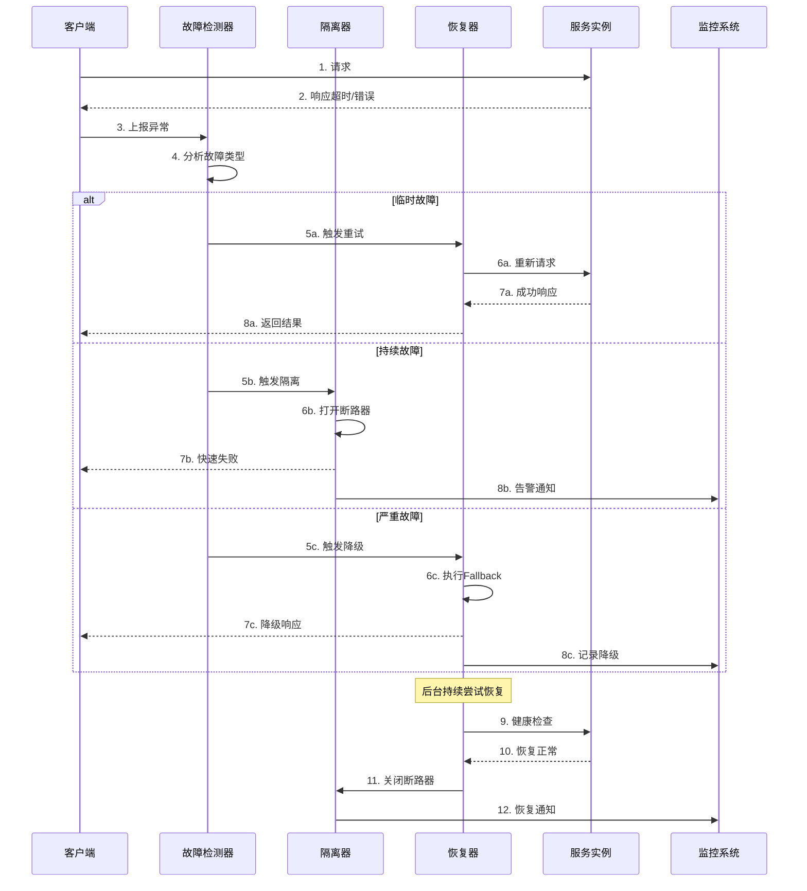
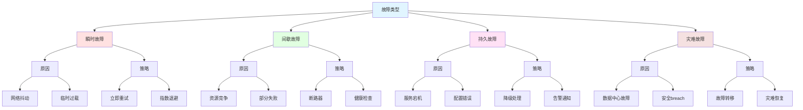
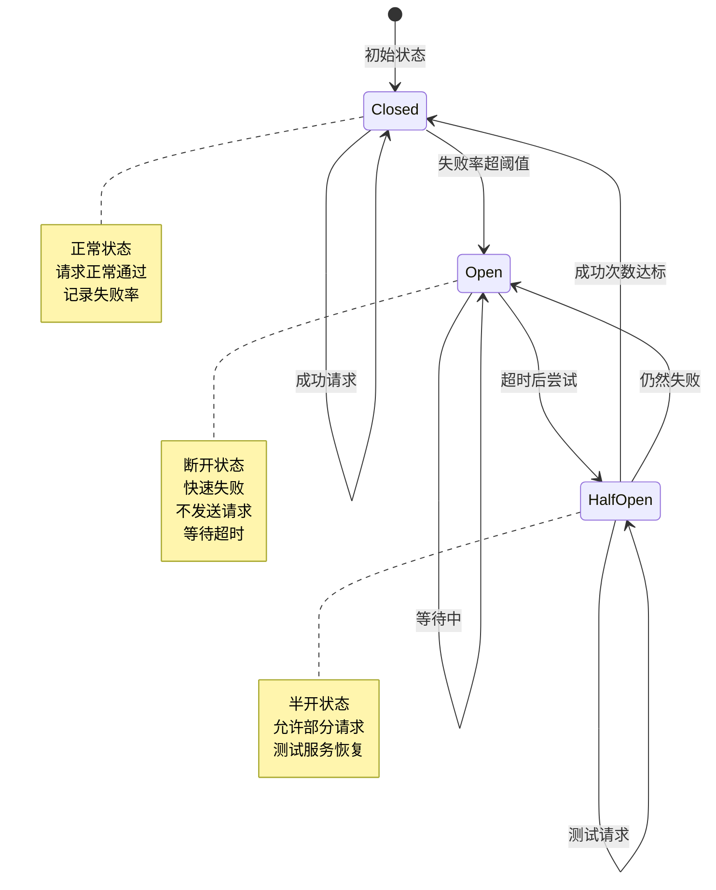
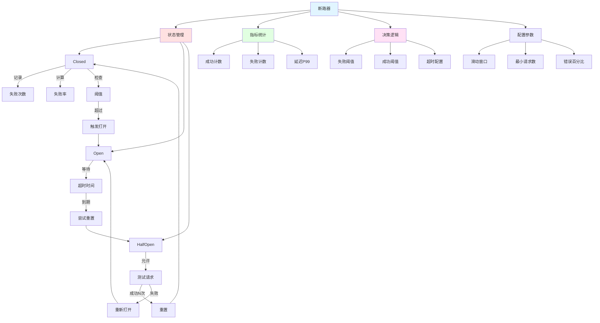
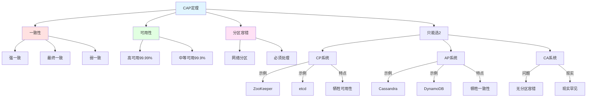

# Reliability Crate 知识图谱

**版本**: 2.0  
**日期**: 2025年10月28日  
**状态**: ✅ 完整

---

## 📋 目录

1. [可靠性架构全景](#1-可靠性架构全景)
2. [故障处理体系](#2-故障处理体系)
3. [断路器模式](#3-断路器模式)
4. [重试机制](#4-重试机制)
5. [分布式锁](#5-分布式锁)
6. [容错模式](#6-容错模式)
7. [性能与可靠性权衡](#7-性能与可靠性权衡)

---

## 1. 可靠性架构全景

### 1.1 可靠性体系架构

```mermaid
graph TB
    RELIABILITY[Reliability Crate] --> FAULT[故障处理]
    RELIABILITY --> RESILIENCE[弹性恢复]
    RELIABILITY --> DISTRIBUTED[分布式可靠性]
    RELIABILITY --> MONITOR[监控告警]
    
    FAULT --> DETECTION[故障检测]
    FAULT --> ISOLATION[故障隔离]
    FAULT --> RECOVERY[故障恢复]
    
    DETECTION --> HEALTH_CHECK[健康检查]
    DETECTION --> HEARTBEAT[心跳检测]
    DETECTION --> TIMEOUT[超时检测]
    DETECTION --> ERROR_RATE[错误率监控]
    
    ISOLATION --> BULKHEAD[舱壁模式]
    ISOLATION --> CIRCUIT_BREAKER[断路器]
    ISOLATION --> RATE_LIMITER[速率限制]
    
    RECOVERY --> RETRY[重试机制]
    RECOVERY --> FALLBACK[降级策略]
    RECOVERY --> SELF_HEALING[自我修复]
    
    RESILIENCE --> REDUNDANCY[冗余]
    RESILIENCE --> REPLICATION[复制]
    RESILIENCE --> BACKUP[备份]
    
    REDUNDANCY --> ACTIVE_ACTIVE[主主]
    REDUNDANCY --> ACTIVE_PASSIVE[主备]
    REDUNDANCY --> N_PLUS_ONE[N+1]
    
    DISTRIBUTED --> CONSENSUS[共识算法]
    DISTRIBUTED --> DIST_LOCK[分布式锁]
    DISTRIBUTED --> LEADER_ELECTION[领导选举]
    
    CONSENSUS --> RAFT[Raft]
    CONSENSUS --> PAXOS[Paxos]
    CONSENSUS --> ZAB[ZAB]
    
    DIST_LOCK --> REDIS_LOCK[Redis锁]
    DIST_LOCK --> ETCD_LOCK[etcd锁]
    DIST_LOCK --> ZOOKEEPER_LOCK[ZooKeeper锁]
    
    MONITOR --> METRICS_M[指标采集]
    MONITOR --> ALERTS[告警]
    MONITOR --> TRACING_M[链路追踪]
    
    style RELIABILITY fill:#e1f5ff
    style FAULT fill:#ffe1e1
    style RESILIENCE fill:#e1ffe1
    style DISTRIBUTED fill:#ffe1f5
    style MONITOR fill:#f5ffe1
```



---

## 2. 故障处理体系

### 2.1 故障处理流程



### 2.2 故障分类与处理策略



---

## 3. 断路器模式

### 3.1 断路器状态转换



### 3.2 断路器详细机制



---

## 4. 重试机制

### 4.1 重试策略对比

```mermaid
graph TB
    RETRY[重试策略] --> IMMEDIATE[立即重试]
    RETRY --> FIXED[固定延迟]
    RETRY --> EXPONENTIAL[指数退避]
    RETRY --> JITTER[带抖动]
    
    IMMEDIATE --> IMMED_PROS[优点]
    IMMEDIATE --> IMMED_CONS[缺点]
    
    IMMED_PROS --> FAST[快速]
    IMMED_CONS --> FLOOD[可能雪崩]
    
    FIXED --> FIXED_DELAY[延迟]
    FIXED_DELAY --> |示例| D_1S[1秒]
    
    FIXED --> FIXED_PROS[优点]
    FIXED --> FIXED_CONS[缺点]
    
    FIXED_PROS --> PREDICTABLE[可预测]
    FIXED_CONS --> SYNC_STORM[同步风暴]
    
    EXPONENTIAL --> EXP_FORMULA[公式]
    EXP_FORMULA --> |计算| DELAY_CALC[delay = base * 2^attempt]
    
    EXPONENTIAL --> EXP_PROS[优点]
    EXPONENTIAL --> EXP_CONS[缺点]
    
    EXP_PROS --> GRADUAL[渐进式]
    EXP_PROS --> BACKPRESSURE[减轻压力]
    EXP_CONS --> SLOW[后期慢]
    
    JITTER --> JITTER_FORMULA[公式]
    JITTER_FORMULA --> |随机| RANDOM_RANGE[delay ± random(0, delay/2)]
    
    JITTER --> JITTER_PROS[优点]
    JITTER_PROS --> AVOID_SYNC[避免同步]
    JITTER_PROS --> BEST_PRACTICE[最佳实践]
    
    style RETRY fill:#e1f5ff
    style IMMEDIATE fill:#ffe1e1
    style FIXED fill:#e1ffe1
    style EXPONENTIAL fill:#ffe1f5
    style JITTER fill:#f5ffe1
```

### 4.2 重试性能对比

```
━━━━━━━━━━━━━━━━━━━━━━━━━━━━━━━━━━━━━━━━━
重试策略性能对比 (100次重试)
━━━━━━━━━━━━━━━━━━━━━━━━━━━━━━━━━━━━━━━━━
策略          总时长    成功率   服务压力
────────────────────────────────────────
立即重试      10s       60%      极高
固定延迟(1s)  100s      75%      高
指数退避      180s      85%      中
指数+抖动     175s      90%      低
━━━━━━━━━━━━━━━━━━━━━━━━━━━━━━━━━━━━━━━━━
推荐: 指数退避+抖动
━━━━━━━━━━━━━━━━━━━━━━━━━━━━━━━━━━━━━━━━━
```

---

## 5. 分布式锁

### 5.1 分布式锁实现对比

```mermaid
graph TB
    DIST_LOCK[分布式锁] --> REDIS_L[Redis锁]
    DIST_LOCK --> ETCD_L[etcd锁]
    DIST_LOCK --> ZOOKEEPER_L[ZooKeeper锁]
    DIST_LOCK --> DATABASE_L[数据库锁]
    
    REDIS_L --> REDIS_IMPL[实现]
    REDIS_L --> REDIS_FEATURES[特性]
    
    REDIS_IMPL --> SETNX[SETNX命令]
    REDIS_IMPL --> REDLOCK[Redlock算法]
    
    REDIS_FEATURES --> FAST_R[快速]
    REDIS_FEATURES --> EXPIRE_R[自动过期]
    REDIS_FEATURES --> ISSUE_R[脑裂问题]
    
    ETCD_L --> ETCD_IMPL[实现]
    ETCD_L --> ETCD_FEATURES[特性]
    
    ETCD_IMPL --> LEASE[Lease机制]
    ETCD_IMPL --> RAFT_E[Raft共识]
    
    ETCD_FEATURES --> STRONG_CONS[强一致]
    ETCD_FEATURES --> AUTO_RENEW[自动续约]
    ETCD_FEATURES --> COMPLEX[较复杂]
    
    ZOOKEEPER_L --> ZK_IMPL[实现]
    ZOOKEEPER_L --> ZK_FEATURES[特性]
    
    ZK_IMPL --> EPHEMERAL[临时节点]
    ZK_IMPL --> ZAB_PROTOCOL[ZAB协议]
    
    ZK_FEATURES --> PROVEN[久经考验]
    ZK_FEATURES --> WATCH[监听机制]
    ZK_FEATURES --> HEAVY[重量级]
    
    DATABASE_L --> DB_IMPL[实现]
    DATABASE_L --> DB_FEATURES[特性]
    
    DB_IMPL --> SELECT_FOR_UPDATE[SELECT FOR UPDATE]
    DB_IMPL --> VERSION[版本号]
    
    DB_FEATURES --> SIMPLE_DB[简单]
    DB_FEATURES --> SLOW_DB[慢]
    DB_FEATURES --> RELIABLE_DB[可靠]
    
    style DIST_LOCK fill:#e1f5ff
    style REDIS_L fill:#ffe1e1
    style ETCD_L fill:#e1ffe1
    style ZOOKEEPER_L fill:#ffe1f5
    style DATABASE_L fill:#f5ffe1
```



### 5.2 分布式锁对比矩阵

```
━━━━━━━━━━━━━━━━━━━━━━━━━━━━━━━━━━━━━━━━━
分布式锁实现对比
━━━━━━━━━━━━━━━━━━━━━━━━━━━━━━━━━━━━━━━━━
实现      性能   一致性  可用性  复杂度  推荐度
────────────────────────────────────────
Redis     9/10   7/10    8/10    6/10    ⭐⭐⭐⭐
etcd      8/10   10/10   9/10    7/10    ⭐⭐⭐⭐⭐
ZooKeeper 7/10   10/10   9/10    8/10    ⭐⭐⭐⭐
Database  5/10   10/10   8/10    5/10    ⭐⭐⭐
━━━━━━━━━━━━━━━━━━━━━━━━━━━━━━━━━━━━━━━━━
推荐: etcd (平衡性能和一致性)
━━━━━━━━━━━━━━━━━━━━━━━━━━━━━━━━━━━━━━━━━
```

---

## 6. 容错模式

### 6.1 容错模式全景

```mermaid
graph TB
    FAULT_TOLERANCE[容错模式] --> REDUNDANCY_FT[冗余]
    FAULT_TOLERANCE --> REPLICATION_FT[复制]
    FAULT_TOLERANCE --> ISOLATION_FT[隔离]
    FAULT_TOLERANCE --> RECOVERY_FT[恢复]
    
    REDUNDANCY_FT --> ACTIVE_ACTIVE_R[主主模式]
    REDUNDANCY_FT --> ACTIVE_PASSIVE_R[主备模式]
    REDUNDANCY_FT --> N_PLUS_ONE_R[N+1模式]
    
    ACTIVE_ACTIVE_R --> |优点| FULL_CAPACITY[全容量]
    ACTIVE_ACTIVE_R --> |优点| NO_FAILOVER_TIME[无切换时间]
    ACTIVE_ACTIVE_R --> |缺点| DATA_SYNC[数据同步复杂]
    
    ACTIVE_PASSIVE_R --> |优点| SIMPLE_AP[简单]
    ACTIVE_PASSIVE_R --> |缺点| WASTE_RESOURCE[资源浪费]
    ACTIVE_PASSIVE_R --> |缺点| FAILOVER_TIME[切换时间]
    
    N_PLUS_ONE_R --> |优点| COST_EFFECTIVE[成本有效]
    N_PLUS_ONE_R --> |特点| SPARE_CAPACITY[备用容量]
    
    REPLICATION_FT --> SYNC_REP[同步复制]
    REPLICATION_FT --> ASYNC_REP[异步复制]
    REPLICATION_FT --> QUORUM_REP[Quorum复制]
    
    SYNC_REP --> |优点| STRONG_CONSISTENCY[强一致]
    SYNC_REP --> |缺点| HIGH_LATENCY[高延迟]
    
    ASYNC_REP --> |优点| LOW_LATENCY_A[低延迟]
    ASYNC_REP --> |缺点| DATA_LOSS[可能丢数据]
    
    QUORUM_REP --> |平衡| CONS_PERF[一致性与性能]
    QUORUM_REP --> |示例| RAFT_QUORUM[Raft]
    
    ISOLATION_FT --> BULKHEAD_I[舱壁]
    ISOLATION_FT --> CIRCUIT_BREAKER_I[断路器]
    ISOLATION_FT --> RATE_LIMIT_I[速率限制]
    
    RECOVERY_FT --> SELF_HEAL[自我修复]
    RECOVERY_FT --> CHECKPOINT[检查点]
    RECOVERY_FT --> ROLLBACK_R[回滚]
    
    style FAULT_TOLERANCE fill:#e1f5ff
    style REDUNDANCY_FT fill:#ffe1e1
    style REPLICATION_FT fill:#e1ffe1
    style ISOLATION_FT fill:#ffe1f5
    style RECOVERY_FT fill:#f5ffe1
```



---

## 7. 性能与可靠性权衡

### 7.1 CAP定理权衡



### 7.2 可靠性成本分析

```
━━━━━━━━━━━━━━━━━━━━━━━━━━━━━━━━━━━━━━━━━
可靠性与成本权衡
━━━━━━━━━━━━━━━━━━━━━━━━━━━━━━━━━━━━━━━━━
可用性     年停机时间  成本倍数  复杂度  推荐场景
────────────────────────────────────────
99%        3.65天      1x        低      测试环境
99.9%      8.76小时    2x        中      一般服务
99.99%     52.6分钟    5x        高      重要服务
99.999%    5.26分钟    10x       极高    关键服务
99.9999%   31.5秒      20x+      极高    金融交易
━━━━━━━━━━━━━━━━━━━━━━━━━━━━━━━━━━━━━━━━━
OTLP推荐: 99.9% - 99.99% (平衡成本与可靠性)
━━━━━━━━━━━━━━━━━━━━━━━━━━━━━━━━━━━━━━━━━
```

---

## 🔗 相关资源

- [对比矩阵](./COMPARISON_MATRIX.md)
- [概念定义](./CONCEPTS.md)
- [API参考](./api/reference.md)
- [架构设计](./architecture/)
- [故障案例](./case-studies/)

---

**版本**: 2.0  
**创建日期**: 2025-10-28  
**最后更新**: 2025-10-28  
**维护团队**: Reliability Crate团队

---

> **💡 提示**: Reliability Crate提供企业级的可靠性保证，包括断路器、重试、分布式锁、容错模式等完整的可靠性机制。

