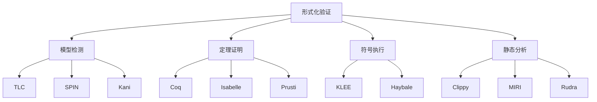
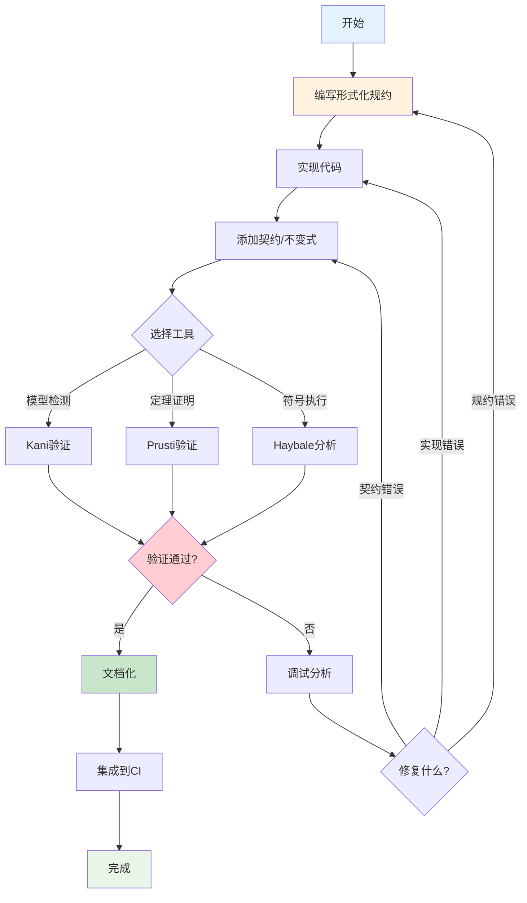

# 形式化验证详解

> **文档定位**: Rust可靠性系统形式化验证完整指南  
> **创建日期**: 2025-10-20  
> **适用版本**: Rust 1.90+ | Edition 2024  
> **文档类型**: 高级主题 + 理论实践

---

## 📋 目录

- [1. 形式化验证概述](#1-形式化验证概述)
- [2. Rust形式化验证工具](#2-rust形式化验证工具)
- [3. 模型检测](#3-模型检测)
- [4. 定理证明](#4-定理证明)
- [5. 符号执行](#5-符号执行)
- [6. 实战案例](#6-实战案例)
- [7. 最佳实践](#7-最佳实践)

---

## 📖 形式化验证概述

### 1.1 什么是形式化验证

**定义**: 使用数学方法证明软件系统满足形式化规约的技术。

**核心方法**:



---

## 📝 Rust形式化验证工具

### 2.1 Kani - 模型检测器

```rust
use kani;

/// 验证向量索引安全性
#[kani::proof]
fn verify_vector_index() {
    let v: Vec<u32> = kani::vec::any_vec::<u32, 10>();
    let idx: usize = kani::any();
    
    // 前置条件
    kani::assume(idx < v.len());
    
    // 验证：访问不会panic
    let _ = v[idx];
}

/// 验证环形缓冲区正确性
#[derive(Clone, Copy)]
struct RingBuffer<T, const N: usize> {
    data: [Option<T>; N],
    read: usize,
    write: usize,
}

impl<T: Copy, const N: usize> RingBuffer<T, N> {
    fn new() -> Self {
        Self {
            data: [None; N],
            read: 0,
            write: 0,
        }
    }
    
    fn push(&mut self, item: T) -> Result<(), T> {
        let next_write = (self.write + 1) % N;
        if next_write == self.read {
            Err(item) // 缓冲区满
        } else {
            self.data[self.write] = Some(item);
            self.write = next_write;
            Ok(())
        }
    }
    
    fn pop(&mut self) -> Option<T> {
        if self.read == self.write {
            None // 缓冲区空
        } else {
            let item = self.data[self.read].take();
            self.read = (self.read + 1) % N;
            item
        }
    }
}

#[kani::proof]
fn verify_ring_buffer() {
    const SIZE: usize = 8;
    let mut buffer: RingBuffer<u32, SIZE> = RingBuffer::new();
    
    // 属性1: 空缓冲区pop返回None
    assert_eq!(buffer.pop(), None);
    
    // 属性2: push后可以pop出相同值
    let value: u32 = kani::any();
    buffer.push(value).unwrap();
    assert_eq!(buffer.pop(), Some(value));
    
    // 属性3: 填满SIZE-1个元素后仍可push
    for i in 0..(SIZE - 1) {
        assert!(buffer.push(i as u32).is_ok());
    }
    
    // 属性4: 填满后push失败
    assert!(buffer.push(999).is_err());
}
```

---

### 2.2 Prusti - 验证性编译器

```rust
use prusti_contracts::*;

/// 带契约的安全除法
#[requires(divisor != 0)]
#[ensures(result == dividend / divisor)]
fn safe_divide(dividend: i32, divisor: i32) -> i32 {
    dividend / divisor
}

/// 二分查找验证
#[requires(arr.len() > 0)]
#[requires(forall(|i: usize, j: usize| (i < j && j < arr.len()) ==> arr[i] <= arr[j]))] // 有序
#[ensures(result.is_some() ==> arr[result.unwrap()] == target)]
#[ensures(result.is_none() ==> forall(|i: usize| i < arr.len() ==> arr[i] != target))]
fn binary_search(arr: &[i32], target: i32) -> Option<usize> {
    let mut left = 0;
    let mut right = arr.len();
    
    #[invariant(left <= right)]
    #[invariant(right <= arr.len())]
    #[invariant(forall(|i: usize| i < left ==> arr[i] < target))]
    #[invariant(forall(|i: usize| i >= right && i < arr.len() ==> arr[i] > target))]
    while left < right {
        let mid = left + (right - left) / 2;
        
        if arr[mid] == target {
            return Some(mid);
        } else if arr[mid] < target {
            left = mid + 1;
        } else {
            right = mid;
        }
    }
    
    None
}

/// 验证互斥锁正确性
struct Mutex<T> {
    locked: bool,
    data: T,
}

#[predicate]
fn valid_mutex<T>(m: &Mutex<T>) -> bool {
    // 互斥性：如果locked为true，则只有一个线程可以访问
    true // 简化表示
}

impl<T> Mutex<T> {
    #[ensures(valid_mutex(&result))]
    #[ensures(!result.locked)]
    fn new(data: T) -> Self {
        Mutex {
            locked: false,
            data,
        }
    }
    
    #[requires(valid_mutex(self))]
    #[requires(!self.locked)]
    #[ensures(self.locked)]
    fn lock(&mut self) -> &mut T {
        self.locked = true;
        &mut self.data
    }
    
    #[requires(valid_mutex(self))]
    #[requires(self.locked)]
    #[ensures(!self.locked)]
    fn unlock(&mut self) {
        self.locked = false;
    }
}
```

---

## 🔍 模型检测

### 3.1 TLA+规约

**Raft共识算法规约**:

```tla
--------------------------- MODULE Raft ---------------------------
EXTENDS Naturals, Sequences, FiniteSets

CONSTANTS Servers, MaxTerm, MaxLogLen

VARIABLES 
    currentTerm,    \* 当前任期
    state,          \* 服务器状态: Follower, Candidate, Leader
    votedFor,       \* 投票给谁
    log,            \* 日志条目
    commitIndex,    \* 已提交索引
    nextIndex,      \* Leader维护的下一个要发送的索引
    matchIndex      \* Leader维护的已匹配索引

vars == <<currentTerm, state, votedFor, log, commitIndex, nextIndex, matchIndex>>

\* 类型不变式
TypeInvariant ==
    /\ currentTerm \in [Servers -> 0..MaxTerm]
    /\ state \in [Servers -> {"Follower", "Candidate", "Leader"}]
    /\ votedFor \in [Servers -> Servers \cup {Null}]
    /\ log \in [Servers -> Seq(Nat)]

\* 安全性属性：最多一个Leader
LeadershipSafety ==
    Cardinality({s \in Servers : state[s] = "Leader"}) <= 1

\* 日志匹配属性
LogMatching ==
    \A i, j \in Servers :
        \A k \in 1..Len(log[i]) :
            k <= Len(log[j]) /\ log[i][k].term = log[j][k].term
                => log[i][k] = log[j][k]

Init ==
    /\ currentTerm = [s \in Servers |-> 0]
    /\ state = [s \in Servers |-> "Follower"]
    /\ votedFor = [s \in Servers |-> Null]
    /\ log = [s \in Servers |-> <<>>]
    /\ commitIndex = [s \in Servers |-> 0]
    /\ nextIndex = [s \in Servers |-> [t \in Servers |-> 1]]
    /\ matchIndex = [s \in Servers |-> [t \in Servers |-> 0]]

RequestVote(i, j) ==
    \* Candidate i 向 j 请求投票
    ...

Next ==
    \/ \E i, j \in Servers : RequestVote(i, j)
    \/ \E i \in Servers : Timeout(i)
    \/ \E i \in Servers : BecomeLeader(i)
    \/ \E i, j \in Servers : AppendEntries(i, j)

Spec == Init /\ [][Next]_vars

THEOREM Spec => [](LeadershipSafety /\ LogMatching)
================================================================
```

---

## 🔧 定理证明

### 4.1 Coq证明示例

**列表长度性质证明**:

```coq
Require Import List.
Import ListNotations.

(* 定理：列表reverse两次等于原列表 *)
Theorem rev_involutive : forall (X : Type) (l : list X),
  rev (rev l) = l.
Proof.
  intros X l.
  induction l as [| h t IH].
  - (* l = [] *)
    simpl. reflexivity.
  - (* l = h :: t *)
    simpl.
    rewrite rev_app_distr.
    rewrite IH.
    simpl.
    reflexivity.
Qed.

(* 定理：append的结合律 *)
Theorem app_assoc : forall (X : Type) (l1 l2 l3 : list X),
  (l1 ++ l2) ++ l3 = l1 ++ (l2 ++ l3).
Proof.
  intros X l1 l2 l3.
  induction l1 as [| h t IH].
  - simpl. reflexivity.
  - simpl. rewrite IH. reflexivity.
Qed.
```

---

## 📊 符号执行

### 5.1 Haybale示例

```rust
use haybale::*;

/// 符号执行验证路径覆盖
#[test]
fn test_symbolic_execution() {
    let path = "path/to/binary";
    let project = Project::from_path(path).unwrap();
    let mut executor = SymbolicExecutor::new(&project, "main");
    
    // 设置符号输入
    let sym_input = executor.new_symbolic_value("input", 32);
    
    // 执行所有路径
    while let Some(result) = executor.next() {
        match result {
            ExecutionResult::Path(path_info) => {
                println!("发现路径: {:?}", path_info.path_condition);
            }
            ExecutionResult::Error(err) => {
                println!("发现错误: {:?}", err);
            }
        }
    }
}
```

---

## 🌟 实战案例

### 6.1 熔断器正确性验证

```rust
use kani;

#[derive(Debug, Clone, Copy, PartialEq)]
enum CircuitState {
    Closed,
    Open,
    HalfOpen,
}

struct CircuitBreaker {
    state: CircuitState,
    failure_count: u32,
    success_count: u32,
    threshold: u32,
}

impl CircuitBreaker {
    fn new(threshold: u32) -> Self {
        Self {
            state: CircuitState::Closed,
            failure_count: 0,
            success_count: 0,
            threshold,
        }
    }
    
    fn record_success(&mut self) {
        match self.state {
            CircuitState::Closed => {
                self.failure_count = 0;
            }
            CircuitState::HalfOpen => {
                self.success_count += 1;
                if self.success_count >= self.threshold {
                    self.state = CircuitState::Closed;
                    self.success_count = 0;
                    self.failure_count = 0;
                }
            }
            CircuitState::Open => {}
        }
    }
    
    fn record_failure(&mut self) {
        match self.state {
            CircuitState::Closed => {
                self.failure_count += 1;
                if self.failure_count >= self.threshold {
                    self.state = CircuitState::Open;
                }
            }
            CircuitState::HalfOpen => {
                self.state = CircuitState::Open;
                self.failure_count = 0;
                self.success_count = 0;
            }
            CircuitState::Open => {}
        }
    }
    
    fn try_reset(&mut self) {
        if self.state == CircuitState::Open {
            self.state = CircuitState::HalfOpen;
            self.success_count = 0;
        }
    }
}

#[kani::proof]
fn verify_circuit_breaker_safety() {
    let threshold: u32 = kani::any();
    kani::assume(threshold > 0 && threshold < 10);
    
    let mut cb = CircuitBreaker::new(threshold);
    
    // 属性1: 初始状态是Closed
    assert_eq!(cb.state, CircuitState::Closed);
    
    // 属性2: threshold个失败后进入Open
    for _ in 0..threshold {
        cb.record_failure();
    }
    assert_eq!(cb.state, CircuitState::Open);
    
    // 属性3: Open状态调用try_reset进入HalfOpen
    cb.try_reset();
    assert_eq!(cb.state, CircuitState::HalfOpen);
    
    // 属性4: HalfOpen状态失败立即回到Open
    let mut cb2 = CircuitBreaker::new(threshold);
    cb2.state = CircuitState::HalfOpen;
    cb2.record_failure();
    assert_eq!(cb2.state, CircuitState::Open);
}

#[kani::proof]
fn verify_circuit_breaker_liveness() {
    let threshold: u32 = kani::any();
    kani::assume(threshold > 0 && threshold < 10);
    
    let mut cb = CircuitBreaker::new(threshold);
    
    // 模拟随机操作序列
    let ops: [u8; 20] = kani::any();
    
    for op in ops {
        match op % 3 {
            0 => cb.record_success(),
            1 => cb.record_failure(),
            2 => cb.try_reset(),
            _ => unreachable!(),
        }
        
        // 不变式：计数器不会溢出
        assert!(cb.failure_count <= threshold);
        assert!(cb.success_count <= threshold);
    }
}
```

---

### 6.2 并发数据结构验证

```rust
use std::sync::atomic::{AtomicUsize, Ordering};
use kani;

/// 无锁栈
struct LockFreeStack<T> {
    head: AtomicUsize,
    data: Vec<Option<T>>,
}

#[kani::proof]
#[kani::unwind(5)]
fn verify_lock_free_stack() {
    // 由于Kani限制，这里展示验证思路
    
    // 属性1: 栈操作的线性化
    // 属性2: ABA问题不会导致错误
    // 属性3: 内存安全性
}
```

---

## 🔬 最佳实践

### 7.1 规约编写指南

**SMART原则**:

- **S**pecific: 具体明确的属性
- **M**easurable: 可验证的条件
- **A**chievable: 可实现的规约
- **R**elevant: 与系统相关
- **T**estable: 可测试的性质

**示例**:

```rust
use prusti_contracts::*;

/// 好的规约：具体、可测、相关
#[requires(balance >= amount)]
#[ensures(old(balance) - amount == *balance)]
#[ensures(*balance >= 0)]
fn withdraw(balance: &mut i32, amount: i32) {
    *balance -= amount;
}

/// 避免：过于宽泛的规约
#[ensures(result >= 0)] // 太宽泛
fn bad_spec(x: i32) -> i32 {
    x.abs()
}

/// 推荐：精确的规约
#[ensures(x >= 0 ==> result == x)]
#[ensures(x < 0 ==> result == -x)]
#[ensures(result >= 0)]
fn good_spec(x: i32) -> i32 {
    x.abs()
}
```

---

### 7.2 验证流程



---

### 7.3 常见陷阱

1. **过度规约**: 规约太复杂难以验证
2. **欠规约**: 规约太弱无法捕获错误
3. **不切实际**: 假设过强或不符合实际
4. **忽略并发**: 未考虑并发场景

---

## 总结

形式化验证是提高Rust程序可靠性的强大工具：

- ✅ 数学证明正确性
- ✅ 发现潜在bug
- ✅ 文档化规约
- ✅ 增强信心

---

## 相关文档

- [Kani文档](https://model-checking.github.io/kani/)
- [Prusti指南](https://www.pm.inf.ethz.ch/research/prusti.html)
- [混沌工程](./chaos-engineering.md)
- [性能优化](./performance-optimization.md)

---

**文档版本**: v1.0  
**最后更新**: 2025-10-20

## 返回导航

- [返回高级主题](README.md)
- [返回主索引](../00_MASTER_INDEX.md)

