# C13 Reliability 思维导图与可视化

> **文档定位**: Rust 1.90 可靠性技术可视化学习  
> **创建日期**: 2025-10-20  
> **适用版本**: Rust 1.90+ | Edition 2024  
> **文档类型**: 思维导图 + 流程图 + 架构图

---

## 📊 目录

- [C13 Reliability 思维导图与可视化](#c13-reliability-思维导图与可视化)
  - [📊 目录](#-目录)
  - [1. 可靠性全景思维导图](#1-可靠性全景思维导图)
    - [技术栈总览](#技术栈总览)
  - [2. 容错机制架构图](#2-容错机制架构图)
    - [熔断器状态机](#熔断器状态机)
    - [熔断器工作流程](#熔断器工作流程)
  - [3. 限流架构图](#3-限流架构图)
    - [令牌桶算法](#令牌桶算法)
    - [限流决策流程](#限流决策流程)
  - [4. 分布式事务架构](#4-分布式事务架构)
    - [Saga模式](#saga模式)
    - [2PC与3PC对比](#2pc与3pc对比)
  - [5. 可观测性架构](#5-可观测性架构)
    - [三大支柱](#三大支柱)
    - [监控告警流程](#监控告警流程)
  - [6. 测试金字塔](#6-测试金字塔)
    - [测试层次架构](#测试层次架构)
  - [7. 生产部署架构](#7-生产部署架构)
    - [高可用架构](#高可用架构)
  - [相关文档](#相关文档)
  - [返回导航](#返回导航)

---

## 📖 可靠性全景思维导图

### 技术栈总览

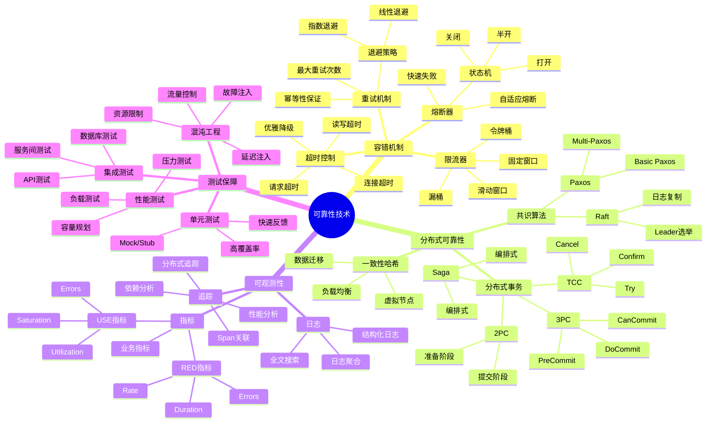

---

## 📝 容错机制架构图

### 熔断器状态机

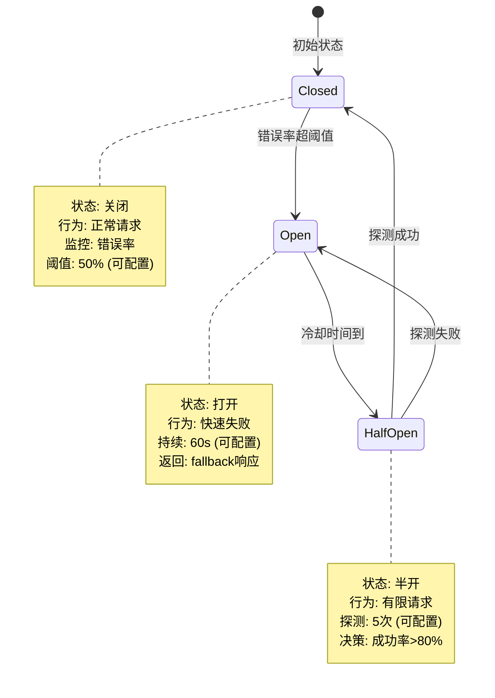

### 熔断器工作流程

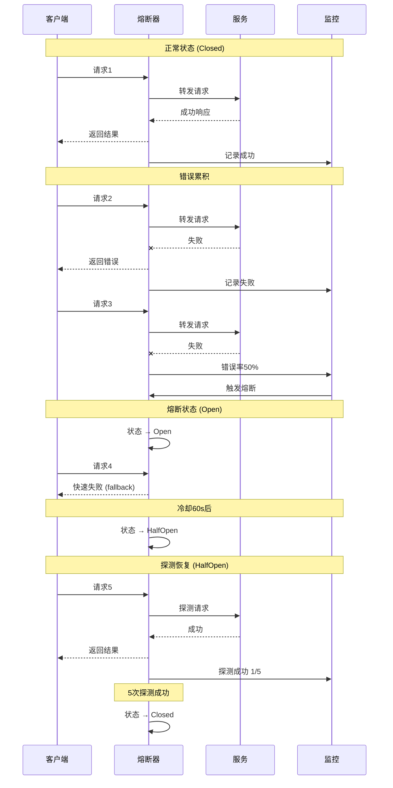

---

## 🔍 限流架构图

### 令牌桶算法

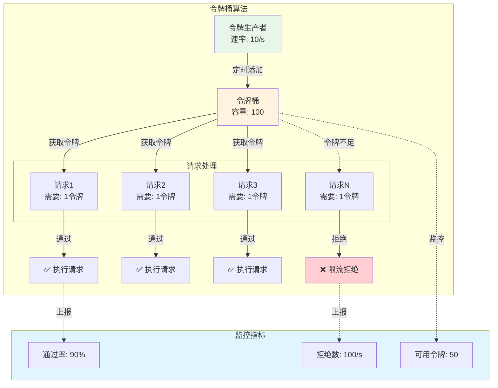

### 限流决策流程

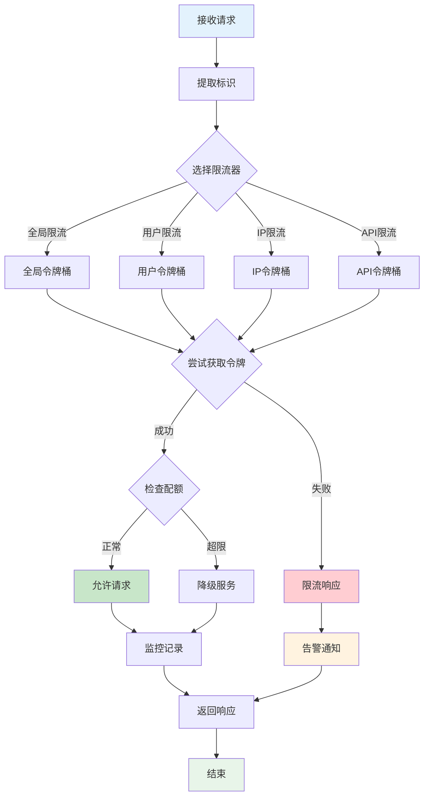

---

## 🔧 分布式事务架构

### Saga模式

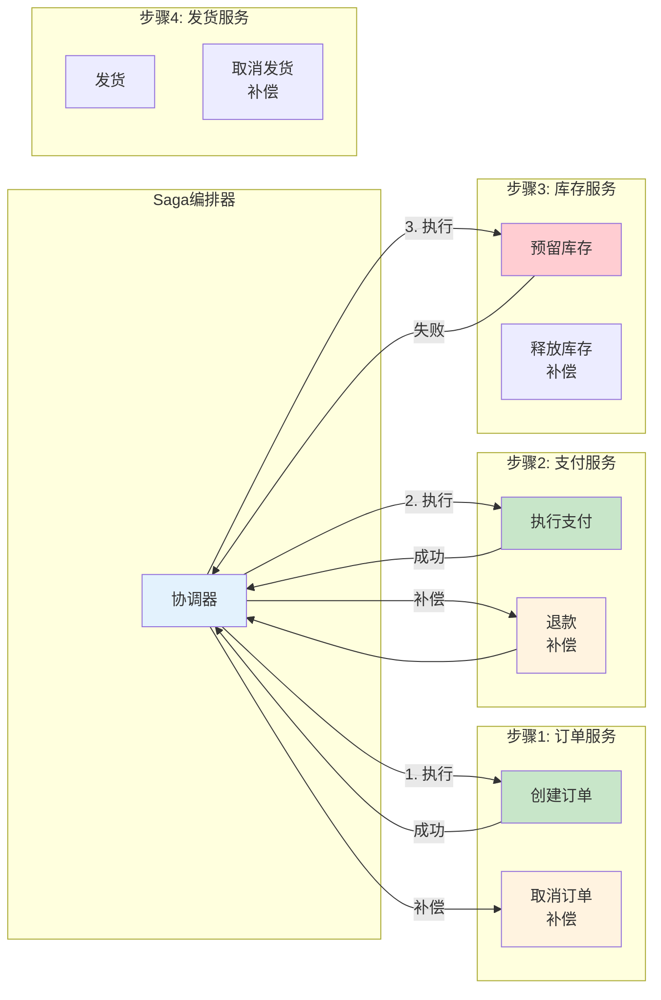

### 2PC与3PC对比

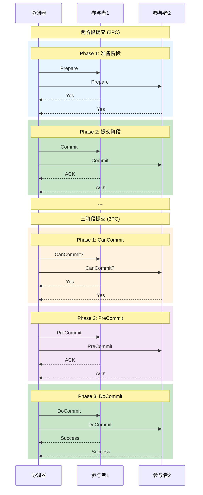

---

## 📊 可观测性架构

### 三大支柱

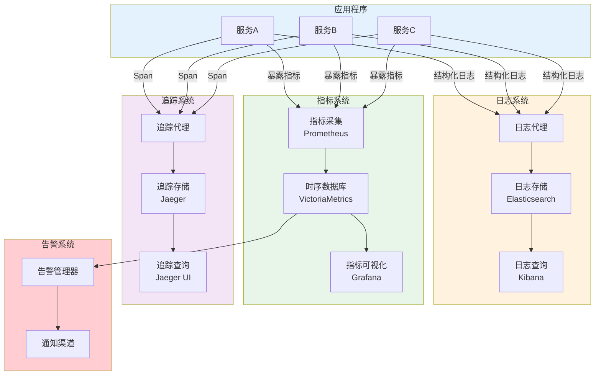

### 监控告警流程

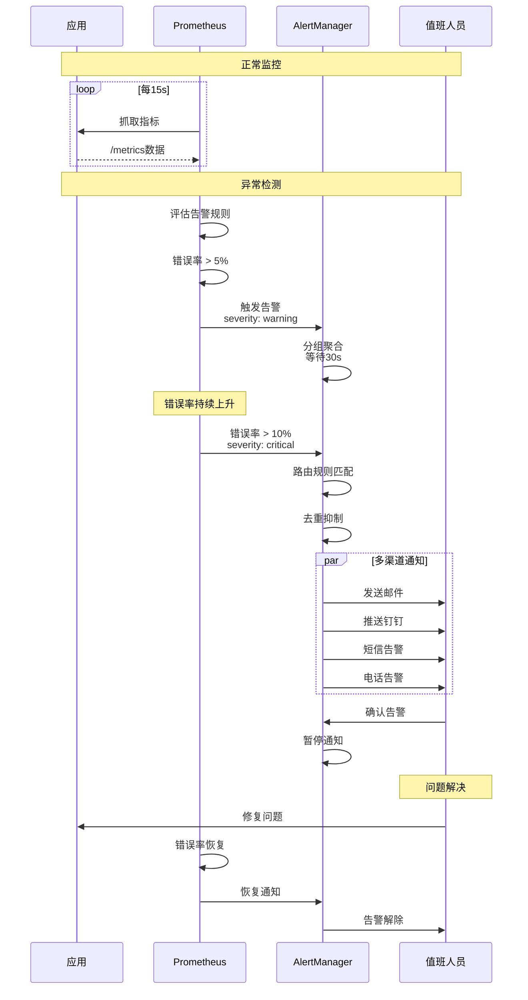

---

## 🌟 测试金字塔

### 测试层次架构

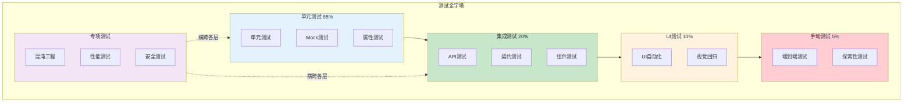

---

## 🔬 生产部署架构

### 高可用架构

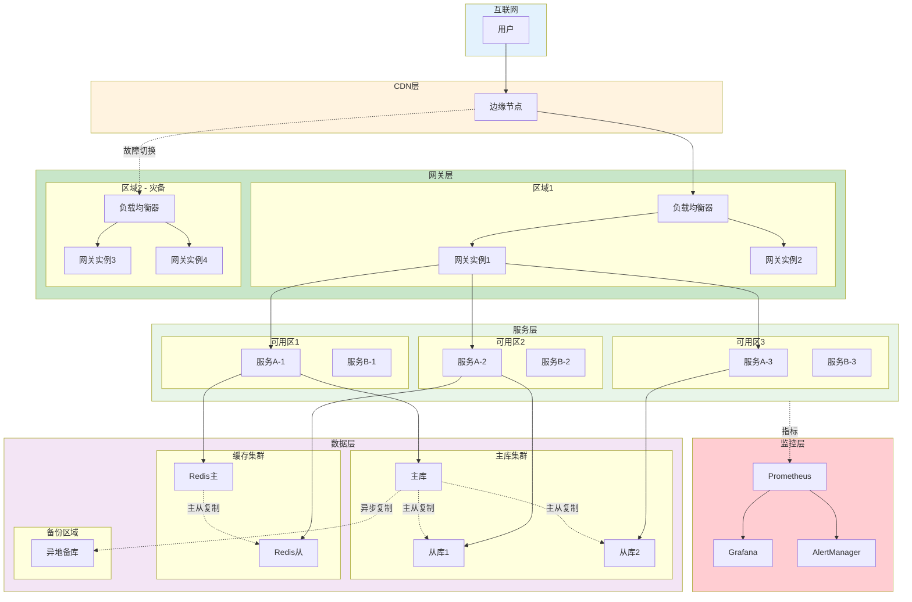

---

## 相关文档

- [知识图谱](./KNOWLEDGE_GRAPH_AND_CONCEPT_RELATIONS.md)
- [多维矩阵](./MULTI_DIMENSIONAL_COMPARISON_MATRIX.md)
- [FAQ](../FAQ.md)
- [架构指南](../architecture/)

---

**文档版本**: v1.0  
**最后更新**: 2025-10-20  
**维护者**: Rust-lang项目组

---

## 返回导航

- [返回主索引](../00_MASTER_INDEX.md)
- [返回README](../README.md)
- [查看指南](../guides/)
