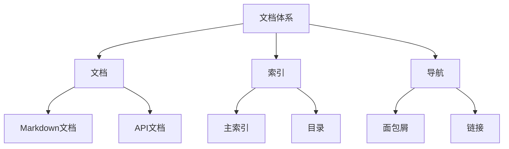

# 文档体系核心概念

**版本**: 1.0  
**日期**: 2025年10月28日  
**状态**: ✅ 完整

---

## 📋 目录

1. [文档体系概念](#1-文档体系概念)
2. [索引与导航概念](#2-索引与导航概念)
3. [文档分类概念](#3-文档分类概念)
4. [质量保证概念](#4-质量保证概念)
5. [维护流程概念](#5-维护流程概念)

---

## 1. 文档体系概念

### 1.1 文档体系 (Documentation System)

#### 定义
**形式化定义**: 文档体系 DS = (D, R, I, Q)，其中：
- D: 文档集合
- R: 文档关系
- I: 索引结构
- Q: 质量标准

**通俗解释**: 有组织的文档集合，包含文档、关系、索引和质量控制。

#### 内涵（本质特征）
- **完整性**: 覆盖所有必要主题
- **一致性**: 统一的格式和风格
- **可导航性**: 清晰的索引和链接
- **可维护性**: 易于更新和扩展
- **质量保证**: 明确的质量标准

#### 外延（涵盖范围）
- 包含: 技术文档、教程、API参考、理论分析
- 不包含: 源代码、测试数据、临时笔记

#### 属性

| 属性 | 值/范围 | 说明 |
|------|---------|------|
| 文档总数 | 100+ | 当前文档数量 |
| 目录数量 | 14 | 顶层目录数 |
| 层次深度 | 3-4 | 目录嵌套层数 |
| 更新频率 | 每周 | 主要文档更新频率 |
| 质量评分 | 8.5/10 | 综合质量评分 |

#### 关系
- 与**知识管理**的关系: 文档体系是知识管理的具体实现
- 与**版本控制**的关系: 文档体系依赖版本控制
- 与**团队协作**的关系: 文档体系支撑团队协作

---

### 1.2 文档 (Document)

#### 定义
**形式化定义**: 文档 d = (c, m, l)，其中：
- c: 内容 (Content)
- m: 元数据 (Metadata)
- l: 链接 (Links)

**通俗解释**: 包含特定主题信息的文本文件，具有元数据和链接。

#### 内涵
- **主题明确**: 聚焦特定主题
- **结构清晰**: 逻辑层次分明
- **内容准确**: 信息正确可靠
- **格式统一**: 遵循格式标准
- **可引用**: 可被其他文档引用

#### 外延
- 包含: Markdown文件、mdBook章节、README文件
- 不包含: 图片文件、配置文件、数据文件

#### 属性

| 属性 | 值/范围 | 说明 |
|------|---------|------|
| 格式 | Markdown | 文档格式 |
| 编码 | UTF-8 | 字符编码 |
| 大小 | 1KB-500KB | 典型文件大小 |
| 版本 | Semantic | 版本号格式 |
| 状态 | 活跃/归档/草稿 | 文档状态 |

---

## 2. 索引与导航概念

### 2.1 索引 (Index)

#### 定义
**形式化定义**: 索引 I = (E, M)，其中：
- E: 条目集合 {e₁, e₂, ..., eₙ}
- M: 映射函数 M: E → D（条目到文档的映射）

**通俗解释**: 帮助用户快速找到所需文档的目录和链接集合。

#### 内涵
- **完整覆盖**: 包含所有重要文档
- **分类清晰**: 合理的分类结构
- **易于查找**: 支持多种查找方式
- **及时更新**: 与文档同步更新

#### 外延
- 包含: MAIN_INDEX、SUMMARY、目录树
- 不包含: 搜索引擎、全文索引

#### 属性

| 属性 | 值/范围 | 说明 |
|------|---------|------|
| 条目数量 | 100+ | 索引条目数 |
| 层次深度 | 3 | 索引嵌套层数 |
| 更新频率 | 实时 | 索引更新频率 |
| 链接准确性 | 99%+ | 链接有效率 |

#### 关系
- 与**文档**的关系: 索引指向文档
- 与**导航**的关系: 索引是导航的基础
- 与**搜索**的关系: 索引补充搜索功能

---

### 2.2 导航 (Navigation)

#### 定义
**形式化定义**: 导航 N = (P, T)，其中：
- P: 路径集合 {p₁, p₂, ..., pₙ}
- T: 转换函数 T: S → S'（从状态S到状态S'）

**通俗解释**: 用户在文档间移动和探索的路径和方法。

#### 内涵
- **直观性**: 易于理解和使用
- **多路径**: 支持多种导航方式
- **上下文感知**: 提供相关链接
- **面包屑**: 显示当前位置

#### 外延
- 包含: 目录导航、面包屑、相关链接、快速跳转
- 不包含: 搜索功能、全文浏览

#### 示例

```markdown
# 导航示例

## 面包屑导航
Home > docs > 00_INDEX > README.md

## 相关链接
- [上一篇: SUMMARY](./SUMMARY.md)
- [下一篇: MAIN_INDEX](./MAIN_INDEX.md)
- [返回上级: docs](../)

## 快速跳转
- [01 快速开始](../01_GETTING_STARTED/)
- [03 API参考](../03_API_REFERENCE/)
```

---

### 2.3 知识图谱 (Knowledge Graph)

#### 定义
**形式化定义**: 知识图谱 KG = (C, R, A)，其中：
- C: 概念集合 {c₁, c₂, ..., cₙ}
- R: 关系集合 {r₁, r₂, ..., rₘ}
- A: 属性集合 {a₁, a₂, ..., aₖ}

**通俗解释**: 展示概念之间关系和属性的网络结构。

#### 内涵
- **概念清晰**: 每个概念有明确定义
- **关系明确**: 概念间关系清晰
- **层次化**: 有清晰的层次结构
- **可视化**: 支持图形化展示

#### 外延
- 包含: 概念网络、关系图、属性定义
- 不包含: 完整文档内容、代码实现

#### 示例



---

## 3. 文档分类概念

### 3.1 按用途分类

#### 3.1.1 教程文档 (Tutorial)

**定义**: 引导用户逐步学习的文档。

**特征**:
- 分步指导
- 包含示例
- 循序渐进
- 面向初学者

**示例**: `01_GETTING_STARTED/README.md`

---

#### 3.1.2 参考文档 (Reference)

**定义**: 提供详细技术信息的文档。

**特征**:
- 详细完整
- 准确性高
- 易于查找
- 面向开发者

**示例**: `03_API_REFERENCE/`

---

#### 3.1.3 指南文档 (Guide)

**定义**: 提供实践指导的文档。

**特征**:
- 实践导向
- 最佳实践
- 场景化
- 面向实践者

**示例**: `12_GUIDES/`

---

#### 3.1.4 理论文档 (Theoretical)

**定义**: 深入分析原理和理论的文档。

**特征**:
- 深度分析
- 理论完整
- 学术性强
- 面向研究者

**示例**: `02_THEORETICAL_FRAMEWORK/`

---

### 3.2 按角色分类

#### 3.2.1 新手文档

**目标读者**: 初次接触项目的用户

**包含内容**:
- 快速开始
- 基础教程
- 常见问题

**推荐文档**:
- 01_GETTING_STARTED
- 11_EXAMPLES (basic)

---

#### 3.2.2 开发者文档

**目标读者**: 使用项目开发的工程师

**包含内容**:
- API参考
- 实现指南
- 代码示例

**推荐文档**:
- 03_API_REFERENCE
- 05_IMPLEMENTATION
- 09_CRATES

---

#### 3.2.3 架构师文档

**目标读者**: 系统架构设计人员

**包含内容**:
- 架构设计
- 技术选型
- 最佳实践

**推荐文档**:
- 04_ARCHITECTURE
- 02_THEORETICAL_FRAMEWORK
- 13_PLANNING

---

## 4. 质量保证概念

### 4.1 文档质量 (Documentation Quality)

#### 定义
**形式化定义**: 质量 Q = f(A, C, U, M)，其中：
- A: 准确性 (Accuracy)
- C: 完整性 (Completeness)
- U: 可用性 (Usability)
- M: 可维护性 (Maintainability)

**通俗解释**: 文档满足用户需求的程度。

#### 质量维度

| 维度 | 定义 | 评分标准 |
|------|------|----------|
| **准确性** | 信息正确性 | 0-10分 |
| **完整性** | 内容完整度 | 0-10分 |
| **可读性** | 易于理解 | 0-10分 |
| **实用性** | 解决问题能力 | 0-10分 |
| **维护性** | 易于更新 | 0-10分 |

#### 评估公式

```
总分 = (准确性 × 0.25) + (完整性 × 0.25) + 
       (可读性 × 0.20) + (实用性 × 0.20) + 
       (维护性 × 0.10)
```

---

### 4.2 文档标准 (Documentation Standard)

#### 定义
**形式化定义**: 标准 S = (F, R, C)，其中：
- F: 格式规范 (Format)
- R: 规则集合 (Rules)
- C: 检查清单 (Checklist)

**通俗解释**: 文档必须遵循的格式、规则和检查项。

#### 核心标准

1. **格式标准**
   - 使用Markdown格式
   - 统一标题编号 (1. 2. 3.)
   - 标准文档头部

2. **内容标准**
   - 必须有目录
   - 必须有示例
   - 必须有总结

3. **质量标准**
   - 代码可运行
   - 链接有效
   - 无拼写错误

---

## 5. 维护流程概念

### 5.1 文档生命周期

#### 定义
**形式化定义**: 生命周期 L = (S₀, S₁, ..., Sₙ, T)，其中：
- Sᵢ: 状态 (State)
- T: 转换函数 (Transition)

**状态转换**:
```
草稿 → 审核中 → 已发布 → 维护中 → 归档
```

#### 各阶段说明

| 阶段 | 说明 | 责任人 | 时长 |
|------|------|--------|------|
| **草稿** | 初始编写 | 作者 | 1-5天 |
| **审核中** | 同行评审 | 审核人 | 1-3天 |
| **已发布** | 正式发布 | 维护者 | - |
| **维护中** | 定期更新 | 维护者 | 持续 |
| **归档** | 不再维护 | - | - |

---

### 5.2 更新流程 (Update Process)

#### 定义
**形式化定义**: 更新 U = (Δ, V, R)，其中：
- Δ: 变更集 (Changes)
- V: 验证 (Validation)
- R: 审核 (Review)

#### 更新步骤

1. **确定更新需求**
   - 用户反馈
   - 代码变更
   - 技术更新

2. **编写更新**
   - 修改文档
   - 更新版本号
   - 记录变更

3. **验证更新**
   - 链接检查
   - 代码测试
   - 格式检查

4. **审核发布**
   - 同行评审
   - 批准发布
   - 更新索引

---

## 🔗 相关资源

- [主索引](./MAIN_INDEX.md)
- [知识图谱](./KNOWLEDGE_GRAPH.md)
- [对比矩阵](./COMPARISON_MATRIX.md)
- [维护指南](./MAINTENANCE_GUIDE.md)

---

**版本**: 1.0  
**创建日期**: 2025-10-28  
**最后更新**: 2025-10-28  
**维护团队**: OTLP_rust文档团队

