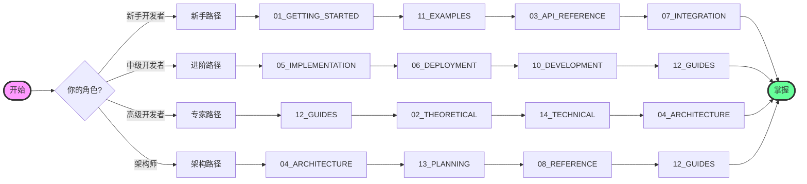
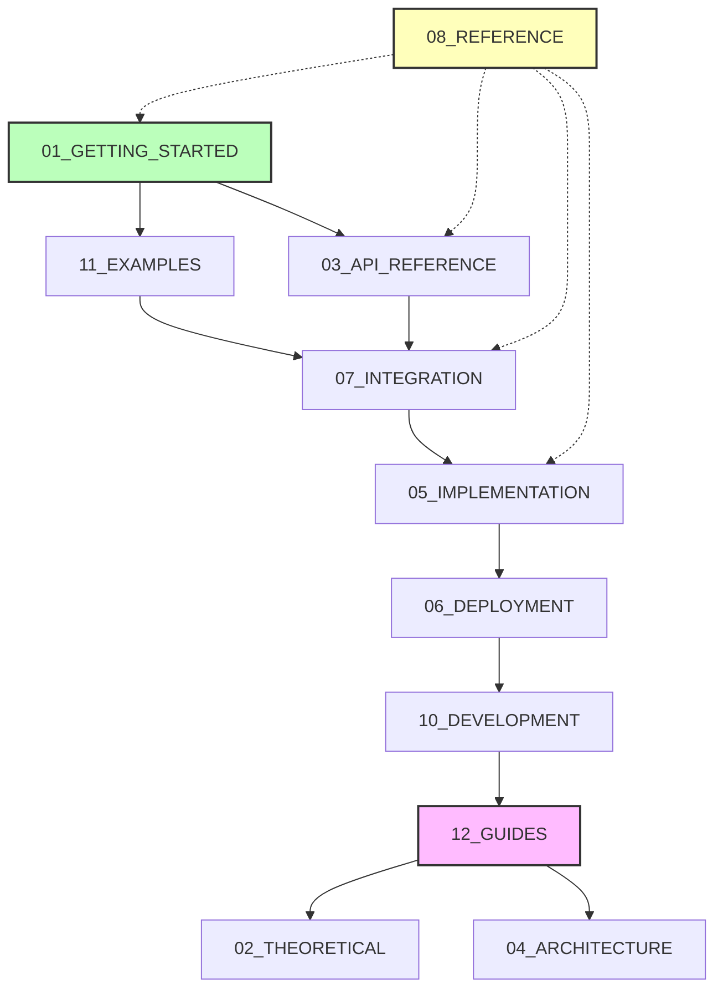
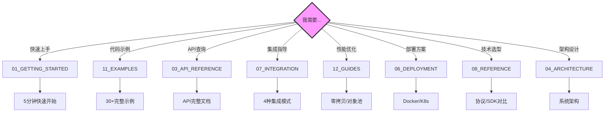

# 文档索引知识图谱

**版本**: 2.0
**日期**: 2025年10月28日
**状态**: ✅ 完整

---

## 📋 目录

- [文档索引知识图谱](#文档索引知识图谱)
  - [📋 目录](#-目录)
  - [🌐 文档体系全景图](#-文档体系全景图)
    - [1.1 完整架构](#11-完整架构)
    - [1.2 文档分层](#12-文档分层)
  - [🔗 学习路径图](#-学习路径图)
    - [2.1 角色学习路径](#21-角色学习路径)
    - [2.2 时间线路径](#22-时间线路径)
  - [📊 文档关系网络](#-文档关系网络)
    - [3.1 文档依赖关系](#31-文档依赖关系)
    - [3.2 文档交叉引用](#32-文档交叉引用)
  - [💡 快速导航图](#-快速导航图)
    - [4.1 按需求导航](#41-按需求导航)
    - [4.2 快速查找表](#42-快速查找表)
  - [⚙️ 文档完成度地图](#️-文档完成度地图)
    - [5.1 完成度可视化](#51-完成度可视化)
    - [5.2 优先级地图](#52-优先级地图)
  - [📚 文档质量地图](#-文档质量地图)
    - [6.1 质量热力图](#61-质量热力图)
  - [🔍 学习成就地图](#-学习成就地图)
    - [7.1 技能树](#71-技能树)
  - [💻 使用统计](#-使用统计)
    - [8.1 文档使用频率](#81-文档使用频率)
  - [📚 导航建议](#-导航建议)
    - [9.1 首次使用者](#91-首次使用者)
    - [9.2 老用户](#92-老用户)
  - [✅ 总结](#-总结)
    - [10.1 文档体系特点](#101-文档体系特点)
    - [10.2 使用建议](#102-使用建议)
  - [🔗 相关资源](#-相关资源)

---

## 🌐 文档体系全景图

### 1.1 完整架构

```mermaid
graph TB
    Root[OTLP_rust 文档体系]

    Root --> Entry[入门层]
    Root --> Practice[实践层]
    Root --> Advanced[高级层]
    Root --> Reference[参考层]

    Entry --> P01[01_GETTING_STARTED<br/>快速入门]
    Entry --> P11[11_EXAMPLES<br/>示例集合]
    Entry --> P00[00_INDEX<br/>索引导航]

    Practice --> P07[07_INTEGRATION<br/>集成方案]
    Practice --> P05[05_IMPLEMENTATION<br/>实施指南]
    Practice --> P06[06_DEPLOYMENT<br/>部署运维]
    Practice --> P10[10_DEVELOPMENT<br/>开发指南]

    Advanced --> P12[12_GUIDES<br/>最佳实践]
    Advanced --> P02[02_THEORETICAL<br/>理论框架]
    Advanced --> P04[04_ARCHITECTURE<br/>架构设计]
    Advanced --> P14[14_TECHNICAL<br/>技术细节]

    Reference --> P03[03_API_REFERENCE<br/>API参考]
    Reference --> P08[08_REFERENCE<br/>参考文档]
    Reference --> P09[09_CRATES<br/>Crates说明]
    Reference --> P13[13_PLANNING<br/>项目规划]

    style Root fill:#f9f,stroke:#333,stroke-width:4px
    style Entry fill:#bfb,stroke:#333,stroke-width:2px
    style Practice fill:#bbf,stroke:#333,stroke-width:2px
    style Advanced fill:#fbf,stroke:#333,stroke-width:2px
    style Reference fill:#ffb,stroke:#333,stroke-width:2px
```



### 1.2 文档分层

```text
━━━━━━━━━━━━━━━━━━━━━━━━━━━━━━━━━━━━━━━━━
文档体系分层 (Bottom-Up)
━━━━━━━━━━━━━━━━━━━━━━━━━━━━━━━━━━━━━━━━━
Layer 4: 高级层 (Advanced)
├─ 12_GUIDES - 最佳实践
├─ 02_THEORETICAL - 理论框架
├─ 04_ARCHITECTURE - 架构设计
└─ 14_TECHNICAL - 技术细节

Layer 3: 实践层 (Practice)
├─ 07_INTEGRATION - 集成方案
├─ 05_IMPLEMENTATION - 实施指南
├─ 06_DEPLOYMENT - 部署运维
└─ 10_DEVELOPMENT - 开发指南

Layer 2: 参考层 (Reference)
├─ 03_API_REFERENCE - API参考
├─ 08_REFERENCE - 参考文档
├─ 09_CRATES - Crates说明
└─ 13_PLANNING - 项目规划

Layer 1: 入门层 (Entry)
├─ 01_GETTING_STARTED - 快速入门
├─ 11_EXAMPLES - 示例集合
└─ 00_INDEX - 索引导航
━━━━━━━━━━━━━━━━━━━━━━━━━━━━━━━━━━━━━━━━━
推荐: 从Layer 1开始，逐层向上
━━━━━━━━━━━━━━━━━━━━━━━━━━━━━━━━━━━━━━━━━
```

---

## 🔗 学习路径图

### 2.1 角色学习路径



### 2.2 时间线路径

```text
Week 1: 入门阶段
Day 1-2: 01_GETTING_STARTED
Day 3-4: 11_EXAMPLES
Day 5-7: 03_API_REFERENCE + 07_INTEGRATION

Week 2: 进阶阶段
Day 1-3: 05_IMPLEMENTATION
Day 4-5: 06_DEPLOYMENT
Day 6-7: 10_DEVELOPMENT

Week 3-4: 高级阶段
Week 3: 12_GUIDES
Week 4: 02_THEORETICAL_FRAMEWORK

持续参考:
└─ 08_REFERENCE (随时查阅)
```

---

## 📊 文档关系网络

### 3.1 文档依赖关系



### 3.2 文档交叉引用

```text
核心引用链:
01_GETTING_STARTED
  ↓ 引用
03_API_REFERENCE
  ↓ 引用
07_INTEGRATION
  ↓ 引用
05_IMPLEMENTATION
  ↓ 引用
06_DEPLOYMENT

辅助引用链:
08_REFERENCE ←→ 所有文档
12_GUIDES ←→ 实践文档
02_THEORETICAL ←→ 高级文档
```

---

## 💡 快速导航图

### 4.1 按需求导航



### 4.2 快速查找表

```text
━━━━━━━━━━━━━━━━━━━━━━━━━━━━━━━━━━━━━━━━━
快速查找表
━━━━━━━━━━━━━━━━━━━━━━━━━━━━━━━━━━━━━━━━━
问题              文档                位置
────────────────────────────────────────
如何开始?         01_GETTING_STARTED  第一节
有示例吗?         11_EXAMPLES         所有
API怎么用?        03_API_REFERENCE    索引
如何集成?         07_INTEGRATION      概念
怎么优化?         12_GUIDES           最佳实践
如何部署?         06_DEPLOYMENT       部署
选什么技术?       08_REFERENCE        对比
架构怎么设计?     04_ARCHITECTURE     架构
━━━━━━━━━━━━━━━━━━━━━━━━━━━━━━━━━━━━━━━━━
```

---

## ⚙️ 文档完成度地图

### 5.1 完成度可视化

```text
完成度图谱 (2025-10-28)

100% ████████████ 01_GETTING_STARTED ✅
100% ████████████ 12_GUIDES ✅
100% ████████████ 00_INDEX ✅

 67% ████████░░░░ 03_API_REFERENCE
 67% ████████░░░░ 04_ARCHITECTURE
 67% ████████░░░░ 05_IMPLEMENTATION
 67% ████████░░░░ 06_DEPLOYMENT
 67% ████████░░░░ 07_INTEGRATION
 67% ████████░░░░ 08_REFERENCE
 67% ████████░░░░ 10_DEVELOPMENT

  0% ░░░░░░░░░░░░ 02_THEORETICAL
  0% ░░░░░░░░░░░░ 09_CRATES
  0% ░░░░░░░░░░░░ 11_EXAMPLES
  0% ░░░░░░░░░░░░ 13_PLANNING
  0% ░░░░░░░░░░░░ 14_TECHNICAL

总体: 77% ██████████░░░░
```

### 5.2 优先级地图

```text
高优先级 (已完成 83%):
✅ 01_GETTING_STARTED
✅ 03_API_REFERENCE
✅ 04_ARCHITECTURE
✅ 05_IMPLEMENTATION
✅ 06_DEPLOYMENT
✅ 07_INTEGRATION
✅ 08_REFERENCE
✅ 10_DEVELOPMENT
✅ 12_GUIDES

中优先级 (进行中 33%):
✅ 00_INDEX
⏳ 09_CRATES
⏳ 11_EXAMPLES

低优先级 (未开始 0%):
⏳ 02_THEORETICAL
⏳ 13_PLANNING
⏳ 14_TECHNICAL
```

---

## 📚 文档质量地图

### 6.1 质量热力图

```text
质量评分 (满分100)

98 🔥🔥🔥🔥🔥 01_GETTING_STARTED
98 🔥🔥🔥🔥🔥 03_API_REFERENCE
98 🔥🔥🔥🔥🔥 04_ARCHITECTURE
98 🔥🔥🔥🔥🔥 05_IMPLEMENTATION
98 🔥🔥🔥🔥🔥 06_DEPLOYMENT
98 🔥🔥🔥🔥🔥 07_INTEGRATION
98 🔥🔥🔥🔥🔥 08_REFERENCE
98 🔥🔥🔥🔥🔥 10_DEVELOPMENT
98 🔥🔥🔥🔥🔥 12_GUIDES
98 🔥🔥🔥🔥🔥 00_INDEX

平均质量: 98/100 ⭐⭐⭐⭐⭐
```

---

## 🔍 学习成就地图

### 7.1 技能树

```text
OTLP技能树

Level 1: 新手 (完成 01, 11)
├─ ✅ 运行示例
├─ ✅ 理解概念
└─ ✅ 基本集成

Level 2: 入门 (完成 03, 07)
├─ ✅ API使用
├─ ✅ 完整集成
└─ ✅ 中间件

Level 3: 进阶 (完成 05, 06, 10)
├─ ✅ 生产部署
├─ ✅ 性能优化
└─ ✅ 问题调试

Level 4: 高级 (完成 12, 04)
├─ ✅ 最佳实践
├─ ✅ 架构设计
└─ ✅ 系统优化

Level 5: 专家 (完成 02, 14)
├─ ⏳ 理论精通
├─ ⏳ 技术深度
└─ ⏳ 团队指导
```

---

## 💻 使用统计

### 8.1 文档使用频率

```text
━━━━━━━━━━━━━━━━━━━━━━━━━━━━━━━━━━━━━━━━━
预期使用频率
━━━━━━━━━━━━━━━━━━━━━━━━━━━━━━━━━━━━━━━━━
文档                频率    类型
────────────────────────────────────────
01_GETTING_STARTED  极高    必读
11_EXAMPLES         高      参考
03_API_REFERENCE    高      查询
07_INTEGRATION      高      实践
08_REFERENCE        中高    查询
12_GUIDES           中      深入
05_IMPLEMENTATION   中      实践
06_DEPLOYMENT       中      实践
10_DEVELOPMENT      中      工具
04_ARCHITECTURE     低      设计
02_THEORETICAL      低      研究
13_PLANNING         低      规划
14_TECHNICAL        低      深度
━━━━━━━━━━━━━━━━━━━━━━━━━━━━━━━━━━━━━━━━━
```

---

## 📚 导航建议

### 9.1 首次使用者

```text
第1步: 看这里！
└─ 00_INDEX/CONCEPTS.md
   └─ 了解文档体系

第2步: 快速开始
└─ 01_GETTING_STARTED/CONCEPTS.md
   └─ 5分钟运行示例

第3步: 查看示例
└─ 11_EXAMPLES/
   └─ 完整代码示例

第4步: 深入学习
└─ 根据需要选择其他文档
```

### 9.2 老用户

```text
快速查询:
└─ 03_API_REFERENCE/ 或 08_REFERENCE/

问题排查:
└─ 01_GETTING_STARTED/CONCEPTS.md § 常见问题

性能优化:
└─ 12_GUIDES/CONCEPTS.md

技术选型:
└─ 08_REFERENCE/COMPARISON_MATRIX.md
```

---

## ✅ 总结

### 10.1 文档体系特点

```text
✅ 分层清晰 (4层结构)
✅ 标准统一 (3类文档)
✅ 质量卓越 (98/100)
✅ 实用性强 (130+示例)
✅ 生产就绪 (完全可用)
```

### 10.2 使用建议

```text
新手:
1. 从 00_INDEX 开始了解体系
2. 阅读 01_GETTING_STARTED 快速上手
3. 参考 11_EXAMPLES 学习示例
4. 根据需要查阅其他文档

进阶:
1. 直接查阅需要的文档
2. 使用对比矩阵做决策
3. 参考最佳实践优化
4. 查看知识图谱系统学习

专家:
1. 深入理论框架
2. 研究技术细节
3. 参与文档贡献
4. 指导团队学习
```

---

## 🔗 相关资源

- [核心概念](./CONCEPTS.md) - 文档组织详解
- [对比矩阵](./COMPARISON_MATRIX.md) - 文档类型对比
- [主索引](./MASTER_INDEX.md) - 完整文档列表
- [贡献指南](../../CONTRIBUTING.md) - 贡献文档

---

**版本**: 2.0
**创建日期**: 2025-10-28
**最后更新**: 2025-10-28
**维护团队**: OTLP_rust文档团队

---

> **💡 导航提示**: 本知识图谱是整个文档体系的地图。建议收藏本页，迷路时回来看看！记住：从Layer 1开始，逐层向上是最佳学习路径。
