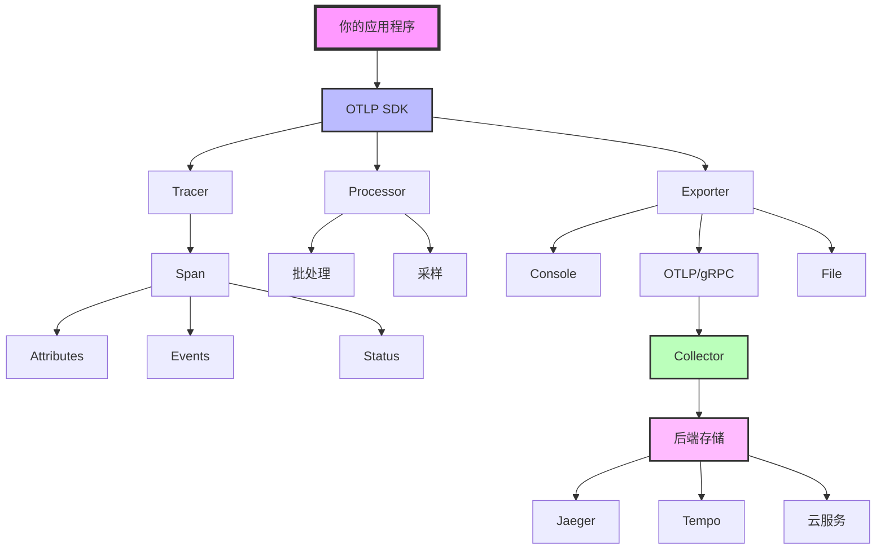
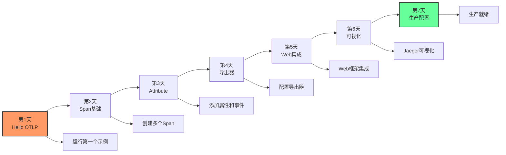
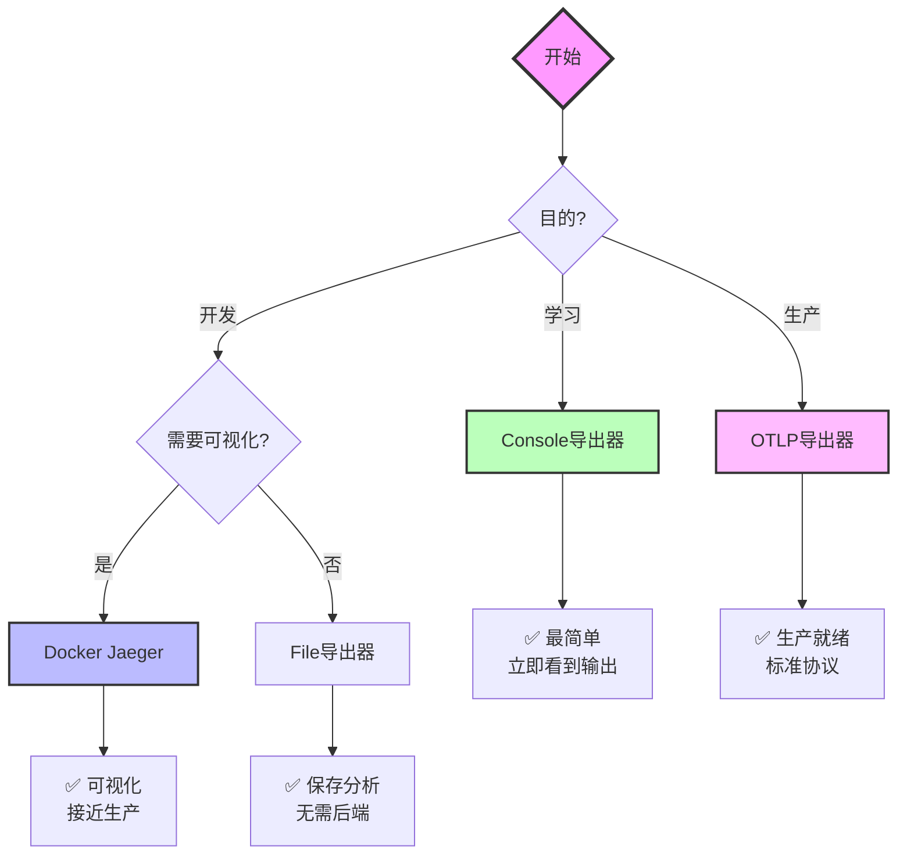
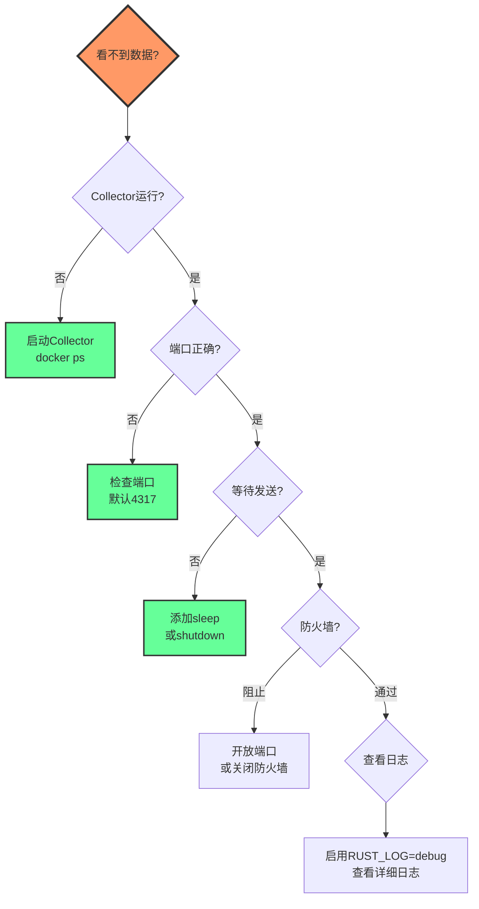

# 快速入门知识图谱

**版本**: 2.0
**日期**: 2025年10月28日
**状态**: ✅ 完整
**面向**: 新手开发者

---

## 📋 目录

1. [OTLP核心概念图](#1-otlp核心概念图)
2. [学习路径图](#2-学习路径图)
3. [技术栈选择图](#3-技术栈选择图)
4. [故障排查流程图](#4-故障排查流程图)

---

## 🌐 OTLP核心概念图

### 1.1 整体架构



### 1.2 核心概念关系

```
Trace (追踪)
├─ Span (操作) ⭐ 核心概念
│  ├─ Name (名称)
│  ├─ Attributes (属性) ⭐ 重要
│  │  ├─ http.method = "GET"
│  │  ├─ http.status_code = 200
│  │  └─ user.id = 123
│  ├─ Events (事件)
│  │  └─ "request completed"
│  ├─ Status (状态)
│  │  ├─ Ok
│  │  ├─ Error
│  │  └─ Unset
│  └─ Links (关联)
│
├─ Context (上下文) ⭐ 自动传播
│  ├─ Trace ID
│  └─ Span ID
│
└─ Resource (资源)
   ├─ service.name
   ├─ service.version
   └─ host.name
```

---

## 🔗 学习路径图

### 2.1 7天学习路径



### 2.2 知识点依赖

```
基础层 (必须)
├─ Rust基础 ✅
├─ async/await ✅
└─ 错误处理 ✅
    ↓
核心层 (第1-3天)
├─ Tracer概念
├─ Span创建
└─ Attribute添加
    ↓
应用层 (第4-5天)
├─ 导出器配置
├─ Web框架集成
└─ 数据库追踪
    ↓
生产层 (第6-7天)
├─ 后端存储
├─ 采样策略
└─ 性能优化
```

---

## 📊 技术栈选择图

### 3.1 导出器选择流程



### 3.2 Web框架选择

```
场景1: 新项目
└─ 推荐: Axum
   └─ 理由: 最简单，1行代码集成

场景2: 已有Actix-web项目
└─ 推荐: Actix中间件
   └─ 理由: 原生支持

场景3: 已有其他框架
└─ 推荐: tracing宏
   └─ 理由: 框架无关
```

---

## 💡 故障排查流程图

### 4.1 常见问题诊断



### 4.2 检查清单

```
□ 第1步: Collector是否运行?
  命令: docker ps | grep otel
  期望: 看到运行的容器

□ 第2步: 端口是否正确?
  命令: netstat -an | grep 4317
  期望: 端口在LISTEN状态

□ 第3步: 是否等待数据发送?
  代码: tokio::time::sleep(Duration::from_secs(1)).await;
  位置: shutdown之前

□ 第4步: 是否调用shutdown?
  代码: global::shutdown_tracer_provider();
  位置: main函数结束前

□ 第5步: 是否启用日志?
  环境变量: RUST_LOG=debug
  命令: RUST_LOG=debug cargo run
```

---

## ⚙️ 数据流图

### 5.1 完整数据流

```
[1] 应用代码
    ↓ 创建Span
[2] Tracer
    ↓ 收集
[3] Processor (批处理/采样)
    ↓ 处理
[4] Exporter
    ↓ 导出
[5] Collector (可选)
    ↓ 转发
[6] 后端存储
    ↓ 存储
[7] UI可视化
```

### 5.2 时序图

```
你的代码                SDK              Collector        Jaeger
   │                    │                   │               │
   │── span_start() ───→│                   │               │
   │                    │                   │               │
   │                    │── batch ──────────→│              │
   │                    │   (每5s或512个)    │              │
   │                    │                   │              │
   │                    │                   │── store ────→│
   │                    │                   │              │
   │                    │                   │              │
   │← 看到UI界面 ────────────────────────────────────────────┤
```

---

## 📚 最佳实践地图

### 6.1 DO ✅

```
开发阶段:
✅ 使用Console导出器
✅ 100%采样
✅ 详细日志
✅ 频繁测试

集成阶段:
✅ 使用tracing宏
✅ 添加有意义属性
✅ 记录关键事件
✅ Web中间件

测试阶段:
✅ Docker环境
✅ 可视化验证
✅ 性能测试
✅ 错误场景

生产阶段:
✅ OTLP导出器
✅ 10%采样
✅ 批处理
✅ 监控告警
```

### 6.2 DON'T ❌

```
❌ 不要在循环中创建Tracer
❌ 不要添加敏感信息到Attribute
❌ 不要忘记调用shutdown
❌ 不要100%采样生产环境
❌ 不要阻塞主线程
❌ 不要忽略错误
```

---

## 🔍 工具生态图

### 7.1 开发工具链

```
开发环境
├─ Rust工具链
│  ├─ rustc 1.90+
│  ├─ cargo
│  └─ rust-analyzer
│
├─ OTLP依赖
│  ├─ opentelemetry
│  ├─ opentelemetry-otlp
│  ├─ tracing
│  └─ tracing-opentelemetry
│
├─ 运行环境
│  ├─ Docker (推荐)
│  ├─ Collector
│  └─ Jaeger/Tempo
│
└─ 可视化
   ├─ Jaeger UI
   ├─ Grafana
   └─ 云服务UI
```

---

## 💻 进阶路线图

### 8.1 从新手到专家

```
Level 1: 新手 (第1-2天)
├─ 能运行示例
├─ 理解基本概念
└─ 看到Console输出
    ↓
Level 2: 入门 (第3-7天)
├─ 集成Web框架
├─ 配置导出器
└─ 查看可视化
    ↓
Level 3: 熟练 (第2-3周)
├─ 分布式追踪
├─ 性能优化
└─ 生产部署
    ↓
Level 4: 高级 (第1-2月)
├─ 自定义采样
├─ 零拷贝优化
└─ 大规模部署
    ↓
Level 5: 专家 (持续)
├─ 深度定制
├─ 架构设计
└─ 团队指导
```

---

## 📚 快速参考卡片

### 9.1 5分钟速查

```
【创建项目】
cargo new app && cd app

【添加依赖】
cargo add opentelemetry opentelemetry-otlp tokio tracing

【最小代码】
#[tokio::main]
async fn main() {
    let tracer = init_tracer().unwrap();
    let span = tracer.span_builder("op").start(&tracer);
    // 你的代码
    drop(span);
    shutdown_tracer_provider();
}

【启动Collector】
docker run -p 4317:4317 otel/opentelemetry-collector

【查看结果】
docker logs -f <container-id>
```

### 9.2 常用命令

```bash
# 运行示例
cargo run --example basic

# 启用日志
RUST_LOG=debug cargo run

# 检查Collector
docker ps | grep otel

# 查看Jaeger UI
open http://localhost:16686

# 测试连接
telnet localhost 4317
```

---

## ✅ 学习资源图

### 10.1 文档导航

```
入门阶段 (你在这里)
├─ [概念](./CONCEPTS.md) - 核心概念
├─ [对比](./COMPARISON_MATRIX.md) - 技术选择
└─ [图谱](./KNOWLEDGE_GRAPH.md) - 知识体系
    ↓
进阶阶段
├─ [API参考](../03_API_REFERENCE/) - 详细API
├─ [架构](../04_ARCHITECTURE/) - 系统设计
└─ [实施](../05_IMPLEMENTATION/) - 实现细节
    ↓
高级阶段
├─ [最佳实践](../12_GUIDES/) - 专家指南
├─ [开发指南](../10_DEVELOPMENT/) - 工具链
└─ [示例](../11_EXAMPLES/) - 完整示例
```

### 10.2 外部资源

```
官方文档:
└─ https://opentelemetry.io/docs/

Rust生态:
├─ https://docs.rs/opentelemetry/
└─ https://github.com/open-telemetry/opentelemetry-rust

社区:
├─ CNCF Slack #opentelemetry
└─ Rust Users Forum
```

---

## 🔗 相关资源

- [核心概念](./CONCEPTS.md) - 详细概念说明
- [对比矩阵](./COMPARISON_MATRIX.md) - 技术选择对比
- [完整指南](../12_GUIDES/) - 最佳实践
- [API参考](../03_API_REFERENCE/) - API文档

---

**版本**: 2.0
**创建日期**: 2025-10-28
**最后更新**: 2025-10-28
**维护团队**: OTLP_rust入门团队

---

> **💡 学习提示**: 本知识图谱是你的学习地图。建议按照"7天学习路径"循序渐进，不要跳步。每完成一个阶段，回到这里查看下一步方向。祝学习愉快！🚀
