# 快速入门知识图谱

**版本**: 2.0  
**日期**: 2025年10月28日  
**状态**: ✅ 完整  
**面向**: 新手开发者

---

## 📋 目录

1. [OTLP核心概念图](#1-otlp核心概念图)
2. [学习路径图](#2-学习路径图)
3. [技术栈选择图](#3-技术栈选择图)
4. [故障排查流程图](#4-故障排查流程图)

---

## 1. OTLP核心概念图

### 1.1 整体架构

```mermaid
graph TB
    App[你的应用程序]
    
    App --> SDK[OTLP SDK]
    SDK --> Tracer[Tracer]
    SDK --> Processor[Processor]
    SDK --> Exporter[Exporter]
    
    Tracer --> Span1[Span]
    Span1 --> Attr[Attributes]
    Span1 --> Event[Events]
    Span1 --> Status[Status]
    
    Processor --> Batch[批处理]
    Processor --> Sample[采样]
    
    Exporter --> Console[Console]
    Exporter --> OTLP[OTLP/gRPC]
    Exporter --> File[File]
    
    OTLP --> Collector[Collector]
    Collector --> Backend[后端存储]
    
    Backend --> Jaeger[Jaeger]
    Backend --> Tempo[Tempo]
    Backend --> Cloud[云服务]
    
    style App fill:#f9f,stroke:#333,stroke-width:4px
    style SDK fill:#bbf,stroke:#333,stroke-width:2px
    style Collector fill:#bfb,stroke:#333,stroke-width:2px
    style Backend fill:#fbf,stroke:#333,stroke-width:2px
```



### 1.2 核心概念关系

```
Trace (追踪)
├─ Span (操作) ⭐ 核心概念
│  ├─ Name (名称)
│  ├─ Attributes (属性) ⭐ 重要
│  │  ├─ http.method = "GET"
│  │  ├─ http.status_code = 200
│  │  └─ user.id = 123
│  ├─ Events (事件)
│  │  └─ "request completed"
│  ├─ Status (状态)
│  │  ├─ Ok
│  │  ├─ Error
│  │  └─ Unset
│  └─ Links (关联)
│
├─ Context (上下文) ⭐ 自动传播
│  ├─ Trace ID
│  └─ Span ID
│
└─ Resource (资源)
   ├─ service.name
   ├─ service.version
   └─ host.name
```

---

## 2. 学习路径图

### 2.1 7天学习路径

```mermaid
graph LR
    Day1[第1天<br/>Hello OTLP]
    Day2[第2天<br/>Span基础]
    Day3[第3天<br/>Attribute]
    Day4[第4天<br/>导出器]
    Day5[第5天<br/>Web集成]
    Day6[第6天<br/>可视化]
    Day7[第7天<br/>生产配置]
    
    Day1 --> Day2
    Day2 --> Day3
    Day3 --> Day4
    Day4 --> Day5
    Day5 --> Day6
    Day6 --> Day7
    
    Day1 --> Run1[运行第一个示例]
    Day2 --> Run2[创建多个Span]
    Day3 --> Run3[添加属性和事件]
    Day4 --> Run4[配置导出器]
    Day5 --> Run5[Web框架集成]
    Day6 --> Run6[Jaeger可视化]
    Day7 --> Run7[生产就绪]
    
    style Day1 fill:#f96,stroke:#333,stroke-width:2px
    style Day7 fill:#6f9,stroke:#333,stroke-width:2px
```



### 2.2 知识点依赖

```
基础层 (必须)
├─ Rust基础 ✅
├─ async/await ✅
└─ 错误处理 ✅
    ↓
核心层 (第1-3天)
├─ Tracer概念
├─ Span创建
└─ Attribute添加
    ↓
应用层 (第4-5天)
├─ 导出器配置
├─ Web框架集成
└─ 数据库追踪
    ↓
生产层 (第6-7天)
├─ 后端存储
├─ 采样策略
└─ 性能优化
```

---

## 3. 技术栈选择图

### 3.1 导出器选择流程

```mermaid
graph TD
    Start{开始}
    
    Start --> Purpose{目的?}
    
    Purpose -->|学习| Console[Console导出器]
    Purpose -->|开发| Dev{需要可视化?}
    Purpose -->|生产| Prod[OTLP导出器]
    
    Dev -->|是| Docker[Docker Jaeger]
    Dev -->|否| File[File导出器]
    
    Console --> Easy[✅ 最简单<br/>立即看到输出]
    File --> Save[✅ 保存分析<br/>无需后端]
    Docker --> Visual[✅ 可视化<br/>接近生产]
    Prod --> Ready[✅ 生产就绪<br/>标准协议]
    
    style Start fill:#f9f,stroke:#333,stroke-width:3px
    style Console fill:#bfb,stroke:#333,stroke-width:2px
    style Docker fill:#bbf,stroke:#333,stroke-width:2px
    style Prod fill:#fbf,stroke:#333,stroke-width:2px
```



### 3.2 Web框架选择

```
场景1: 新项目
└─ 推荐: Axum
   └─ 理由: 最简单，1行代码集成

场景2: 已有Actix-web项目
└─ 推荐: Actix中间件
   └─ 理由: 原生支持

场景3: 已有其他框架
└─ 推荐: tracing宏
   └─ 理由: 框架无关
```

---

## 4. 故障排查流程图

### 4.1 常见问题诊断

```mermaid
graph TD
    Problem{看不到数据?}
    
    Problem --> Check1{Collector运行?}
    Check1 -->|否| Fix1[启动Collector<br/>docker ps]
    Check1 -->|是| Check2{端口正确?}
    
    Check2 -->|否| Fix2[检查端口<br/>默认4317]
    Check2 -->|是| Check3{等待发送?}
    
    Check3 -->|否| Fix3[添加sleep<br/>或shutdown]
    Check3 -->|是| Check4{防火墙?}
    
    Check4 -->|阻止| Fix4[开放端口<br/>或关闭防火墙]
    Check4 -->|通过| Check5{查看日志}
    
    Check5 --> Fix5[启用RUST_LOG=debug<br/>查看详细日志]
    
    style Problem fill:#f96,stroke:#333,stroke-width:3px
    style Fix1 fill:#6f9,stroke:#333,stroke-width:2px
    style Fix2 fill:#6f9,stroke:#333,stroke-width:2px
    style Fix3 fill:#6f9,stroke:#333,stroke-width:2px
```



### 4.2 检查清单

```
□ 第1步: Collector是否运行?
  命令: docker ps | grep otel
  期望: 看到运行的容器

□ 第2步: 端口是否正确?
  命令: netstat -an | grep 4317
  期望: 端口在LISTEN状态

□ 第3步: 是否等待数据发送?
  代码: tokio::time::sleep(Duration::from_secs(1)).await;
  位置: shutdown之前

□ 第4步: 是否调用shutdown?
  代码: global::shutdown_tracer_provider();
  位置: main函数结束前

□ 第5步: 是否启用日志?
  环境变量: RUST_LOG=debug
  命令: RUST_LOG=debug cargo run
```

---

## 5. 数据流图

### 5.1 完整数据流

```
[1] 应用代码
    ↓ 创建Span
[2] Tracer
    ↓ 收集
[3] Processor (批处理/采样)
    ↓ 处理
[4] Exporter
    ↓ 导出
[5] Collector (可选)
    ↓ 转发
[6] 后端存储
    ↓ 存储
[7] UI可视化
```

### 5.2 时序图

```
你的代码                SDK              Collector        Jaeger
   │                    │                   │               │
   │── span_start() ───→│                   │               │
   │                    │                   │               │
   │                    │── batch ──────────→│              │
   │                    │   (每5s或512个)    │              │
   │                    │                   │              │
   │                    │                   │── store ────→│
   │                    │                   │              │
   │                    │                   │              │
   │← 看到UI界面 ────────────────────────────────────────────┤
```

---

## 6. 最佳实践地图

### 6.1 DO ✅

```
开发阶段:
✅ 使用Console导出器
✅ 100%采样
✅ 详细日志
✅ 频繁测试

集成阶段:
✅ 使用tracing宏
✅ 添加有意义属性
✅ 记录关键事件
✅ Web中间件

测试阶段:
✅ Docker环境
✅ 可视化验证
✅ 性能测试
✅ 错误场景

生产阶段:
✅ OTLP导出器
✅ 10%采样
✅ 批处理
✅ 监控告警
```

### 6.2 DON'T ❌

```
❌ 不要在循环中创建Tracer
❌ 不要添加敏感信息到Attribute
❌ 不要忘记调用shutdown
❌ 不要100%采样生产环境
❌ 不要阻塞主线程
❌ 不要忽略错误
```

---

## 7. 工具生态图

### 7.1 开发工具链

```
开发环境
├─ Rust工具链
│  ├─ rustc 1.90+
│  ├─ cargo
│  └─ rust-analyzer
│
├─ OTLP依赖
│  ├─ opentelemetry
│  ├─ opentelemetry-otlp
│  ├─ tracing
│  └─ tracing-opentelemetry
│
├─ 运行环境
│  ├─ Docker (推荐)
│  ├─ Collector
│  └─ Jaeger/Tempo
│
└─ 可视化
   ├─ Jaeger UI
   ├─ Grafana
   └─ 云服务UI
```

---

## 8. 进阶路线图

### 8.1 从新手到专家

```
Level 1: 新手 (第1-2天)
├─ 能运行示例
├─ 理解基本概念
└─ 看到Console输出
    ↓
Level 2: 入门 (第3-7天)
├─ 集成Web框架
├─ 配置导出器
└─ 查看可视化
    ↓
Level 3: 熟练 (第2-3周)
├─ 分布式追踪
├─ 性能优化
└─ 生产部署
    ↓
Level 4: 高级 (第1-2月)
├─ 自定义采样
├─ 零拷贝优化
└─ 大规模部署
    ↓
Level 5: 专家 (持续)
├─ 深度定制
├─ 架构设计
└─ 团队指导
```

---

## 9. 快速参考卡片

### 9.1 5分钟速查

```
【创建项目】
cargo new app && cd app

【添加依赖】
cargo add opentelemetry opentelemetry-otlp tokio tracing

【最小代码】
#[tokio::main]
async fn main() {
    let tracer = init_tracer().unwrap();
    let span = tracer.span_builder("op").start(&tracer);
    // 你的代码
    drop(span);
    shutdown_tracer_provider();
}

【启动Collector】
docker run -p 4317:4317 otel/opentelemetry-collector

【查看结果】
docker logs -f <container-id>
```

### 9.2 常用命令

```bash
# 运行示例
cargo run --example basic

# 启用日志
RUST_LOG=debug cargo run

# 检查Collector
docker ps | grep otel

# 查看Jaeger UI
open http://localhost:16686

# 测试连接
telnet localhost 4317
```

---

## 10. 学习资源图

### 10.1 文档导航

```
入门阶段 (你在这里)
├─ [概念](./CONCEPTS.md) - 核心概念
├─ [对比](./COMPARISON_MATRIX.md) - 技术选择
└─ [图谱](./KNOWLEDGE_GRAPH.md) - 知识体系
    ↓
进阶阶段
├─ [API参考](../03_API_REFERENCE/) - 详细API
├─ [架构](../04_ARCHITECTURE/) - 系统设计
└─ [实施](../05_IMPLEMENTATION/) - 实现细节
    ↓
高级阶段
├─ [最佳实践](../12_GUIDES/) - 专家指南
├─ [开发指南](../10_DEVELOPMENT/) - 工具链
└─ [示例](../11_EXAMPLES/) - 完整示例
```

### 10.2 外部资源

```
官方文档:
└─ https://opentelemetry.io/docs/

Rust生态:
├─ https://docs.rs/opentelemetry/
└─ https://github.com/open-telemetry/opentelemetry-rust

社区:
├─ CNCF Slack #opentelemetry
└─ Rust Users Forum
```

---

## 🔗 相关资源

- [核心概念](./CONCEPTS.md) - 详细概念说明
- [对比矩阵](./COMPARISON_MATRIX.md) - 技术选择对比
- [完整指南](../12_GUIDES/) - 最佳实践
- [API参考](../03_API_REFERENCE/) - API文档

---

**版本**: 2.0  
**创建日期**: 2025-10-28  
**最后更新**: 2025-10-28  
**维护团队**: OTLP_rust入门团队

---

> **💡 学习提示**: 本知识图谱是你的学习地图。建议按照"7天学习路径"循序渐进，不要跳步。每完成一个阶段，回到这里查看下一步方向。祝学习愉快！🚀

