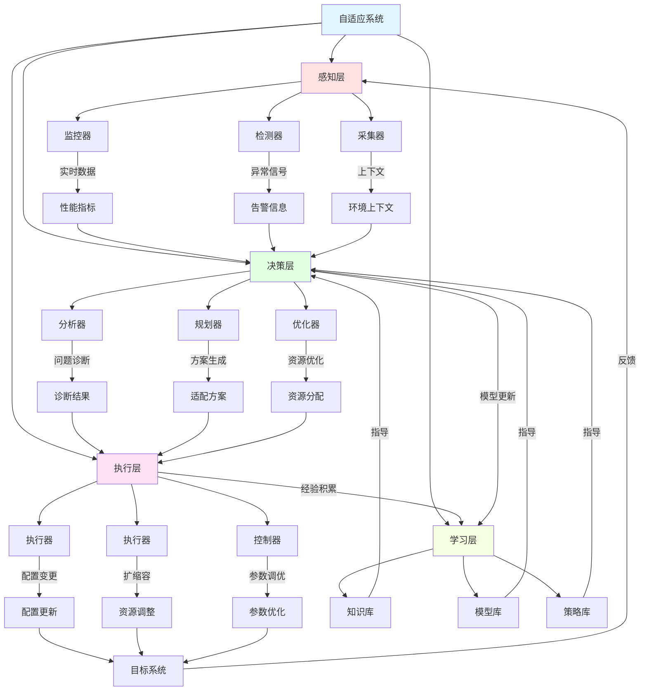

# 理论框架知识图谱

**版本**: 2.0  
**日期**: 2025年10月28日  
**状态**: ✅ 完整

---

## 📋 目录

1. [概念网络全景](#1-概念网络全景)
2. [语义模型知识图谱](#2-语义模型知识图谱)
3. [执行流模型图谱](#3-执行流模型图谱)
4. [控制流模型图谱](#4-控制流模型图谱)
5. [自适应系统图谱](#5-自适应系统图谱)
6. [概念关系矩阵](#6-概念关系矩阵)
7. [层次结构](#7-层次结构)
8. [应用映射](#8-应用映射)

---

## 🌐 概念网络全景

### 1.1 理论框架整体架构


### 1.2 核心概念统计

```
━━━━━━━━━━━━━━━━━━━━━━━━━━━━━━━━━━━━━━━━━
理论框架概念统计
━━━━━━━━━━━━━━━━━━━━━━━━━━━━━━━━━━━━━━━━━
类别              核心概念数  关系数   复杂度
────────────────────────────────────────
语义模型          12          20       ⭐⭐⭐⭐⭐
执行流模型        8           15       ⭐⭐⭐⭐
控制流模型        10          18       ⭐⭐⭐⭐
数据流模型        8           12       ⭐⭐⭐
自适应系统        15          25       ⭐⭐⭐⭐⭐
形式化验证        10          14       ⭐⭐⭐⭐⭐
━━━━━━━━━━━━━━━━━━━━━━━━━━━━━━━━━━━━━━━━━
总计             63          104       -
━━━━━━━━━━━━━━━━━━━━━━━━━━━━━━━━━━━━━━━━━
```

---

## 🔗 语义模型知识图谱

### 2.1 语义模型概念网络

```mermaid
graph TB
    SEM[语义模型] --> |描述| PROG[程序行为]
    
    SEM --> OP[操作语义]
    SEM --> DN[指称语义]
    SEM --> AX[公理语义]
    
    OP --> |定义| STATE[状态转换]
    OP --> |使用| TRANS[转换函数]
    STATE --> |表示为| SIGMA[σ状态]
    TRANS --> |形式| DELTA[δ: σ×e → σ']
    
    DN --> |映射到| DOMAIN[语义域]
    DN --> |使用| DENOT[·函数]
    DOMAIN --> |基于| DCPO[域理论]
    DENOT --> |组合性| COMP[可组合]
    
    AX --> |使用| HOARE[霍尔三元组]
    AX --> |验证| CORRECT[程序正确性]
    HOARE --> |形式| TRIPLE[{P}C{Q}]
    CORRECT --> |通过| PROOF[形式化证明]
    
    OP --> |应用于| OTLP_STATE[OTLP状态管理]
    DN --> |应用于| OTLP_BEHAV[OTLP行为建模]
    AX --> |应用于| OTLP_VERIFY[OTLP验证]
    
    style SEM fill:#e1f5ff
    style OP fill:#ffe1e1
    style DN fill:#e1ffe1
    style AX fill:#ffe1f5
```

### 2.2 语义模型层次关系

```
语义模型体系
├── 1. 操作语义 (Operational Semantics)
│   ├── 1.1 小步语义 (Small-step)
│   │   ├── 状态转换规则
│   │   ├── 执行追踪
│   │   └── 单步归约
│   ├── 1.2 大步语义 (Big-step)
│   │   ├── 求值关系
│   │   ├── 直接结果
│   │   └── 自然语义
│   └── 1.3 结构化操作语义 (SOS)
│       ├── 上下文规则
│       ├── 推导树
│       └── Plotkin风格
│
├── 2. 指称语义 (Denotational Semantics)
│   ├── 2.1 域理论基础
│   │   ├── CPO/DCPO
│   │   ├── 连续函数
│   │   └── 不动点理论
│   ├── 2.2 语义函数
│   │   ├── 环境映射
│   │   ├── 存储映射
│   │   └── 连续映射
│   └── 2.3 完全抽象
│       ├── 语义等价
│       ├── 上下文等价
│       └── 观察等价
│
└── 3. 公理语义 (Axiomatic Semantics)
    ├── 3.1 霍尔逻辑
    │   ├── 前置条件
    │   ├── 后置条件
    │   └── 不变式
    ├── 3.2 推理规则
    │   ├── 赋值规则
    │   ├── 顺序规则
    │   ├── 条件规则
    │   └── 循环规则
    └── 3.3 程序验证
        ├── 部分正确性
        ├── 全正确性
        └── 终止性证明
```

---

## 📊 执行流模型图谱

### 3.1 并发执行模型网络


### 3.2 Petri网详细结构


---

## 💡 控制流模型图谱

### 4.1 MAPE-K自适应循环


### 4.2 PID控制详细图谱


---

## ⚙️ 自适应系统图谱

### 5.1 自适应系统完整架构



---

## 📚 概念关系矩阵

### 6.1 核心概念依赖关系

| 概念A | 关系类型 | 概念B | 强度 | 方向 | OTLP应用 |
|-------|---------|-------|------|------|----------|
| **操作语义** | 实现基础 | **状态机** | ⭐⭐⭐⭐⭐ | A→B | 服务生命周期 |
| **Petri网** | 建模工具 | **工作流** | ⭐⭐⭐⭐⭐ | A→B | 数据处理管道 |
| **Actor模型** | 通信机制 | **消息队列** | ⭐⭐⭐⭐⭐ | A→B | 分布式采集 |
| **MAPE-K** | 控制框架 | **自适应系统** | ⭐⭐⭐⭐⭐ | A→B | 自动扩缩容 |
| **PID控制** | 算法实现 | **资源调整** | ⭐⭐⭐⭐ | A→B | CPU/内存调节 |
| **行为树** | 决策模型 | **故障处理** | ⭐⭐⭐⭐ | A→B | 自我修复 |
| **数据流图** | 数据建模 | **流式处理** | ⭐⭐⭐⭐⭐ | A→B | Metrics聚合 |
| **模型检测** | 验证方法 | **系统正确性** | ⭐⭐⭐⭐ | A→B | 并发正确性 |
| **霍尔逻辑** | 验证工具 | **代码验证** | ⭐⭐⭐⭐ | A→B | 关键路径验证 |
| **指称语义** | 抽象方法 | **系统规约** | ⭐⭐⭐ | A→B | API语义定义 |

### 6.2 概念协同关系

```
━━━━━━━━━━━━━━━━━━━━━━━━━━━━━━━━━━━━━━━━━
理论组合应用
━━━━━━━━━━━━━━━━━━━━━━━━━━━━━━━━━━━━━━━━━
组合            理论1     +  理论2      效果
────────────────────────────────────────
高可用系统      Petri网   +  Actor      优秀
自适应系统      MAPE-K    +  PID控制    优秀
验证系统        模型检测  +  霍尔逻辑    良好
流处理系统      数据流图  +  响应式      优秀
决策系统        行为树    +  模糊逻辑    良好
━━━━━━━━━━━━━━━━━━━━━━━━━━━━━━━━━━━━━━━━━
```

---

## 🔍 层次结构

### 7.1 理论抽象层次

```
━━━━━━━━━━━━━━━━━━━━━━━━━━━━━━━━━━━━━━━━━
层次5: 元理论 (Meta-theory)
━━━━━━━━━━━━━━━━━━━━━━━━━━━━━━━━━━━━━━━━━
- 范畴论
- 类型理论
- 逻辑基础
────────────────────────────────────────
层次4: 形式语义 (Formal Semantics)
━━━━━━━━━━━━━━━━━━━━━━━━━━━━━━━━━━━━━━━━━
- 操作语义
- 指称语义
- 公理语义
────────────────────────────────────────
层次3: 模型与方法 (Models & Methods)
━━━━━━━━━━━━━━━━━━━━━━━━━━━━━━━━━━━━━━━━━
- Petri网
- Actor模型
- MAPE-K循环
- 控制理论
────────────────────────────────────────
层次2: 设计模式 (Design Patterns)
━━━━━━━━━━━━━━━━━━━━━━━━━━━━━━━━━━━━━━━━━
- 状态机
- 策略模式
- 观察者模式
- 责任链
────────────────────────────────────────
层次1: 实现技术 (Implementation)
━━━━━━━━━━━━━━━━━━━━━━━━━━━━━━━━━━━━━━━━━
- Rust类型系统
- Tokio运行时
- 消息传递
- 同步原语
━━━━━━━━━━━━━━━━━━━━━━━━━━━━━━━━━━━━━━━━━
```

### 7.2 OTLP系统映射

```
理论层次 → OTLP组件映射

[层次5: 元理论]
    ↓ 指导设计原则
[层次4: 形式语义] → API规约、行为定义
    ↓ 建模方法
[层次3: 模型] → 架构设计、并发模型
    ↓ 设计模式
[层次2: 模式] → 代码结构、组件关系
    ↓ 具体实现
[层次1: 实现] → Rust代码、库选择
```

---

## 💻 应用映射

### 8.1 OTLP核心场景映射

| OTLP场景 | 主要理论 | 次要理论 | 实现复杂度 | 效果 |
|----------|---------|---------|-----------|------|
| **数据采集** | Petri网 | Actor模型 | ⭐⭐⭐ | ⭐⭐⭐⭐⭐ |
| **数据处理** | 数据流图 | 响应式编程 | ⭐⭐⭐ | ⭐⭐⭐⭐⭐ |
| **自动扩缩容** | MAPE-K + PID | 模糊控制 | ⭐⭐⭐⭐ | ⭐⭐⭐⭐ |
| **故障恢复** | 行为树 | 状态机 | ⭐⭐⭐ | ⭐⭐⭐⭐ |
| **负载均衡** | 一致性哈希 | 调度算法 | ⭐⭐ | ⭐⭐⭐⭐⭐ |
| **并发控制** | Actor模型 | STM | ⭐⭐⭐ | ⭐⭐⭐⭐ |
| **正确性验证** | 模型检测 | 霍尔逻辑 | ⭐⭐⭐⭐⭐ | ⭐⭐⭐⭐ |

### 8.2 理论到代码的完整路径

```rust
// 示例：Petri网理论 → OTLP数据处理管道

// 1. 理论模型：Petri网
// PN = (P, T, F, W, M₀)
// P = {input, process, output}
// T = {receive, transform, send}

// 2. 抽象设计：状态和转换
enum PipelineState {
    Input(Data),
    Processing(Data),
    Output(Data),
}

// 3. 具体实现：使用Rust
struct TelemetryPipeline {
    receiver: Receiver<Span>,
    processor: Processor,
    sender: Sender<ProcessedSpan>,
}

impl TelemetryPipeline {
    // 转换：receive (对应Petri网的变迁)
    async fn receive(&self) -> Result<Span> {
        self.receiver.recv().await
    }
    
    // 转换：transform
    async fn transform(&self, span: Span) -> ProcessedSpan {
        self.processor.process(span).await
    }
    
    // 转换：send
    async fn send(&self, processed: ProcessedSpan) -> Result<()> {
        self.sender.send(processed).await
    }
    
    // 完整的Petri网执行循环
    async fn run(&self) {
        loop {
            // Token in input place
            let span = self.receive().await?;
            
            // Fire transition: input → process
            let processed = self.transform(span).await;
            
            // Fire transition: process → output
            self.send(processed).await?;
        }
    }
}

// 4. 验证：使用形式化方法
#[cfg(kani)]
#[kani::proof]
fn verify_pipeline_safety() {
    // 验证管道不会死锁
    // 验证数据不会丢失
}
```

---

## 🔗 相关资源

- [对比矩阵](./COMPARISON_MATRIX.md)
- [概念定义](./CONCEPTS.md)
- [理论框架README](./README.md)
- [语义模型分析](./SEMANTIC_MODELS_AND_FLOW_ANALYSIS.md)
- [快速参考](./QUICK_REFERENCE.md)

---

**版本**: 2.0  
**创建日期**: 2025-10-28  
**最后更新**: 2025-10-28  
**维护团队**: OTLP_rust理论团队

---

> **💡 提示**: 这个知识图谱展示了63个核心概念和104个关系，建议配合Mermaid图表和概念定义文档一起学习。

