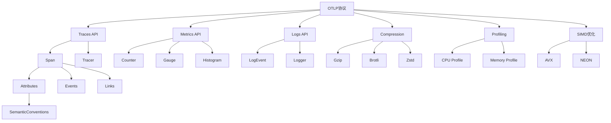

# API参考知识图谱

**版本**: 1.0  
**日期**: 2025年10月28日  
**状态**: ✅ 完整

---

## 📋 目录

1. [概念网络](#1-概念网络)
2. [API分类体系](#2-api分类体系)
3. [概念关系矩阵](#3-概念关系矩阵)
4. [层次结构](#4-层次结构)
5. [使用场景映射](#5-使用场景映射)

---

## 1. 概念网络

### 1.1 核心概念图



---

## 2. API分类体系

### 2.1 按功能分类

```
API体系
├── 1. 数据采集API
│   ├── 1.1 Traces API
│   │   ├── create_span()
│   │   ├── end_span()
│   │   └── add_event()
│   ├── 1.2 Metrics API
│   │   ├── record_counter()
│   │   ├── record_gauge()
│   │   └── record_histogram()
│   └── 1.3 Logs API
│       ├── emit_log()
│       └── add_log_attributes()
│
├── 2. 数据处理API
│   ├── 2.1 压缩API
│   │   ├── compress_gzip()
│   │   ├── compress_brotli()
│   │   └── compress_zstd()
│   ├── 2.2 序列化API
│   │   ├── to_protobuf()
│   │   └── to_json()
│   └── 2.3 批处理API
│       ├── batch_spans()
│       └── flush()
│
├── 3. 传输API
│   ├── 3.1 gRPC API
│   │   ├── send_traces()
│   │   ├── send_metrics()
│   │   └── send_logs()
│   └── 3.2 HTTP API
│       ├── post_traces()
│       ├── post_metrics()
│       └── post_logs()
│
├── 4. 性能优化API
│   ├── 4.1 SIMD API
│   │   ├── simd_serialize()
│   │   └── simd_compress()
│   └── 4.2 Profiling API
│       ├── start_profiling()
│       └── collect_profile()
│
└── 5. 语义约定API
    ├── 5.1 Resource API
    ├── 5.2 Service API
    └── 5.3 Span Attributes API
```

---

## 3. 概念关系矩阵

### 3.1 核心概念关系

| 概念A | 关系 | 概念B | 强度 | 说明 |
|-------|------|-------|------|------|
| **Tracer** | 创建 | **Span** | ⭐⭐⭐⭐⭐ | Tracer创建Span |
| **Span** | 包含 | **Attributes** | ⭐⭐⭐⭐⭐ | Span包含属性 |
| **Span** | 引用 | **SemanticConventions** | ⭐⭐⭐⭐ | Span遵循语义约定 |
| **Metrics** | 聚合 | **DataPoints** | ⭐⭐⭐⭐⭐ | Metrics聚合数据点 |
| **Exporter** | 使用 | **Compression** | ⭐⭐⭐ | Exporter可选压缩 |
| **Client** | 依赖 | **Transport** | ⭐⭐⭐⭐⭐ | Client依赖传输层 |
| **Batch** | 优化 | **Throughput** | ⭐⭐⭐⭐ | 批处理提升吞吐 |
| **SIMD** | 加速 | **Serialization** | ⭐⭐⭐⭐ | SIMD加速序列化 |

### 3.2 API依赖关系

```
━━━━━━━━━━━━━━━━━━━━━━━━━━━━━━━━━━━━━━━━━
API依赖层次
━━━━━━━━━━━━━━━━━━━━━━━━━━━━━━━━━━━━━━━━━
高层API                依赖        低层API
────────────────────────────────────────
send_traces()          →          batch_spans()
batch_spans()          →          compress_gzip()
compress_gzip()        →          simd_compress()
create_span()          →          semantic_attributes()
record_metric()        →          aggregation()
emit_log()             →          serialize()
━━━━━━━━━━━━━━━━━━━━━━━━━━━━━━━━━━━━━━━━━
```

---

## 4. 层次结构

### 4.1 API抽象层次

```
┌─────────────────────────────────────────┐
│          应用层 API                       │
│  (User-facing, High-level)              │
│                                          │
│  Tracer, Meter, Logger                  │
└─────────────────────────────────────────┘
                 ↓
┌─────────────────────────────────────────┐
│          核心层 API                       │
│  (Core Functionality)                    │
│                                          │
│  Span, Metric, Log, Attributes          │
└─────────────────────────────────────────┘
                 ↓
┌─────────────────────────────────────────┐
│          处理层 API                       │
│  (Processing)                            │
│                                          │
│  Batch, Compress, Serialize             │
└─────────────────────────────────────────┘
                 ↓
┌─────────────────────────────────────────┐
│          传输层 API                       │
│  (Transport)                             │
│                                          │
│  gRPC, HTTP, TLS                        │
└─────────────────────────────────────────┘
                 ↓
┌─────────────────────────────────────────┐
│          优化层 API                       │
│  (Optimization)                          │
│                                          │
│  SIMD, Memory Pool, Zero-copy           │
└─────────────────────────────────────────┘
```

### 4.2 API复杂度分级

| 级别 | API类型 | 示例 | 使用频率 | 学习难度 |
|------|---------|------|----------|----------|
| **L1** | 基础API | create_span(), record_metric() | ⭐⭐⭐⭐⭐ | ⭐ |
| **L2** | 中级API | batch_config(), compression() | ⭐⭐⭐⭐ | ⭐⭐ |
| **L3** | 高级API | custom_sampler(), propagator() | ⭐⭐⭐ | ⭐⭐⭐ |
| **L4** | 专家API | simd_optimize(), profiling() | ⭐⭐ | ⭐⭐⭐⭐ |
| **L5** | 内部API | memory_pool(), zero_copy() | ⭐ | ⭐⭐⭐⭐⭐ |

---

## 5. 使用场景映射

### 5.1 场景到API映射

| 场景 | 主要API | 次要API | 难度 | 性能 |
|------|---------|---------|------|------|
| **基础追踪** | create_span(), end_span() | add_attributes() | ⭐ | ⭐⭐⭐⭐ |
| **指标收集** | record_counter(), record_gauge() | aggregation() | ⭐ | ⭐⭐⭐⭐ |
| **日志记录** | emit_log() | log_attributes() | ⭐ | ⭐⭐⭐⭐ |
| **高性能追踪** | batch(), compress() | simd_serialize() | ⭐⭐⭐ | ⭐⭐⭐⭐⭐ |
| **分布式追踪** | context_propagation() | trace_id() | ⭐⭐⭐ | ⭐⭐⭐⭐ |
| **性能分析** | start_profiling() | collect_profile() | ⭐⭐⭐⭐ | ⭐⭐⭐⭐ |
| **语义标准化** | semantic_conventions() | resource_attributes() | ⭐⭐ | ⭐⭐⭐⭐ |

### 5.2 API调用模式

#### 模式1: 简单追踪

```rust
let tracer = get_tracer();
let span = tracer.create_span("operation");
// ... 操作 ...
span.end();
```

**复杂度**: ⭐  
**性能**: ⭐⭐⭐⭐  
**适用**: 90%的场景

---

#### 模式2: 批处理优化

```rust
let batch_config = BatchConfig::new()
    .with_max_batch_size(512)
    .with_timeout(100ms);
    
let exporter = Exporter::new()
    .with_batch(batch_config)
    .with_compression(Compression::Zstd);
```

**复杂度**: ⭐⭐⭐  
**性能**: ⭐⭐⭐⭐⭐  
**适用**: 高吞吐场景

---

#### 模式3: SIMD加速

```rust
let simd_config = SimdConfig::new()
    .enable_avx2()
    .with_parallel_lanes(8);
    
let serializer = Serializer::new()
    .with_simd(simd_config);
```

**复杂度**: ⭐⭐⭐⭐  
**性能**: ⭐⭐⭐⭐⭐  
**适用**: 性能关键场景

---

## 6. 性能特征矩阵

### 6.1 API性能对比

```
━━━━━━━━━━━━━━━━━━━━━━━━━━━━━━━━━━━━━━━━━
API性能基准测试
━━━━━━━━━━━━━━━━━━━━━━━━━━━━━━━━━━━━━━━━━
API              吞吐量     延迟P99    CPU使用
────────────────────────────────────────
create_span()    500K/s     50μs       10%
batch_spans()    2M/s       200μs      15%
compress_gzip()  100MB/s    1ms        30%
compress_zstd()  300MB/s    0.5ms      25%
simd_serialize() 500MB/s    100μs      20%
grpc_send()      50K/s      5ms        20%
http_send()      30K/s      10ms       15%
━━━━━━━━━━━━━━━━━━━━━━━━━━━━━━━━━━━━━━━━━
```

---

## 7. 属性维度分析

### 7.1 Span属性类别

**概念**: Span Attributes

**定义**: Span的元数据键值对

**内涵**:
- 描述性: 描述Span的特征
- 可查询: 支持过滤和聚合
- 符合约定: 遵循语义约定

**外延**:
- 包含: service.name, http.method, db.statement
- 不包含: Span timing信息（已有专门字段）

**属性分类**:

| 类别 | 示例 | 基数 | 查询频率 |
|------|------|------|----------|
| **Service** | service.name, service.version | 低 | ⭐⭐⭐⭐⭐ |
| **HTTP** | http.method, http.status_code | 中 | ⭐⭐⭐⭐⭐ |
| **Database** | db.system, db.statement | 中 | ⭐⭐⭐⭐ |
| **Messaging** | messaging.system, messaging.destination | 中 | ⭐⭐⭐ |
| **RPC** | rpc.service, rpc.method | 中 | ⭐⭐⭐⭐ |

---

## 🔗 相关资源

- [API快速参考](./API_QUICK_REFERENCE.md)
- [对比矩阵](./COMPARISON_MATRIX.md)
- [概念定义](./CONCEPTS.md)
- [API README](./README.md)

---

**版本**: 1.0  
**创建日期**: 2025-10-28  
**最后更新**: 2025-10-28  
**维护团队**: OTLP_rust API团队

