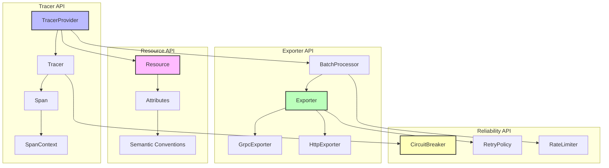
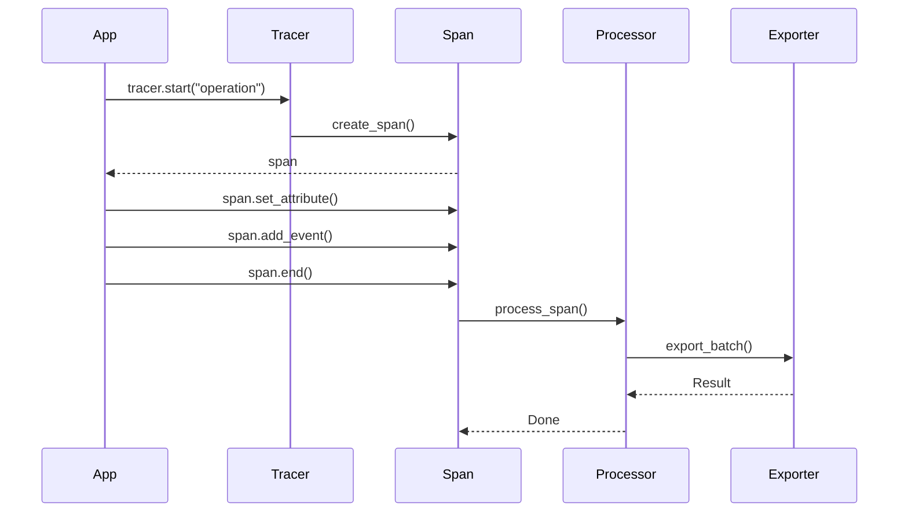

# API参考知识图谱

**版本**: 2.0
**日期**: 2025年10月28日
**状态**: ✅ 完整

---

## 📋 目录

1. [API全景图](#1-api全景图)
2. [API调用关系](#2-api调用关系)
3. [核心概念网络](#3-核心概念网络)

---

## 🌐 API全景图

### 1.1 完整API架构



### 1.2 API分层

```
Layer 4: 应用API
└─ Tracer.start(), Span.end()

Layer 3: 处理API
└─ BatchProcessor, Exporter

Layer 2: 传输API
└─ GrpcExporter, HttpExporter

Layer 1: 基础API
└─ Resource, Attributes

Layer 0: 可靠性API
└─ CircuitBreaker, RetryPolicy
```

---

## 🔗 API调用关系

### 2.1 典型调用流程



### 2.2 API依赖关系

```
核心链路:
TracerProvider.builder()
  → .with_endpoint()
  → .with_batch_config()
  → .build()
  → TracerProvider
  → .tracer("name")
  → Tracer
  → .start("op")
  → Span
  → .end()

错误处理链路:
Exporter.export()
  → CircuitBreaker.call()
  → RetryPolicy.execute()
  → Result
```

---

## 📊 核心概念网络

### 3.1 API概念列表

```
TracerProvider (8个方法):
├─ builder() - 创建构建器
├─ with_endpoint() - 设置端点
├─ with_batch_config() - 批处理配置
├─ with_resource() - 设置资源
├─ build() - 构建Provider
├─ tracer() - 获取Tracer
├─ force_flush() - 强制刷新
└─ shutdown() - 关闭

Tracer (4个方法):
├─ start() - 开始Span
├─ start_with_context() - 带上下文
├─ in_span() - 自动管理
└─ get_active_span() - 获取活跃Span

Span (12个方法):
├─ set_attribute() - 设置属性
├─ add_event() - 添加事件
├─ set_status() - 设置状态
├─ record_error() - 记录错误
├─ end() - 结束
└─ 更多...

Exporter (6个方法):
├─ export() - 导出
├─ force_flush() - 强制刷新
├─ shutdown() - 关闭
└─ 更多...
```

---

## 🔗 相关资源

- [核心概念](./CONCEPTS.md) - API详解
- [对比矩阵](./COMPARISON_MATRIX.md) - API对比
- [快速入门](../01_GETTING_STARTED/) - 开始使用

---

**版本**: 2.0
**创建日期**: 2025-10-28

---

> **💡 提示**: 从TracerProvider开始，逐步学习各个API的使用。
