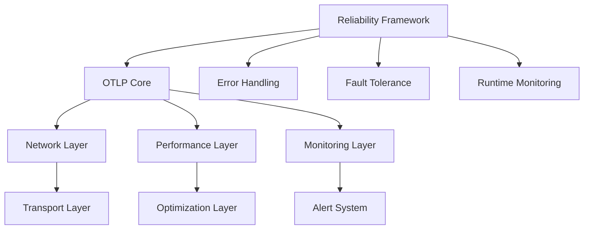
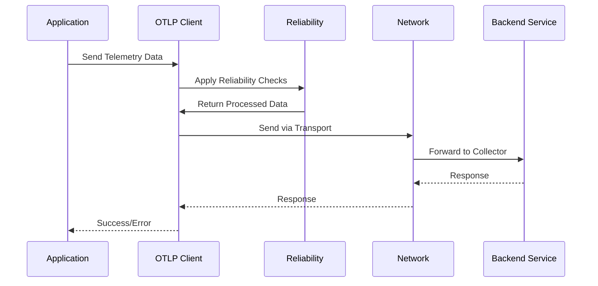

# 模块设计文档

## 概述

本文档详细描述了 OTLP Rust 项目中各个模块的设计理念、接口定义和实现细节。项目采用模块化设计，确保代码的可维护性、可测试性和可扩展性。

## 项目结构

```text
OTLP_rust/
├── crates/                           # Rust crates 目录
│   ├── otlp/                         # OTLP 核心实现
│   │   ├── src/
│   │   │   ├── core/                 # 新核心架构
│   │   │   ├── client.rs             # 客户端实现
│   │   │   ├── config.rs             # 配置管理
│   │   │   ├── data.rs               # 数据模型
│   │   │   ├── error.rs              # 错误处理
│   │   │   ├── exporter.rs           # 数据导出
│   │   │   ├── processor.rs          # 数据处理
│   │   │   ├── transport.rs          # 传输层
│   │   │   ├── network/              # 网络管理
│   │   │   ├── resilience/           # 弹性机制
│   │   │   ├── monitoring/           # 监控系统
│   │   │   ├── performance/          # 性能优化
│   │   │   ├── microservices/        # 微服务支持
│   │   │   ├── optimization/         # 优化管理
│   │   │   └── ...                   # 其他模块
│   │   ├── examples/                 # 示例代码
│   │   ├── tests/                    # 测试代码
│   │   └── benches/                  # 基准测试
│   └── reliability/                  # 可靠性框架
│       ├── src/
│       │   ├── error_handling/       # 错误处理
│       │   ├── fault_tolerance/      # 容错机制
│       │   ├── runtime_monitoring/   # 运行时监控
│       │   ├── runtime_environments/ # 环境适配
│       │   ├── chaos_engineering/   # 混沌工程
│       │   └── ...                   # 其他模块
│       ├── examples/                 # 示例代码
│       └── tests/                    # 测试代码
├── docs/                             # 项目文档
├── analysis/                         # 深度分析文档
└── scripts/                          # 构建脚本
```

## OTLP 核心模块 (`crates/otlp`)

### 1. 核心架构模块 (`core/`)

#### 1.1 EnhancedOtlpClient (`core/enhanced_client.rs`)

**职责**: 提供统一的 OTLP 客户端接口

**核心特性**:

- 基于 OpenTelemetry 0.31.0 标准
- 支持异步和同步操作
- 内置性能优化和可靠性机制
- 类型安全的 API 设计

**主要接口**:

```rust
pub struct EnhancedOtlpClient {
    // 内部实现
}

impl EnhancedOtlpClient {
    pub fn builder() -> ClientBuilder;
    pub fn tracer(&self, name: &str) -> Tracer;
    pub async fn export_traces(&self, traces: Vec<TraceData>) -> Result<()>;
    pub async fn export_metrics(&self, metrics: Vec<MetricData>) -> Result<()>;
    pub async fn export_logs(&self, logs: Vec<LogData>) -> Result<()>;
}
```

#### 1.2 ClientBuilder (`core/enhanced_client.rs`)

**职责**: 客户端构建器模式

**配置选项**:

- 端点配置
- 认证设置
- 超时配置
- 重试策略
- 压缩设置

#### 1.3 PerformanceLayer (`core/performance_layer.rs`)

**职责**: 性能优化层

**优化策略**:

- 批量处理优化
- 内存池管理
- 连接池复用
- SIMD 指令优化
- 零拷贝数据传输

#### 1.4 ReliabilityLayer (`core/reliability_layer.rs`)

**职责**: 可靠性保障层

**可靠性机制**:

- 断路器模式
- 重试策略
- 超时控制
- 降级策略
- 健康检查

### 2. 数据处理模块

#### 2.1 Data Models (`data.rs`)

**职责**: 定义 OTLP 数据模型

**核心类型**:

```rust
pub struct TraceData {
    pub trace_id: String,
    pub span_id: String,
    pub parent_span_id: Option<String>,
    pub name: String,
    pub span_kind: SpanKind,
    pub start_time: u64,
    pub end_time: u64,
    pub status: SpanStatus,
    pub attributes: HashMap<String, AttributeValue>,
    pub events: Vec<Event>,
    pub links: Vec<Link>,
}

pub struct MetricData {
    pub name: String,
    pub description: String,
    pub unit: String,
    pub metric_type: MetricType,
    pub data_points: Vec<DataPoint>,
}

pub struct LogData {
    pub timestamp: u64,
    pub severity: LogSeverity,
    pub body: String,
    pub attributes: HashMap<String, AttributeValue>,
}
```

#### 2.2 Configuration (`config.rs`)

**职责**: 配置管理

**配置结构**:

```rust
pub struct OtlpConfig {
    pub endpoint: String,
    pub protocol: TransportProtocol,
    pub timeout: Duration,
    pub retry_config: RetryConfig,
    pub batch_config: BatchConfig,
    pub compression: Compression,
}

pub struct BatchConfig {
    pub max_batch_size: usize,
    pub batch_timeout: Duration,
    pub max_queue_size: usize,
}
```

#### 2.3 Error Handling (`error.rs`)

**职责**: 统一错误处理

**错误类型**:

```rust
#[derive(Debug, thiserror::Error)]
pub enum OtlpError {
    #[error("Network error: {0}")]
    Network(#[from] reqwest::Error),
    
    #[error("Serialization error: {0}")]
    Serialization(#[from] serde_json::Error),
    
    #[error("Configuration error: {0}")]
    Configuration(String),
    
    #[error("Validation error: {0}")]
    Validation(String),
}
```

### 3. 传输层模块

#### 3.1 Transport (`transport.rs`)

**职责**: 传输层抽象

**传输协议**:

```rust
pub trait Transport {
    async fn send_traces(&self, traces: Vec<TraceData>) -> Result<()>;
    async fn send_metrics(&self, metrics: Vec<MetricData>) -> Result<()>;
    async fn send_logs(&self, logs: Vec<LogData>) -> Result<()>;
}

pub struct GrpcTransport {
    client: TraceServiceClient<Channel>,
}

pub struct HttpTransport {
    client: reqwest::Client,
    endpoint: String,
}
```

#### 3.2 Network Management (`network/`)

**职责**: 网络连接管理

**核心组件**:

- `AsyncIoManager`: 异步 I/O 管理
- `ConnectionPool`: 连接池管理
- `LoadBalancer`: 负载均衡器
- `HealthChecker`: 健康检查器

### 4. 性能优化模块

#### 4.1 Performance (`performance/`)

**职责**: 性能优化实现

**优化组件**:

- `OptimizedBatchProcessor`: 优化的批处理器
- `OptimizedConnectionPool`: 优化的连接池
- `OptimizedMemoryPool`: 优化的内存池
- `OptimizedCircuitBreaker`: 优化的断路器

#### 4.2 SIMD Optimizations (`performance/simd_optimizations.rs`)

**职责**: SIMD 指令优化

**优化策略**:

- 向量化数据处理
- 并行计算优化
- 内存访问优化
- 算法优化

### 5. 监控模块

#### 5.1 Monitoring (`monitoring/`)

**职责**: 监控系统实现

**监控组件**:

- `MetricsCollector`: 指标收集器
- `PrometheusExporter`: Prometheus 导出器
- `AlertManager`: 告警管理器
- `Dashboard`: 监控仪表板

### 6. 微服务支持模块

#### 6.1 Microservices (`microservices/`)

**职责**: 微服务架构支持

**微服务组件**:

- `ServiceDiscovery`: 服务发现
- `LoadBalancer`: 负载均衡
- `CircuitBreaker`: 断路器
- `RetryPolicy`: 重试策略
- `FaultInjector`: 故障注入

## 可靠性框架模块 (`crates/reliability`)

### 1. 错误处理模块 (`error_handling/`)

#### 1.1 UnifiedError (`error_handling/unified_error.rs`)

**职责**: 统一错误类型定义

**错误类型**:

```rust
#[derive(Debug, thiserror::Error)]
pub enum UnifiedError {
    #[error("System error: {0}")]
    System(String),
    
    #[error("Network error: {0}")]
    Network(#[from] reqwest::Error),
    
    #[error("Configuration error: {0}")]
    Configuration(String),
    
    #[error("Timeout error: {0}")]
    Timeout(String),
}
```

#### 1.2 ErrorMonitoring (`error_handling/error_monitoring.rs`)

**职责**: 错误监控和报告

**监控功能**:

- 错误统计
- 错误趋势分析
- 错误告警
- 错误恢复建议

#### 1.3 ErrorRecovery (`error_handling/error_recovery.rs`)

**职责**: 自动错误恢复

**恢复策略**:

- 自动重试
- 降级处理
- 故障转移
- 资源清理

### 2. 容错机制模块 (`fault_tolerance/`)

#### 2.1 CircuitBreaker (`fault_tolerance/circuit_breaker.rs`)

**职责**: 断路器模式实现

**断路器状态**:

```rust
pub enum CircuitBreakerState {
    Closed,    // 正常状态
    Open,      // 断路状态
    HalfOpen,  // 半开状态
}
```

#### 2.2 RetryPolicies (`fault_tolerance/retry_policies.rs`)

**职责**: 重试策略实现

**重试策略**:

- 固定间隔重试
- 指数退避重试
- 线性退避重试
- 自定义重试策略

#### 2.3 Timeout (`fault_tolerance/timeout.rs`)

**职责**: 超时控制

**超时类型**:

- 连接超时
- 读取超时
- 写入超时
- 总体超时

#### 2.4 Bulkhead (`fault_tolerance/bulkhead.rs`)

**职责**: 舱壁模式实现

**隔离策略**:

- 线程池隔离
- 连接池隔离
- 资源隔离
- 故障隔离

### 3. 运行时监控模块 (`runtime_monitoring/`)

#### 3.1 HealthChecker (`runtime_monitoring/health_check.rs`)

**职责**: 健康检查实现

**检查项目**:

- 系统资源检查
- 服务可用性检查
- 依赖服务检查
- 自定义健康检查

#### 3.2 PerformanceMonitor (`runtime_monitoring/performance_monitor.rs`)

**职责**: 性能监控

**监控指标**:

- CPU 使用率
- 内存使用率
- 网络 I/O
- 磁盘 I/O
- 响应时间
- 吞吐量

#### 3.3 ResourceMonitor (`runtime_monitoring/resource_monitor.rs`)

**职责**: 资源监控

**资源类型**:

- 内存资源
- CPU 资源
- 网络资源
- 存储资源
- 连接资源

#### 3.4 AnomalyDetector (`runtime_monitoring/anomaly_detection.rs`)

**职责**: 异常检测

**检测算法**:

- 统计异常检测
- 机器学习异常检测
- 规则基础异常检测
- 时间序列异常检测

### 4. 环境适配模块 (`runtime_environments/`)

#### 4.1 Environment Adapters

**职责**: 不同运行环境适配

**环境类型**:

- `OSEnvironmentAdapter`: 操作系统环境
- `ContainerEnvironmentAdapter`: 容器环境
- `KubernetesEnvironmentAdapter`: Kubernetes 环境
- `EmbeddedEnvironmentAdapter`: 嵌入式环境
- `EdgeEnvironmentAdapter`: 边缘计算环境

#### 4.2 Environment Detection

**职责**: 运行环境检测

**检测能力**:

- 自动环境识别
- 环境特性检测
- 资源限制检测
- 网络环境检测

### 5. 混沌工程模块 (`chaos_engineering/`)

#### 5.1 FaultInjection (`chaos_engineering/fault_injection.rs`)

**职责**: 故障注入

**注入类型**:

- 网络故障注入
- 服务故障注入
- 资源故障注入
- 时间故障注入

#### 5.2 ResilienceTesting (`chaos_engineering/resilience_testing.rs`)

**职责**: 韧性测试

**测试场景**:

- 服务中断测试
- 网络分区测试
- 资源耗尽测试
- 并发压力测试

## 模块间交互

### 1. 依赖关系



### 2. 数据流



## 设计模式

### 1. 构建器模式

用于复杂对象的构建，如 `ClientBuilder`、`ConfigBuilder`

### 2. 策略模式

用于算法的动态选择，如重试策略、负载均衡策略

### 3. 观察者模式

用于事件通知，如健康检查、性能监控

### 4. 装饰器模式

用于功能的动态添加，如中间件、拦截器

### 5. 工厂模式

用于对象的创建，如传输层工厂、处理器工厂

## 测试策略

### 1. 单元测试

- 每个模块都有对应的单元测试
- 测试覆盖率要求 > 90%
- 使用 mock 对象隔离依赖

### 2. 集成测试

- 模块间集成测试
- 端到端测试
- 性能回归测试

### 3. 混沌测试

- 故障注入测试
- 韧性测试
- 压力测试

## 性能考虑

### 1. 内存管理

- 使用对象池减少分配
- 零拷贝数据传输
- 智能内存回收

### 2. 并发处理

- 无锁数据结构
- 异步 I/O
- 线程池管理

### 3. 网络优化

- 连接复用
- 批量传输
- 压缩传输

---

*本文档最后更新: 2025年10月20日*-
