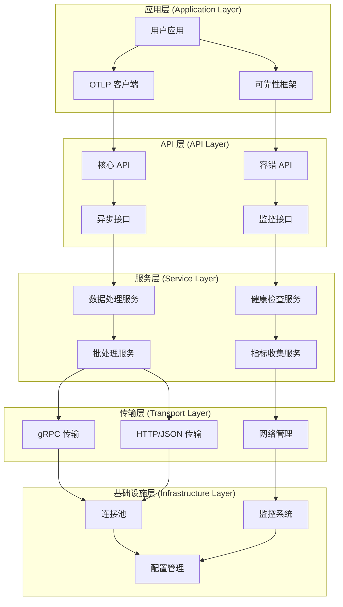

# 系统架构设计

**版本**: 1.0
**最后更新**: 2025年10月26日
**状态**: 🟢 活跃维护

> **简介**: OTLP Rust 系统架构 - 分层架构设计，基于 Rust 1.90+ 的高性能、类型安全实现。

---

## 📋 目录

- [系统架构设计](#系统架构设计)
  - [📋 目录](#-目录)
  - [概述](#概述)
  - [整体架构](#整体架构)
  - [核心组件](#核心组件)
    - [1. OTLP 核心实现 (`crates/otlp`)](#1-otlp-核心实现-cratesotlp)
      - [1.1 数据收集层](#11-数据收集层)
      - [1.2 数据处理层](#12-数据处理层)
      - [1.3 数据传输层](#13-数据传输层)
      - [1.4 监控告警层](#14-监控告警层)
    - [2. 可靠性框架 (`crates/reliability`)](#2-可靠性框架-cratesreliability)
      - [2.1 错误处理系统](#21-错误处理系统)
      - [2.2 容错机制](#22-容错机制)
      - [2.3 运行时监控](#23-运行时监控)
      - [2.4 环境适配](#24-环境适配)
  - [设计原则](#设计原则)
    - [1. 性能优先](#1-性能优先)
    - [2. 类型安全](#2-类型安全)
    - [3. 可扩展性](#3-可扩展性)
    - [4. 可观测性](#4-可观测性)
  - [技术栈](#技术栈)
    - [核心依赖](#核心依赖)
    - [序列化和网络](#序列化和网络)
    - [监控和日志](#监控和日志)
    - [并发和同步](#并发和同步)
  - [部署架构](#部署架构)
    - [1. 单机部署](#1-单机部署)
    - [2. 微服务部署](#2-微服务部署)
    - [3. 边缘部署](#3-边缘部署)
  - [性能特性](#性能特性)
    - [1. 吞吐量优化](#1-吞吐量优化)
    - [2. 延迟优化](#2-延迟优化)
    - [3. 资源优化](#3-资源优化)
  - [安全设计](#安全设计)
    - [1. 传输安全](#1-传输安全)
    - [2. 认证授权](#2-认证授权)
    - [3. 数据保护](#3-数据保护)
  - [扩展性设计](#扩展性设计)
    - [1. 水平扩展](#1-水平扩展)
    - [2. 垂直扩展](#2-垂直扩展)
    - [3. 功能扩展](#3-功能扩展)
  - [监控和运维](#监控和运维)
    - [1. 监控指标](#1-监控指标)
    - [2. 告警机制](#2-告警机制)
    - [3. 运维工具](#3-运维工具)

---

## 概述

OTLP Rust 项目采用分层架构设计，基于 Rust 1.90+ 语言特性，提供高性能、类型安全的 OpenTelemetry Protocol 实现和统一的可靠性框架。

## 整体架构



## 核心组件

### 1. OTLP 核心实现 (`crates/otlp`)

#### 1.1 数据收集层

- **Traces**: 分布式追踪数据收集
- **Metrics**: 指标数据收集和聚合
- **Logs**: 日志数据收集和结构化
- **Events**: 自定义事件和业务指标

#### 1.2 数据处理层

- **过滤和聚合**: 数据过滤、聚合和转换
- **批处理**: 高效的批量数据处理
- **压缩**: 数据压缩减少传输开销
- **数据验证**: 数据格式验证和过滤

#### 1.3 数据传输层

- **gRPC**: 高性能二进制协议传输
- **HTTP/JSON**: 标准 HTTP 协议传输
- **重试机制**: 智能重试和故障恢复
- **负载均衡**: 多目标负载均衡

#### 1.4 监控告警层

- **实时监控**: 系统状态的实时监控
- **告警系统**: 智能告警和通知机制
- **性能分析**: 性能指标收集和分析
- **可视化**: 丰富的监控仪表板

### 2. 可靠性框架 (`crates/reliability`)

#### 2.1 错误处理系统

- **统一错误类型**: 类型安全的错误处理
- **错误上下文**: 丰富的错误上下文信息
- **错误恢复**: 自动错误恢复机制
- **错误监控**: 全局错误监控和报告

#### 2.2 容错机制

- **断路器**: 防止级联故障
- **重试策略**: 指数退避和抖动
- **超时控制**: 多层超时保护
- **降级策略**: 优雅降级保持核心功能

#### 2.3 运行时监控

- **健康检查**: 系统健康状态监控
- **性能监控**: 性能指标实时监控
- **资源监控**: 内存、CPU、网络监控
- **异常检测**: 基于机器学习的异常检测

#### 2.4 环境适配

- **操作系统环境**: Linux、Windows、macOS 适配
- **容器环境**: Docker、Kubernetes 支持
- **边缘计算**: 边缘设备优化
- **嵌入式环境**: 资源受限环境支持

## 设计原则

### 1. 性能优先

- **零拷贝**: 最小化内存拷贝操作
- **无锁并发**: 基于 Rust 所有权系统的无锁数据结构
- **异步 I/O**: 基于 Tokio 的高性能异步 I/O
- **批量处理**: 高效的批量数据处理

### 2. 类型安全

- **编译时检查**: 利用 Rust 类型系统捕获错误
- **内存安全**: 避免内存泄漏和悬空指针
- **并发安全**: 编译时保证并发安全
- **API 一致性**: 统一的 API 设计模式

### 3. 可扩展性

- **模块化设计**: 清晰的模块边界和接口
- **插件系统**: 支持自定义插件扩展
- **配置驱动**: 基于配置的灵活部署
- **热更新**: 支持配置和代码热更新

### 4. 可观测性

- **结构化日志**: 基于 tracing 的结构化日志
- **指标收集**: 丰富的性能指标收集
- **分布式追踪**: 完整的请求链路追踪
- **健康检查**: 全面的健康状态监控

## 技术栈

### 核心依赖

- **Rust 1.90+**: 最新语言特性支持
- **Tokio**: 异步运行时和工具
- **OpenTelemetry 0.31**: 可观测性标准
- **Tonic**: gRPC 客户端/服务器
- **Hyper**: 底层 HTTP 库

### 序列化和网络

- **Serde**: 序列化框架
- **Prost**: Protocol Buffers 实现
- **Reqwest**: HTTP 客户端
- **Tungstenite**: WebSocket 实现

### 监控和日志

- **Tracing**: 结构化日志和追踪
- **Metrics**: 指标收集库
- **Prometheus**: 指标导出器
- **Env Logger**: 环境变量日志配置

### 并发和同步

- **Crossbeam**: 无锁数据结构
- **Dashmap**: 并发哈希映射
- **Parking Lot**: 高性能同步原语
- **Rayon**: 数据并行处理

## 部署架构

### 1. 单机部署

```yaml
# docker-compose.yml
version: '3.8'
services:
  otlp-client:
    build: .
    ports:
      - "8080:8080"
    environment:
      - OTLP_ENDPOINT=http://otel-collector:4317
      - LOG_LEVEL=info
```

### 2. 微服务部署

```yaml
# kubernetes deployment
apiVersion: apps/v1
kind: Deployment
metadata:
  name: otlp-client
spec:
  replicas: 3
  selector:
    matchLabels:
      app: otlp-client
  template:
    metadata:
      labels:
        app: otlp-client
    spec:
      containers:
      - name: otlp-client
        image: otlp-client:latest
        ports:
        - containerPort: 8080
        env:
        - name: OTLP_ENDPOINT
          value: "http://otel-collector:4317"
```

### 3. 边缘部署

```toml
# 边缘设备配置
[edge]
enabled = true
resource_limit = "low"
network_mode = "intermittent"
data_compression = "high"
```

## 性能特性

### 1. 吞吐量优化

- **批量处理**: 支持大批量数据处理
- **连接池**: 连接复用和池化管理
- **异步处理**: 高并发异步处理
- **内存优化**: 智能内存管理

### 2. 延迟优化

- **零拷贝**: 最小化数据拷贝
- **SIMD 优化**: 向量化指令优化
- **缓存优化**: 多级缓存策略
- **网络优化**: HTTP/2 多路复用

### 3. 资源优化

- **CPU 优化**: 多核并行处理
- **内存优化**: 对象池和内存映射
- **网络优化**: 数据压缩和连接复用
- **存储优化**: 高效的数据存储格式

## 安全设计

### 1. 传输安全

- **TLS 加密**: 传输层加密保护
- **证书管理**: 自动证书管理
- **密钥轮换**: 定期密钥轮换
- **安全协议**: 支持最新的安全协议

### 2. 认证授权

- **JWT 认证**: 基于 JWT 的认证机制
- **OAuth2**: OAuth2 认证支持
- **RBAC**: 基于角色的访问控制
- **API 密钥**: API 密钥管理

### 3. 数据保护

- **数据脱敏**: 敏感数据脱敏处理
- **加密存储**: 数据加密存储
- **访问控制**: 细粒度权限控制
- **审计日志**: 完整的操作审计

## 扩展性设计

### 1. 水平扩展

- **无状态设计**: 支持水平扩展
- **负载均衡**: 智能负载分发
- **数据分片**: 数据水平分片
- **服务发现**: 动态服务发现

### 2. 垂直扩展

- **多核优化**: 充分利用多核 CPU
- **内存优化**: 高效内存使用
- **I/O 优化**: 异步 I/O 和批量处理
- **算法优化**: 高效算法实现

### 3. 功能扩展

- **插件系统**: 支持自定义插件
- **接口抽象**: 清晰的接口定义
- **配置驱动**: 基于配置的灵活部署
- **版本兼容**: 向后兼容的版本管理

## 监控和运维

### 1. 监控指标

- **系统指标**: CPU、内存、网络、磁盘
- **应用指标**: 请求数、响应时间、错误率
- **业务指标**: 自定义业务指标
- **性能指标**: 吞吐量、延迟、资源使用率

### 2. 告警机制

- **阈值告警**: 基于阈值的告警
- **异常检测**: 基于机器学习的异常检测
- **趋势分析**: 基于历史数据的趋势分析
- **预测告警**: 基于预测模型的告警

### 3. 运维工具

- **健康检查**: 全面的健康状态检查
- **自动恢复**: 自动故障恢复
- **配置管理**: 集中配置管理
- **部署工具**: 自动化部署工具

---

_本文档最后更新: 2025年10月20日_-
