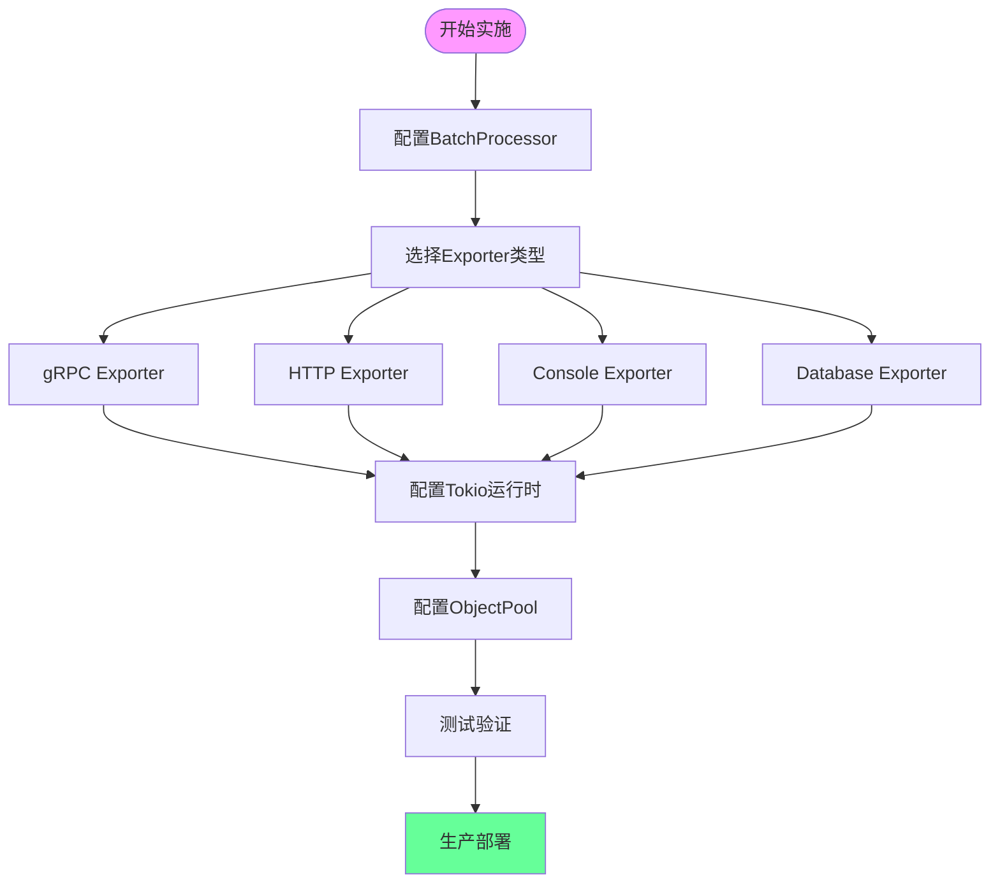

# 实施指南知识图谱

**版本**: 2.0
**日期**: 2025年10月28日
**状态**: ✅ 完整

---

## 📋 目录

- [实施指南知识图谱](#实施指南知识图谱)
  - [📋 目录](#-目录)
  - [🌐 实施流程全景](#-实施流程全景)
    - [1.1 完整实施步骤](#11-完整实施步骤)
  - [🔗 组件关系图](#-组件关系图)
  - [🔗 相关资源](#-相关资源)

---

## 🌐 实施流程全景

### 1.1 完整实施步骤



---

## 🔗 组件关系图

```
实施组件层次:

应用层
├─ BatchSpanProcessor (批处理)
└─ ObjectPool (对象池)

传输层
├─ GrpcExporter (gRPC)
├─ HttpExporter (HTTP)
├─ ConsoleExporter (控制台)
└─ DatabaseExporter (数据库)

运行时层
└─ Tokio Runtime (异步运行时)
```

---

## 🔗 相关资源

- [核心概念](./CONCEPTS.md) - 实施详解
- [对比矩阵](./COMPARISON_MATRIX.md) - 方案对比

---

**版本**: 2.0
**创建日期**: 2025-10-28

---

> **💡 提示**: 按照流程图逐步实施，从BatchProcessor开始。
