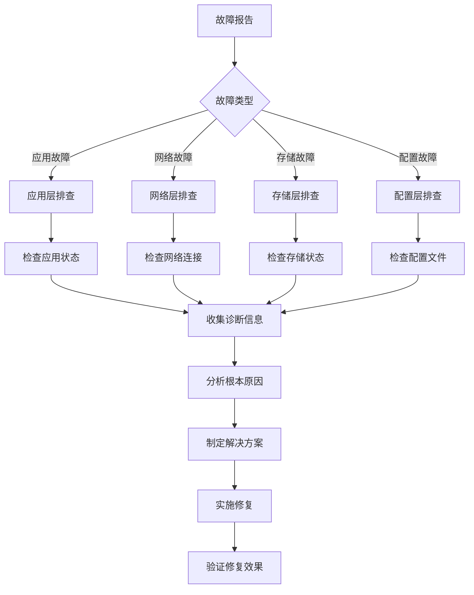

# 故障排查与诊断指南

## 📚 概述

本文档提供了OTLP Rust应用的完整故障排查指南，包括常见问题诊断、故障排除流程、诊断工具和应急响应程序。

## 🔍 故障排查流程

### 1. 故障分类



### 2. 故障严重程度分级

| 级别 | 描述 | 响应时间 | 影响范围 |
|------|------|----------|----------|
| P0 | 系统完全不可用 | 15分钟 | 所有用户 |
| P1 | 核心功能不可用 | 1小时 | 大部分用户 |
| P2 | 部分功能异常 | 4小时 | 部分用户 |
| P3 | 性能下降 | 24小时 | 少数用户 |

## 🚨 常见故障场景

### 1. 应用启动失败

#### 症状

- Pod状态为CrashLoopBackOff
- 应用无法响应健康检查
- 日志显示启动错误

#### 排查步骤

```bash
# 1. 检查Pod状态
kubectl get pods -n otlp-system -l app=otlp-app

# 2. 查看Pod事件
kubectl describe pod <pod-name> -n otlp-system

# 3. 查看应用日志
kubectl logs <pod-name> -n otlp-system --previous

# 4. 检查配置文件
kubectl get configmap otlp-app-config -n otlp-system -o yaml

# 5. 检查Secret
kubectl get secret otlp-app-secrets -n otlp-system -o yaml
```

#### 常见原因及解决方案

| 原因 | 解决方案 |
|------|----------|
| 配置错误 | 检查ConfigMap和Secret配置 |
| 依赖服务不可用 | 检查依赖服务状态 |
| 资源不足 | 检查资源限制和请求 |
| 端口冲突 | 检查端口配置 |
| 权限问题 | 检查RBAC配置 |

### 2. 网络连接问题

#### 症状2

- 连接超时
- 连接被拒绝
- 网络不可达

#### 排查步骤2

```bash
# 1. 检查Service状态
kubectl get svc -n otlp-system

# 2. 检查Endpoint
kubectl get endpoints -n otlp-system

# 3. 测试网络连接
kubectl exec -it <pod-name> -n otlp-system -- curl -v http://otel-collector:4317

# 4. 检查DNS解析
kubectl exec -it <pod-name> -n otlp-system -- nslookup otel-collector

# 5. 检查网络策略
kubectl get networkpolicy -n otlp-system
```

#### 诊断脚本

```bash
#!/bin/bash
# network-diagnostics.sh

NAMESPACE=${1:-otlp-system}
POD_NAME=${2:-}

if [ -z "$POD_NAME" ]; then
    POD_NAME=$(kubectl get pods -n "$NAMESPACE" -l app=otlp-app -o jsonpath='{.items[0].metadata.name}')
fi

echo "=== Network Diagnostics for Pod: $POD_NAME ==="

# 检查Pod网络配置
echo "1. Pod Network Configuration:"
kubectl exec -it "$POD_NAME" -n "$NAMESPACE" -- ip addr show

# 检查路由表
echo -e "\n2. Routing Table:"
kubectl exec -it "$POD_NAME" -n "$NAMESPACE" -- ip route show

# 测试DNS解析
echo -e "\n3. DNS Resolution Test:"
kubectl exec -it "$POD_NAME" -n "$NAMESPACE" -- nslookup kubernetes.default.svc.cluster.local

# 测试内部服务连接
echo -e "\n4. Internal Service Connectivity:"
kubectl exec -it "$POD_NAME" -n "$NAMESPACE" -- curl -v --connect-timeout 5 http://otel-collector:4317/health || echo "Connection failed"

# 测试外部连接
echo -e "\n5. External Connectivity:"
kubectl exec -it "$POD_NAME" -n "$NAMESPACE" -- curl -v --connect-timeout 5 http://www.google.com || echo "External connection failed"

# 检查端口监听
echo -e "\n6. Port Listening Status:"
kubectl exec -it "$POD_NAME" -n "$NAMESPACE" -- netstat -tlnp
```

### 3. 性能问题

#### 症状3

- 响应时间过长
- 吞吐量下降
- 资源使用率高

#### 排查步骤3

```bash
# 1. 检查资源使用
kubectl top pods -n otlp-system -l app=otlp-app

# 2. 检查节点资源
kubectl top nodes

# 3. 查看应用指标
kubectl port-forward -n otlp-system svc/otlp-app-service 8080:80
curl http://localhost:8080/metrics | grep -E "(duration|latency|queue)"

# 4. 检查慢查询日志
kubectl logs <pod-name> -n otlp-system | grep -i "slow\|timeout\|error"

# 5. 分析内存使用
kubectl exec -it <pod-name> -n otlp-system -- ps aux
```

#### 性能分析脚本

```bash
#!/bin/bash
# performance-analysis.sh

NAMESPACE=${1:-otlp-system}
DURATION=${2:-300}

echo "=== Performance Analysis for OTLP App ==="

# 获取Pod名称
POD_NAME=$(kubectl get pods -n "$NAMESPACE" -l app=otlp-app -o jsonpath='{.items[0].metadata.name}')

if [ -z "$POD_NAME" ]; then
    echo "No OTLP app pods found"
    exit 1
fi

echo "Analyzing pod: $POD_NAME"
echo "Duration: $DURATION seconds"

# 端口转发
kubectl port-forward -n "$NAMESPACE" svc/otlp-app-service 8080:80 &
PORT_FORWARD_PID=$!

sleep 5

# 收集性能数据
echo "1. Collecting baseline metrics..."
curl -s http://localhost:8080/metrics > baseline_metrics.txt

echo "2. Running load test..."
for i in {1..100}; do
    curl -s -w "%{time_total}\n" -o /dev/null http://localhost:8080/health &
done
wait

echo "3. Collecting post-load metrics..."
curl -s http://localhost:8080/metrics > post_load_metrics.txt

# 分析结果
echo "4. Performance Analysis Results:"

echo "Baseline metrics:"
grep -E "otlp_request_duration_seconds|otlp_queue_size|otlp_active_connections" baseline_metrics.txt

echo -e "\nPost-load metrics:"
grep -E "otlp_request_duration_seconds|otlp_queue_size|otlp_active_connections" post_load_metrics.txt

echo -e "\nResource usage:"
kubectl top pod "$POD_NAME" -n "$NAMESPACE"

# 清理
kill $PORT_FORWARD_PID
rm -f baseline_metrics.txt post_load_metrics.txt
```

## 🛠️ 诊断工具

### 1. 系统诊断工具

```rust
// src/diagnostics.rs
use std::collections::HashMap;
use serde_json::json;
use tokio::time::{Duration, Instant};

pub struct DiagnosticTool {
    client: OtlpClient,
}

impl DiagnosticTool {
    pub fn new(client: OtlpClient) -> Self {
        Self { client }
    }
    
    pub async fn run_full_diagnostics(&self) -> DiagnosticReport {
        let mut report = DiagnosticReport::new();
        
        // 基础连接测试
        report.add_test("connection_test", self.test_connection().await);
        
        // 数据传输测试
        report.add_test("data_transmission", self.test_data_transmission().await);
        
        // 性能测试
        report.add_test("performance", self.test_performance().await);
        
        // 配置验证
        report.add_test("configuration", self.test_configuration().await);
        
        // 资源使用检查
        report.add_test("resources", self.test_resources().await);
        
        report
    }
    
    async fn test_connection(&self) -> TestResult {
        let start = Instant::now();
        
        match self.client.initialize().await {
            Ok(_) => {
                let duration = start.elapsed();
                TestResult::success(format!("Connection established in {:?}", duration))
            }
            Err(e) => {
                TestResult::failure(format!("Connection failed: {}", e))
            }
        }
    }
    
    async fn test_data_transmission(&self) -> TestResult {
        let start = Instant::now();
        
        // 发送测试数据
        let trace_result = self.client.send_trace("diagnostic-test").await
            .map_err(|e| format!("Failed to send trace: {}", e))?
            .with_attribute("test.type", "diagnostic")
            .finish()
            .await
            .map_err(|e| format!("Failed to finish trace: {}", e))?;
        
        let metric_result = self.client.send_metric("diagnostic_metric", 1.0).await
            .map_err(|e| format!("Failed to send metric: {}", e))?
            .with_label("test", "diagnostic")
            .send()
            .await
            .map_err(|e| format!("Failed to send metric: {}", e))?;
        
        let log_result = self.client.send_log("Diagnostic test log", LogSeverity::Info).await
            .map_err(|e| format!("Failed to send log: {}", e))?
            .with_attribute("test.type", "diagnostic")
            .send()
            .await
            .map_err(|e| format!("Failed to send log: {}", e))?;
        
        let duration = start.elapsed();
        let total_sent = trace_result.success_count + metric_result.success_count + log_result.success_count;
        
        if total_sent > 0 {
            TestResult::success(format!(
                "Data transmission successful: {} items sent in {:?}",
                total_sent, duration
            ))
        } else {
            TestResult::failure("No data was sent successfully".to_string())
        }
    }
    
    async fn test_performance(&self) -> TestResult {
        let num_requests = 100;
        let start = Instant::now();
        
        let mut futures = Vec::new();
        for i in 0..num_requests {
            let client = self.client.clone();
            let future = tokio::spawn(async move {
                client.send_trace(format!("perf-test-{}", i)).await
                    .map_err(|e| format!("Request {} failed: {}", i, e))?
                    .finish()
                    .await
                    .map_err(|e| format!("Request {} failed: {}", i, e))
            });
            futures.push(future);
        }
        
        let results = futures::future::join_all(futures).await;
        let successful: usize = results.iter()
            .filter(|r| r.is_ok())
            .count();
        
        let duration = start.elapsed();
        let rps = num_requests as f64 / duration.as_secs_f64();
        
        if successful >= num_requests * 95 / 100 {
            TestResult::success(format!(
                "Performance test passed: {}/{} requests successful, {:.2} RPS",
                successful, num_requests, rps
            ))
        } else {
            TestResult::failure(format!(
                "Performance test failed: {}/{} requests successful",
                successful, num_requests
            ))
        }
    }
    
    async fn test_configuration(&self) -> TestResult {
        let config = self.client.get_config().await;
        
        let mut issues = Vec::new();
        
        if config.endpoint.is_empty() {
            issues.push("Endpoint is empty".to_string());
        }
        
        if config.sampling_ratio < 0.0 || config.sampling_ratio > 1.0 {
            issues.push("Invalid sampling ratio".to_string());
        }
        
        if config.batch_config.max_export_batch_size == 0 {
            issues.push("Invalid batch size".to_string());
        }
        
        if issues.is_empty() {
            TestResult::success("Configuration is valid".to_string())
        } else {
            TestResult::failure(format!("Configuration issues: {}", issues.join(", ")))
        }
    }
    
    async fn test_resources(&self) -> TestResult {
        let metrics = self.client.get_metrics().await;
        
        let mut status = Vec::new();
        
        if metrics.memory_usage > 100 * 1024 * 1024 * 1024 { // 100GB
            status.push("High memory usage".to_string());
        }
        
        if metrics.queue_size > 1000 {
            status.push("Large queue size".to_string());
        }
        
        if metrics.exporter_metrics.success_rate < 0.95 {
            status.push("Low success rate".to_string());
        }
        
        if status.is_empty() {
            TestResult::success("Resources are within normal limits".to_string())
        } else {
            TestResult::warning(format!("Resource warnings: {}", status.join(", ")))
        }
    }
}

#[derive(Debug, Clone)]
pub struct DiagnosticReport {
    pub tests: HashMap<String, TestResult>,
    pub timestamp: chrono::DateTime<chrono::Utc>,
}

impl DiagnosticReport {
    pub fn new() -> Self {
        Self {
            tests: HashMap::new(),
            timestamp: chrono::Utc::now(),
        }
    }
    
    pub fn add_test(&mut self, name: String, result: TestResult) {
        self.tests.insert(name, result);
    }
    
    pub fn get_summary(&self) -> String {
        let total = self.tests.len();
        let successful = self.tests.values()
            .filter(|r| matches!(r, TestResult::Success(_)))
            .count();
        let warnings = self.tests.values()
            .filter(|r| matches!(r, TestResult::Warning(_)))
            .count();
        let failures = self.tests.values()
            .filter(|r| matches!(r, TestResult::Failure(_)))
            .count();
        
        format!(
            "Diagnostic Summary: {}/{} tests passed, {} warnings, {} failures",
            successful, total, warnings, failures
        )
    }
    
    pub fn to_json(&self) -> String {
        json!({
            "timestamp": self.timestamp.to_rfc3339(),
            "summary": self.get_summary(),
            "tests": self.tests
        }).to_string()
    }
}

#[derive(Debug, Clone)]
pub enum TestResult {
    Success(String),
    Warning(String),
    Failure(String),
}

impl TestResult {
    pub fn success(message: String) -> Self {
        Self::Success(message)
    }
    
    pub fn warning(message: String) -> Self {
        Self::Warning(message)
    }
    
    pub fn failure(message: String) -> Self {
        Self::Failure(message)
    }
}
```

### 2. 日志分析工具

```bash
#!/bin/bash
# log-analyzer.sh

NAMESPACE=${1:-otlp-system}
POD_NAME=${2:-}
LOG_LINES=${3:-1000}

if [ -z "$POD_NAME" ]; then
    POD_NAME=$(kubectl get pods -n "$NAMESPACE" -l app=otlp-app -o jsonpath='{.items[0].metadata.name}')
fi

echo "=== Log Analysis for Pod: $POD_NAME ==="

# 收集日志
echo "1. Collecting logs..."
kubectl logs "$POD_NAME" -n "$NAMESPACE" --tail="$LOG_LINES" > logs.txt

# 错误分析
echo "2. Error Analysis:"
echo "Total errors:"
grep -i "error\|failed\|exception" logs.txt | wc -l

echo -e "\nError types:"
grep -i "error\|failed\|exception" logs.txt | sort | uniq -c | sort -nr | head -10

# 性能分析
echo -e "\n3. Performance Analysis:"
echo "Slow operations:"
grep -E "duration|latency|timeout" logs.txt | sort | uniq -c | sort -nr | head -5

# 连接分析
echo -e "\n4. Connection Analysis:"
echo "Connection issues:"
grep -i "connection\|connect" logs.txt | sort | uniq -c | sort -nr | head -5

# 时间分析
echo -e "\n5. Time-based Analysis:"
echo "Recent errors (last 10):"
grep -i "error\|failed\|exception" logs.txt | tail -10

# 清理
rm -f logs.txt
```

### 3. 配置验证工具

```bash
#!/bin/bash
# config-validator.sh

NAMESPACE=${1:-otlp-system}

echo "=== Configuration Validation ==="

# 检查ConfigMap
echo "1. ConfigMap Validation:"
kubectl get configmap otlp-app-config -n "$NAMESPACE" -o yaml > configmap.yaml

if [ -f configmap.yaml ]; then
    echo "✓ ConfigMap exists"
    
    # 验证YAML格式
    if kubectl apply --dry-run=client -f configmap.yaml > /dev/null 2>&1; then
        echo "✓ ConfigMap YAML is valid"
    else
        echo "✗ ConfigMap YAML is invalid"
    fi
else
    echo "✗ ConfigMap not found"
fi

# 检查Secret
echo -e "\n2. Secret Validation:"
kubectl get secret otlp-app-secrets -n "$NAMESPACE" -o yaml > secret.yaml

if [ -f secret.yaml ]; then
    echo "✓ Secret exists"
    
    # 检查必需的密钥
    if kubectl get secret otlp-app-secrets -n "$NAMESPACE" -o jsonpath='{.data.api-key}' > /dev/null 2>&1; then
        echo "✓ API key exists"
    else
        echo "✗ API key missing"
    fi
else
    echo "✗ Secret not found"
fi

# 检查部署配置
echo -e "\n3. Deployment Validation:"
kubectl get deployment otlp-app -n "$NAMESPACE" -o yaml > deployment.yaml

if [ -f deployment.yaml ]; then
    echo "✓ Deployment exists"
    
    # 检查镜像
    local image=$(kubectl get deployment otlp-app -n "$NAMESPACE" -o jsonpath='{.spec.template.spec.containers[0].image}')
    echo "Image: $image"
    
    # 检查资源限制
    local cpu_limit=$(kubectl get deployment otlp-app -n "$NAMESPACE" -o jsonpath='{.spec.template.spec.containers[0].resources.limits.cpu}')
    local memory_limit=$(kubectl get deployment otlp-app -n "$NAMESPACE" -o jsonpath='{.spec.template.spec.containers[0].resources.limits.memory}')
    
    echo "CPU Limit: $cpu_limit"
    echo "Memory Limit: $memory_limit"
else
    echo "✗ Deployment not found"
fi

# 检查Service
echo -e "\n4. Service Validation:"
kubectl get service otlp-app-service -n "$NAMESPACE" -o yaml > service.yaml

if [ -f service.yaml ]; then
    echo "✓ Service exists"
    
    # 检查端口
    local port=$(kubectl get service otlp-app-service -n "$NAMESPACE" -o jsonpath='{.spec.ports[0].port}')
    echo "Port: $port"
else
    echo "✗ Service not found"
fi

# 检查Ingress
echo -e "\n5. Ingress Validation:"
kubectl get ingress -n "$NAMESPACE" -o yaml > ingress.yaml

if [ -f ingress.yaml ] && [ -s ingress.yaml ]; then
    echo "✓ Ingress exists"
    
    local host=$(kubectl get ingress -n "$NAMESPACE" -o jsonpath='{.items[0].spec.rules[0].host}')
    echo "Host: $host"
else
    echo "✗ Ingress not found"
fi

# 清理临时文件
rm -f configmap.yaml secret.yaml deployment.yaml service.yaml ingress.yaml
```

## 🚨 应急响应程序

### 1. P0级故障响应

```bash
#!/bin/bash
# p0-incident-response.sh

set -euo pipefail

INCIDENT_ID=$(date +%Y%m%d-%H%M%S)
NAMESPACE=${1:-otlp-system}

echo "=== P0 Incident Response - ID: $INCIDENT_ID ==="

# 1. 立即通知
echo "1. Sending immediate notifications..."
curl -X POST -H 'Content-type: application/json' \
    --data "{\"text\":\"🚨 P0 INCIDENT: OTLP Rust application is down - Incident ID: $INCIDENT_ID\"}" \
    "$SLACK_WEBHOOK_URL"

# 2. 快速诊断
echo "2. Running quick diagnostics..."
./health-check.sh "$NAMESPACE" > "incident-$INCIDENT_ID-diagnostics.txt"

# 3. 检查系统状态
echo "3. Checking system status..."
kubectl get pods -n "$NAMESPACE" -l app=otlp-app > "incident-$INCIDENT_ID-pods.txt"
kubectl get events -n "$NAMESPACE" --sort-by='.lastTimestamp' | tail -20 > "incident-$INCIDENT_ID-events.txt"

# 4. 尝试自动恢复
echo "4. Attempting automatic recovery..."
kubectl rollout restart deployment/otlp-app -n "$NAMESPACE"

# 等待恢复
echo "5. Waiting for recovery..."
sleep 60

# 检查恢复状态
if ./health-check.sh "$NAMESPACE" > /dev/null 2>&1; then
    echo "✓ Application recovered automatically"
    curl -X POST -H 'Content-type: application/json' \
        --data "{\"text\":\"✅ RECOVERY: OTLP Rust application recovered - Incident ID: $INCIDENT_ID\"}" \
        "$SLACK_WEBHOOK_URL"
else
    echo "✗ Automatic recovery failed"
    echo "6. Escalating to on-call engineer..."
    curl -X POST -H 'Content-type: application/json' \
        --data "{\"text\":\"⚠️ ESCALATION: Automatic recovery failed - Incident ID: $INCIDENT_ID\"}" \
        "$SLACK_WEBHOOK_URL"
fi

echo "Incident response completed. Files saved with prefix: incident-$INCIDENT_ID"
```

### 2. 回滚程序

```bash
#!/bin/bash
# emergency-rollback.sh

NAMESPACE=${1:-otlp-system}
TARGET_REVISION=${2:-}

if [ -z "$TARGET_REVISION" ]; then
    echo "Available revisions:"
    kubectl rollout history deployment/otlp-app -n "$NAMESPACE"
    echo "Usage: $0 <namespace> <revision>"
    exit 1
fi

echo "=== Emergency Rollback ==="
echo "Namespace: $NAMESPACE"
echo "Target Revision: $TARGET_REVISION"

# 确认回滚
read -p "Are you sure you want to rollback to revision $TARGET_REVISION? (y/N): " -n 1 -r
echo
if [[ ! $REPLY =~ ^[Yy]$ ]]; then
    echo "Rollback cancelled"
    exit 1
fi

# 执行回滚
echo "Executing rollback..."
kubectl rollout undo deployment/otlp-app --to-revision="$TARGET_REVISION" -n "$NAMESPACE"

# 等待回滚完成
echo "Waiting for rollback to complete..."
kubectl rollout status deployment/otlp-app -n "$NAMESPACE" --timeout=300s

# 验证回滚
echo "Verifying rollback..."
if ./health-check.sh "$NAMESPACE" > /dev/null 2>&1; then
    echo "✓ Rollback successful and application is healthy"
else
    echo "✗ Rollback completed but application is not healthy"
    exit 1
fi

echo "Emergency rollback completed"
```

## 📋 故障排查检查清单

### 1. 基础检查清单

- [ ] 检查Pod状态和事件
- [ ] 查看应用日志
- [ ] 验证配置文件
- [ ] 检查网络连接
- [ ] 验证资源使用
- [ ] 检查依赖服务状态

### 2. 高级检查清单

- [ ] 运行完整诊断工具
- [ ] 分析性能指标
- [ ] 检查安全配置
- [ ] 验证备份和恢复
- [ ] 检查监控和告警
- [ ] 审查变更历史

### 3. 故障后检查清单

- [ ] 验证问题已解决
- [ ] 更新监控配置
- [ ] 记录故障报告
- [ ] 更新运行手册
- [ ] 进行故障复盘
- [ ] 实施预防措施

## 📚 最佳实践

### 1. 预防措施

- **定期健康检查**: 实施自动化的健康检查
- **监控告警**: 设置全面的监控和告警
- **容量规划**: 定期进行容量规划
- **备份策略**: 实施完整的备份策略
- **变更管理**: 严格控制变更流程

### 2. 响应原则

- **快速响应**: 根据故障级别快速响应
- **信息透明**: 及时更新故障状态
- **团队协作**: 有效协调团队资源
- **文档记录**: 详细记录故障处理过程
- **持续改进**: 从故障中学习和改进

### 3. 工具使用

- **自动化工具**: 优先使用自动化工具
- **标准化流程**: 遵循标准化的故障处理流程
- **知识库**: 维护完整的故障知识库
- **培训**: 定期进行故障处理培训
- **演练**: 定期进行故障演练

---

**故障排查与诊断指南版本**: v1.0  
**最后更新**: 2025年1月27日  
**维护者**: OTLP 2025 文档团队
