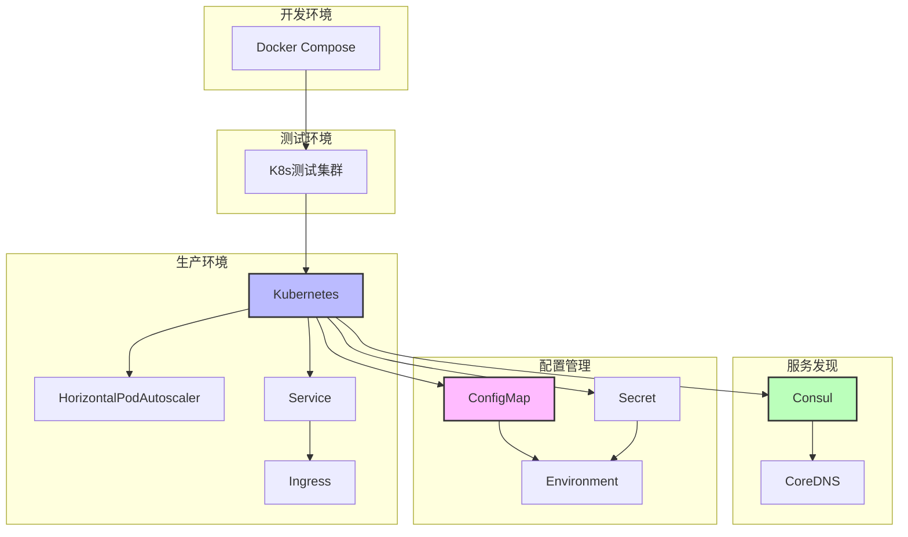

# 部署运维知识图谱

**版本**: 2.0
**日期**: 2025年10月28日
**状态**: ✅ 完整

---

## 📋 目录

- [部署运维知识图谱](#部署运维知识图谱)
  - [📋 目录](#-目录)
  - [🌐 部署架构全景](#-部署架构全景)
    - [1.1 完整部署架构](#11-完整部署架构)
  - [🔗 运维流程图](#-运维流程图)
  - [🔗 相关资源](#-相关资源)

---

## 🌐 部署架构全景

### 1.1 完整部署架构



---

## 🔗 运维流程图

```
部署流程:
构建Docker镜像
  ↓
推送到Registry
  ↓
部署到K8s
  ↓
配置HPA
  ↓
注册Consul
  ↓
健康检查
  ↓
生产就绪

监控流程:
Metrics收集
  ↓
Prometheus
  ↓
Grafana可视化
  ↓
告警通知
```

---

## 🔗 相关资源

- [核心概念](./CONCEPTS.md) - 部署详解
- [对比矩阵](./COMPARISON_MATRIX.md) - 方案对比

---

**版本**: 2.0
**创建日期**: 2025-10-28

---

> **💡 提示**: 从Docker开始，逐步迁移到Kubernetes生产环境。
