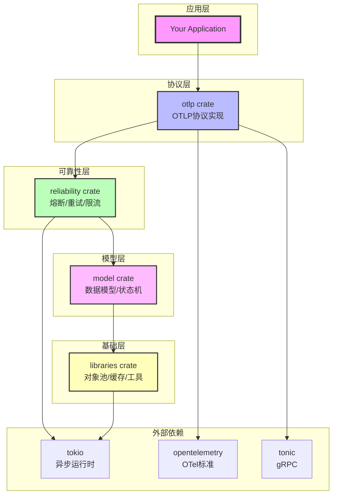
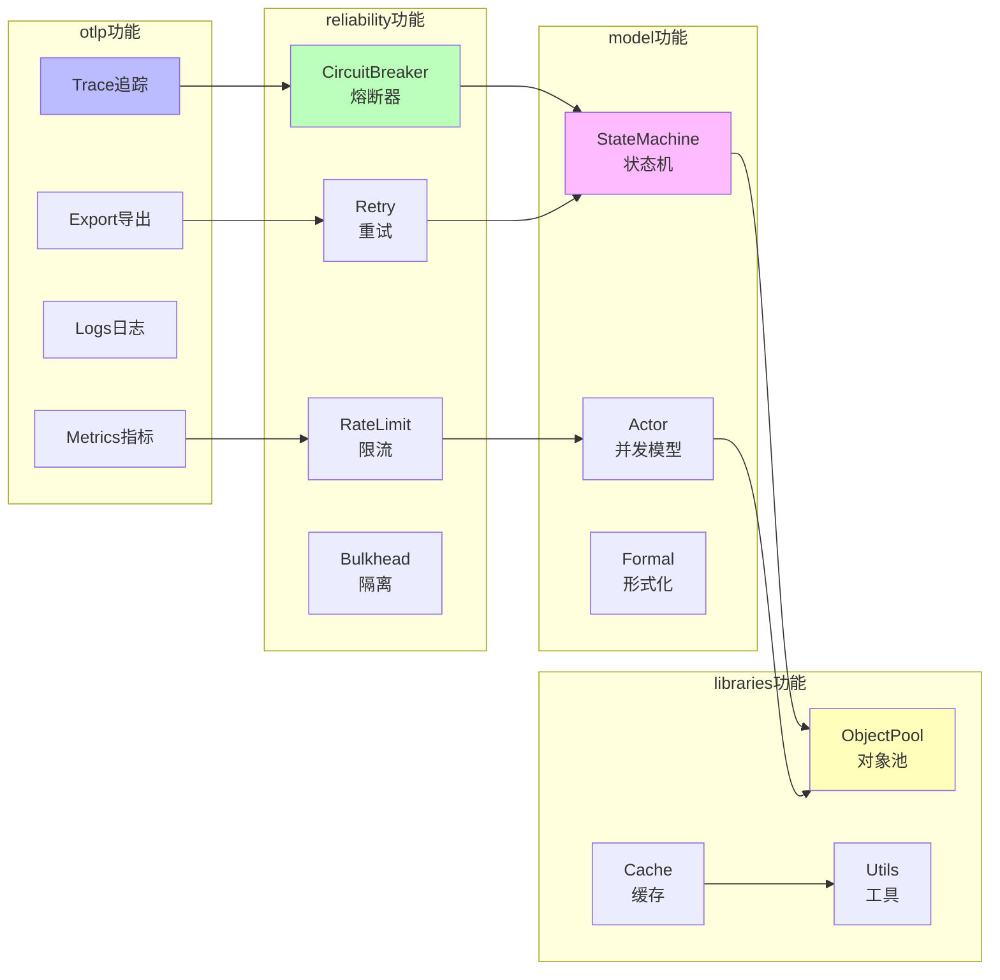
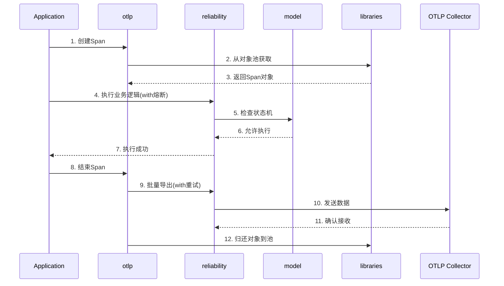
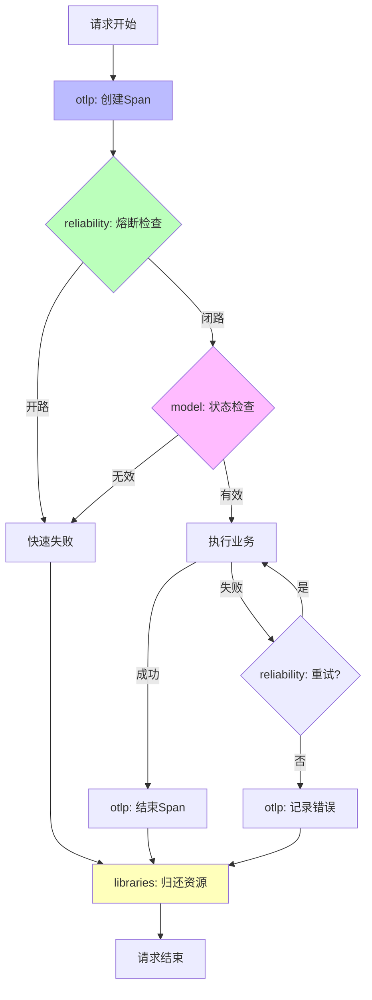
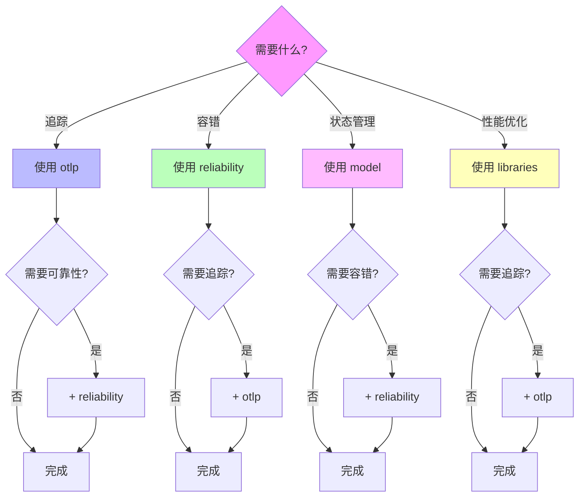

# Crates知识图谱

**版本**: 2.0  
**日期**: 2025年10月28日  
**状态**: ✅ 完整

---

## 📋 目录

1. [Crate依赖全景](#1-crate依赖全景)
2. [功能关系图](#2-功能关系图)
3. [数据流图](#3-数据流图)

---

## 1. Crate依赖全景

### 1.1 完整依赖关系



### 1.2 依赖层次

```
Layer 4: 应用层
  └─ Your Application

Layer 3: 协议层
  └─ otlp (OTLP实现)

Layer 2: 可靠性层
  └─ reliability (容错机制)

Layer 1: 模型层
  └─ model (数据模型)

Layer 0: 基础层
  └─ libraries (基础工具)

External: 外部依赖
  ├─ tokio (异步运行时)
  ├─ opentelemetry (OTel标准)
  └─ tonic (gRPC框架)
```

---

## 2. 功能关系图

### 2.1 核心功能映射



### 2.2 功能组合推荐

```
组合1: 分布式追踪
otlp.Trace + reliability.CircuitBreaker + libraries.ObjectPool
效果: 可靠的分布式追踪

组合2: 高可用服务
reliability.* + model.StateMachine + otlp.Metrics
效果: 高可用微服务

组合3: 高性能系统
libraries.ObjectPool + libraries.Cache + otlp.Metrics
效果: 高性能监控
```

---

## 3. 数据流图

### 3.1 请求处理流程



### 3.2 错误处理流程



---

## 4. 核心概念

### 4.1 Crate核心概念列表

```
otlp (10个核心概念):
├─ Tracer - 追踪器
├─ Span - 跨度
├─ SpanContext - 上下文
├─ Exporter - 导出器
├─ BatchProcessor - 批处理器
├─ Resource - 资源
├─ Attributes - 属性
├─ Events - 事件
├─ Links - 链接
└─ Status - 状态

reliability (8个核心概念):
├─ CircuitBreaker - 熔断器
├─ RetryPolicy - 重试策略
├─ RateLimiter - 限流器
├─ Bulkhead - 隔离舱
├─ Timeout - 超时
├─ Fallback - 降级
├─ HealthCheck - 健康检查
└─ Backpressure - 背压

model (6个核心概念):
├─ StateMachine - 状态机
├─ Actor - Actor模型
├─ CSP - CSP模型
├─ STM - STM模型
├─ RateLimitAlgorithm - 限流算法
└─ FormalModel - 形式化模型

libraries (5个核心概念):
├─ ObjectPool - 对象池
├─ Cache - 缓存
├─ MetricsCollector - 指标采集
├─ Lock - 锁
└─ Utils - 工具函数
```

### 4.2 概念关系网络

```
追踪链路:
Tracer → Span → SpanContext → Exporter → Collector

可靠性链:
Request → CircuitBreaker → RateLimiter → Retry → Response

状态管理链:
Event → StateMachine → State → Transition → NewState

资源管理链:
Request → ObjectPool → Resource → Process → Return
```

---

## 5. 使用决策树



---

## 6. 学习路径

```
新手路径 (推荐):
Step 1: libraries (1天)
  └─ 学习对象池和缓存

Step 2: otlp (1周)
  └─ 学习OTLP基础

Step 3: reliability (3天)
  └─ 学习容错机制

Step 4: model (1周)
  └─ 学习状态管理

进阶路径:
Step 1: otlp + reliability (2周)
  └─ 直接学习核心组合

Step 2: model + libraries (1周)
  └─ 深入理解底层

专家路径:
└─ 同时学习全部 (1月)
    └─ 深入源码和原理
```

---

## 🔗 相关资源

- [核心概念](./CONCEPTS.md) - Crate详细说明
- [对比矩阵](./COMPARISON_MATRIX.md) - Crate对比
- [快速入门](../01_GETTING_STARTED/) - 开始使用

---

**版本**: 2.0  
**创建日期**: 2025-10-28  
**最后更新**: 2025-10-28

---

> **💡 学习提示**: 按照Layer 0 → Layer 3的顺序学习，从基础到高级，循序渐进。新手建议从libraries开始。
