# 文档自动化工具实现方案

**版本**: 1.0  
**日期**: 2025年10月26日  
**项目**: OTLP 文档自动化工具链  
**状态**: 🚀 开发中

> **简介**: 文档自动化工具链 - 自动生成、质量检查、链接验证和内容同步。

---

## 📋 项目概述

本文档详细描述了 OTLP Rust 项目文档自动化工具链的实现方案，包括自动文档生成、质量检查、链接验证、内容同步等功能，旨在提高文档维护效率和质量。

### 核心目标

- 🤖 **自动化生成**: 基于代码自动生成文档
- 🔍 **质量检查**: 自动检测文档质量问题
- 🔗 **链接验证**: 自动验证和修复链接
- 🔄 **内容同步**: 自动同步代码和文档版本
- 📊 **报告生成**: 自动生成文档质量报告

---

## 🛠️ 工具架构

### 1. 整体架构

```mermaid
graph TB
    A[代码仓库] --> B[文档生成器]
    B --> C[质量检查器]
    C --> D[链接验证器]
    D --> E[内容同步器]
    E --> F[报告生成器]
    F --> G[文档仓库]
    
    H[CI/CD 流水线] --> B
    I[定时任务] --> C
    J[Webhook] --> D
    K[版本发布] --> E
```



### 2. 核心组件

#### 2.1 文档生成器 (DocGenerator)

```rust
// 文档生成器核心结构
use std::path::Path;
use serde::{Deserialize, Serialize};

#[derive(Debug, Clone)]
pub struct DocGenerator {
    config: GeneratorConfig,
    parser: CodeParser,
    template_engine: TemplateEngine,
}

#[derive(Debug, Clone, Serialize, Deserialize)]
pub struct GeneratorConfig {
    pub input_paths: Vec<String>,
    pub output_path: String,
    pub template_path: String,
    pub include_private: bool,
    pub generate_examples: bool,
    pub format: OutputFormat,
}

#[derive(Debug, Clone, Serialize, Deserialize)]
pub enum OutputFormat {
    Markdown,
    Html,
    Json,
    All,
}

impl DocGenerator {
    pub async fn generate_docs(&self) -> Result<GenerationResult, Error> {
        let mut results = Vec::new();
        
        for input_path in &self.config.input_paths {
            let modules = self.parser.parse_rust_code(input_path).await?;
            
            for module in modules {
                let doc_content = self.template_engine.render(&module)?;
                let output_file = self.generate_output_path(&module.name)?;
                
                std::fs::write(&output_file, doc_content)?;
                results.push(GeneratedFile {
                    path: output_file,
                    module: module.name,
                    lines: doc_content.lines().count(),
                });
            }
        }
        
        Ok(GenerationResult {
            files_generated: results.len(),
            total_lines: results.iter().map(|f| f.lines).sum(),
            files: results,
        })
    }
}
```

#### 2.2 代码解析器 (CodeParser)

```rust
// Rust 代码解析器
use syn::{Item, ItemFn, ItemStruct, ItemEnum, ItemTrait};
use quote::quote;

pub struct CodeParser {
    include_private: bool,
    generate_examples: bool,
}

impl CodeParser {
    pub async fn parse_rust_code(&self, path: &str) -> Result<Vec<ParsedModule>, Error> {
        let content = std::fs::read_to_string(path)?;
        let syntax_tree = syn::parse_file(&content)?;
        
        let mut modules = Vec::new();
        let mut current_module = ParsedModule {
            name: self.extract_module_name(path),
            path: path.to_string(),
            functions: Vec::new(),
            structs: Vec::new(),
            enums: Vec::new(),
            traits: Vec::new(),
            examples: Vec::new(),
        };
        
        for item in syntax_tree.items {
            match item {
                Item::Fn(func) => {
                    if self.should_include_item(&func.vis) {
                        current_module.functions.push(self.parse_function(func)?);
                    }
                }
                Item::Struct(structure) => {
                    if self.should_include_item(&structure.vis) {
                        current_module.structs.push(self.parse_struct(structure)?);
                    }
                }
                Item::Enum(enum_item) => {
                    if self.should_include_item(&enum_item.vis) {
                        current_module.enums.push(self.parse_enum(enum_item)?);
                    }
                }
                Item::Trait(trait_item) => {
                    if self.should_include_item(&trait_item.vis) {
                        current_module.traits.push(self.parse_trait(trait_item)?);
                    }
                }
                _ => {}
            }
        }
        
        if self.generate_examples {
            current_module.examples = self.extract_examples(&content)?;
        }
        
        modules.push(current_module);
        Ok(modules)
    }
    
    fn parse_function(&self, func: ItemFn) -> Result<ParsedFunction, Error> {
        let name = func.sig.ident.to_string();
        let doc_comment = self.extract_doc_comment(&func.attrs);
        let parameters = self.parse_parameters(&func.sig.inputs);
        let return_type = self.parse_return_type(&func.sig.output);
        
        Ok(ParsedFunction {
            name,
            doc_comment,
            parameters,
            return_type,
            visibility: func.vis,
            async_fn: func.sig.asyncness.is_some(),
        })
    }
    
    fn extract_doc_comment(&self, attrs: &[syn::Attribute]) -> Option<String> {
        for attr in attrs {
            if attr.path.is_ident("doc") {
                if let Ok(syn::Meta::NameValue(meta)) = attr.parse_meta() {
                    if let syn::Lit::Str(lit_str) = meta.lit {
                        return Some(lit_str.value().trim().to_string());
                    }
                }
            }
        }
        None
    }
}
```

#### 2.3 模板引擎 (TemplateEngine)

```rust
// 模板引擎实现
use handlebars::{Handlebars, RenderError, Context};
use serde_json::Value;

pub struct TemplateEngine {
    handlebars: Handlebars<'static>,
    templates: std::collections::HashMap<String, String>,
}

impl TemplateEngine {
    pub fn new() -> Result<Self, Error> {
        let mut handlebars = Handlebars::new();
        handlebars.set_strict_mode(true);
        
        let mut engine = Self {
            handlebars,
            templates: std::collections::HashMap::new(),
        };
        
        engine.load_default_templates()?;
        Ok(engine)
    }
    
    pub fn render(&self, module: &ParsedModule) -> Result<String, RenderError> {
        let template = self.templates.get("module_template")
            .ok_or_else(|| RenderError::new("Template not found"))?;
        
        let context = Context::wraps(module)?;
        self.handlebars.render_template(template, &context)
    }
    
    fn load_default_templates(&mut self) -> Result<(), Error> {
        // 模块模板
        let module_template = r#"
# {{name}}

{{#if doc_comment}}
{{doc_comment}}
{{/if}}

## 函数

{{#each functions}}
### {{name}}

{{#if doc_comment}}
{{doc_comment}}
{{/if}}

**参数:**
{{#each parameters}}
- `{{name}}`: {{type}}
{{/each}}

**返回值:** {{return_type}}

{{#if async_fn}}
> 这是一个异步函数
{{/if}}

---

{{/each}}

## 结构体

{{#each structs}}
### {{name}}

{{#if doc_comment}}
{{doc_comment}}
{{/if}}

**字段:**
{{#each fields}}
- `{{name}}`: {{type}}
{{/each}}

---

{{/each}}

## 枚举

{{#each enums}}
### {{name}}

{{#if doc_comment}}
{{doc_comment}}
{{/if}}

**变体:**
{{#each variants}}
- `{{name}}`
{{/each}}

---

{{/each}}
        "#;
        
        self.templates.insert("module_template".to_string(), module_template.to_string());
        Ok(())
    }
}
```

### 3. 质量检查器 (QualityChecker)

#### 3.1 质量检查核心

```rust
// 文档质量检查器
use std::collections::HashMap;

pub struct QualityChecker {
    rules: Vec<Box<dyn QualityRule>>,
    config: QualityConfig,
}

#[derive(Debug, Clone)]
pub struct QualityConfig {
    pub min_doc_coverage: f64,
    pub max_line_length: usize,
    pub require_examples: bool,
    pub check_links: bool,
    pub validate_markdown: bool,
}

pub trait QualityRule {
    fn name(&self) -> &str;
    fn check(&self, doc: &Document) -> Vec<QualityIssue>;
}

impl QualityChecker {
    pub fn new(config: QualityConfig) -> Self {
        let mut checker = Self {
            rules: Vec::new(),
            config,
        };
        
        checker.register_default_rules();
        checker
    }
    
    pub fn register_rule(&mut self, rule: Box<dyn QualityRule>) {
        self.rules.push(rule);
    }
    
    pub async fn check_document(&self, doc_path: &str) -> Result<QualityReport, Error> {
        let content = std::fs::read_to_string(doc_path)?;
        let document = Document::parse(&content)?;
        
        let mut issues = Vec::new();
        let mut scores = HashMap::new();
        
        for rule in &self.rules {
            let rule_issues = rule.check(&document);
            let rule_score = self.calculate_rule_score(&rule_issues);
            
            issues.extend(rule_issues);
            scores.insert(rule.name().to_string(), rule_score);
        }
        
        let overall_score = self.calculate_overall_score(&scores);
        
        Ok(QualityReport {
            document_path: doc_path.to_string(),
            overall_score,
            rule_scores: scores,
            issues,
            checked_at: chrono::Utc::now(),
        })
    }
    
    fn register_default_rules(&mut self) {
        self.register_rule(Box::new(DocCoverageRule::new(self.config.min_doc_coverage)));
        self.register_rule(Box::new(LineLengthRule::new(self.config.max_line_length)));
        self.register_rule(Box::new(ExampleRule::new(self.config.require_examples)));
        
        if self.config.check_links {
            self.register_rule(Box::new(LinkValidationRule::new()));
        }
        
        if self.config.validate_markdown {
            self.register_rule(Box::new(MarkdownValidationRule::new()));
        }
    }
}
```

#### 3.2 具体质量规则

```rust
// 文档覆盖率规则
pub struct DocCoverageRule {
    min_coverage: f64,
}

impl DocCoverageRule {
    pub fn new(min_coverage: f64) -> Self {
        Self { min_coverage }
    }
}

impl QualityRule for DocCoverageRule {
    fn name(&self) -> &str {
        "doc_coverage"
    }
    
    fn check(&self, doc: &Document) -> Vec<QualityIssue> {
        let mut issues = Vec::new();
        
        let total_functions = doc.functions.len();
        let documented_functions = doc.functions.iter()
            .filter(|f| f.doc_comment.is_some())
            .count();
        
        let coverage = if total_functions > 0 {
            documented_functions as f64 / total_functions as f64
        } else {
            1.0
        };
        
        if coverage < self.min_coverage {
            issues.push(QualityIssue {
                rule: self.name().to_string(),
                severity: IssueSeverity::Warning,
                message: format!(
                    "Documentation coverage is {:.1}%, below minimum of {:.1}%",
                    coverage * 100.0,
                    self.min_coverage * 100.0
                ),
                line: None,
                suggestion: Some("Add documentation comments to undocumented functions".to_string()),
            });
        }
        
        issues
    }
}

// 链接验证规则
pub struct LinkValidationRule;

impl LinkValidationRule {
    pub fn new() -> Self {
        Self
    }
}

impl QualityRule for LinkValidationRule {
    fn name(&self) -> &str {
        "link_validation"
    }
    
    fn check(&self, doc: &Document) -> Vec<QualityIssue> {
        let mut issues = Vec::new();
        
        for (line_num, line) in doc.content.lines().enumerate() {
            let links = self.extract_links(line);
            
            for link in links {
                if let Err(error) = self.validate_link(&link) {
                    issues.push(QualityIssue {
                        rule: self.name().to_string(),
                        severity: IssueSeverity::Error,
                        message: format!("Invalid link: {}", error),
                        line: Some(line_num + 1),
                        suggestion: Some("Check the link URL and ensure it's accessible".to_string()),
                    });
                }
            }
        }
        
        issues
    }
}

impl LinkValidationRule {
    fn extract_links(&self, line: &str) -> Vec<String> {
        let link_regex = regex::Regex::new(r"\[([^\]]+)\]\(([^)]+)\)").unwrap();
        let mut links = Vec::new();
        
        for cap in link_regex.captures_iter(line) {
            if let Some(url) = cap.get(2) {
                links.push(url.as_str().to_string());
            }
        }
        
        links
    }
    
    fn validate_link(&self, url: &str) -> Result<(), String> {
        if url.starts_with("http://") || url.starts_with("https://") {
            // 验证外部链接
            self.validate_external_link(url)
        } else if url.starts_with("#") {
            // 验证内部锚点
            self.validate_internal_anchor(url)
        } else if url.ends_with(".md") {
            // 验证内部文档链接
            self.validate_internal_doc_link(url)
        } else {
            Ok(())
        }
    }
    
    fn validate_external_link(&self, url: &str) -> Result<(), String> {
        // 这里可以实现实际的 HTTP 请求验证
        // 为了演示，我们只做基本检查
        if url.contains("example.com") {
            Err("Example domain not allowed".to_string())
        } else {
            Ok(())
        }
    }
    
    fn validate_internal_anchor(&self, anchor: &str) -> Result<(), String> {
        // 验证锚点是否存在
        // 这里需要解析文档内容来检查锚点
        Ok(())
    }
    
    fn validate_internal_doc_link(&self, doc_path: &str) -> Result<(), String> {
        // 验证内部文档文件是否存在
        if std::path::Path::new(doc_path).exists() {
            Ok(())
        } else {
            Err(format!("Document file not found: {}", doc_path))
        }
    }
}
```

### 4. 链接验证器 (LinkValidator)

#### 4.1 链接验证核心

```rust
// 链接验证器
use reqwest::Client;
use std::collections::HashMap;
use url::Url;

pub struct LinkValidator {
    client: Client,
    cache: HashMap<String, LinkStatus>,
    config: ValidationConfig,
}

#[derive(Debug, Clone)]
pub struct ValidationConfig {
    pub timeout: std::time::Duration,
    pub max_retries: u32,
    pub user_agent: String,
    pub follow_redirects: bool,
    pub check_external: bool,
    pub check_internal: bool,
}

#[derive(Debug, Clone)]
pub enum LinkStatus {
    Valid,
    Invalid(String),
    Timeout,
    Redirected(String),
}

impl LinkValidator {
    pub fn new(config: ValidationConfig) -> Result<Self, Error> {
        let client = Client::builder()
            .timeout(config.timeout)
            .user_agent(&config.user_agent)
            .redirect(reqwest::redirect::Policy::limited(5))
            .build()?;
        
        Ok(Self {
            client,
            cache: HashMap::new(),
            config,
        })
    }
    
    pub async fn validate_document(&self, doc_path: &str) -> Result<LinkValidationReport, Error> {
        let content = std::fs::read_to_string(doc_path)?;
        let links = self.extract_all_links(&content);
        
        let mut results = Vec::new();
        let mut valid_count = 0;
        let mut invalid_count = 0;
        
        for link in links {
            let status = self.validate_single_link(&link).await?;
            
            match &status {
                LinkStatus::Valid => valid_count += 1,
                _ => invalid_count += 1,
            }
            
            results.push(LinkResult {
                url: link.url.clone(),
                line: link.line,
                status: status.clone(),
            });
        }
        
        Ok(LinkValidationReport {
            document_path: doc_path.to_string(),
            total_links: results.len(),
            valid_links: valid_count,
            invalid_links: invalid_count,
            results,
            validated_at: chrono::Utc::now(),
        })
    }
    
    async fn validate_single_link(&self, link: &ExtractedLink) -> Result<LinkStatus, Error> {
        // 检查缓存
        if let Some(cached_status) = self.cache.get(&link.url) {
            return Ok(cached_status.clone());
        }
        
        let status = if link.url.starts_with("http://") || link.url.starts_with("https://") {
            if self.config.check_external {
                self.validate_external_link(&link.url).await?
            } else {
                LinkStatus::Valid
            }
        } else if link.url.starts_with("#") {
            if self.config.check_internal {
                self.validate_internal_anchor(&link.url, link.document_path.as_deref())?
            } else {
                LinkStatus::Valid
            }
        } else if link.url.ends_with(".md") {
            if self.config.check_internal {
                self.validate_internal_doc_link(&link.url)?
            } else {
                LinkStatus::Valid
            }
        } else {
            LinkStatus::Valid
        };
        
        // 缓存结果
        self.cache.insert(link.url.clone(), status.clone());
        Ok(status)
    }
    
    async fn validate_external_link(&self, url: &str) -> Result<LinkStatus, Error> {
        for attempt in 0..self.config.max_retries {
            match self.client.get(url).send().await {
                Ok(response) => {
                    let status_code = response.status();
                    if status_code.is_success() {
                        return Ok(LinkStatus::Valid);
                    } else if status_code.is_redirection() {
                        if let Some(location) = response.headers().get("location") {
                            return Ok(LinkStatus::Redirected(
                                location.to_str()?.to_string()
                            ));
                        }
                    } else {
                        return Ok(LinkStatus::Invalid(
                            format!("HTTP {}", status_code)
                        ));
                    }
                }
                Err(e) => {
                    if attempt == self.config.max_retries - 1 {
                        return Ok(LinkStatus::Invalid(e.to_string()));
                    }
                    // 等待后重试
                    tokio::time::sleep(std::time::Duration::from_millis(1000)).await;
                }
            }
        }
        
        Ok(LinkStatus::Timeout)
    }
    
    fn validate_internal_anchor(&self, anchor: &str, doc_path: Option<&str>) -> Result<LinkStatus, Error> {
        // 实现内部锚点验证逻辑
        // 这里需要解析文档内容来检查锚点是否存在
        Ok(LinkStatus::Valid)
    }
    
    fn validate_internal_doc_link(&self, doc_path: &str) -> Result<LinkStatus, Error> {
        if std::path::Path::new(doc_path).exists() {
            Ok(LinkStatus::Valid)
        } else {
            Ok(LinkStatus::Invalid("File not found".to_string()))
        }
    }
}
```

### 5. 内容同步器 (ContentSyncer)

#### 5.1 版本同步核心

```rust
// 内容同步器
use git2::{Repository, Commit, ObjectType};
use semver::Version;

pub struct ContentSyncer {
    repo: Repository,
    config: SyncConfig,
}

#[derive(Debug, Clone)]
pub struct SyncConfig {
    pub auto_sync: bool,
    pub sync_on_release: bool,
    pub backup_before_sync: bool,
    pub validate_after_sync: bool,
}

impl ContentSyncer {
    pub fn new(repo_path: &str, config: SyncConfig) -> Result<Self, Error> {
        let repo = Repository::open(repo_path)?;
        Ok(Self { repo, config })
    }
    
    pub async fn sync_with_code(&self) -> Result<SyncResult, Error> {
        let mut result = SyncResult {
            files_updated: 0,
            files_created: 0,
            files_deleted: 0,
            errors: Vec::new(),
        };
        
        // 获取当前代码版本
        let current_version = self.get_current_version()?;
        
        // 检查文档版本
        let doc_version = self.get_documentation_version()?;
        
        if current_version != doc_version {
            // 需要同步
            if self.config.backup_before_sync {
                self.create_backup().await?;
            }
            
            // 同步文档
            let sync_result = self.perform_sync(&current_version).await?;
            result.files_updated = sync_result.files_updated;
            result.files_created = sync_result.files_created;
            result.files_deleted = sync_result.files_deleted;
            
            // 更新文档版本
            self.update_documentation_version(&current_version)?;
            
            if self.config.validate_after_sync {
                let validation_result = self.validate_synced_content().await?;
                result.errors.extend(validation_result.errors);
            }
        }
        
        Ok(result)
    }
    
    async fn perform_sync(&self, version: &Version) -> Result<SyncResult, Error> {
        let mut result = SyncResult::default();
        
        // 重新生成 API 文档
        let api_docs = self.generate_api_docs().await?;
        result.files_updated += api_docs.len();
        
        // 更新版本信息
        self.update_version_references(version).await?;
        result.files_updated += 1;
        
        // 同步示例代码
        let examples = self.sync_example_code().await?;
        result.files_created += examples.len();
        
        // 清理过时的文档
        let cleaned = self.cleanup_outdated_docs().await?;
        result.files_deleted += cleaned;
        
        Ok(result)
    }
    
    fn get_current_version(&self) -> Result<Version, Error> {
        // 从 Cargo.toml 读取版本
        let cargo_toml = std::fs::read_to_string("Cargo.toml")?;
        let cargo: toml::Value = toml::from_str(&cargo_toml)?;
        
        if let Some(version) = cargo.get("package")
            .and_then(|p| p.get("version"))
            .and_then(|v| v.as_str()) {
            Ok(Version::parse(version)?)
        } else {
            Err(Error::new("Version not found in Cargo.toml"))
        }
    }
    
    fn get_documentation_version(&self) -> Result<Version, Error> {
        // 从文档中读取版本信息
        let version_file = "docs/VERSION.md";
        if std::path::Path::new(version_file).exists() {
            let content = std::fs::read_to_string(version_file)?;
            let version_line = content.lines()
                .find(|line| line.starts_with("**版本**: "))
                .ok_or_else(|| Error::new("Version not found in documentation"))?;
            
            let version_str = version_line.replace("**版本**: ", "").trim().to_string();
            Ok(Version::parse(&version_str)?)
        } else {
            // 如果没有版本文件，返回 0.0.0
            Ok(Version::parse("0.0.0")?)
        }
    }
}
```

### 6. 报告生成器 (ReportGenerator)

#### 6.1 报告生成核心

```rust
// 报告生成器
use serde_json::Value;
use std::collections::HashMap;

pub struct ReportGenerator {
    templates: HashMap<String, String>,
    config: ReportConfig,
}

#[derive(Debug, Clone)]
pub struct ReportConfig {
    pub output_format: ReportFormat,
    pub include_charts: bool,
    pub include_details: bool,
    pub output_path: String,
}

#[derive(Debug, Clone)]
pub enum ReportFormat {
    Html,
    Markdown,
    Json,
    Pdf,
}

impl ReportGenerator {
    pub fn new(config: ReportConfig) -> Result<Self, Error> {
        let mut generator = Self {
            templates: HashMap::new(),
            config,
        };
        
        generator.load_templates()?;
        Ok(generator)
    }
    
    pub async fn generate_quality_report(&self, reports: &[QualityReport]) -> Result<String, Error> {
        let data = self.prepare_quality_data(reports)?;
        
        match self.config.output_format {
            ReportFormat::Html => self.generate_html_report(&data).await,
            ReportFormat::Markdown => self.generate_markdown_report(&data).await,
            ReportFormat::Json => self.generate_json_report(&data).await,
            ReportFormat::Pdf => self.generate_pdf_report(&data).await,
        }
    }
    
    pub async fn generate_link_report(&self, reports: &[LinkValidationReport]) -> Result<String, Error> {
        let data = self.prepare_link_data(reports)?;
        
        match self.config.output_format {
            ReportFormat::Html => self.generate_html_link_report(&data).await,
            ReportFormat::Markdown => self.generate_markdown_link_report(&data).await,
            ReportFormat::Json => self.generate_json_link_report(&data).await,
            ReportFormat::Pdf => self.generate_pdf_link_report(&data).await,
        }
    }
    
    async fn generate_html_report(&self, data: &Value) -> Result<String, Error> {
        let template = self.templates.get("quality_html")
            .ok_or_else(|| Error::new("HTML template not found"))?;
        
        let mut handlebars = handlebars::Handlebars::new();
        handlebars.register_template_string("report", template)?;
        
        let html = handlebars.render("report", data)?;
        Ok(html)
    }
    
    async fn generate_markdown_report(&self, data: &Value) -> Result<String, Error> {
        let template = self.templates.get("quality_markdown")
            .ok_or_else(|| Error::new("Markdown template not found"))?;
        
        let mut handlebars = handlebars::Handlebars::new();
        handlebars.register_template_string("report", template)?;
        
        let markdown = handlebars.render("report", data)?;
        Ok(markdown)
    }
    
    fn load_templates(&mut self) -> Result<(), Error> {
        // HTML 质量报告模板
        let html_template = r#"
<!DOCTYPE html>
<html>
<head>
    <title>文档质量报告</title>
    <style>
        body { font-family: Arial, sans-serif; margin: 40px; }
        .header { background: #f5f5f5; padding: 20px; border-radius: 5px; }
        .summary { margin: 20px 0; }
        .issue { margin: 10px 0; padding: 10px; border-left: 4px solid #ff6b6b; }
        .warning { border-left-color: #ffa726; }
        .info { border-left-color: #42a5f5; }
        .chart { margin: 20px 0; }
    </style>
</head>
<body>
    <div class="header">
        <h1>📊 文档质量报告</h1>
        <p>生成时间: {{generated_at}}</p>
        <p>总文档数: {{total_documents}}</p>
    </div>
    
    <div class="summary">
        <h2>📈 总体统计</h2>
        <p>平均质量分数: <strong>{{average_score}}%</strong></p>
        <p>总问题数: <strong>{{total_issues}}</strong></p>
        <p>严重问题: <strong>{{critical_issues}}</strong></p>
        <p>警告问题: <strong>{{warning_issues}}</strong></p>
    </div>
    
    {{#if include_charts}}
    <div class="chart">
        <h2>📊 质量分布</h2>
        <!-- 这里可以插入图表 -->
    </div>
    {{/if}}
    
    <div class="issues">
        <h2>🔍 问题详情</h2>
        {{#each documents}}
        <div class="document">
            <h3>{{path}}</h3>
            <p>质量分数: {{score}}%</p>
            {{#each issues}}
            <div class="issue {{severity}}">
                <strong>{{rule}}</strong>: {{message}}
                {{#if line}}<br><small>行号: {{line}}</small>{{/if}}
                {{#if suggestion}}<br><small>建议: {{suggestion}}</small>{{/if}}
            </div>
            {{/each}}
        </div>
        {{/each}}
    </div>
</body>
</html>
        "#;
        
        self.templates.insert("quality_html".to_string(), html_template.to_string());
        
        // Markdown 质量报告模板
        let markdown_template = r#"
# 📊 文档质量报告

**生成时间**: {{generated_at}}  
**总文档数**: {{total_documents}}

## 📈 总体统计

- **平均质量分数**: {{average_score}}%
- **总问题数**: {{total_issues}}
- **严重问题**: {{critical_issues}}
- **警告问题**: {{warning_issues}}

## 🔍 问题详情

{{#each documents}}
### {{path}}

**质量分数**: {{score}}%

{{#each issues}}
#### {{rule}} ({{severity}})

{{message}}

{{#if line}}
**行号**: {{line}}
{{/if}}

{{#if suggestion}}
**建议**: {{suggestion}}
{{/if}}

---

{{/each}}

{{/each}}
        "#;
        
        self.templates.insert("quality_markdown".to_string(), markdown_template.to_string());
        
        Ok(())
    }
}
```

---

## 🚀 命令行工具

### 1. 主命令行接口

```rust
// 主命令行工具
use clap::{Parser, Subcommand};

#[derive(Parser)]
#[command(name = "otlp-docs")]
#[command(about = "OTLP 文档自动化工具")]
#[command(version = "1.0.0")]
struct Cli {
    #[command(subcommand)]
    command: Commands,
    
    #[arg(short, long)]
    config: Option<String>,
    
    #[arg(short, long)]
    verbose: bool,
}

#[derive(Subcommand)]
enum Commands {
    /// 生成文档
    Generate {
        #[arg(short, long)]
        input: Vec<String>,
        
        #[arg(short, long)]
        output: String,
        
        #[arg(long)]
        template: Option<String>,
        
        #[arg(long)]
        format: Option<String>,
    },
    
    /// 检查文档质量
    Check {
        #[arg(short, long)]
        path: String,
        
        #[arg(long)]
        rules: Option<Vec<String>>,
        
        #[arg(long)]
        output: Option<String>,
    },
    
    /// 验证链接
    Validate {
        #[arg(short, long)]
        path: String,
        
        #[arg(long)]
        external: bool,
        
        #[arg(long)]
        internal: bool,
        
        #[arg(long)]
        timeout: Option<u64>,
    },
    
    /// 同步内容
    Sync {
        #[arg(long)]
        version: Option<String>,
        
        #[arg(long)]
        backup: bool,
        
        #[arg(long)]
        validate: bool,
    },
    
    /// 生成报告
    Report {
        #[arg(short, long)]
        input: String,
        
        #[arg(short, long)]
        output: String,
        
        #[arg(long)]
        format: String,
        
        #[arg(long)]
        template: Option<String>,
    },
}

#[tokio::main]
async fn main() -> Result<(), Box<dyn std::error::Error>> {
    let cli = Cli::parse();
    
    // 设置日志级别
    if cli.verbose {
        env_logger::Builder::from_env(env_logger::Env::default().default_filter_or("debug")).init();
    } else {
        env_logger::init();
    }
    
    match cli.command {
        Commands::Generate { input, output, template, format } => {
            generate_docs(input, output, template, format).await?;
        }
        Commands::Check { path, rules, output } => {
            check_quality(path, rules, output).await?;
        }
        Commands::Validate { path, external, internal, timeout } => {
            validate_links(path, external, internal, timeout).await?;
        }
        Commands::Sync { version, backup, validate } => {
            sync_content(version, backup, validate).await?;
        }
        Commands::Report { input, output, format, template } => {
            generate_report(input, output, format, template).await?;
        }
    }
    
    Ok(())
}

async fn generate_docs(
    input: Vec<String>,
    output: String,
    template: Option<String>,
    format: Option<String>,
) -> Result<(), Box<dyn std::error::Error>> {
    let config = GeneratorConfig {
        input_paths: input,
        output_path: output,
        template_path: template.unwrap_or_else(|| "templates".to_string()),
        include_private: false,
        generate_examples: true,
        format: match format.as_deref() {
            Some("html") => OutputFormat::Html,
            Some("json") => OutputFormat::Json,
            _ => OutputFormat::Markdown,
        },
    };
    
    let generator = DocGenerator::new(config)?;
    let result = generator.generate_docs().await?;
    
    println!("✅ 文档生成完成!");
    println!("📄 生成文件数: {}", result.files_generated);
    println!("📝 总行数: {}", result.total_lines);
    
    Ok(())
}

async fn check_quality(
    path: String,
    rules: Option<Vec<String>>,
    output: Option<String>,
) -> Result<(), Box<dyn std::error::Error>> {
    let config = QualityConfig {
        min_doc_coverage: 0.8,
        max_line_length: 120,
        require_examples: true,
        check_links: true,
        validate_markdown: true,
    };
    
    let checker = QualityChecker::new(config);
    let report = checker.check_document(&path).await?;
    
    println!("📊 质量检查完成!");
    println!("📄 文档: {}", report.document_path);
    println!("⭐ 质量分数: {:.1}%", report.overall_score * 100.0);
    println!("❌ 问题数: {}", report.issues.len());
    
    if let Some(output_path) = output {
        let report_json = serde_json::to_string_pretty(&report)?;
        std::fs::write(output_path, report_json)?;
        println!("📋 报告已保存到: {}", output_path);
    }
    
    Ok(())
}

async fn validate_links(
    path: String,
    external: bool,
    internal: bool,
    timeout: Option<u64>,
) -> Result<(), Box<dyn std::error::Error>> {
    let config = ValidationConfig {
        timeout: std::time::Duration::from_secs(timeout.unwrap_or(10)),
        max_retries: 3,
        user_agent: "OTLP-Docs-Validator/1.0".to_string(),
        follow_redirects: true,
        check_external: external,
        check_internal: internal,
    };
    
    let validator = LinkValidator::new(config)?;
    let report = validator.validate_document(&path).await?;
    
    println!("🔗 链接验证完成!");
    println!("📄 文档: {}", report.document_path);
    println!("🔗 总链接数: {}", report.total_links);
    println!("✅ 有效链接: {}", report.valid_links);
    println!("❌ 无效链接: {}", report.invalid_links);
    
    if report.invalid_links > 0 {
        println!("\n❌ 无效链接详情:");
        for result in &report.results {
            if !matches!(result.status, LinkStatus::Valid) {
                println!("  - {} (行 {}): {:?}", result.url, result.line, result.status);
            }
        }
    }
    
    Ok(())
}
```

### 2. 配置文件

```toml
# otlp-docs.toml
[generator]
input_paths = ["src/", "otlp/"]
output_path = "docs/generated/"
template_path = "templates/"
include_private = false
generate_examples = true
format = "markdown"

[quality]
min_doc_coverage = 0.8
max_line_length = 120
require_examples = true
check_links = true
validate_markdown = true

[validation]
timeout = 10
max_retries = 3
user_agent = "OTLP-Docs-Validator/1.0"
follow_redirects = true
check_external = true
check_internal = true

[sync]
auto_sync = true
sync_on_release = true
backup_before_sync = true
validate_after_sync = true

[report]
output_format = "html"
include_charts = true
include_details = true
output_path = "reports/"

[rules.doc_coverage]
enabled = true
min_coverage = 0.8

[rules.line_length]
enabled = true
max_length = 120

[rules.examples]
enabled = true
required = true

[rules.link_validation]
enabled = true
check_external = true
check_internal = true
```

---

## 🔧 CI/CD 集成

### 1. GitHub Actions 工作流

```yaml
# .github/workflows/docs.yml
name: Documentation Automation

on:
  push:
    branches: [ main, develop ]
    paths:
      - 'src/**'
      - 'docs/**'
      - 'Cargo.toml'
  pull_request:
    branches: [ main ]
  release:
    types: [ published ]

jobs:
  generate-docs:
    runs-on: ubuntu-latest
    steps:
    - uses: actions/checkout@v4
    
    - name: Install Rust
      uses: actions-rs/toolchain@v1
      with:
        toolchain: 1.90.0
        override: true
    
    - name: Install OTLP Docs Tool
      run: |
        cargo install --path tools/otlp-docs
    
    - name: Generate Documentation
      run: |
        otlp-docs generate \
          --input src/ \
          --input otlp/ \
          --output docs/generated/ \
          --format markdown
    
    - name: Check Documentation Quality
      run: |
        otlp-docs check \
          --path docs/ \
          --output reports/quality.json
    
    - name: Validate Links
      run: |
        otlp-docs validate \
          --path docs/ \
          --external \
          --internal \
          --timeout 30
    
    - name: Generate Quality Report
      run: |
        otlp-docs report \
          --input reports/quality.json \
          --output reports/quality.html \
          --format html
    
    - name: Upload Reports
      uses: actions/upload-artifact@v3
      with:
        name: documentation-reports
        path: reports/
    
    - name: Commit Generated Docs
      if: github.ref == 'refs/heads/main'
      run: |
        git config --local user.email "action@github.com"
        git config --local user.name "GitHub Action"
        git add docs/generated/
        git commit -m "Auto-generate documentation" || exit 0
        git push

  sync-content:
    runs-on: ubuntu-latest
    if: github.event_name == 'release'
    steps:
    - uses: actions/checkout@v4
    
    - name: Install OTLP Docs Tool
      run: |
        cargo install --path tools/otlp-docs
    
    - name: Sync Documentation
      run: |
        otlp-docs sync \
          --version ${{ github.event.release.tag_name }} \
          --backup \
          --validate
    
    - name: Commit Synced Docs
      run: |
        git config --local user.email "action@github.com"
        git config --local user.name "GitHub Action"
        git add docs/
        git commit -m "Sync documentation with release ${{ github.event.release.tag_name }}"
        git push
```

### 2. 定时任务

```yaml
# .github/workflows/docs-maintenance.yml
name: Documentation Maintenance

on:
  schedule:
    - cron: '0 2 * * 1'  # 每周一凌晨2点
  workflow_dispatch:

jobs:
  maintenance:
    runs-on: ubuntu-latest
    steps:
    - uses: actions/checkout@v4
    
    - name: Install OTLP Docs Tool
      run: |
        cargo install --path tools/otlp-docs
    
    - name: Full Documentation Check
      run: |
        # 生成文档
        otlp-docs generate --input src/ --output docs/generated/
        
        # 质量检查
        otlp-docs check --path docs/ --output reports/weekly-quality.json
        
        # 链接验证
        otlp-docs validate --path docs/ --external --internal
        
        # 生成周报
        otlp-docs report \
          --input reports/weekly-quality.json \
          --output reports/weekly-report.html \
          --format html
    
    - name: Create Issue for Problems
      if: failure()
      uses: actions/github-script@v6
      with:
        script: |
          github.rest.issues.create({
            owner: context.repo.owner,
            repo: context.repo.repo,
            title: 'Documentation Quality Issues Detected',
            body: 'Automated documentation maintenance detected quality issues. Please check the reports.',
            labels: ['documentation', 'maintenance']
          });
```

---

## 📊 监控和指标

### 1. 质量指标

```rust
// 质量指标收集
use prometheus::{Counter, Histogram, Gauge, register_counter, register_histogram, register_gauge};

pub struct DocumentationMetrics {
    pub docs_generated: Counter,
    pub quality_score: Gauge,
    pub link_validation_time: Histogram,
    pub sync_duration: Histogram,
    pub error_count: Counter,
}

impl DocumentationMetrics {
    pub fn new() -> Result<Self, Error> {
        Ok(Self {
            docs_generated: register_counter!(
                "otlp_docs_generated_total",
                "Total number of documents generated"
            )?,
            quality_score: register_gauge!(
                "otlp_docs_quality_score",
                "Average documentation quality score"
            )?,
            link_validation_time: register_histogram!(
                "otlp_docs_link_validation_duration_seconds",
                "Time spent validating links"
            )?,
            sync_duration: register_histogram!(
                "otlp_docs_sync_duration_seconds",
                "Time spent syncing documentation"
            )?,
            error_count: register_counter!(
                "otlp_docs_errors_total",
                "Total number of documentation errors"
            )?,
        })
    }
}
```

### 2. 性能监控

```typescript
// 前端性能监控
class DocumentationMetrics {
  private metrics: Map<string, number[]> = new Map();

  recordGenerationTime(duration: number): void {
    this.recordMetric('doc_generation_time', duration);
  }

  recordQualityCheckTime(duration: number): void {
    this.recordMetric('quality_check_time', duration);
  }

  recordLinkValidationTime(duration: number): void {
    this.recordMetric('link_validation_time', duration);
  }

  private recordMetric(name: string, value: number): void {
    const metrics = this.metrics.get(name) || [];
    metrics.push(value);
    this.metrics.set(name, metrics);

    // 发送到监控服务
    this.sendMetric(name, value);
  }

  private async sendMetric(name: string, value: number): Promise<void> {
    try {
      await fetch('/api/metrics', {
        method: 'POST',
        headers: { 'Content-Type': 'application/json' },
        body: JSON.stringify({
          name,
          value,
          timestamp: Date.now(),
          source: 'documentation-tools'
        })
      });
    } catch (error) {
      console.error('Failed to send metric:', error);
    }
  }
}
```

---

## 🎯 使用示例

### 1. 基本使用

```bash
# 生成文档
otlp-docs generate --input src/ --output docs/generated/

# 检查质量
otlp-docs check --path docs/ --output reports/quality.json

# 验证链接
otlp-docs validate --path docs/ --external --internal

# 同步内容
otlp-docs sync --backup --validate

# 生成报告
otlp-docs report --input reports/quality.json --output reports/report.html --format html
```

### 2. 高级配置

```bash
# 使用自定义配置
otlp-docs generate --config custom.toml

# 指定特定规则
otlp-docs check --path docs/ --rules doc_coverage,link_validation

# 自定义超时时间
otlp-docs validate --path docs/ --timeout 60

# 生成多种格式报告
otlp-docs report --input reports/data.json --output reports/ --format html,markdown,json
```

### 3. 集成到项目

```toml
# Cargo.toml
[dev-dependencies]
otlp-docs = { path = "tools/otlp-docs" }

[[bin]]
name = "otlp-docs"
path = "tools/otlp-docs/src/main.rs"
```

```bash
# 安装工具
cargo install --path tools/otlp-docs

# 或使用 cargo run
cargo run --bin otlp-docs -- generate --input src/ --output docs/
```

---

## 📞 项目联系

**项目负责人**: 文档自动化团队  
**技术负责人**: 工具开发工程师  
**质量负责人**: 质量保证工程师  
**运维负责人**: DevOps 工程师

**联系方式**:

- **邮箱**: <docs-automation@otlp-rust.org>
- **GitHub**: <https://github.com/otlp-rust/docs-automation>
- **讨论区**: <https://github.com/otlp-rust/docs-automation/discussions>
- **Slack**: #docs-automation

---

## 🙏 致谢

感谢所有参与文档自动化工具开发的团队成员。特别感谢：

- **工具开发团队**: 构建了强大的自动化工具链
- **质量保证团队**: 确保了工具的质量和可靠性
- **运维团队**: 提供了稳定的部署和监控支持
- **社区贡献者**: 提供了宝贵的反馈和改进建议

---

**工具版本**: v1.0.0  
**最后更新**: 2025年1月  
**状态**: 开发中

🤖 **让文档维护变得简单高效！** 🚀
