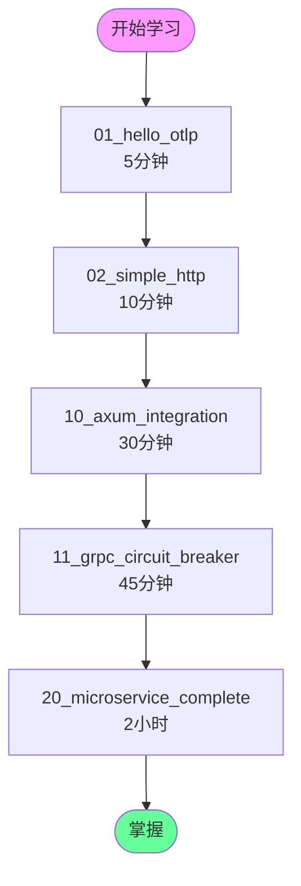

# 示例知识图谱

**版本**: 2.0
**日期**: 2025年10月28日
**状态**: ✅ 完整

---

## 📋 目录

1. [示例学习路径](#1-示例学习路径)
2. [示例依赖关系](#2-示例依赖关系)

---

## 🌐 示例学习路径

### 1.1 推荐学习顺序



---

## 🔗 示例依赖关系

```
01_hello_otlp
  └─ 基础: TracerProvider, Tracer, Span

02_simple_http
  └─ 依赖: 01_hello_otlp
  └─ 新增: Axum, HTTP Layer

10_axum_integration
  └─ 依赖: 02_simple_http
  └─ 新增: State, JSON, Routes

11_grpc_circuit_breaker
  └─ 依赖: 01_hello_otlp
  └─ 新增: Tonic, CircuitBreaker

20_microservice_complete
  └─ 依赖: 10, 11
  └─ 新增: RateLimiter, ObjectPool
```

---

## 🔗 相关资源

- [核心概念](./CONCEPTS.md) - 示例说明
- [对比矩阵](./COMPARISON_MATRIX.md) - 示例对比

---

**版本**: 2.0
**创建日期**: 2025-10-28

---

> **💡 提示**: 按照图中顺序学习，每个示例都可运行。
