# 社区文档贡献框架

**版本**: 1.0  
**日期**: 2025年10月26日  
**项目**: OTLP 社区文档贡献机制  
**状态**: 🚀 实施中

> **简介**: OTLP Rust 社区文档贡献框架 - 建立活跃、高效、高质量的社区文档贡献生态系统。

---

## 📋 目录

- [社区文档贡献框架](#社区文档贡献框架)
  - [📋 目录](#-目录)
  - [📋 项目概述](#-项目概述)
    - [核心目标](#核心目标)
  - [🏗️ 框架架构](#️-框架架构)
    - [1. 整体架构](#1-整体架构)
    - [2. 贡献平台](#2-贡献平台)
    - [3. 评审流程](#3-评审流程)
    - [4. 质量保证](#4-质量保证)
  - [📝 贡献指南](#-贡献指南)
  - [🎨 内容模板](#-内容模板)
  - [🔄 协作流程](#-协作流程)
  - [✅ 质量标准](#-质量标准)
  - [🏆 激励机制](#-激励机制)
  - [📊 指标监控](#-指标监控)
  - [🛠️ 工具支持](#️-工具支持)
  - [💡 最佳实践](#-最佳实践)
  - [📚 参考资源](#-参考资源)

---

## 📋 项目概述

本文档详细描述了 OTLP Rust 项目社区文档贡献框架的设计和实现，旨在建立一个活跃、高效、高质量的社区文档贡献生态系统。

### 核心目标

- 👥 **社区参与**: 鼓励社区成员积极参与文档贡献
- 🎯 **质量保证**: 确保贡献内容的高质量标准
- 🔄 **协作流程**: 建立高效的协作和评审流程
- 🏆 **激励机制**: 设计有效的贡献者激励机制
- 📈 **持续改进**: 基于反馈持续优化贡献体验

---

## 🏗️ 框架架构

### 1. 整体架构

```mermaid
graph TB
    A[社区贡献者] --> B[贡献平台]
    B --> C[内容审核]
    C --> D[质量检查]
    D --> E[评审流程]
    E --> F[合并发布]
    F --> G[反馈收集]
    G --> H[持续改进]
    
    I[贡献指南] --> B
    J[模板库] --> B
    K[示例库] --> B
    L[工具支持] --> B
    
    M[评审团队] --> E
    N[质量团队] --> D
    O[社区管理] --> G
```



### 2. 核心组件

#### 2.1 贡献平台 (ContributionPlatform)

```rust
// 贡献平台核心结构
use axum::{Router, routing::{get, post, put}, Json};
use serde::{Deserialize, Serialize};

#[derive(Debug, Clone)]
pub struct ContributionPlatform {
    db: Database,
    auth: AuthService,
    review: ReviewService,
    notification: NotificationService,
}

#[derive(Debug, Serialize, Deserialize)]
pub struct Contribution {
    pub id: String,
    pub title: String,
    pub description: String,
    pub content: String,
    pub author: String,
    pub status: ContributionStatus,
    pub category: ContributionCategory,
    pub tags: Vec<String>,
    pub created_at: chrono::DateTime<chrono::Utc>,
    pub updated_at: chrono::DateTime<chrono::Utc>,
    pub reviewers: Vec<String>,
    pub comments: Vec<Comment>,
}

#[derive(Debug, Serialize, Deserialize)]
pub enum ContributionStatus {
    Draft,
    UnderReview,
    Approved,
    Rejected,
    Merged,
    Archived,
}

#[derive(Debug, Serialize, Deserialize)]
pub enum ContributionCategory {
    Tutorial,
    ApiReference,
    BestPractice,
    Example,
    Translation,
    BugFix,
    Enhancement,
}

impl ContributionPlatform {
    pub async fn create_contribution(
        &self,
        author: &str,
        contribution: CreateContributionRequest,
    ) -> Result<Contribution, Error> {
        let contribution = Contribution {
            id: uuid::Uuid::new_v4().to_string(),
            title: contribution.title,
            description: contribution.description,
            content: contribution.content,
            author: author.to_string(),
            status: ContributionStatus::Draft,
            category: contribution.category,
            tags: contribution.tags,
            created_at: chrono::Utc::now(),
            updated_at: chrono::Utc::now(),
            reviewers: Vec::new(),
            comments: Vec::new(),
        };

        self.db.save_contribution(&contribution).await?;
        self.notification.notify_new_contribution(&contribution).await?;

        Ok(contribution)
    }

    pub async fn submit_for_review(
        &self,
        contribution_id: &str,
        author: &str,
    ) -> Result<(), Error> {
        let mut contribution = self.db.get_contribution(contribution_id).await?;
        
        if contribution.author != author {
            return Err(Error::Unauthorized);
        }

        if !matches!(contribution.status, ContributionStatus::Draft) {
            return Err(Error::InvalidStatus);
        }

        // 自动质量检查
        let quality_report = self.run_quality_check(&contribution).await?;
        if quality_report.score < 0.7 {
            return Err(Error::QualityCheckFailed(quality_report));
        }

        contribution.status = ContributionStatus::UnderReview;
        contribution.updated_at = chrono::Utc::now();

        self.db.update_contribution(&contribution).await?;
        self.notification.notify_review_requested(&contribution).await?;

        Ok(())
    }

    pub async fn add_review(
        &self,
        contribution_id: &str,
        reviewer: &str,
        review: ReviewRequest,
    ) -> Result<(), Error> {
        let mut contribution = self.db.get_contribution(contribution_id).await?;
        
        if !matches!(contribution.status, ContributionStatus::UnderReview) {
            return Err(Error::InvalidStatus);
        }

        let review_comment = Comment {
            id: uuid::Uuid::new_v4().to_string(),
            author: reviewer.to_string(),
            content: review.comment,
            review_type: review.review_type,
            created_at: chrono::Utc::now(),
        };

        contribution.comments.push(review_comment);
        contribution.reviewers.push(reviewer.to_string());
        contribution.updated_at = chrono::Utc::now();

        // 检查是否可以自动合并
        if self.can_auto_merge(&contribution).await? {
            contribution.status = ContributionStatus::Approved;
            self.merge_contribution(&contribution).await?;
        }

        self.db.update_contribution(&contribution).await?;
        self.notification.notify_review_added(&contribution, reviewer).await?;

        Ok(())
    }
}
```

#### 2.2 评审服务 (ReviewService)

```rust
// 评审服务实现
use std::collections::HashMap;

pub struct ReviewService {
    reviewers: HashMap<String, Reviewer>,
    review_rules: Vec<Box<dyn ReviewRule>>,
    auto_merge_rules: Vec<Box<dyn AutoMergeRule>>,
}

#[derive(Debug, Clone)]
pub struct Reviewer {
    pub id: String,
    pub name: String,
    pub email: String,
    pub expertise: Vec<String>,
    pub availability: ReviewerAvailability,
    pub review_count: u32,
    pub average_rating: f64,
}

#[derive(Debug, Clone)]
pub enum ReviewerAvailability {
    Available,
    Busy,
    Unavailable,
}

pub trait ReviewRule {
    fn name(&self) -> &str;
    fn check(&self, contribution: &Contribution) -> ReviewResult;
}

pub trait AutoMergeRule {
    fn name(&self) -> &str;
    fn can_auto_merge(&self, contribution: &Contribution) -> bool;
}

impl ReviewService {
    pub fn new() -> Self {
        let mut service = Self {
            reviewers: HashMap::new(),
            review_rules: Vec::new(),
            auto_merge_rules: Vec::new(),
        };

        service.register_default_rules();
        service
    }

    pub async fn assign_reviewers(
        &self,
        contribution: &Contribution,
    ) -> Result<Vec<String>, Error> {
        let mut assigned_reviewers = Vec::new();
        
        // 基于内容类型和专家领域分配评审者
        for (reviewer_id, reviewer) in &self.reviewers {
            if self.should_assign_reviewer(reviewer, contribution) {
                assigned_reviewers.push(reviewer_id.clone());
            }
        }

        // 确保至少有2个评审者
        if assigned_reviewers.len() < 2 {
            let additional_reviewers = self.find_additional_reviewers(contribution, 2 - assigned_reviewers.len()).await?;
            assigned_reviewers.extend(additional_reviewers);
        }

        Ok(assigned_reviewers)
    }

    pub async fn run_review_rules(
        &self,
        contribution: &Contribution,
    ) -> Result<Vec<ReviewResult>, Error> {
        let mut results = Vec::new();
        
        for rule in &self.review_rules {
            let result = rule.check(contribution);
            results.push(result);
        }

        Ok(results)
    }

    pub async fn can_auto_merge(
        &self,
        contribution: &Contribution,
    ) -> Result<bool, Error> {
        for rule in &self.auto_merge_rules {
            if !rule.can_auto_merge(contribution) {
                return Ok(false);
            }
        }
        Ok(true)
    }

    fn should_assign_reviewer(&self, reviewer: &Reviewer, contribution: &Contribution) -> bool {
        // 检查可用性
        if !matches!(reviewer.availability, ReviewerAvailability::Available) {
            return false;
        }

        // 检查专业领域匹配
        for tag in &contribution.tags {
            if reviewer.expertise.contains(tag) {
                return true;
            }
        }

        // 检查内容类型匹配
        match contribution.category {
            ContributionCategory::Tutorial => reviewer.expertise.contains(&"tutorial".to_string()),
            ContributionCategory::ApiReference => reviewer.expertise.contains(&"api".to_string()),
            ContributionCategory::BestPractice => reviewer.expertise.contains(&"best-practices".to_string()),
            _ => true,
        }
    }

    fn register_default_rules(&mut self) {
        self.review_rules.push(Box::new(ContentQualityRule::new()));
        self.review_rules.push(Box::new(FormattingRule::new()));
        self.review_rules.push(Box::new(AccuracyRule::new()));
        self.review_rules.push(Box::new(CompletenessRule::new()));

        self.auto_merge_rules.push(Box::new(ApprovalCountRule::new(2)));
        self.auto_merge_rules.push(Box::new(QualityScoreRule::new(0.8)));
        self.auto_merge_rules.push(Box::new(ConflictRule::new()));
    }
}
```

#### 2.3 质量检查规则

```rust
// 内容质量规则
pub struct ContentQualityRule {
    min_word_count: usize,
    max_word_count: usize,
    required_sections: Vec<String>,
}

impl ContentQualityRule {
    pub fn new() -> Self {
        Self {
            min_word_count: 100,
            max_word_count: 5000,
            required_sections: vec![
                "introduction".to_string(),
                "content".to_string(),
                "conclusion".to_string(),
            ],
        }
    }
}

impl ReviewRule for ContentQualityRule {
    fn name(&self) -> &str {
        "content_quality"
    }

    fn check(&self, contribution: &Contribution) -> ReviewResult {
        let mut issues = Vec::new();
        let mut score = 1.0;

        // 检查字数
        let word_count = contribution.content.split_whitespace().count();
        if word_count < self.min_word_count {
            issues.push(ReviewIssue {
                severity: IssueSeverity::Warning,
                message: format!("Content too short: {} words (minimum: {})", word_count, self.min_word_count),
                suggestion: Some("Add more detailed content".to_string()),
            });
            score -= 0.2;
        } else if word_count > self.max_word_count {
            issues.push(ReviewIssue {
                severity: IssueSeverity::Warning,
                message: format!("Content too long: {} words (maximum: {})", word_count, self.max_word_count),
                suggestion: Some("Consider splitting into multiple sections".to_string()),
            });
            score -= 0.1;
        }

        // 检查必需章节
        for section in &self.required_sections {
            if !contribution.content.to_lowercase().contains(section) {
                issues.push(ReviewIssue {
                    severity: IssueSeverity::Error,
                    message: format!("Missing required section: {}", section),
                    suggestion: Some(format!("Add a {} section", section)),
                });
                score -= 0.3;
            }
        }

        // 检查代码示例
        if contribution.content.contains("```") {
            let code_blocks = contribution.content.matches("```").count() / 2;
            if code_blocks == 0 {
                issues.push(ReviewIssue {
                    severity: IssueSeverity::Warning,
                    message: "No code examples found".to_string(),
                    suggestion: Some("Add code examples to illustrate concepts".to_string()),
                });
                score -= 0.1;
            }
        }

        ReviewResult {
            rule_name: self.name().to_string(),
            score: score.max(0.0),
            issues,
            passed: score >= 0.7,
        }
    }
}

// 格式检查规则
pub struct FormattingRule;

impl FormattingRule {
    pub fn new() -> Self {
        Self
    }
}

impl ReviewRule for FormattingRule {
    fn name(&self) -> &str {
        "formatting"
    }

    fn check(&self, contribution: &Contribution) -> ReviewResult {
        let mut issues = Vec::new();
        let mut score = 1.0;

        // 检查 Markdown 格式
        let lines = contribution.content.lines();
        for (line_num, line) in lines.enumerate() {
            // 检查标题格式
            if line.starts_with('#') {
                if !line.starts_with("##") && !line.starts_with("###") {
                    issues.push(ReviewIssue {
                        severity: IssueSeverity::Warning,
                        message: format!("Use ## or ### for headings (line {})", line_num + 1),
                        suggestion: Some("Use ## for main headings, ### for subheadings".to_string()),
                    });
                    score -= 0.05;
                }
            }

            // 检查行长度
            if line.len() > 120 {
                issues.push(ReviewIssue {
                    severity: IssueSeverity::Warning,
                    message: format!("Line too long: {} characters (line {})", line.len(), line_num + 1),
                    suggestion: Some("Break long lines for better readability".to_string()),
                });
                score -= 0.02;
            }

            // 检查代码块格式
            if line.contains("```") && !line.starts_with("```") {
                issues.push(ReviewIssue {
                    severity: IssueSeverity::Error,
                    message: format!("Code block not properly formatted (line {})", line_num + 1),
                    suggestion: Some("Use ```language for code blocks".to_string()),
                });
                score -= 0.1;
            }
        }

        ReviewResult {
            rule_name: self.name().to_string(),
            score: score.max(0.0),
            issues,
            passed: score >= 0.8,
        }
    }
}
```

### 3. 贡献者管理系统

#### 3.1 贡献者档案

```rust
// 贡献者管理系统
use std::collections::HashMap;

pub struct ContributorManager {
    contributors: HashMap<String, Contributor>,
    achievements: Vec<Achievement>,
    rewards: Vec<Reward>,
}

#[derive(Debug, Clone)]
pub struct Contributor {
    pub id: String,
    pub username: String,
    pub email: String,
    pub name: String,
    pub avatar_url: Option<String>,
    pub join_date: chrono::DateTime<chrono::Utc>,
    pub contributions: Vec<ContributionSummary>,
    pub skills: Vec<String>,
    pub interests: Vec<String>,
    pub level: ContributorLevel,
    pub points: u32,
    pub badges: Vec<Badge>,
    pub achievements: Vec<Achievement>,
}

#[derive(Debug, Clone)]
pub enum ContributorLevel {
    Newcomer,
    Contributor,
    Reviewer,
    Maintainer,
    Expert,
}

#[derive(Debug, Clone)]
pub struct ContributionSummary {
    pub id: String,
    pub title: String,
    pub category: ContributionCategory,
    pub status: ContributionStatus,
    pub points_earned: u32,
    pub created_at: chrono::DateTime<chrono::Utc>,
}

#[derive(Debug, Clone)]
pub struct Badge {
    pub id: String,
    pub name: String,
    pub description: String,
    pub icon: String,
    pub earned_at: chrono::DateTime<chrono::Utc>,
}

impl ContributorManager {
    pub async fn create_contributor(
        &mut self,
        username: String,
        email: String,
        name: String,
    ) -> Result<Contributor, Error> {
        let contributor = Contributor {
            id: uuid::Uuid::new_v4().to_string(),
            username: username.clone(),
            email,
            name,
            avatar_url: None,
            join_date: chrono::Utc::now(),
            contributions: Vec::new(),
            skills: Vec::new(),
            interests: Vec::new(),
            level: ContributorLevel::Newcomer,
            points: 0,
            badges: Vec::new(),
            achievements: Vec::new(),
        };

        self.contributors.insert(username, contributor.clone());
        Ok(contributor)
    }

    pub async fn add_contribution(
        &mut self,
        contributor_id: &str,
        contribution: ContributionSummary,
    ) -> Result<(), Error> {
        if let Some(contributor) = self.contributors.get_mut(contributor_id) {
            contributor.contributions.push(contribution.clone());
            contributor.points += contribution.points_earned;
            
            // 检查等级提升
            self.check_level_up(contributor).await?;
            
            // 检查成就解锁
            self.check_achievements(contributor).await?;
        }

        Ok(())
    }

    pub async fn award_badge(
        &mut self,
        contributor_id: &str,
        badge: Badge,
    ) -> Result<(), Error> {
        if let Some(contributor) = self.contributors.get_mut(contributor_id) {
            contributor.badges.push(badge);
        }

        Ok(())
    }

    async fn check_level_up(&self, contributor: &mut Contributor) -> Result<(), Error> {
        let new_level = match contributor.points {
            0..=99 => ContributorLevel::Newcomer,
            100..=499 => ContributorLevel::Contributor,
            500..=1499 => ContributorLevel::Reviewer,
            1500..=4999 => ContributorLevel::Maintainer,
            _ => ContributorLevel::Expert,
        };

        if !matches!(contributor.level, new_level) {
            contributor.level = new_level;
            // 发送等级提升通知
        }

        Ok(())
    }

    async fn check_achievements(&self, contributor: &mut Contributor) -> Result<(), Error> {
        for achievement in &self.achievements {
            if !contributor.achievements.iter().any(|a| a.id == achievement.id) {
                if self.check_achievement_conditions(contributor, achievement).await? {
                    contributor.achievements.push(achievement.clone());
                    // 发送成就解锁通知
                }
            }
        }

        Ok(())
    }

    async fn check_achievement_conditions(
        &self,
        contributor: &Contributor,
        achievement: &Achievement,
    ) -> Result<bool, Error> {
        match achievement.condition_type.as_str() {
            "contribution_count" => {
                let count = contributor.contributions.len();
                Ok(count >= achievement.condition_value)
            }
            "points_earned" => {
                Ok(contributor.points >= achievement.condition_value)
            }
            "category_contributions" => {
                let category_count = contributor.contributions
                    .iter()
                    .filter(|c| matches!(c.category, achievement.condition_category))
                    .count();
                Ok(category_count >= achievement.condition_value)
            }
            _ => Ok(false),
        }
    }
}
```

#### 3.2 激励机制

```rust
// 激励机制实现
pub struct RewardSystem {
    point_rules: Vec<PointRule>,
    badge_rules: Vec<BadgeRule>,
    achievement_rules: Vec<AchievementRule>,
}

#[derive(Debug, Clone)]
pub struct PointRule {
    pub action: String,
    pub points: u32,
    pub multiplier: f64,
    pub conditions: Vec<String>,
}

#[derive(Debug, Clone)]
pub struct BadgeRule {
    pub badge_id: String,
    pub condition: BadgeCondition,
    pub description: String,
}

#[derive(Debug, Clone)]
pub enum BadgeCondition {
    ContributionCount(u32),
    PointsEarned(u32),
    CategoryContributions(String, u32),
    ReviewCount(u32),
    QualityScore(f64),
}

impl RewardSystem {
    pub fn new() -> Self {
        let mut system = Self {
            point_rules: Vec::new(),
            badge_rules: Vec::new(),
            achievement_rules: Vec::new(),
        };

        system.register_default_rules();
        system
    }

    pub async fn calculate_points(
        &self,
        action: &str,
        contribution: &Contribution,
    ) -> Result<u32, Error> {
        for rule in &self.point_rules {
            if rule.action == action {
                let mut points = rule.points;
                
                // 应用倍数
                points = (points as f64 * rule.multiplier) as u32;
                
                // 检查条件
                if self.check_conditions(&rule.conditions, contribution).await? {
                    return Ok(points);
                }
            }
        }

        Ok(0)
    }

    pub async fn check_badge_eligibility(
        &self,
        contributor: &Contributor,
    ) -> Result<Vec<Badge>, Error> {
        let mut eligible_badges = Vec::new();

        for rule in &self.badge_rules {
            if self.check_badge_condition(contributor, &rule.condition).await? {
                let badge = Badge {
                    id: rule.badge_id.clone(),
                    name: rule.badge_id.clone(),
                    description: rule.description.clone(),
                    icon: format!("badge_{}.svg", rule.badge_id),
                    earned_at: chrono::Utc::now(),
                };
                eligible_badges.push(badge);
            }
        }

        Ok(eligible_badges)
    }

    fn register_default_rules(&mut self) {
        // 积分规则
        self.point_rules.push(PointRule {
            action: "create_contribution".to_string(),
            points: 10,
            multiplier: 1.0,
            conditions: vec![],
        });

        self.point_rules.push(PointRule {
            action: "contribution_approved".to_string(),
            points: 50,
            multiplier: 1.0,
            conditions: vec!["quality_score > 0.8".to_string()],
        });

        self.point_rules.push(PointRule {
            action: "contribution_merged".to_string(),
            points: 100,
            multiplier: 1.0,
            conditions: vec![],
        });

        self.point_rules.push(PointRule {
            action: "review_contribution".to_string(),
            points: 20,
            multiplier: 1.0,
            conditions: vec![],
        });

        // 徽章规则
        self.badge_rules.push(BadgeRule {
            badge_id: "first_contribution".to_string(),
            condition: BadgeCondition::ContributionCount(1),
            description: "Made your first contribution".to_string(),
        });

        self.badge_rules.push(BadgeRule {
            badge_id: "quality_contributor".to_string(),
            condition: BadgeCondition::QualityScore(0.9),
            description: "Consistently high-quality contributions".to_string(),
        });

        self.badge_rules.push(BadgeRule {
            badge_id: "reviewer".to_string(),
            condition: BadgeCondition::ReviewCount(10),
            description: "Reviewed 10 contributions".to_string(),
        });
    }
}
```

---

## 🌐 Web 平台实现

### 1. 前端界面

#### 1.1 贡献者仪表板

```typescript
// 贡献者仪表板组件
import React, { useState, useEffect } from 'react';
import { Card, Progress, Badge, List, Avatar } from 'antd';

interface ContributorDashboardProps {
  contributorId: string;
}

export const ContributorDashboard: React.FC<ContributorDashboardProps> = ({
  contributorId
}) => {
  const [contributor, setContributor] = useState<Contributor | null>(null);
  const [loading, setLoading] = useState(true);

  useEffect(() => {
    fetchContributorData(contributorId).then(setContributor).finally(() => setLoading(false));
  }, [contributorId]);

  if (loading) return <div>Loading...</div>;
  if (!contributor) return <div>Contributor not found</div>;

  return (
    <div className="contributor-dashboard">
      <div className="profile-header">
        <Avatar size={64} src={contributor.avatarUrl}>
          {contributor.name.charAt(0)}
        </Avatar>
        <div className="profile-info">
          <h1>{contributor.name}</h1>
          <p>@{contributor.username}</p>
          <Badge count={contributor.level} color="blue" />
        </div>
      </div>

      <div className="stats-grid">
        <Card title="Points" className="stat-card">
          <div className="stat-value">{contributor.points}</div>
          <Progress percent={getLevelProgress(contributor)} />
        </Card>

        <Card title="Contributions" className="stat-card">
          <div className="stat-value">{contributor.contributions.length}</div>
          <div className="stat-label">Total contributions</div>
        </Card>

        <Card title="Reviews" className="stat-card">
          <div className="stat-value">{contributor.reviewCount}</div>
          <div className="stat-label">Reviews completed</div>
        </Card>

        <Card title="Quality Score" className="stat-card">
          <div className="stat-value">{contributor.averageQualityScore}%</div>
          <div className="stat-label">Average quality</div>
        </Card>
      </div>

      <div className="badges-section">
        <h2>Badges</h2>
        <div className="badges-grid">
          {contributor.badges.map(badge => (
            <div key={badge.id} className="badge-item">
              
              <span>{badge.name}</span>
            </div>
          ))}
        </div>
      </div>

      <div className="recent-contributions">
        <h2>Recent Contributions</h2>
        <List
          dataSource={contributor.contributions.slice(0, 5)}
          renderItem={contribution => (
            <List.Item>
              <List.Item.Meta
                title={contribution.title}
                description={`${contribution.category} • ${contribution.status}`}
              />
              <div>+{contribution.pointsEarned} points</div>
            </List.Item>
          )}
        />
      </div>
    </div>
  );
};
```

#### 1.2 贡献创建界面

```typescript
// 贡献创建组件
import React, { useState } from 'react';
import { Form, Input, Select, Button, Upload, message } from 'antd';
import { Editor } from '@monaco-editor/react';

interface CreateContributionProps {
  onSubmit: (contribution: CreateContributionRequest) => void;
}

export const CreateContribution: React.FC<CreateContributionProps> = ({
  onSubmit
}) => {
  const [form] = Form.useForm();
  const [content, setContent] = useState('');
  const [loading, setLoading] = useState(false);

  const handleSubmit = async (values: any) => {
    setLoading(true);
    try {
      await onSubmit({
        ...values,
        content,
      });
      message.success('Contribution created successfully!');
      form.resetFields();
      setContent('');
    } catch (error) {
      message.error('Failed to create contribution');
    } finally {
      setLoading(false);
    }
  };

  return (
    <div className="create-contribution">
      <h1>Create New Contribution</h1>
      
      <Form
        form={form}
        layout="vertical"
        onFinish={handleSubmit}
        className="contribution-form"
      >
        <Form.Item
          name="title"
          label="Title"
          rules={[{ required: true, message: 'Please enter a title' }]}
        >
          <Input placeholder="Enter contribution title" />
        </Form.Item>

        <Form.Item
          name="description"
          label="Description"
          rules={[{ required: true, message: 'Please enter a description' }]}
        >
          <Input.TextArea
            rows={3}
            placeholder="Brief description of your contribution"
          />
        </Form.Item>

        <Form.Item
          name="category"
          label="Category"
          rules={[{ required: true, message: 'Please select a category' }]}
        >
          <Select placeholder="Select category">
            <Select.Option value="tutorial">Tutorial</Select.Option>
            <Select.Option value="api_reference">API Reference</Select.Option>
            <Select.Option value="best_practice">Best Practice</Select.Option>
            <Select.Option value="example">Example</Select.Option>
            <Select.Option value="translation">Translation</Select.Option>
            <Select.Option value="bug_fix">Bug Fix</Select.Option>
            <Select.Option value="enhancement">Enhancement</Select.Option>
          </Select>
        </Form.Item>

        <Form.Item
          name="tags"
          label="Tags"
        >
          <Select
            mode="tags"
            placeholder="Add tags"
            style={{ width: '100%' }}
          />
        </Form.Item>

        <Form.Item
          label="Content"
          rules={[{ required: true, message: 'Please enter content' }]}
        >
          <Editor
            height="400px"
            language="markdown"
            theme="vs-light"
            value={content}
            onChange={(value) => setContent(value || '')}
            options={{
              minimap: { enabled: false },
              fontSize: 14,
              lineNumbers: 'on',
              wordWrap: 'on',
            }}
          />
        </Form.Item>

        <Form.Item>
          <Button type="primary" htmlType="submit" loading={loading}>
            Create Contribution
          </Button>
        </Form.Item>
      </Form>
    </div>
  );
};
```

#### 1.3 评审界面

```typescript
// 评审界面组件
import React, { useState } from 'react';
import { Card, Form, Input, Button, Rate, Tag, Comment, List } from 'antd';

interface ReviewInterfaceProps {
  contribution: Contribution;
  onReview: (review: ReviewRequest) => void;
}

export const ReviewInterface: React.FC<ReviewInterfaceProps> = ({
  contribution,
  onReview
}) => {
  const [form] = Form.useForm();
  const [loading, setLoading] = useState(false);

  const handleReview = async (values: any) => {
    setLoading(true);
    try {
      await onReview({
        reviewType: values.reviewType,
        comment: values.comment,
        rating: values.rating,
        suggestions: values.suggestions,
      });
      form.resetFields();
    } catch (error) {
      console.error('Review failed:', error);
    } finally {
      setLoading(false);
    }
  };

  return (
    <div className="review-interface">
      <Card title={`Review: ${contribution.title}`}>
        <div className="contribution-preview">
          <div className="contribution-meta">
            <Tag color="blue">{contribution.category}</Tag>
            <span>By {contribution.author}</span>
            <span>Created {contribution.createdAt}</span>
          </div>
          
          <div className="contribution-content">
            <h3>Description</h3>
            <p>{contribution.description}</p>
            
            <h3>Content</h3>
            <div className="markdown-content">
              {/* 这里可以渲染 Markdown 内容 */}
              <pre>{contribution.content}</pre>
            </div>
          </div>
        </div>

        <div className="review-form">
          <h3>Add Review</h3>
          <Form form={form} onFinish={handleReview}>
            <Form.Item
              name="reviewType"
              label="Review Type"
              rules={[{ required: true }]}
            >
              <Select>
                <Select.Option value="approve">Approve</Select.Option>
                <Select.Option value="request_changes">Request Changes</Select.Option>
                <Select.Option value="reject">Reject</Select.Option>
              </Select>
            </Form.Item>

            <Form.Item
              name="rating"
              label="Quality Rating"
            >
              <Rate />
            </Form.Item>

            <Form.Item
              name="comment"
              label="Review Comment"
              rules={[{ required: true }]}
            >
              <Input.TextArea
                rows={4}
                placeholder="Provide detailed feedback..."
              />
            </Form.Item>

            <Form.Item
              name="suggestions"
              label="Suggestions"
            >
              <Input.TextArea
                rows={3}
                placeholder="Optional suggestions for improvement..."
              />
            </Form.Item>

            <Form.Item>
              <Button type="primary" htmlType="submit" loading={loading}>
                Submit Review
              </Button>
            </Form.Item>
          </Form>
        </div>

        <div className="existing-reviews">
          <h3>Existing Reviews</h3>
          <List
            dataSource={contribution.comments}
            renderItem={comment => (
              <Comment
                author={comment.author}
                content={comment.content}
                datetime={comment.createdAt}
              />
            )}
          />
        </div>
      </Card>
    </div>
  );
};
```

### 2. API 接口

#### 2.1 REST API 设计

```rust
// API 路由定义
use axum::{
    Router,
    routing::{get, post, put, delete},
    Json, Path, Query,
};

pub fn create_api_routes() -> Router {
    Router::new()
        // 贡献相关
        .route("/api/contributions", post(create_contribution))
        .route("/api/contributions", get(list_contributions))
        .route("/api/contributions/:id", get(get_contribution))
        .route("/api/contributions/:id", put(update_contribution))
        .route("/api/contributions/:id/submit", post(submit_for_review))
        .route("/api/contributions/:id/review", post(add_review))
        .route("/api/contributions/:id/merge", post(merge_contribution))
        
        // 贡献者相关
        .route("/api/contributors", get(list_contributors))
        .route("/api/contributors/:id", get(get_contributor))
        .route("/api/contributors/:id/profile", put(update_profile))
        .route("/api/contributors/:id/badges", get(get_badges))
        
        // 评审相关
        .route("/api/reviews", get(list_reviews))
        .route("/api/reviews/:id", get(get_review))
        .route("/api/reviewers", get(list_reviewers))
        .route("/api/reviewers/:id/assignments", get(get_assignments))
        
        // 统计相关
        .route("/api/stats/contributions", get(get_contribution_stats))
        .route("/api/stats/contributors", get(get_contributor_stats))
        .route("/api/stats/quality", get(get_quality_stats))
}

// 创建贡献
pub async fn create_contribution(
    auth: AuthUser,
    Json(request): Json<CreateContributionRequest>,
) -> Result<Json<Contribution>, AppError> {
    let contribution = contribution_platform
        .create_contribution(&auth.user_id, request)
        .await?;
    
    Ok(Json(contribution))
}

// 获取贡献列表
pub async fn list_contributions(
    Query(params): Query<ContributionQueryParams>,
) -> Result<Json<ContributionListResponse>, AppError> {
    let contributions = contribution_platform
        .list_contributions(params)
        .await?;
    
    Ok(Json(contributions))
}

// 提交评审
pub async fn submit_for_review(
    auth: AuthUser,
    Path(contribution_id): Path<String>,
) -> Result<Json<()>, AppError> {
    contribution_platform
        .submit_for_review(&contribution_id, &auth.user_id)
        .await?;
    
    Ok(Json(()))
}

// 添加评审
pub async fn add_review(
    auth: AuthUser,
    Path(contribution_id): Path<String>,
    Json(request): Json<ReviewRequest>,
) -> Result<Json<()>, AppError> {
    contribution_platform
        .add_review(&contribution_id, &auth.user_id, request)
        .await?;
    
    Ok(Json(()))
}
```

---

## 📊 分析和报告

### 1. 贡献分析

#### 1.1 贡献统计

```rust
// 贡献分析服务
pub struct ContributionAnalytics {
    db: Database,
}

impl ContributionAnalytics {
    pub async fn get_contribution_stats(
        &self,
        time_range: TimeRange,
    ) -> Result<ContributionStats, Error> {
        let contributions = self.db.get_contributions_in_range(time_range).await?;
        
        let total_contributions = contributions.len();
        let approved_contributions = contributions.iter()
            .filter(|c| matches!(c.status, ContributionStatus::Approved | ContributionStatus::Merged))
            .count();
        
        let category_stats = self.calculate_category_stats(&contributions);
        let quality_stats = self.calculate_quality_stats(&contributions);
        let contributor_stats = self.calculate_contributor_stats(&contributions);
        
        Ok(ContributionStats {
            total_contributions,
            approved_contributions,
            approval_rate: approved_contributions as f64 / total_contributions as f64,
            category_stats,
            quality_stats,
            contributor_stats,
            time_range,
        })
    }

    pub async fn get_contributor_leaderboard(
        &self,
        limit: usize,
    ) -> Result<Vec<ContributorRanking>, Error> {
        let contributors = self.db.get_top_contributors(limit).await?;
        
        let mut rankings = Vec::new();
        for (rank, contributor) in contributors.iter().enumerate() {
            rankings.push(ContributorRanking {
                rank: rank + 1,
                contributor_id: contributor.id.clone(),
                name: contributor.name.clone(),
                username: contributor.username.clone(),
                points: contributor.points,
                contributions_count: contributor.contributions.len(),
                average_quality_score: self.calculate_average_quality(&contributor.contributions),
            });
        }
        
        Ok(rankings)
    }

    pub async fn get_quality_trends(
        &self,
        time_range: TimeRange,
    ) -> Result<QualityTrends, Error> {
        let contributions = self.db.get_contributions_in_range(time_range).await?;
        
        let mut daily_scores = std::collections::HashMap::new();
        for contribution in &contributions {
            let date = contribution.created_at.date();
            let score = self.calculate_contribution_quality_score(contribution).await?;
            
            daily_scores.entry(date)
                .or_insert_with(Vec::new)
                .push(score);
        }
        
        let trend_data = daily_scores.into_iter()
            .map(|(date, scores)| {
                let average_score = scores.iter().sum::<f64>() / scores.len() as f64;
                TrendPoint { date, value: average_score }
            })
            .collect();
        
        Ok(QualityTrends { trend_data })
    }
}
```

#### 1.2 报告生成

```typescript
// 报告生成组件
import React from 'react';
import { Card, Table, Chart, Statistic } from 'antd';

interface AnalyticsDashboardProps {
  stats: ContributionStats;
  leaderboard: ContributorRanking[];
  trends: QualityTrends;
}

export const AnalyticsDashboard: React.FC<AnalyticsDashboardProps> = ({
  stats,
  leaderboard,
  trends
}) => {
  const leaderboardColumns = [
    {
      title: 'Rank',
      dataIndex: 'rank',
      key: 'rank',
    },
    {
      title: 'Contributor',
      dataIndex: 'name',
      key: 'name',
      render: (name: string, record: ContributorRanking) => (
        <div>
          <div>{name}</div>
          <div className="username">@{record.username}</div>
        </div>
      ),
    },
    {
      title: 'Points',
      dataIndex: 'points',
      key: 'points',
    },
    {
      title: 'Contributions',
      dataIndex: 'contributionsCount',
      key: 'contributionsCount',
    },
    {
      title: 'Quality Score',
      dataIndex: 'averageQualityScore',
      key: 'averageQualityScore',
      render: (score: number) => `${(score * 100).toFixed(1)}%`,
    },
  ];

  return (
    <div className="analytics-dashboard">
      <div className="stats-overview">
        <Card>
          <Statistic
            title="Total Contributions"
            value={stats.totalContributions}
          />
        </Card>
        <Card>
          <Statistic
            title="Approval Rate"
            value={stats.approvalRate * 100}
            precision={1}
            suffix="%"
          />
        </Card>
        <Card>
          <Statistic
            title="Active Contributors"
            value={stats.contributorStats.activeContributors}
          />
        </Card>
        <Card>
          <Statistic
            title="Average Quality"
            value={stats.qualityStats.averageScore * 100}
            precision={1}
            suffix="%"
          />
        </Card>
      </div>

      <div className="charts-section">
        <Card title="Contribution Categories">
          <Chart
            type="pie"
            data={stats.categoryStats}
            config={{
              angleField: 'count',
              colorField: 'category',
            }}
          />
        </Card>

        <Card title="Quality Trends">
          <Chart
            type="line"
            data={trends.trendData}
            config={{
              xField: 'date',
              yField: 'value',
            }}
          />
        </Card>
      </div>

      <Card title="Contributor Leaderboard">
        <Table
          columns={leaderboardColumns}
          dataSource={leaderboard}
          pagination={false}
        />
      </Card>
    </div>
  );
};
```

---

## 🎯 实施计划

### 阶段一：基础平台建设 (6-8周)

#### 第1-2周：需求分析和设计

- [ ] 完成需求分析
- [ ] 设计系统架构
- [ ] 确定技术栈
- [ ] 创建项目结构

#### 第3-4周：核心功能开发

- [ ] 实现贡献平台后端
- [ ] 开发基础前端界面
- [ ] 实现用户认证系统
- [ ] 建立数据库模型

#### 第5-6周：评审系统

- [ ] 实现评审流程
- [ ] 开发质量检查规则
- [ ] 创建评审界面
- [ ] 实现通知系统

#### 第7-8周：测试和优化

- [ ] 单元测试和集成测试
- [ ] 性能优化
- [ ] 安全加固
- [ ] 用户界面优化

### 阶段二：高级功能 (4-6周)

#### 第9-10周：激励机制

- [ ] 实现积分系统
- [ ] 开发徽章系统
- [ ] 创建成就系统
- [ ] 实现排行榜

#### 第11-12周：分析报告

- [ ] 开发分析功能
- [ ] 实现报告生成
- [ ] 创建仪表板
- [ ] 添加数据可视化

#### 第13-14周：社区功能

- [ ] 实现讨论功能
- [ ] 开发协作工具
- [ ] 添加反馈系统
- [ ] 创建帮助中心

### 阶段三：推广和优化 (2-4周)

#### 第15-16周：社区推广

- [ ] 发布平台
- [ ] 社区宣传
- [ ] 用户培训
- [ ] 收集反馈

#### 第17-18周：持续改进

- [ ] 基于反馈优化
- [ ] 添加新功能
- [ ] 性能调优
- [ ] 文档完善

---

## 📞 项目联系

**项目负责人**: 社区管理团队  
**技术负责人**: 全栈开发工程师  
**产品负责人**: 社区产品经理  
**运营负责人**: 社区运营专家

**联系方式**:

- **邮箱**: <community@otlp-rust.org>
- **GitHub**: <https://github.com/otlp-rust/community-platform>
- **讨论区**: <https://github.com/otlp-rust/community-platform/discussions>
- **Slack**: #community-platform

---

## 🙏 致谢

感谢所有参与社区贡献框架设计的团队成员。特别感谢：

- **社区管理团队**: 设计了完整的社区机制
- **开发团队**: 构建了强大的技术平台
- **设计团队**: 创造了优秀的用户体验
- **运营团队**: 制定了有效的推广策略
- **社区贡献者**: 提供了宝贵的建议和反馈

---

**框架版本**: v1.0.0  
**最后更新**: 2025年1月  
**状态**: 实施中

👥 **让我们一起建设最活跃的开源社区！** 🚀
