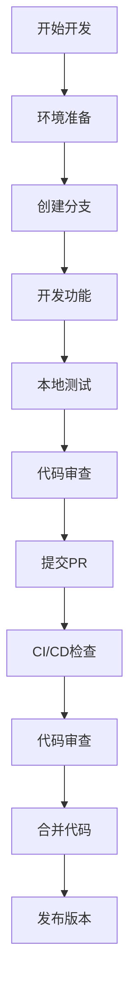

# 🔧 OTLP Rust 开发工作流程

**版本**: 1.0  
**更新日期**: 2025年10月26日  
**适用对象**: 所有开发者  
**状态**: 🟢 活跃维护

> **简介**: 开发工作流程 - 从环境准备到PR合并的完整开发流程和最佳实践。

---

## 📋 工作流程概览



---

## 🚀 开发环境设置

### 1. 系统要求

```bash
# Rust版本
rustc --version  # 需要 1.90.0+

# 操作系统
uname -a  # Windows 10+, macOS 10.15+, Ubuntu 18.04+

# 内存要求
free -h  # 建议 4GB+
```

### 2. 工具安装

```bash
# 安装Rust工具链
rustup install 1.90.0
rustup default 1.90.0

# 安装开发工具
cargo install cargo-tarpaulin  # 测试覆盖率
cargo install cargo-audit      # 安全审计
cargo install cargo-outdated   # 依赖更新检查
cargo install cargo-machete    # 清理未使用依赖

# 安装IDE插件
# VS Code: rust-analyzer
# IntelliJ: Rust plugin
```

### 3. 项目设置

```bash
# 克隆项目
git clone https://github.com/your-repo/otlp-rust.git
cd otlp-rust

# 安装依赖
cargo build

# 运行测试
cargo test

# 检查代码质量
cargo clippy --all-targets --all-features -- -D warnings
```

---

## 🔄 日常开发流程

### 1. 开始新功能

```bash
# 更新主分支
git checkout main
git pull origin main

# 创建功能分支
git checkout -b feature/your-feature-name

# 或修复分支
git checkout -b fix/your-bug-fix
```

### 2. 开发过程

```bash
# 开发循环
while developing; do
    # 编写代码
    vim src/your_file.rs
    
    # 检查编译
    cargo check
    
    # 运行测试
    cargo test --lib
    
    # 格式化代码
    cargo fmt
    
    # 检查代码质量
    cargo clippy
done
```

### 3. 提交代码

```bash
# 添加文件
git add src/your_file.rs

# 提交更改
git commit -m "feat(module): add new functionality"

# 推送分支
git push origin feature/your-feature-name
```

---

## 🧪 测试策略

### 1. 测试类型

#### 单元测试

```bash
# 运行单元测试
cargo test --lib

# 运行特定测试
cargo test test_function_name

# 运行测试并显示输出
cargo test -- --nocapture
```

#### 集成测试

```bash
# 运行集成测试
cargo test --test integration

# 运行所有测试
cargo test --all-features
```

#### 基准测试

```bash
# 运行基准测试
cargo bench

# 运行特定基准
cargo bench --bench simple_benchmarks
```

### 2. 测试覆盖率

```bash
# 生成覆盖率报告
cargo tarpaulin --out Html --output-dir coverage/

# 查看覆盖率
open coverage/tarpaulin-report.html

# 目标覆盖率: 80%+
```

### 3. 性能测试

```bash
# 运行性能基准
cargo bench --bench simple_benchmarks

# 对比性能变化
cargo bench --bench simple_benchmarks -- --save-baseline main
cargo bench --bench simple_benchmarks -- --baseline main
```

---

## 🔍 代码质量检查

### 1. 静态分析

```bash
# Clippy检查
cargo clippy --all-targets --all-features -- -D warnings

# 格式化检查
cargo fmt -- --check

# 安全审计
cargo audit
```

### 2. 依赖管理

```bash
# 检查过时依赖
cargo outdated

# 清理未使用依赖
cargo machete

# 更新依赖
cargo update
```

### 3. 文档检查

```bash
# 生成文档
cargo doc --no-deps --open

# 检查文档链接
cargo doc --no-deps --document-private-items
```

---

## 🚀 CI/CD流水线

### 1. 自动检查

```yaml
# .github/workflows/ci.yml
name: CI
on: [push, pull_request]

jobs:
  test:
    runs-on: ubuntu-latest
    steps:
      - uses: actions/checkout@v4
      - uses: actions-rs/toolchain@v1
        with:
          toolchain: 1.90.0
      
      # 编译检查
      - run: cargo check --all-features
      
      # 测试
      - run: cargo test --all-features
      
      # 代码质量
      - run: cargo clippy --all-features -- -D warnings
      - run: cargo fmt -- --check
      
      # 安全审计
      - run: cargo audit
      
      # 覆盖率
      - run: cargo tarpaulin --out Xml
```

### 2. 发布流程

```bash
# 版本发布
git tag v0.1.0
git push origin v0.1.0

# 发布到crates.io
cargo publish
```

---

## 📝 代码审查流程

### 1. 审查清单

- [ ] **功能正确性**
  - 功能按预期工作
  - 边界情况处理
  - 错误处理完善

- [ ] **代码质量**
  - 代码风格一致
  - 命名规范
  - 注释完整

- [ ] **测试覆盖**
  - 单元测试通过
  - 集成测试通过
  - 覆盖率达标

- [ ] **性能影响**
  - 无性能回归
  - 内存使用合理
  - 并发安全

- [ ] **安全性**
  - 无安全漏洞
  - 输入验证
  - 权限控制

### 2. 审查工具

```bash
# 代码审查工具
cargo clippy --all-targets --all-features -- -D warnings
cargo audit
cargo tarpaulin --out Html
```

---

## 🎯 发布管理

### 1. 版本策略

```toml
# Cargo.toml
[package]
version = "0.1.0"  # 语义化版本

# 版本规则
# MAJOR.MINOR.PATCH
# MAJOR: 不兼容的API更改
# MINOR: 向后兼容的功能添加
# PATCH: 向后兼容的bug修复
```

### 2. 发布检查清单

- [ ] **代码质量**
  - 所有测试通过
  - 代码覆盖率达标
  - 无安全漏洞

- [ ] **文档完整**
  - API文档更新
  - README更新
  - CHANGELOG更新

- [ ] **性能验证**
  - 基准测试通过
  - 无性能回归
  - 内存使用正常

- [ ] **兼容性**
  - 向后兼容
  - 依赖版本兼容
  - 平台兼容

### 3. 发布流程

```bash
# 1. 更新版本
vim Cargo.toml  # 更新版本号

# 2. 更新CHANGELOG
vim CHANGELOG.md

# 3. 提交版本
git add Cargo.toml CHANGELOG.md
git commit -m "chore: release v0.1.0"

# 4. 创建标签
git tag v0.1.0
git push origin v0.1.0

# 5. 发布到crates.io
cargo publish
```

---

## 🔧 开发工具配置

### 1. VS Code配置

```json
// .vscode/settings.json
{
    "rust-analyzer.checkOnSave.command": "clippy",
    "rust-analyzer.checkOnSave.allTargets": true,
    "rust-analyzer.cargo.features": "all",
    "editor.formatOnSave": true,
    "editor.codeActionsOnSave": {
        "source.fixAll": true
    }
}
```

### 2. Git配置

```bash
# .gitconfig
[user]
    name = Your Name
    email = your.email@example.com

[core]
    editor = vim
    autocrlf = false

[push]
    default = simple

[alias]
    st = status
    co = checkout
    br = branch
    ci = commit
    di = diff
```

### 3. Cargo配置

```toml
# .cargo/config.toml
[build]
    jobs = 4

[target.x86_64-pc-windows-msvc]
    linker = "rust-lld"

[profile.dev]
    opt-level = 1
    debug = true

[profile.release]
    opt-level = 3
    lto = true
    codegen-units = 1
```

---

## 📊 开发指标

### 1. 代码质量指标

- **测试覆盖率**: 80%+
- **Clippy警告**: 0个
- **安全漏洞**: 0个
- **文档覆盖率**: 90%+

### 2. 性能指标

- **编译时间**: <3分钟
- **测试时间**: <5分钟
- **二进制大小**: <20MB
- **内存使用**: <100MB

### 3. 开发效率指标

- **PR合并时间**: <3天
- **Bug修复时间**: <1天
- **功能开发时间**: <1周
- **代码审查时间**: <1天

---

## 🎊 总结

### 工作流程优势

✅ **标准化**: 统一的开发流程
✅ **自动化**: CI/CD自动检查
✅ **质量保证**: 多层质量检查
✅ **效率提升**: 工具链优化

### 持续改进

- 定期回顾工作流程
- 收集开发者反馈
- 优化工具链配置
- 更新最佳实践

---

**文档版本**: v1.0  
**最后更新**: 2025年1月  
**维护者**: OTLP Rust Team

🎉 **祝您开发愉快！** 🎉
