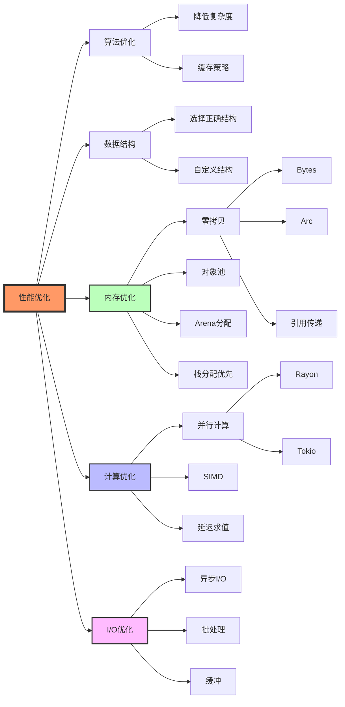
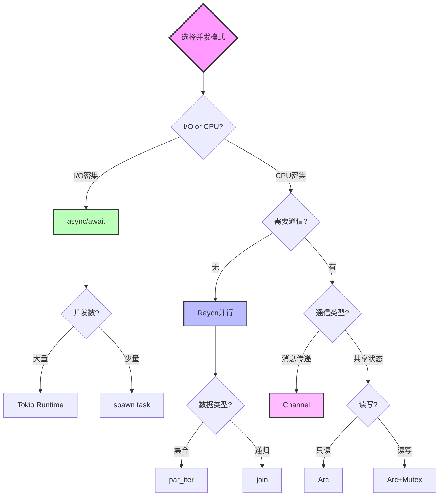
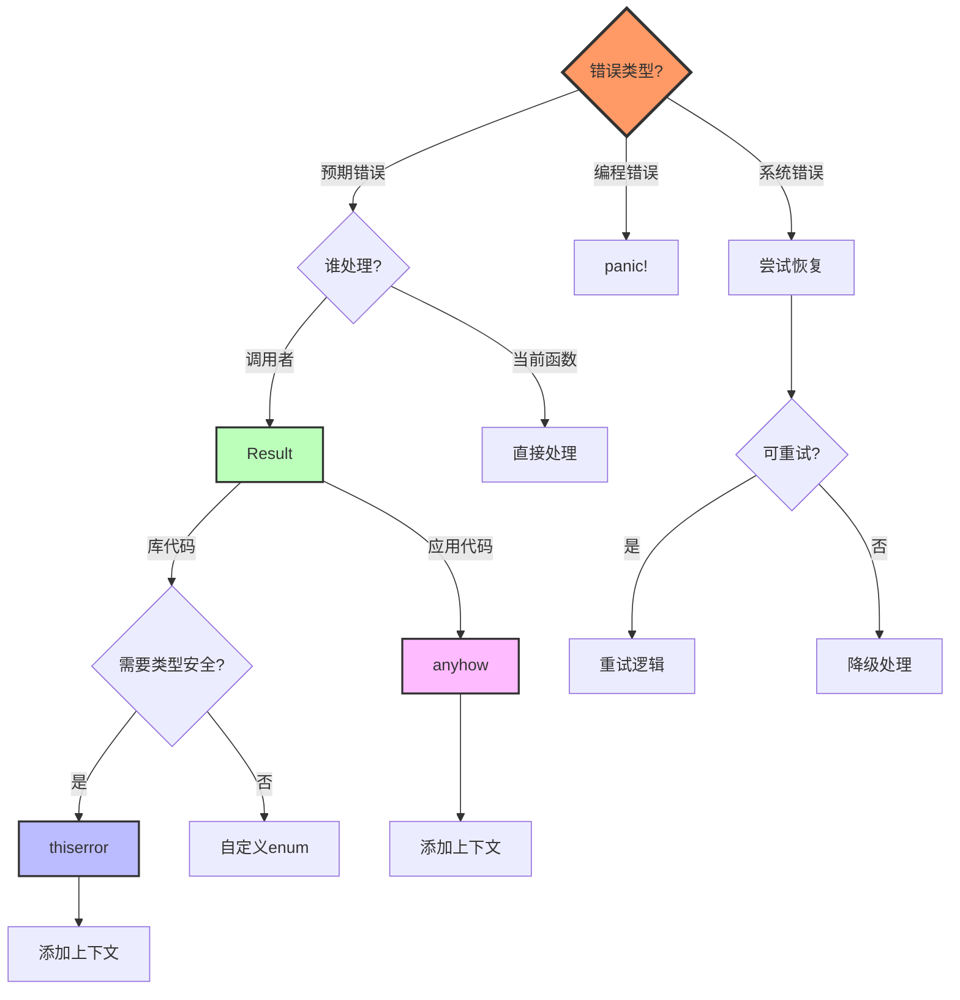
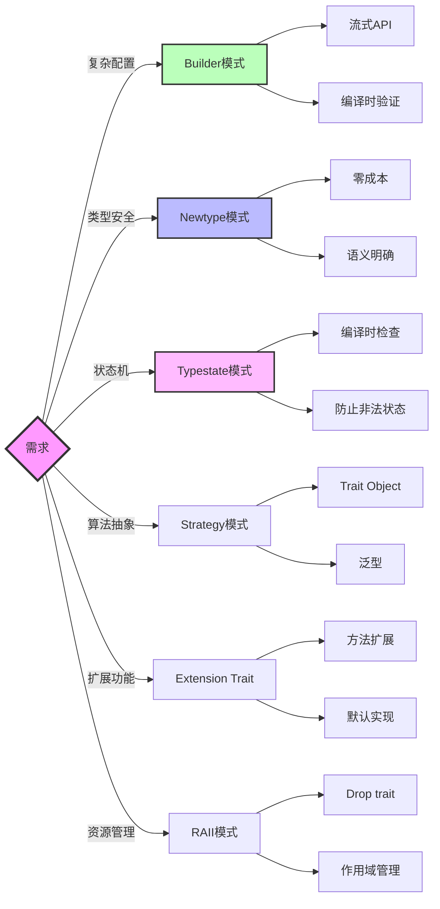
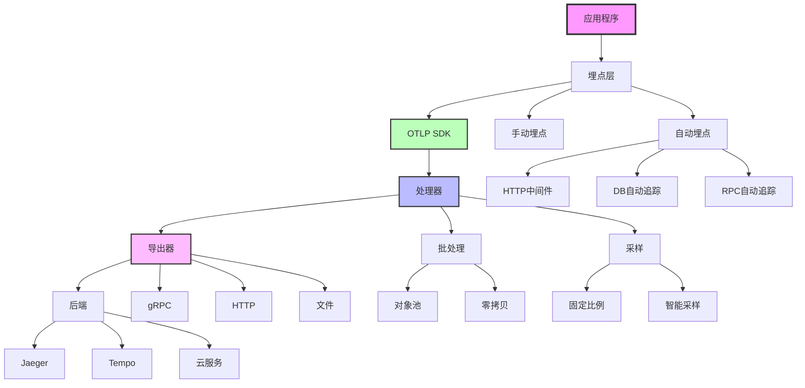

# 最佳实践知识图谱

**版本**: 2.0  
**日期**: 2025年10月28日  
**状态**: ✅ 完整

---

## 📋 目录

1. [Rust最佳实践全景图](#1-rust最佳实践全景图)
2. [性能优化知识网络](#2-性能优化知识网络)
3. [并发模式关系图](#3-并发模式关系图)
4. [错误处理决策树](#4-错误处理决策树)
5. [设计模式应用映射](#5-设计模式应用映射)

---

## 1. Rust最佳实践全景图

### 1.1 核心领域关系

```mermaid
graph TB
    BP[Rust最佳实践]
    
    BP --> Type[类型系统]
    BP --> Perf[性能优化]
    BP --> Conc[并发编程]
    BP --> Err[错误处理]
    BP --> API[API设计]
    BP --> Test[测试策略]
    
    Type --> Newtype[Newtype模式]
    Type --> Typestate[Typestate模式]
    Type --> Phantom[PhantomData]
    Type --> Safety[编译时安全]
    
    Perf --> ZeroCopy[零拷贝]
    Perf --> Pool[对象池]
    Perf --> Batch[批处理]
    Perf --> Parallel[并行化]
    
    Conc --> Async[async/await]
    Conc --> Rayon[Rayon]
    Conc --> Channel[Channel]
    Conc --> Actor[Actor模型]
    
    Err --> Thiserror[thiserror]
    Err --> Anyhow[anyhow]
    Err --> Recovery[恢复策略]
    Err --> Context[错误上下文]
    
    API --> Builder[Builder模式]
    API --> Trait[Trait抽象]
    API --> Macro[宏简化]
    
    Test --> Unit[单元测试]
    Test --> Integration[集成测试]
    Test --> Property[属性测试]
    Test --> Bench[性能测试]
    
    style BP fill:#f9f,stroke:#333,stroke-width:4px
    style Type fill:#bbf,stroke:#333,stroke-width:2px
    style Perf fill:#bfb,stroke:#333,stroke-width:2px
    style Conc fill:#fbf,stroke:#333,stroke-width:2px
    style Err fill:#ffb,stroke:#333,stroke-width:2px
```



### 1.2 最佳实践层次

```
第1层：基础原则 (Foundation)
├─ 所有权和借用
├─ 生命周期
├─ 类型安全
└─ 零成本抽象

第2层：核心模式 (Core Patterns)
├─ Newtype
├─ Builder
├─ Typestate
├─ Error Handling
└─ Resource Management

第3层：性能优化 (Performance)
├─ 零拷贝
├─ 对象池
├─ 批处理
├─ 缓存
└─ 并行化

第4层：并发编程 (Concurrency)
├─ async/await
├─ Rayon
├─ Channel
├─ Arc/Mutex
└─ Actor

第5层：工程实践 (Engineering)
├─ API设计
├─ 测试策略
├─ 文档规范
├─ CI/CD
└─ 代码审查
```

---

## 2. 性能优化知识网络

### 2.1 优化策略关系图



### 2.2 性能优化优先级

```
━━━━━━━━━━━━━━━━━━━━━━━━━━━━━━━━━━━━━━━━━
性能优化优先级矩阵
━━━━━━━━━━━━━━━━━━━━━━━━━━━━━━━━━━━━━━━━━
优先级   策略              收益    成本    ROI
────────────────────────────────────────
P0      算法优化          极高    中      极高
P0      数据结构选择      高      低      极高
P1      零拷贝            高      中      高
P1      对象池            高      中      高
P2      批处理            中高    低      高
P2      并行化            高      高      中
P3      SIMD             中      高      中
P3      内联优化          低      低      中
━━━━━━━━━━━━━━━━━━━━━━━━━━━━━━━━━━━━━━━━━
原则: 先P0，后P1，按需P2/P3
━━━━━━━━━━━━━━━━━━━━━━━━━━━━━━━━━━━━━━━━━
```

---

## 3. 并发模式关系图

### 3.1 并发抽象选择



### 3.2 并发模式对比

| 场景 | 并发数 | 推荐模式 | 原因 |
|------|--------|---------|------|
| 网络请求 | 1K-100K | async/await | I/O密集 |
| 数据处理 | 4-16 | Rayon | CPU密集 |
| 事件处理 | 不定 | Channel | 解耦 |
| 状态共享(只读) | 任意 | Arc | 无锁 |
| 状态共享(读写) | <10 | Arc+Mutex | 简单 |
| 状态共享(读写) | >10 | Arc+RwLock | 读多 |
| 复杂状态机 | 任意 | Actor | 封装 |

---

## 4. 错误处理决策树

### 4.1 错误处理流程图



### 4.2 错误处理最佳实践

```
规则1: 库代码使用 thiserror
├─ 定义具体错误类型
├─ 实现 Error trait
└─ 允许调用者match

规则2: 应用代码使用 anyhow
├─ 简化错误传播
├─ 丰富错误上下文
└─ 友好错误报告

规则3: 避免 panic
├─ 仅用于不可恢复错误
├─ 仅用于编程错误
└─ 考虑使用 Result

规则4: 添加上下文
├─ 使用 .context()
├─ 说明发生了什么
└─ 包含相关信息

规则5: 分层处理
├─ 底层: 技术错误
├─ 中层: 业务错误
└─ 上层: 用户错误
```

---

## 5. 设计模式应用映射

### 5.1 模式选择图



### 5.2 模式应用场景

| 模式 | 场景 | 示例 | 收益 |
|------|------|------|------|
| **Builder** | 多参数构造 | `HttpClient::builder()` | 可读性 |
| **Newtype** | 类型区分 | `UserId(i64)` | 类型安全 |
| **Typestate** | 状态机 | `Connection<Open>` | 编译时检查 |
| **Strategy** | 算法选择 | `Sampler` | 灵活性 |
| **RAII** | 资源管理 | `File`, `Mutex` | 自动清理 |
| **Visitor** | 数据遍历 | AST visitor | 解耦 |
| **Command** | 操作封装 | 事件系统 | 可撤销 |

---

## 6. OTLP集成最佳实践图谱

### 6.1 OTLP架构关系



### 6.2 性能优化路径

```
Level 0: 基础集成
└─ 使用OTLP SDK
   └─ 基本埋点

Level 1: 批处理优化
├─ BatchSpanProcessor
├─ 合理batch_size (512)
└─ 合理timeout (5s)
   ↓ 性能提升: +50%

Level 2: 零拷贝优化
├─ 使用Bytes
├─ Arc共享
└─ 避免序列化拷贝
   ↓ 性能提升: +30%

Level 3: 对象池优化
├─ Span对象池
├─ Buffer对象池
└─ 连接池
   ↓ 性能提升: +40%

Level 4: 采样优化
├─ 固定10%采样
├─ 智能采样
└─ 错误100%
   ↓ 成本降低: -90%

Level 5: 异步优化
├─ Tokio runtime调优
├─ 背压控制
└─ 任务优先级
   ↓ 延迟降低: -50%

总体性能提升: 3-5x
```

---

## 7. 学习路径

### 7.1 初学者路径

```
第1周: Rust基础
├─ 所有权和借用
├─ 基本类型和控制流
└─ 函数和模块

第2周: 核心概念
├─ Result和Option
├─ Trait和泛型
└─ 生命周期

第3周: 常用模式
├─ Builder模式
├─ Newtype模式
└─ 错误处理

第4周: 并发编程
├─ async/await基础
├─ 多线程基础
└─ Channel通信

第5周: 性能优化
├─ 基准测试
├─ 性能分析
└─ 常见优化

第6-8周: OTLP实践
├─ OTLP SDK使用
├─ 埋点实践
└─ 性能调优
```

### 7.2 进阶路径

```
阶段1: 深入所有权系统
├─ 借用检查器原理
├─ 生命周期高级用法
└─ PhantomData和Typestate

阶段2: 高级并发
├─ Lock-free数据结构
├─ Actor模型
└─ 自定义Future

阶段3: 性能工程
├─ CPU分析和优化
├─ 内存分析和优化
└─ 零拷贝设计

阶段4: 生产实践
├─ 可靠性工程
├─ 监控和调试
└─ 大规模部署
```

---

## 8. 工具链图谱

### 8.1 开发工具生态

```
编辑器层:
├─ VS Code + rust-analyzer
├─ IntelliJ IDEA + Rust Plugin
└─ Vim/Neovim + coc-rust-analyzer

构建工具层:
├─ cargo (核心)
├─ cargo-make (任务)
└─ just (命令)

测试工具层:
├─ #[test] (单元)
├─ rstest (参数化)
├─ criterion (性能)
└─ proptest (属性)

质量工具层:
├─ clippy (lint)
├─ rustfmt (格式)
├─ cargo-audit (安全)
└─ cargo-deny (依赖)

性能工具层:
├─ cargo-flamegraph (CPU)
├─ dhat (内存)
├─ perf (Linux)
└─ Instruments (macOS)

CI/CD层:
├─ GitHub Actions
├─ GitLab CI
└─ CircleCI

文档工具层:
├─ rustdoc (API)
├─ mdBook (书籍)
└─ cargo-readme (README)
```

---

## 9. 关键决策点

### 9.1 技术选择决策矩阵

| 决策点 | 选项A | 选项B | 推荐 | 依据 |
|--------|-------|-------|------|------|
| 错误处理(库) | thiserror | 自定义enum | A | 简单、标准 |
| 错误处理(应用) | anyhow | thiserror | A | 灵活、简洁 |
| I/O密集 | async/await | 线程 | A | 低开销 |
| CPU密集 | Rayon | async | A | 充分利用CPU |
| 频繁分配 | 对象池 | 直接分配 | A | 减少开销 |
| 跨线程只读 | Arc | RwLock | A | 无锁 |
| 跨线程读写 | Channel | Arc+Mutex | A | 解耦 |
| API设计 | Builder | 函数参数 | A | 可读性 |

---

## 10. 总结

### 10.1 核心原则

```
1. 零成本抽象
   └─ 编译时优化，运行时无开销

2. 内存安全
   └─ 编译时保证，无需GC

3. 性能优先
   └─ 系统级性能

4. 并发安全
   └─ 编译时防止数据竞争

5. 明确优于隐式
   └─ 代码清晰易懂

6. 组合优于继承
   └─ Trait组合

7. 测量后优化
   └─ 数据驱动决策
```

### 10.2 实践清单

```
✅ 使用类型系统保证安全
✅ 优先栈分配，必要时堆分配
✅ 避免不必要的克隆
✅ 使用零拷贝技术
✅ I/O密集用async，CPU密集用Rayon
✅ 库用thiserror，应用用anyhow
✅ Builder模式构建复杂对象
✅ 编写单元测试和集成测试
✅ 使用性能测试验证优化
✅ 持续性能分析和监控
```

---

## 🔗 相关资源

- [概念定义](./CONCEPTS.md)
- [对比矩阵](./COMPARISON_MATRIX.md)
- [指南README](./README.md)
- [Rust官方书](https://doc.rust-lang.org/book/)
- [Rust性能手册](https://nnethercote.github.io/perf-book/)
- [Rust API指南](https://rust-lang.github.io/api-guidelines/)

---

**版本**: 2.0  
**创建日期**: 2025-10-28  
**最后更新**: 2025-10-28  
**维护团队**: OTLP_rust指南团队

---

> **💡 提示**: 本知识图谱是Rust和OTLP最佳实践的系统性总结，建议结合实际项目逐步学习和应用。
