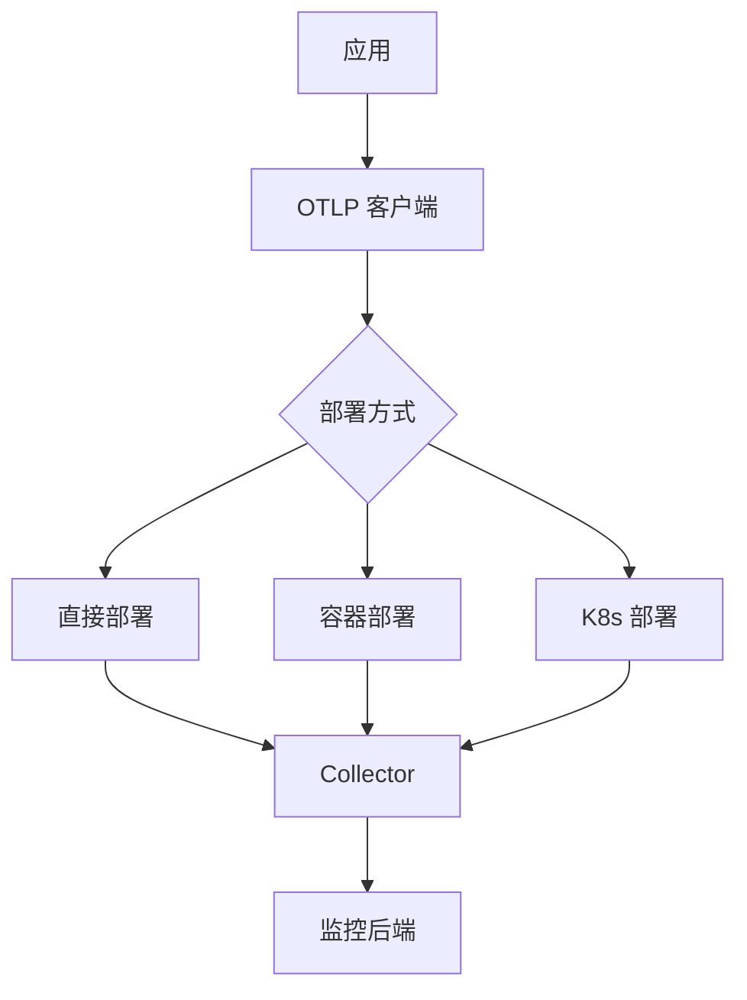

# 🚀 部署指南

## 📋 目录

- [🚀 部署指南](#-部署指南)
  - [📋 目录](#-目录)
  - [🎯 部署概览](#-部署概览)
    - [部署环境类型](#部署环境类型)
    - [架构选择](#架构选择)
  - [💻 本地开发部署](#-本地开发部署)
    - [快速启动](#快速启动)
    - [配置开发环境](#配置开发环境)
    - [本地 Collector 配置](#本地-collector-配置)
  - [🐳 容器化部署](#-容器化部署)
    - [Docker 镜像构建](#docker-镜像构建)
    - [Docker Compose 部署](#docker-compose-部署)
    - [启动和管理](#启动和管理)
  - [☸️ Kubernetes 部署](#️-kubernetes-部署)
    - [Deployment 配置](#deployment-配置)
    - [Service 配置](#service-配置)
    - [ConfigMap 配置](#configmap-配置)
    - [HPA 自动扩缩容](#hpa-自动扩缩容)
    - [部署命令](#部署命令)
  - [🏭 生产环境配置](#-生产环境配置)
    - [生产级配置文件](#生产级配置文件)
    - [环境变量配置](#环境变量配置)
  - [🔄 CI/CD 集成](#-cicd-集成)
    - [GitHub Actions 配置](#github-actions-配置)
  - [📊 监控和告警](#-监控和告警)
    - [Prometheus 配置](#prometheus-配置)
    - [告警规则](#告警规则)
  - [🔧 故障恢复](#-故障恢复)
    - [备份策略](#备份策略)
    - [回滚部署](#回滚部署)
    - [紧急修复流程](#紧急修复流程)
  - [📚 参考资源](#-参考资源)

---

## 🎯 部署概览

### 部署环境类型

| 环境 | 用途 | 配置要求 | 说明 |
|------|------|----------|------|
| **开发环境** | 本地开发测试 | 低配置 | 单机部署 |
| **测试环境** | 集成测试 | 中等配置 | 容器化部署 |
| **预生产环境** | 生产验证 | 生产级配置 | K8s 集群 |
| **生产环境** | 线上服务 | 高可用配置 | 多区域部署 |

### 架构选择



---

## 💻 本地开发部署

### 快速启动

```bash
# 1. 克隆项目
git clone https://github.com/your-org/OTLP_rust.git
cd OTLP_rust

# 2. 构建项目
cargo build --release

# 3. 运行示例
cargo run --example quick_start

# 4. 运行测试
cargo test
```

### 配置开发环境

```bash
# 设置环境变量
export OTLP_ENDPOINT="http://localhost:4317"
export OTLP_SERVICE_NAME="dev-app"
export RUST_LOG=info

# 启动本地 Collector
docker run -d \
  --name otel-collector \
  -p 4317:4317 \
  -p 4318:4318 \
  -p 8888:8888 \
  -v $(pwd)/config/collector-config.yaml:/etc/otel-collector-config.yaml \
  otel/opentelemetry-collector-contrib:latest \
  --config=/etc/otel-collector-config.yaml
```

### 本地 Collector 配置

```yaml
# config/collector-config.yaml
receivers:
  otlp:
    protocols:
      grpc:
        endpoint: 0.0.0.0:4317
      http:
        endpoint: 0.0.0.0:4318

processors:
  batch:
    timeout: 1s
    send_batch_size: 1024
  
  memory_limiter:
    check_interval: 1s
    limit_mib: 512

exporters:
  logging:
    loglevel: debug
  
  prometheus:
    endpoint: "0.0.0.0:8889"

service:
  pipelines:
    traces:
      receivers: [otlp]
      processors: [memory_limiter, batch]
      exporters: [logging]
    
    metrics:
      receivers: [otlp]
      processors: [memory_limiter, batch]
      exporters: [logging, prometheus]
    
    logs:
      receivers: [otlp]
      processors: [memory_limiter, batch]
      exporters: [logging]
```

---

## 🐳 容器化部署

### Docker 镜像构建

```dockerfile
# Dockerfile
FROM rust:1.90-slim as builder

WORKDIR /app

# 复制依赖文件
COPY Cargo.toml Cargo.lock ./
COPY crates/otlp/Cargo.toml ./crates/otlp/
COPY crates/reliability/Cargo.toml ./crates/reliability/

# 构建依赖（缓存层）
RUN mkdir -p crates/otlp/src && \
    mkdir -p crates/reliability/src && \
    echo "fn main() {}" > crates/otlp/src/main.rs && \
    echo "fn main() {}" > crates/reliability/src/main.rs && \
    cargo build --release && \
    rm -rf crates/*/src

# 复制源代码
COPY . .

# 构建应用
RUN cargo build --release

# 运行时镜像
FROM debian:bookworm-slim

# 安装运行时依赖
RUN apt-get update && \
    apt-get install -y ca-certificates libssl3 && \
    rm -rf /var/lib/apt/lists/*

# 复制可执行文件
COPY --from=builder /app/target/release/otlp-app /usr/local/bin/

# 创建用户
RUN useradd -r -s /bin/false otlp && \
    chown -R otlp:otlp /usr/local/bin/otlp-app

USER otlp

# 健康检查
HEALTHCHECK --interval=30s --timeout=3s --start-period=5s --retries=3 \
  CMD curl -f http://localhost:8080/health || exit 1

EXPOSE 8080

CMD ["otlp-app"]
```

### Docker Compose 部署

```yaml
# docker-compose.yml
version: '3.8'

services:
  otlp-app:
    build:
      context: .
      dockerfile: Dockerfile
    container_name: otlp-app
    ports:
      - "8080:8080"
    environment:
      - OTLP_ENDPOINT=http://otel-collector:4317
      - OTLP_SERVICE_NAME=otlp-app
      - RUST_LOG=info
    depends_on:
      - otel-collector
    networks:
      - otlp-network
    restart: unless-stopped

  otel-collector:
    image: otel/opentelemetry-collector-contrib:latest
    container_name: otel-collector
    command: ["--config=/etc/otel-collector-config.yaml"]
    volumes:
      - ./config/collector-config.yaml:/etc/otel-collector-config.yaml
    ports:
      - "4317:4317"   # OTLP gRPC
      - "4318:4318"   # OTLP HTTP
      - "8888:8888"   # Prometheus metrics
      - "8889:8889"   # Prometheus exporter
    networks:
      - otlp-network
    restart: unless-stopped

  prometheus:
    image: prom/prometheus:latest
    container_name: prometheus
    command:
      - '--config.file=/etc/prometheus/prometheus.yml'
      - '--storage.tsdb.path=/prometheus'
    volumes:
      - ./config/prometheus.yml:/etc/prometheus/prometheus.yml
      - prometheus_data:/prometheus
    ports:
      - "9090:9090"
    networks:
      - otlp-network
    restart: unless-stopped

  grafana:
    image: grafana/grafana:latest
    container_name: grafana
    ports:
      - "3000:3000"
    environment:
      - GF_SECURITY_ADMIN_PASSWORD=admin
      - GF_USERS_ALLOW_SIGN_UP=false
    volumes:
      - grafana_data:/var/lib/grafana
      - ./config/grafana/dashboards:/etc/grafana/provisioning/dashboards
      - ./config/grafana/datasources:/etc/grafana/provisioning/datasources
    networks:
      - otlp-network
    restart: unless-stopped

networks:
  otlp-network:
    driver: bridge

volumes:
  prometheus_data:
  grafana_data:
```

### 启动和管理

```bash
# 构建并启动所有服务
docker-compose up -d

# 查看日志
docker-compose logs -f otlp-app

# 停止服务
docker-compose down

# 重启服务
docker-compose restart otlp-app

# 查看状态
docker-compose ps
```

---

## ☸️ Kubernetes 部署

### Deployment 配置

```yaml
# k8s/deployment.yaml
apiVersion: apps/v1
kind: Deployment
metadata:
  name: otlp-app
  namespace: observability
  labels:
    app: otlp-app
    version: v1.0.0
spec:
  replicas: 3
  strategy:
    type: RollingUpdate
    rollingUpdate:
      maxSurge: 1
      maxUnavailable: 0
  selector:
    matchLabels:
      app: otlp-app
  template:
    metadata:
      labels:
        app: otlp-app
        version: v1.0.0
      annotations:
        prometheus.io/scrape: "true"
        prometheus.io/port: "8080"
        prometheus.io/path: "/metrics"
    spec:
      serviceAccountName: otlp-app
      containers:
      - name: otlp-app
        image: your-registry/otlp-app:v1.0.0
        imagePullPolicy: Always
        ports:
        - containerPort: 8080
          name: http
          protocol: TCP
        env:
        - name: OTLP_ENDPOINT
          value: "http://otel-collector.observability.svc.cluster.local:4317"
        - name: OTLP_SERVICE_NAME
          value: "otlp-app"
        - name: RUST_LOG
          value: "info"
        - name: POD_NAME
          valueFrom:
            fieldRef:
              fieldPath: metadata.name
        - name: POD_NAMESPACE
          valueFrom:
            fieldRef:
              fieldPath: metadata.namespace
        resources:
          requests:
            memory: "256Mi"
            cpu: "250m"
          limits:
            memory: "512Mi"
            cpu: "500m"
        livenessProbe:
          httpGet:
            path: /health
            port: 8080
          initialDelaySeconds: 30
          periodSeconds: 10
          timeoutSeconds: 3
          failureThreshold: 3
        readinessProbe:
          httpGet:
            path: /ready
            port: 8080
          initialDelaySeconds: 5
          periodSeconds: 5
          timeoutSeconds: 3
          failureThreshold: 3
        volumeMounts:
        - name: config
          mountPath: /etc/otlp
          readOnly: true
      volumes:
      - name: config
        configMap:
          name: otlp-app-config
```

### Service 配置

```yaml
# k8s/service.yaml
apiVersion: v1
kind: Service
metadata:
  name: otlp-app
  namespace: observability
  labels:
    app: otlp-app
spec:
  type: ClusterIP
  ports:
  - port: 80
    targetPort: 8080
    protocol: TCP
    name: http
  selector:
    app: otlp-app
---
apiVersion: v1
kind: Service
metadata:
  name: otlp-app-headless
  namespace: observability
  labels:
    app: otlp-app
spec:
  type: ClusterIP
  clusterIP: None
  ports:
  - port: 8080
    targetPort: 8080
    protocol: TCP
    name: http
  selector:
    app: otlp-app
```

### ConfigMap 配置

```yaml
# k8s/configmap.yaml
apiVersion: v1
kind: ConfigMap
metadata:
  name: otlp-app-config
  namespace: observability
data:
  app.yaml: |
    server:
      host: "0.0.0.0"
      port: 8080
    
    otlp:
      endpoint: "http://otel-collector.observability.svc.cluster.local:4317"
      service_name: "otlp-app"
      compression: "gzip"
      timeout: 30s
      
      batch:
        max_size: 1000
        timeout: 5s
        max_queue_size: 10000
      
      retry:
        max_attempts: 3
        initial_interval: 100ms
        max_interval: 5s
    
    logging:
      level: "info"
      format: "json"
```

### HPA 自动扩缩容

```yaml
# k8s/hpa.yaml
apiVersion: autoscaling/v2
kind: HorizontalPodAutoscaler
metadata:
  name: otlp-app-hpa
  namespace: observability
spec:
  scaleTargetRef:
    apiVersion: apps/v1
    kind: Deployment
    name: otlp-app
  minReplicas: 3
  maxReplicas: 10
  metrics:
  - type: Resource
    resource:
      name: cpu
      target:
        type: Utilization
        averageUtilization: 70
  - type: Resource
    resource:
      name: memory
      target:
        type: Utilization
        averageUtilization: 80
  behavior:
    scaleDown:
      stabilizationWindowSeconds: 300
      policies:
      - type: Percent
        value: 50
        periodSeconds: 60
    scaleUp:
      stabilizationWindowSeconds: 0
      policies:
      - type: Percent
        value: 100
        periodSeconds: 15
      - type: Pods
        value: 2
        periodSeconds: 15
      selectPolicy: Max
```

### 部署命令

```bash
# 创建命名空间
kubectl create namespace observability

# 部署 ConfigMap
kubectl apply -f k8s/configmap.yaml

# 部署应用
kubectl apply -f k8s/deployment.yaml

# 部署服务
kubectl apply -f k8s/service.yaml

# 部署 HPA
kubectl apply -f k8s/hpa.yaml

# 查看状态
kubectl get all -n observability

# 查看日志
kubectl logs -f deployment/otlp-app -n observability

# 扩容
kubectl scale deployment otlp-app --replicas=5 -n observability
```

---

## 🏭 生产环境配置

### 生产级配置文件

```rust
// config/production.rs
use otlp::config::*;
use std::time::Duration;

pub fn create_production_config() -> OtlpConfig {
    OtlpConfig {
        // 基础配置
        endpoint: std::env::var("OTLP_ENDPOINT")
            .unwrap_or_else(|_| "http://otel-collector:4317".to_string()),
        service_name: std::env::var("OTLP_SERVICE_NAME")
            .unwrap_or_else(|_| "production-app".to_string()),
        service_version: env!("CARGO_PKG_VERSION").to_string(),
        environment: "production".to_string(),
        
        // 传输配置
        transport: TransportConfig {
            protocol: TransportProtocol::Grpc,
            compression: Compression::Gzip,
            tls: Some(TlsConfig {
                enabled: true,
                cert_file: "/etc/ssl/certs/client.crt".to_string(),
                key_file: "/etc/ssl/private/client.key".to_string(),
                ca_file: "/etc/ssl/certs/ca.crt".to_string(),
                verify_server: true,
            }),
        },
        
        // 连接配置
        connection: ConnectionConfig {
            connect_timeout: Duration::from_secs(10),
            request_timeout: Duration::from_secs(60),
            keep_alive: Some(Duration::from_secs(60)),
            max_connections: 200,
            max_idle_connections: 100,
        },
        
        // 批处理配置
        batch: BatchConfig {
            max_batch_size: 2000,
            batch_timeout: Duration::from_millis(200),
            max_queue_size: 50000,
            strategy: BatchStrategy::Hybrid,
        },
        
        // 重试配置
        retry: RetryConfig {
            max_attempts: 3,
            initial_interval: Duration::from_millis(100),
            max_interval: Duration::from_secs(5),
            multiplier: 2.0,
            randomization_factor: 0.1,
            retryable_errors: vec![
                ErrorType::Network,
                ErrorType::Timeout,
                ErrorType::Unavailable,
            ],
        },
        
        // 监控配置
        monitoring: MonitoringConfig {
            enable_metrics: true,
            metrics_interval: Duration::from_secs(10),
            enable_health_check: true,
            health_check_interval: Duration::from_secs(30),
        },
        
        // 安全配置
        security: SecurityConfig {
            enable_authentication: true,
            auth_token: std::env::var("OTLP_AUTH_TOKEN").ok(),
            enable_encryption: true,
        },
    }
}
```

### 环境变量配置

```bash
# .env.production
# 服务配置
OTLP_ENDPOINT=https://otel-collector.prod.example.com:4317
OTLP_SERVICE_NAME=production-app
OTLP_SERVICE_VERSION=1.0.0
OTLP_ENVIRONMENT=production

# 安全配置
OTLP_AUTH_TOKEN=your-production-token
OTLP_TLS_CERT=/etc/ssl/certs/client.crt
OTLP_TLS_KEY=/etc/ssl/private/client.key
OTLP_TLS_CA=/etc/ssl/certs/ca.crt

# 性能配置
OTLP_MAX_BATCH_SIZE=2000
OTLP_BATCH_TIMEOUT=200ms
OTLP_MAX_CONNECTIONS=200

# 日志配置
RUST_LOG=info
RUST_BACKTRACE=1

# 监控配置
METRICS_PORT=8080
HEALTH_CHECK_PORT=8081
```

---

## 🔄 CI/CD 集成

### GitHub Actions 配置

```yaml
# .github/workflows/deploy.yml
name: Build and Deploy

on:
  push:
    branches: [ main ]
  pull_request:
    branches: [ main ]

env:
  REGISTRY: ghcr.io
  IMAGE_NAME: ${{ github.repository }}

jobs:
  test:
    runs-on: ubuntu-latest
    steps:
      - uses: actions/checkout@v3
      
      - name: Install Rust
        uses: actions-rs/toolchain@v1
        with:
          toolchain: 1.90
          override: true
      
      - name: Run tests
        run: cargo test --all-features
      
      - name: Run clippy
        run: cargo clippy -- -D warnings

  build:
    needs: test
    runs-on: ubuntu-latest
    permissions:
      contents: read
      packages: write
    steps:
      - uses: actions/checkout@v3
      
      - name: Log in to Container Registry
        uses: docker/login-action@v2
        with:
          registry: ${{ env.REGISTRY }}
          username: ${{ github.actor }}
          password: ${{ secrets.GITHUB_TOKEN }}
      
      - name: Extract metadata
        id: meta
        uses: docker/metadata-action@v4
        with:
          images: ${{ env.REGISTRY }}/${{ env.IMAGE_NAME }}
      
      - name: Build and push Docker image
        uses: docker/build-push-action@v4
        with:
          context: .
          push: true
          tags: ${{ steps.meta.outputs.tags }}
          labels: ${{ steps.meta.outputs.labels }}

  deploy:
    needs: build
    runs-on: ubuntu-latest
    if: github.ref == 'refs/heads/main'
    steps:
      - uses: actions/checkout@v3
      
      - name: Set up kubectl
        uses: azure/setup-kubectl@v3
      
      - name: Configure kubectl
        run: |
          echo "${{ secrets.KUBECONFIG }}" | base64 -d > kubeconfig
          export KUBECONFIG=./kubeconfig
      
      - name: Deploy to Kubernetes
        run: |
          kubectl apply -f k8s/
          kubectl rollout status deployment/otlp-app -n observability
```

---

## 📊 监控和告警

### Prometheus 配置

```yaml
# config/prometheus.yml
global:
  scrape_interval: 15s
  evaluation_interval: 15s

scrape_configs:
  - job_name: 'otlp-app'
    kubernetes_sd_configs:
      - role: pod
        namespaces:
          names:
            - observability
    relabel_configs:
      - source_labels: [__meta_kubernetes_pod_annotation_prometheus_io_scrape]
        action: keep
        regex: true
      - source_labels: [__meta_kubernetes_pod_annotation_prometheus_io_path]
        action: replace
        target_label: __metrics_path__
        regex: (.+)
      - source_labels: [__address__, __meta_kubernetes_pod_annotation_prometheus_io_port]
        action: replace
        regex: ([^:]+)(?::\d+)?;(\d+)
        replacement: $1:$2
        target_label: __address__

alerting:
  alertmanagers:
    - static_configs:
        - targets:
            - alertmanager:9093

rule_files:
  - 'alerts.yml'
```

### 告警规则

```yaml
# config/alerts.yml
groups:
  - name: otlp-app
    interval: 30s
    rules:
      - alert: HighErrorRate
        expr: rate(http_requests_total{status=~"5.."}[5m]) > 0.05
        for: 5m
        labels:
          severity: critical
        annotations:
          summary: "High error rate detected"
          description: "Error rate is {{ $value }} for {{ $labels.instance }}"
      
      - alert: HighResponseTime
        expr: histogram_quantile(0.99, rate(http_request_duration_seconds_bucket[5m])) > 1
        for: 10m
        labels:
          severity: warning
        annotations:
          summary: "High response time detected"
          description: "P99 response time is {{ $value }}s for {{ $labels.instance }}"
      
      - alert: PodNotReady
        expr: kube_pod_status_phase{namespace="observability",pod=~"otlp-app-.*",phase!="Running"} == 1
        for: 5m
        labels:
          severity: warning
        annotations:
          summary: "Pod not ready"
          description: "Pod {{ $labels.pod }} is not ready"
```

---

## 🔧 故障恢复

### 备份策略

```bash
# 备份配置
kubectl get configmap otlp-app-config -n observability -o yaml > backup/configmap-$(date +%Y%m%d).yaml
kubectl get deployment otlp-app -n observability -o yaml > backup/deployment-$(date +%Y%m%d).yaml

# 恢复配置
kubectl apply -f backup/configmap-20251020.yaml
kubectl apply -f backup/deployment-20251020.yaml
```

### 回滚部署

```bash
# 查看部署历史
kubectl rollout history deployment/otlp-app -n observability

# 回滚到上一版本
kubectl rollout undo deployment/otlp-app -n observability

# 回滚到指定版本
kubectl rollout undo deployment/otlp-app --to-revision=2 -n observability
```

### 紧急修复流程

1. **识别问题**: 通过监控告警识别问题
2. **快速回滚**: 如果是新版本问题，立即回滚
3. **紧急修复**: 修复代码并快速部署
4. **验证修复**: 确认问题已解决
5. **总结复盘**: 记录问题和解决方案

---

## 📚 参考资源

- [安装指南](installation.md)
- [快速入门](quick-start.md)
- [监控配置](monitoring.md)
- [故障排除](troubleshooting.md)

---

*最后更新: 2025年10月20日*  
*版本: 1.0.0*
