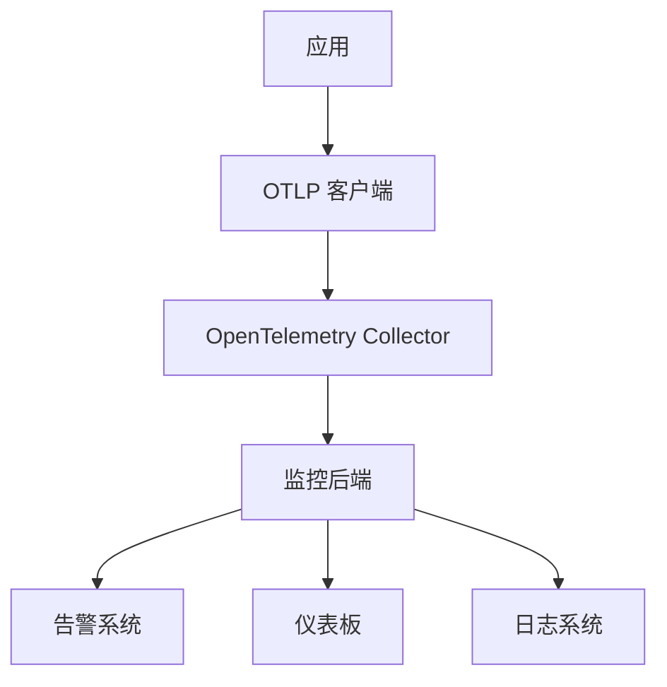

# 📊 监控配置指南

**版本**: 1.0  
**最后更新**: 2025年10月26日  
**状态**: 🟢 活跃维护

> **简介**: 监控配置指南 - 系统指标、分布式追踪、告警和仪表板的完整配置。

---

## 📋 目录

- [📊 监控配置指南](#-监控配置指南)
  - [📋 目录](#-目录)
  - [🎯 监控概览](#-监控概览)
    - [监控目标](#监控目标)
    - [监控架构](#监控架构)
  - [⚙️ 基础监控配置](#️-基础监控配置)
    - [客户端监控配置](#客户端监控配置)
    - [系统指标收集](#系统指标收集)
  - [🔧 高级监控功能](#-高级监控功能)
    - [自定义指标](#自定义指标)
    - [分布式追踪监控](#分布式追踪监控)
  - [🚨 告警配置](#-告警配置)
    - [告警规则配置](#告警规则配置)
    - [告警处理](#告警处理)
  - [📊 仪表板配置](#-仪表板配置)
    - [Grafana 仪表板](#grafana-仪表板)
    - [自定义仪表板](#自定义仪表板)
  - [⚡ 性能监控](#-性能监控)
    - [性能指标收集](#性能指标收集)
    - [性能分析](#性能分析)
  - [📝 日志监控](#-日志监控)
    - [日志聚合和搜索](#日志聚合和搜索)
    - [日志模式检测](#日志模式检测)
  - [🛠️ 自定义监控](#️-自定义监控)
    - [自定义指标收集器](#自定义指标收集器)
    - [自定义告警规则](#自定义告警规则)
  - [🎯 监控最佳实践](#-监控最佳实践)
    - [监控策略](#监控策略)
    - [监控配置模板](#监控配置模板)
    - [监控检查清单](#监控检查清单)
  - [📚 参考资源](#-参考资源)
    - [监控工具](#监控工具)
    - [相关文档](#相关文档)

---

## 🎯 监控概览

### 监控目标

| 监控类型 | 目标 | 关键指标 |
|----------|------|----------|
| **系统监控** | 系统健康状态 | CPU、内存、磁盘、网络 |
| **应用监控** | 应用性能 | 响应时间、吞吐量、错误率 |
| **业务监控** | 业务指标 | 用户活跃度、交易量、转化率 |
| **基础设施监控** | 基础设施状态 | 服务可用性、资源使用率 |

### 监控架构



---

## ⚙️ 基础监控配置

### 客户端监控配置

```rust
use otlp::core::EnhancedOtlpClient;
use otlp::config::*;
use std::time::Duration;

// 基础监控配置
let client = EnhancedOtlpClient::builder()
    .with_endpoint("http://localhost:4317")
    .with_service_name("monitored-app")
    .with_service_version("1.0.0")
    
    // 启用监控
    .with_monitoring_enabled(true)
    .with_metrics_interval(Duration::from_secs(10))
    .with_health_check_interval(Duration::from_secs(30))
    
    // 监控配置
    .with_monitoring_config(MonitoringConfig {
        enable_performance_metrics: true,
        enable_resource_metrics: true,
        enable_custom_metrics: true,
        metrics_export_interval: Duration::from_secs(10),
        health_check_endpoint: Some("http://localhost:8080/health".to_string()),
    })
    
    .build()
    .await?;
```

### 系统指标收集

```rust
use otlp::monitoring::SystemMetricsCollector;

// 系统指标收集器
let system_collector = SystemMetricsCollector::new()
    .with_cpu_monitoring(true)
    .with_memory_monitoring(true)
    .with_disk_monitoring(true)
    .with_network_monitoring(true)
    .with_collection_interval(Duration::from_secs(5));

let client = EnhancedOtlpClient::builder()
    .with_endpoint("http://localhost:4317")
    .with_system_metrics_collector(system_collector)
    .build()
    .await?;

// 获取系统指标
async fn get_system_metrics() -> Result<(), Box<dyn std::error::Error>> {
    let metrics = client.get_system_metrics().await?;
    
    println!("CPU 使用率: {:.2}%", metrics.cpu_usage * 100.0);
    println!("内存使用率: {:.2}%", metrics.memory_usage * 100.0);
    println!("磁盘使用率: {:.2}%", metrics.disk_usage * 100.0);
    println!("网络吞吐量: {:.2} MB/s", metrics.network_throughput);
    
    Ok(())
}
```

---

## 🔧 高级监控功能

### 自定义指标

```rust
use otlp::monitoring::CustomMetricsCollector;
use opentelemetry::metrics::{Meter, Counter, Histogram, Unit};
use std::collections::HashMap;

// 自定义指标收集器
let custom_collector = CustomMetricsCollector::new()
    .with_business_metrics(true)
    .with_user_metrics(true)
    .with_transaction_metrics(true);

let client = EnhancedOtlpClient::builder()
    .with_endpoint("http://localhost:4317")
    .with_custom_metrics_collector(custom_collector)
    .build()
    .await?;

let meter = client.meter("business-metrics");

// 业务指标
let user_registrations = meter
    .u64_counter("user_registrations_total")
    .with_description("Total user registrations")
    .with_unit(Unit::new("1"))
    .init();

let transaction_amount = meter
    .f64_histogram("transaction_amount")
    .with_description("Transaction amount distribution")
    .with_unit(Unit::new("USD"))
    .init();

// 记录业务指标
async fn record_business_metrics() -> Result<(), Box<dyn std::error::Error>> {
    let mut attributes = HashMap::new();
    attributes.insert("source".to_string(), "web".into());
    attributes.insert("country".to_string(), "US".into());
    
    // 记录用户注册
    user_registrations.add(1, &attributes);
    
    // 记录交易金额
    let amount = 150.0;
    transaction_amount.record(amount, &attributes);
    
    Ok(())
}
```

### 分布式追踪监控

```rust
use otlp::monitoring::TraceMonitor;
use opentelemetry::trace::{Tracer, SpanKind, StatusCode};

// 追踪监控器
let trace_monitor = TraceMonitor::new()
    .with_slow_query_threshold(Duration::from_millis(1000))
    .with_error_tracking(true)
    .with_performance_tracking(true);

let client = EnhancedOtlpClient::builder()
    .with_endpoint("http://localhost:4317")
    .with_trace_monitor(trace_monitor)
    .build()
    .await?;

let tracer = client.tracer("monitored-component");

// 监控追踪
async fn monitored_operation() -> Result<(), Box<dyn std::error::Error>> {
    let mut span = tracer.start_with_kind("monitored-operation", SpanKind::Internal);
    
    span.set_attribute("operation.type", "business_logic");
    span.set_attribute("user.id", "12345");
    
    // 执行业务逻辑
    let result = execute_business_logic().await;
    
    match result {
        Ok(_) => {
            span.set_status(StatusCode::Ok, "Operation successful".to_string());
            println!("✅ 操作成功完成");
        }
        Err(e) => {
            span.set_status(StatusCode::Error, e.to_string());
            span.set_attribute("error.type", "business_error");
            println!("❌ 操作失败: {}", e);
        }
    }
    
    span.end();
    Ok(())
}
```

---

## 🚨 告警配置

### 告警规则配置

```rust
use otlp::monitoring::AlertManager;
use otlp::config::AlertRule;

// 告警管理器
let alert_manager = AlertManager::new()
    .with_alert_endpoint("http://localhost:9093/api/v1/alerts")
    .with_notification_channels(vec![
        "email:admin@example.com".to_string(),
        "slack:#alerts".to_string(),
        "webhook:https://hooks.slack.com/services/...".to_string(),
    ]);

// 告警规则
let alert_rules = vec![
    AlertRule {
        name: "high_error_rate".to_string(),
        condition: "error_rate > 0.05".to_string(), // 5% 错误率
        duration: Duration::from_secs(300), // 持续5分钟
        severity: AlertSeverity::Critical,
        description: "Error rate is too high".to_string(),
    },
    AlertRule {
        name: "high_response_time".to_string(),
        condition: "response_time_p99 > 1000".to_string(), // P99 > 1秒
        duration: Duration::from_secs(600), // 持续10分钟
        severity: AlertSeverity::Warning,
        description: "Response time is too high".to_string(),
    },
    AlertRule {
        name: "low_throughput".to_string(),
        condition: "throughput < 100".to_string(), // 吞吐量 < 100 req/s
        duration: Duration::from_secs(900), // 持续15分钟
        severity: AlertSeverity::Warning,
        description: "Throughput is too low".to_string(),
    },
];

let client = EnhancedOtlpClient::builder()
    .with_endpoint("http://localhost:4317")
    .with_alert_manager(alert_manager)
    .with_alert_rules(alert_rules)
    .build()
    .await?;
```

### 告警处理

```rust
use otlp::monitoring::AlertHandler;

// 告警处理器
let alert_handler = AlertHandler::new()
    .with_escalation_policy(EscalationPolicy {
        levels: vec![
            EscalationLevel {
                duration: Duration::from_secs(300),
                notifications: vec!["email:oncall@example.com".to_string()],
            },
            EscalationLevel {
                duration: Duration::from_secs(600),
                notifications: vec![
                    "email:manager@example.com".to_string(),
                    "slack:#critical-alerts".to_string(),
                ],
            },
        ],
    })
    .with_suppression_rules(vec![
        SuppressionRule {
            condition: "time.hour >= 22 || time.hour <= 6".to_string(),
            action: SuppressionAction::Delay,
            duration: Duration::from_hours(8),
        },
    ]);

// 处理告警
async fn handle_alert(alert: Alert) -> Result<(), Box<dyn std::error::Error>> {
    println!("🚨 收到告警: {}", alert.name);
    println!("严重程度: {:?}", alert.severity);
    println!("描述: {}", alert.description);
    println!("时间: {}", alert.timestamp);
    
    // 发送通知
    alert_handler.send_notification(&alert).await?;
    
    // 记录告警
    alert_handler.log_alert(&alert).await?;
    
    Ok(())
}
```

---

## 📊 仪表板配置

### Grafana 仪表板

```rust
use otlp::monitoring::DashboardManager;

// 仪表板管理器
let dashboard_manager = DashboardManager::new()
    .with_grafana_endpoint("http://localhost:3000")
    .with_api_key("your-grafana-api-key");

// 创建仪表板
async fn create_dashboard() -> Result<(), Box<dyn std::error::Error>> {
    let dashboard = Dashboard {
        title: "OTLP Application Monitoring".to_string(),
        panels: vec![
            Panel {
                title: "Request Rate".to_string(),
                query: "rate(requests_total[5m])".to_string(),
                visualization: Visualization::Graph,
                y_axis: YAxis {
                    label: "Requests/sec".to_string(),
                    min: Some(0.0),
                    max: None,
                },
            },
            Panel {
                title: "Response Time".to_string(),
                query: "histogram_quantile(0.99, rate(response_time_seconds_bucket[5m]))".to_string(),
                visualization: Visualization::Graph,
                y_axis: YAxis {
                    label: "Seconds".to_string(),
                    min: Some(0.0),
                    max: Some(5.0),
                },
            },
            Panel {
                title: "Error Rate".to_string(),
                query: "rate(errors_total[5m]) / rate(requests_total[5m])".to_string(),
                visualization: Visualization::Graph,
                y_axis: YAxis {
                    label: "Error Rate".to_string(),
                    min: Some(0.0),
                    max: Some(1.0),
                },
            },
            Panel {
                title: "System Resources".to_string(),
                query: "cpu_usage_percent".to_string(),
                visualization: Visualization::Graph,
                y_axis: YAxis {
                    label: "Percentage".to_string(),
                    min: Some(0.0),
                    max: Some(100.0),
                },
            },
        ],
    };
    
    dashboard_manager.create_dashboard(&dashboard).await?;
    println!("✅ 仪表板创建成功");
    
    Ok(())
}
```

### 自定义仪表板

```rust
use otlp::monitoring::CustomDashboard;

// 自定义仪表板
let custom_dashboard = CustomDashboard::new()
    .with_title("Business Metrics Dashboard")
    .with_refresh_interval(Duration::from_secs(30))
    .with_time_range(Duration::from_hours(24));

// 添加业务指标面板
custom_dashboard.add_panel(Panel {
    title: "User Registrations".to_string(),
    query: "rate(user_registrations_total[1h])".to_string(),
    visualization: Visualization::Counter,
    thresholds: vec![
        Threshold {
            value: 10.0,
            color: "green".to_string(),
        },
        Threshold {
            value: 5.0,
            color: "yellow".to_string(),
        },
        Threshold {
            value: 1.0,
            color: "red".to_string(),
        },
    ],
});

// 添加交易指标面板
custom_dashboard.add_panel(Panel {
    title: "Transaction Volume".to_string(),
    query: "sum(transaction_amount)".to_string(),
    visualization: Visualization::Graph,
    y_axis: YAxis {
        label: "USD".to_string(),
        min: Some(0.0),
        max: None,
    },
});

// 部署仪表板
custom_dashboard.deploy().await?;
```

---

## ⚡ 性能监控

### 性能指标收集

```rust
use otlp::monitoring::PerformanceMonitor;

// 性能监控器
let performance_monitor = PerformanceMonitor::new()
    .with_throughput_monitoring(true)
    .with_latency_monitoring(true)
    .with_resource_monitoring(true)
    .with_collection_interval(Duration::from_secs(5));

let client = EnhancedOtlpClient::builder()
    .with_endpoint("http://localhost:4317")
    .with_performance_monitor(performance_monitor)
    .build()
    .await?;

// 性能指标
async fn collect_performance_metrics() -> Result<(), Box<dyn std::error::Error>> {
    let metrics = client.get_performance_metrics().await?;
    
    println!("📊 性能指标:");
    println!("  吞吐量: {:.2} req/s", metrics.throughput);
    println!("  平均延迟: {:.2}ms", metrics.avg_latency.as_millis());
    println!("  P95延迟: {:.2}ms", metrics.p95_latency.as_millis());
    println!("  P99延迟: {:.2}ms", metrics.p99_latency.as_millis());
    println!("  错误率: {:.2}%", metrics.error_rate * 100.0);
    
    // 检查性能阈值
    if metrics.error_rate > 0.05 {
        println!("⚠️ 错误率过高: {:.2}%", metrics.error_rate * 100.0);
    }
    
    if metrics.p99_latency > Duration::from_millis(1000) {
        println!("⚠️ P99延迟过高: {:.2}ms", metrics.p99_latency.as_millis());
    }
    
    Ok(())
}
```

### 性能分析

```rust
use otlp::monitoring::PerformanceAnalyzer;

// 性能分析器
let performance_analyzer = PerformanceAnalyzer::new()
    .with_trend_analysis(true)
    .with_anomaly_detection(true)
    .with_capacity_planning(true);

// 分析性能趋势
async fn analyze_performance_trends() -> Result<(), Box<dyn std::error::Error>> {
    let analysis = performance_analyzer.analyze_trends().await?;
    
    println!("📈 性能趋势分析:");
    println!("  吞吐量趋势: {:?}", analysis.throughput_trend);
    println!("  延迟趋势: {:?}", analysis.latency_trend);
    println!("  错误率趋势: {:?}", analysis.error_rate_trend);
    
    // 容量规划建议
    if let Some(capacity_advice) = analysis.capacity_advice {
        println!("💡 容量规划建议:");
        println!("  {}", capacity_advice);
    }
    
    // 异常检测
    if let Some(anomalies) = analysis.anomalies {
        println!("🚨 检测到异常:");
        for anomaly in anomalies {
            println!("  - {}: {}", anomaly.metric, anomaly.description);
        }
    }
    
    Ok(())
}
```

---

## 📝 日志监控

### 日志聚合和搜索

```rust
use otlp::monitoring::LogMonitor;

// 日志监控器
let log_monitor = LogMonitor::new()
    .with_log_levels(vec![LogLevel::Error, LogLevel::Warn, LogLevel::Info])
    .with_keyword_filtering(true)
    .with_pattern_detection(true);

let client = EnhancedOtlpClient::builder()
    .with_endpoint("http://localhost:4317")
    .with_log_monitor(log_monitor)
    .build()
    .await?;

// 日志搜索
async fn search_logs() -> Result<(), Box<dyn std::error::Error>> {
    let search_query = LogSearchQuery {
        query: "error".to_string(),
        time_range: TimeRange {
            start: chrono::Utc::now() - chrono::Duration::hours(1),
            end: chrono::Utc::now(),
        },
        log_levels: vec![LogLevel::Error, LogLevel::Warn],
        limit: 100,
    };
    
    let logs = client.search_logs(&search_query).await?;
    
    println!("🔍 找到 {} 条相关日志", logs.len());
    for log in logs {
        println!("[{}] {}: {}", 
                log.timestamp, 
                log.level, 
                log.message);
    }
    
    Ok(())
}
```

### 日志模式检测

```rust
use otlp::monitoring::LogPatternDetector;

// 日志模式检测器
let pattern_detector = LogPatternDetector::new()
    .with_frequency_analysis(true)
    .with_anomaly_detection(true)
    .with_clustering(true);

// 检测日志模式
async fn detect_log_patterns() -> Result<(), Box<dyn std::error::Error>> {
    let patterns = pattern_detector.detect_patterns().await?;
    
    println!("🔍 检测到的日志模式:");
    for pattern in patterns {
        println!("  模式: {}", pattern.pattern);
        println!("  频率: {}", pattern.frequency);
        println!("  示例: {}", pattern.example);
        println!("  ---");
    }
    
    // 异常日志检测
    let anomalies = pattern_detector.detect_anomalies().await?;
    if !anomalies.is_empty() {
        println!("🚨 检测到异常日志:");
        for anomaly in anomalies {
            println!("  - {}", anomaly.description);
        }
    }
    
    Ok(())
}
```

---

## 🛠️ 自定义监控

### 自定义指标收集器

```rust
use otlp::monitoring::{CustomMetricsCollector, MetricCollector};

// 自定义指标收集器
struct BusinessMetricsCollector {
    user_count: AtomicU64,
    transaction_count: AtomicU64,
    revenue: AtomicU64,
}

impl MetricCollector for BusinessMetricsCollector {
    async fn collect(&self) -> Result<Vec<Metric>, Box<dyn std::error::Error>> {
        let mut metrics = Vec::new();
        
        // 用户数量指标
        metrics.push(Metric {
            name: "business_users_total".to_string(),
            value: MetricValue::Counter(self.user_count.load(Ordering::Relaxed)),
            labels: vec![("source".to_string(), "business".to_string())],
            timestamp: chrono::Utc::now(),
        });
        
        // 交易数量指标
        metrics.push(Metric {
            name: "business_transactions_total".to_string(),
            value: MetricValue::Counter(self.transaction_count.load(Ordering::Relaxed)),
            labels: vec![("type".to_string(), "payment".to_string())],
            timestamp: chrono::Utc::now(),
        });
        
        // 收入指标
        metrics.push(Metric {
            name: "business_revenue_total".to_string(),
            value: MetricValue::Counter(self.revenue.load(Ordering::Relaxed)),
            labels: vec![("currency".to_string(), "USD".to_string())],
            timestamp: chrono::Utc::now(),
        });
        
        Ok(metrics)
    }
}

// 使用自定义收集器
let business_collector = BusinessMetricsCollector {
    user_count: AtomicU64::new(0),
    transaction_count: AtomicU64::new(0),
    revenue: AtomicU64::new(0),
};

let client = EnhancedOtlpClient::builder()
    .with_endpoint("http://localhost:4317")
    .with_custom_collector(Box::new(business_collector))
    .build()
    .await?;
```

### 自定义告警规则

```rust
use otlp::monitoring::CustomAlertRule;

// 自定义告警规则
struct BusinessAlertRule {
    name: String,
    condition: Box<dyn Fn(&Metrics) -> bool>,
    severity: AlertSeverity,
    description: String,
}

impl AlertRule for BusinessAlertRule {
    fn name(&self) -> &str {
        &self.name
    }
    
    fn check(&self, metrics: &Metrics) -> Option<Alert> {
        if (self.condition)(metrics) {
            Some(Alert {
                name: self.name.clone(),
                severity: self.severity,
                description: self.description.clone(),
                timestamp: chrono::Utc::now(),
                metrics: metrics.clone(),
            })
        } else {
            None
        }
    }
}

// 创建业务告警规则
let business_rules = vec![
    Box::new(BusinessAlertRule {
        name: "low_user_registration".to_string(),
        condition: Box::new(|metrics| {
            metrics.get_counter("user_registrations_total")
                .map(|count| *count < 10)
                .unwrap_or(false)
        }),
        severity: AlertSeverity::Warning,
        description: "User registration rate is too low".to_string(),
    }),
    Box::new(BusinessAlertRule {
        name: "high_transaction_failure".to_string(),
        condition: Box::new(|metrics| {
            let total = metrics.get_counter("transactions_total").unwrap_or(&0);
            let failed = metrics.get_counter("transaction_failures_total").unwrap_or(&0);
            *failed as f64 / *total as f64 > 0.1 // 10% 失败率
        }),
        severity: AlertSeverity::Critical,
        description: "Transaction failure rate is too high".to_string(),
    }),
];

let client = EnhancedOtlpClient::builder()
    .with_endpoint("http://localhost:4317")
    .with_custom_alert_rules(business_rules)
    .build()
    .await?;
```

---

## 🎯 监控最佳实践

### 监控策略

```rust
// 分层监控策略
let monitoring_strategy = MonitoringStrategy {
    // 基础设施层
    infrastructure: InfrastructureMonitoring {
        cpu_threshold: 0.8,
        memory_threshold: 0.85,
        disk_threshold: 0.9,
        network_threshold: 0.8,
    },
    
    // 应用层
    application: ApplicationMonitoring {
        response_time_threshold: Duration::from_millis(1000),
        error_rate_threshold: 0.05,
        throughput_threshold: 100.0,
    },
    
    // 业务层
    business: BusinessMonitoring {
        user_satisfaction_threshold: 0.9,
        conversion_rate_threshold: 0.05,
        revenue_threshold: 10000.0,
    },
};

let client = EnhancedOtlpClient::builder()
    .with_endpoint("http://localhost:4317")
    .with_monitoring_strategy(monitoring_strategy)
    .build()
    .await?;
```

### 监控配置模板

```rust
// 生产环境监控配置
fn create_production_monitoring_config() -> MonitoringConfig {
    MonitoringConfig {
        // 基础监控
        enable_system_metrics: true,
        enable_application_metrics: true,
        enable_business_metrics: true,
        
        // 收集间隔
        system_metrics_interval: Duration::from_secs(30),
        application_metrics_interval: Duration::from_secs(10),
        business_metrics_interval: Duration::from_secs(60),
        
        // 告警配置
        alert_rules: vec![
            AlertRule {
                name: "critical_error_rate".to_string(),
                condition: "error_rate > 0.1".to_string(),
                duration: Duration::from_secs(300),
                severity: AlertSeverity::Critical,
            },
            AlertRule {
                name: "high_response_time".to_string(),
                condition: "response_time_p99 > 2000".to_string(),
                duration: Duration::from_secs(600),
                severity: AlertSeverity::Warning,
            },
        ],
        
        // 仪表板配置
        dashboard_config: DashboardConfig {
            auto_refresh: true,
            refresh_interval: Duration::from_secs(30),
            time_range: Duration::from_hours(24),
        },
        
        // 日志配置
        log_config: LogConfig {
            enable_structured_logging: true,
            log_level: LogLevel::Info,
            enable_log_aggregation: true,
        },
    }
}
```

### 监控检查清单

- [ ] **系统监控**: CPU、内存、磁盘、网络监控
- [ ] **应用监控**: 响应时间、吞吐量、错误率
- [ ] **业务监控**: 关键业务指标
- [ ] **告警配置**: 合理的告警阈值和通知
- [ ] **仪表板**: 直观的可视化界面
- [ ] **日志监控**: 日志聚合和搜索
- [ ] **性能监控**: 性能趋势和异常检测
- [ ] **自定义监控**: 特定业务需求

---

## 📚 参考资源

### 监控工具

- 📊 [Grafana](https://grafana.com/) - 仪表板和可视化
- 🚨 [Prometheus](https://prometheus.io/) - 指标收集和告警
- 📝 [ELK Stack](https://www.elastic.co/elk-stack) - 日志聚合和分析
- 🔍 [Jaeger](https://www.jaegertracing.io/) - 分布式追踪

### 相关文档

- 📖 [性能优化指南](performance-optimization.md)
- 🚀 [部署指南](deployment.md)
- 🔧 [故障排除](troubleshooting.md)

---

*最后更新: 2025年10月20日*  
*版本: 1.0.0*
