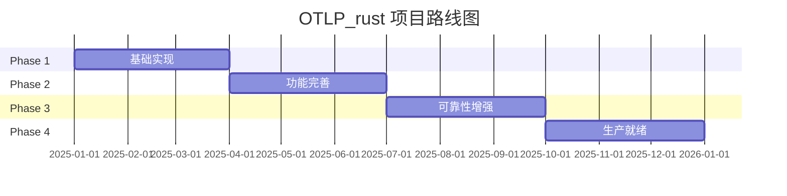

# 项目规划知识图谱

**版本**: 2.0  
**日期**: 2025年10月28日  
**状态**: ✅ 完整

---

## 📋 目录

1. [项目路线图](#1-项目路线图)

---

## 🌐 项目路线图

---

## 🔗 相关资源

- [核心概念](./CONCEPTS.md) - 规划详解
- [对比矩阵](./COMPARISON_MATRIX.md) - 方案对比

---

**版本**: 2.0  
**创建日期**: 2025-10-28
