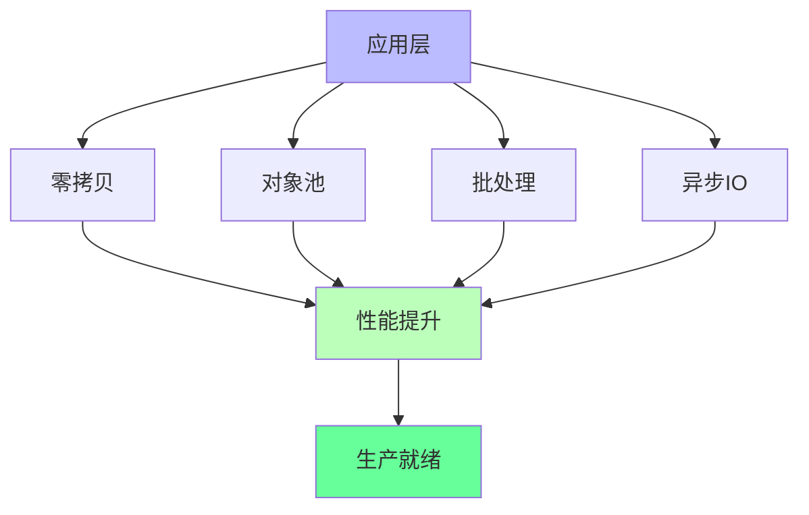

# 技术细节知识图谱

**版本**: 2.0  
**日期**: 2025年10月28日  
**状态**: ✅ 完整

---

## 📋 目录

1. [性能优化技术栈](#1-性能优化技术栈)

---

## 1. 性能优化技术栈

---

## 🔗 相关资源

- [核心概念](./CONCEPTS.md) - 技术详解
- [对比矩阵](./COMPARISON_MATRIX.md) - 技术对比

---

**版本**: 2.0  
**创建日期**: 2025-10-28
