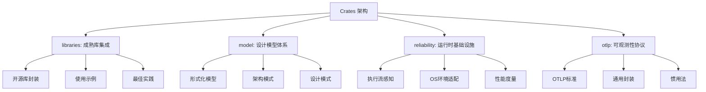
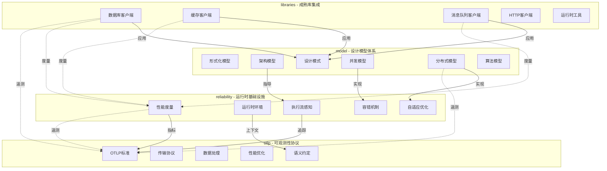
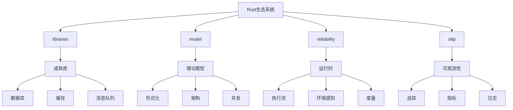

# 📐 Crates 架构重组计划 2025-10-26

**文档版本**: 1.0.0  
**创建日期**: 2025年10月26日  
**维护状态**: ✅ 活跃维护

---

## 📋 目录

- [📐 Crates 架构重组计划 2025-10-26](#-crates-架构重组计划-2025-10-26)
  - [📋 目录](#-目录)
  - [🎯 架构概述](#-架构概述)
    - [当前状态分析](#当前状态分析)
    - [核心问题](#核心问题)
  - [🔄 重定位方案](#-重定位方案)
    - [新定位原则](#新定位原则)
    - [定位对比](#定位对比)
  - [📦 四Crate定位](#-四crate定位)
    - [1. libraries - 成熟库集成 📚](#1-libraries---成熟库集成-)
      - [核心定位](#核心定位)
      - [功能范围](#功能范围)
      - [代码组织](#代码组织)
      - [文档结构](#文档结构)
    - [2. model - 设计模型体系 🎨](#2-model---设计模型体系-)
      - [核心定位](#核心定位-1)
      - [功能范围](#功能范围-1)
      - [代码组织](#代码组织-1)
      - [文档结构](#文档结构-1)
    - [3. reliability - 运行时基础设施 ⚡](#3-reliability---运行时基础设施-)
      - [核心定位](#核心定位-2)
      - [功能范围](#功能范围-2)
      - [代码组织](#代码组织-2)
      - [文档结构](#文档结构-2)
    - [4. otlp - 可观测性协议 📊](#4-otlp---可观测性协议-)
      - [核心定位](#核心定位-3)
      - [功能范围](#功能范围-3)
      - [代码组织](#代码组织-3)
      - [文档结构](#文档结构-3)
  - [🔗 知识图谱](#-知识图谱)
    - [Crate间关系图](#crate间关系图)
    - [概念层次](#概念层次)
  - [📊 矩阵对比](#-矩阵对比)
    - [功能矩阵](#功能矩阵)
    - [依赖关系矩阵](#依赖关系矩阵)
    - [使用场景矩阵](#使用场景矩阵)
    - [API风格对比](#api风格对比)
  - [📝 文档组织](#-文档组织)
    - [统一文档结构](#统一文档结构)
    - [文档模板](#文档模板)
      - [概念文档模板 (Core Concepts)](#概念文档模板-core-concepts)
      - [API文档模板 (API Reference)](#api文档模板-api-reference)
      - [指南模板 (Guides)](#指南模板-guides)
    - [示例代码组织](#示例代码组织)
  - [🚀 实施计划](#-实施计划)
    - [阶段1: 架构重组 (1周)](#阶段1-架构重组-1周)
    - [阶段2: 文档标准化 (2周)](#阶段2-文档标准化-2周)
    - [阶段3: 代码完善 (3周)](#阶段3-代码完善-3周)
    - [阶段4: 测试和基准 (1周)](#阶段4-测试和基准-1周)
    - [阶段5: 发布准备 (1周)](#阶段5-发布准备-1周)
  - [📋 检查清单](#-检查清单)
    - [libraries检查清单](#libraries检查清单)
    - [model检查清单](#model检查清单)
    - [reliability检查清单](#reliability检查清单)
    - [otlp检查清单](#otlp检查清单)
  - [📞 联系与反馈](#-联系与反馈)

---

## 🎯 架构概述

### 当前状态分析

| Crate | 当前定位 | 代码量 | 文档量 | 问题 |
|-------|---------|--------|--------|------|
| **libraries** | Rust开发库知识体系 | 少量 | 156+ 篇 | 文档为主,代码缺失 |
| **model** | 建模与形式方法 | 中等 | 66+ 篇 | 理论为主,实践不足 |
| **reliability** | 统一可靠性框架 | 23,650+ 行 | 46+ 篇 | 生产级,但边界模糊 |
| **otlp** | OTLP协议实现 | 大量 | 完整 | 功能完善,需标准化 |

### 核心问题

1. **定位模糊**: libraries 是文档库还是代码库?
2. **边界不清**: reliability 和 otlp 的功能有重叠
3. **组织分散**: 文档、代码、示例缺乏统一组织
4. **标准缺失**: 缺乏统一的 API 标准和设计模式

---

## 🔄 重定位方案

### 新定位原则



### 定位对比

| Crate | 旧定位 | 新定位 | 核心价值 |
|-------|--------|--------|---------|
| **libraries** | 文档库 | **成熟库集成** | Rust生态成熟库的统一封装和示例 |
| **model** | 理论模型 | **设计模型体系** | 形式模型、架构模型、软件模型的完整体系 |
| **reliability** | 可靠性框架 | **运行时基础设施** | 执行流、OS感知、度量的系统化封装 |
| **otlp** | OTLP实现 | **可观测性协议** | OTLP全面梳理、通用封装、惯用法 |

---

## 📦 四Crate定位

### 1. libraries - 成熟库集成 📚

#### 核心定位
>
> **Rust生态成熟的常用开源库的介绍、封装和示例**

#### 功能范围

**数据库层** (Database):

- PostgreSQL: `tokio-postgres`, `sqlx`
- MySQL: `mysql_async`, `sqlx`
- SQLite: `rusqlite`, `sqlx`
- MongoDB: `mongodb`
- Redis: `redis`, `fred`

**缓存层** (Cache):

- Redis: `redis`, 分布式缓存
- Moka: 内存缓存
- DashMap: 并发缓存

**消息队列** (Message Queue):

- Kafka: `rdkafka`
- NATS: `async-nats`
- MQTT: `rumqttc`
- RabbitMQ: `lapin`

**HTTP/Web** (HTTP):

- Axum: Web框架
- Actix-web: 高性能Web框架
- Reqwest: HTTP客户端
- Hyper: HTTP基础库

**运行时** (Runtime):

- Tokio: 异步运行时
- async-std: 异步标准库
- Glommio: 线程-per-core运行时

#### 代码组织

```text
libraries/
├── src/
│   ├── database/           # 数据库客户端
│   │   ├── postgres_client.rs
│   │   ├── mysql_client.rs
│   │   ├── sqlite_client.rs
│   │   └── sql.rs
│   ├── cache/              # 缓存客户端
│   │   └── redis_client.rs
│   ├── mq/                 # 消息队列客户端
│   │   ├── kafka_client.rs
│   │   ├── nats_client.rs
│   │   └── mqtt_client.rs
│   ├── http/               # HTTP客户端
│   └── runtime/            # 运行时工具
├── examples/               # 完整示例
├── docs/                   # 库文档
└── benches/                # 性能基准
```

#### 文档结构

```text
libraries/docs/
├── 00_OVERVIEW.md          # 库概览
├── 01_DATABASE/            # 数据库
│   ├── postgres.md
│   ├── mysql.md
│   └── examples/
├── 02_CACHE/               # 缓存
├── 03_MESSAGE_QUEUE/       # 消息队列
├── 04_HTTP/                # HTTP
├── 05_RUNTIME/             # 运行时
└── API_REFERENCE/          # API参考
```

---

### 2. model - 设计模型体系 🎨

#### 核心定位
>
> **Rust成熟的各领域设计模型、形式模型、架构模型、软件模型的完整体系**

#### 功能范围

**形式化模型** (Formal Models):

- 操作语义 (Operational Semantics)
- 指称语义 (Denotational Semantics)
- 公理语义 (Axiomatic Semantics)
- 时序逻辑 (Temporal Logic)
- 状态机 (State Machine)

**架构模型** (Architecture Models):

- 分层架构 (Layered Architecture)
- 六边形架构 (Hexagonal Architecture)
- 事件驱动架构 (Event-Driven Architecture)
- 微服务架构 (Microservices Architecture)
- CQRS/Event Sourcing

**软件设计模式** (Design Patterns):

- 创建型: Builder, Factory, Singleton
- 结构型: Adapter, Decorator, Proxy
- 行为型: Observer, Strategy, Command

**并发模型** (Concurrency Models):

- Actor模型
- CSP模型 (Communicating Sequential Processes)
- STM (Software Transactional Memory)
- Fork-Join框架

**分布式模型** (Distributed Models):

- Raft共识算法
- Paxos协议
- 分布式快照 (Chandy-Lamport)
- 向量时钟 (Vector Clock)

**算法模型** (Algorithm Models):

- 图算法 (Graph Algorithms)
- 字符串算法 (String Algorithms)
- 数学算法 (Mathematical Algorithms)
- 优化算法 (Optimization Algorithms)

#### 代码组织

```text
model/
├── src/
│   ├── formal_models/      # 形式化模型
│   │   ├── semantics.rs
│   │   ├── temporal_logic.rs
│   │   └── state_machine.rs
│   ├── architecture/       # 架构模型
│   │   ├── layered.rs
│   │   ├── hexagonal.rs
│   │   ├── event_driven.rs
│   │   └── microservices.rs
│   ├── patterns/           # 设计模式
│   │   ├── creational/
│   │   ├── structural/
│   │   └── behavioral/
│   ├── concurrency/        # 并发模型
│   │   ├── actor.rs
│   │   ├── csp.rs
│   │   └── stm.rs
│   ├── distributed/        # 分布式模型
│   │   ├── raft.rs
│   │   ├── paxos.rs
│   │   └── vector_clock.rs
│   └── algorithms/         # 算法模型
│       ├── graph.rs
│       ├── string.rs
│       └── math.rs
├── examples/               # 模型示例
├── docs/                   # 模型文档
└── benches/                # 性能测试
```

#### 文档结构

```text
model/docs/
├── 00_MASTER_INDEX.md      # 主索引
├── 01_FORMAL_MODELS/       # 形式化模型
├── 02_ARCHITECTURE/        # 架构模型
├── 03_DESIGN_PATTERNS/     # 设计模式
├── 04_CONCURRENCY/         # 并发模型
├── 05_DISTRIBUTED/         # 分布式模型
├── 06_ALGORITHMS/          # 算法模型
└── API_REFERENCE/          # API参考
```

---

### 3. reliability - 运行时基础设施 ⚡

#### 核心定位
>
> **Rust运行时、执行流、环境OS感知、度量的有效封装和组织**

#### 功能范围

**执行流感知** (Execution Flow):

- 调用链追踪 (Call Chain Tracing)
- 执行图构建 (Execution Graph)
- 性能分析 (Performance Analysis)
- 瓶颈识别 (Bottleneck Identification)
- 依赖检测 (Dependency Detection)

**运行时环境** (Runtime Environments):

- OS环境感知 (OS Environment)
- 容器环境 (Container Environment)
- K8s环境 (Kubernetes Environment)
- 嵌入式环境 (Embedded Environment)
- WebAssembly环境 (WASM Environment)
- FaaS环境 (Function-as-a-Service)

**性能度量** (Performance Metrics):

- CPU度量 (CPU Metrics)
- 内存度量 (Memory Metrics)
- I/O度量 (I/O Metrics)
- 网络度量 (Network Metrics)
- 系统资源监控 (System Resource Monitoring)

**自适应优化** (Adaptive Optimization):

- 资源预测 (Resource Prediction)
- 自适应调优 (Adaptive Tuning)
- 拓扑发现 (Topology Discovery)
- 决策引擎 (Decision Engine)

**容错机制** (Fault Tolerance):

- 熔断器 (Circuit Breaker)
- 重试策略 (Retry Policies)
- 超时控制 (Timeout Control)
- 限流 (Rate Limiting)
- 舱壁隔离 (Bulkhead Isolation)

#### 代码组织

```text
reliability/
├── src/
│   ├── execution_flow/     # 执行流感知
│   │   ├── call_chain.rs
│   │   ├── execution_graph.rs
│   │   ├── performance_analyzer.rs
│   │   ├── bottleneck_identifier.rs
│   │   └── dependency_detector.rs
│   ├── runtime_environments/ # 运行时环境
│   │   ├── os_environment.rs
│   │   ├── container_environment.rs
│   │   ├── kubernetes.rs
│   │   ├── embedded_environment.rs
│   │   ├── webassembly_environment.rs
│   │   └── faas_environment.rs
│   ├── runtime_monitoring/  # 运行时监控
│   │   ├── resource_monitor.rs
│   │   ├── performance_monitor.rs
│   │   ├── health_check.rs
│   │   ├── anomaly_detection.rs
│   │   └── auto_recovery.rs
│   ├── self_awareness/     # 系统自我感知
│   │   ├── resource_prediction.rs
│   │   ├── adaptive_tuning.rs
│   │   ├── topology_discovery.rs
│   │   └── decision_engine.rs
│   └── fault_tolerance/    # 容错机制
│       ├── circuit_breaker.rs
│       ├── retry_policies.rs
│       ├── timeout.rs
│       ├── rate_limiting.rs
│       └── bulkhead.rs
├── examples/               # 运行时示例
├── docs/                   # 文档
└── benches/                # 基准测试
```

#### 文档结构

```text
reliability/docs/
├── 00_MASTER_INDEX.md      # 主索引
├── 01_EXECUTION_FLOW/      # 执行流
├── 02_RUNTIME_ENV/         # 运行时环境
├── 03_MONITORING/          # 监控
├── 04_SELF_AWARENESS/      # 自我感知
├── 05_FAULT_TOLERANCE/     # 容错
└── API_REFERENCE/          # API参考
```

---

### 4. otlp - 可观测性协议 📊

#### 核心定位
>
> **Rust OTLP的全面梳理和示例、通用封装和惯用法**

#### 功能范围

**OTLP标准实现** (OTLP Standards):

- Trace (追踪)
- Metric (指标)
- Log (日志)
- Profile (性能分析)
- Event (事件)

**传输协议** (Transport):

- gRPC传输
- HTTP/JSON传输
- HTTP/Protobuf传输

**数据处理** (Data Processing):

- 批处理 (Batch Processing)
- 采样 (Sampling)
- 过滤 (Filtering)
- 聚合 (Aggregation)
- 压缩 (Compression)

**性能优化** (Performance):

- SIMD优化
- 内存池 (Memory Pool)
- 连接池 (Connection Pool)
- 零拷贝 (Zero-Copy)
- 批量发送 (Batch Sending)

**语义约定** (Semantic Conventions):

- HTTP约定
- 数据库约定
- 消息队列约定
- Kubernetes约定
- 通用资源约定

**高级特性** (Advanced Features):

- Profiling API
- SIMD加速
- Tracezip压缩
- OpAMP协议
- OTTL转换

#### 代码组织

```text
otlp/
├── src/
│   ├── client.rs           # OTLP客户端
│   ├── config.rs           # 配置
│   ├── data.rs             # 数据模型
│   ├── transport.rs        # 传输层
│   ├── processor.rs        # 数据处理器
│   ├── exporter.rs         # 数据导出器
│   ├── profiling/          # 性能分析
│   │   ├── cpu.rs
│   │   ├── memory.rs
│   │   ├── pprof.rs
│   │   └── sampling.rs
│   ├── simd/               # SIMD优化
│   │   ├── aggregation.rs
│   │   ├── serialization.rs
│   │   └── cpu_features.rs
│   ├── compression/        # 压缩
│   │   └── tracezip.rs
│   ├── semantic_conventions/ # 语义约定
│   │   ├── http.rs
│   │   ├── database.rs
│   │   ├── messaging.rs
│   │   └── k8s.rs
│   ├── performance/        # 性能优化
│   │   ├── memory_pool.rs
│   │   ├── connection_pool.rs
│   │   └── zero_copy.rs
│   └── advanced_features.rs
├── examples/               # 使用示例
├── docs/                   # 文档
└── benches/                # 性能测试
```

#### 文档结构

```text
otlp/docs/
├── 00_OVERVIEW.md          # OTLP概述
├── 01_STANDARDS/           # OTLP标准
│   ├── trace.md
│   ├── metric.md
│   ├── log.md
│   └── profile.md
├── 02_TRANSPORT/           # 传输协议
├── 03_PROCESSING/          # 数据处理
├── 04_PERFORMANCE/         # 性能优化
├── 05_SEMANTIC_CONVENTIONS/ # 语义约定
├── 06_ADVANCED_FEATURES/   # 高级特性
└── API_REFERENCE/          # API参考
```

---

## 🔗 知识图谱

### Crate间关系图



### 概念层次



---

## 📊 矩阵对比

### 功能矩阵

| 功能领域 | libraries | model | reliability | otlp |
|---------|-----------|-------|-------------|------|
| **数据存储** | ✅ 主要 | ❌ | ❌ | 📊 度量 |
| **缓存** | ✅ 主要 | ❌ | ❌ | 📊 度量 |
| **消息队列** | ✅ 主要 | ❌ | ❌ | 📊 度量 |
| **HTTP** | ✅ 主要 | ❌ | ❌ | 📊 度量 |
| **形式化模型** | ❌ | ✅ 主要 | ❌ | ❌ |
| **架构模式** | ❌ | ✅ 主要 | 🔧 应用 | ❌ |
| **设计模式** | 🔧 应用 | ✅ 主要 | 🔧 应用 | 🔧 应用 |
| **并发模型** | ❌ | ✅ 主要 | 🔧 应用 | ❌ |
| **执行流追踪** | ❌ | ❌ | ✅ 主要 | 📊 度量 |
| **环境感知** | ❌ | ❌ | ✅ 主要 | 📊 上下文 |
| **性能度量** | ❌ | ❌ | ✅ 主要 | 📊 收集 |
| **容错机制** | ❌ | 📚 理论 | ✅ 主要 | 🔧 应用 |
| **OTLP追踪** | 📊 发送 | 📊 发送 | 📊 发送 | ✅ 主要 |
| **OTLP指标** | 📊 发送 | 📊 发送 | 📊 发送 | ✅ 主要 |
| **OTLP日志** | 📊 发送 | 📊 发送 | 📊 发送 | ✅ 主要 |

图例:

- ✅ 主要: 该crate的核心功能
- 🔧 应用: 应用该功能但非核心
- 📊 度量: 被度量/监控
- 📚 理论: 提供理论模型
- ❌ 不涉及: 不包含该功能

### 依赖关系矩阵

| Crate | 依赖libraries | 依赖model | 依赖reliability | 依赖otlp |
|-------|--------------|-----------|----------------|----------|
| **libraries** | - | ❌ | 📊 可选 | 📊 可选 |
| **model** | ❌ | - | ❌ | 📊 可选 |
| **reliability** | ❌ | 📚 理论 | - | 📊 可选 |
| **otlp** | ❌ | ❌ | ❌ | - |

图例:

- ❌: 无依赖
- 📊 可选: 可选依赖(用于遥测)
- 📚 理论: 理论指导关系

### 使用场景矩阵

| 场景 | libraries | model | reliability | otlp |
|------|-----------|-------|-------------|------|
| **Web应用开发** | ✅✅✅ | 🔧 | 🔧 | 📊 |
| **微服务架构** | ✅✅ | ✅✅ | ✅✅✅ | ✅✅✅ |
| **分布式系统** | ✅ | ✅✅✅ | ✅✅✅ | ✅✅ |
| **嵌入式系统** | 🔧 | ✅ | ✅✅✅ | 🔧 |
| **高性能计算** | ✅ | ✅✅ | ✅✅✅ | 📊 |
| **形式化验证** | ❌ | ✅✅✅ | 🔧 | ❌ |
| **架构设计** | 🔧 | ✅✅✅ | ✅✅ | 🔧 |
| **性能优化** | ✅ | ✅ | ✅✅✅ | ✅✅ |
| **可观测性** | 📊 | 📊 | ✅✅ | ✅✅✅ |

图例:

- ✅✅✅: 核心应用
- ✅✅: 重要应用
- ✅: 一般应用
- 🔧: 辅助应用
- 📊: 被监控
- ❌: 不适用

### API风格对比

| 特性 | libraries | model | reliability | otlp |
|------|-----------|-------|-------------|------|
| **异步优先** | ✅ | 🔧 | ✅ | ✅ |
| **同步支持** | 🔧 | ✅ | 🔧 | 🔧 |
| **Builder模式** | ✅ | ✅ | ✅ | ✅ |
| **Trait抽象** | ✅ | ✅✅ | ✅ | ✅ |
| **宏支持** | 🔧 | ✅ | 🔧 | 🔧 |
| **零成本抽象** | ✅ | ✅✅ | ✅✅ | ✅ |
| **类型安全** | ✅✅ | ✅✅ | ✅✅ | ✅✅ |

---

## 📝 文档组织

### 统一文档结构

每个crate采用统一的文档结构:

```text
{crate}/docs/
├── 00_MASTER_INDEX.md      # 主索引 - 完整导航
├── 01_OVERVIEW.md          # 概述 - 快速了解
├── 02_GETTING_STARTED.md   # 快速开始 - 第一个示例
├── 03_CORE_CONCEPTS/       # 核心概念 - 详细说明
│   ├── README.md
│   ├── concept_1.md
│   ├── concept_2.md
│   └── ...
├── 04_API_REFERENCE/       # API参考 - 完整API
│   ├── README.md
│   ├── module_1.md
│   ├── module_2.md
│   └── ...
├── 05_GUIDES/              # 使用指南 - 场景指南
│   ├── README.md
│   ├── guide_1.md
│   ├── guide_2.md
│   └── ...
├── 06_EXAMPLES/            # 示例集合 - 代码示例
│   ├── README.md
│   ├── basic/
│   ├── intermediate/
│   └── advanced/
├── 07_BEST_PRACTICES/      # 最佳实践 - 生产经验
│   ├── README.md
│   ├── performance.md
│   ├── security.md
│   └── testing.md
├── 08_ADVANCED/            # 高级主题 - 深入研究
│   ├── README.md
│   ├── internals.md
│   ├── optimization.md
│   └── integration.md
├── 09_TROUBLESHOOTING/     # 故障排查 - 问题解决
│   ├── README.md
│   ├── common_issues.md
│   └── faq.md
├── 10_MIGRATION/           # 迁移指南 - 版本升级
│   ├── README.md
│   ├── from_v0_to_v1.md
│   └── ...
├── GLOSSARY.md             # 术语表
├── CHANGELOG.md            # 变更日志
└── CONTRIBUTING.md         # 贡献指南
```

### 文档模板

#### 概念文档模板 (Core Concepts)

```markdown
# 概念名称

**状态**: ✅ 稳定 / 🚧 实验性  
**最后更新**: YYYY-MM-DD

## 概述

简短描述(2-3句话)

## 核心概念

### 概念1
详细说明

### 概念2
详细说明

## 使用场景

## 代码示例

## 相关概念

## 进一步阅读
```

#### API文档模板 (API Reference)

```markdown
    # API: ModuleName

    **模块路径**: `crate::module`  
    **状态**: ✅ 稳定  
    **Rust版本**: 1.90+

    ## 概述

    ## 主要类型

    ### Type1
    ```rust
    pub struct Type1 { }
    ```

    #### 方法

    ## 函数

    ## 示例

    ## 注意事项

```

#### 指南模板 (Guides)

```markdown
    # 指南: 主题名称

    **难度**: 🟢 入门 / 🟡 中级 / 🔴 高级  
    **预计时间**: X分钟

    ## 目标

    完成本指南后,你将学会...

    ## 前置条件

    ## 步骤

    ### 第1步: ...

    ### 第2步: ...

    ## 完整示例

    ## 下一步

    ## 相关指南
```

### 示例代码组织

```text
{crate}/examples/
├── README.md               # 示例总览
├── basic/                  # 基础示例
│   ├── 01_hello_world.rs
│   ├── 02_basic_usage.rs
│   └── README.md
├── intermediate/           # 中级示例
│   ├── 01_async_usage.rs
│   ├── 02_error_handling.rs
│   └── README.md
├── advanced/               # 高级示例
│   ├── 01_performance.rs
│   ├── 02_integration.rs
│   └── README.md
└── real_world/             # 实际应用
    ├── web_app/
    ├── microservice/
    └── README.md
```

---

## 🚀 实施计划

### 阶段1: 架构重组 (1周)

**目标**: 明确定位,重组代码结构

**任务**:

1. ✅ 创建架构重组文档 (本文档)
2. 🔲 创建知识图谱文档
3. 🔲 创建矩阵对比文档
4. 🔲 更新每个crate的README
5. 🔲 重组代码目录结构

**成果物**:

- 架构重组文档
- 知识图谱文档
- 矩阵对比文档
- 更新的README
- 新的目录结构

### 阶段2: 文档标准化 (2周)

**目标**: 建立统一文档标准,补充缺失文档

**任务**:

1. 🔲 制定文档模板
2. 🔲 创建API参考文档
3. 🔲 创建使用指南
4. 🔲 创建示例集合
5. 🔲 创建最佳实践文档

**成果物**:

- 文档模板
- 4个crate的完整文档

### 阶段3: 代码完善 (3周)

**目标**: 补充代码实现,对齐定位

**libraries任务**:

- 补充数据库客户端实现
- 补充缓存客户端实现
- 补充消息队列客户端实现
- 创建完整示例

**model任务**:

- 完善形式化模型实现
- 完善架构模式实现
- 创建模式示例

**reliability任务**:

- 完善执行流追踪
- 完善运行时监控
- 创建环境适配器

**otlp任务**:

- 完善OTLP标准实现
- 完善性能优化
- 创建惯用法示例

### 阶段4: 测试和基准 (1周)

**目标**: 确保质量和性能

**任务**:

1. 🔲 编写单元测试
2. 🔲 编写集成测试
3. 🔲 编写性能基准测试
4. 🔲 代码覆盖率分析
5. 🔲 性能分析

**目标指标**:

- 代码覆盖率 > 80%
- 所有基准测试通过
- 文档覆盖率 100%

### 阶段5: 发布准备 (1周)

**目标**: 准备发布

**任务**:

1. 🔲 版本号规划
2. 🔲 CHANGELOG编写
3. 🔲 发布文档准备
4. 🔲 CI/CD配置
5. 🔲 发布到crates.io

---

## 📋 检查清单

### libraries检查清单

- [ ] README更新
- [ ] 代码结构重组
- [ ] API文档完成
- [ ] 使用指南完成
- [ ] 示例代码完成
- [ ] 测试覆盖率 > 80%
- [ ] 性能基准完成

### model检查清单

- [ ] README更新
- [ ] 模型实现完成
- [ ] API文档完成
- [ ] 模型文档完成
- [ ] 示例代码完成
- [ ] 测试覆盖率 > 80%

### reliability检查清单

- [ ] README更新
- [ ] 执行流追踪完成
- [ ] 运行时监控完成
- [ ] API文档完成
- [ ] 使用指南完成
- [ ] 示例代码完成
- [ ] 测试覆盖率 > 80%

### otlp检查清单

- [ ] README更新
- [ ] OTLP标准完成
- [ ] API文档完成
- [ ] 惯用法文档完成
- [ ] 示例代码完成
- [ ] 性能优化完成
- [ ] 测试覆盖率 > 80%

---

## 📞 联系与反馈

如有任何问题或建议,请通过以下方式联系:

- **GitHub Issues**: [提交问题]()
- **讨论区**: [参与讨论]()
- **邮件**: <team@example.com>

---

**最后更新**: 2025年10月26日  
**文档版本**: 1.0.0  
**维护状态**: ✅ 活跃维护
