# 🧠 Crates 知识图谱与概念关系 2025-10-26

**文档版本**: 1.0.0  
**创建日期**: 2025年10月26日  
**维护状态**: ✅ 活跃维护

---

## 📋 目录

- [🧠 Crates 知识图谱与概念关系 2025-10-26](#-crates-知识图谱与概念关系-2025-10-26)
  - [📋 目录](#-目录)
  - [🎯 概述](#-概述)
    - [知识图谱结构](#知识图谱结构)
  - [📚 核心概念体系](#-核心概念体系)
    - [1. libraries 概念体系](#1-libraries-概念体系)
      - [1.1 主概念](#11-主概念)
      - [1.2 具体概念](#12-具体概念)
    - [2. model 概念体系](#2-model-概念体系)
      - [2.1 主概念](#21-主概念)
      - [2.2 形式化模型 (Formal Models)](#22-形式化模型-formal-models)
      - [2.3 架构模型 (Architecture Models)](#23-架构模型-architecture-models)
      - [2.4 并发模型 (Concurrency Models)](#24-并发模型-concurrency-models)
      - [2.5 分布式模型 (Distributed Models)](#25-分布式模型-distributed-models)
    - [3. reliability 概念体系](#3-reliability-概念体系)
      - [3.1 主概念](#31-主概念)
      - [3.2 执行流感知 (Execution Flow)](#32-执行流感知-execution-flow)
      - [3.3 运行时环境 (Runtime Environments)](#33-运行时环境-runtime-environments)
      - [3.4 性能度量 (Performance Metrics)](#34-性能度量-performance-metrics)
      - [3.5 容错机制 (Fault Tolerance)](#35-容错机制-fault-tolerance)
    - [4. otlp 概念体系](#4-otlp-概念体系)
      - [4.1 主概念](#41-主概念)
      - [4.2 OTLP信号 (OTLP Signals)](#42-otlp信号-otlp-signals)
      - [4.3 语义约定 (Semantic Conventions)](#43-语义约定-semantic-conventions)
  - [🔗 概念关系图](#-概念关系图)
    - [跨Crate概念关系](#跨crate概念关系)
    - [关系类型定义](#关系类型定义)
  - [📐 概念属性定义](#-概念属性定义)
    - [属性模板](#属性模板)
    - [示例:CircuitBreaker概念定义](#示例circuitbreaker概念定义)
  - [🚀 概念扩展路径](#-概念扩展路径)
    - [扩展框架](#扩展框架)
    - [libraries扩展路径](#libraries扩展路径)
    - [model扩展路径](#model扩展路径)
    - [reliability扩展路径](#reliability扩展路径)
    - [otlp扩展路径](#otlp扩展路径)
  - [✅ 一致性检查](#-一致性检查)
    - [命名一致性](#命名一致性)
    - [关系一致性](#关系一致性)
    - [版本一致性](#版本一致性)
    - [文档一致性](#文档一致性)
  - [📖 使用指南](#-使用指南)
    - [概念查询](#概念查询)
    - [关系追踪](#关系追踪)
    - [扩展概念](#扩展概念)
  - [📞 反馈与改进](#-反馈与改进)

---

## 🎯 概述

本文档定义了OTLP_rust项目中四个crate的完整知识图谱,包括:

- **概念定义**: 每个概念的精确定义
- **概念属性**: 概念的特征和性质
- **概念关系**: 概念间的依赖、继承、组合等关系
- **概念扩展**: 概念的演化和扩展路径
- **一致性规则**: 确保概念体系的一致性

### 知识图谱结构

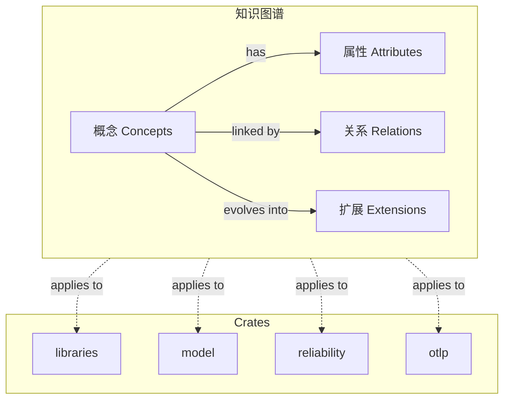

---

## 📚 核心概念体系

### 1. libraries 概念体系

#### 1.1 主概念

| 概念ID | 概念名称 | 定义 | 层级 |
|--------|---------|------|------|
| L.001 | MatureLibrary | 成熟的Rust开源库 | 1 |
| L.002 | DatabaseClient | 数据库客户端抽象 | 2 |
| L.003 | CacheClient | 缓存客户端抽象 | 2 |
| L.004 | MessageQueueClient | 消息队列客户端抽象 | 2 |
| L.005 | HttpClient | HTTP客户端抽象 | 2 |
| L.006 | RuntimeTool | 异步运行时工具 | 2 |

#### 1.2 具体概念

**数据库 (Database)**:

- L.002.1: PostgreSQLClient - PostgreSQL客户端
- L.002.2: MySQLClient - MySQL客户端
- L.002.3: SQLiteClient - SQLite客户端
- L.002.4: MongoDBClient - MongoDB客户端

**缓存 (Cache)**:

- L.003.1: RedisClient - Redis客户端
- L.003.2: MokaCache - 内存缓存
- L.003.3: DashMapCache - 并发缓存

**消息队列 (Message Queue)**:

- L.004.1: KafkaClient - Kafka客户端
- L.004.2: NATSClient - NATS客户端
- L.004.3: MQTTClient - MQTT客户端
- L.004.4: RabbitMQClient - RabbitMQ客户端

**HTTP**:

- L.005.1: ReqwestClient - HTTP客户端
- L.005.2: AxumFramework - Web框架
- L.005.3: ActixFramework - 高性能Web框架

**运行时 (Runtime)**:

- L.006.1: TokioRuntime - Tokio异步运行时
- L.006.2: AsyncStdRuntime - async-std运行时
- L.006.3: GlommioRuntime - thread-per-core运行时

---

### 2. model 概念体系

#### 2.1 主概念

| 概念ID | 概念名称 | 定义 | 层级 |
|--------|---------|------|------|
| M.001 | FormalModel | 形式化模型抽象 | 1 |
| M.002 | ArchitectureModel | 架构模型抽象 | 1 |
| M.003 | DesignPattern | 设计模式抽象 | 1 |
| M.004 | ConcurrencyModel | 并发模型抽象 | 1 |
| M.005 | DistributedModel | 分布式模型抽象 | 1 |
| M.006 | AlgorithmModel | 算法模型抽象 | 1 |

#### 2.2 形式化模型 (Formal Models)

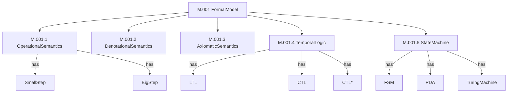

| 概念ID | 概念名称 | 定义 |
|--------|---------|------|
| M.001.1 | OperationalSemantics | 操作语义:描述程序执行的计算步骤 |
| M.001.1.1 | SmallStep | 小步语义:单步执行 |
| M.001.1.2 | BigStep | 大步语义:执行到值 |
| M.001.2 | DenotationalSemantics | 指称语义:将程序映射到数学对象 |
| M.001.3 | AxiomaticSemantics | 公理语义:基于逻辑的程序验证 |
| M.001.3.1 | HoareLogic | Hoare逻辑:{P}C{Q} |
| M.001.3.2 | WeakestPrecondition | 最弱前置条件 |
| M.001.4 | TemporalLogic | 时序逻辑:描述时间性质 |
| M.001.4.1 | LTL | 线性时序逻辑 |
| M.001.4.2 | CTL | 计算树逻辑 |
| M.001.5 | StateMachine | 状态机:状态和转换 |

#### 2.3 架构模型 (Architecture Models)

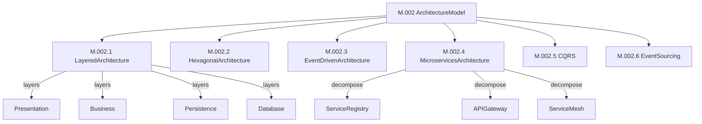

| 概念ID | 概念名称 | 定义 |
|--------|---------|------|
| M.002.1 | LayeredArchitecture | 分层架构:按功能分层 |
| M.002.2 | HexagonalArchitecture | 六边形架构:端口和适配器 |
| M.002.3 | EventDrivenArchitecture | 事件驱动架构:基于事件通信 |
| M.002.4 | MicroservicesArchitecture | 微服务架构:服务拆分 |
| M.002.5 | CQRS | 命令查询责任分离 |
| M.002.6 | EventSourcing | 事件溯源:事件日志 |

#### 2.4 并发模型 (Concurrency Models)

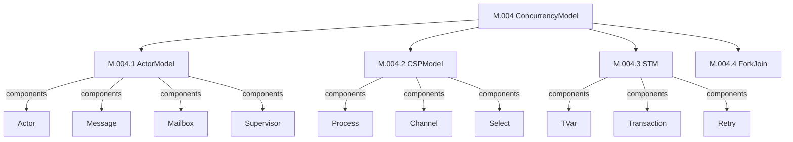

| 概念ID | 概念名称 | 定义 |
|--------|---------|------|
| M.004.1 | ActorModel | Actor模型:消息传递并发 |
| M.004.2 | CSPModel | CSP模型:通信顺序进程 |
| M.004.3 | STM | 软件事务内存:事务式并发 |
| M.004.4 | ForkJoin | Fork-Join框架:分治并发 |

#### 2.5 分布式模型 (Distributed Models)

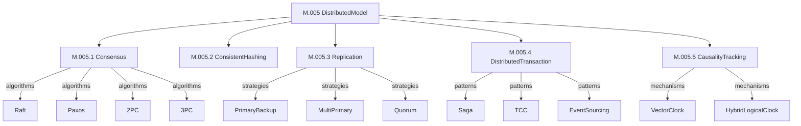

| 概念ID | 概念名称 | 定义 |
|--------|---------|------|
| M.005.1 | Consensus | 共识算法:一致性保证 |
| M.005.1.1 | Raft | Raft算法:易理解的共识 |
| M.005.1.2 | Paxos | Paxos算法:经典共识 |
| M.005.2 | ConsistentHashing | 一致性哈希:负载均衡 |
| M.005.3 | Replication | 数据复制:高可用 |
| M.005.4 | DistributedTransaction | 分布式事务:ACID保证 |
| M.005.5 | CausalityTracking | 因果追踪:事件顺序 |

---

### 3. reliability 概念体系

#### 3.1 主概念

| 概念ID | 概念名称 | 定义 | 层级 |
|--------|---------|------|------|
| R.001 | ExecutionFlow | 执行流:程序运行路径 | 1 |
| R.002 | RuntimeEnvironment | 运行时环境:程序执行环境 | 1 |
| R.003 | PerformanceMetric | 性能度量:系统性能指标 | 1 |
| R.004 | SelfAwareness | 自我感知:系统自省能力 | 1 |
| R.005 | FaultTolerance | 容错机制:故障处理 | 1 |

#### 3.2 执行流感知 (Execution Flow)

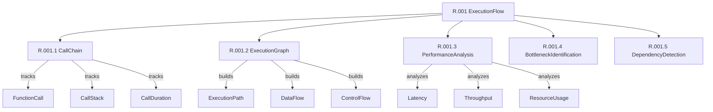

| 概念ID | 概念名称 | 定义 |
|--------|---------|------|
| R.001.1 | CallChain | 调用链:函数调用序列 |
| R.001.2 | ExecutionGraph | 执行图:执行路径可视化 |
| R.001.3 | PerformanceAnalysis | 性能分析:性能瓶颈识别 |
| R.001.4 | BottleneckIdentification | 瓶颈识别:性能瓶颈定位 |
| R.001.5 | DependencyDetection | 依赖检测:组件依赖关系 |

#### 3.3 运行时环境 (Runtime Environments)

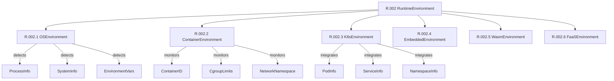

| 概念ID | 概念名称 | 定义 |
|--------|---------|------|
| R.002.1 | OSEnvironment | OS环境:操作系统感知 |
| R.002.2 | ContainerEnvironment | 容器环境:Docker/Podman |
| R.002.3 | K8sEnvironment | K8s环境:Kubernetes集成 |
| R.002.4 | EmbeddedEnvironment | 嵌入式环境:资源受限 |
| R.002.5 | WasmEnvironment | Wasm环境:WebAssembly |
| R.002.6 | FaaSEnvironment | FaaS环境:无服务器 |

#### 3.4 性能度量 (Performance Metrics)

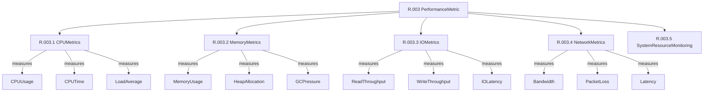

| 概念ID | 概念名称 | 定义 |
|--------|---------|------|
| R.003.1 | CPUMetrics | CPU度量:CPU使用情况 |
| R.003.2 | MemoryMetrics | 内存度量:内存使用情况 |
| R.003.3 | IOMetrics | I/O度量:I/O性能 |
| R.003.4 | NetworkMetrics | 网络度量:网络性能 |
| R.003.5 | SystemResourceMonitoring | 系统监控:综合监控 |

#### 3.5 容错机制 (Fault Tolerance)

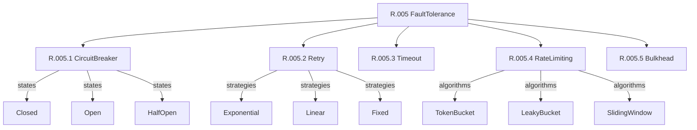

| 概念ID | 概念名称 | 定义 |
|--------|---------|------|
| R.005.1 | CircuitBreaker | 熔断器:故障隔离 |
| R.005.2 | Retry | 重试:失败重试 |
| R.005.3 | Timeout | 超时:时间限制 |
| R.005.4 | RateLimiting | 限流:流量控制 |
| R.005.5 | Bulkhead | 舱壁:资源隔离 |

---

### 4. otlp 概念体系

#### 4.1 主概念

| 概念ID | 概念名称 | 定义 | 层级 |
|--------|---------|------|------|
| O.001 | OTLPStandard | OTLP标准:协议规范 | 1 |
| O.002 | TransportProtocol | 传输协议:数据传输 | 1 |
| O.003 | DataProcessing | 数据处理:数据转换 | 1 |
| O.004 | PerformanceOptimization | 性能优化:高效处理 | 1 |
| O.005 | SemanticConvention | 语义约定:标准化命名 | 1 |

#### 4.2 OTLP信号 (OTLP Signals)

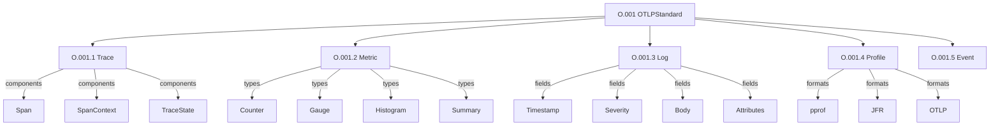

| 概念ID | 概念名称 | 定义 |
|--------|---------|------|
| O.001.1 | Trace | 追踪:分布式追踪 |
| O.001.1.1 | Span | 跨度:操作单元 |
| O.001.1.2 | SpanContext | 跨度上下文:追踪标识 |
| O.001.2 | Metric | 指标:数值度量 |
| O.001.3 | Log | 日志:结构化日志 |
| O.001.4 | Profile | 性能分析:CPU/内存分析 |
| O.001.5 | Event | 事件:离散事件 |

#### 4.3 语义约定 (Semantic Conventions)

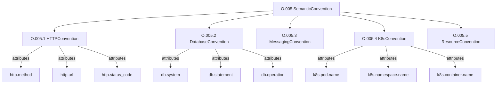

| 概念ID | 概念名称 | 定义 |
|--------|---------|------|
| O.005.1 | HTTPConvention | HTTP约定:HTTP属性 |
| O.005.2 | DatabaseConvention | 数据库约定:数据库属性 |
| O.005.3 | MessagingConvention | 消息队列约定:MQ属性 |
| O.005.4 | K8sConvention | K8s约定:K8s属性 |
| O.005.5 | ResourceConvention | 资源约定:资源属性 |

---

## 🔗 概念关系图

### 跨Crate概念关系

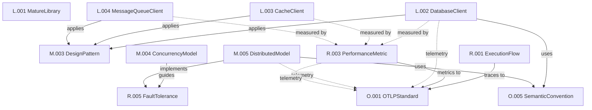

### 关系类型定义

| 关系类型 | 符号 | 定义 | 示例 |
|---------|------|------|------|
| 继承 (Inheritance) | `-->|is-a|` | A是B的子类 | `Actor -->|is-a| ConcurrencyModel` |
| 组合 (Composition) | `-->|has|` | A包含B | `OTLPClient -->|has| Transport` |
| 聚合 (Aggregation) | `-->|contains|` | A聚合B | `ExecutionFlow -->|contains| CallChain` |
| 依赖 (Dependency) | `-->|uses|` | A使用B | `DatabaseClient -->|uses| DesignPattern` |
| 实现 (Implementation) | `-->|implements|` | A实现B | `Raft -->|implements| Consensus` |
| 关联 (Association) | `-->|related to|` | A关联B | `Metric -->|related to| PerformanceMetric` |
| 度量 (Measurement) | `-.->|measured by|` | A被B度量 | `DatabaseClient -.->|measured by| PerformanceMetric` |
| 遥测 (Telemetry) | `-.->|telemetry|` | A向B发送遥测 | `ExecutionFlow -.->|telemetry| OTLPTrace` |
| 应用 (Application) | `-->|applies|` | A应用B | `DatabaseClient -->|applies| BuilderPattern` |
| 指导 (Guidance) | `-->|guides|` | A指导B | `ArchitectureModel -->|guides| Implementation` |

---

## 📐 概念属性定义

### 属性模板

每个概念都包含以下标准属性:

```yaml
concept:
  id: "概念ID"
  name: "概念名称"
  definition: "概念定义"
  level: 层级 (1-5)
  category: 类别
  status: 状态 (稳定/实验性/已弃用)
  version: 版本号
  rust_version: 最低Rust版本
  
  attributes:
    - name: 属性名
      type: 属性类型
      required: 是否必需
      default: 默认值
      
  methods:
    - name: 方法名
      signature: 方法签名
      description: 方法描述
      
  relationships:
    - type: 关系类型
      target: 目标概念
      description: 关系描述
      
  examples:
    - name: 示例名称
      code: 示例代码
      
  constraints:
    - 约束条件
    
  extensions:
    - 扩展路径
```

### 示例:CircuitBreaker概念定义

```yaml
concept:
  id: "R.005.1"
  name: "CircuitBreaker"
  definition: "熔断器模式,防止故障级联"
  level: 2
  category: "FaultTolerance"
  status: "稳定"
  version: "1.0.0"
  rust_version: "1.90"
  
  attributes:
    - name: "failure_threshold"
      type: "u32"
      required: true
      default: 5
      description: "失败阈值"
      
    - name: "recovery_timeout"
      type: "Duration"
      required: true
      default: "30s"
      description: "恢复超时"
      
    - name: "state"
      type: "CircuitBreakerState"
      required: true
      enum: [Closed, Open, HalfOpen]
      
  methods:
    - name: "call"
      signature: "async fn call<F>(&self, f: F) -> Result<T>"
      description: "执行受保护的调用"
      
    - name: "reset"
      signature: "fn reset(&self)"
      description: "重置熔断器状态"
      
  relationships:
    - type: "implements"
      target: "R.005 FaultTolerance"
      description: "实现容错机制"
      
    - type: "measured by"
      target: "R.003 PerformanceMetric"
      description: "性能度量"
      
    - type: "telemetry"
      target: "O.001.2 Metric"
      description: "发送指标到OTLP"
      
  examples:
    - name: "basic_usage"
      code: |
        let cb = CircuitBreaker::new(config);
        cb.call(|| async {
            database_query().await
        }).await?;
        
  constraints:
    - "failure_threshold > 0"
    - "recovery_timeout >= 1s"
    - "state transitions: Closed -> Open -> HalfOpen -> Closed"
    
  extensions:
    - "EnhancedCircuitBreaker: 支持动态阈值调整"
    - "DistributedCircuitBreaker: 分布式熔断器"
```

---

## 🚀 概念扩展路径

### 扩展框架

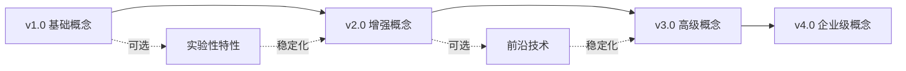

### libraries扩展路径

```yaml
version_1.0:
  concepts:
    - PostgreSQLClient
    - RedisClient
    - KafkaClient
  status: 稳定
  
version_2.0:
  new_concepts:
    - ScyllaDBClient (高性能数据库)
    - ClickHouseClient (OLAP数据库)
    - PulsarClient (流处理)
  enhancements:
    - PostgreSQLClient: 连接池优化
    - RedisClient: Redis Cluster支持
  status: 开发中
  
version_3.0:
  new_concepts:
    - DistributedCacheClient (分布式缓存)
    - SmartDatabaseRouter (智能路由)
  status: 计划中
```

### model扩展路径

```yaml
version_1.0:
  concepts:
    - BasicFormalModels (基础形式化模型)
    - CommonArchitecturePatterns (常见架构模式)
    - StandardDesignPatterns (标准设计模式)
  status: 稳定
  
version_2.0:
  new_concepts:
    - AdvancedFormalVerification (高级形式化验证)
    - ServerlessFunctions:
      Patterns (无服务器模式)
    - MLArchitecturePatterns (机器学习架构)
  enhancements:
    - RaftAlgorithm: 性能优化
    - ActorModel: 错误处理增强
  status: 开发中
  
version_3.0:
  new_concepts:
    - QuantumInspiredAlgorithms (量子启发算法)
    - AIAssistedArchitecture (AI辅助架构设计)
  status: 研究中
```

### reliability扩展路径

```yaml
version_1.0:
  concepts:
    - BasicExecutionFlow (基础执行流)
    - OSEnvironmentDetection (OS环境检测)
    - SimpleMetrics (简单度量)
  status: 稳定
  
version_2.0:
  new_concepts:
    - AIAssistedBottleneckDetection (AI瓶颈检测)
    - PredictiveResourceManagement (预测性资源管理)
    - AutoScaling (自动扩缩容)
  enhancements:
    - ExecutionFlow: 分布式追踪集成
    - PerformanceMetrics: ML预测
  status: 开发中
  
version_3.0:
  new_concepts:
    - AutonomousSystemOptimization (自主系统优化)
    - CognitiveMonitoring (认知监控)
  status: 计划中
```

### otlp扩展路径

```yaml
version_1.0:
  concepts:
    - OTLPTrace (追踪)
    - OTLPMetric (指标)
    - OTLPLog (日志)
  status: 稳定
  
version_2.0:
  new_concepts:
    - OTLPProfile (性能分析)
    - OTLPEvent (事件)
    - OTLP/Arrow (高性能传输)
  enhancements:
    - SIMDOptimization (SIMD优化)
    - TracezipCompression (Tracezip压缩)
  status: 开发中
  
version_3.0:
  new_concepts:
    - OTLPStream (流式处理)
    - OTLPEdge (边缘计算集成)
    - DistributedOTLP (分布式OTLP)
  status: 计划中
```

---

## ✅ 一致性检查

### 命名一致性

| 规则ID | 规则 | 示例 |
|--------|------|------|
| NC-001 | 概念ID格式: `{Crate}.{Number}[.{SubNumber}]*` | `L.002.1` |
| NC-002 | 概念名称: PascalCase | `DatabaseClient` |
| NC-003 | 方法名称: snake_case | `send_trace` |
| NC-004 | 常量名称: UPPER_SNAKE_CASE | `MAX_RETRY_COUNT` |
| NC-005 | 类型别名: PascalCase | `Result`, `Error` |

### 关系一致性

| 规则ID | 规则 | 检查 |
|--------|------|------|
| RC-001 | 继承传递性 | 如果A继承B,B继承C,则A继承C |
| RC-002 | 组合非循环性 | 概念间组合关系不能形成循环 |
| RC-003 | 依赖单向性 | 底层crate不能依赖上层crate |
| RC-004 | 遥测统一性 | 所有遥测数据必须通过otlp crate |

### 版本一致性

| 规则ID | 规则 | 检查 |
|--------|------|------|
| VC-001 | 语义化版本 | 遵循SemVer规范 |
| VC-002 | Rust版本要求 | 所有crate最低支持Rust 1.90 |
| VC-003 | 依赖版本锁定 | workspace依赖版本统一 |
| VC-004 | 向后兼容性 | minor版本更新保持向后兼容 |

### 文档一致性

| 规则ID | 规则 | 检查 |
|--------|------|------|
| DC-001 | 文档完整性 | 每个概念必须有文档 |
| DC-002 | 示例可运行性 | 所有示例代码可编译运行 |
| DC-003 | 链接有效性 | 所有文档链接有效 |
| DC-004 | 更新及时性 | 代码变更后文档同步更新 |

---

## 📖 使用指南

### 概念查询

**按ID查询**:

```bash
# 查询CircuitBreaker概念
grep -r "R.005.1" docs/
```

**按名称查询**:

```bash
# 查询所有与Actor相关的概念
grep -r "ActorModel" docs/
```

**按分类查询**:

```bash
# 查询所有并发模型
grep "category: ConcurrencyModel" docs/
```

### 关系追踪

**追踪依赖**:


**示例查询**:

```yaml
# 查询CircuitBreaker的所有关系
concept: R.005.1
relationships:
  - type: implements
    target: R.005 FaultTolerance
  - type: measured by
    target: R.003 PerformanceMetric
  - type: telemetry
    target: O.001.2 Metric
```

### 扩展概念

**添加新概念**:

1. 分配概念ID
2. 定义概念属性
3. 建立概念关系
4. 编写概念文档
5. 实现概念代码
6. 添加测试用例
7. 更新知识图谱

**示例**:

```yaml
# 添加新的限流算法
concept:
  id: "R.005.4.4"
  name: "AdaptiveRateLimiter"
  parent: "R.005.4 RateLimiting"
  definition: "自适应限流算法"
  status: "实验性"
  version: "0.1.0"
```

---

## 📞 反馈与改进

如果您发现:

- 概念定义不清晰
- 关系定义不准确
- 一致性规则违反
- 扩展路径建议

请通过以下方式反馈:

- GitHub Issues
- 文档PR
- 邮件: <team@example.com>

---

**最后更新**: 2025年10月26日  
**文档版本**: 1.0.0  
**维护状态**: ✅ 活跃维护
