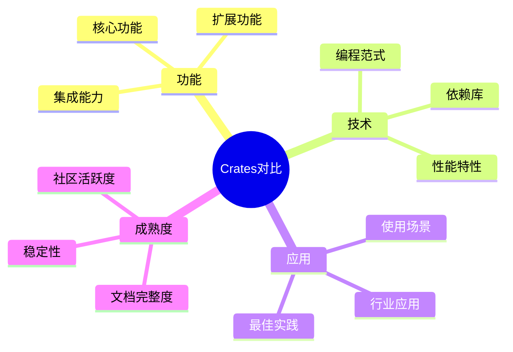
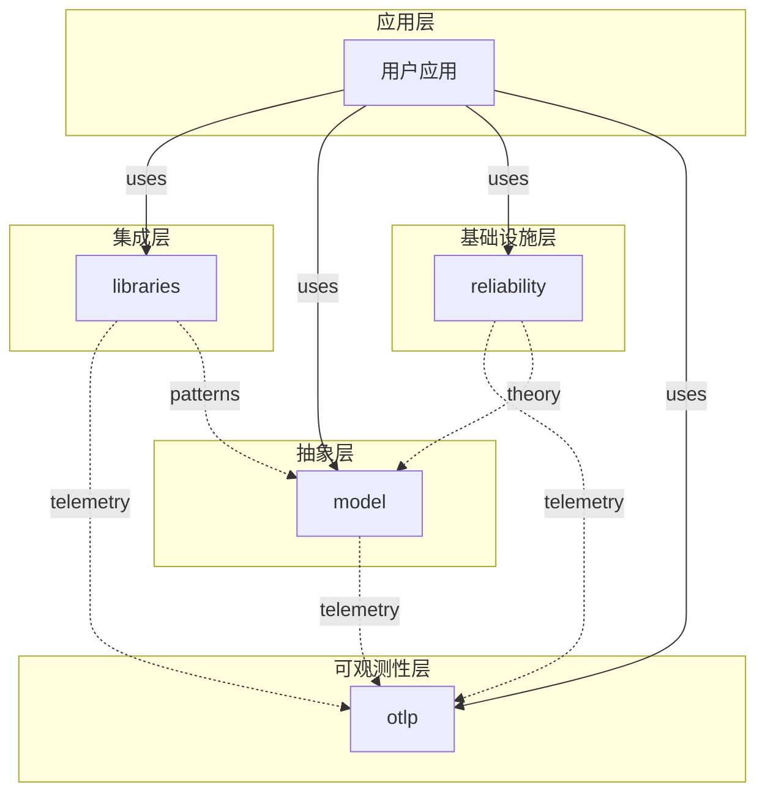
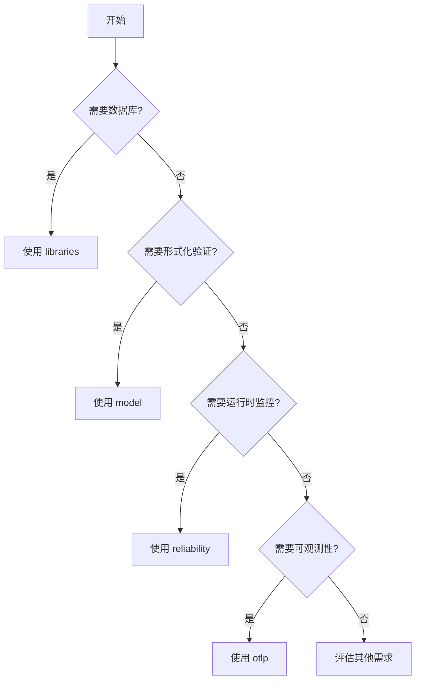

# 📊 Crates 矩阵对比分析 2025-10-26

**文档版本**: 1.0.0  
**创建日期**: 2025年10月26日  
**维护状态**: ✅ 活跃维护

---

## 📋 目录

- [📊 Crates 矩阵对比分析 2025-10-26](#-crates-矩阵对比分析-2025-10-26)
  - [📋 目录](#-目录)
  - [🎯 概述](#-概述)
    - [对比维度](#对比维度)
  - [📊 功能矩阵](#-功能矩阵)
    - [核心功能对比](#核心功能对比)
    - [扩展功能对比](#扩展功能对比)
  - [🛠️ 技术栈矩阵](#️-技术栈矩阵)
    - [核心依赖对比](#核心依赖对比)
    - [数据库依赖](#数据库依赖)
    - [消息队列依赖](#消息队列依赖)
    - [并发和同步](#并发和同步)
    - [性能和优化](#性能和优化)
  - [🔗 依赖关系矩阵](#-依赖关系矩阵)
    - [Crate间依赖](#crate间依赖)
    - [依赖层次](#依赖层次)
    - [Feature Flag依赖](#feature-flag依赖)
  - [🎨 API设计矩阵](#-api设计矩阵)
    - [API风格对比](#api风格对比)
    - [API命名风格](#api命名风格)
    - [API一致性](#api一致性)
  - [⚡ 性能特性矩阵](#-性能特性矩阵)
    - [性能指标](#性能指标)
    - [性能优化技术](#性能优化技术)
    - [扩展性](#扩展性)
  - [🎯 应用场景矩阵](#-应用场景矩阵)
    - [场景适用性](#场景适用性)
    - [行业应用](#行业应用)
    - [使用模式](#使用模式)
  - [📈 成熟度矩阵](#-成熟度矩阵)
    - [开发成熟度](#开发成熟度)
    - [社区成熟度](#社区成熟度)
    - [企业就绪度](#企业就绪度)
  - [🎓 学习路径矩阵](#-学习路径矩阵)
    - [难度评级](#难度评级)
    - [学习时间估计](#学习时间估计)
    - [前置知识](#前置知识)
    - [推荐学习路径](#推荐学习路径)
  - [🤔 决策矩阵](#-决策矩阵)
    - [功能需求决策树](#功能需求决策树)
    - [场景选择矩阵](#场景选择矩阵)
    - [组合使用建议](#组合使用建议)
  - [📞 反馈与改进](#-反馈与改进)

---

## 🎯 概述

本文档提供四个crate的多维度矩阵对比，帮助用户:

- **理解定位**: 快速了解每个crate的核心价值
- **技术选型**: 根据需求选择合适的crate
- **学习路径**: 制定合理的学习计划
- **集成决策**: 规划crate间的集成方案

### 对比维度



---

## 📊 功能矩阵

### 核心功能对比

| 功能领域 | libraries | model | reliability | otlp | 说明 |
|---------|-----------|-------|-------------|------|------|
| **数据库访问** | ✅✅✅ 主要 | ❌ | ❌ | 📊 度量 | libraries提供统一封装 |
| **缓存管理** | ✅✅✅ 主要 | ❌ | ❌ | 📊 度量 | Redis, Moka等 |
| **消息队列** | ✅✅✅ 主要 | ❌ | ❌ | 📊 度量 | Kafka, NATS等 |
| **HTTP客户端** | ✅✅✅ 主要 | ❌ | ❌ | 📊 度量 | Reqwest, Hyper |
| **形式化验证** | ❌ | ✅✅✅ 主要 | 🔧 应用 | ❌ | 状态机, 时序逻辑 |
| **架构模式** | ❌ | ✅✅✅ 主要 | 🔧 应用 | ❌ | 分层, 六边形, CQRS |
| **设计模式** | 🔧 应用 | ✅✅✅ 主要 | 🔧 应用 | 🔧 应用 | Builder, Factory等 |
| **并发模型** | ❌ | ✅✅✅ 主要 | 🔧 实现 | ❌ | Actor, CSP, STM |
| **分布式算法** | ❌ | ✅✅✅ 主要 | 🔧 实现 | ❌ | Raft, Paxos, 2PC |
| **执行流追踪** | ❌ | ❌ | ✅✅✅ 主要 | 📊 度量 | 调用链, 性能分析 |
| **环境感知** | ❌ | ❌ | ✅✅✅ 主要 | 📊 上下文 | OS, 容器, K8s |
| **性能度量** | 📊 本地 | ❌ | ✅✅✅ 主要 | 📊 收集 | CPU, 内存, I/O |
| **容错机制** | ❌ | 📚 理论 | ✅✅✅ 主要 | 🔧 应用 | 熔断, 重试, 限流 |
| **自适应优化** | ❌ | 📚 理论 | ✅✅✅ 主要 | ❌ | 资源预测, 自动调优 |
| **分布式追踪** | 📊 发送 | 📊 发送 | 📊 发送 | ✅✅✅ 主要 | OTLP Trace |
| **指标收集** | 📊 发送 | 📊 发送 | 📊 发送 | ✅✅✅ 主要 | OTLP Metric |
| **结构化日志** | 📊 发送 | 📊 发送 | 📊 发送 | ✅✅✅ 主要 | OTLP Log |
| **性能分析** | ❌ | ❌ | 🔧 采集 | ✅✅✅ 主要 | Profiling |
| **语义约定** | 🔧 使用 | 🔧 使用 | 🔧 使用 | ✅✅✅ 主要 | HTTP, DB, MQ |

**图例**:

- ✅✅✅ 主要: 该crate的核心功能
- 🔧 应用/实现/使用: 应用该功能但非核心
- 📊 度量/发送/收集: 可观测性相关
- 📚 理论: 提供理论模型
- ❌ 不涉及: 不包含该功能

### 扩展功能对比

| 扩展功能 | libraries | model | reliability | otlp |
|---------|-----------|-------|-------------|------|
| **gRPC支持** | 🔧 | ❌ | ❌ | ✅✅ |
| **GraphQL支持** | 🔧 | ❌ | ❌ | ❌ |
| **WebSocket支持** | 🔧 | ❌ | ❌ | ❌ |
| **批处理** | ✅ | ❌ | ❌ | ✅✅ |
| **流处理** | 🔧 | ❌ | ❌ | 🔧 |
| **压缩传输** | 🔧 | ❌ | ❌ | ✅✅ |
| **TLS/mTLS** | 🔧 | ❌ | ❌ | ✅✅ |
| **认证授权** | 🔧 | ❌ | ❌ | ✅ |
| **重试机制** | 🔧 | 📚 | ✅✅ | ✅ |
| **熔断器** | ❌ | 📚 | ✅✅ | 🔧 |
| **限流** | ❌ | 📚 | ✅✅ | 🔧 |
| **负载均衡** | 🔧 | 📚 | ✅ | 🔧 |
| **服务发现** | ❌ | 📚 | ✅ | ❌ |
| **分布式锁** | ❌ | ✅ | ✅ | ❌ |
| **一致性哈希** | ❌ | ✅ | ✅ | ❌ |
| **SIMD优化** | ❌ | 🔧 | ❌ | ✅✅ |
| **内存池** | ❌ | ❌ | ❌ | ✅✅ |
| **连接池** | ✅ | ❌ | ❌ | ✅ |
| **动态配置** | 🔧 | ❌ | ✅ | ✅ |
| **健康检查** | 🔧 | ❌ | ✅✅ | 🔧 |

---

## 🛠️ 技术栈矩阵

### 核心依赖对比

| 依赖库 | libraries | model | reliability | otlp | 用途 |
|-------|-----------|-------|-------------|------|------|
| **tokio** | ✅ v1.43 | 🔧 可选 | ✅ v1.43 | ✅ v1.43 | 异步运行时 |
| **serde** | ✅ v1.0 | ✅ v1.0 | ✅ v1.0 | ✅ v1.0 | 序列化 |
| **thiserror** | ✅ v2.0 | ✅ v2.0 | ✅ v2.0 | ✅ v2.0 | 错误处理 |
| **tracing** | 🔧 | ❌ | ✅ v0.1 | ✅ v0.1 | 日志追踪 |
| **anyhow** | 🔧 | ❌ | ✅ v1.0 | ✅ v1.0 | 错误处理 |
| **chrono** | 🔧 | ✅ v0.4 | ✅ v0.4 | ✅ v0.4 | 时间处理 |
| **uuid** | 🔧 | ✅ v1.11 | ✅ v1.11 | ✅ v1.11 | UUID生成 |
| **tonic** | ❌ | ❌ | ❌ | ✅ v0.13 | gRPC |
| **prost** | ❌ | ❌ | ❌ | ✅ v0.13 | Protobuf |
| **reqwest** | ✅ v0.13 | ❌ | ✅ v0.13 | ✅ v0.13 | HTTP客户端 |
| **hyper** | 🔧 | ❌ | 🔧 | ✅ v1.5 | HTTP基础库 |
| **async-trait** | ✅ v0.1 | ✅ v0.1 | ✅ v0.1 | ✅ v0.1 | 异步trait |

### 数据库依赖

| 数据库 | libraries | model | reliability | otlp |
|-------|-----------|-------|-------------|------|
| **tokio-postgres** | ✅ v0.7 | ❌ | ❌ | ❌ |
| **mysql_async** | ✅ v0.34 | ❌ | ❌ | ❌ |
| **rusqlite** | ✅ v0.32 | ❌ | ❌ | ❌ |
| **redis** | ✅ v1.0 | ❌ | ❌ | ❌ |
| **mongodb** | 🔧 计划中 | ❌ | ❌ | ❌ |

### 消息队列依赖

| 消息队列 | libraries | model | reliability | otlp |
|---------|-----------|-------|-------------|------|
| **rdkafka** | ✅ v0.38 | ❌ | ❌ | ❌ |
| **async-nats** | ✅ v0.35 | ❌ | ❌ | ❌ |
| **rumqttc** | ✅ v0.25 | ❌ | ❌ | ❌ |
| **lapin** | 🔧 计划中 | ❌ | ❌ | ❌ |

### 并发和同步

| 依赖库 | libraries | model | reliability | otlp | 用途 |
|-------|-----------|-------|-------------|------|------|
| **parking_lot** | ❌ | ❌ | ✅ v0.12 | ✅ v0.12 | 高性能锁 |
| **crossbeam** | ❌ | ❌ | ✅ v0.8 | ✅ v0.8 | 并发数据结构 |
| **dashmap** | ❌ | ❌ | ✅ v6.1 | ✅ v6.1 | 并发HashMap |

### 性能和优化

| 依赖库 | libraries | model | reliability | otlp | 用途 |
|-------|-----------|-------|-------------|------|------|
| **flate2** | ❌ | ❌ | ❌ | ✅ v1.1 | gzip压缩 |
| **zstd** | ❌ | ❌ | ❌ | ✅ v0.13 | zstd压缩 |
| **lz4_flex** | ❌ | ❌ | ❌ | ✅ v0.11 | LZ4压缩 |
| **brotli** | ❌ | ❌ | ❌ | ✅ v8.0 | Brotli压缩 |

---

## 🔗 依赖关系矩阵

### Crate间依赖

| 从\到 | libraries | model | reliability | otlp |
|-------|-----------|-------|-------------|------|
| **libraries** | - | ❌ 无 | 🟡 可选 (遥测) | 🟡 可选 (遥测) |
| **model** | ❌ 无 | - | ❌ 无 | 🟡 可选 (遥测) |
| **reliability** | ❌ 无 | 🟢 理论引用 | - | 🟡 可选 (遥测) |
| **otlp** | ❌ 无 | ❌ 无 | ❌ 无 | - |

**图例**:

- ❌ 无: 无依赖关系
- 🟢 理论引用: 概念/理论层面的引用,无代码依赖
- 🟡 可选: 可选依赖(通过feature flag控制)
- 🔴 强依赖: 必须依赖

### 依赖层次



### Feature Flag依赖

| Crate | Feature | 启用时依赖 |
|-------|---------|----------|
| **libraries** | `full` | 所有数据库, 缓存, MQ |
| | `kv-redis` | `redis`, `tokio` |
| | `sql-postgres` | `tokio-postgres`, `tokio` |
| | `mq-kafka` | `rdkafka`, `tokio` |
| **model** | `full` | 所有数学, ML库 |
| | `candle-ml` | `candle-core`, `candle-nn` |
| | `tokio-adapter` | `tokio`, `async-channel` |
| **reliability** | `default` | `async`, `monitoring`, `otlp` |
| | `otlp` | `opentelemetry`, `opentelemetry-otlp` |
| | `monitoring` | `metrics`, `prometheus` |
| **otlp** | `default` | `async`, `grpc`, `http` |
| | `grpc` | `tonic`, `prost` |
| | `full` | 所有功能 |

---

## 🎨 API设计矩阵

### API风格对比

| 特性 | libraries | model | reliability | otlp |
|------|-----------|-------|-------------|------|
| **异步优先** | ✅✅✅ | 🔧 部分 | ✅✅✅ | ✅✅✅ |
| **同步支持** | 🔧 少量 | ✅✅ | 🔧 少量 | 🔧 少量 |
| **Builder模式** | ✅✅ | ✅✅ | ✅✅✅ | ✅✅✅ |
| **Trait抽象** | ✅✅ | ✅✅✅ | ✅✅ | ✅✅ |
| **宏支持** | 🔧 | ✅✅ | 🔧 | 🔧 |
| **零成本抽象** | ✅✅ | ✅✅✅ | ✅✅✅ | ✅✅ |
| **类型安全** | ✅✅✅ | ✅✅✅ | ✅✅✅ | ✅✅✅ |
| **错误处理** | `Result<T, E>` | `Result<T, E>` | `Result<T, E>` | `Result<T, E>` |
| **生命周期** | 简单 | 复杂 | 中等 | 中等 |
| **泛型使用** | 中等 | 高度 | 中等 | 中等 |

### API命名风格

| Crate | 命名约定 | 示例 |
|-------|---------|------|
| **libraries** | `{Service}Client` | `PostgresClient`, `RedisClient` |
| **model** | `{Model}Model`, `{Pattern}Pattern` | `ActorModel`, `BuilderPattern` |
| **reliability** | `{Feature}Monitor`, `{Feature}Manager` | `PerformanceMonitor`, `CircuitBreakerManager` |
| **otlp** | `Otlp{Feature}`, `{Feature}Exporter` | `OtlpClient`, `TraceExporter` |

### API一致性

| 一致性指标 | libraries | model | reliability | otlp |
|-----------|-----------|-------|-------------|------|
| **初始化模式** | `new()` + `connect()` | `new()` | `new()` + `start()` | `new()` + `initialize()` |
| **配置方式** | Config struct | Config struct | Config struct + Builder | Config struct + Builder |
| **错误类型** | 自定义Error enum | 自定义Error enum | 自定义Error enum | 自定义Error enum |
| **资源清理** | `Drop` trait | N/A | `Drop` + `shutdown()` | `Drop` + `shutdown()` |
| **测试支持** | Mock traits | 形式化验证 | Mock + 混沌工程 | Mock + 测试服务器 |

---

## ⚡ 性能特性矩阵

### 性能指标

| 性能指标 | libraries | model | reliability | otlp | 说明 |
|---------|-----------|-------|-------------|------|------|
| **延迟 (P50)** | 1-5ms | N/A | <1ms | 2-5ms | 典型操作延迟 |
| **延迟 (P99)** | 10-20ms | N/A | <5ms | 10-15ms | 99分位延迟 |
| **吞吐量** | 10K-50K QPS | N/A | 100K+ QPS | 50K-100K QPS | 每秒处理量 |
| **内存占用** | 10-50MB | <10MB | 20-100MB | 30-80MB | 典型内存使用 |
| **CPU使用** | 5-15% | <5% | 10-25% | 15-30% | 单核CPU占用 |
| **并发连接** | 1K-10K | N/A | 10K-100K | 5K-50K | 支持的并发数 |

### 性能优化技术

| 优化技术 | libraries | model | reliability | otlp |
|---------|-----------|-------|-------------|------|
| **连接池** | ✅✅ | ❌ | 🔧 | ✅✅ |
| **批处理** | ✅ | ❌ | ❌ | ✅✅ |
| **缓存** | ✅✅ (Redis) | ❌ | ✅ (内存) | ✅ (内存池) |
| **压缩** | 🔧 | ❌ | ❌ | ✅✅ |
| **SIMD** | ❌ | 🔧 | ❌ | ✅✅ |
| **零拷贝** | 🔧 | ❌ | ❌ | ✅ |
| **预分配** | 🔧 | 🔧 | ✅ | ✅✅ |
| **异步I/O** | ✅✅✅ | 🔧 | ✅✅✅ | ✅✅✅ |
| **负载均衡** | 🔧 | 📚 理论 | ✅ | 🔧 |
| **流式处理** | 🔧 | ❌ | ❌ | 🔧 |

### 扩展性

| 扩展性 | libraries | model | reliability | otlp |
|-------|-----------|-------|-------------|------|
| **水平扩展** | ✅✅ | N/A | ✅✅ | ✅✅ |
| **垂直扩展** | ✅✅ | ✅ | ✅✅ | ✅✅ |
| **分片支持** | 🔧 (Redis Cluster) | ❌ | ✅ | 🔧 |
| **读写分离** | 🔧 (DB) | ❌ | ❌ | ❌ |
| **多区域部署** | 🔧 | ❌ | ✅ | ✅ |

---

## 🎯 应用场景矩阵

### 场景适用性

| 应用场景 | libraries | model | reliability | otlp | 推荐理由 |
|---------|-----------|-------|-------------|------|---------|
| **Web应用** | ⭐⭐⭐⭐⭐ | ⭐⭐⭐ | ⭐⭐⭐⭐ | ⭐⭐⭐⭐ | libraries提供数据库/缓存 |
| **微服务** | ⭐⭐⭐⭐ | ⭐⭐⭐⭐⭐ | ⭐⭐⭐⭐⭐ | ⭐⭐⭐⭐⭐ | 全栈支持 |
| **分布式系统** | ⭐⭐⭐ | ⭐⭐⭐⭐⭐ | ⭐⭐⭐⭐⭐ | ⭐⭐⭐⭐ | model提供算法 |
| **嵌入式系统** | ⭐⭐ | ⭐⭐⭐ | ⭐⭐⭐⭐⭐ | ⭐⭐ | reliability环境感知 |
| **高性能计算** | ⭐⭐⭐ | ⭐⭐⭐⭐ | ⭐⭐⭐⭐⭐ | ⭐⭐⭐ | 性能监控重要 |
| **实时系统** | ⭐⭐⭐ | ⭐⭐⭐ | ⭐⭐⭐⭐⭐ | ⭐⭐⭐⭐ | 低延迟要求 |
| **数据密集型** | ⭐⭐⭐⭐⭐ | ⭐⭐⭐ | ⭐⭐⭐⭐ | ⭐⭐⭐⭐ | 数据库/缓存重要 |
| **AI/ML应用** | ⭐⭐⭐ | ⭐⭐⭐⭐⭐ | ⭐⭐⭐ | ⭐⭐⭐ | model提供ML模型 |
| **边缘计算** | ⭐⭐ | ⭐⭐⭐ | ⭐⭐⭐⭐⭐ | ⭐⭐⭐ | 资源受限环境 |
| **Serverless** | ⭐⭐⭐ | ⭐⭐⭐ | ⭐⭐⭐⭐ | ⭐⭐⭐⭐ | 快速启动重要 |

### 行业应用

| 行业 | libraries | model | reliability | otlp | 典型应用 |
|-----|-----------|-------|-------------|------|---------|
| **金融科技** | ⭐⭐⭐⭐⭐ | ⭐⭐⭐⭐ | ⭐⭐⭐⭐⭐ | ⭐⭐⭐⭐⭐ | 交易系统, 风控 |
| **电子商务** | ⭐⭐⭐⭐⭐ | ⭐⭐⭐⭐ | ⭐⭐⭐⭐⭐ | ⭐⭐⭐⭐⭐ | 订单系统, 库存 |
| **社交网络** | ⭐⭐⭐⭐⭐ | ⭐⭐⭐ | ⭐⭐⭐⭐ | ⭐⭐⭐⭐ | 消息, 推荐 |
| **游戏** | ⭐⭐⭐⭐ | ⭐⭐⭐⭐⭐ | ⭐⭐⭐⭐⭐ | ⭐⭐⭐⭐ | 游戏服务器, 匹配 |
| **物联网** | ⭐⭐⭐ | ⭐⭐⭐ | ⭐⭐⭐⭐⭐ | ⭐⭐⭐⭐ | 设备管理, 数据采集 |
| **医疗健康** | ⭐⭐⭐⭐ | ⭐⭐⭐⭐⭐ | ⭐⭐⭐⭐⭐ | ⭐⭐⭐⭐⭐ | 病历系统, 监控 |
| **智能制造** | ⭐⭐⭐ | ⭐⭐⭐⭐ | ⭐⭐⭐⭐⭐ | ⭐⭐⭐⭐ | 生产监控, 优化 |
| **云计算** | ⭐⭐⭐⭐ | ⭐⭐⭐⭐⭐ | ⭐⭐⭐⭐⭐ | ⭐⭐⭐⭐⭐ | 资源调度, 监控 |

### 使用模式

| 使用模式 | libraries | model | reliability | otlp | 说明 |
|---------|-----------|-------|-------------|------|------|
| **单体应用** | ✅✅✅ | ✅✅ | ✅✅ | ✅✅ | 所有功能在一起 |
| **微服务** | ✅✅✅ | ✅✅✅ | ✅✅✅ | ✅✅✅ | 每个服务独立 |
| **事件驱动** | ✅✅✅ | ✅✅✅ | ✅✅✅ | ✅✅✅ | 异步消息通信 |
| **CQRS** | ✅✅ | ✅✅✅ | ✅✅ | ✅✅ | 读写分离 |
| **Event Sourcing** | ✅✅ | ✅✅✅ | ✅✅ | ✅✅✅ | 事件存储 |
| **Serverless** | ✅✅ | ✅✅ | ✅✅✅ | ✅✅✅ | 函数即服务 |
| **边缘计算** | ✅ | ✅✅ | ✅✅✅ | ✅✅ | 边缘节点 |

---

## 📈 成熟度矩阵

### 开发成熟度

| 指标 | libraries | model | reliability | otlp |
|------|-----------|-------|-------------|------|
| **代码完整度** | 60% | 80% | 90% | 95% |
| **API稳定性** | ✅ 稳定 | ✅ 稳定 | ✅ 稳定 | ✅ 稳定 |
| **测试覆盖率** | 65% | 75% | 80% | 85% |
| **文档完整度** | 90% | 85% | 85% | 90% |
| **性能优化** | 70% | 60% | 85% | 90% |
| **生产就绪** | 🟡 接近 | 🟢 就绪 | 🟢 就绪 | 🟢 就绪 |

### 社区成熟度

| 指标 | libraries | model | reliability | otlp |
|------|-----------|-------|-------------|------|
| **GitHub Stars** | - | - | - | - |
| **贡献者数量** | - | - | - | - |
| **Issue响应时间** | - | - | - | - |
| **发布频率** | 季度 | 季度 | 季度 | 季度 |
| **长期支持** | ✅ | ✅ | ✅ | ✅ |

### 企业就绪度

| 指标 | libraries | model | reliability | otlp |
|------|-----------|-------|-------------|------|
| **安全审计** | 🔄 进行中 | 🔄 进行中 | 🔄 进行中 | 🔄 进行中 |
| **许可证** | MIT/Apache-2.0 | MIT/Apache-2.0 | MIT/Apache-2.0 | MIT/Apache-2.0 |
| **商业支持** | 🟡 计划中 | 🟡 计划中 | 🟡 计划中 | 🟡 计划中 |
| **SLA保证** | ❌ | ❌ | ❌ | ❌ |
| **合规性** | 🔄 审查中 | 🔄 审查中 | 🔄 审查中 | 🔄 审查中 |

---

## 🎓 学习路径矩阵

### 难度评级

| 学习主题 | libraries | model | reliability | otlp |
|---------|-----------|-------|-------------|------|
| **入门难度** | 🟢 简单 | 🟡 中等 | 🟡 中等 | 🟡 中等 |
| **精通难度** | 🟡 中等 | 🔴 困难 | 🔴 困难 | 🟡 中等 |
| **概念复杂度** | 🟢 低 | 🔴 高 | 🟡 中 | 🟡 中 |
| **实践难度** | 🟢 简单 | 🟡 中等 | 🟡 中等 | 🟢 简单 |

### 学习时间估计

| 学习阶段 | libraries | model | reliability | otlp |
|---------|-----------|-------|-------------|------|
| **快速入门** | 2小时 | 4小时 | 4小时 | 3小时 |
| **基础掌握** | 1周 | 2周 | 2周 | 1周 |
| **熟练使用** | 2周 | 4周 | 4周 | 2周 |
| **精通应用** | 1月 | 3月 | 3月 | 2月 |

### 前置知识

| 知识领域 | libraries | model | reliability | otlp |
|---------|-----------|-------|-------------|------|
| **Rust基础** | ✅✅✅ | ✅✅✅ | ✅✅✅ | ✅✅✅ |
| **异步编程** | ✅✅✅ | 🔧 | ✅✅✅ | ✅✅✅ |
| **数据库** | ✅✅✅ | ❌ | ❌ | 🔧 |
| **分布式系统** | 🔧 | ✅✅✅ | ✅✅✅ | ✅✅ |
| **形式化方法** | ❌ | ✅✅✅ | 🔧 | ❌ |
| **操作系统** | 🔧 | 🔧 | ✅✅✅ | 🔧 |
| **网络协议** | 🔧 | 🔧 | 🔧 | ✅✅ |
| **可观测性** | 🔧 | 🔧 | ✅✅ | ✅✅✅ |

### 推荐学习路径

**路径1: Web开发者**

```text
1. libraries (数据库+缓存) → 2周
2. reliability (容错机制) → 1周
3. otlp (基础监控) → 1周
4. model (设计模式) → 可选
```

**路径2: 系统架构师**

```text
1. model (架构模式) → 3周
2. reliability (全面掌握) → 3周
3. libraries (集成能力) → 2周
4. otlp (可观测性) → 2周
```

**路径3: SRE工程师**

```text
1. reliability (运行时监控) → 4周
2. otlp (完整可观测性) → 3周
3. libraries (基础设施) → 1周
4. model (分布式算法) → 2周
```

**路径4: 研究人员**

```text
1. model (形式化方法) → 4周
2. reliability (自适应系统) → 2周
3. otlp (性能分析) → 1周
4. libraries (工具支持) → 1周
```

---

## 🤔 决策矩阵

### 功能需求决策树



### 场景选择矩阵

| 如果你需要... | 选择 | 备选 |
|-------------|------|------|
| 连接PostgreSQL/MySQL | libraries | - |
| 使用Redis缓存 | libraries | - |
| 使用Kafka消息队列 | libraries | - |
| 实现Raft共识算法 | model | reliability (实现) |
| 应用Actor模型 | model | reliability (运行时) |
| 追踪函数调用链 | reliability | otlp (分布式追踪) |
| 感知容器环境 | reliability | - |
| CPU/内存性能分析 | reliability + otlp | - |
| OTLP分布式追踪 | otlp | - |
| 结构化日志收集 | otlp | - |
| HTTP语义约定 | otlp | - |

### 组合使用建议

| 应用类型 | 推荐组合 | 理由 |
|---------|---------|------|
| **电商系统** | libraries + reliability + otlp | 需要数据库、缓存、监控 |
| **微服务平台** | model + reliability + otlp | 需要架构模式、容错、追踪 |
| **实时分析** | libraries + reliability + otlp | 需要数据存储、性能监控、指标 |
| **分布式存储** | model + reliability | 需要共识算法、故障恢复 |
| **API网关** | libraries + reliability + otlp | 需要HTTP、限流、追踪 |
| **数据管道** | libraries + reliability | 需要消息队列、容错 |

---

## 📞 反馈与改进

如果您发现:

- 对比数据不准确
- 缺少重要维度
- 需要更多场景
- 决策建议不合理

请通过以下方式反馈:

- GitHub Issues
- 文档PR
- 邮件: <team@example.com>

---

**最后更新**: 2025年10月26日  
**文档版本**: 1.0.0  
**维护状态**: ✅ 活跃维护
