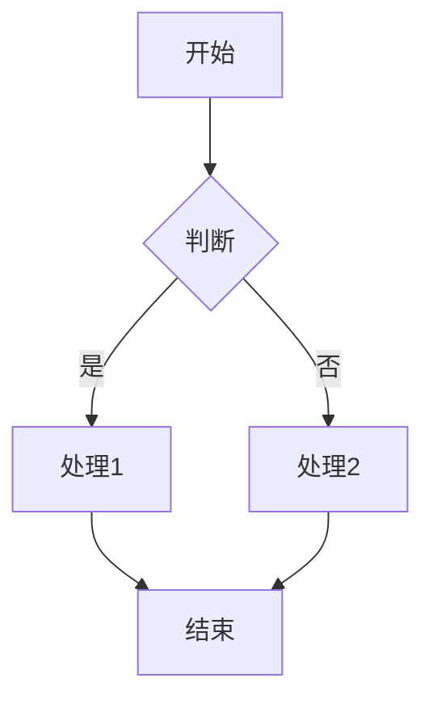

# 文档格式标准 V2.0

**版本**: 2.0  
**生效日期**: 2025年10月28日  
**状态**: 强制执行  
**适用范围**: 所有项目文档

---

## 🎯 文档头部（必须）

```markdown
# [文档标题] 2025

**版本**: X.Y  
**创建日期**: YYYY年MM月DD日  
**更新日期**: YYYY年MM月DD日  
**Rust版本**: 1.90.0  
**状态**: ✅ 完整 | 🚧 进行中 | 📝 草稿  
**作者**: [作者名]  
**审核**: [审核人]

---

## 📋 文档概述

[2-3句话简明扼要地说明文档目的、读者和核心内容]

**适用人群**: [初学者 | 中级开发者 | 高级开发者 | 架构师]  
**预计阅读时长**: [X分钟 | X小时]  
**前置知识**: [列出需要的基础知识]

---
```

## 📝 目录结构（必须）

### 2.1 统一的目录格式

```markdown
## 📋 目录

### 第一部分：基础篇
1. [第一章标题](#1-第一章标题)
   - 1.1 [第一节标题](#11-第一节标题)
   - 1.2 [第二节标题](#12-第二节标题)

2. [第二章标题](#2-第二章标题)
   - 2.1 [第一节标题](#21-第一节标题)
   - 2.2 [第二节标题](#22-第二节标题)

### 第二部分：进阶篇
3. [第三章标题](#3-第三章标题)
   - 3.1 [第一节标题](#31-第一节标题)
   - 3.2 [第二节标题](#32-第二节标题)

### 第三部分：高级篇
4. [第四章标题](#4-第四章标题)
   - 4.1 [第一节标题](#41-第一节标题)
   - 4.2 [第二节标题](#42-第二节标题)

---
```

### 2.2 标题编号规则

| 层级 | Markdown | 编号格式 | 示例 |
|------|----------|---------|------|
| **章** | `## 1.` | 数字 | `## 1. 基础概念` |
| **节** | `### 1.1` | 章.节 | `### 1.1 所有权系统` |
| **小节** | `#### 1.1.1` | 章.节.小节 | `#### 1.1.1 移动语义` |
| **段落** | `##### 1.1.1.1` | 章.节.小节.段 | `##### 1.1.1.1 基本规则` |

**禁止**：
- ❌ 字母编号（A. B. C.）
- ❌ 不规则编号（Q1.1, A.1）
- ❌ 无编号标题
- ❌ 跳号

## 💡 内容结构标准

### 3.1 章节结构模板

```markdown
## 🎯 [章节标题]

### 1.1 概述

[2-3段文字说明本章要解决什么问题，为什么重要]

**核心要点**:
- ✅ 要点1
- ✅ 要点2
- ✅ 要点3

---

### 1.2 基础概念

#### 1.2.1 概念定义

**定义**: [清晰的定义]

**特点**:
1. 特点1：[详细说明]
2. 特点2：[详细说明]
3. 特点3：[详细说明]

**示例**:

```rust
// 完整的代码示例
// 必须包含：
// 1. 注释说明
// 2. 可运行代码
// 3. 预期输出
fn example() {
    // 实现代码
}
```

**输出**:
```
预期输出结果
```

**解释**:
[详细解释代码如何工作，为什么这样设计]

---

#### 1.2.2 实际应用

**场景1: [场景名称]**

**问题**: [描述要解决的问题]

**解决方案**:

```rust
// 完整实现
```

**优势**:
- ✅ 优势1：[量化说明]
- ✅ 优势2：[量化说明]

**注意事项**:
- ⚠️ 注意1
- ⚠️ 注意2

---

### 1.3 对比分析

| 维度 | 方案A | 方案B | 推荐 |
|------|-------|-------|------|
| **性能** | [数据] | [数据] | ⭐⭐⭐ |
| **易用性** | [评价] | [评价] | ⭐⭐ |
| **场景** | [适用] | [适用] | - |

**选择建议**:
- 方案A适用于：[具体场景]
- 方案B适用于：[具体场景]

---

### 1.4 最佳实践

#### 1.4.1 推荐做法 ✅

```rust
// 推荐的代码
```

**理由**:
1. 原因1：[详细说明]
2. 原因2：[详细说明]

#### 1.4.2 避免做法 ❌

```rust
// 不推荐的代码
```

**问题**:
1. 问题1：[详细说明]
2. 问题2：[详细说明]

---

### 1.5 常见问题

**Q1: [问题]**

**A**: [详细回答，包含示例代码]

**Q2: [问题]**

**A**: [详细回答，包含示例代码]

---

### 1.6 小结

**本章总结**:
1. 核心点1：[总结]
2. 核心点2：[总结]
3. 核心点3：[总结]

**下一步**:
- [ ] 实践练习1
- [ ] 实践练习2
- [ ] 扩展阅读：[链接]

---
```

## 🔧 代码示例标准

### 4.1 代码块要求

```rust
// ✅ 完整示例（推荐）
// 
// 说明：这段代码演示XXX功能
// 用途：适用于YYY场景
// 性能：时间复杂度O(n)，空间复杂度O(1)

use std::collections::HashMap;

fn main() {
    // 1. 初始化
    let mut map = HashMap::new();
    
    // 2. 操作
    map.insert("key", "value");
    
    // 3. 验证
    assert_eq!(map.get("key"), Some(&"value"));
    
    println!("成功！");
}

// 预期输出：
// 成功！
```

### 4.2 代码注释规则

**必须包含**:
1. 功能说明
2. 参数说明
3. 返回值说明
4. 示例用法
5. 注意事项

```rust
/// 计算斐波那契数列的第n项
///
/// # 参数
/// * `n` - 要计算的项数（从0开始）
///
/// # 返回值
/// 第n项的值
///
/// # 示例
/// ```
/// let result = fibonacci(10);
/// assert_eq!(result, 55);
/// ```
///
/// # 注意
/// - 当n > 50时，可能溢出
/// - 时间复杂度：O(2^n)（未优化版本）
fn fibonacci(n: u32) -> u64 {
    match n {
        0 => 0,
        1 => 1,
        _ => fibonacci(n - 1) + fibonacci(n - 2),
    }
}
```

## 📊 表格标准

### 5.1 对比表格

```markdown
| 维度 | 方案A | 方案B | 方案C | 推荐指数 |
|------|-------|-------|-------|---------|
| **性能** | 100 QPS | 1000 QPS | 10000 QPS | ⭐⭐⭐ |
| **内存** | 10 MB | 100 MB | 1000 MB | ⭐⭐ |
| **复杂度** | 简单 | 中等 | 复杂 | ⭐⭐⭐ |
| **适用场景** | 小型项目 | 中型项目 | 大型项目 | - |
```

### 5.2 特性矩阵

```markdown
| 特性 | 支持 | 说明 | 版本 |
|------|------|------|------|
| **异步IO** | ✅ | 完全支持 | 1.39+ |
| **SIMD** | ✅ | 部分支持 | Nightly |
| **动态加载** | ⚠️ | 实验性 | Unstable |
| **GC** | ❌ | 不支持 | - |
```

## 🚀 图表标准

### 6.1 Mermaid图表

```markdown

```

### 6.2 ASCII艺术图

```markdown
```
┌─────────────────────────────────────┐
│          系统架构图                  │
├─────────────────────────────────────┤
│                                     │
│   API层                             │
│     ↓                               │
│   业务层                            │
│     ↓                               │
│   数据层                            │
│                                     │
└─────────────────────────────────────┘
```
```

## 🔍 列表标准

### 7.1 无序列表

```markdown
**特点**:
- ✅ 优点1：[详细说明，包含数据]
- ✅ 优点2：[详细说明，包含数据]
- ⚠️ 注意1：[详细说明]
- ❌ 缺点1：[详细说明]
```

### 7.2 有序列表

```markdown
**步骤**:
1. **第一步**：[详细说明]
   ```bash
   命令示例
   ```
   
2. **第二步**：[详细说明]
   ```bash
   命令示例
   ```

3. **第三步**：[详细说明]
   - 子步骤1
   - 子步骤2
```

## 💻 引用和链接标准

### 8.1 内部链接

```markdown
参见 [第3.2节 性能优化](#32-性能优化)

详细内容请查阅 [性能优化手册](./PERFORMANCE_OPTIMIZATION_COOKBOOK_2025.md#3-零拷贝技术)
```

### 8.2 外部链接

```markdown
- 📚 [Rust官方文档](https://doc.rust-lang.org/book/)
- 🦀 [Rust论坛](https://users.rust-lang.org/)
- 📦 [Crates.io](https://crates.io/)
```

### 8.3 参考文献

```markdown
## 参考文献

[1] Steve Klabnik, Carol Nichols. "The Rust Programming Language". No Starch Press, 2023.

[2] Jon Gjengset. "Rust for Rustaceans". No Starch Press, 2021.

[3] OpenTelemetry Specification v1.31.0. https://opentelemetry.io/docs/specs/otel/

[4] Tokio Documentation. https://tokio.rs/tokio/tutorial
```

## 📚 内容质量标准

### 9.1 实质性内容要求

**每个章节必须包含**:

✅ **定义明确**: 清晰的概念定义  
✅ **示例完整**: 可运行的代码示例  
✅ **解释详细**: 深入的原理说明  
✅ **数据支撑**: 量化的性能数据  
✅ **对比分析**: 多方案对比  
✅ **最佳实践**: 推荐和反模式  
✅ **常见问题**: FAQ解答  

❌ **禁止内容**:
- 空洞描述（"很快"、"很好"）
- 无代码示例的技术讨论
- 未验证的性能数据
- 过时的信息
- 无引用来源的数据

### 9.2 深度要求

| 文档类型 | 最低字数 | 代码示例 | 图表 | 参考文献 |
|---------|---------|---------|------|---------|
| **快速参考** | 5,000+ | 20+ | 5+ | 5+ |
| **深度指南** | 15,000+ | 50+ | 10+ | 10+ |
| **案例研究** | 20,000+ | 30+ | 15+ | 15+ |
| **API文档** | 10,000+ | 每API 1+ | 5+ | 5+ |

### 9.3 代码质量要求

**所有代码示例必须**:
- ✅ 可编译通过
- ✅ 包含完整测试
- ✅ 遵循Rust最佳实践
- ✅ 使用最新稳定版本
- ✅ 包含性能基准（如适用）
- ✅ 包含错误处理
- ✅ 添加详细注释

## ✅ 版本控制

### 10.1 版本号规则

```
版本格式: X.Y.Z

X: 主版本号（重大重构）
Y: 次版本号（新增章节）
Z: 修订号（内容修正）
```

### 10.2 更新日志

```markdown
## 版本历史

### v2.1.0 (2025-10-28)
**新增**:
- 新增第5章：高级特性

**修改**:
- 更新第2.3节：性能数据

**修复**:
- 修正第3.1节代码示例错误

### v2.0.0 (2025-10-27)
**重大更新**:
- 重构整体结构
- 统一编号系统
- 补充所有代码示例
```

## 🌟 文档尾部（必须）

```markdown
---

## 📚 相关资源

### 内部链接
- 📖 [快速参考手册](./RUST_QUICK_REFERENCE_2025.md)
- 💡 [FAQ深度解答](./RUST_FAQ_DEEP_DIVE_2025.md)
- 📝 [代码示例集](./RUST_CODE_EXAMPLES_2025.md)

### 外部资源
- 🦀 [Rust官方文档](https://doc.rust-lang.org/)
- 📚 [Rust语言圣经](https://course.rs/)
- 🎓 [Rust By Example](https://doc.rust-lang.org/rust-by-example/)

---

## 🔄 更新计划

- [ ] 补充第X章内容
- [ ] 添加更多代码示例
- [ ] 更新性能基准数据
- [ ] 增加视频教程链接

---

## 📝 贡献指南

欢迎贡献！请遵循以下规则：

1. **提Issue**: 报告错误或建议改进
2. **提PR**: 修复错误或添加内容
3. **遵循格式**: 严格遵循本文档格式标准
4. **代码审查**: 所有PR需要审查通过

---

## 📄 许可证

本文档采用 [CC BY-SA 4.0](https://creativecommons.org/licenses/by-sa/4.0/) 许可证。

---

## 📞 联系方式

- 📧 Email: [项目邮箱]
- 💬 Discord: [Discord链接]
- 🐦 Twitter: [@项目账号]

---

**文档版本**: X.Y.Z  
**最后更新**: YYYY年MM月DD日  
**维护者**: [维护者名单]  
**审核者**: [审核者名单]

---

> **阅读提示**: 
> - 🔰 初学者建议从第1章开始
> - 🎯 快速查找使用目录跳转
> - 💻 所有代码均可直接运行
> - 📊 性能数据基于Rust 1.90.0

**Happy Coding! 🦀**
```

---

## 🎓 检查清单

### 12.1 发布前检查

**结构检查**:
- [ ] 标题编号连续无跳号
- [ ] 目录与内容一致
- [ ] 所有链接有效
- [ ] 图表正确显示

**内容检查**:
- [ ] 每章有概述
- [ ] 每节有示例
- [ ] 代码可运行
- [ ] 数据有来源

**格式检查**:
- [ ] 遵循统一格式
- [ ] Markdown语法正确
- [ ] 代码块语言标注
- [ ] 表格对齐

**质量检查**:
- [ ] 无拼写错误
- [ ] 术语使用一致
- [ ] 无过时信息
- [ ] 有实质内容

---

**标准版本**: 2.0  
**生效日期**: 2025-10-28  
**强制执行**: ✅ 是  
**下次审查**: 2025-12-28

---

> **重要**: 所有文档必须严格遵循本标准，不符合标准的文档需要重写！

