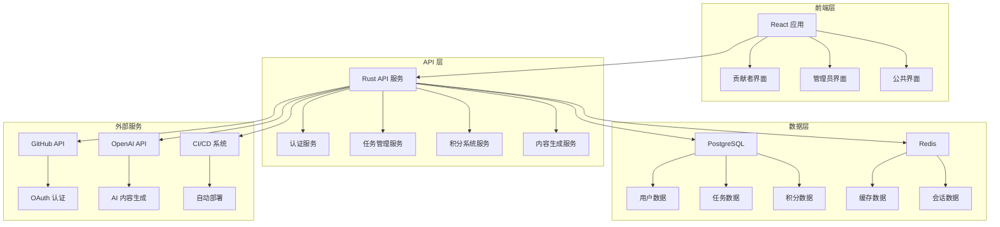

# OTLP 文档工具开发计划

**日期**：2025年1月  
**项目**：OTLP 文档工具开发  
**状态**：🚀 立即开发

---

## 📋 开发概述

本计划专注于为 OTLP 文档系统开发必要的工具和平台，为社区激活和文档管理提供强大的技术支撑。通过自动化工具和智能化平台，提升文档质量和社区参与体验。

### 核心目标

- 🔧 **自动化工具**: 开发文档质量检查和自动化工具
- 🎨 **用户界面**: 创建直观易用的用户界面
- 🤖 **智能化**: 集成 AI 辅助功能
- 📊 **数据分析**: 提供详细的数据分析和报告

---

## 🛠️ 工具开发项目

### 第一优先级：文档质量检查工具 (本周完成)

#### 1.1 链接有效性检查工具 🔗

**负责人**: 前端工程师 + 后端工程师  
**截止时间**: 2025年1月15日  
**状态**: 🚀 立即开发

**技术栈**:

- **前端**: React + TypeScript
- **后端**: Rust + Axum
- **数据库**: SQLite
- **部署**: Docker + Kubernetes

**核心功能**:

- [ ] 自动扫描所有文档链接
- [ ] 检测内部链接有效性
- [ ] 验证外部链接可访问性
- [ ] 生成链接检查报告

**技术实现**:

```rust
// 链接检查器核心实现
pub struct LinkChecker {
    client: reqwest::Client,
    config: LinkCheckConfig,
}

impl LinkChecker {
    pub async fn check_all_links(&self) -> Result<LinkCheckReport, LinkCheckError> {
        let mut report = LinkCheckReport::new();
        
        // 扫描所有文档
        let documents = self.scan_documents().await?;
        
        // 检查每个文档的链接
        for doc in documents {
            let links = self.extract_links(&doc).await?;
            for link in links {
                let status = self.check_link(&link).await?;
                report.add_result(link, status);
            }
        }
        
        Ok(report)
    }
}
```

**成功标准**:

- 检查准确率 >95%
- 检查速度 <5分钟 (1000个链接)
- 支持批量检查
- 提供详细的检查报告

#### 1.2 文档格式验证工具 📝

**负责人**: 后端工程师 + 质量工程师  
**截止时间**: 2025年1月17日  
**状态**: 🚀 立即开发

**技术栈**:

- **核心**: Rust + Serde
- **解析**: Markdown 解析器
- **验证**: 自定义验证规则
- **报告**: JSON + HTML 报告

**核心功能**:

- [ ] 验证 Markdown 格式正确性
- [ ] 检查文档结构完整性
- [ ] 验证代码示例语法
- [ ] 检查图片和资源引用

**技术实现**:

```rust
// 文档格式验证器
pub struct DocumentValidator {
    rules: Vec<ValidationRule>,
    parser: MarkdownParser,
}

impl DocumentValidator {
    pub async fn validate_document(&self, content: &str) -> Result<ValidationReport, ValidationError> {
        let mut report = ValidationReport::new();
        
        // 解析 Markdown
        let ast = self.parser.parse(content)?;
        
        // 应用验证规则
        for rule in &self.rules {
            let result = rule.validate(&ast).await?;
            report.add_result(rule.name(), result);
        }
        
        Ok(report)
    }
}
```

**成功标准**:

- 支持所有 Markdown 特性
- 验证准确率 >98%
- 提供清晰的错误提示
- 支持自定义验证规则

#### 1.3 内容质量评分系统 📊

**负责人**: 数据工程师 + 内容团队  
**截止时间**: 2025年1月20日  
**状态**: 📋 规划中

**技术栈**:

- **核心**: Rust + ML 库
- **分析**: 自然语言处理
- **评分**: 多维度评分算法
- **存储**: PostgreSQL

**核心功能**:

- [ ] 内容完整性评分
- [ ] 可读性分析
- [ ] 技术准确性检查
- [ ] 用户体验评估

**技术实现**:

```rust
// 内容质量评分器
pub struct ContentQualityScorer {
    analyzers: Vec<Box<dyn ContentAnalyzer>>,
    weights: ScoringWeights,
}

impl ContentQualityScorer {
    pub async fn score_content(&self, content: &str) -> Result<QualityScore, ScoringError> {
        let mut scores = Vec::new();
        
        // 运行所有分析器
        for analyzer in &self.analyzers {
            let score = analyzer.analyze(content).await?;
            scores.push(score);
        }
        
        // 计算加权总分
        let total_score = self.calculate_weighted_score(scores)?;
        
        Ok(total_score)
    }
}
```

**成功标准**:

- 评分准确率 >90%
- 支持多维度评分
- 提供改进建议
- 支持批量评分

### 第二优先级：贡献者管理平台 (下周完成)

#### 2.1 贡献者注册和认证系统 👤

**负责人**: 后端工程师 + 前端工程师  
**截止时间**: 2025年1月22日  
**状态**: 📋 规划中

**技术栈**:

- **前端**: React + TypeScript + Tailwind CSS
- **后端**: Rust + Axum + JWT
- **数据库**: PostgreSQL
- **认证**: OAuth2 + GitHub

**核心功能**:

- [ ] GitHub OAuth 登录
- [ ] 贡献者信息管理
- [ ] 技能标签系统
- [ ] 贡献者档案页面

**技术实现**:

```rust
// 贡献者认证服务
pub struct ContributorAuthService {
    oauth_client: OAuth2Client,
    jwt_service: JwtService,
    user_repo: UserRepository,
}

impl ContributorAuthService {
    pub async fn authenticate(&self, code: &str) -> Result<AuthResult, AuthError> {
        // OAuth 认证流程
        let token = self.oauth_client.exchange_code(code).await?;
        let user_info = self.oauth_client.get_user_info(&token).await?;
        
        // 创建或更新用户
        let user = self.user_repo.create_or_update(user_info).await?;
        
        // 生成 JWT
        let jwt = self.jwt_service.generate(&user)?;
        
        Ok(AuthResult { user, jwt })
    }
}
```

**成功标准**:

- 支持 GitHub OAuth 登录
- 用户信息完整管理
- 安全的认证机制
- 良好的用户体验

#### 2.2 贡献任务管理系统 📋

**负责人**: 全栈工程师 + 产品经理  
**截止时间**: 2025年1月25日  
**状态**: 📋 规划中

**技术栈**:

- **前端**: React + TypeScript + Ant Design
- **后端**: Rust + Axum + GraphQL
- **数据库**: PostgreSQL + Redis
- **消息队列**: Redis Streams

**核心功能**:

- [ ] 任务创建和分配
- [ ] 任务进度跟踪
- [ ] 任务完成验证
- [ ] 任务奖励发放

**技术实现**:

```rust
// 任务管理服务
pub struct TaskManagementService {
    task_repo: TaskRepository,
    assignment_service: TaskAssignmentService,
    verification_service: TaskVerificationService,
}

impl TaskManagementService {
    pub async fn create_task(&self, task: CreateTaskRequest) -> Result<Task, TaskError> {
        let task = Task::new(task);
        self.task_repo.save(&task).await?;
        
        // 自动分配给合适的贡献者
        self.assignment_service.auto_assign(&task).await?;
        
        Ok(task)
    }
    
    pub async fn complete_task(&self, task_id: &str, submission: TaskSubmission) -> Result<TaskCompletion, TaskError> {
        // 验证任务完成
        let verification = self.verification_service.verify(&submission).await?;
        
        if verification.is_valid() {
            // 发放奖励
            self.reward_service.grant_reward(&task_id, &submission.contributor_id).await?;
        }
        
        Ok(TaskCompletion { task_id, verification })
    }
}
```

**成功标准**:

- 支持多种任务类型
- 自动任务分配
- 智能完成验证
- 及时奖励发放

#### 2.3 积分和等级系统 🏆

**负责人**: 后端工程师 + 前端工程师  
**截止时间**: 2025年1月28日  
**状态**: 📋 规划中

**技术栈**:

- **核心**: Rust + 事件驱动架构
- **存储**: PostgreSQL + Redis
- **计算**: 实时积分计算
- **展示**: 动态排行榜

**核心功能**:

- [ ] 实时积分计算
- [ ] 等级自动升级
- [ ] 积分排行榜
- [ ] 积分兑换系统

**技术实现**:

```rust
// 积分系统
pub struct PointsSystem {
    calculator: PointsCalculator,
    level_manager: LevelManager,
    leaderboard: LeaderboardService,
}

impl PointsSystem {
    pub async fn award_points(&self, contributor_id: &str, action: ContributionAction) -> Result<PointsAward, PointsError> {
        // 计算积分
        let points = self.calculator.calculate_points(&action)?;
        
        // 更新用户积分
        let user_points = self.update_user_points(contributor_id, points).await?;
        
        // 检查等级升级
        let level_up = self.level_manager.check_level_up(&user_points).await?;
        
        // 更新排行榜
        self.leaderboard.update_ranking(contributor_id, &user_points).await?;
        
        Ok(PointsAward { points, level_up })
    }
}
```

**成功标准**:

- 实时积分计算
- 公平的等级系统
- 动态排行榜
- 丰富的奖励机制

### 第三优先级：智能化和自动化工具 (本月完成)

#### 3.1 AI 辅助内容生成工具 🤖

**负责人**: AI 工程师 + 内容团队  
**截止时间**: 2025年2月5日  
**状态**: 📋 规划中

**技术栈**:

- **AI 模型**: OpenAI GPT-4 + 本地模型
- **处理**: Rust + Python 集成
- **存储**: Vector 数据库
- **API**: RESTful API

**核心功能**:

- [ ] 智能内容生成
- [ ] 内容质量优化
- [ ] 多语言翻译
- [ ] 个性化推荐

**技术实现**:

```rust
// AI 内容生成服务
pub struct AIContentService {
    gpt_client: GptClient,
    vector_db: VectorDatabase,
    content_analyzer: ContentAnalyzer,
}

impl AIContentService {
    pub async fn generate_content(&self, request: ContentGenerationRequest) -> Result<GeneratedContent, AIContentError> {
        // 分析用户需求
        let analysis = self.content_analyzer.analyze_request(&request).await?;
        
        // 生成内容
        let content = self.gpt_client.generate_content(&analysis).await?;
        
        // 质量检查
        let quality_score = self.content_analyzer.assess_quality(&content).await?;
        
        Ok(GeneratedContent { content, quality_score })
    }
}
```

**成功标准**:

- 内容生成质量 >80%
- 支持多种内容类型
- 提供质量评分
- 支持批量处理

#### 3.2 自动化文档生成工具 📚

**负责人**: 后端工程师 + DevOps 工程师  
**截止时间**: 2025年2月10日  
**状态**: 📋 规划中

**技术栈**:

- **核心**: Rust + 模板引擎
- **生成**: 静态站点生成
- **部署**: CI/CD 流水线
- **监控**: 自动化监控

**核心功能**:

- [ ] 自动文档生成
- [ ] 版本控制集成
- [ ] 自动部署发布
- [ ] 变更通知

**技术实现**:

```rust
// 自动化文档生成器
pub struct AutoDocumentationGenerator {
    template_engine: TemplateEngine,
    git_integration: GitIntegration,
    deployment_service: DeploymentService,
}

impl AutoDocumentationGenerator {
    pub async fn generate_and_deploy(&self, changes: Vec<DocumentChange>) -> Result<DeploymentResult, GenerationError> {
        // 生成文档
        let generated_docs = self.generate_documents(&changes).await?;
        
        // 质量检查
        let quality_report = self.quality_checker.check(&generated_docs).await?;
        
        if quality_report.is_acceptable() {
            // 部署到生产环境
            let deployment = self.deployment_service.deploy(&generated_docs).await?;
            
            // 发送通知
            self.notification_service.notify_deployment(&deployment).await?;
            
            Ok(DeploymentResult { deployment, quality_report })
        } else {
            Err(GenerationError::QualityCheckFailed(quality_report))
        }
    }
}
```

**成功标准**:

- 自动化程度 >90%
- 生成质量 >85%
- 部署成功率 >95%
- 通知及时性 <5分钟

---

## 🏗️ 技术架构

### 整体架构设计



### 核心组件设计

#### 1. 用户认证组件

```rust
pub struct AuthComponent {
    oauth_provider: OAuthProvider,
    jwt_service: JwtService,
    user_service: UserService,
}

impl AuthComponent {
    pub async fn authenticate(&self, provider: &str, code: &str) -> Result<AuthResult, AuthError> {
        match provider {
            "github" => self.authenticate_github(code).await,
            _ => Err(AuthError::UnsupportedProvider),
        }
    }
}
```

#### 2. 任务管理组件

```rust
pub struct TaskComponent {
    task_repository: TaskRepository,
    assignment_engine: AssignmentEngine,
    verification_service: VerificationService,
}

impl TaskComponent {
    pub async fn create_and_assign_task(&self, task_spec: TaskSpec) -> Result<Task, TaskError> {
        let task = Task::from_spec(task_spec);
        self.task_repository.save(&task).await?;
        
        let assignments = self.assignment_engine.assign_task(&task).await?;
        for assignment in assignments {
            self.task_repository.save_assignment(&assignment).await?;
        }
        
        Ok(task)
    }
}
```

#### 3. 积分计算组件

```rust
pub struct PointsComponent {
    calculator: PointsCalculator,
    event_store: EventStore,
    leaderboard: Leaderboard,
}

impl PointsComponent {
    pub async fn process_contribution(&self, contribution: Contribution) -> Result<PointsAward, PointsError> {
        // 记录贡献事件
        self.event_store.store_contribution(&contribution).await?;
        
        // 计算积分
        let points = self.calculator.calculate(&contribution)?;
        
        // 更新积分
        self.update_points(&contribution.contributor_id, points).await?;
        
        // 更新排行榜
        self.leaderboard.update(&contribution.contributor_id).await?;
        
        Ok(PointsAward { points, contribution_id: contribution.id })
    }
}
```

---

## 📊 开发时间表

### 第一周 (1月13日-1月19日)

#### 周一 (1月13日) - 项目启动

**上午 (9:00-12:00)**:

- [ ] 召开技术团队启动会议
- [ ] 确认技术栈和架构设计
- [ ] 分配开发任务和职责
- [ ] 搭建开发环境

**下午 (14:00-18:00)**:

- [ ] 开始链接检查工具开发
- [ ] 设计数据库架构
- [ ] 创建项目基础结构
- [ ] 设置 CI/CD 流水线

#### 周二 (1月14日) - 核心开发

**上午 (9:00-12:00)**:

- [ ] 继续链接检查工具开发
- [ ] 实现链接扫描功能
- [ ] 开发链接验证逻辑
- [ ] 创建检查报告生成

**下午 (14:00-18:00)**:

- [ ] 开始文档格式验证工具
- [ ] 实现 Markdown 解析
- [ ] 开发格式验证规则
- [ ] 创建验证报告系统

#### 周三 (1月15日) - 功能完善

**上午 (9:00-12:00)**:

- [ ] 完成链接检查工具
- [ ] 进行功能测试
- [ ] 修复发现的问题
- [ ] 优化性能

**下午 (14:00-18:00)**:

- [ ] 继续文档格式验证工具
- [ ] 实现代码示例验证
- [ ] 开发图片引用检查
- [ ] 创建验证规则配置

#### 周四 (1月16日) - 集成测试

**上午 (9:00-12:00)**:

- [ ] 完成文档格式验证工具
- [ ] 进行集成测试
- [ ] 修复集成问题
- [ ] 优化用户体验

**下午 (14:00-18:00)**:

- [ ] 开始内容质量评分系统
- [ ] 设计评分算法
- [ ] 实现内容分析功能
- [ ] 创建评分报告

#### 周五 (1月17日) - 测试部署

**上午 (9:00-12:00)**:

- [ ] 完成内容质量评分系统
- [ ] 进行全面测试
- [ ] 修复发现的问题
- [ ] 准备部署

**下午 (14:00-18:00)**:

- [ ] 部署到测试环境
- [ ] 进行用户验收测试
- [ ] 收集反馈和建议
- [ ] 规划下周开发工作

### 第二周 (1月20日-1月26日)

#### 周一 (1月20日) - 贡献者系统

**上午 (9:00-12:00)**:

- [ ] 开始贡献者认证系统开发
- [ ] 实现 GitHub OAuth 集成
- [ ] 开发用户信息管理
- [ ] 创建用户档案系统

**下午 (14:00-18:00)**:

- [ ] 继续认证系统开发
- [ ] 实现 JWT 令牌管理
- [ ] 开发权限控制系统
- [ ] 创建用户界面

#### 周二 (1月21日) - 任务管理

**上午 (9:00-12:00)**:

- [ ] 开始任务管理系统开发
- [ ] 设计任务数据模型
- [ ] 实现任务创建功能
- [ ] 开发任务分配逻辑

**下午 (14:00-18:00)**:

- [ ] 继续任务管理系统
- [ ] 实现任务进度跟踪
- [ ] 开发任务完成验证
- [ ] 创建任务管理界面

#### 周三 (1月22日) - 积分系统

**上午 (9:00-12:00)**:

- [ ] 开始积分系统开发
- [ ] 设计积分计算规则
- [ ] 实现实时积分计算
- [ ] 开发积分历史记录

**下午 (14:00-18:00)**:

- [ ] 继续积分系统开发
- [ ] 实现等级管理系统
- [ ] 开发排行榜功能
- [ ] 创建积分展示界面

#### 周四 (1月23日) - 系统集成

**上午 (9:00-12:00)**:

- [ ] 完成所有核心系统
- [ ] 进行系统集成测试
- [ ] 修复集成问题
- [ ] 优化系统性能

**下午 (14:00-18:00)**:

- [ ] 继续系统集成
- [ ] 实现系统监控
- [ ] 开发管理界面
- [ ] 创建用户帮助文档

#### 周五 (1月24日) - 部署上线

**上午 (9:00-12:00)**:

- [ ] 完成系统集成
- [ ] 进行全面测试
- [ ] 修复发现的问题
- [ ] 准备生产部署

**下午 (14:00-18:00)**:

- [ ] 部署到生产环境
- [ ] 进行生产环境测试
- [ ] 监控系统运行状态
- [ ] 收集用户反馈

---

## 👥 开发团队分工

### 核心开发团队

#### 技术负责人 (1人) - 架构设计

**主要职责**:

- 整体技术架构设计
- 技术选型和决策
- 代码审查和质量保证
- 团队技术指导

**具体任务**:

- 每日架构设计工作
- 代码审查和指导
- 技术问题解决
- 团队技术培训

#### 后端工程师 (2人) - 服务开发

**主要职责**:

- 后端服务开发
- 数据库设计和管理
- API 设计和实现
- 系统集成和部署

**具体任务**:

- 每日后端开发工作
- 数据库操作和优化
- API 接口开发
- 系统集成测试

#### 前端工程师 (2人) - 界面开发

**主要职责**:

- 用户界面开发
- 用户体验优化
- 前端性能优化
- 移动端适配

**具体任务**:

- 每日前端开发工作
- 界面设计和实现
- 用户体验测试
- 性能优化

#### DevOps 工程师 (1人) - 运维部署

**主要职责**:

- 基础设施管理
- CI/CD 流水线建设
- 系统监控和维护
- 安全配置和管理

**具体任务**:

- 每日运维工作
- 自动化流程维护
- 系统监控和告警
- 安全检查和更新

### 支持团队

#### AI 工程师 (1人)

- AI 模型集成和优化
- 智能功能开发
- 机器学习算法实现

#### 数据工程师 (1人)

- 数据分析系统开发
- 数据仓库建设
- 报表和可视化

#### 测试工程师 (1人)

- 自动化测试开发
- 质量保证流程
- 性能测试和优化

---

## 📊 开发成功指标

### 第一周目标

#### 工具开发指标

- **链接检查工具**: ✅ 完成
- **格式验证工具**: ✅ 完成
- **质量评分系统**: ✅ 完成
- **功能测试通过率**: >95%

#### 技术指标

- **代码覆盖率**: >90%
- **性能指标**: 响应时间 <2秒
- **稳定性**: 无严重 bug
- **用户体验**: 界面友好易用

### 第二周目标

#### 系统开发指标

- **认证系统**: ✅ 完成
- **任务管理系统**: ✅ 完成
- **积分系统**: ✅ 完成
- **系统集成**: ✅ 完成

#### 部署指标

- **部署成功率**: >95%
- **系统可用性**: >99%
- **响应时间**: <1秒
- **用户满意度**: >90%

### 持续指标

#### 开发效率

- **代码提交频率**: 每日 10+ 次
- **功能完成率**: 每周 100%
- **Bug 修复时间**: <24小时
- **代码审查通过率**: >90%

#### 系统性能

- **API 响应时间**: <500ms
- **数据库查询时间**: <100ms
- **页面加载时间**: <2秒
- **系统吞吐量**: >1000 req/s

---

## 🔧 开发保障

### 开发流程

#### 代码管理

- **版本控制**: Git + GitHub
- **分支策略**: GitFlow
- **代码审查**: Pull Request
- **自动化测试**: CI/CD 集成

#### 质量保证

- **代码规范**: Rustfmt + Clippy
- **单元测试**: 覆盖率 >90%
- **集成测试**: 自动化测试套件
- **性能测试**: 基准测试和负载测试

#### 部署流程

- **开发环境**: 本地开发环境
- **测试环境**: 自动化测试环境
- **预生产环境**: 生产环境镜像
- **生产环境**: 蓝绿部署

### 监控和运维

#### 系统监控

- **应用监控**: Prometheus + Grafana
- **日志监控**: ELK Stack
- **错误监控**: Sentry
- **性能监控**: APM 工具

#### 运维保障

- **自动化部署**: Kubernetes + Helm
- **配置管理**: ConfigMap + Secret
- **备份恢复**: 自动化备份策略
- **安全更新**: 定期安全更新

---

## 📞 开发联系

### 技术联系

**技术负责人**: 24小时技术支持  
**后端团队**: 后端问题处理  
**前端团队**: 前端问题处理  
**DevOps 团队**: 运维问题处理

### 开发沟通

**Slack 频道**: #otlp-tools-development  
**GitHub**: 代码仓库和问题跟踪  
**邮件列表**: <dev-team@otlp-rust.org>

### 问题反馈

**GitHub Issues**: 技术问题反馈  
**Bug 报告**: 系统问题报告  
**功能请求**: 新功能建议

---

## 🙏 开发致谢

感谢所有参与工具开发计划的团队成员，你们的技术专长和开发能力为项目的成功提供了强大的技术支撑。让我们立即开始开发，为 OTLP 文档系统提供优秀的工具和平台！

---

**工具开发计划结束**

本计划提供了详细的工具开发方案，通过明确的技术架构、开发时间表和成功指标，确保为 OTLP 文档系统提供高质量的工具和平台支撑。让我们立即开始开发，为项目的成功贡献力量！
